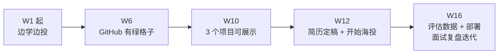

# AI Agent 从零学习路线 + 时间安排

> [!info] 关于本篇里的 wikilink
> 本篇是**计划文档**，其中的链接（如 [[MCP-协议详解]]、[[RAG-系统设计]]、[[AI-Agent-学习路线]] 等）分为两类：指向已存在笔记的正常链接，以及指向**尚未创建**笔记的规划链接。断链在此属正常，见 [[AI-Agent-学习路线#关于本篇里大量「尚未创建」的链接]]。

## 📊 个人背景分析

| 维度 | 现状 | 影响 |
|---|---|---|
| **学历** | 双非院校 | 多数 Agent 岗只写「本科及以上」，未卡 211；但简历筛选环节仍存在隐性门槛 → 靠可展示项目补 |
| **Linux** | 自建过 Hermes 服务（QQ Bot、cron、caddy） | ✅ 服务端部署有实战，容器化阶段省力 |
| **AI Agent** | 已跑通 Hermes Agent | ✅ 有直观认知，不是纯小白；==但要能说清它内部的 workflow 与 agent 边界== |
| **求职** | 目标腾讯/阿里/京东等 | 需 3-4 个月产出 ==2-3 个有 demo 视频 + README + 评估数据== 的项目 |
| **可用时间** | 每周 15-20 小时 | 按工作日每天 2h + 周末 5-10h 估算 |

> [!note] 学历这一栏的实话
> 抽样的 4 份 2026 校招 JD（携程、去哪儿、拼多多、立邦）**均只要求「本科及以上」，无院校限定**；仅一家早期全栈岗写了 985/211。结论：==对 Agent 应用岗而言，作品集权重高于院校==，但简历初筛仍是事实门槛，所以项目必须在 W12 前就有东西能拿出来。

---

## 🎯 16 周学习计划（与 [[AI-Agent-学习路线]] 严格对齐）

### 第一阶段：基础构建（第 1-3 周）

> **目标**：能独立调 API、理解 LLM 基础、跑通第一个 RAG

| 周 | 主题 | 具体内容 | 时间 | 产出 |
|---|---|---|---|---|
| **W1** | Python 回顾 + API 调用 | OpenAI SDK、多 Provider 切换、asyncio | 15h | 封装一个 LLM 调用类 |
| **W2** | LLM 基础 + Prompt | Transformer 概念、CoT、ReAct、结构化输出 | 15h | 10 个 Prompt 模板库 |
| **W3** | Function Calling | JSON Schema 定义工具、并行调用、错误处理 | 18h | 天气查询 Agent（工具调用） |

**检验标准**：能不看文档写出一个带工具调用的对话 Agent。

---

### 第二阶段：RAG 系统（第 4-6 周）

> **目标**：完整掌握 RAG 链路，能搭建知识库问答

| 周 | 主题 | 具体内容 | 时间 | 产出 |
|---|---|---|---|---|
| **W4** | 向量检索基础 | Embedding、Chroma/Milvus、分块策略 | 15h | 本地向量知识库 |
| **W5** | 完整 RAG 链路 | 文档解析 → 分块 → 检索 → 生成 | 18h | 个人文档问答系统 |
| **W6** | 高级 RAG | 多路召回、HyDE、Rerank、RAGAS 评估 | 18h | 优化后的 RAG + 评估报告 |

**检验标准**：用 Hermes Agent 的文档搭一个能回答"我上次做了什么"的系统。

---

### 第三阶段：Agent 框架（第 7-9 周）

> **目标**：掌握 LangGraph + CrewAI，能构建多 Agent 系统

| 周 | 主题 | 具体内容 | 时间 | 产出 |
|---|---|---|---|---|
| **W7** | LangChain 基础 | LCEL、Runnable、Memory、Tools | 15h | LangChain 版 Agent |
| **W8** | LangGraph 核心 | State/Node/Edge、图工作流、持久化 | 18h | 电商问数 Demo |
| **W9** | CrewAI 多 Agent | 角色定义、任务分配、协作模式 | 18h | 研究员+撰稿人双 Agent |

**检验标准**：独立完成一个多 Agent 协作系统，写到简历上。

---

### 第四阶段：项目实战（第 10-12 周）

> **目标**：产出 2-3 个可展示的项目，丰富简历

| 周 | 项目 | 技术栈 | 时间 | 简历描述 |
|---|---|---|---|---|
| **W10** | 智能客服 Agent | LangGraph + RAG + 转人工 | 18h | "基于 LangGraph 的智能客服系统，支持多轮对话与知识库检索" |
| **W11** | 深度研搜 Agent | CrewAI + 搜索 + 文件生成 | 18h | "多 Agent 协作研究系统，支持自动搜索、总结、生成报告" |
| **W12** | 个人 AI 助手 | Hermes Agent + MCP + 记忆 | 18h | "基于 Hermes 的个人助手，集成 MCP 协议与长期记忆" |

**检验标准**：3 个项目都有 Demo 视频 + GitHub 仓库 + 技术博客。

---

### 第五阶段：大模型微调（第 13-14 周）

> **目标**：理解什么时候该微调、什么时候提示词就够了（这是面试高频判断题）

| 周 | 主题 | 具体内容 | 时间 | 产出 |
|---|---|---|---|---|
| **W13** | 微调基础 | 全参 vs LoRA vs QLoRA、PEFT、灾难性遗忘 | 18h | 手写一个 LoRA 层 |
| **W14** | 训练实战 | LLaMA-Factory / Unsloth、数据集构建、SFT 与 DPO 概念 | 18h | 微调一个 7B 模型并对比微调前后 |

**检验标准**：能回答「为什么这个场景用 RAG 而不是微调」。

---

### 第六阶段：工程化 + 评估 + 面试（第 15-16 周）

> **目标**：能部署、能观测、能用数据证明效果、能讲清楚

| 周 | 主题 | 具体内容 | 时间 | 产出 |
|---|---|---|---|---|
| **W15** | 部署 + 可观测 | Docker、compose、流式输出、上下文管理、缓存与降级、Langfuse/OTel | 18h | 项目容器化 + 追踪面板 |
| **W16** | 评估闭环 + 面试 | 50 条评估集、组件级/轨迹级/结果级/成本级指标、简历打磨、项目讲解 | 18h | 评估报告 + 简历终稿 + 模拟面试 |

---

## 📅 每周时间分配（建议）

```
周一至周五：每天 2 小时（共 10h）
  ├── 理论学习：1h（看 B站/文档）
  └── 动手实践：1h（写代码/跑案例）

周末：5-10 小时
  ├── 项目实战：3-5h
  ├── 笔记整理：2h（Obsidian 输出）
  └── 复盘总结：1h
```

---

## 🎯 里程碑检查点

| 节点 | 时间 | 检验标准 | 未通过怎么办 |
|---|---|---|---|
| **M1** | W3 末 | 能写带工具调用的 Agent | 补 Python 基础，延期 1 周 |
| **M2** | W6 末 | 能搭完整 RAG 系统 | 重点补向量检索，多跑案例 |
| **M3** | W9 末 | 能构建多 Agent 系统，且能说清哪部分其实用 workflow 就够 | 先学 LangGraph，再补 CrewAI |
| **M4** | W12 末 | 3 个项目可展示（README + demo 视频） | 砍掉 1 个，保质量 |
| **M5** | W14 末 | 能讲清 RAG / 微调 / 提示词的选型边界 | 补 SFT、DPO 概念 |
| **M6** | W16 末 | 项目有评估数据 + 容器化部署 | 只做评估集，不做部署也要交 |

> [!tip] 里程碑的正确用法
> 连续两个节点未通过，不要继续往后堆内容 —— 直接把该阶段砍成「能用就行」的 MVP 版本，把时间挪给下一阶段。==计划崩了就改计划，不要硬撑==。

---

## ⚠️ 风险与应对

| 风险 | 概率 | 应对策略 |
|---|---|---|
| **Python 基础不牢** | 中 | W1 先测，不牢就补 1 周 |
| **API Key 费用** | 高 | 本地 Ollama 跑主力模型 + 免费额度跑长文本；2GB 内存机器别指望跑 7B 全参 |
| **教程质量参差** | 高 | B站合集标题夸大（自称 748 集、实测 94 分P），只作演示；==以官方文档 + 论文为准== |
| **框架学太深** | 高 | LangGraph/CrewAI 各控制在 18h，==能跑通就不钻源码== |
| **只学不产出** | 高 | 每个阶段强制绑定一个可运行产物，无产物不进入下一阶段 |
| **时间不够** | 中 | 保 W1-W9，砍 W10-W12 的 1 个项目 |
| **简历初筛卡学历** | 中 | W6 起维护 GitHub（绿格子），先投 3-5 家练手 |
| **秋招窗口** | 高 | 2026 校招投递集中在 8-9 月启动 → ==W1 就该边学边投==，不要等 W12 |

---

## 💡 求职对标

> [!warning] 抽样来源
> 下表基于 2026 年校招公开 JD 抽样（2026-09-25 检索），**不是**官方覆盖率统计。「覆盖」一列是我对本计划是否覆盖该条要求的判断，可被质疑。

| 岗位（2026 校招） | JD 中的硬性要求 | 本计划 | 缺口 |
|---|---|---|---|
| **携程 Agent 开发工程师** | 熟悉 LangChain / LlamaIndex / CrewAI 至少一种；Agent 记忆系统；**评测与观测能力建设** | ✅ W7-W9 + W15-W16 | 无明显缺口 |
| **去哪儿 AI 应用开发（全栈）** | 数据结构与算法、操作系统、**计算机网络**基础；流式输出、上下文管理、缓存与降级；知识库 + 评测集 + A/B 实验 | ✅ 部分 | 🔴 ==前端（React/Vue）与算法基础在本计划之外==，见 [[计算机网络基础]] |
| **拼多多 AI Agent 研发** | 任务规划、上下文管理、**长期/短期记忆**、工具调用；加分 SFT / RLHF / DPO | ✅ W7 + W13-W14 | 🔴 记忆系统实现偏浅，RLHF/DPO 只做概念 |
| **立邦 AI Agent 开发** | Agent skills、工具能力封装、**安全沙盒**、工作流编排、测试评估 | ✅ 3.0 架构选型 + W15-W16 | 🔴 沙盒实操偏少 |

**结论（不粉饰）**：本计划能把「==能做出来的项目==」补齐，但**算法基础和前端是结构性缺口**。双非背景下更现实的策略是：Agent 应用岗投 Agent 岗，别和算法岗硬碰；同时把 W1 的计算机基础（网络/操作系统/数据结构）当副线每天 30min 补。



> [!tip] 面试准备不是 W14 才开始
> JD 反复出现的词是：==评测、观测、记忆、沙盒、skills、流式输出、上下文管理==。这些词每一个都能对应本计划的一个章节，**从 W1 就该按「我项目里怎么解决的」来组织笔记**，而不是最后临时背。

---

## 🔗 相关链接

- [[AI-Agent-学习路线]]
- [[B站教程资源]]
- [[GitHub-ai-agents-from-zero]]
- [[Hermes-Agent-架构分析]]
- [[RAG-系统设计]]
- [[LangGraph-实战]]
- [[MCP-协议详解]]

---

*由 Hermes Agent 创建于 2026-09-09 · 更新于 2026-09-25 · 状态：进行中*
