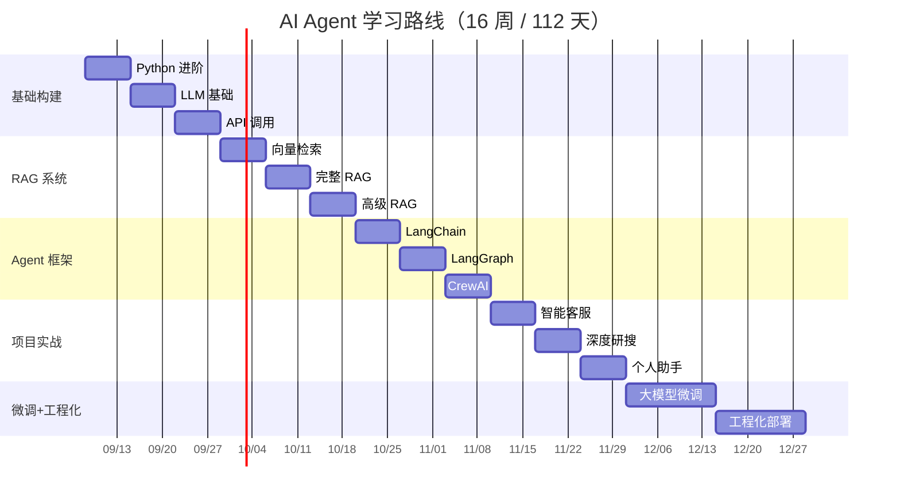
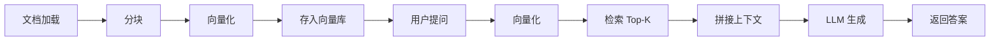
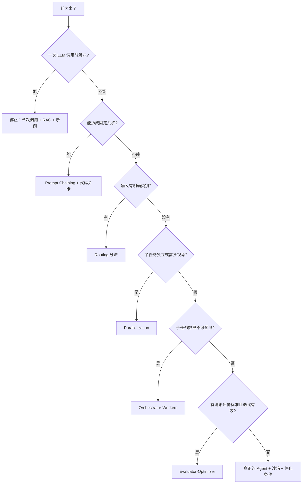
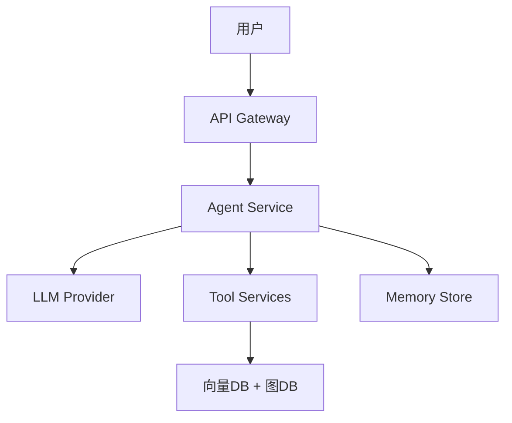

# [[AI-Agent-学习路线]]

> [!goal] 学习目标
> 从零开始系统学习 ==AI Agent 开发==，掌握从基础概念到生产部署的完整技能链，最终能独立构建 多 Agent 协作系统。

> [!info] 关于本篇里大量「尚未创建」的链接
> 本篇是**路线图**，正文保留的 wikilink 全部是**主题簇级**链接（共 9 个），指向按计划要写、但还不存在的笔记。
> - 原先散布的 200+ 条知识碎片链接已合并归簇，完整归属见文末「待建笔记清单」章节。
> - Obsidian 的断链是**特性而非缺陷**：写完一篇自动点亮一条。
> - 判断某条链接是否真有问题：==去 `Learning/` 下确认同名 `.md` 是否存在==；不存在的按「规划中」理解即可。
> - 路由图与 `[[多 Agent 协作系统]]` 等最终目标同理。

---

## 📊 学习进度

| 阶段 | 计划 | 状态 |
|---|---|---|
| 基础构建 | W1-W3 | 🟡 进行中 |
| RAG 系统 | W4-W6 | ⬜ 未开始 |
| Agent 框架 | W7-W9 | ⬜ 未开始 |
| 项目实战 | W10-W12 | ⬜ 未开始 |
| 大模型微调 | W13-W14 | ⬜ 未开始 |
| 工程化部署 | W15-W16 | ⬜ 未开始 |

**总进度**：🟩⬜⬜⬜⬜⬜ 10%

![[AI-Agent-学习时间安排]]

---

## 📅 学习甘特图



---

## 🎬 B站学习资源

| 资源 | 链接 | 说明 |
|---|---|---|
| **AI Agent 开发零基础教程** | https://www.bilibili.com/video/BV1xwVr6FEh4/ | 标题自称「全748集」，但 B站 API 实测仅 ==94 个分P==（2026-09-25 核验）。标题是营销话术，别按 748 集做计划 |
| **AI Agent 智能体搭建（检索入口）** | https://search.bilibili.com/all?keyword=AI+Agent | 站内搜索入口，不锁定 UP 主（此类合集质量波动大） |

---

## 📦 GitHub-开源教程

| 仓库 | 链接 | Star | 说明 |
|---|---|---|---|
| **didilili/ai-agents-from-zero** | https://github.com/didilili/ai-agents-from-zero | ⭐ 4.9k（2026-09-25 实测） | 完整学习路径 + 实战项目 + 面试题库；最近提交 2026-09-10，Python，仍在维护 |
| **在线阅读** | https://didilili.github.io/ai-agents-from-zero/#/ | | 在线文档 |

---

## 第一阶段：Python-进阶 + [[LLM-基础]] + API-调用

> [!success] 阶段目标
> 能独立调 API、理解 LLM 基础原理、跑通第一个带工具调用的 Agent

> [!warning] 检验标准
> 能不看文档写出一个带工具调用的对话 Agent

### 完成情况

- [ ] Python-进阶（W1：15h）
  - [ ] 类型系统
  - [ ] 异步编程
  - [ ] 设计模式
  - [ ] 函数式工具
- [ ] [[LLM-基础]]（W1-W2：15h）
  - [ ] Transformer-架构
  - [ ] MoE-混合专家
  - [ ] 主流模型对比
  - [ ] [[Prompt-Engineering]]
  - [ ] Tokenizer
- [ ] API-调用（W2：10h）
  - [ ] OpenAI-SDK
  - [ ] 多-Provider-封装

---

### 1.1 Python-进阶（W1：15h）

#### 1.1.1 类型系统

| 知识点 | 具体内容 | 学习方法 | 资源 |
|---|---|---|---|
| Type-Protocol | 结构化类型检查、runtime_checkable | 写一个带类型检查的装饰器 | Python 官方文档 |
| 泛型 | TypeVar、Generic、bound | 写一个通用缓存类 | Real Python |
| Pydantic | BaseModel、validator、Field | 写一个 API 响应模型 | Pydantic 文档 |
| 类型注解 | Optional、Union、Annotated | 重构一个旧项目 | mypy 文档 |

> [!todo] 实践产出
> 用 Pydantic 定义一个 Agent 的消息类型系统：
> - ==SystemMessage==
> - ==UserMessage==
> - ==ToolMessage==
> - ==AssistantMessage==

%% TODO: W1 结束后补充类型系统练习题 %%

#### 1.1.2 异步编程

| 知识点 | 具体内容 | 学习方法 | 资源 |
|---|---|---|---|
| asyncio | async/await、event loop、Task | 写一个并发爬虫 | Real Python |
| aiohttp | 异步 HTTP 客户端/服务端 | 写一个异步 API 调用类 | aiohttp 文档 |
| 异步生成器 | async for、yield | 实现流式输出 | Python 官方文档 |
| 并发控制 | Semaphore、gather、wait | 限制并发数的批量调用 | 官方文档 |

> [!tip] 学习技巧
> 先理解 `event loop` 的本质，再学 `async/await` 语法糖

> [!todo] 实践产出
> 用 asyncio + aiohttp 写一个能并发调用多个 LLM API 的调度器

#### 1.1.3 设计模式

| 模式 | 在 Agent 中的应用 | 学习方法 |
|---|---|---|
| 策略模式 | 切换不同 LLM Provider | 写一个 LLM Router |
| 观察者模式 | Agent 事件通知系统 | 写一个 EventBus |
| 工厂模式 | 创建不同类型的 Agent | 写一个 AgentFactory |
| 单例模式 | 全局配置管理 | 写一个 ConfigManager |
| 装饰器模式 | 工具函数的注册与调用 | 写一个 @tool 装饰器 |

> [!todo] 实践产出
> 用 策略模式 实现一个支持 OpenAI/Anthropic/本地模型 切换的 LLM 调用类

#### 1.1.4 函数式工具

| 工具 | 用途 | 学习方法 |
|---|---|---|
| functools.wraps | 保留函数元信息 | 写一个计时装饰器 |
| functools.lru_cache | 缓存函数结果 | 缓存 LLM 调用结果 |
| itertools.chain | 合并多个迭代器 | 合并多个工具调用结果 |
| operator.itemgetter | 快速提取字段 | 从响应中提取 content |

---

### 1.2 [[LLM-基础]]（W1-W2：15h）

#### 1.2.1 Transformer-架构

| 知识点 | 具体内容 | 学习方法 | 资源 |
|---|---|---|---|
| Self-Attention | Q/K/V 计算、缩放点积 | 动手画注意力矩阵 | 《动手学深度学习》 |
| 位置编码 | 绝对位置、相对位置、RoPE | 实现一个简单位置编码 | 论文原文 |
| KV-Cache | 推理优化、缓存机制 | 理解为什么需要 KV Cache | HuggingFace 文档 |
| 多头注意力 | 多头的作用、为什么有效 | 可视化注意力头 | BertViz |

> [!success] 学习方法
> 1. 先看 3Blue1Brown 的 Transformer 可视化视频
> 2. 再读《Attention Is All You Need》论文前 3 节[^1]
> 3. 用 PyTorch 写一个简单的 Attention 层

[^1]: Vaswani et al., "Attention Is All You Need", 2017. https://arxiv.org/abs/1706.03762

#### 1.2.2 MoE-混合专家

| 知识点 | 具体内容 | 学习方法 |
|---|---|---|
| 稀疏激活 | 每次只激活部分专家 | 对比 Dense vs MoE 的计算量 |
| 负载均衡 | 专家选择策略、辅助损失 | 读 DeepSeek-V2 论文 |
| 主流-MoE-模型 | Mixtral、DeepSeek、Qwen-MoE | 对比各模型专家数量 |

#### 1.2.3 主流模型对比

| 模型 | 特点 | 适用场景 | 学习方法 |
|---|---|---|---|
| GPT-4o | 多模态、低延迟 | 通用 Agent | 调用 API 测试 |
| Claude-3.5 | 长上下文、安全 | 复杂推理 | 调用 API 测试 |
| Gemini-1.5 | 超长上下文 | 文档分析 | 调用 API 测试 |
| LLaMA-3 | 开源、可微调 | 本地部署 | Ollama 本地跑 |
| Qwen-2.5 | 中文好、开源 | 中文场景 | 调用 API 测试 |

> [!todo] 实践产出
> 写一个脚本，同一问题发给 5 个模型，对比回答质量、延迟、价格

#### 1.2.4 [[Prompt-Engineering]]

| 技术 | 说明 | 示例 | 学习方法 |
|---|---|---|---|
| Zero-shot | 不给例子 | "翻译成英文" | 对比不同措辞 |
| Few-shot | 给几个例子 | "苹果→apple，香蕉→banana，橘子→" | 设计例子库 |
| Chain-of-Thought | 让模型一步步想 | "请一步一步推理" | 数学题测试 |
| ReAct | 推理+行动交替 | Thought→Action→Observation | 写一个 ReAct Agent |
| 结构化输出 | JSON/Schema 约束 | "请用 JSON 输出，字段包括..." | 测试各种 Schema |

> [!todo] 实践产出
> 为每种技术写 5 个 Prompt 模板，建立个人 Prompt 库

#### 1.2.5 Tokenizer

| 知识点 | 具体内容 | 学习方法 |
|---|---|---|
| BPE | 字节对编码、合并规则 | 用 tiktoken 测试中英文 token 数 |
| SentencePiece | Unigram 模型 | 对比 BPE vs SentencePiece |
| Token-计算 | 如何估算 token 数 | 写一个 token 计数器 |
| 上下文窗口 | 为什么有限制、如何管理 | 测试不同模型的 max_tokens |

> [!todo] 实践产出
> 用 tiktoken 写一个工具，输入文本返回 token 数和预估费用

---

### 1.3 API-调用（W2：10h）

#### 1.3.1 OpenAI-SDK

```python
# 基础调用
from openai import OpenAI
client = OpenAI(api_key="sk-...")
response = client.chat.completions.create(
    model="gpt-4o",
    messages=[{"role": "user", "content": "Hello"}]
)

# 流式调用
for chunk in client.chat.completions.create(
    model="gpt-4o",
    messages=[{"role": "user", "content": "Hello"}],
    stream=True
):
    print(chunk.choices[0].delta.content, end="")

# 工具调用
response = client.chat.completions.create(
    model="gpt-4o",
    messages=[{"role": "user", "content": "北京天气怎么样"}],
    tools=[{
        "type": "function",
        "function": {
            "name": "get_weather",
            "description": "获取天气",
            "parameters": {
                "type": "object",
                "properties": {
                    "city": {"type": "string", "description": "城市名"}
                },
                "required": ["city"]
            }
        }
    }]
)
```

#### 1.3.2 多-Provider-封装

```python
class LLMRouter:
    """支持 OpenAI / Anthropic / 本地模型 切换"""
    
    def __init__(self, provider="openai"):
        self.provider = provider
        self.clients = {
            "openai": OpenAI(),
            "anthropic": Anthropic(),
            "ollama": OpenAI(base_url="http://localhost:11434/v1")
        }
    
    def chat(self, messages, **kwargs):
        client = self.clients[self.provider]
        return client.chat.completions.create(
            model=self._get_model(),
            messages=messages,
            **kwargs
        )
```

> [!todo] 实践产出
> 封装一个支持 OpenAI/Anthropic/Ollama 的统一调用类

---

## 第二阶段：RAG-系统（第 4-6 周）

> [!success] 阶段目标
> 完整掌握 RAG 链路，能搭建知识库问答系统

> [!warning] 检验标准
> 用 Hermes Agent 的文档搭一个能回答"我上次做了什么"的系统

### 完成情况

- [ ] 向量检索基础（W4：15h）
- [ ] 完整-RAG-链路（W5：18h）
- [ ] 高级-RAG（W6：18h）

---

### 2.1 向量检索基础（W4：15h）

#### 2.1.1 Embedding

| 知识点 | 具体内容 | 学习方法 | 资源 |
|---|---|---|---|
| 向量化原理 | 文本→向量、语义空间 | 用不同模型对比句子的向量距离 | OpenAI 文档 |
| 主流-Embedding | text-embedding-3、BGE、m3e、GTE | 同一句子用不同模型编码，对比效果 | MTEB 排行榜 |
| 维度选择 | 256/512/1024/1536 维 | 测试不同维度对检索效果的影响 | 论文 |
| 相似度计算 | 余弦相似度、点积、欧氏距离 | 手写实现三种相似度 | NumPy |

> [!todo] 实践产出
> 用 OpenAI-Embedding API 把 100 篇文档向量化，存入 Chroma

#### 2.1.2 [[向量数据库]]

| 数据库 | 特点 | 适用场景 | 学习方法 |
|---|---|---|---|
| Chroma | 轻量、嵌入式 | 本地开发 | 官方 Quickstart |
| Milvus | 分布式、高性能 | 生产环境 | 官方文档 |
| Qdrant | Rust 编写、过滤强 | 结构化检索 | 官方文档 |
| Pinecone | 全托管 | 快速上线 | 官方文档 |
| Weaviate | 多模态 | 图文混合 | 官方文档 |

> [!todo] 实践产出
> 用 Chroma 搭建一个本地向量库，支持增删改查

#### 2.1.3 分块策略

| 策略 | 说明 | 适用场景 | 实现方法 |
|---|---|---|---|
| 固定大小 | 每 N 字符一块 | 通用 | 滑动窗口 |
| 递归分块 | 按标题/段落递归 | 长文档 | LangChain RecursiveCharacterTextSplitter |
| 语义分块 | 按语义边界切分 | 高质量 | 用 Embedding 相似度检测边界 |
| 滑动窗口 | 重叠窗口 | 不漏信息 | stride=100, window=500 |

> [!todo] 实践产出
> 对同一文档用不同策略分块，对比检索效果

---

### 2.2 完整-RAG-链路（W5：18h）

#### 2.2.1 文档解析

| 格式 | 工具 | 说明 |
|---|---|---|
| PDF | Marker、MinerU、PyMuPDF | 支持表格、图片 |
| DOCX | python-docx | 保留格式 |
| HTML | BeautifulSoup、trafiluta | 去除导航栏 |
| Markdown | 直接读取 | 保留结构 |

#### 2.2.2 RAG-完整流程



> [!todo] 实践产出
> 搭一个能回答 Hermes Agent 文档的问答系统

#### 2.2.3 LangChain-RAG-实现

```python
from langchain.text_splitter import RecursiveCharacterTextSplitter
from langchain_community.vectorstores import Chroma
from langchain_openai import OpenAIEmbeddings, ChatOpenAI
from langchain.chains import RetrievalQA

# 1. 加载文档
loader = DirectoryLoader("./docs", glob="*.md")
docs = loader.load()

# 2. 分块
splitter = RecursiveCharacterTextSplitter(chunk_size=500, chunk_overlap=50)
splits = splitter.split_documents(docs)

# 3. 向量化 + 存储
vectorstore = Chroma.from_documents(
    documents=splits,
    embedding=OpenAIEmbeddings(),
    persist_directory="./chroma_db"
)

# 4. 检索 + 生成
qa = RetrievalQA.from_chain_type(
    llm=ChatOpenAI(model="gpt-4o"),
    chain_type="stuff",
    retriever=vectorstore.as_retriever(k=5)
)
result = qa.invoke("Hermes Agent 怎么配置 cron？")
```

---

### 2.3 高级-RAG（W6：18h）

#### 2.3.1 查询优化

| 技术 | 说明 | 效果 |
|---|---|---|
| Query-Expansion | 生成多个相似问题 | 提高召回率 |
| HyDE | 假设性文档嵌入 | 提高匹配精度 |
| Step-back-Prompting | 抽象到更高层次 | 复杂问题 |
| Multi-query | 多角度查询 | 全面覆盖 |

#### 2.3.2 检索优化

| 技术 | 说明 | 效果 |
|---|---|---|
| Rerank | 重排序 | 提高精度 |
| 混合检索 | 向量 + BM25 | 互补优势 |
| 过滤检索 | 按元数据过滤 | 精准检索 |
| 上下文压缩 | 只保留相关部分 | 减少噪声 |

#### 2.3.3 [[RAG-评估]]

| 指标 | 说明 | 工具 |
|---|---|---|
| Faithfulness | 回答是否基于检索内容 | RAGAS |
| Relevance | 回答是否相关 | RAGAS |
| Context-Recall | 检索是否全面 | RAGAS |
| Answer-Correctness | 回答是否正确 | RAGAS |

> [!todo] 实践产出
> 用 RAGAS 评估自己的 RAG 系统，输出评估报告

---

## 第三阶段：[[Agent-框架]]（第 7-9 周）

> [!success] 阶段目标
> 掌握 LangGraph + CrewAI，能构建多 Agent 系统

> [!warning] 检验标准
> 独立完成一个多 Agent 协作系统，写到简历上

### 完成情况

- [ ] LangChain-基础（W7：15h）
- [ ] LangGraph-核心（W8：18h）
- [ ] CrewAI-多-Agent（W9：18h）

---

### 3.0 [[Agent-架构模式]]（W7 前置 · 2h · 必做）

> [!warning] 为什么放在框架之前
> 多数自称「Agent」的项目其实是 ==Workflow==。不先分清两者区别，学框架就会变成「为了用 LangGraph 而用 LangGraph」。

#### 3.0.1 Workflow-vs-Agent

| 维度 | Workflow（工作流） | Agent（智能体） |
|---|---|---|
| 控制权 | 路径由 ==代码预定义== | 模型 ==动态决定== 下一步 |
| 成本与延迟 | 低且可预测 | 高且波动大 |
| 错误行为 | 路径固定，出错易定位 | 早期判断偏差会 ==向后累积== |
| 适用场景 | 步骤明确、路径可预测 | 开放式、连步数都不可预测 |
| 停止条件 | 由代码决定 | 必须显式设置上限与人工检查点 |

> [!tip] 选型铁律
> 能用单次 LLM 调用解决的就别上 Workflow；能用 Workflow 解决的就别上 Agent。复杂度要用 ==可测量的收益== 来换。



#### 3.0.2 五种 Workflow-模式

| 模式 | 做法 | 适用场景 | 本路线对应项目 |
|---|---|---|---|
| **Prompt Chaining** | 拆成顺序子任务，上一步输出喂下一步；中间可加代码「关卡」校验 | 任务能干净拆成固定步骤 | 深度研搜-Agent 的「检索→清洗→成稿」 |
| **Routing** | 先分类，再分发到专门的提示词/模型分支 | 输入类别差异大；可用小模型分流省钱 | 智能客服-Agent 的意图识别 |
| **Parallelization** | ① Sectioning：独立子任务并行后聚合<br>② Voting：同一任务多视角跑再投票 | 子任务互不依赖；或需要多视角提高置信度 | 研搜 Agent 的多源并行检索 + 交叉验证 |
| **Orchestrator-Workers** | 中枢 LLM 动态拆任务、派给 worker、汇总结果 | 子任务的数量与内容事先无法预测 | 深度研搜-Agent 的主 Agent 调度 |
| **Evaluator-Optimizer** | 一个生成、一个评估反馈，循环打磨 | 有明确评价标准，且迭代确实能提升质量 | 「写代码 → 跑测试 → 修错」循环 |

#### 3.0.3 ACI-工具设计（最被低估的部分）

> [!tip] 核心观点
> Agent 本质是「一个 LLM 在循环里根据反馈选工具」。因此 ==工具文档的质量比提示词的质量更重要==。工具的命名、描述、参数、错误信息，要像设计 UI 一样打磨。

| 实践 | 做法 | 反面例子 |
|---|---|---|
| 命名 | 与人类工程师的叫法一致 | `exec_op_01` |
| 描述 | 用自然语言写清**何时该用、何时不该用** | 只给一句「执行操作」 |
| 参数 | 用与模型日常语料相近的格式（Markdown / diff 优于数字行号） | 让模型数几千行行号、做字符串转义 |
| 示例 | 至少给 1 个正常 + 1 个边界用例 | 无示例 |
| 错误信息 | 写清「下一步该怎么做」，可操作 | 只回 `failed` |
| 去重 | 合并功能几乎相同的工具 | 同时提供 `read_file` 和 `cat_file` |
| 防呆 | 通过参数设计让模型难以犯错 | 布尔开关满天飞 |

> [!note] 本节权威资料（2026-09-25 核验 200）
> - Anthropic《Building Effective Agents》：https://www.anthropic.com/engineering/building-effective-agents
> - Anthropic《Writing Tools for Agents》：https://www.anthropic.com/engineering/writing-tools-for-agents

**填空题**

1. Workflow 与 Agent 的分界线在于：路径由 ==代码预定义==，还是由 ==模型动态决定==。
2. 五个 Workflow 模式中，「先分类再分发到专门分支」的是 ______；「中枢动态拆任务并派发」的是 ______。
3. Parallelization 的两种变体是 ______（独立子任务并行后聚合）与 ______（同一任务多视角再投票）。
4. Agent 的错误会 ==向后累积==，因此生产环境必须配 ______ 环境与人工检查点。

**答案**：
1. 代码预定义, 模型动态决定
2. Routing, Orchestrator-Workers
3. Sectioning, Voting
4. 沙箱

---

### 3.1 LangChain-基础（W7：15h）

#### 3.1.1 核心组件

| 组件 | 说明 | 学习方法 |
|---|---|---|
| Model-IO | Model、Prompt、Parser | 写一个完整的调用链 |
| LCEL | LangChain Expression Language | 用 \| 运算符链式调用 |
| Memory | 对话记忆、长期记忆 | 实现一个带记忆的 Agent |
| Tools | 工具定义、工具选择 | 写 5 个自定义工具 |
| Retrieval | 检索器、向量存储 | 接入 RAG |
| Agent | Agent 类型、执行器 | 写一个 ReAct Agent |

#### 3.1.2 LCEL-语法

```python
from langchain_core.runnables import RunnablePassthrough
from langchain_core.output_parsers import StrOutputParser

# 链式调用
chain = (
    {"context": retriever, "question": RunnablePassthrough()}
    | prompt
    | llm
    | StrOutputParser()
)
result = chain.invoke("问题")
```

---

### 3.2 LangGraph-核心（W8：18h）

#### 3.2.1 核心概念

| 概念 | 说明 | 学习方法 |
|---|---|---|
| State | 图的状态，在节点间传递 | 定义一个 AgentState |
| Node | 执行单元，接收 State 返回更新 | 写一个工具调用节点 |
| Edge | 节点间的连接 | 定义流转逻辑 |
| Conditional-Edge | 条件分支 | 根据状态选择下一个节点 |
| Checkpoint | 持久化状态 | 实现断点续传 |

#### 3.2.2 图的结构

```python
from langgraph.graph import StateGraph

# 1. 定义 State
class AgentState(TypedDict):
    messages: Annotated[list, add_messages]
    next_step: str
    tool_calls: list

# 2. 定义 Node
def agent_node(state: AgentState):
    response = llm.invoke(state["messages"])
    return {"messages": [response]}

def tool_node(state: AgentState):
    results = []
    for tool_call in state["tool_calls"]:
        result = execute_tool(tool_call)
        results.append(result)
    return {"messages": results}

# 3. 定义图
graph = StateGraph(AgentState)
graph.add_node("agent", agent_node)
graph.add_node("tools", tool_node)
graph.add_edge("agent", "tools")
graph.add_conditional_edges("tools", should_continue)
app = graph.compile()
```

#### 3.2.3 多-Agent-模式

| 模式 | 说明 | 适用场景 |
|---|---|---|
| Supervisor | 一个主管分配任务 | 简单协作 |
| Handoff | Agent 间交接任务 | 流水线 |
| Swarm | 平等协商 | 复杂决策 |
| Graph | 图编排 | 复杂工作流 |

> [!todo] 实践产出
> 用 LangGraph 实现电商问数 Agent（NL2SQL）

---

### 3.3 CrewAI-多-Agent（W9：18h）

#### 3.3.1 核心概念

| 概念 | 说明 | 学习方法 |
|---|---|---|
| Agent | 角色、目标、背景故事 | 定义一个 Researcher |
| Task | 描述、预期输出、Agent | 定义一个研究任务 |
| Crew | Agent 集合、执行策略 | 创建一个 3 Agent 团队 |
| Process | 顺序执行 vs 层级执行 | 对比两种模式 |

#### 3.3.2 代码示例

```python
from crewai import Agent, Task, Crew

researcher = Agent(
    role="研究员",
    goal="收集关于 AI Agent 的最新进展",
    backstory="你是一位 AI 领域的研究员...",
    tools=[search_tool, scrape_tool]
)

writer = Agent(
    role="撰稿人",
    goal="将研究结果写成技术文章",
    backstory="你是一位技术作家..."
)

research_task = Task(
    description="搜索 2026 年 AI Agent 最新进展",
    expected_output="一份包含 10 条新闻的研究报告",
    agent=researcher
)

write_task = Task(
    description="根据研究结果写一篇 2000 字文章",
    expected_output="Markdown 格式的技术文章",
    agent=writer
)

crew = Crew(
    agents=[researcher, writer],
    tasks=[research_task, write_task],
    process=Process.sequential
)
result = crew.kickoff()
```

> [!todo] 实践产出
> 用 CrewAI 构建"研究员 + 审稿人 + 撰稿人"三 Agent 系统

---

## 第四阶段：项目实战（第 10-12 周）

> [!success] 阶段目标
> 产出 2-3 个可展示的项目，丰富简历

> [!warning] 检验标准
> 3 个项目都有 Demo 视频 + GitHub 仓库 + 技术博客

### 完成情况

- [ ] 智能客服-Agent（W10：18h）
- [ ] 深度研搜-Agent（W11：18h）
- [ ] 个人-AI-助手（W12：18h）

---

### 4.1 智能客服-Agent（W10：18h）

| 模块 | 技术 | 说明 |
|---|---|---|
| 意图识别 | LangGraph + 分类 | 识别用户意图 |
| 知识库 | RAG + 向量检索 | 回答常见问题 |
| 多轮对话 | Memory + 状态管理 | 上下文理解 |
| 转人工 | 条件判断 + 工单创建 | 复杂问题转人工 |
| 对话复盘 | 日志分析 + 总结 | 持续优化 |

> [!success] 简历描述
> "基于 LangGraph 的智能客服系统，支持多轮对话、知识库检索、自动转人工，日均处理 100+ 咨询"

---

### 4.2 深度研搜-Agent（W11：18h）

| 模块 | 技术 | 说明 |
|---|---|---|
| 主-Agent | CrewAI | 任务分解 |
| 搜索-Agent | Serper API | 网络搜索 |
| 总结-Agent | LLM | 内容总结 |
| 文件生成 | Markdown/PDF | 报告输出 |
| 实时进度 | WebSocket | 前端展示 |

> [!success] 简历描述
> "多 Agent 协作研究系统，支持自动搜索、总结、生成报告，接入 WebSocket 实时进度回传"

---

### 4.3 个人-AI-助手（W12：18h）

| 模块 | 技术 | 说明 |
|---|---|---|
| 核心 | Hermes Agent | 基础框架 |
| MCP-接入 | MCP Server | 搜索、文件、数据库 |
| 长期记忆 | Honcho / Mem0 | 跨会话记忆 |
| 多平台 | QQ Bot / Telegram | 多端接入 |

> [!success] 简历描述
> "基于 Hermes Agent 的个人助手，集成 MCP 协议与长期记忆，支持多平台接入"

---

## 第五阶段：[[大模型微调]]（第 13-14 周）

> [!success] 阶段目标
> 掌握 LoRA 微调流程，能针对特定场景优化模型

> [!warning] 检验标准
> 完成一个 LoRA 微调案例，对比微调前后效果

### 完成情况

- [ ] 微调基础
- [ ] 训练框架
- [ ] 数据集构建

---

### 5.1 微调基础

| 知识点 | 具体内容 | 学习方法 |
|---|---|---|
| 全参数微调 | 更新所有参数 | 理解为什么贵 |
| LoRA | 低秩适配、只训练部分参数 | 手写 LoRA 层 |
| QLoRA | 量化 + LoRA | 用 bitsandbytes |
| PEFT | 参数高效微调库 | 官方文档 |

### 5.2 训练框架

| 框架 | 特点 | 学习方法 |
|---|---|---|
| Llama-Factory | 图形界面、易用 | 官方 Quickstart |
| DeepSpeed | 分布式训练 | 官方文档 |
| vLLM | 推理部署 | 官方文档 |

### 5.3 数据集构建

| 格式 | 说明 | 示例 |
|---|---|---|
| Alpaca | instruction/input/output | 通用指令 |
| ShareGPT | 多轮对话 | 对话数据 |
| 自定义 | 业务数据 | 领域数据 |

> [!todo] 实践产出
> 用 Llama-Factory 完成一个 LoRA 微调案例

---

## 第六阶段：工程化与部署（第 15-16 周）

> [!success] 阶段目标
> 能部署、能监控、能讲清楚

> [!warning] 检验标准
> 项目容器化部署，能答 80% 面试题

### 完成情况

- [ ] 容器化
- [ ] 可观测性
- [ ] 部署架构
- [ ] 评估闭环（W16：8h）· 无评估就没有迭代

---

### 6.1 容器化

| 工具 | 用途 | 学习方法 |
|---|---|---|
| Docker | 容器化 | 写 Dockerfile |
| Docker-Compose | 多服务 | 写 docker-compose.yml |
| Kubernetes | 集群部署 | 了解基本概念 |

### 6.2 可观测性

| 工具 | 用途 | 学习方法 |
|---|---|---|
| LangSmith | LangChain 追踪 | 官方文档 |
| Langfuse | 开源可观测 | 官方文档 |
| OpenTelemetry | 分布式追踪 | 官方文档 |

### 6.3 部署架构



### 6.4 评估闭环（W16：8h · 求职面试高频）

> [!warning] 为什么必须单独成一节
> 没有评估集，所有「优化」都是自我感觉。面试官问「你怎么知道改动有效」，答不上来直接掉分。

| 层级 | 评什么 | 典型做法 |
|---|---|---|
| **组件级** | 单次调用质量 | 固定测试集跑 100 条，比对改前改后 |
| **轨迹级** | Agent 走了哪些步骤 | 记录 tool_calls 序列、步数、是否走死循环 |
| **结果级** | 任务是否真的完成 | 规则校验（JSON schema、是否含答案）+ 人工抽检 |
| **成本级** | token / 延迟 / 费用 | 每任务的 token 数、P50/P95 延迟 |

| 工具 | 用途 | 链接（2026-09-25 核验） |
|---|---|---|
| RAGAS | RAG 指标：faithfulness / answer relevance / context recall | https://github.com/explodinggradients/ragas |
| LangSmith | 追踪 + 评估 + 数据集管理 | https://docs.langchain.com/langsmith/evaluation |
| Langfuse | 开源可观测 + 评估 | https://langfuse.com/ |
| DeepEval | pytest 风格的 LLM 单元测试 | https://github.com/confident-ai/deepeval |

**综合项目**：给你的智能客服 Agent 建一个 ==50 条评估集==（含 10 条故意刁钻的问题），跑出基线分数，然后故意改坏 prompt 再跑一次，用数字证明改动是负向的。这份「用数据证明改动好坏」的截图就是简历素材。

---

## 🗂️ 主题簇清单（14 个 · 已全部完成 ✅）

> [!success] 14 个主题簇已全部写完（2026-09-26）
> 本篇原先散布着 200+ 条指向知识碎片的 wikilink（`HyDE`、`Multi-query`、`查询优化`、`Checkpoint`…），已合并归簇；下表的 **14 篇笔记现已全部存在于 `Learning/agent/`**。
> - 断链从 **216 条降到 0 条**（除路线图自身的前向引用）
> - 计划中簇：`Agent-部署与监控` 与 `多 Agent 协作系统` 已被现有笔记覆盖，不再单独建篇
> - 剩余 `%% TODO %%` 属于**学习进度标记**（W1 学完后补练习题），不是待建笔记

| # | 簇（未来笔记名） | 覆盖的知识点 | 建议篇幅 | 建议阶段 |
|---|---|---|---|---|
| 1 | Python 工程基础 | 类型系统、类型注解、泛型、设计模式（单例/工厂/策略/装饰者/观察者）、异步编程、asyncio、异步生成器、并发控制、aiohttp、BeautifulSoup、functools / itertools / operator 常用函数 | 700-900 行 | W1 |
| 2 | [[LLM-基础]] | Transformer 架构、自注意力、多头注意力、位置编码、稀疏激活与 MoE、主流模型对比（LLaMA-3 / Qwen-2.5）、Tokenizer（BPE / SentencePiece / tiktoken）、Token 计算、KV-Cache、上下文窗口与滑动窗口、LLM 安全攻防 | 800-1000 行 | W1-W2 |
| 3 | [[Prompt-Engineering]] | Zero-shot / Few-shot、Chain-of-Thought、Step-back Prompting、结构化输出、Prompt 注入与防护 | 600-800 行 | W2 |
| 4 | API 调用与模型服务 | OpenAI SDK 与兼容接口、API-调用、Pydantic 校验、多-Provider-封装、OpenRouter、vLLM / Ollama 本地部署、Claude-3.5 / GPT-4o / Gemini-1.5 对比、负载均衡 | 700-900 行 | W2 |
| 5 | [[Embedding-与向量检索]] | Embedding 原理与主流模型选型、向量化原理、相似度计算、维度选择、Rerank、向量检索基础、检索优化、混合检索、过滤检索、查询优化、Multi-query、HyDE、Query-Expansion | 700-900 行 | W4 |
| 6 | 向量数据库 | Chroma、Milvus、Pinecone、Weaviate、Qdrant 的选型对比与部署、知识库概念 | 500-700 行 | W4-W5 |
| 7 | [[RAG-系统设计]] | RAG-系统、完整-RAG-链路、高级-RAG、分块策略（定长 / 语义 / 递归）、文档解析（Marker / MinerU）、文件生成、LangChain-RAG-实现 | 800-1000 行 | W4-W6 |
| 8 | [[RAG-评估]] | RAGAS、Faithfulness、Context-Recall、Answer-Correctness、Relevance、评估闭环、DeepEval、LangSmith / Langfuse、可观测性、OpenTelemetry、对话复盘、实时进度 | 700-900 行 | W6 |
| 9 | [[Agent-架构模式]] | Workflow-vs-Agent、Workflow-模式、ACI 工具设计、函数式工具、ReAct / Reflexion / LATS、多 Agent 模式（Supervisor / Handoff / Swarm）、图与状态（State / Node / Edge / Graph / Checkpoint / Conditional-Edge）、Memory 与长期记忆、上下文压缩 | 900-1200 行 | W7-W9 |
| 10 | [[Agent-框架]] | LangGraph（核心 / 实战 / AI-Agents-in-LangGraph）、LangChain 与 LCEL、CrewAI（快速入门 / 多 Agent）、AutoGen、OpenAI-Agents-SDK、Multi-AI-Agent-Systems | 900-1200 行 | W7-W9 |
| 11 | [[MCP-协议详解]] | MCP 接入、Anthropic-MCP、Coze / Dify 对比、Hermes-Agent-架构分析 | 700-900 行 | W7-W9 |
| 12 | [[大模型微调]] | 微调基础、全参数微调、LoRA / QLoRA、PEFT、数据集构建（Alpaca / ShareGPT）、训练框架（DeepSpeed / Llama-Factory） | 800-1000 行 | W13-W14 |
| 13 | 业务场景实战 | 智能客服-Agent、搜索-Agent、深度研搜-Agent、总结-Agent、主-Agent、意图识别、转人工、个人-AI-助手、多平台接入、项目实战 | 800-1000 行 | W10-W12 |
| 14 | 工程化与部署 | 工程化与部署、部署架构、容器化（Docker / Docker-Compose / Kubernetes）、监控告警、成本优化 | 600-800 行 | W15-W16 |

**论文精读**（建议作为簇内小节，不单独成篇）：
`ReAct-论文`、`Reflexion-论文`、`LATS-论文`、`AutoGen-论文`、`MCP-论文` —— 归入 [[Agent-架构模式]] 与 [[MCP-协议详解]] 的「论文精读」章节。

**外部资料**（不建笔记，保留原链接）：B站学习资源、B站教程资源、GitHub-开源教程、GitHub-ai-agents-from-zero、3Blue1Brown、Coze-Docs、Dify-Docs、CrewAI-Docs、LangGraph-Docs、Hermes-Agent-Docs

> [!tip] 写簇笔记的顺序建议
> 按依赖推进：`#2 → #3 → #5 → #7 → #8 → #9 → #10 → #1 → #4 → #12 → #13 → #6 → #14`
> ==第 1 簇（Python 工程基础）虽是 W1 的起点，但它是工具而非依赖瓶颈，可与 #2 并行写。==

---

## 📦 资源速查

| 类型 | 名称 | 链接 | 费用 |
|---|---|---|---|
| 视频 | B站 AI Agent 教程（实测 94 分P） | https://www.bilibili.com/video/BV1xwVr6FEh4/ | 免费 |
| 教程 | ai-agents-from-zero | https://github.com/didilili/ai-agents-from-zero | 免费 |
| 文档 | LangGraph | https://langchain-ai.github.io/langgraph/ | 免费 |
| 文档 | CrewAI | https://docs.crewai.com/ | 免费 |
| 工具 | Ollama | https://ollama.com/ | 免费 |
| 工具 | OpenRouter | https://openrouter.ai/ | 免费额度 |
| 官方 | Building Effective Agents | https://www.anthropic.com/engineering/building-effective-agents | 免费 |
| 官方 | Writing Tools for Agents | https://www.anthropic.com/engineering/writing-tools-for-agents | 免费 |
| 规范 | A2A 协议（Agent 间互操作） | https://a2a-protocol.org/ | 免费 |
| 付费 | DeepLearning.AI | https://www.deeplearning.ai/ | 订阅制 |

---

## ❓ 常见问题

> [!question] Q：Python 基础不好怎么办？
> A：W1 额外补 1 周，重点补 asyncio 和 Pydantic。

> [!question] Q：API Key 费用不够怎么办？
> A：用 Ollama 本地模型 + 免费额度（OpenRouter 免费模型）。

> [!question] Q：学完能找什么工作？
> A：AI-应用开发工程师、AI-Agent-工程师、大模型应用开发。

> [!question] Q：双非学历会被卡吗？
> A：项目经验可以弥补，重点打造 2-3 个可展示项目。

> [!question] Q：每天要学多久？
> A：工作日 2 小时，周末 5-10 小时，每周 15-20 小时。

---

## ⚠️ 常见踩坑

> [!failure] 坑 1：直接学框架，基础不牢
> 后果：W7 学 LangGraph 时一脸懵
> 解法：W1-W3 必须踏实学，不要跳
> 
> > [!tip] 检验标准
> > 能不看文档写出一个带工具调用的 Agent

> [!failure] 坑 2：只看视频不动手
> 后果：看完就忘，W4 搭 RAG 时不会写代码
> 解法：每个知识点都要有实践产出

> [!failure] 坑 3：追求完美，一个项目做一个月
> 后果：16 周只做了 1 个项目
> 解法：先跑通再优化，MVP 优先

> [!failure] 坑 4：忽视安全
> 后果：项目上线后被 Prompt Injection 攻击
> 解法：第三阶段就加入安全沙箱设计

> [!failure] 坑 5：把 Workflow 当 Agent 硬上框架
> 后果：成本翻倍、延迟变高、调试地狱，还被面试官追问「为什么不用 chaining」
> 解法：先做 3.0 的选型决策树，==能用固定流程解决就不要上 Agent==；
> 真要上 Agent，先把工具描述（ACI）打磨好，再调提示词

> [!failure] 坑 6：没有评估集就宣称「效果不错」
> 后果：所有优化无法证明，简历写不出数据
> 解法：W16 建 50 条评估集，改动前后都跑一遍，用数字说话

---

## 学习资源汇总

### 文档

| 资源 | 链接 |
|---|---|
| OpenAI-Agents-SDK | https://openai.github.io/openai-agents-python/ |
| CrewAI-Docs | https://docs.crewai.com/ |
| LangGraph-Docs | https://langchain-ai.github.io/langgraph/ |
| Hermes-Agent-Docs | https://hermes-agent.nousresearch.com/docs |
| Anthropic-MCP | https://modelcontextprotocol.io/ |
| Dify-Docs | https://docs.dify.ai/ |
| Coze-Docs | https://www.coze.cn/docs |
| Llama-Factory | https://github.com/hiyouga/LLaMA-Factory |

### 课程

| 课程 | 平台 |
|---|---|
| AI-Agents-in-LangGraph | DeepLearning.AI |
| Multi-AI-Agent-Systems | DeepLearning.AI |
| Building-Systems-ChatGPT | DeepLearning.AI |

### 论文

| 论文 | 核心贡献 | 关联笔记 |
|---|---|---|
| ReAct-论文（2022） | 推理+行动交替 | ReAct-论文精读 |
| Reflexion-论文（2023） | 自我反思改进 | Reflexion-论文精读 |
| AutoGen-论文（2023） | 多 Agent 对话框架 | AutoGen-论文精读 |
| LATS-论文（2024） | 树搜索 + 反思 | LATS-论文精读 |
| MCP-论文（2024） | 标准化工具协议 | MCP-论文精读 |

---

## 相关链接

- [[AI-Agent-学习时间安排]]
- Hermes-Agent-架构分析
- CrewAI-快速入门
- [[RAG-系统设计]]
- [[MCP-协议详解]]
- LLM-安全攻防
- LangGraph-实战
- Coze-Dify-对比
- 大模型微调实践
- B站教程资源
- GitHub-ai-agents-from-zero

---

## 总结

> [!success] 核心理念
> Agent = ==LLM== + ==工具== + ==记忆== + ==规划== + ==安全==[^2]

[^2]: 来源：ReAct-论文（2022）+ LangChain 官方文档

> [!tip] 学习路径
> 基础 → RAG → 框架 → 项目 → 微调 → 工程化

> [!warning] 关键原则
> 先跑通再优化，先单 Agent 再多 Agent，先安全再开放。

> [!note] 推荐资源
> B站 AI Agent 教程（实测 94 分P）+ GitHub didilili/ai-agents-from-zero

---

*由 Hermes Agent 创建于 2026-09-08 · 更新于 2026-09-09 · 状态：进行中*
