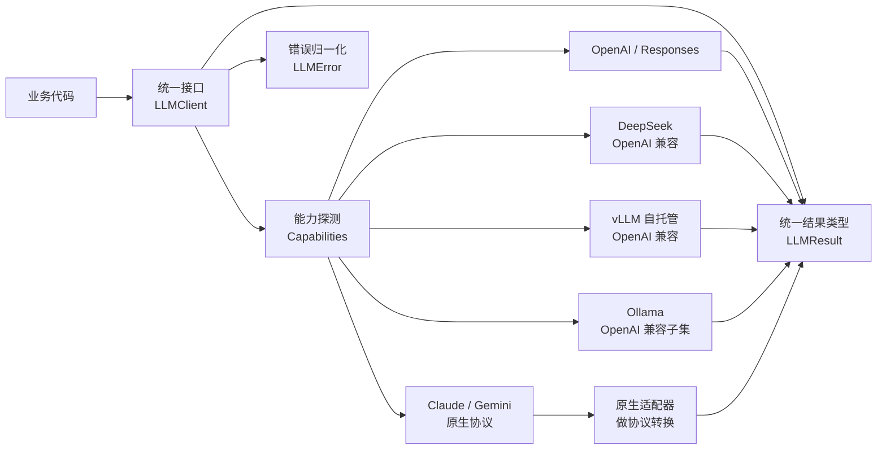
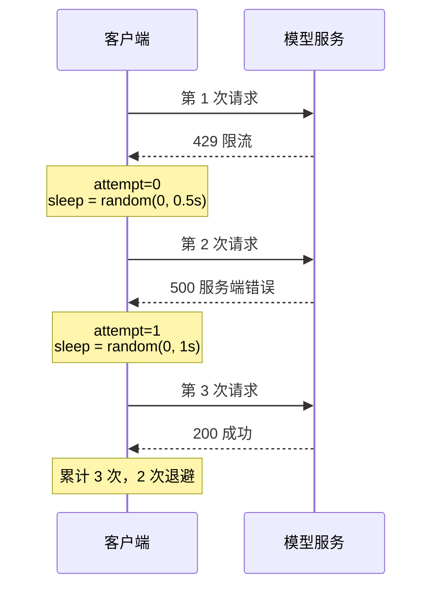

# [[API-调用与模型服务]]

> [!tip] 学习目标
> 能独立写出一个「换 base_url 就能在 OpenAI / DeepSeek / 本地 vLLM 之间切换」的调用层：处理 SSE 流式、跑通多轮工具调用循环、用 Pydantic 卡住结构化输出、按状态码归一化错误并做指数退避、按 token 核算成本，并用追踪 ID 把一次请求的日志串起来。

> [!info] 关于文中的「未核验」标记
> 本篇的链接与数字均在 2026-09-25 逐条 `curl` 核验（返回 200 且内容可读）。
> ==`openai.com` / `platform.openai.com` / `developers.openai.com` / `ai.google.dev` / `huggingface.co` 在本机返回 403 或 000，`docs.anthropic.com` 虽返回 200 但正文是「App unavailable in region」区域限制页==，因此这些来源的**具体价格、上下文长度数字一律不写入本篇**，改用已核验的 SDK 仓库、DeepSeek 官方文档、vLLM / Ollama 官方文档作为来源。表格中标「待官方核验」的单元格表示该结论来自二手整理，请自行到对应厂商文档确认。

> [!note] 与 [[LLM-基础]] 的分工
> [[LLM-基础]] 2.1/2.2/2.3 已经讲清 Prefill/Decode、KV-Cache 显存公式与 PagedAttention 的**原理**。本篇只做**工程对接**：这些机制在 API 层面对应什么开关（`stream`、Prefix Caching、`enable_prefix_caching`）、对应什么延迟指标（TTFT / TPOT），不再重复公式推导。

---

## 🎯 难度分段学习路径

| 难度 | 目标 | 核心关注 | 预估时长 |
|---|---|---|---|
| **入门** | 能正确发出一次请求并解析响应 | Chat Completions vs Responses、messages 结构、SSE 流式、工具调用结构 | 6h |
| **进阶** | 能把「能调通」变成「线上不炸」 | Pydantic 校验与重试、多 Provider 抽象、错误归一化、退避与超时分层、成本与缓存 | 10h |
| **高级** | 能自主选型并对故障负责 | Ollama / vLLM / llama.cpp 选型、跨厂商 API 差异、可观测性与灰度回退 | 8h |

**总学时**：24h ｜ **前置知识**：[[LLM-基础]]（第 2 章）、[[HTTP-详解]]（SSE 依赖 HTTP 响应体分块传输）、[[TCP-深入]]（长连接的 keep-alive 与超时）

---

## 📖 第一章 入门（Beginner）

### 1.1 两套接口：Chat Completions 与 Responses

**知识点详解**

OpenAI 生态里有两套并存的生成接口。==Chat Completions 被称为「previous standard（supported indefinitely）」，Responses 是当前推荐的主接口==（来源：`openai-python` / `openai-node` README，2026-09-25 核验）。

| 维度 | Chat Completions | Responses |
|---|---|---|
| 端点 | `/v1/chat/completions` | `/v1/responses` |
| 输入字段 | `messages`（对象数组） | `input`（字符串或 Item 数组）+ 顶层 `instructions` |
| 系统提示 | `messages` 里的一条 `role: "system"` / `"developer"` | ==提到顶层 `instructions`，脱离会话== |
| 输出字段 | `choices[0].message` | 类型化 `output` 数组；SDK 提供 `output_text` 便捷属性 |
| 多候选 | `n` 参数 | ==已移除，一次只生成一个== |
| 会话状态 | 调用方自己重发全部历史 | 可传 `previous_response_id` 续接；或全量手动重放 |
| 结果对象 | `choices` 列表，每项一条 message | 带 `id` / `status` 的 `response` 对象 |

```python
from openai import OpenAI
client = OpenAI()   # 读 OPENAI_API_KEY

# Responses：instructions 在顶层，input 收问题
r = client.responses.create(
    model="gpt-5.5",
    instructions="You are a coding assistant that talks like a pirate.",
    input="How do I check if a Python object is an instance of a class?",
)
print(r.output_text)          # 只要最终文本用这个便捷属性

# Chat Completions：系统提示是 messages 里的第一条
c = client.chat.completions.create(
    model="gpt-5.5",
    messages=[
        {"role": "developer", "content": "Talk like a pirate."},
        {"role": "user", "content": "Are semicolons optional in JavaScript?"},
    ],
)
print(c.choices[0].message.content)
```

> [!danger] 迁移时最容易踩的两个字段名
> 1. ==`role: "system"` 在新模型上被 `role: "developer"` 取代==，旧教程里的 `system` 写法在新模型上不一定被接受。
> 2. ==结构化输出参数在 Responses 里从 `response_format` 移到了 `text.format`==，而 Chat Completions 用 `response_format`。同一份 schema 代码换接口要改字段名。

> [!tip] 选型一句话
> ==新项目、需要 Agent 多轮工具调用、需要服务端会话状态 → Responses；已有稳定系统、或要兼容只实现了 Chat Completions 的第三方服务 → 留在 Chat Completions==。注意「支持但非首选」和「已废弃」是两回事，Chat Completions 目前是被明确长期支持的。

**填空题**

1. OpenAI 当前推荐的主接口是 ______ API，Chat Completions 被描述为 previous standard。
2. Responses 里系统提示不放在 `messages` 数组中，而是顶层字段 ______。
3. Chat Completions 靠 `n` 参数返回多个候选，而 Responses 已经 ______ 了这个参数。
4. Responses 想要服务端续接会话，传的字段是 ______。

**答案**：
1. Responses
2. `instructions`
3. 移除（不再支持）
4. `previous_response_id`

---

### 1.2 messages 结构与 role 类型

**知识点详解**

| role | 语义 | 出现位置 | 注意 |
|---|---|---|---|
| `system` | 系统级指令 | 仅历史消息 | ==部分 OpenAI 兼容服务（Qwen/DashScope 类）要求它只能在 `messages[0]`== |
| `developer` | 开发者指令 | 仅历史消息 | OpenAI 新模型上取代 `system` |
| `user` | 用户输入 | 任意 | `content` 可为字符串或内容块数组（多模态） |
| `assistant` | 模型上一轮输出 | 任意 | ==带工具调用时必须原样回传，模型才知道自己调过什么== |
| `tool` | 工具执行结果 | 紧跟对应 `assistant` 之后 | 必须用 `tool_call_id` 关联 |

```python
messages = [
    {"role": "system", "content": "你是一个严谨的编程助手。"},
    {"role": "user", "content": "帮我看下这个函数"},           # 多模态：content 变数组
    # {"role": "user", "content": [
    #     {"type": "text", "text": "这是什么报错？"},
    #     {"type": "image_url", "image_url": {"url": "data:image/png;base64,..."}},
    # ]},
]
```

> [!danger] 「多轮」不等于「把历史全塞回去」就完事
> Chat Completions 是**完全无状态**的：服务端不认识你这个会话，==每一轮都要重发完整 `messages` 数组==。这意味着 token 成本随轮次线性累积，也是下一节 Prefix Caching 存在的理由。Responses 提供 `previous_response_id` 让服务端持有状态，但你要清楚这等于把会话托管给了厂商，隐私与保留策略要另行确认。

> [!tip] 一个反直觉的坑
> 在 Responses 里手动重放历史时，==只把 `response.output` 里 `type == "message"` 的项挑出来回传是不够的==。`openai-node` README 明确提示：过滤掉 reasoning 或 tool-call 项会导致下一次请求失败，要用 SDK 的 `toResponseInputItems()` 把所有可重放项规范化后再拼。

**填空题**

1. `role: "tool"` 的消息必须用一个 ______ 字段与之前的工具调用关联。
2. Chat Completions 是完全无状态的，每一轮调用方都要 ______ 完整的 `messages` 数组。
3. 带工具调用的 `assistant` 消息必须 ______ 回传给模型。
4. Responses 手动重放历史时，用 SDK 的 ______ 辅助函数规范化输出项。

**答案**：
1. `tool_call_id`
2. 重发
3. 原样
4. `toResponseInputItems()`

---

### 1.3 `stream=true`：SSE 格式与解析

**知识点详解**

SSE（Server-Sent Events）是 WHATWG 标准定义的文本事件流，浏览器端由 `EventSource` 消费。==协议本身规定的是「字段行 + 空行分隔」这一层；具体哪个字段名、终止哨兵是什么，属于各厂商的实现约定==。

**协议规定的部分**（来源：WHATWG HTML 标准、MDN）：

| 项 | 规定 |
|---|---|
| 响应头 | `Content-Type: text/event-stream` |
| 事件分隔 | ==空行（`\n\n`）== |
| 字段行 | `data: `、`event: `、`id: `、`retry: `，冒号后可有可选前导空格 |
| 注释行 | 以 `:` 开头，客户端忽略 |
| 多行 data | 多个 `data:` 行拼接后用换行连接 |

```python
import json, httpx

def stream_chat(base_url, api_key, model, messages):
    """手写 SSE 解析：不懂厂商封装也能用。"""
    with httpx.stream(
        "POST", f"{base_url}/chat/completions",
        headers={"Authorization": f"Bearer {api_key}"},
        json={"model": model, "messages": messages, "stream": True},
        timeout=httpx.Timeout(60.0, connect=5.0, read=30.0),
    ) as resp:
        resp.raise_for_status()
        for line in resp.iter_lines():
            if not line.startswith("data:"):
                continue
            data = line[5:].strip()          # 去掉 "data:" 前缀
            if data == "[DONE]":             # ← 厂商约定，不是 SSE 标准
                break
            chunk = json.loads(data)
            delta = chunk["choices"][0].get("delta", {})
            if delta.get("content"):
                print(delta["content"], end="", flush=True)
            if chunk["choices"][0].get("finish_reason"):
                print(f"\n[结束原因] {chunk['choices'][0]['finish_reason']}")
```

> [!warning] `[DONE]` 是 OpenAI 系约定，不是 SSE 规范
> ==SSE 标准里没有「结束哨兵」这个概念==。`data: [DONE]` 是 OpenAI 兼容接口的厂商习惯，Gemini 的流式端点、Ollama 的 `/api/chat` 都不这么写（后者用 NDJSON，另有 `done: true` 字段）。==把「读 SSE」和「读某个厂商的流」写成两层，兼容层才不会在换厂商时崩掉==。

> [!danger] 流式消费默认不会被 SDK 自动重试
> `openai-python` README 明确写了：==流消费不会自动重试，因为重放请求可能把已经交付给应用的输出重复一遍==。所以流式场景的重试必须你自己做，而且要清楚「已经吐出去一部分再重试」对用户意味着什么（通常只能提示「重新生成」而不是无缝续接）。非流式请求则相反：连接错误、408、409、429、5xx 会被默认重试 2 次。

**填空题**

1. SSE 响应头的 `Content-Type` 必须是 ______。
2. SSE 协议中，一个事件与下一个事件的边界是 ______（空行）。
3. `data: [DONE]` 这个结束哨兵是 ______ 标准的规定（填「OpenAI 兼容接口的厂商约定」或「SSE 标准」）。
4. `openai-python` 的流式消费为什么默认不自动重试？因为 ______。

**答案**：
1. `text/event-stream`
2. 空行（`\n\n`）
3. 厂商约定，不是 SSE 标准
4. 重放请求可能把已交付的输出重复给应用

---

### 1.4 工具调用的请求与响应结构

**知识点详解**

Chat Completions 的工具定义是**外层标记**（externally tagged）：`type` 指明种类，函数本体嵌在 `function` 对象里。

```python
tools = [{
    "type": "function",
    "function": {
        "name": "get_weather",
        "description": "查询城市天气",
        "parameters": {                      # 这就是 JSON Schema
            "type": "object",
            "properties": {"city": {"type": "string", "description": "城市名"}},
            "required": ["city"],
        },
    },
}]

resp = client.chat.completions.create(
    model="gpt-5.5", messages=messages, tools=tools,
)
msg = resp.choices[0].message

if msg.tool_calls:                     # 列表，可能是多个并行调用
    for call in msg.tool_calls:
        call.id                          # 关联 ID，回传结果时要用
        call.function.name               # "get_weather"
        call.function.arguments          # 字符串！不是 dict，必须 json.loads
        call.type                        # "function"
```

| 环节 | Chat Completions | Responses（来源：迁移整理，待官方核验） |
|---|---|---|
| 定义工具 | `{"type":"function","function":{...}}` 嵌套 | `{"type":"function","name":...,"parameters":...}` 扁平 |
| 严格模式 | 默认**关闭** | ==省略 `strict` 会尝试开启严格模式== |
| 模型发起调用 | `choices[0].message.tool_calls[]` | `output` 里 `type == "function_call"` 的项 |
| 调用标识 | `id` | `call_id` |
| 回传结果 | `{"role":"tool","tool_call_id":...,"content":...}` | `{"type":"function_call_output","call_id":...,"output":...}` |

> [!danger] 三个高频错误
> 1. ==`function.arguments` 是 JSON 字符串不是对象==，直接 `.get("city")` 会报 `AttributeError`。必须 `json.loads` 后再用 Pydantic 校验。
> 2. ==忘了把带 `tool_calls` 的 `assistant` 消息回传==，模型下一轮不知道自己要调工具，会当成普通对话。
> 3. ==`tool_call_id` 与 `call_id` 混淆==。这是跨 API 迁移时最高频的字段名错误，报错信息通常还不helpful。

> [!tip] 严格模式的代价
> 严格模式（strict）保证参数一定符合 schema，但要求 schema 更严：==每个属性都要写进 `required`，对象要带 `additionalProperties: false`==。一份 Chat Completions 接受的 schema 迁到 Responses 后可能直接 400。显式写 `"strict": False` 可以要回宽松行为。

**填空题**

1. Chat Completions 的函数定义是「外层标记」结构，函数本体嵌在 ______ 对象里。
2. 模型返回的 `tool_calls[].function.arguments` 类型是 ______（字符串 / dict）。
3. Chat Completions 用 ______ 字段把工具结果关联回具体调用。
4. 严格模式要求 schema 里每个属性都写进 ______，对象还要带 `additionalProperties: false`。

**答案**：
1. `function`
2. 字符串（需 `json.loads`）
3. `tool_call_id`
4. `required`

---

### 1.5 多轮工具调用循环

**知识点详解**

工具调用**不是一个 API 功能，而是一个由你的代码驱动的循环**。模型只负责「决定调哪个工具」，执行与回传全在你这边。

```mermaid
graph TD
    START([发起对话<br/>messages]) --> CALL[调用 chat.completions<br/>带 tools 定义]
    CALL --> CHECK{有 tool_calls?}
    CHECK -->|否| DONE[返回最终文本给用户]
    CHECK -->|是| PARSE[对每个 call:<br/>json.loads arguments<br/>+ Pydantic 校验]
    PARSE --> DISPATCH{参数合法?}
    DISPATCH -->|否| ERR[构造错误信息<br/>作为 tool 结果回传]
    DISPATCH -->|是| EXEC[执行真实函数]
    EXEC --> GUARD{步数 < 上限?}
    GUARD -->|否| CUT[强制收尾: 告知模型步数用尽]
    GUARD -->|是| APPEND[追加 assistant(tool_calls)<br/>+ role=tool 结果]
    ERR --> APPEND
    APPEND --> CALL
    CUT --> DONE
    class CALL internal-link;
```

```python
import json
from pydantic import BaseModel, ValidationError

MAX_STEPS = 6                      # ← 必须有上限，否则模型可能无限调

class WeatherArgs(BaseModel):
    city: str

def run_agent(client, messages, tools, registry):
    for step in range(MAX_STEPS):
        resp = client.chat.completions.create(
            model="gpt-5.5", messages=messages, tools=tools,
        )
        msg = resp.choices[0].message
        if not msg.tool_calls:
            return msg.content

        messages.append(msg.model_dump(exclude_none=True))   # ① 回传 assistant

        for call in msg.tool_calls:                            # ② 逐个执行
            try:
                args = WeatherArgs.model_validate_json(call.function.arguments)
                result = registry[call.function.name](**args.model_dump())
                content = json.dumps(result, ensure_ascii=False)
            except ValidationError as e:
                content = json.dumps({"error": "参数不合法", "detail": e.errors()})
            except Exception as e:                              # 工具自身炸了
                content = json.dumps({"error": type(e).__name__, "msg": str(e)})

            messages.append({                                  # ③ 回传结果
                "role": "tool", "tool_call_id": call.id, "content": content,
            })
    return "已达到最大步数，未能得出结论"    # ③ 兜底返回，不要静默死循环
```

> [!danger] 工具执行必须独立鉴权
> 呼应 [[LLM-基础]] 3.4 的结论：==模型只负责「提出请求」，授权判断必须在你的工具层独立完成==。上面 `registry[call.function.name](...)` 这一行之前，务必先检查这个用户有没有权限调这个工具 —— 不要相信模型传来的任何身份信息。

> [!tip] 错误也要回传，而不是静默跳过
> 工具参数不合法时，==把「错误原因」作为 `role: "tool"` 的内容回传给模型==，它往往能自己纠正格式再来一次。静默吞掉异常会让模型在错误的假设上继续往下走，产出看似合理实则错误的结果。

**填空题**

1. 工具调用循环中，模型只负责决定调哪个工具，______ 与结果回传由应用代码完成。
2. 循环必须有 ______ 上限，否则模型可能无限调用工具。
3. 执行完工具后必须把带 `tool_calls` 的 ______ 消息追加回 `messages`。
4. 工具参数校验失败时，正确做法是把错误信息作为 `role: "tool"` 的 ______ 回传给模型。

**答案**：
1. 实际执行
2. 步数（`MAX_STEPS`）
3. `assistant`
4. 内容（content）

---

### 1.6 第一章综合练习

**填空题（本章共 4 道，答案见下方）**

1. Responses 的系统提示字段是 ______，Chat Completions 则是 `messages` 里的一条消息。
2. SSE 中事件与事件的分隔符是 ______，`data: [DONE]` 属于 ______ 层的约定。
3. 工具调用参数校验失败后回传给模型的消息 `role` 应该是 ______。
4. 工具执行前的权限检查必须由 ______ 独立完成。

**本章答案**：
1. `instructions`
2. 空行；厂商
3. `tool`
4. 应用的服务端工具层

**综合项目**：写一个 `chat.py`，要求
- 输入：一段多轮对话 + 一个本地注册的工具表
- 步骤：支持 `stream=True` 的流式输出；工具调用走 1.5 的循环；参数用 Pydantic 校验
- 产出物：一个可运行的脚本 + 一份「工具描述表」（每个工具的 name / description / 参数 schema）
- 验收标准：故意传入错误的工具参数，模型能在下一轮自己纠正；故意让工具抛异常，循环不会崩也不会死循环

> [!tip] 常见陷阱
> 1. **把 `[DONE]` 当 SSE 标准**：换到 Gemini 流式端点或 Ollama 的 NDJSON 就解析不了。要把「读 SSE」和「读某厂商」分层。
> 2. **忘记回传 assistant 消息**：带 `tool_calls` 的那条不回去，模型第二轮就「失忆」。
> 3. **工具循环没有步数上限**：模型卡在「调工具→报错→再调」的死循环里，你的接口被一个请求打满。
> 4. **把 SDK 当能力探测依据**：SDK 接受了参数不代表后端支持。换 `base_url` 指向本地 vLLM 时，很多 OpenAI 专有参数会被忽略或报错。

> [!note] 本章权威资料
> - [openai-python](https://github.com/openai/openai-python) · [openai-node](https://github.com/openai/openai-node) — Responses 与 Chat Completions 的官方 SDK 用法、错误类型表、默认重试与超时策略（README 全文核验）
> - [Server-sent events 规范（WHATWG）](https://html.spec.whatwg.org/multipage/server-sent-events.html) · [MDN SSE 使用指南](https://developer.mozilla.org/en-US/docs/Web/API/Server-sent_events/Using_server-sent_events) — 协议层的字段与分隔规则
> - [Ollama 工具调用文档](https://docs.ollama.com/capabilities/tool-calling) — 另一家厂商的工具定义写法，可对照差异

---

## 📖 第二章 进阶（Intermediate）

> [!warning] 与上一章的衔接
> 第一章解决「能调通」。第二章解决「线上不炸」：输出不可信（校验）、服务会挂（错误与重试）、成本会失控（计费与缓存）。跳过第二章直接上生产，第一章的代码会在第一次限流、第一次超长上下文、第一次模型返回非法 JSON 时崩掉。

### 2.1 结构化输出：`response_format` 与 `json_schema`

**知识点详解**

让模型返回可被程序直接消费的 JSON，有两条路：**提示词约束**（软）和 **API 层 schema 约束**（硬）。

| 方式 | 做法 | 可靠性 | 代价 |
|---|---|---|---|
| 提示词约束 | 在 system 里写「只输出 JSON」 | 低，模型仍会输出 ```json 围栏或前后废话 | 便宜，零配置 |
| `format: "json"` | 要求合法 JSON | 中 | 只保证语法，不保证字段 |
| **JSON Schema 约束** | 把 schema 传给 API | ==高，约束解码层面保证== | 不同厂商支持的 schema 子集不同 |

```python
from pydantic import BaseModel

class Person(BaseModel):
    name: str
    age: int

# Chat Completions 风格
completion = client.chat.completions.parse(
    model="gpt-5.5",
    messages=[{"role": "user", "content": "小明 28 岁，他是谁？"}],
    response_format=Person,             # SDK 自动转成 json_schema
)
person = completion.choices[0].message.parsed   # ← 已经是 Person 实例
```

本地服务侧的对应写法（Ollama `/api/chat` 核验自官方文档）：

```bash
curl -X POST http://localhost:11434/api/chat -d '{
  "model": "gpt-oss",
  "messages": [{"role":"user","content":"用一句话介绍加拿大"}],
  "stream": false,
  "format": {"type":"object",
             "properties":{"name":{"type":"string"},"capital":{"type":"string"}},
             "required":["name","capital"]}
}'
```

> [!warning] 「支持 JSON Schema」不等于「支持 JSON Schema 的全部子集」
> vLLM 官方文档明确：结构化输出是约束解码，==支持的 schema 特性有限；配合某些带 reasoning 的模型（如 Qwen3 Coder）时，若 reasoning 内容没有被解析到独立字段，结构化输出会失效，需要显式加 `--structured-outputs-config.enable_in_reasoning=True`==。Ollama 官方文档也写明「Ollama 的云端目前不支持结构化输出」—— ==同一个工具在本地能用、换成云端就不行，这是常态而不是 bug==。

> [!tip] schema 写在提示里也值得做
> Ollama 文档给出的建议是：==除了传 schema，最好也把 schema 以文本形式写进提示里来「锚定」模型==。成本是多几个 token，收益是减少格式漂移。

**填空题**

1. 只在提示里写「输出 JSON」属于 ______ 约束，API 层传 schema 属于硬约束。
2. Chat Completions 的结构化输出参数是 ______，Responses 里它移到了 `text.format`。
3. vLLM 中让结构化输出在 reasoning 模式下生效需要加的启动参数是 ______。
4. `response_format=Person` 之后，结果在 ______ 属性上（不是 `.content`）。

**答案**：
1. 提示词（软）
2. `response_format`
3. `--structured-outputs-config.enable_in_reasoning=True`
4. `.parsed`

---

### 2.2 Pydantic v2 校验与失败重试

**知识点详解**

即使开了 schema 约束，也**必须**在应用侧再校验一次。理由：本地小模型可能不支持严格约束；换模型时约束强度会变；schema 子集各家不同。

```python
import json, re
from pydantic import BaseModel, Field, ValidationError, field_validator

class ExtractResult(BaseModel):
    title: str = Field(min_length=1, max_length=200)
    tags: list[str] = Field(default_factory=list, max_length=10)
    score: float = Field(ge=0.0, le=1.0)

    @field_validator("tags")
    @classmethod
    def dedupe(cls, v: list[str]) -> list[str]:
        return list(dict.fromkeys(t.strip().lower() for t in v if t.strip()))

def extract(client, model, text, max_retry=2):
    """L1 语法修复（零调用）→ L2 升温重试 → L3 反馈重试。"""
    convo = [{"role": "system", "content": "抽取结构化信息，只输出 JSON。"},
             {"role": "user", "content": text}]
    last_err = None
    for attempt in range(max_retry + 1):
        r = client.chat.completions.create(
            model=model, messages=convo, response_format={"type": "json_object"},
            temperature=0.0 if attempt == 0 else 0.7,   # 失败后升温，跳出重复
        )
        raw = r.choices[0].message.content or ""
        cleaned = re.sub(r"^```(?:json)?\s*|\s*```$", "", raw.strip(), flags=re.S)  # L1
        try:
            return ExtractResult.model_validate_json(cleaned)
        except ValidationError as e:
            last_err = e
            convo += [{"role": "assistant", "content": raw},           # L3：把错误喂回去
                      {"role": "user", "content":
                       f"校验失败，请修正后重新输出 JSON。错误：{e.errors()[:3]}"}]
    raise ValueError(f"结构化抽取失败：{last_err}")
```

**三级重试策略**（从便宜到贵）：

| 层级 | 触发条件 | 动作 | 成本 |
|---|---|---|---|
| L1 语法修复 | JSON 解析失败 | 剥 ```json 围栏、截到第一个平衡括号 | 零调用 |
| L2 重试采样 | schema 校验失败 | 同一请求重试 1-2 次，**换 `seed` 或降温** | 1-2 次调用 |
| L3 反馈重试 | 仍失败 | ==把校验错误回传给模型让它自己改== | 1 次调用 + 更多 token |

> [!danger] 降温不是万能药
> `temperature=0` 时模型可能**每次都产出同样的错误 JSON**，重试三次只是浪费三次钱。==失败后要升温或换 `seed`，让模型有机会走出同一个错误点==。但也别把温度调太高，那会引入新的不稳定性 —— 0.6~0.8 是常见折中。

> [!tip] 校验错误的利用价值
> ==`ValidationError.errors()` 里带字段路径和期望类型，把它原样回传给模型通常一次就能修好==。这是把「重试」从「盲猜」变成「定向修复」的关键。

**填空题**

1. 即使 API 层开了 schema 约束，应用侧仍必须再 ______ 一次。
2. 结构化抽取失败的重试里，`temperature=0` 的问题是模型可能 ______ 产出同样的错误。
3. 把 `ValidationError.errors()` 回传给模型，属于第 ______ 级重试。
4. Pydantic v2 中定义字段校验器用的装饰器是 `@field_validator`。

**答案**：
1. 校验
2. 每次都
3. L3（反馈重试）
4. `@field_validator`

---

### 2.3 多 Provider 封装：抽象层与能力探测

**知识点详解**

> [!tip] 核心判断
> ==不要按「厂商名」写分支，要按「能力」写分支==。你真正需要回答的是「这个端点支不支持结构化输出 / 流式 / 并行工具调用」，而不是「这是不是 OpenAI」。



```python
from dataclasses import dataclass, field
from enum import StrEnum

class Cap(StrEnum):
    STREAM = "stream"
    STRUCTURED_OUTPUT = "structured_output"
    PARALLEL_TOOLS = "parallel_tools"
    NATIVE_TOOLS = "native_tools"       # 厂商托管工具（搜索/代码执行等）
    PROMPT_CACHING = "prompt_caching"

@dataclass
class LLMResult:
    text: str
    tool_calls: list = field(default_factory=list)
    finish_reason: str | None = None
    input_tokens: int = 0
    output_tokens: int = 0
    cached_tokens: int = 0        # 缓存命中的输入 token，计费用
    request_id: str | None = None
    provider: str = ""
    model: str = ""

# 用配置声明能力，而不是靠 if provider == "openai"
PROFILES = {
    "openai":      {Cap.STREAM, Cap.STRUCTURED_OUTPUT, Cap.PARALLEL_TOOLS, Cap.NATIVE_TOOLS, Cap.PROMPT_CACHING},
    "deepseek":    {Cap.STREAM, Cap.STRUCTURED_OUTPUT, Cap.PARALLEL_TOOLS, Cap.PROMPT_CACHING},
    "vllm-local":  {Cap.STREAM, Cap.STRUCTURED_OUTPUT, Cap.PARALLEL_TOOLS},   # 无厂商托管工具
    "ollama-local":{Cap.STREAM, Cap.STRUCTURED_OUTPUT},                        # 兼容子集更窄
}

def supports(provider: str, cap: Cap) -> bool:
    return cap in PROFILES.get(provider, set())
```

> [!danger] 「OpenAI 兼容」是一个营销词，不是一个保证
> 实测可核验的事实：==Ollama 官方文档写明「Ollama 支持 OpenAI API 的一个子集」==，且其云端不支持状态化 Responses、不支持通过 `/v1/responses` 的内置 web search、不支持自定义 tool-call 重放。vLLM 官方文档里结构化输出与工具调用都需要按模型选对应的 parser 参数。==结论：换 `base_url` 只能省掉鉴权与基础文本生成，工具、结构化输出、缓存都要逐个验==。

**填空题**

1. 多 Provider 封装的分支条件应该按 ______（厂商名 / 能力）写，而不是按厂商名。
2. 「OpenAI 兼容」在实践中意味着该端点支持 OpenAI API 的一个 ______。
3. 统一结果类型里必须单独记录 `cached_tokens`，因为它直接影响 ______ 核算。
4. 能力探测的目的是：换 `base_url` 之后仍能判断某项特性是否 ______。

**答案**：
1. 能力
2. 子集
3. 成本
4. 可用

---

### 2.4 错误归一化：把状态码翻译成动作

**知识点详解**

不同厂商的错误语义不完全一致，但 HTTP 状态码是最大公约数。**以 DeepSeek 官方错误码表为参照**（2026-09-25 核验），可以建这样一张归一化表：

| HTTP | DeepSeek 语义 | OpenAI SDK 异常类 | 该做什么 |
|---|---|---|---|
| 400 | 请求格式错误 | `BadRequestError` | ==**不要重试**==，改代码 |
| 401 | 鉴权失败 | `AuthenticationError` | ==不要重试==，换 key |
| 402 | 余额不足 | —（SDK 归到 `APIStatusError`） | ==不要重试==，告警充值 |
| 403 | 无权限 | `PermissionDeniedError` | 不要重试 |
| 404 | 资源不存在 | `NotFoundError` | 检查模型名 |
| 422 | 参数不合法 | `UnprocessableEntityError` | 不要重试，参数问题 |
| **429** | 请求过快 | `RateLimitError` | ==**退避后重试**==，或降级 |
| **5xx** | 服务端错误 / 过载 | `InternalServerError` | ==**退避后重试**==，多次失败则熔断 |

```python
import httpx, openai

class LLMErrorKind(StrEnum):
    BAD_REQUEST = "bad_request"      # 4xx（除 429）：重试无意义
    RATE_LIMIT = "rate_limit"        # 429
    SERVER = "server"                # 5xx
    TIMEOUT = "timeout"
    CONNECTION = "connection"

def classify(exc: Exception) -> tuple[LLMErrorKind, bool]:
    """返回 (错误类别, 是否可重试)。"""
    if isinstance(exc, (openai.APITimeoutError, httpx.TimeoutException)):
        return LLMErrorKind.TIMEOUT, True
    if isinstance(exc, (openai.APIConnectionError, httpx.ConnectError)):
        return LLMErrorKind.CONNECTION, True
    if isinstance(exc, openai.RateLimitError):
        return LLMErrorKind.RATE_LIMIT, True
    if isinstance(exc, openai.APIStatusError):
        if exc.status_code == 429:
            return LLMErrorKind.RATE_LIMIT, True
        if exc.status_code >= 500:
            return LLMErrorKind.SERVER, True
        return LLMErrorKind.BAD_REQUEST, False      # 4xx 其余一律不重试
    return LLMErrorKind.CONNECTION, False
```

> [!danger] 4xx 重试是烧钱最快的方式
> ==上下文超长、参数非法、余额不足这三个最常见的 4xx，重试一万次也会失败一万次==，而每一次重试都要走完网络往返、可能还会被计费。==重试策略的第一原则：可重试性由错误类别决定，不由「失败了」这个事实决定==。

> [!tip] 用并发限制代替盲目重试
> DeepSeek 官方提供了**账号级并发上限**与 `user_id` 参数做隔离（同一账号下按 `user_id` 分别计并发，超了就返回 429）。==与其撞了 429 再退避，不如在客户端用信号量把并发压在限额之下== —— 前提是你知道自己的限额，那就要去看对应厂商的限额与隔离文档。

**填空题**

1. 上下文超长、参数非法这类 4xx 错误，正确动作是 ______（退避重试 / 改代码不重试）。
2. DeepSeek 官方文档中，「请求过快」对应的状态码是 ______。
3. `openai-python` 中 429 对应的异常类是 ______。
4. 相比撞 429 再退避，用信号量把并发压在限额之下属于 ______ 控制。

**答案**：
1. 改代码，不重试
2. 429
3. `RateLimitError`
4. 流量（并发）控制

---

### 2.5 重试退避与超时分层

**知识点详解**

```python
import random

def full_jitter(attempt: int, base: float = 0.5, cap: float = 30.0) -> float:
    """AWS 推荐的全抖动退避：sleep = random(0, min(cap, base * 2**attempt))"""
    return random.uniform(0, min(cap, base * (2 ** attempt)))
# 序列示意（秒）：0~0.5, 0~1, 0~2, 0~4 ... 上限 30
```

> [!tip] 为什么要加抖动
> ==没有抖动的指数退避会让所有失败客户端在同一时刻一起重试，形成「惊群」，把刚恢复的服务再打垮一次==。抖动把这个同步点打散。这是 AWS 架构博客《Exponential Backoff And Jitter》给出的核心建议。



**超时分层**：一次 LLM 请求至少有三种超时，混成一个数字必然出错。

```python
import httpx

timeout = httpx.Timeout(
    timeout=60.0,      # 总时长上限，防止无限挂起
    connect=5.0,       # 建连：网络不通，5 秒足够
    read=30.0,         # 读：流式下是「两次数据之间的间隔」，不是总时长
    write=10.0,        # 写：上传大 prompt / 图片时
)
client = httpx.Client(timeout=timeout)
```

| 超时层 | 含义 | 建议量级 | 超时后果 |
|---|---|---|---|
| connect | TCP + TLS 握手 | 2-5s | 安全重试 |
| read（流式） | ==相邻两个 SSE 事件之间的间隔== | 30-60s | 安全重试（未吐字时） |
| read（非流式） | 等待完整响应 | 60-120s | 视是否已扣费 |
| 总时长 | 整次调用墙钟时间 | 按业务定 | 需要自己算 |

> [!danger] 流式场景的 read 超时是「间隔」不是「总时长」
> ==非流式下 read 超时约等于「多久没收到完整响应」；流式下它是「多久没收到下一个事件」==。一个生成 3 分钟的长回答，只要每 15 秒吐一次字就永远不会触发 read 超时。==所以流式要同时设一个总时长上限，否则会挂到天荒地老==。

> [!tip] 熔断：重试的另一半
> 退避解决「单次失败」，熔断解决「服务持续不可用」。==连续 N 次失败后直接快速失败一段时间（打开断路器），避免每次请求都等满退避时间== —— 用户的体验是「立刻降级」而不是「等 30 秒然后报错」。

**填空题**

1. AWS 推荐的「全抖动」退避公式是 `sleep = random(0, ______)`。
2. 加抖动的目的是避免大量客户端同时重试造成的 ______ 现象。
3. 流式请求中 `read` 超时的含义是「相邻两个 SSE 事件之间的 ______」。
4. 退避解决单次失败，______ 解决服务持续不可用。

**答案**：
1. `min(cap, base * 2**attempt)`
2. 惊群
3. 间隔时间
4. 熔断（断路器）

---

### 2.6 成本与配额：计费机制与 Prompt Caching

**知识点详解**

一次调用的成本 ≈ `(输入 token × 输入单价) + (输出 token × 输出单价)`，但真实账单上有三个容易漏掉的分项：

| 分项 | 说明 | 优化手段 |
|---|---|---|
| 输入 token（缓存未命中） | 全量 prompt 都要过一遍 Prefill | 缩短 prompt |
| ==输入 token（缓存命中）== | ==前缀相同才命中，通常显著更便宜== | ==缓存友好性设计== |
| 输出 token | 单价通常高于输入 | 限制输出长度 |

**缓存友好性设计**（前缀缓存原理见 [[LLM-基础]] 2.2）：

```python
# ✅ 稳定内容在前，易变内容在后
messages = [
    {"role": "system", "content": SYSTEM_PROMPT},        # 固定不变 → 命中缓存
    {"role": "system", "content": FEW_SHOT_EXAMPLES},    # 固定不变 → 命中缓存
    {"role": "system", "content": f"当前时间：{now()}"}, # 每轮都变 → 放最后
    {"role": "user", "content": user_input},             # 必然变化
]
```

> [!danger] 缓存判定是「前缀完全相同」，不是「语义相似」
> ==这是 [[LLM-基础]] 2.2 已经强调过的判定标准，在 API 层的直接后果是：把系统提示里塞一个当前时间戳，就等于把后面所有内容全部变成缓存未命中==。很多「为什么我的缓存命中率是 0」的答案就在这里。

> [!warning] 本地部署的对应开关
> vLLM 侧对应的是 **Automatic Prefix Caching（APC）**：官方文档说明它缓存已有请求的 KV，新请求若与之共享前缀即可直接复用，跳过共享部分的计算，==通过 `enable_prefix_caching=True` 开启==。注意它省的是 Prefill 计算（影响 TTFT），不加速 Decode。

> [!tip] 成本核算的落点
> 把每次调用的 `input_tokens` / `output_tokens` / 缓存 token / 模型名 / provider 记成一条流水，配上你**自己维护的单价表**（而不是硬编码在业务逻辑里）才能算出账。==单价是会变的，DeepSeek 官方价格页就写明「保留调整价格的权利」==，所以单价表要能热更新，具体数字以该页为准（本篇不复制价格表）。

> [!note] 关于「1 个 token 多少字符」
> DeepSeek 官方 token 文档给出的经验值是：1 个英文字符 ≈ 0.3 token，1 个中文字符 ≈ 0.6 token，==但同时明确说明不同模型分词方式不同、比例会变，实际以 API 返回的 usage 为准==。做预算可以用这个量级，扣费必须用返回值。

**填空题**

1. 前缀缓存的命中条件是 token 前缀 ______（完全相同 / 语义相似）。
2. 把「当前时间」放进系统提示的**开头**会破坏缓存，应放在 ______。
3. vLLM 中开启自动前缀缓存的参数是 ______。
4. 估算成本时，==最终应以上 API 返回的 ______ 为准，而不是字符数换算。

**答案**：
1. 完全相同
2. 靠后位置（易变内容放最后）
3. `enable_prefix_caching=True`
4. `usage`（token 用量）

---

### 2.7 第二章综合练习

**填空题（本章共 4 道，答案见下方）**

1. 客户端应在后台线程里调用 `parse()`，把 Pydantic ______ 作为响应模型。
2. 统一封装层的分支条件应按 ______ 而不是厂商名来写。
3. 上下文超长属于 4xx，正确动作是改代码 ______（不重试）。
4. Prompt 缓存能否命中的判定标准是 token 前缀 ______。

**本章答案**：
1. 模型（类）
2. 能力
3. 不重试
4. 完全相同

**综合项目**：写一个 `llm_client.py` 统一调用层，要求
- 输入：provider 名（`openai` / `deepseek` / `vllm-local` / `ollama-local`）、model、messages、可选 tools
- 步骤：能力探测表 + 统一结果类型 `LLMResult` + 错误归一化 `classify()` + 全抖动退避重试 + 分层超时 + token/缓存 token 记录
- 产出物：一个模块 + 一张「provider × 能力」对照表（自己用 curl 逐个端点验证后填）
- 验收标准：人为构造 429 / 500 / 400 三种错误，验证只有前两者进入退避重试；把 `base_url` 切到本地 vLLM 后，程序能识别出该端点不支持厂商托管工具

> [!tip] 常见陷阱
> 1. **重试所有错误**：4xx 也重试，账单和延迟双重爆炸。可重试性必须由错误类别决定。
> 2. **把流式 read 超时当总时长**：长回答永远不超时，但可能挂几个小时。要另设总时长上限。
> 3. **在 system 提示开头放时间戳/随机 ID**：前缀缓存永久失效，成本悄悄翻倍。
> 4. **相信「OpenAI 兼容」四个字**：Ollama 官方自述只支持子集，云端还不支持结构化输出。换端点必须重新验能力。

> [!note] 本章权威资料
> - [Pydantic 文档](https://docs.pydantic.dev/latest/) · [模型与校验器](https://docs.pydantic.dev/latest/concepts/models/) · [JSON Schema 互转](https://docs.pydantic.dev/latest/concepts/json_schema/) — 校验与 schema 生成
> - [JSON Schema 理解指南](https://json-schema.org/understanding-json-schema/) — schema 语法本身
> - [AWS：Exponential Backoff And Jitter](https://aws.amazon.com/blogs/architecture/exponential-backoff-and-jitter/) — 退避与抖动的标准做法
> - [DeepSeek 错误码](https://api-docs.deepseek.com/quick_start/error_codes) · [限流与隔离](https://api-docs.deepseek.com/quick_start/rate_limit) · [Token 用量](https://api-docs.deepseek.com/quick_start/token_usage) · [模型与价格](https://api-docs.deepseek.com/quick_start/pricing) — 状态码语义、并发限额、token 计量与计费结构的可核验来源
> - [vLLM 自动前缀缓存](https://docs.vllm.ai/en/latest/features/automatic_prefix_caching.html) — `enable_prefix_caching` 的准确语义
> - [HTTP 429](https://developer.mozilla.org/en-US/docs/Web/HTTP/Reference/Status/429) · [400](https://developer.mozilla.org/en-US/docs/Web/HTTP/Reference/Status/400) · [503](https://developer.mozilla.org/en-US/docs/Web/HTTP/Reference/Status/503) · [RFC 9110](https://www.rfc-editor.org/rfc/rfc9110.html) — 状态码规范依据

---

## 📖 第三章 高级（Advanced）

> [!note] 深度标准
> 本章涉及选型与运维判断，每条结论都标注了来源；凡是本机无法核验的来源一律显式标记，不写成确定事实。

### 3.1 Ollama：本地与边缘的易用之选

**知识点详解**

Ollama 官方文档给出的三类接入地址（2026-09-25 核验）：

| API | 云端 | 本地服务 |
|---|---|---|
| Ollama 原生 | `https://ollama.com/api` | `http://localhost:11434/api` |
| OpenAI 兼容 | `https://ollama.com/v1` | `http://localhost:11434/v1` |
| Anthropic 客户端 base URL | `https://ollama.com` | `http://localhost:11434` |

> [!tip] 值得注意的设计
> ==Ollama 同时提供 OpenAI 兼容与 Anthropic 兼容两个入口==。这意味着换 SDK 家族也能接本地模型 —— 对需要对比两家 SDK 行为的项目很方便。

```bash
# 本地拉起一个 OpenAI 兼容端点
ollama pull qwen3
curl http://localhost:11434/v1/chat/completions \
  -H "Content-Type: application/json" \
  -d '{"model":"qwen3","messages":[{"role":"user","content":"hi"}]}'
```

| 维度 | 说明 |
|---|---|
| 定位 | 开发者优先：单二进制、零依赖、跨平台（macOS / Linux / Windows）、消费级 GPU 甚至纯 CPU |
| 兼容层 | ==官方自述「支持 OpenAI API 的一个子集」== |
| 已知缺口 | ==云端不支持结构化输出；云端不支持状态化 Responses；不支持通过 `/v1/responses` 的内置 web search；不支持自定义 / freeform tool-call 重放== |
| 流式协议 | 原生 `/api/chat` 用 **NDJSON**（`application/x-ndjson`），**不是 SSE** |

> [!danger] NDJSON ≠ SSE，这是换端点时最容易炸的一处
> Ollama 原生 API 的流式响应是 `application/x-ndjson`（每行一个 JSON 对象，无 `data:` 前缀，靠 `done: true` 收尾），而 OpenAI 兼容端点 `/v1/chat/completions` 才是 SSE。==如果你为了「少一层转换」直接连 `/api/chat`，你 1.3 写的 SSE 解析器会完全失效==。

**填空题**

1. Ollama 本地服务的 OpenAI 兼容端点 base URL 是 ______。
2. Ollama 官方文档自述它支持 OpenAI API 的一个 ______。
3. Ollama 原生 `/api/chat` 的流式协议是 ______，不是 SSE。
4. Ollama 云端目前**不支持**的能力是 ______（结构化输出）。

**答案**：
1. `http://localhost:11434/v1`
2. 子集
3. NDJSON（`application/x-ndjson`）
4. 结构化输出

---

### 3.2 vLLM：生产级自托管

**知识点详解**

vLLM 的两个标志性机制在 [[LLM-基础]] 2.3 已经讲过原理（PagedAttention 借分页虚拟内存消除碎片、连续批处理让新请求插队）。这里只补**工程侧的开关与代价**：

```bash
# 生产级启动：开前缀缓存、限制并发与上下文、按模型指定工具解析器
vllm serve <model> \
  --enable-prefix-caching \
  --max-model-len 32768 \
  --max-num-seqs 64 \
  --tool-call-parser <对应模型的解析器>
```

| 能力 | vLLM 侧形态 | 备注 |
|---|---|---|
| OpenAI 兼容服务 | `/v1/chat/completions` 等 | 换 `base_url` 即可复用现有代码 |
| 前缀缓存 | `enable_prefix_caching=True` | ==省 Prefill 计算，缩 TTFT== |
| 结构化输出 | `response_format: json_schema` | ==约束解码，支持的 schema 子集有限== |
| 工具调用 | `--tool-call-parser <name>` | ==必须按模型选对 parser，否则解析不出调用== |
| 指标 | Prometheus `/metrics` 指标端点 | 用于接入监控 |
| 与 reasoning 共存 | `--structured-outputs-config.enable_in_reasoning=True` | 官方文档明确：某些模型不显式开启会失效 |

> [!danger] `--tool-call-parser` 选错是静默失败
> vLLM 官方文档按模型列出了一长串 parser（不同模型族输出格式不同：有的用 XML 标签、有的用 pythonic 字符串、有的并行调用用换行分隔）。==选错 parser 的表现通常不是报错，而是「模型明明输出了工具调用，框架没解析出来」，静默退化成一个普通回答==。所以换模型必须重验工具调用链路。

> [!tip] 版本敏感
> vLLM 官方文档站顶部当前提示「你看到的是最新开发者预览（developer preview）文档，稳定版另有入口」。==启动参数名在版本间会变，写进运维手册前先对目标版本核一遍 `vllm serve --help`==。

**填空题**

1. vLLM 中开启自动前缀缓存的启动参数是 ______。
2. 前缀缓存主要缩短的是 ______ 延迟指标（TTFT / TPOT）。
3. vLLM 工具调用必须按模型指定 `--tool-call-parser`，选错的后果通常是 ______ 失败（报错 / 静默退化）。
4. vLLM 暴露 ______ 指标端点用于接入 Prometheus 监控。

**答案**：
1. `--enable-prefix-caching`
2. TTFT
3. 静默退化
4. `/metrics`

---

### 3.3 llama.cpp 与选型对比

**知识点详解**

llama.cpp 是以 **CPU / 消费级硬件可跑**为第一目标的推理实现，Ollama 构建在它之上；vLLM 则是以**数据中心 GPU 上的高并发吞吐**为目标。

| 维度 | llama.cpp / Ollama | vLLM |
|---|---|---|
| 首要目标 | ==易用、跨平台、弱硬件可跑== | ==高并发吞吐与显存利用率== |
| 批处理 | 基本串行 / 有限并行 | ==连续批处理，新请求插队== |
| 显存管理 | 静态预分配为主 | ==PagedAttention 分页管理== |
| 硬件取向 | CPU / 消费级 GPU / Mac | 数据中心 NVIDIA GPU（CUDA 依赖） |
| OpenAI 兼容 | 部分（官方自述子集） | 较完整 |
| Prefix Caching | 不支持 | 支持（`enable_prefix_caching`） |
| 适合 | 本地开发、原型、小团队内部工具、边缘/端侧 | ==生产 API 服务、多用户并发、多卡张量并行== |

> [!tip] 最常见的工程实践：开发用 Ollama，生产用 vLLM
> ==两者都暴露 OpenAI 兼容端点，切换只需改一个环境变量== —— 开发时连本机 Ollama 快速迭代，测试与生产连 vLLM。前提是你遵守了 2.3 的纪律：==跨端点只用「两个端点都支持」的那部分特性==，否则本地跑通的代码上线就炸。

```python
import os
from openai import OpenAI

def make_client(kind: str) -> OpenAI:
    if kind == "local":        # 开发：Ollama
        return OpenAI(base_url=os.getenv("OLLAMA_BASE_URL",
                       "http://localhost:11434/v1"), api_key="ollama")  # 本地忽略 key
    return OpenAI()             # 生产：vLLM / 云端

# 关键：只把「两边都有」的能力写进代码
client = make_client(os.getenv("LLM_BACKEND", "local"))
```

> [!warning] 量化格式的隐性依赖
> vLLM 生态主要吃 `safetensors` + 量化格式（AWQ / GPTQ / FP8 等），llama.cpp / Ollama 生态主要吃 **GGUF**。==同一份模型权重在两个生态之间通常需要转换或重新下载，混用时会遇到「明明模型在本地但加载不了」的问题==。

**填空题**

1. Ollama 构建在 ______ 之上，而 vLLM 面向数据中心 GPU。
2. vLLM 的批处理策略是 ______，Ollama/llama.cpp 基本是串行。
3. llama.cpp / Ollama 生态常用的模型格式是 ______。
4. 「开发用 Ollama、生产用 vLLM」能成立的前提是代码里只用 ______ 都支持的特性。

**答案**：
1. llama.cpp
2. 连续批处理（continuous batching）
3. GGUF
4. 两个端点

---

### 3.4 主流模型 API 差异对比

**知识点详解**

> [!danger] 读这张表之前先记住一件事
> ==`ai.google.dev` 与 Anthropic 文档站在本机不可读（返回 000 或区域限制页），所以 Claude / Gemini 两列的结论来自二手整理，无法在此环境核验。表中凡标「待官方核验」的单元格，请当作「待你确认的假设」而不是事实==，用到时先去对应厂商文档查一遍。反过来，DeepSeek / Ollama / vLLM / Qwen 四列均有已核验的官方来源。

| 维度 | OpenAI | DeepSeek | Qwen / DashScope | vLLM / Ollama（本地） | Claude | Gemini |
|---|---|---|---|---|---|---|
| 接入方式 | 原生两套（Responses / Chat Completions） | ==官方 base_url 即 OpenAI 格式==；另提供 Anthropic 格式地址 | 阿里云百炼提供 OpenAI 兼容模式 | 本地 HTTP | 原生 Messages（**待官方核验**） | 原生 `generateContent`（**待官方核验**） |
| 系统提示位置 | `instructions`（Responses）/ `messages` 角色（Chat） | 同 OpenAI 兼容格式 | 同 OpenAI 兼容格式 | 同 OpenAI 兼容格式 | 顶层字段（**待官方核验**） | 顶层 `systemInstruction`（**待官方核验**） |
| 助手角色名 | `assistant` | `assistant` | `assistant` | `assistant` | `assistant` | ==`model`（**待官方核验**）== |
| 工具定义 | `{"type":"function","function":{...}}` | 同 OpenAI 兼容格式 | 同 OpenAI 兼容格式 | 同 OpenAI 兼容格式 | `name` + `input_schema`（**待官方核验**） | `functionDeclarations`（**待官方核验**） |
| 工具结果关联 | `tool_call_id` | 同 OpenAI 兼容格式 | 同 OpenAI 兼容格式 | 同 OpenAI 兼容格式 | `tool_use_id`（**待官方核验**） | `functionResponse`（**待官方核验**） |
| 输出上限参数 | `max_output_tokens`（Responses）/ `max_completion_tokens`（Chat） | 未在核验页面确认 | 未在核验页面确认 | 由服务端启动参数决定 | `max_tokens`，且**必填**（**待官方核验**） | `maxOutputTokens`（**待官方核验**） |
| 上下文长度 | — | ==1M（官方价格页核验）== | — | 由启动参数决定 | — | — |
| 结构化输出 | `response_format` / `text.format` | 支持（官方功能表） | 支持 | 支持（vLLM 受 schema 子集限制；Ollama **云端不支持**） | — | — |
| 稳定可靠的可核验来源 | SDK 仓库 | 官方文档站 | 阿里云帮助中心 | 官方文档站 | 本机不可读 | 本机不可读 |

> [!tip] 这张表真正的用法
> ==不要试图「一个请求打穿所有厂商」==。可靠的做法是：内部定义一个规范化的 `ToolCall`（保留厂商原始 id 与 payload），每个厂商写一个薄适配器做协议转换，解析与执行逻辑只写一份。==`LiteLLM` 这类网关项目做的就是这件事：把各家输入翻译到统一输出格式，并提供跨部署的重试与回退==（来源：LiteLLM 官方文档，2026-09-25 核验）。要自己造轮子还是用现成的，取决于你能不能接受多一个依赖。

> [!warning] 关于「稳定」的诚实说法
> 我在本机**没有**能力给出各家的可用性 SLA、限流阈值或错误率排名 —— 这些数字必须来自厂商合同或你自己的监控数据。==任何声称「A 家比 B 家稳定 N 倍」的说法，在没有来源时都是不可采信的==。

**填空题**

1. Gemini 的对话历史里，助手角色名通常不是 `assistant` 而是 ______（待官方核验）。
2. Claude Messages API 中 `max_tokens` 是 ______（必填 / 可选）。
3. DeepSeek 官方价格页标注的上下文长度是 ______。
4. 需要「一个请求打穿所有厂商」时，更可靠的做法是内部规范化 + 薄 ______ 层。

**答案**：
1. `model`
2. 必填
3. 1M
4. 适配器（adapter）

---

### 3.5 可观测性与工程化

**知识点详解**

| 该记什么 | 不该记什么 |
|---|---|
| 请求 ID（用于向厂商报障） | ==完整 API Key== |
| provider / model / 参数摘要 | ==system prompt 中的敏感信息== |
| token 用量（输入 / 输出 / 缓存） | 用户隐私原文（除非已脱敏与授权） |
| TTFT / 总耗时 / 重试次数 | ==请求体全文（体积大且含敏感数据）== |
| 归一化后的错误类别 | 工具返回的原始敏感数据 |

> [!tip] 请求 ID 是排障的第一入口
> `openai-python` 的 README 明确：==所有响应对象都有 `_request_id` 属性，来自 `x-request-id` 响应头；失败请求的 ID 要通过捕获 `APIStatusError` 拿 `exc.request_id`==。==这比你自己打印整个 request/response 有用得多==。

```python
import logging, time
log = logging.getLogger("llm")

def call_with_trace(client, **kwargs):
    t0 = time.perf_counter()
    try:
        r = client.chat.completions.create(**kwargs)
    except Exception as e:
        log.warning("llm_call_failed", extra={
            "model": kwargs.get("model"), "err_kind": classify(e)[0].value,
            "elapsed_ms": int((time.perf_counter() - t0) * 1000),
            "request_id": getattr(e, "request_id", None)})
        raise
    u = r.usage
    log.info("llm_call_ok", extra={
        "model": kwargs.get("model"), "request_id": getattr(r, "_request_id", None),
        "in_tok": u.prompt_tokens, "out_tok": u.completion_tokens,
        "elapsed_ms": int((time.perf_counter() - t0) * 1000)})
    return r
```

**成本核算**：把每次调用的 `(provider, model, in_tok, out_tok, cached_tok, ts)` 写成一条流水，配一张**可热更新的单价表**。==单价表与业务逻辑分离是硬要求 —— 厂商会调价，硬编码必然在上线某天算错账==。

**灰度与回退**：

```python
ROUTERS = ["vllm-local", "deepseek", "openai"]   # 按顺序回退

def call():
    for i, provider in enumerate(ROUTERS):
        try:
            return call_provider(provider, timeout=30.0)     # 各自的超时
        except Exception as e:
            kind, retryable = classify(e)
            if not retryable:
                raise                       # 4xx 直接失败，别浪费
            if i + 1 < len(ROUTERS):
                log.warning("fallback", extra={"from": provider,
                                               "to": ROUTERS[i + 1], "kind": kind.value})
    raise RuntimeError("所有 provider 均失败")
```

| 机制 | 作用 | 关键点 |
|---|---|---|
| 灰度 | 按比例/按 key 导流量到新模型 | ==新旧两条链路都要能独立回滚== |
| 回退 | 主 provider 失败时切备用 | ==只对可重试错误回退，4xx 不回退== |
| 影子流量 | 同一请求双跑，只比对不返回 | 用于上线前验证质量回归 |

> [!tip] 可观测性的标准化路径
> OpenTelemetry 已定义 GenAI 语义约定（token 用量、模型名、调用 span 等），==与其自己定义一套 JSON 日志字段，不如直接对齐语义约定，现成的可视化与告警工具就能直接吃==。（来源：OpenTelemetry 语义约定仓库，2026-09-25 核验；注意其文档页已迁移到独立的 GenAI 语义约定仓库。）

**填空题**

1. `openai-python` 中失败请求的 ID 要通过捕获 ______ 异常读取 `exc.request_id`。
2. 灰度回退时，==**不可重试**==（如 4xx）的错误应该直接失败还是回退？—— 应该直接失败。
3. 成本核算中，单价表必须与业务逻辑 ______，因为厂商会调价。
4. 可观测性若要开箱接入现成工具，字段应对齐 ______ 的 GenAI 语义约定。

**答案**：
1. `APIStatusError`
2. 直接失败（不回退）
3. 分离（可热更新）
4. OpenTelemetry

---

### 3.6 第三章综合练习

**填空题（本章共 4 道，答案见下方）**

1. Ollama 原生 `/api/chat` 的流式协议是 ______，OpenAI 兼容端点才是 SSE。
2. vLLM 中按模型指定工具解析器的启动参数是 ______。
3. 选错 `--tool-call-parser` 的典型表现是模型输出了工具调用但框架 ______。
4. 跨厂商统一时，「请求追踪 ID」应从响应头 `______` 读取并落进日志。

**本章答案**：
1. NDJSON（`application/x-ndjson`）
2. `--tool-call-parser`
3. 静默解析失败，退化成普通回答
4. `x-request-id`

**综合项目**：给 2.7 的 `llm_client.py` 补上生产化三件套，要求
- 输入：第二章产出的模块
- 步骤：① 加可观测性（日志 + 请求 ID + token 用量 + TTFT）；② 加成本流水表 + 可热更新单价表；③ 加灰度与回退（按 3.4 的比例）
- 产出物：模块 + 一份「上线前检查清单」（至少 8 条，每条写清验证方法）
- 验收标准：手动 kill 掉主 provider 进程，验证回退生效且日志里能看到 fallback 记录；用压测脚本跑 1000 次调用，验证成本流水能算出总账且与厂商账单口径一致

> [!tip] 常见陷阱
> 1. **照抄博客里的价格与上下文数字**：这些是最易过期的信息。==要么标注核验日期与来源，要么不写==。
> 2. **把厂商的「兼容」当保证**：Ollama 官方自述只支持子集，且云端能力弱于本地。跨端点只写共性功能。
> 3. **换模型不重验工具调用**：换模型意味着换 chat template、换工具调用格式，`--tool-call-parser` 也要跟着换。
> 4. **日志打全量 request/response**：成本与合规双输。记 ID、记用量、记指标，不记原文。
> 5. **4xx 也做回退**：回退到下一个 provider 只会再撞一次同样的参数错误，只是把失败推迟了。

> [!note] 本章权威资料
> - [vLLM 官方文档](https://docs.vllm.ai/en/latest/) · [OpenAI 兼容服务](https://docs.vllm.ai/en/latest/serving/openai_compatible_server/) · [`vllm serve` 命令行参数](https://docs.vllm.ai/en/latest/cli/serve.html) · [工具调用](https://docs.vllm.ai/en/latest/features/tool_calling.html) · [结构化输出](https://docs.vllm.ai/en/latest/features/structured_outputs.html) · [自动前缀缓存](https://docs.vllm.ai/en/latest/features/automatic_prefix_caching.html) · [指标](https://docs.vllm.ai/en/latest/usage/metrics.html) — 自托管侧全部结论的来源（启动参数名以 CLI 参考页为准）
> - [vLLM 官方博客：PagedAttention](https://vllm.ai/blog/2023-06-20-vllm) — 机制原理与官方给出的对比数据
> - [Ollama 文档](https://docs.ollama.com/api/introduction) · [OpenAI 兼容](https://docs.ollama.com/api/openai-compatibility) · [`/api/chat` 接口](https://docs.ollama.com/api/chat) · [结构化输出](https://docs.ollama.com/capabilities/structured-outputs) · [工具调用](https://docs.ollama.com/capabilities/tool-calling) · [OpenAI 兼容性公告](https://ollama.com/blog/openai-compatibility) — 兼容子集、NDJSON、云端能力缺口的来源
> - [llama.cpp](https://github.com/ggml-org/llama.cpp) · [llama.cpp server 文档](https://github.com/ggml-org/llama.cpp/blob/master/tools/server/README.md) — 边缘部署形态
> - [SGLang](https://github.com/sgl-project/sglang) · [SGLang 文档](https://docs.sglang.ai/) — 另一条高性能自托管路线
> - [LiteLLM 文档](https://docs.litellm.ai/) — 统一网关与跨部署重试回退的现成方案
> - [OpenRouter API 参考](https://openrouter.ai/docs/api/reference/overview) — 多厂商聚合托管的接口形态
> - [OpenTelemetry GenAI 语义约定](https://opentelemetry.io/docs/specs/semconv/gen-ai/) · [语义约定仓库](https://github.com/open-telemetry/semantic-conventions) — 可观测性字段标准化
> - [Langfuse](https://github.com/langfuse/langfuse) — 开源 LLM 可观测性/追踪方案
> - [DeepSeek 官方文档](https://api-docs.deepseek.com/) · [模型与价格](https://api-docs.deepseek.com/quick_start/pricing) — 兼容格式、上下文长度、计费结构的来源
> - [阿里云百炼：OpenAI 兼容调用](https://help.aliyun.com/zh/model-studio/developer-reference/compatibility-of-openai-with-dashscope) · [百炼模型列表](https://help.aliyun.com/zh/model-studio/models) — Qwen 侧兼容形态
> - [anthropic-sdk-python](https://github.com/anthropics/anthropic-sdk-python) · [anthropic-cookbook](https://github.com/anthropics/anthropic-cookbook) · [googleapis/python-genai](https://github.com/googleapis/python-genai) — Claude 与 Gemini 的 SDK 入口（本机无法访问其文档站，故只给仓库）

---

## ⚡ 速查表

| 项 | 一句话 |
|---|---|
| 两套接口 | Responses 用 `input` + 顶层 `instructions`；Chat 用 `messages`（新模型用 `role: "developer"`） |
| 会话状态 | Chat 无状态，每轮重发；Responses 可用 `previous_response_id` |
| 多候选 | Chat 有 `n`；Responses 已移除 |
| SSE 分隔 | ==空行==；`data: [DONE]` 是厂商约定不是标准 |
| 流式重试 | ==SDK 默认不自动重试流消费==（会重复已交付内容） |
| 工具定义 | `{"type":"function","function":{...}}`（外层标记） |
| 工具参数 | ==`arguments` 是 JSON 字符串，必须 `json.loads`== |
| 工具关联 | Chat `tool_call_id` / Responses `call_id` |
| 结构化输出 | Chat `response_format` / Responses `text.format` |
| 本地强校验 | 仍要用 Pydantic 再校验一次 |
| 重试决策 | ==4xx 不重试；429/5xx/超时/连接错误才重试== |
| 退避 | `sleep = random(0, min(cap, base * 2**attempt))`（全抖动） |
| 超时 | connect / read（流式下=事件间隔）/ 总时长，三层分开设 |
| 熔断 | 退避解决单次失败，熔断解决持续不可用 |
| 能力探测 | 按能力分支，不按厂商名分支 |
| 「OpenAI 兼容」 | ==只保证子集；Ollama 官方自述，云端还不支持结构化输出== |
| Prefix Caching | 命中条件是前缀**完全相同**；别在 system 开头放时间戳 |
| vLLM 前缀缓存 | `--enable-prefix-caching`，省 Prefill（TTFT）不省 Decode |
| vLLM 工具 | `--tool-call-parser` 按模型选，选错是静默失败 |
| Ollama 协议 | 原生 `/api/chat` 是 **NDJSON**；`/v1` 才兼容 OpenAI |
| 模型格式 | vLLM 生态 `safetensors`；llama.cpp 生态 `GGUF` |
| 请求追踪 | 成功读 `_request_id`；失败读 `APIStatusError.request_id` |
| 计费 | 成本 = 输入（分缓存命中/未命中）+ 输出；单价表要可热更新 |
| 日志红线 | 不记 key、不记 prompt 原文、不记工具返回原文 |
| 灰度回退 | 只对可重试错误回退；4xx 直接失败 |

---

## ❓ 常见问题

> [!faq]- Q：Chat Completions 是不是已经被废弃了？
> A：不是。==`openai-python` 与 `openai-node` 的 README 都把它描述为 previous standard、supported indefinitely==，同时把 Responses 作为当前推荐的主接口。正确的表述是「支持但非新项目首选」，不是「已废弃」。（来源：两个 SDK 仓库 README，2026-09-25 核验）

> [!faq]- Q：为什么不用 `previous_response_id` 省掉重发历史？
> A：技术上可以，代价是==会话状态托管给了厂商==，隐私保留策略、状态可用性、跨厂商迁移都受制于此，而且跨协议翻译时一个 id 并不够（目标端若是无状态的 Chat 服务，你仍要重建完整历史）。对需要精细控制历史内容（脱敏、自定义摘要）的系统，手动重放反而更可控。

> [!faq]- Q：换 `base_url` 到本地 vLLM，我的代码就都能用了吗？
> A：==不能。基础文本生成能；工具调用要选对 `--tool-call-parser`；结构化输出受 schema 子集限制，且与 reasoning 共存时可能要额外开关；厂商托管工具（内置搜索、代码执行）本地没有==。==换端点后请把 1.4、2.1 的两条链路各跑一遍再上线==。

> [!faq]- Q：Pydantic 校验失败了，重试几次合适？
> A：先看错误类型。==纯 JSON 语法问题（围栏、多余逗号）本地修一次就行，零 API 成本==；schema 不符通常重试 1-2 次并升温就能收敛；系统性错误（比如你的 schema 本身自相矛盾）重试再多也没用，应该改 schema。L3 反馈重试通常一次就能修好，代价是多一轮 token。

> [!faq]- Q：为什么我的流式请求偶尔卡死？
> A：99% 是超时设置问题。==流式下 `read` 超时是「相邻事件间隔」而不是「总时长」，一个慢思考的长回答只要持续吐字就永远不会触发它==。加上总时长上限，并确认客户端断线时真的关闭了上游请求（否则会白烧 token）。

> [!faq]- Q：Prefix Caching 命中率高但没省钱？
> A：先确认两件事：==① 你的易变内容（时间戳、请求 ID、随机数）是否混进了稳定前缀==；② 你换的模型/LoRA/多模态输入是否与缓存时不同 —— ==命中要求 token 前缀完全相同，任何影响隐状态的因素变了都会失效==。本地 vLLM 侧还要确认 `enable_prefix_caching` 真的开了。

> [!faq]- Q：429 了应该退避还是换 provider？
> A：==先退避，因为 429 常常是短时限流，退避后同一 provider 就能过==。但如果你的账号并发限额本来就打满了，退避只是把失败推后 —— 这时用信号量在客户端限流，或按 3.5 做 provider 回退更有效。==注意 DeepSeek 这类按账号计并发的服务，撞 429 后切同账号的另一个 key 没用==。

> [!faq]- Q：各家模型的上下文长度和价格到底是多少？
> A：==本篇刻意不给出未经核验的数字。==可核验的一个例子：DeepSeek 官方价格页标注上下文长度为 1M（2026-09-25 核验）。其他厂商请查各自官方页面 —— `openai.com` / `platform.openai.com` / `ai.google.dev` 在本机返回 403/000，无法核验。==写进笔记的价格一定要带核验日期，否则三个月后就是错的。==

> [!faq]- Q：这套东西面试怎么讲？
> A：==讲「分层」而不是讲「我调用过某个 API」==：协议层（SSE / 状态码）、能力层（结构化输出 / 工具调用 / 缓存是否支持）、可靠性层（退避 / 熔断 / 降级）、成本层（缓存 / 输出长度 / 核算）、可观测层（追踪 ID / 用量 / 灰度）。能讲清这五层，说明你是在做工程而不是在调接口。

---

## 🪤 踩坑记录

- [ ] `data: [DONE]` 当成 SSE 标准 → 换厂商即失效
- [ ] 忘了回传带 `tool_calls` 的 assistant 消息 → 模型第二轮失忆
- [ ] 工具循环没设步数上限 → 单请求打死接口
- [ ] 4xx 也重试 → 账单和延迟双爆
- [ ] 流式把 `read` 超时当总时长 → 长时间挂起
- [ ] system 提示开头放时间戳 → 前缀缓存永久失效
- [ ] 相信「OpenAI 兼容」 → Ollama 自述子集，云端能力更少
- [ ] vLLM 换模型忘改 `--tool-call-parser` → 工具调用静默失效
- [ ] 日志打全量 request/response → 合规与成本双输
- [ ] 抄博客里的价格数字 → 三个月后全错

---

## 🔗 关联笔记

- [[LLM-基础]] - 本篇的原理上游（Prefill/Decode、KV-Cache、PagedAttention、安全铁律）
- [[Prompt-Engineering]] - 提示词与结构化输出的实践下游
- [[Agent-架构模式]] - 把本篇的工具调用循环封装成 ReAct / Workflow
- [[RAG-系统设计]] - 检索结果进 prompt 时的缓存友好性设计
- [[Embedding-与向量检索]] - 另一类模型 API（embeddings）的调用差异
- [[MCP-协议详解]] - 工具接入的标准化替代方案
- [[大模型微调]] - 自托管与量化的上游能力
- [[AI-Agent-学习路线]] - 本簇在整体路线中的位置（W2 · 10h）
- [[HTTP-详解]] - SSE 依赖的分块传输与长连接
- [[TCP-深入]] - keep-alive 与超时的心跳原理

---

*由 Hermes Agent 创建于 2026-09-25 · 状态：进行中*
