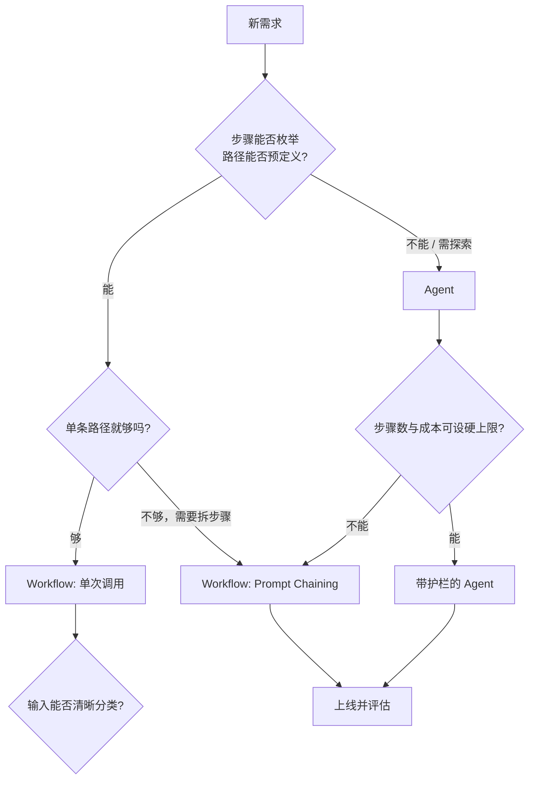
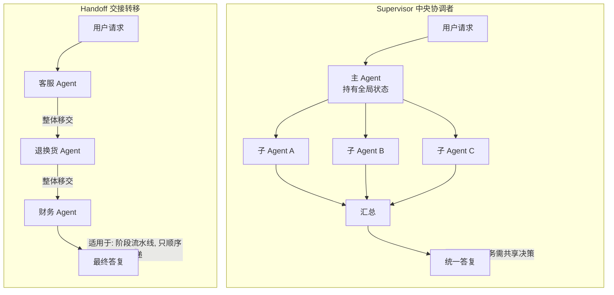
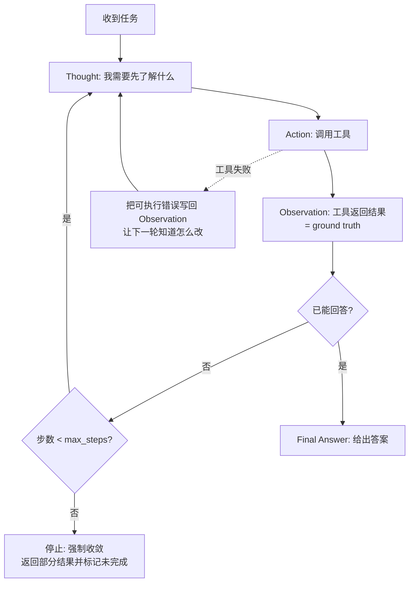
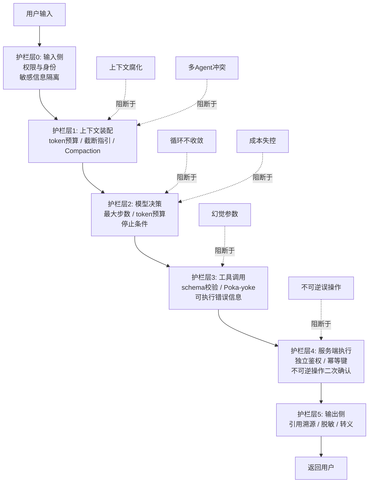

# [[Agent-架构模式]]

> [!tip] 学习目标
> 能对任意一个 Agent 需求做出**可辩护的选型判断**：说清决策权该在代码手里还是模型手里；能在 5 种工作流模式与 Agent 之间选出成本/延迟/可调试性最优的方案；能独立设计一套通过 ACI（智能体-计算机接口）质量审查的工具集，并在代码层给不可逆操作装上护栏。

> [!info] 本篇的边界与断链说明
> 本篇讲**架构原理与设计模式**，不讲任何具体框架的 API 与调用写法（那部分属于 [[Agent-框架]]，尚未创建，属规划中）。
> 本篇引用的 [[RAG-评估]]、[[Agent-框架]]、[[工程化与部署]] 均已存在于库内。原先的规划目标 `Agent-部署与监控` 与 `多 Agent 协作系统` 已分别由 [[工程化与部署]] 与本篇 3.1 节覆盖，故不再作为待写笔记保留。
> 本篇区分两条线：**学术界/官方的模式分类**（第一、二章）与**生产环境的实际做法**（第三章，尤其是 3.1 的正反对照与 3.3 的护栏）——==只背模式名字、不看失败模式，等于没学==。

---

## 🎯 难度分段学习路径

| 难度 | 核心关注 | 预估时长 |
|---|---|---|
| **入门** | Workflow 与 Agent 的边界、5 种工作流模式、何时不该上 Agent、选型决策树 | 12h |
| **进阶** | ACI 工具设计三件套、上下文工程、记忆体系 | 18h |
| **高级** | 多 Agent 协作的正反证据、规划推理模式的代价核算、失败模式与护栏、轨迹级评估 | 16h |

**总学时**：46h ｜ **前置知识**：`[[LLM-基础]]` 的解码与上下文窗口、`[[Prompt-Engineering]]` 的五槽位结构与结构化输出、能读懂 Python

---

## 📖 第一章 入门（Beginner）

### 1.1 Workflow 与 Agent：决策权在谁手里

**结论先行**：==Workflow 与 Agent 唯一的根本区别，是「下一步做什么」这个决定由谁做出。== 由代码写死的是 Workflow，由模型运行时决定的是 Agent。其他所有差异（成本、延迟、可调试性）都是这个根本差异的**派生结果**，不是并列的独立属性。

Anthropic 官方对二者的界定是：

| 概念 | 官方定义（意译） |
|---|---|
| **Workflow（工作流）** | ==LLM 与工具通过**预定义的代码路径**被编排== |
| **Agent（智能体）** | ==LLM **动态决定自己的流程与工具使用**，自主掌控如何完成任务== |

派生的工程差异表（这是本节最该记住的一张表）：

| 维度 | Workflow（代码主导） | Agent（模型主导） |
|---|---|---|
| **决策权** | 开发者，编译期/构建期确定 | 模型，运行时确定 |
| **单次请求的 LLM 调用数** | ==通常 1-3 次，路径固定== | 不可预知，从 1 次到几十次 |
| **延迟** | 可估（各步之和 + 固定开销） | ==分布很宽，长尾明显== |
| **成本** | 可预算 | ==方差大，需要硬上限== |
| **可预测性** | 同输入同输出，可写单元测试 | ==只能统计式断言== |
| **可调试性** | ==栈式回溯，失败点确定== | 需要轨迹（trace）回放，失败点多且分散 |
| **失败模式** | 步骤失败（可捕获、可重试） | ==幻觉参数、循环不收敛、目标漂移== |
| **适用任务** | 步骤可枚举、路径可预设 | ==步骤数不可预知、需要探索== |
| **改动成本** | 改流程要改代码 | ==改提示词即可，灵活性高== |

> [!tip] 一句话判断法
> ==把「下一步做什么」写成 `if/else` 你会不会觉得别扭？== 会别扭说明步骤有真实的不确定性，上 Agent；不别扭、甚至觉得写出来更清楚，那就是 Workflow 更好。绝大多数被包装成「智能体」的产品，核心链路其实是后者。

**填空题**

1. Workflow 与 Agent 的根本区别在于「下一步做什么」这个决定由 ______ 做出。
2. Anthropic 官方把 LLM 与工具通过预定义代码路径编排的系统称为 ______，把由 LLM 动态决定流程与工具使用的系统称为 ______。
3. 在「单次请求的 LLM 调用数」这一维度上，Workflow 通常是 1-3 次，而 Agent 的调用数是 ______（可预知 / 不可预知）。
4. 在可调试性上，Workflow 可以做栈式回溯，而 Agent 只能依赖 ______（trace / trace 与回放）来定位失败点。

**答案**：
1. 谁（代码/开发者，还是模型）
2. Workflow（工作流），Agent（智能体）
3. 不可预知
4. 轨迹 trace（及其回放）

---

### 1.2 何时不该用 Agent：数量级的浪费

**结论先行**：==对能确定性完成的任务使用 Agent，延迟与成本都是数量级的浪费，而任务成功率并不会提高。== 官方的建议顺序非常明确：**先找最简单的可行方案，只在确有需要时才增加复杂度**——很多场景下根本不需要 agentic 系统。

| 信号 | 判定 | 该做什么 |
|---|---|---|
| 步骤固定、规则可枚举 | 不用 Agent | 写 Workflow / 普通代码 |
| 单次 LLM 调用 + 检索就能达到目标质量 | 不用 Agent | ==优化单次调用（检索 + 上下文示例）== |
| 输出能被自动测试验证（如代码能否通过测试） | 谨慎用 Agent | Agent 有价值，但要有评估闭环 |
| 步骤数取决于环境反馈、需要中途改变策略 | 可以用 Agent | 上 Agent + 护栏 |
| 无法预判要跑多少步、需要探索 | ==该用 Agent== | 预算上限 + 沙箱 + 人工卡点 |

**数量级感**：一次「修改十个文件并跑通测试」的 Agent 任务，典型是几十次模型调用；而等价的确定性流水线（改模板 → 跑 lint → 跑测试）是 0-2 次。==不是「贵一点」，而是另一个数量级==。

> [!danger] 「反正模型更强了，上 Agent 吧」是最常见的架构错误
> 更强的模型降低了**部分任务上**对 Agent 的需求，而不是相反。Anthropic 的原文立场是：成功的关键不是构建最精妙的系统，而是构建**适合需求**的系统；只有在简单方案确实不够时，才增加多步 agentic 系统。==把「模型变强」当成「必须上 Agent」的理由，是把因果搞反了。==

**填空题**

1. Anthropic 对构建 LLM 应用的建议起点是「找到最简单的可行方案，只在需要时增加复杂度」，并指出很多场景下可能根本不需要 ______ 系统。
2. 对步骤固定、规则可枚举的任务使用 Agent，延迟与成本的浪费属于 ______（数量级 / 线性）级别。
3. 官方指出，对很多应用而言，只优化带检索和上下文示例的**单次** LLM 调用通常已经 ______（足够 / 不够）。
4. 判断某任务「该不该上 Agent」的核心提问是：把下一步写成 `if/else` 会不会觉得 ______（别扭 / 清楚）。

**答案**：
1. agentic
2. 数量级
3. 足够
4. 别扭

---

### 1.3 五种工作流模式（上）：Prompt Chaining 与 Routing

这五种模式是 Anthropic 官方《Building Effective Agents》给出的体系，**全部属于 Workflow，不是 Agent**。它们可以任意组合，没有强制顺序。

**模式一：Prompt Chaining（链式分解）**

| 项目 | 内容 |
|---|---|
| 机制 | 把任务拆成一串步骤，**每次 LLM 调用处理上一次的输出** |
| 关键点 | ==可以在任意中间步骤加程序化检查（gate）确认进程仍在轨道上== |
| 适用场景 | 任务能被干净地拆成固定子任务；目标就是==用延迟换准确率==，让每次调用变得更简单 |
| 官方示例 | 先写营销文案再翻译；先写提纲→检查提纲是否符合标准→据此写正文 |
| 实现要点 | 1）步骤之间用结构化数据传递，不要传散文；2）gate 必须是代码判定而非模型判定；3）步骤数超过 4 步时错误累积开始明显 |
| 失败模式 | ==中间步骤的错误会静默传递到末端==；拆得太碎导致上下文在每步间丢失；gate 判定为模型判断而非硬规则 |
| 成本 | 延迟 = 各步之和（串行）；准确率高于等价的单次长提示 |

**模式二：Routing（路由分发）**

| 项目 | 内容 |
|---|---|
| 机制 | 对输入做分类，并把输入导向**专门的后续处理流程** |
| 关键点 | ==实现关注点分离，让每个分支都能用专门优化的提示词== |
| 适用场景 | 复杂任务中存在**界限清晰的类别**且分类本身能准确完成（模型或传统分类器都行） |
| 官方示例 | 把客服请求（一般咨询 / 退款 / 技术支持）导向不同下游流程、提示词与工具 |
| 官方示例 | 把简单常见问题路由到更小更便宜的模型，困难罕见问题路由到更强模型 |
| 实现要点 | 1）分类器要能输出「其他」分支；2）每个分支的提示词要**独立迭代**；3）记录路由分布，某一分支占比异常高通常意味着分类有偏 |
| 失败模式 | ==分类错误直接导致整条链路错误，且下游没有能力察觉==；类别设计覆盖不足导致大量输入被硬塞进最像的分支 |
| 成本 | 增加 1 次分类调用；下游成本可因分支特化而下降 |

> [!tip] 选型判断
> ==如果你的问题里出现「这几类请求的处理方式明显不同」，那 Routing 的收益（关注点分离）通常大于「让一个大提示词自己判断」的隐性成本。== 但前提是分类可判别——分类不准时，Routing 只会把错误提前。

**填空题**

1. Prompt Chaining 的机制是把任务拆成一串步骤，每次 LLM 调用处理 ______ 的输出，并可在中间步骤加程序化检查（gate）。
2. Prompt Chaining 的主要取舍是用 ______ 换准确率，让每次 LLM 调用变成更简单的任务。
3. Routing 的价值在于实现 ______，让每个分支都能用专门优化的提示词。
4. Routing 的最大风险是 ______ 错误会直接带偏整条链路，而下游分支通常没有能力察觉。

**答案**：
1. 上一次
2. 延迟
3. 关注点分离
4. 分类

---

### 1.4 五种工作流模式（下）：并行、编排、评估

**模式三：Parallelization（并行化）**——官方明确分为两个变体：

| 变体 | 做法 | 适用场景 | 官方示例 |
|---|---|---|---|
| **Sectioning（分段）** | 把任务拆成**相互独立**的子任务并行跑 | 子任务可并行以提速；或需要多角度审视 | 一个模型实例处理用户查询，另一个实例筛查不当内容（护栏）；自动化评估里每次调用评一个维度 |
| **Voting（投票）** | **同一任务跑多次**得到多样结果，再聚合 | 需要更高置信度；需要多视角投票 | 多个不同提示词分别审查代码漏洞并标记；用多个提示词评估内容是否不当，各自设阈值平衡误报与漏报 |

| 项目 | 内容 |
|---|---|
| 实现要点 | 1）Sectioning 的子任务必须真正独立，有共享写操作就不能并行；2）Voting 要**故意用不同提示词/不同采样温度**，否则多次采样只会得到同一个错答案；3）聚合规则（多数票、加权、置信度阈值）要写死 |
| 失败模式 | ==投票的本质缺陷是相关错误：模型自信地犯同一个错时，多数票反而固化了错误==；Sectioning 若子任务有隐性依赖，合并时冲突 |
| 成本 | ==墙钟时间下降，但 token 总量上升（并发不是省钱手段）== |

**模式四：Orchestrator-Workers（编排者-工作者）**

| 项目 | 内容 |
|---|---|
| 机制 | 中央 LLM **动态**拆任务、委派给 worker LLM、综合结果 |
| 与 Parallelization 的关键差别 | ==拓扑相似，区别在灵活性：子任务不是预先定义的，而是由编排者根据具体输入决定== |
| 适用场景 | 复杂任务且==无法预测需要哪些子任务== |
| 官方示例 | 每次要改多个文件、每个文件改什么取决于任务本身的编码产品；跨多来源收集与分析信息的检索任务 |
| 实现要点 | 1）编排者与 worker 的提示词要完全隔离，否则 worker 会继承编排者的错误假设；2）综合步骤要显式处理「部分 worker 失败」；3）worker 返回的是**结论摘要**，不是完整过程 |
| 失败模式 | ==重复劳动与覆盖缺口==（worker 之间不知道对方做了什么）；编排者把任务切得过细导致协调成本超过收益 |
| 成本 | 协调开销 ≈ 1 次额外调用 + 全部 worker 的摘要回填 |

**模式五：Evaluator-Optimizer（评估者-优化者）**

| 项目 | 内容 |
|---|---|
| 机制 | 一个 LLM 调用生成结果，另一个提供评估与反馈，**两者构成循环** |
| 适用信号（两个都要满足） | 1）**有明确的评价标准**；2）==当人类说清反馈后，输出能被证明确实变好了==，且模型自己能给出这样的反馈 |
| 官方示例 | 文学翻译（译者模型可能漏掉细微之处，评估者模型能给出有用批评）；需要多轮搜索分析、评估者决定是否值得继续搜的复杂检索 |
| 实现要点 | 1）必须设迭代上限与「够好了」的退出条件；2）评估标准要能被机器判定就用规则判；3）评估者与生成者用**不同提示词**，最好不同温度 |
| 失败模式 | ==评估者与生成者犯同一个错→循环空转烧钱==；没有退出条件导致无限迭代；评估标准本身是主观的，循环也救不了 |
| 成本 | 每轮 2 次调用（生成 + 评估），总成本 = 2 × 迭代轮数 |

> [!tip] 什么时候用 Evaluator-Optimizer 的硬判据
> ==先做一次人工对照实验：让人给出反馈，看输出是否真的变好。== 如果人都说不清哪里不好、也不知道该怎么改，这个循环就只是在烧 token，不会带来质量提升。

**填空题**

1. Parallelization 官方给出的两个变体是 Sectioning（拆成独立子任务并行）和 ______（同一任务跑多次再聚合）。
2. Orchestrator-Workers 与 Parallelization 的关键差别是：Orchestrator-Workers 的子任务是 ______ 的，由编排者根据具体输入动态决定。
3. Evaluator-Optimizer 适用的两个前提信号是：有明确的评价标准，以及 ______。
4. Voting（投票）的最大隐患是相关错误：模型如果自信地犯同一个错，投票会 ______ 错误。

**答案**：
1. Voting（投票）
2. 不可预知 / 动态确定
3. 人类给出反馈后输出能被证明确实变好，且模型自己能给出这种反馈
4. 固化（放大）

---

### 1.5 第一章综合练习

**填空题（本章共 4 道，答案见下方）**

1. Workflow 与 Agent 的根本区别是「下一步做什么」由 ______ 决定。
2. Prompt Chaining 的核心取舍是用 ______ 换准确率。
3. Routing 的两个官方用途是：把不同类型的客服请求导向不同流程，以及把简单问题导向 ______ 模型。
4. Orchestrator-Workers 最重要的两个失败模式是重复劳动与 ______。

**本章答案**：
1. 代码（预定义路径）还是模型（运行时动态决定）
2. 延迟
3. 更小、更便宜的（低成本的）
4. 覆盖缺口

**综合项目**：拿一个你见过的「AI 助手」产品（哪怕是别人做的），画出它的完整链路，然后：
1. 把每一个「决策点」标出来，写清是**代码**决定的还是**模型**决定的；
2. 统计如果全部改成 Workflow，可预期的 LLM 调用次数上下界是多少；
3. 判断这个产品是否该退回 Workflow，并给出你的理由与证据（而不是「感觉太重了」）。

> [!tip] 常见陷阱
> 1. **把「用了 LLM」当成「用了 Agent」**：一次结构化输出 + 检索就是 Workflow，不是 Agent。这是本篇最需要先戒掉的习惯。
> 2. **把 5 种模式当成 5 个并列候选**：它们是可以任意**组合**的构建块（官方原话是 not prescriptive），Anthropic 自己的 Research 系统就是 orchestrator + 并行 subagent + 评估循环的组合。
> 3. **以为并行能省钱**：并行只省墙钟时间，token 总量反而上升。别拿并行当成本优化手段。
> 4. **以为模式有优劣之分**：Orchestrator-Workers 与 Parallelization 的差别是**灵活性 vs 预定义**，不是高级 vs 初级。能预定义就别动态。

> [!note] 本章权威资料
> - [Building Effective Agents（Anthropic）](https://www.anthropic.com/engineering/building-effective-agents) —— Workflow/Agent 官方定义、五种模式全文、ACI 原则均出自此文
> - [Don't Build Multi-Agents（Cognition）](https://cognition.ai/blog/dont-build-multi-agents) —— 上下文工程与多 Agent 的反面论证

---

## 📖 第二章 进阶（Intermediate）

> [!warning] 与上一章的衔接
> 第一章解决「**架构形状**」选什么，本章解决「**架构里的零件**」怎么造。跳过的代价：你能选出 Orchestrator-Workers，却因为工具描述写得像一句话而让编排者反复误选工具，==最后归因成「模型不行」==。

### 2.1 ACI 工具设计（一）：工具描述就是提示词

**结论先行**：==ACI（Agent-Computer Interface）是写给 LLM 的接口文档，不是写给 IDE 的代码提示。== 官方的定性是：**你应该像为团队新人写一份优秀的 docstring 那样设计工具**。工具定义与规格应当得到与整体提示词**同等的提示词工程关注度**，因为它们会被加载进 Agent 的上下文，并集体引导工具调用行为。

| 设计维度 | 反例 | 正例 | 原理 |
|---|---|---|---|
| 描述 | `搜索数据库` | `在内部知识库中做全文检索。当用户问到具体的产品/政策事实且这些事实可能只在库内时使用。不要用于开放式闲聊或代码搜索。` | ==说清何时用、何时不用、边界在哪== |
| 边界 | 与 `grep` 描述重叠 | 明确「库内结构化文档用本工具，代码文件用文件搜索工具」 | 工具相似时必须显式划界 |
| 示例 | 无 | 附 1-2 个输入输出示例 + 边界情况 | 官方要求：好工具定义常含示例、边界情况、输入格式要求、与其他工具的清晰界限 |
| 命名 | `query`, `exec`, `run` | `search_knowledge_base`, `run_python_snippet` | 名字是模型第一眼看的东西 |

官方给出的 ACI 经验法则（可直接当自检清单）：

| 原则 | 要点 |
|---|---|
| 站在模型角度自检 | ==仅凭描述和参数，模型能不能立刻知道怎么用？需要仔细思考才行的话，模型也做不到== |
| 像给新人写 docstring | 尤其在有很多相似工具时 |
| **用模型测你的工具** | 跑大量示例输入，看它犯什么错，然后迭代；官方团队就是这么做的 |
| **Poka-yoke（防呆设计）** | ==改参数让犯错变得更难==；官方 SWE-bench Agent 的实例：模型在离开根目录后频繁用相对路径出错，于是把工具改成**只接受绝对路径**，模型立刻不再犯错 |
| 给模型「先想再写」的空间 | 别让格式要求逼它算行数、转义引号 |
| 贴近互联网上的自然文本 | 别设计只有 IDE 才懂的格式 |

> [!danger] 防呆设计是被低估的最高杠杆手段
> ==与其写提示词求模型别犯错，不如改接口让犯错不可能。== 官方的原话是：在他们的 SWE-bench Agent 上，**优化工具的时间超过了优化整体提示词的时间**。这条是本节最值得带回工位的一条。

**填空题**

1. ACI 被官方类比为：应该像为团队里的 ______ 写一份优秀的 docstring 那样设计工具。
2. 工具定义与规格应当得到与整体提示词 ______ 的提示词工程关注度。
3. 官方要求的「Poka-yoke（防呆设计）」指的是通过 ______ 参数，让模型犯错变得更困难。
4. 官方的 SWE-bench Agent 把文件工具改为只接受 ______ 路径，从而消除了模型在非根目录下的路径错误。

**答案**：
1. 新人（初级开发者）
2. 同等 / 一样多
3. 改变 / 调整
4. 绝对（absolute）

---

### 2.2 ACI 工具设计（二）：参数与返回值

**参数设计**

| 规则 | 说明 | 理由 |
|---|---|---|
| **扁平优于嵌套** | `{"query": "...", "options": {"limit": 10, "sort": "date"}}` 改成 `{"query": "...", "limit": 10, "sort": "date"}` | ==嵌套让模型多一层解析，幻觉概率显著上升== |
| 消除转义负担 | 别要求模型在 JSON 字符串里写代码；需要代码就用 markdown 代码块字段 | 官方指出：写 JSON 里的代码需要额外的换行与引号转义 |
| 消除计数负担 | 别让模型在 diff 头里算「改了几行」 | 官方指出：diff 格式要求模型在写新代码前就知道改多少行，这是很自然的一个失败源 |
| 默认值要有用 | 分页/截断/过滤参数给**合理默认值** | 减少模型做无意义决策 |
| 必填项越少越好 | 能从上下文推出来的就别要求模型传 | 少一个必填项就少一个幻觉位 |

**返回值的 token 预算控制**

| 手段 | 做法 |
|---|---|
| 分页 | 一次只返回一页 + `has_more` 标记 |
| 范围选择 | 支持按行/字符区间取片段 |
| 过滤 | 让模型在**检索阶段**就缩小范围，而不是取回全部再删 |
| 截断 | 兜底硬截断；==官方对 Claude Code 的做法是把工具响应默认限制在 25,000 token== |
| **截断时必须留指引** | ==在截断结果里写清楚「还有更多内容，请用 X 参数分页取」==，不要让模型误以为这就是全部 |

> [!tip] 截断不写指引 = 静默的数据丢失
> 被静默截断的工具返回，是 Agent 架构里最隐蔽的故障源之一：模型**看不到自己没看到的东西**，会基于残缺信息给出自信的错误结论。==截断的返回值必须自我声明「我被截断了，这是继续取数的正确方法」==。

**错误信息要可执行**

| 反例（不可执行） | 正例（可执行） |
|---|---|
| `Error: 400 invalid input` | `query 不能为空。请在 query 字段提供 1-200 字符的检索词。若你想按字段精确查找，请改用 filter 参数。` |
| Python traceback 原文 | `日期格式错误：需要 YYYY-MM-DD。你传入的是 "2026/9/25"，请改为 "2026-09-25"。` |

| 项目 | 价值 |
|---|---|
| 为什么重要 | ==错误信息也是提示词==，它会指导模型下一次调用怎么改 |
| 额外收益 | 可引导模型**采用更省 token 的用法**：多次小而精准的检索优于一次宽泛检索 |
| 官方要求 | 错误响应要能明确指出**具体且可操作的改进方向**，而不是不透明的错误码 |

**填空题**

1. 参数设计中「扁平优于嵌套」的理由是嵌套让模型多一层 ______，幻觉概率上升。
2. 官方对 Claude Code 的工具响应做了默认 token 限制，数值是 ______。
3. 被截断的工具返回必须附带 ______ 指引，否则模型会误以为那就是全部数据。
4. 官方认为错误信息本身也是 ______，应当明确指出具体且可操作的改进方向。

**答案**：
1. 解析
2. 25,000 token
3. 分页 / 继续取数的正确方法
4. 提示词

---

### 2.3 ACI 工具设计（三）：数量、粒度与副作用护栏

**工具数量与选择准确率**

| 策略 | 说明 |
|---|---|
| **能不实现就别实现** | 官方明确把「选择该实现与不该实现的工具」列为首要原则。==工具集膨胀是最难逆转的退化== |
| **命名空间隔离** | 用命名空间定义清晰的功能边界（这是官方五条关键原则之一） |
| 每个工具职责单一 | 描述重叠的工具集会让模型在「相近工具」间随机选 |
| MCP 场景尤其危险 | 接了外部 MCP 服务器后，==模型会遇到它从未见过、描述质量参差不齐的工具==；官方的应对是给 Agent 明确启发式：先浏览全部可用工具、把工具用法与用户意图匹配、宽泛外部探索走 web 搜索、优先用专用工具而非通用工具 |
| 可行做法 | 官方团队甚至做了一个**工具测试 Agent**：给它一个有缺陷的 MCP 工具，让它反复试用并重写工具描述；这个改进让后续使用该描述的 Agent **任务完成时间下降 40%** |

> [!tip] 工具选择准确率该怎么测
> ==不要看「整体任务成功率」，要看「工具调用序列正确性」== —— 固定评估集 + 记录每一步调了什么，比只看最终对错灵敏得多。官方的评估集不仅验证结构化响应，还让模型输出**推理与反馈块**（以触发思维链行为），用来探查「它为什么调了这个工具、为什么不调另一个」。同时要记录的指标：单次工具调用与任务总耗时、工具调用总次数、总 token 消耗、工具错误数。

**工具粒度**

| 太粗 | 合适 | 太细 |
|---|---|---|
| 一个 `do_anything(task)` | 一个工具 = 一个清晰意图 | `move_cursor(x, y)` / `type_text(s)` / `scroll(dy)` / `click_button(id)` |
| 问题：模型无法验证中间结果，错误全程不可见 | 参数可枚举、结果可判断、失败可解释 | 问题：==步数爆炸，token 成本呈数量级上升，错误累积== |

==判据：一次工具调用结束后，模型能否拿到足以判断「要不要继续/该不该换路」的明确反馈？== 拿不到就是太粗；步数远超任务复杂度就是太细。

**幂等性与副作用工具的护栏**

| 工具类型 | 幂等 | 护栏设计 |
|---|---|---|
| 读（查询、检索、读文件） | 是 | 无需额外护栏 |
| 写草稿（本地文件、临时区） | 可做到 | 需要时给 `dry_run: true` 让模型先看效果 |
| **不可逆写**（写库、删资源、发消息、提交工单） | 否 | ==默认需要显式确认；把「不可逆」写进工具描述与参数名== |
| **付费/对外**（付款、发外部邮件、下单） | 否 | 服务端二次确认 + 幂等键（idempotency key）+ 额度上限 |
| 删除 | 否 | ==软删除优先；确需硬删时工具名要自我暴露风险（`permanently_delete_`）== |

| 铁律 | 说明 |
|---|---|
| ==鉴权永远在服务端== | 与 [[LLM-基础]] 3.4 一致：模型可能注入、幻觉、误解，==模型只负责提出请求，不负责获得授权== |
| 幂等键去重 | 同一个工具调用重试时不应产生第二次副作用；网络超时后的重试尤其危险 |
| 工具层不信任模型身份 | 调用时用**发起该调用的会话/用户**身份鉴权，而不是模型自称的身份 |
| 限制批量大小 | `delete_files(paths[])` 必须有数组长度上限，否则一次幻觉就能清空仓库 |

**填空题**

1. 官方把「选择该实现与不该实现哪些工具」列为工具设计的第一条原则，理由是工具集 ______ 是最难逆转的退化。
2. 官方的工具测试 Agent 通过反复试用并重写工具描述，使后续 Agent 的任务完成时间下降了 ______。
3. 工具粒度的判据是：一次调用结束后，模型能否拿到足以判断下一步的明确 ______。
4. 对不可逆的付费类工具，重试防护要用 ______（幂等键 / 重试次数上限 / 无需防护）。

**答案**：
1. 膨胀
2. 40%
3. 反馈
4. 幂等键

---

### 2.4 上下文工程：把上下文当有限预算

**结论先行**：==上下文窗口不是「能装多少」的容量问题，而是「注意力预算是多少」的分配问题。== Anthropic 的表述是：大模型和人一样，在某个点后会失去专注或感到困惑；**上下文必须被当作一种边际收益递减的有限资源**；模型有一个用于解析大量上下文的「**注意力预算**」，每引入一个新 token 都会按某种额度消耗它。

| 机制 | 说明 |
|---|---|
| 架构原因 | Transformer 让每个 token 关注所有其他 token，n 个 token 有 $n^2$ 对关系；上下文越长，模型捕捉这些成对关系的能力被摊薄 |
| RoPE 等位置插值 | 让模型能处理更长序列，但**对 token 位置的理解带一定退化** |
| 结果形态 | ==性能是梯度下降而非断崖==：长上下文下模型仍然很有能力，但信息检索与长程推理的精度会下降 |
| 实证 | 大海捞针类测试揭示了 **context rot（上下文腐化）**：==随着上下文 token 数增加，模型从上下文中准确召回信息的能力下降==；不同模型退化速度不同，但这一特性在所有模型上都出现 |

**三种主流缓解手段**（官方给出的长程任务方案）：

| 手段 | 做法 | 适合 | 代价 |
|---|---|---|---|
| **Compaction（压缩/摘要）** | 接近窗口上限时把对话内容摘要化，==用摘要重新开启一个新上下文窗口==；保留架构决策、未解决的 bug、实现细节，丢弃冗余工具输出与消息 | 需要大量来回对话的任务 | ==摘要丢失信息，且丢失不可逆==；过度压缩会把关键细节一起压掉 |
| **结构化笔记（note-taking）** | Agent 把状态外置成文件，按需读回 | 有清晰里程碑的迭代开发 | 需要设计好笔记的读写约定 |
| **子 Agent 架构** | 专门的子 Agent 用干净窗口做深挖，可能烧掉几万 token，但==只返回 1,000-2,000 token 的浓缩结论== | 复杂研究与分析，并行探索有收益 | 协调开销；子 Agent 看不到主 Agent 的完整上下文（见 3.1 的争议） |

| 场景 | 官方给出的选型 |
|---|---|
| 需要大量来回对话 | Compaction 保持对话流畅 |
| 有清晰里程碑的迭代开发 | 结构化笔记 |
| 复杂研究与分析 | 多 Agent 架构 |

**==工具返回塞满上下文是常见故障源==**

| 症状 | 根因 | 修法 |
|---|---|---|
| 跑到第 10 步开始胡言乱语 | 前 9 步的工具返回把上下文塞满 | 按 2.2 做分页/过滤/截断 + 截断指引 |
| 同一工具反复调用拿同一批数据 | 上下文太长，模型忘了自己已经取过 | 工具返回里回带 `已取过区间` 标记 |
| 明明文档在上下文里却没被引用 | context rot，中部信息召回率低 | ==把最关键的信息放在上下文的开头或结尾==，中间放支撑材料 |
| 跨文件风格不一致 | 每个子 Agent 各写各的 | 见 3.1：共享完整轨迹而非单条消息 |

**上下文工程的定义与判据**

> [!tip] 上下文工程 vs 提示词工程
> 提示词工程是**离散的、一次性的**任务：怎么写好系统提示词。上下文工程是**迭代的**：==在每次决定「把什么传给模型」时做取舍==，对象包括系统指令、工具定义、MCP 外部数据、消息历史等。官方给出的核心判据是：==找到能最大化目标达成概率的、最小的、高信噪比的 token 集合==。

**填空题**

1. 官方把模型用于解析大量上下文的容量称为 ______ 预算，每引入一个新 token 都会消耗它。
2. 大海捞针类测试揭示的「上下文 token 越多、从上下文准确召回信息的能力越下降」的现象叫 ______。
3. Compaction 的做法是接近窗口上限时把内容摘要化，然后 ______（重新开启一个新窗口 / 丢弃整个会话）。
4. 官方给出的上下文工程核心判据是：找到能最大化目标达成概率的、**最小的**、______ 的 token 集合。

**答案**：
1. 注意力
2. 上下文腐化（context rot）
3. 重新开启一个新窗口
4. 高信噪比

---

### 2.5 记忆体系：四类记忆与污染治理

**结论先行**：==记忆系统的设计重点不是「存多少」，而是「什么时候写、写给谁看、谁能改」。== 一个会写记忆的 Agent，同时也是一个会**污染自己历史**的 Agent。

| 记忆类型 | 存什么 | 生命周期 | 典型存储 |
|---|---|---|---|
| **短期记忆** | 当前会话内的消息历史、工具返回、当前计划 | 单次会话 | 消息数组 / 滚动窗口 |
| **长期记忆** | 跨会话仍需要的东西：用户偏好、项目状态、已积累的知识库 | 跨会话 | 文件系统或外部存储 |
| **情景记忆**（episodic） | ==「什么时候、发生了什么」的完整事件记录==：某次对话做了什么、某次排障的步骤 | 跨会话 | 带时间戳的事件日志 |
| **语义记忆**（semantic） | 剥离了具体时序的**事实与关系**：这个用户用 Python、这个项目用 Postgres | 跨会话 | 知识条目 / 向量库 / 关系表 |

情景记忆与语义记忆的区别是本节最值得记住的一句：==情景记忆是「发生了什么」，语义记忆是「什么是真的」==。前者用于复盘与追溯决策路径，后者用于直接回答。

| 机制 | 说明 |
|---|---|
| 记忆工具（memory tool） | Anthropic 在 Sonnet 4.5 发布时公开测试的**文件式记忆工具**：让 Agent 把信息存在上下文窗口之外，随时间建立知识库、跨会话保持项目状态、引用之前的工作，==而不需要把所有东西塞在上下文里== |
| MemGPT 思路 | 把上下文窗口当作虚拟内存，提出分层管理让模型自己决定何时把内容换出到外部存储 |
| Generative Agents 的记忆流 | 模拟人类行为时，把观察按可检索的形式累积，并按「重要性 × 时近性 × 相关性」检索 |
| Just-in-time 取回 | ==预先塞入的内容会过期；让 Agent 用 `glob`/`grep` 之类原语在需要时现取==，可以绕开索引过期与复杂语法树的问题 |

**==记忆写入的污染风险与治理==**

| 风险 | 表现 | 治理手段 |
|---|---|---|
| **写入未经验证的信息** | 模型幻觉的内容被当成事实写进长期记忆，之后每次都被召回 | ==写入前加事实核验（检索/规则/人工）；不确定的一律标记为「假设」并隔离== |
| **一次性噪声固化** | 一次会话里的临时约定（"这次用 SQLite"）被永久记成用户偏好 | 记忆条目带 `来源`、`时间戳`、`置信度`、`作用域（会话/项目/全局）`；读取时按作用域过滤 |
| **错误无法纠正** | 错误记忆污染所有后续推理 | 记忆必须==可编辑、可删除、带版本==；提供「这条记忆从哪来」的溯源 |
| **无节制增长** | 记忆越多，检索越慢、越容易召回噪声 | 定期去重与淘汰；按重要性和使用频次衰减；==给记忆条目数设上限== |
| **检索偏差** | 语义检索只召回「最像」的记忆，丢失不相似但重要的 | 混合检索（语义 + 关键词 + 近期）；==对「用户明确纠正过的内容」加高优先级标记== |

> [!danger] 记忆写入是唯一会让 Agent 错误「跨会话传染」的通道
> 工具调用错了，这次会话结束就过去了；==记忆写错了，之后每一次会话都带着这个错误出发==。所以记忆写入的验证强度应当**高于**普通工具调用。

**填空题**

1. 情景记忆记录的是「什么时候、发生了什么」的完整事件；语义记忆记录的是 ______（事实与关系 / 事件时间线）。
2. Anthropic 随 Sonnet 4.5 公开测试的记忆工具采用 ______ 式存储，让信息留在上下文窗口之外。
3. Just-in-time 取回相对「预先塞入」的一个关键优势是能绕开索引过期与 ______ 的问题。
4. 记忆条目的作用域至少要区分会话级、______ 级与全局级，以避免一次性噪声被永久固化。

**答案**：
1. 事实与关系
2. 文件
3. 复杂语法树
4. 项目

---

### 2.6 第二章综合练习

**填空题（本章共 4 道，答案见下方）**

1. ACI 的官方类比是：像给团队里的 ______ 写一份优秀的 docstring。
2. 官方对 Claude Code 的工具响应默认 token 上限是 ______。
3. 上下文腐化（context rot）指的是随着上下文 token 数增加，模型从上下文准确召回信息的能力 ______。
4. 子 Agent 架构的典型收益是：子 Agent 可以烧掉数万 token 深挖，但只返回 ______ 左右的浓缩结论。

**本章答案**：
1. 新人
2. 25,000 token
3. 下降
4. 1,000-2,000 token

**综合项目**：给你现有项目（或你打算写的项目）设计一套 ACI，并做一次自检：
1. 列出所有工具，按「该不该实现」删掉至少一个；
2. 对每个工具检查：描述里有没有写**何时不用**、参数有没有嵌套、有没有强制转义负担、返回值有没有分页与截断指引、错误信息能不能直接照着改；
3. 把所有带副作用的工具列出来，标注哪些需要幂等键、哪些需要人工确认、哪些需要服务端二次鉴权；
4. 估算一次典型任务的上下文增长：每步工具返回多少 token，第几步会触发压缩。

> [!tip] 常见陷阱
> 1. **把工具描述写成一句话**：描述是加载进上下文的提示词，不是注释。写不好它，后面所有的架构优化都会被抵消。
> 2. **工具返回不做 token 预算**：这是 Agent 跑到第 10 步突然变傻的头号原因。
> 3. **截断时不给指引**：模型不会知道你没给它看的东西，==静默截断等于静默制造错误结论==。
> 4. **无脑依赖框架**：官方明确警告框架的抽象层会**遮蔽底层的提示词与响应，让调试变难**，并且诱导你在简单方案够用时加复杂度。官方建议从直接调 LLM API 开始，很多模式几行代码就能实现；要用框架，也要理解底下的代码。
> 5. **把摘要压缩当成无损操作**：Compaction 会丢信息，且不可逆。压缩策略要显式设计「保留什么」（架构决策、未解决 bug）而不是笼统地「摘要」。

> [!note] 本章权威资料
> - [Building Effective Agents（Anthropic）](https://www.anthropic.com/engineering/building-effective-agents) —— ACI 原则、Poka-yoke、格式与转义建议
> - [Writing effective tools for agents — with agents（Anthropic）](https://www.anthropic.com/engineering/writing-tools-for-agents) —— 工具五条原则、token 效率、工具评估指标
> - [Effective context engineering for AI agents（Anthropic）](https://www.anthropic.com/engineering/effective-context-engineering-for-ai-agents) —— 注意力预算、上下文腐化、压缩/笔记/子 Agent
> - [Context Rot: How Increasing Input Tokens Impacts LLM Performance（Chroma Research）](https://research.trychroma.com/context-rot) —— 上下文腐化的研究侧证据
> - [MemGPT: Towards LLMs as Operating Systems](https://arxiv.org/abs/2310.08560) · [Generative Agents: Interactive Simulacra of Human Behavior](https://arxiv.org/abs/2304.03442)

---

## 📖 第三章 高级（Advanced）

> [!note] 深度标准
> 本章每一条判断都区分两件事：**官方/学术界怎么说**（可引用、可复现）与 **生产环境实际上怎么做**（有正反两方证据）。多 Agent 章节尤其如此——==这是本领域争议最大、也最容易被演讲稿带偏的地方==。

### 3.1 多 Agent 协作：四种模式与两方证据

**四种模式**

| 模式 | 机制 | 适用场景 | 协调开销 | 典型失败模式 |
|---|---|---|---|---|
| **Supervisor（中央协调者）** | 一个主 Agent 持有全局状态，动态派发并汇总子任务 | 任务可分解、需要全局一致 | 中（主 Agent 需持有全部意图） | ==重复劳动、覆盖缺口==（子 Agent 不知道彼此在做什么） |
| **Handoff（交接转移）** | ==对话在 Agent 之间整体转移==，不回到协调者 | 明确的阶段流水线（如客服：咨询→退换货→财务） | 低（线性） | ==上下文在交接处丢失==；转错了没人拦 |
| **Debates（辩论）** | 多个 Agent 多轮相互质疑，投票收敛 | 需要多视角对抗的高风险判断（事实核查、风控） | 高（轮次 × Agent 数） | ==固执：多个 Agent 共享同一预训练偏差时，辩论收敛到同一个错误答案==；成本爆炸 |
| **Swarm（群体自主）** | Agent 通过交接函数互相调用，没有中心控制 | 演示、研究、大规模松耦合任务 | 中高（协议复杂度） | ==状态难以追踪与复现==；官方已将其标记为实验性质 |

> [!tip] Supervisor 与 Handoff 的选型判断
> ==需要「全局一致」（多个子任务必须互相不冲突）→ Supervisor；流程阶段清晰且每阶段信息需求不同 → Handoff。==
> 判断口诀：==子任务之间**要**共享决策 → Supervisor；子任务之间**只**顺序传递 → Handoff。==

| 模式 | 全局一致 | 状态可追踪 | 并行潜力 | 成本可控性 |
|---|---|---|---|---|
| Supervisor | ==强== | 中（主 Agent 侧可观测） | 高 | 中 |
| Handoff | 弱（易丢失） | ==强==（线性轨迹） | 弱 | ==强== |
| Debates | 中 | 弱（轮次多、发言散乱） | 中 | 弱 |
| Swarm | 弱 | ==弱== | 高 | 弱 |

**两方证据（必须一起读）**

| 来源 | 主张 | 关键数字 / 论据 |
|---|---|---|
| Anthropic《How we built our multi-agent research system》 | ==多 Agent 在**广度优先**的查询上显著优于单 Agent== | 内部研究评估中，以 Claude Opus 4 为 lead、Sonnet 4 为 subagent 的多 Agent 系统比单 Agent Opus 4 高出 **90.2%**；在 BrowseComp 上，**token 使用量单独解释了 80% 的性能方差**，工具调用数与模型选择是另外两个因素 |
| Cognition《Don't Build Multi-Agents》 | ==多 Agent 架构在 2025 年的生产环境是脆弱的，应默认排除不遵守两条原则的架构== | 原则一：**共享上下文，共享完整 Agent 轨迹而非单条消息**；原则二：**动作携带隐含决策，冲突的决策带来糟糕结果** |

Cognition 的论证值得完整记住，因为它给出了失败机理而不只是结论：

| 反例 | 机理 |
|---|---|
| 「做一个 Flappy Bird 克隆」被拆成「做会动的绿色水管背景」和「做能上下移动的小鸟」 | ==子 Agent 误解子任务==：一个把背景做成了超级马里奥风格，另一个做的鸟不像游戏素材也不按 Flappy Bird 的方式动。==最终 Agent 只能去合并两份误解== |
| 把原始任务也复制给每个子 Agent | 多轮会话 + 工具调用产生的细节无处不在，复制任务描述不能复制决策上下文 |
| 让子 Agent 共享彼此的工作 | ==两个子 Agent 看不到对方在做什么，产出风格完全不一致==，因为它们的动作基于互相冲突的假设 |

Cognition 的两条实践参照：

| 参照 | 做法 | 为什么有效 |
|---|---|---|
| **Claude Code 的子 Agent** | 截至 2025 年 6 月，==它从不在子任务期间并行，且子 Agent 通常只被要求回答问题，不写代码== | 子 Agent 缺少主 Agent 的上下文，做不了超出「回答一个良定义问题」的事；并行的子 Agent 会给出冲突结果。收益是子 Agent 的调查工作不必留在主 Agent 历史里，==能撑更长的轨迹== |
| **编辑应用模型（edit apply model）** | 2024 年常见做法：大模型输出 markdown 变更说明，小模型据此重写文件 | 极其脆弱：==小模型常常因为指令里最细微的歧义就做出错误编辑==。现在==编辑的决策与执行更多由单个模型在一次动作中完成== |

**生产环境的实际做法（综合两方）**

| 项目 | 实际做法 |
|---|---|
| 主干链路 | ==**单线程线性 Agent**==：上下文连续、行为可预测，能走多远走多远 |
| 长任务 | 上下文溢出时引入**专门做压缩的模型**，把动作与对话历史压成关键细节、事件与决策 |
| 并行 | ==只在「子任务之间不需要共享决策」时启用==（例如多个互不影响的检索方向） |
| 教编排者如何委派 | 每个子任务必须给到：目标、输出格式、工具与来源指引、清晰的任务边界。==没有详细任务描述，Agent 就会重复劳动、留下缺口== |
| 按复杂度分配投入 | ==把扩展规则写进提示词==：简单事实查找 1 个 Agent、3-10 次工具调用；直接对比 2-4 个子 Agent、每个 10-15 次调用；复杂研究可能需要 10 个以上子 Agent 且职责划分明确 |
| 搜索策略 | ==先宽后窄==：先短而宽的查询评估可用性，再逐步收窄（模型默认倾向写又长又窄的查询，只返回少量结果） |
| 让 Agent 自我改进 | 官方的工具测试 Agent 发现描述缺陷并重写，使后续任务完成时间**下降 40%** |
| 可复现性 | Swarm 式的完全自主群体在生产中价值有限，==官方仓库已自述为实验性、鼓励用现成方案替代== |

**学术界的分类 vs 生产环境**：学术界（AutoGen、TaskWeaver、CrewAI、Swarm 等框架）提供的是**机制空间**——它们告诉你「多 Agent 可以怎么组」；生产环境的共识是**默认单 Agent，只在广度优先探索时上多 Agent，且必须让子 Agent 只读不写或写不相交的区域**。==把框架的机制空间直接当成架构建议，是这个领域最常见的误读。==

**填空题**

1. Handoff 模式的本质是 ______ 在 Agent 之间整体转移，不回到协调者。
2. Supervisor 模式最典型的两个失败模式是重复劳动与 ______（覆盖缺口 / 上下文丢失）。
3. Anthropic 内部评估中，Opus 4 为 lead、Sonnet 4 为 subagent 的多 Agent 系统比单 Agent Opus 4 高出 ______。
4. Cognition 主张共享 Agent 上下文时应共享**完整轨迹**而不是 ______。

**答案**：
1. 对话
2. 覆盖缺口
3. 90.2%
4. 单条消息

---

### 3.2 规划与推理模式：每个都要算清代价

**关键提醒**：==这些模式大多在推理基准上验证过，但**基准增益不等于生产收益**。生产环境里每一层循环都是真金白银的延迟与 token，==默认应该从最简单的模式起步，确有可测量收益时再加层==。

| 模式 | 核心机制 | 额外 LLM 调用数 | 适合 | 不适合 / 风险 |
|---|---|---|---|---|
| **ReAct** | ==推理（Thought）与行动（Action）交替的循环==：想 → 调工具 → 看结果 → 再想，直到给出答案 | 每步 1 次，步数不可预知 | 需要与环境交互、信息逐步获得的探索型任务 | 循环不收敛；步数不可控导致成本方差大。**必须设最大步数** |
| **Reflexion** | ==语言化的自我反思写入外部记忆==，下一轮带着「上次哪错了」重试 | 每次重试额外 1 次反思生成 | 有可验证成败信号的任务（可编译、可测试） | ==反思文本本身可能包含幻觉错误结论，并污染后续所有轮次==；需要额外记忆存储 |
| **Plan-and-Execute** | ==先出完整计划，再逐步执行==（Plan-and-Solve 论文的核心：先规划出子任务，再照着做；PS+ 再加详细指令减少计算错误） | 规划 1 次 + 每步 1 次 | 子任务边界清晰、顺序重要 | ==计划一旦错，==后面每步都基于错误前提==，且执行器往往不会回头改计划；步骤数不匹配时要能触发重规划 |
| **Tree of Thoughts** | ==在推理时展开一棵思想树，显式评估多个分支后再决定走哪条== | 每个节点 1 次，节点数 = 分支宽度 × 深度 | 需要探索多个解法路径的空间搜索问题 | ==成本是线性 CoT 的指数倍==；需要可靠的分支价值评估函数，评估不准则树搜索退化 |
| **Self-Ask** | ==模型显式地先问自己后续问题并作答，再给最终答案==，用 `Follow up:` / `So the final answer is:` 这样的脚手架标记 | 每个追问 1 次（可接搜索引擎回答追问） | 组合式多跳问题 | 追问无收敛判据会无限追问；**实现极轻量**（把追问丢给搜索引擎答案回填即可） |
| **LATS**（Language Agent Tree Search） | ==把树搜索 + 反思 + 自我调整三者结合==：采样多个候选动作、执行、按环境反馈与反思打分、回溯扩展 | 每层：采样 + 执行 + 评估 + 反思，≈ 4 次/步 | 搜索/导航类、需要从失败中回溯的任务 | ==是本表中最贵的模式==；需要环境提供有信息量的反馈信号，否则评估无从下手 |

> [!danger] ReAct 循环必须有三条硬护栏
> 1）==**最大步数** `max_steps`：超限即停止并返回部分结果==（官方也把「设定停止条件，如最大迭代次数」列为控制手段）；
> 2）**重复检测**：同一工具同一参数连续调用 2 次即中断，避免死循环烧钱；
> 3）==每一步必须从环境拿 ground truth（工具结果、代码执行结果）来判断进展==，不能靠模型自评。官方对此的表述是：执行期间 Agent 从环境每一步获得「ground truth」以评估进展至关重要。

| 模式 | 成本档位 | 上生产前的必答问题 |
|---|---|---|
| ReAct | 中（≈ 步数倍） | 步数的 p99 是多少？超限行为是什么？ |
| Reflexion | 中高（≈ 轮数 × 2） | 反思文本怎么验证？错误的反思怎么剔除？ |
| Plan-and-Execute | 中 | 计划错了怎么办？能重规划吗？ |
| Tree of Thoughts | ==高（指数）== | 分支价值谁给？给不准怎么退回线性？ |
| Self-Ask | 低-中 | 追问何时停止？ |
| LATS | ==最高== | 环境的反馈信号够不够有信息量？ |

**填空题**

1. ReAct 循环中，官方强调 Agent 每一步都应从环境获得 ______（ground truth / 自我评价）来判断进展。
2. Reflexion 的关键机制是把语言化的自我反思写入 ______。
3. Plan-and-Solve 论文的机制是：先规划出 ______，再照着执行。
4. LATS 把树搜索、反思与 ______ 三者结合起来。

**答案**：
1. ground truth（工具结果、代码执行结果等环境反馈）
2. 外部记忆
3. 子任务
4. 自我调整

---

### 3.3 失败模式与护栏：把防线放在哪里

**八类失败模式与对应护栏位置**

| 失败模式 | 典型表现 | 护栏放在哪一层 | 具体做法 |
|---|---|---|---|
| **工具调用失败** | 异常、404、参数校验不过 | 工具层 + 循环层 | ==把错误写成可执行提示==（见 2.2）；失败重试**最多 2-3 次**后换路径；相同错误重复出现即换策略 |
| **幻觉的工具参数** | 传了不存在的 ID、编造的表名 | ==工具层（最优）== | 用枚举/schema 约束参数；Poka-yoke 改参数（只接受绝对路径）；工具返回时校验并给出可执行错误 |
| **循环不收敛** | 反复读同一文件、反复搜索同一关键词 | 循环控制层 | ==最大步数硬上限==；重复调用检测；连续 N 步无新信息即中断 |
| **成本失控** | 单请求烧掉几十万 token | 预算层 | 每请求 token 上限与金额上限；分步骤预算；==超限即降级为更便宜的模型或直接返回部分结果== |
| **目标漂移** | 做着做着偏离原始需求 | 编排层 | 定期把原始目标重新注入上下文；每步后自检「这一步是否服务于目标」 |
| **不可逆操作误执行** | 删库、发消息、付款 | ==工具层 + 服务端== | 默认需显式确认；幂等键；软删除优先；==鉴权在服务端，模型不获得授权== |
| **上下文腐化** | 第 10 步开始变傻 | 上下文层 | 分页/截断+指引；Compaction；关键信息置首尾；子 Agent 隔离 |
| **多 Agent 冲突** | 产出互相矛盾、风格不一 | 协作层 | 共享完整轨迹；==只读不写或写不相交区域==；子任务给到目标/格式/工具/边界四要素 |

> [!tip] 护栏的位置原则
> ==护栏要尽量**贴近失败发生的地方**==。把「不要删库」写在系统提示里是最弱的一环（软约束，会被诱导、可被绕过）；把「`permanently_delete` 需要二次确认且有幂等键」写进工具层和服务端，才是真的护栏。==同理，幻觉参数要在工具层挡（schema 约束），不要在提示里求模型「仔细点」==。

**中断与恢复**

| 问题 | 做法 |
|---|---|
| 进程崩了/超时了，Agent 正做到一半 | 把轨迹（消息 + 工具调用 + 结果）**持久化**，恢复时从最后一条完成的消息重放，而不是从头重来 |
| 恢复时的重复副作用 | 靠幂等键；每个工具调用带一个客户端生成的唯一 id，恢复时用它去重 |
| 会话被压缩后无法继续 | Compaction 时**显式保留**：架构决策、未解决的 bug、实现细节；以及「已完成/未完成」的进度清单 |
| 人工介入后继续 | 人工修改要作为一条**明确的用户消息**进入轨迹，而不是隐式改系统提示——==隐式修改会让后续行为无法解释== |
| 中途换了模型 | 上下文不兼容（工具调用格式差异）要显式处理，==最保险的做法是换模型即新开会话并交接摘要== |

**为什么需要多 Agent 也会失败（有据可查）**

| 证据 | 内容 |
|---|---|
| MAST（多 Agent 系统失败分类法） | 基于 7 个主流 MAS 框架的 1600+ 条标注轨迹，构建了第一个多 Agent 系统失败分类法；通过 150 条轨迹的严格分析识别出 ==**14 种独特失败模式，聚为 3 类：系统设计问题、Agent 间不对齐、任务验证**==（标注一致性 kappa = 0.88） |
| 论文的核心观察 | ==尽管对多 Agent LLM 系统（MAS）存在热情，它们在主流基准上的性能增益往往很小== |
| 由此推出的工程结论 | ==多 Agent 不是免费的能力提升；不给它做任务验证机制，它就是纯粹的协调开销== |

**填空题**

1. 护栏应当尽量放在 ______（贴近失败发生的地方 / 提示词里）。
2. 抑制「成本失控」这一失败模式的护栏层次是第 ______ 层（按文中 0-5 编号），对应最大步数与 token 预算。
3. 抑制「幻觉的工具参数」最有效的护栏位置是工具层的 ______ 约束。
4. MAST 归纳的多 Agent 失败模式共 ______ 种，聚为 3 大类。

**答案**：
1. 贴近失败发生的地方
2. 2
3. schema / 参数格式
4. 14

---

### 3.4 评估挂钩：轨迹级而非结果级

**结论先行**：==Agent 的评估必须看**轨迹**（工具调用序列），不能只看最终答案对错。== 原因：同一个错误答案可能来自完全不同的轨迹（一次搜索命中 vs 二十次乱撞碰对了），它们的成本、风险与稳定性天差地别。

**指标层次**

| 层次 | 指标 | 说明 |
|---|---|---|
| **轨迹级（核心）** | ==工具调用序列正确性== | 该调的调了吗？顺序对吗？参数对吗？（与 [[RAG-评估]] 的检索级评估对齐） |
| 轨迹级 | 总工具调用次数 | 效率的直接度量 |
| 轨迹级 | 工具错误数与重试次数 | 稳定性 |
| 轨迹级 | 步骤序列与步数分布 | 是否收敛、是否有长尾 |
| 成本级 | 总 token 消耗、单任务总耗时 | ==成本不可预测是 Agent 的固有属性，必须作为一等指标监控== |
| 结果级 | 任务成功率 | 必要但不充分 |
| 结果级 | ==一致性（多次运行的稳定性）== | ==只看一次成功率会被运气骗== |

**为什么必须看一致性：τ-bench 的证据**

| 发现 | 数据 |
|---|---|
| 现有基准不测试 Agent 与人类用户的交互，也不测试遵循领域规则的能力 | 这两项恰是真实部署的关键 |
| ==即便是当时最先进的函数调用 Agent，成功率也低于 50%== | 实验环境为零售、航空等真实领域，配有领域专属 API 工具与策略指南 |
| ==一致性极差：在零售领域 `pass^8 < 25%`== | `pass^k` 指标衡量 Agent 在多次试验中的可靠性 |

> [!danger] 单次成功率是最有欺骗性的指标
> 一个 `pass^1 = 40%` 但 `pass^8 = 15%` 的 Agent，意味着**用户每重试几次就会遇到一次不同的结果**。==生产环境真正该优化的是 pass^k，不是 pass^1==。

**Agent 专用基准的位置**

| 基准 | 测什么 | 适合本篇的哪个部分 |
|---|---|---|
| **AgentBench** | 8 个不同环境评估 LLM-as-Agent 的推理与决策能力 | 横向比较模型；其结论是==长程推理、决策与指令遵循能力是可用 Agent 的主要障碍==，且「在代码上训练」对不同 Agent 任务的影响是**两面性的**（与常识相反） |
| **τ-bench** | 模拟用户（由语言模型扮演）与 Agent 的动态对话，配领域 API 工具与策略；用 `pass^k` 衡量可靠性 | ==Agent 遵循规则与一致性的核心基准== |
| **MAST / MAST-Data** | 多 Agent 失败分类法与 1600+ 标注轨迹 | 多 Agent 架构的失败模式排查 |

| 评估实践 | 做法 |
|---|---|
| 让评估本身暴露推理 | ==不只验证结构化响应块，还让模型输出**推理与反馈块**==；官方指出在工具调用与响应块前指示模型输出这些内容，可能通过触发思维链行为提升其有效智能 |
| 探查「为什么没调」 | 官方实验里开启了 interleaved thinking，==用来探查 Agent 为什么调或不调某个工具==，并指出改进工具描述与规格的具体方向 |
| 分层看指标 | 官方推荐在顶层准确率之外，还采集：单次工具调用与任务的总耗时、工具调用总次数、总 token 消耗、工具错误数 |
| 留出测试集 | 官方用的是 **held-out test set**，避免对着调参用的集合优化 |
| 轨迹追踪可发现新工具 | ==记录工具调用能揭示 Agent 反复走的工作流，并提示工具可以合并== |

**填空题**

1. Agent 的评估必须看 ______（工具调用序列 / 最终答案），因为同一个错误答案可能来自完全不同的轨迹。
2. τ-bench 报告当时最先进的函数调用 Agent 成功率 ______ 50%。
3. 衡量 Agent 多次运行稳定性的指标记作 ______，它在零售领域低于 25%。
4. AgentBench 的结论认为，开发可用 Agent 的主要障碍是长程推理、决策与 ______ 能力。

**答案**：
1. 轨迹（工具调用序列）
2. 低于
3. `pass^k`
4. 指令遵循

---

### 3.5 第三章综合练习

**填空题（本章共 4 道，答案见下方）**

1. Supervisor 与 Handoff 的选型口诀是：子任务之间**要**共享决策选 ______；只顺序传递选 ______。
2. Cognition 主张的默认架构是 ______ 线性 Agent，多 Agent 只在子任务之间不需要共享决策时启用。
3. ReAct 循环的三条硬护栏是：最大步数 ______、重复调用检测，以及每步必须从环境获得 ______。
4. MAST 把多 Agent 的 14 种失败模式聚为三类：系统设计问题、Agent 间不对齐，以及 ______。

**本章答案**：
1. Supervisor，Handoff
2. 单线程
3. 上限，ground truth
4. 任务验证

**综合项目**：拿一个真实的（或你设计的）多步骤 Agent 任务，做一次**架构审计**：
1. 画出当前链路，标出每一个决策点：代码决策还是模型决策；
2. 列出所有「不可逆或对外」的工具，检查是否都有幂等键 + 服务端鉴权 + 二次确认；
3. 统计典型任务的工具调用次数分布（p50 / p95 / p99），找出长尾在哪；
4. 定义 3 个轨迹级指标 + 1 个成本指标 + 1 个 `pass^k` 指标；
5. 最后写一段 200 字的判断：这套系统里，哪一部分该退回 Workflow，哪一部分必须留 Agent，理由分别是什么。

> [!tip] 常见陷阱
> 1. **把多 Agent 当成能力升级**：学术研究明确指出，MAS 在主流基准上的增益常常很小，而且需要任务验证机制才吃得到收益。==多 Agent 是协调开销，不是免费的能力。==
> 2. **只引一方观点**：Anthropic 的 90.2% 与 Cognition 的「默认排除」并不矛盾——前者说的是**广度优先的检索型查询**，后者说的是**需要全局一致的任务**。==引用时必须带上场景限定，否则就是在误导读者。==
> 3. **把 Bench 上多步的分数错算到推理模式上**：LATS、Tree of Thoughts 这类指数级代价的模式，其增益在推理基准上测得，**在生产任务上未必能覆盖成本**。默认从 ReAct 或最简单模式起步。
> 4. **用 `pass^1` 汇报效果**：τ-bench 的一致性数据说明单次成功率会骗人。==汇报要带 `pass^k`==。
> 5. **框架至上**：官方明确警告框架的抽象层会遮蔽底层提示词与响应，并诱导你在简单方案够用时加复杂度。==框架是实现手段，不是架构决策==。

> [!note] 本章权威资料
> - [Building Effective Agents（Anthropic）](https://www.anthropic.com/engineering/building-effective-agents) —— Agent 的 ground-truth 要求、停止条件、框架抽象层警告
> - [How we built our multi-agent research system（Anthropic）](https://www.anthropic.com/engineering/multi-agent-research-system) —— 90.2% 提升、token 使用解释 80% 方差、委派四要素、按复杂度分配投入、工具描述自优化降本 40%
> - [Don't Build Multi-Agents（Cognition）](https://cognition.ai/blog/dont-build-multi-agents) —— 共享完整轨迹、动作携带隐含决策、Claude Code 子 Agent 的定位、edit-apply-model 的教训
> - [Why Do Multi-Agent LLM Systems Fail?](https://arxiv.org/abs/2503.13657) —— MAST 失败分类法，14 种失败模式与 3 大类
> - [τ-bench: A Benchmark for Tool-Agent-User Interaction in Real-World Domains](https://arxiv.org/abs/2406.12045) —— `pass^k` 与一致性
> - [AgentBench: Evaluating LLMs as Agents](https://arxiv.org/abs/2308.03688) —— 8 环境横向评估与失败原因
> - [Writing effective tools for agents — with agents（Anthropic）](https://www.anthropic.com/engineering/writing-tools-for-agents) —— 轨迹级评估指标
> - [ReAct: Synergizing Reasoning and Acting in Language Models](https://arxiv.org/abs/2210.03629) · [Reflexion: Language Agents with Verbal Reinforcement Learning](https://arxiv.org/abs/2303.11366) · [Tree of Thoughts: Deliberate Problem Solving with Large Language Models](https://arxiv.org/abs/2305.10601) · [Language Agent Tree Search Unifies Reasoning Acting and Planning](https://arxiv.org/abs/2310.04406) · [Measuring and Narrowing the Compositionality Gap in Language Models（Self-ask）](https://arxiv.org/abs/2210.03350) · [Plan-and-Solve Prompting](https://arxiv.org/abs/2305.04091)

---

## ⚡ 速查表

| 项 | 一句话 |
|---|---|
| **Workflow vs Agent** | ==决策权在代码手里 vs 在模型手里==；其余差异全是派生结果 |
| 选型口诀 | 把下一步写成 `if/else` 别扭 → Agent；不别扭 → Workflow |
| 官方建设顺序 | 简单提示词 → 带评估优化 → 只有简单方案不够才上多步 agentic |
| **Prompt Chaining** | 串行拆步骤 + 中间加程序化 gate；用延迟换准确率 |
| **Routing** | 分类后导向专用分支；关注点分离；风险是分类错误 |
| **Parallelization** | Sectioning（独立子任务并行）+ Voting（同任务多次投票）；==并行不省钱== |
| **Orchestrator-Workers** | 子任务==动态决定==（vs Parallelization 的预定义） |
| **Evaluator-Optimizer** | 双 LLM 循环；前提是「有评价标准」+「人类反馈真能变好」 |
| **ACI** | ==工具描述即提示词==；像给新人写 docstring |
| 防呆设计 | ==改参数让犯错更难==；官方例子：只接受绝对路径 |
| 工具参数 | 扁平优于嵌套；消除转义与计数负担；默认值要有用 |
| 工具返回 | 分页 / 范围选择 / 过滤 / 截断；==截断必须留继续取数的指引== |
| 错误信息 | ==错误信息也是提示词==；要可执行，不要错误码与 traceback |
| 工具数量 | 官方五条原则之首是「选择该实现与**不**实现哪些工具」 |
| 工具粒度判据 | 一次调用后模型能否拿到足以判断下一步的明确反馈 |
| 幂等性 | 不可逆/付费工具一律幂等键 + 服务端鉴权 + 二次确认 |
| **上下文工程** | 上下文是**有限注意力预算**，边际收益递减 |
| 上下文腐化 | token 越多、从上下文准确召回的能力越下降（所有模型都有） |
| 三种缓解 | Compaction / 结构化笔记 / 子 Agent 架构 |
| 关键信息位置 | ==放上下文的开头或结尾==，中部召回率低 |
| **记忆四类** | 短期（会话内）/ 长期（跨会话）/ 情景（何时发生了什么）/ 语义（什么是真的） |
| 记忆治理 | 写入前核验；条目带来源、时间戳、置信度、作用域；可编辑可删除 |
| **Supervisor** | 子任务==要==共享决策时用；风险：重复劳动 + 覆盖缺口 |
| **Handoff** | 阶段清晰、只顺序传递时用；风险：交接处上下文丢失 |
| **Debates** | 高风险判断的多视角对抗；风险：共享偏差导致固执 |
| **Swarm** | 无中心自主；可复现性弱，官方仓库自述为实验性 |
| 多 Agent 正方 | 广度优先查询上 90.2% 提升；token 使用解释 80% 方差 |
| 多 Agent 反方 | ==默认单线程线性 Agent==；共享完整轨迹，共享隐含决策 |
| 委派四要素 | 目标、输出格式、工具与来源指引、清晰任务边界 |
| 投入分档 | 简单查找 1 个 Agent/3-10 次调用；对比 2-4 个；复杂研究 10+ 个 |
| 搜索策略 | ==先宽后窄==：短而宽的查询起步，逐步收窄 |
| **ReAct** | 思考-行动循环；每步拿 ground truth；**必须设最大步数** |
| Reflexion | 反思写入外部记忆；风险：幻觉反思污染后续轮次 |
| Plan-and-Execute | 先计划后执行；风险：计划错则全盘错 |
| Tree of Thoughts | 思想树 + 分支评估；成本指数级 |
| Self-Ask | 显式自问自答；实现最轻量 |
| LATS | 树搜索 + 反思 + 自我调整；==最贵== |
| 护栏五层 | 上下文装配 → 模型决策 → 工具调用 → 服务端执行 → 输出侧 |
| 护栏原则 | ==贴近失败发生的地方==；提示词里的是软约束 |
| 轨迹级评估 | ==工具调用序列正确性 / 调用次数 / 错误数 / 步数分布== |
| 成本级评估 | 总 token 消耗、单任务耗时（==成本不可预测是固有属性==） |
| `pass^k` | ==多次运行的一致性==；零售领域 `pass^8 < 25%` |
| 安全铁律（继承） | 鉴权在服务端；系统提示不是安全边界 |

---

## ❓ 常见问题

> [!faq]- Q：Workflow 和 Agent 我该从哪个开始？
> A：==从 Workflow 开始==，具体是「带检索和上下文示例的单次 LLM 调用」。官方路径是：简单提示词 → 用完整评估集优化它 → 只有在简单方案确实不够时才加多步 agentic 结构。==绝大多数需求停在前一档就够了==。

> [!faq]- Q：五个工作流模式应该选哪一个？
> A：==它们不是并列候选，是可以任意组合的构建块。== 官方明确说这些模式不是规定性的（not prescriptive），你可以按需裁剪组合。真实产品里常见的是「路由 + 编排者-工作者 + 评估循环」的组合。选型依据只有两个：子任务是否可预定义、是否需要迭代改进。

> [!faq]- Q：Parallelization 和 Orchestrator-Workers 到底差在哪？
> A：拓扑一样，差在**灵活性**。Parallelization 的子任务是预先定义的；Orchestrator-Workers 的子任务由编排者根据具体输入动态决定。==如果你能预定义子任务，就别用编排者——那是在为灵活性付协调成本==。

> [!faq]- Q：并行不是能省钱吗？
> A：不能。==并行只降低墙钟延迟，token 总量上升。== 把并行当成本优化手段是常见的账算错。

> [!faq]- Q：多 Agent 到底该用还是不该用？两篇文章说法相反。
> A：它们说的是**不同任务**。Anthropic 报告的 90.2% 提升针对的是**广度优先的检索型查询**（同时追多个独立方向），Cognition 反对的是**需要全局一致的任务**里让子 Agent 各写各的。==你的任务属于哪一类，决定了谁是对的==。默认答案：单线程线性 Agent，需要广度探索时再上多 Agent，且子 Agent 只读或写不相交的区域。

> [!faq]- Q：工具描述写多长合适？
> A：==长不是问题，模糊才是问题。== 官方的参照是「像给团队新人写一份优秀的 docstring」——该有的示例、边界情况、输入格式要求、与相邻工具的界限都要写。清掉所有与本工具无关的对话内容（官方明确提到这点），剩下的都留。

> [!faq]- Q：模型老是用错工具，改提示词还是改工具？
> A：==优先改工具（防呆设计）。== 官方的实例就是最强证据：模型在非根目录下用相对路径频繁出错，于是把工具改成只接受绝对路径，模型立刻不再犯错。官方团队优化工具的时间超过了优化提示词的时间。

> [!faq]- Q：上下文窗口够大了，还需要上下文工程吗？
> A：需要，而且更紧迫了。==上下文腐化现象在所有模型上都存在，只是退化速度不同；性能是梯度下降而非断崖。== 官方判断是：等待更大窗口看似显然，但可预见未来各种尺寸的窗口都仍会面临上下文污染与信息相关性问题。==上下文必须被当作有限资源==。

> [!faq]- Q：Toolformer、Voyager 这些论文要读吗？
> A：作为**历史与机制**读，很有价值——Voyager 展示了技能库与迭代式提示词，Toolformer 展示了模型可以自己学会用工具。它们解释了能力从哪来，但**不等于生产架构指南**。==论文里的结论要经过「生产环境可复现」这一步过滤才能用==。

---

## 🪤 踩坑记录

- [ ] 我现在手上的 Agent，有多少比例的决策点其实可以写死成 Workflow？
- [ ] 每个工具的描述里是否都写了「什么时候**不要**用这个工具」？
- [ ] 有没有工具在返回巨量数据却不分页、不截断？截断处有没有指引？
- [ ] 错误信息能不能让模型照着直接改对下一次调用？
- [ ] 有没有不可逆工具缺少幂等键或服务端鉴权？
- [ ] 最大步数、token 预算、重复调用检测这三个上限设了吗？
- [ ] 恢复机制存在吗？轨迹有持久化吗？重试会重复副作用吗？
- [ ] 我汇报效果时用的是 `pass^1` 还是 `pass^k`？
- [ ] 多 Agent 的子任务里，四个要素（目标/输出格式/工具来源/边界）写全了吗？
- [ ] 我引用的多 Agent 结论，**带场景限定了吗**（还是被我拿来当通用结论）？

---

## 🔗 关联笔记

- [[LLM-基础]] —— 上下文窗口、KV-Cache、安全铁律的前置
- [[Prompt-Engineering]] —— 五槽位结构、思维链、结构化输出，本篇 ACI 的提示词基础
- [[RAG-系统设计]] —— 检索型子系统的实现，与本篇「广度优先并行检索」呼应
- [[RAG-评估]] —— 检索级评估方法，本篇轨迹级评估的对齐对象
- [[API-调用与模型服务]] —— 把本篇的模式落到具体接口上
- [[Agent-框架]] —— 规划中：本篇只讲模式与原理，框架 API 在这里
- [[工程化与部署]] —— 护栏、预算、评估落地为线上指标与可观测性
- [[业务场景实战]] —— 多 Agent 编排的完整业务案例
- [[AI-Agent-学习路线]] —— 本簇在整体路线中的位置

> [!info] 规划中的关联笔记
> 本篇全部关联笔记均已存在于库内，无断链。

---

> [!note] 权威资料（链接均于 2026-09-25 逐条核验 HTTP 200，arXiv 论文标题经 citation_title meta 核验）
> **官方与工程**
> - [Building Effective Agents（Anthropic）](https://www.anthropic.com/engineering/building-effective-agents) —— Workflow/Agent 定义、五种工作流模式、ACI 原则、停止条件
> - [Writing effective tools for agents — with agents（Anthropic）](https://www.anthropic.com/engineering/writing-tools-for-agents) —— 工具五条原则、token 效率、评估指标
> - [Effective context engineering for AI agents（Anthropic）](https://www.anthropic.com/engineering/effective-context-engineering-for-ai-agents) —— 注意力预算、上下文腐化、压缩/笔记/子 Agent
> - [How we built our multi-agent research system（Anthropic）](https://www.anthropic.com/engineering/multi-agent-research-system) —— 多 Agent 的正方证据
> - [Don't Build Multi-Agents（Cognition）](https://cognition.ai/blog/dont-build-multi-agents) —— 多 Agent 的反方证据与两条原则
> - [Context Rot（Chroma Research）](https://research.trychroma.com/context-rot) —— 上下文腐化研究
>
> **原始论文**
> - [ReAct: Synergizing Reasoning and Acting in Language Models](https://arxiv.org/abs/2210.03629)
> - [Reflexion: Language Agents with Verbal Reinforcement Learning](https://arxiv.org/abs/2303.11366)
> - [Tree of Thoughts: Deliberate Problem Solving with Large Language Models](https://arxiv.org/abs/2305.10601)
> - [Language Agent Tree Search Unifies Reasoning Acting and Planning in Language Models](https://arxiv.org/abs/2310.04406) —— LATS
> - [Measuring and Narrowing the Compositionality Gap in Language Models](https://arxiv.org/abs/2210.03350) —— Self-Ask
> - [Plan-and-Solve Prompting: Improving Zero-Shot Chain-of-Thought Reasoning by Large Language Models](https://arxiv.org/abs/2305.04091) —— Plan-and-Execute 的学术形态
> - [Improving Factuality and Reasoning in Language Models through Multiagent Debate](https://arxiv.org/abs/2305.14325) —— 辩论模式
> - [Generative Agents: Interactive Simulacra of Human Behavior](https://arxiv.org/abs/2304.03442) —— 情景/语义记忆的经典来源
> - [MemGPT: Towards LLMs as Operating Systems](https://arxiv.org/abs/2310.08560) —— 分层记忆管理
> - [Why Do Multi-Agent LLM Systems Fail?](https://arxiv.org/abs/2503.13657) —— MAST 失败分类法
>
> **评估**
> - [AgentBench: Evaluating LLMs as Agents](https://arxiv.org/abs/2308.03688)
> - [τ-bench: A Benchmark for Tool-Agent-User Interaction in Real-World Domains](https://arxiv.org/abs/2406.12045)
>
> **框架（仅作机制参考，不作为架构建议）**
> - [openai/swarm](https://github.com/openai/swarm) —— Handoff 概念来源，仓库自述为实验性
> - [microsoft/autogen](https://github.com/microsoft/autogen) · [TaskWeaver](https://github.com/microsoft/TaskWeaver) · [crewAI](https://github.com/joaomdmoura/crewAI) · [langgraph](https://github.com/langchain-ai/langgraph) —— 多 Agent 编排实现
> - [Model Context Protocol](https://modelcontextprotocol.io/introduction) —— 工具接入的开放协议

> [!note] 关于来源的说明
> 本篇所有 arXiv 编号均通过 `citation_title` meta 核验标题与正文说法一致——初稿中 Self-Ask 与 Plan-and-Execute 的编号是错的（前者应为 2210.03350，后者应为 2305.04091），已修正。`anthropic.com/research/building-agents` 实测 404 未写入。==huggingface.co 与 openai.com 在本机网络下不可稳定核验（000/403），本篇未使用==。

---

*由 Hermes Agent 创建于 2026-09-25 · 状态：进行中*
