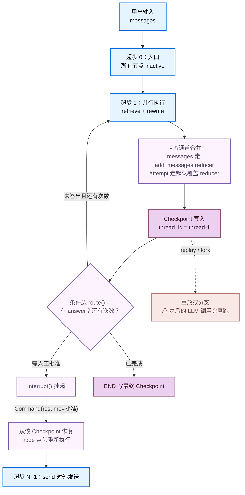
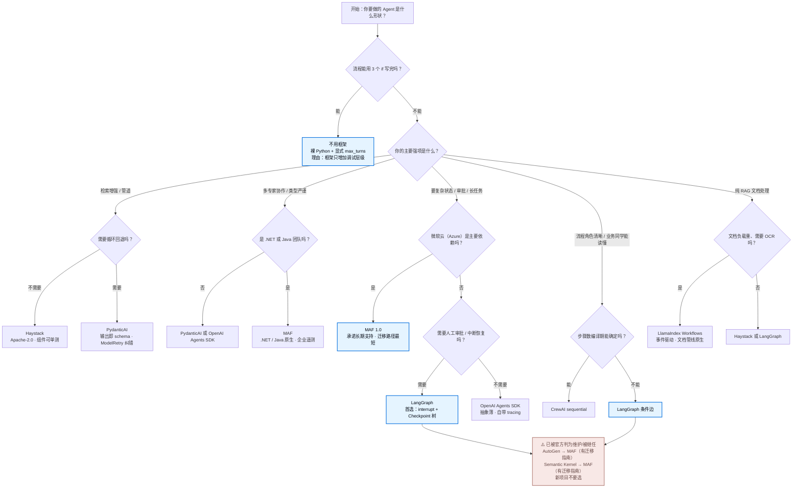

# [[Agent-框架]]

> [!tip] 学习目标
> 能对 8 个主流 Agent 框架按**编程范式、多 Agent 能力、可观测性、许可证**四轴做出有理由的选型，能独立写出一个带 Checkpoint、条件边和 human-in-the-loop 中断的 LangGraph 应用，并判断一个项目**根本不需要框架**。

> [!abstract] 本篇边界
> 本篇只讲**怎么用框架**。ReAct、Plan-and-Execute、路由、反思、工具设计这些**架构模式本身**在 [[Agent-架构模式]] 中展开；提示词技巧在 [[Prompt-Engineering]]；RAG 检索质量在 [[RAG-系统设计]]。本篇不重复它们，只在「框架把这个模式表达成什么代码」这个层面出现。

> [!danger] 2026 年最重要的一条结论（先看这个）
> ==**微软已把 AutoGen 与 Semantic Kernel 合并成 Microsoft Agent Framework（MAF），两个老框架都进入维护/被继任状态。**== 详见 1.2。核验日期 2026-09-25。任何 2024-2025 年写的「AutoGen vs LangGraph vs CrewAI 三选一」，今天都已**给出错误答案**。

---

## 🎯 难度分段学习路径

| 难度 | 核心关注 | 预估时长 |
|---|---|---|
| **入门** | 8 个框架的定位与范式差异；许可证差异；什么场景不该用框架 | 6h |
| **进阶** | LangGraph 图模型四要素（State/Node/Edge/Checkpoint）、reducer、流式、容错重试、human-in-the-loop | 14h |
| **高级** | 选型决策、跨框架能力对齐（记忆/可观测/评估/部署）、自建与框架的成本核算、lock-in 风险 | 10h |

**总学时**：30h ｜ **前置知识**：[[LLM-基础]]、[[Prompt-Engineering]]、[[API-调用与模型服务]]（需知道 tool calling 的请求/响应形状）、[[Python-工程基础]]

---

## 📖 第一章 入门（Beginner）

### 1.1 框架到底在解决什么问题

**结论先行：Agent 框架唯一不可替代的能力是「在多轮、有副作用、可能失败的执行中保存和推进显式状态」。** 其他一切（接模型、接工具、流式输出）用 200 行裸 Python 都能写，且往往更好调试。

| 框架提供的东西 | 本质 | 值不值 |
|---|---|---|
| **状态持久化 + 恢复**（Checkpoint、断点续跑、时间旅行） | 工程刚需，裸写要接数据库、要处理幂等 | ==值得==，最难自己写对的部分 |
| **可观测性接线**（自动埋点、trace 树） | 一行配置接上 LangSmith / Langfuse | ==值得==，自己埋点极其枯燥 |
| **多 Agent 编排原语**（路由、交接、群聊） | 状态机 + 消息协议的封装 | 视复杂度而定，2 个 Agent 不需要框架 |
| **模型与工具的抽象层** | 换模型时的适配层 | ==多数时候是负资产==，因为它挡在你和真实 API 之间 |

> [!tip] 判断你需不需要框架的三个问题
> 1. 你的流程**能在 3 个 `if` 里写完**吗？能 → 不用框架。2. 任务**跑超过 30 秒**或**需要人工审批**吗？不能 → 不用框架。3. **下一轮对话**必须记住上一轮的中间状态吗？不能 → 不用框架。
> 三个都「否」时，框架带来的只有抽象成本和版本风险。

#### 1.1.1 最小裸实现（对照组）

不用框架也能跑通「模型 + 工具 + 循环」，30 行足够：

```python
import json
from openai import OpenAI          # 见 [[API-调用与模型服务]]
from pydantic import BaseModel

class GetWeather(BaseModel): city: str          # 用 pydantic 自动生成 JSON Schema
TOOLS = [{"type": "function", "function": {
    "name": "get_weather", "parameters": GetWeather.model_json_schema()}}]
client = OpenAI()
def get_weather(city: str) -> str:  return f"{city}: 22C, 晴"   # 假实现

def run(task: str, max_turns: int = 5) -> str:
    messages = [{"role": "user", "content": task}]
    for _ in range(max_turns):                                 # 显式循环上限
        msg = client.chat.completions.create(
            model="gpt-5", messages=messages, tools=TOOLS).choices[0].message
        messages.append(msg.model_dump(exclude_none=True))
        if not msg.tool_calls:
            return msg.content
        for call in msg.tool_calls:                            # 串行、按顺序回填
            messages.append({"role": "tool", "tool_call_id": call.id,
                "content": get_weather(**json.loads(call.function.arguments))})
    raise RuntimeError("超过 max_turns 未收敛")
```

它的四个缺口 —— 状态只在内存（对应 Checkpointer + `thread_id`）、工具异常直接炸循环（节点级 RetryPolicy）、人工审批要自己写轮询（`interrupt()` + `Command(resume=...)`）、出错只有一坨 print（节点级 trace 树）—— 正是框架唯一值得引入的四件事。

> [!warning] 「工具返回给模型的顺序」是个隐蔽的坑
> 上面 `for call in msg.tool_calls` 是**串行且按顺序**追加的。并行调用时若乱序回填 `role: "tool"` 消息，OpenAI 一类接口会直接报错 —— ==「多个 tool 结果必须与 tool_calls 一一对应且顺序一致」是硬约束，不是风格问题==。

**填空题**

1. Agent 框架最难自己写对、也最值得引入的框架能力是 ______（状态持久化与恢复 / 模型抽象 / 提示词模板）。
2. 上面 `run()` 里 `max_turns` 的作用是 ______，对应框架里的哪个概念。
3. 多个工具调用结果回填给模型时，顺序必须与 ______ 一一对应。
4. 判断是否需要框架时，最该先问的是「流程能否在 ______ 个 `if` 里写完」。

**答案**：
1. 状态持久化与恢复
2. 限制循环轮数防止不收敛（对应 LangGraph 的递归上限 `GRAPH_RECURSION_LIMIT`）
3. 请求中的 `tool_calls` 列表
4. 3

---

### 1.2 2026 年的框架版图：微软合并了 AutoGen 与 Semantic Kernel

**本篇时效性最强、也最容易被旧资料坑到的部分。** 截至 2026-09-25 实测：

| 框架 | 仓库状态 | 官方声明（核验 2026-09-25） |
|---|---|---|
| **AutoGen** | ==维护模式== | README 首屏横幅 *Maintenance Mode*：「不再接收新功能与增强，之后由社区管理」，指引新用户改用 MAF |
| **Semantic Kernel** | ==已被继任== | README 首屏标 *IMPORTANT*：「Semantic Kernel 现在就是 Microsoft Agent Framework」，给出迁移指南 |
| **Microsoft Agent Framework** | 活跃，已 1.0 生产就绪 | 官方定位：AutoGen 与 SK 的**共同继任者**，*combines AutoGen's simple agent abstractions with Semantic Kernel's enterprise features — session-based state management, type safety, middleware, telemetry — and adds graph-based workflows* |
| **AG2**（`ag2ai/ag2`） | 活跃，Apache-2.0 | AutoGen 的社区分叉，自称「formerly AutoGen」，独立发展 |

> [!tip] 这对你意味着什么
> - **新项目不要选 AutoGen 或 Semantic Kernel。** 不是「不建议」，是官方已把它们判给继任者 —— 面试里说「我们用 AutoGen」，第一反应会是「你还在用维护模式的东西吗」。
> - **已在用的老项目**：AutoGen → MAF 有官方迁移指南；AG2 提供「不动」的选项（Apache-2.0，比 CC-BY-4.0 更适合闭源），代价是与官方生态分道扬镳。**AutoGen 的学术价值仍在**：`ConversableAgent` 是多 Agent 研究的公共参考实现 —— 但「读它的代码」和「生产里选它」是两件事。

> [!warning] 许可证的一个真实差异
> `microsoft/autogen` 的 SPDX 标识是 ==**CC-BY-4.0**==，而 LangGraph / CrewAI / OpenAI Agents SDK / LlamaIndex / PydanticAI 都是 MIT，Haystack 与 AG2 是 Apache-2.0。CC-BY 对「代码作为软件分发」不是 OSI 认证的宽松许可，做闭源 SaaS 前**必须走法务确认** —— 这一条在多数框架对比文章里被漏掉。

**填空题**

1. 截至 2026-09-25，`microsoft/autogen` 的官方状态是 ______，官方推荐的新用户起点是 ______。
2. Semantic Kernel 的 README 明确说它的继任者是 ______。
3. `microsoft/autogen` 的 SPDX 许可证标识是 ______，与 LangGraph 的 MIT 不同。
4. AutoGen 社区分叉的独立项目名叫 ______，许可证为 Apache-2.0。

**答案**：
1. 维护模式（maintenance mode），Microsoft Agent Framework
2. Microsoft Agent Framework（MAF）
3. CC-BY-4.0
4. AG2（`ag2ai/ag2`）

---

### 1.3 框架全景对比表（核心表）

> [!note] 核验说明
> **版本号**取自 PyPI JSON 接口的 `info.version`，**许可证**取自 GitHub API 的 `license.spdx_id`，**星标**为同刻 `stargazers_count`。全部 **2026-09-25** 实测。==星标只反映社区热度，不代表生产适用性==，见 3.1.2。

| 维度 | **LangGraph** | **CrewAI** | **AutoGen**（维护模式） | **MAF**（微软新框架） | **OpenAI Agents SDK** | **LlamaIndex Workflows** | **Semantic Kernel**（已被继任） | **Haystack** | **PydanticAI** | **AG2** |
|---|---|---|---|---|---|---|---|---|---|---|
| **编程范式** | ==显式状态图==（StateGraph，Pregel 超步模型） | 角色扮演 + 声明式 Crew；另有 Flow 事件驱动 | 对话驱动（ConversableAgent 互相发消息） | Agent 抽象 + 图式 workflow 双轨 | 轻量 Agent + handoff 委派，隐式循环 | ==事件驱动==（async 函数收发 Event，无 DSL） | 企业 SDK + 插件/中间件 + Planner | ==Pipeline 组件串联==（显式连线） | 类型优先，单 Agent + 结构化输出为核心 | 对话驱动（AutoGen 社区分叉） |
| **多 Agent 支持** | 强（子图、Send、Command、handoff 都能写） | 强且是主卖点 | 强（RoundRobin / Selector / Swarm / MagenticOne / GraphFlow） | 强（继承 AutoGen 多 Agent + SK 编排） | 中强（handoffs 与 agents-as-tools 两种） | 中（靠事件路由自然涌现） | 强（群组编排） | 中（Agent 组件 + 条件路由） | 中（handoff 委派） | 强（同 AutoGen 路线） |
| **状态显式度** | ==最高==，每 key 的 reducer 可自定义 | 中（任务列表隐式携带上下文） | 中（消息历史即状态，可 `save_state`/`load_state`） | 高（会话状态 + workflow 状态） | 中（会话历史 + RunResult） | 中（事件上下文） | 高（会话 + 上下文变量） | 中高（显式 pipeline 连接） | 低（单次运行内） | 中 |
| **可观测性** | LangSmith（自家，深度集成）；也能接 Langfuse/OTel | CrewAI 自带 tracing（可关） | 自带日志 + Studio；可接 Langfuse/OTel | 中间件 + OpenTelemetry（企业取向） | ==OpenAI Tracing==（默认开，Dashboard 直接看） | 回调 + 可接 Langfuse | 企业遥测（OTel 取向） | 回调 + Langfuse | ==Logfire / Pydantic 生态== | 日志 + Studio |
| **HITL（人工介入）** | ==一等公民==：`interrupt()` + `Command(resume=...)` | 支持但偏流程编排层 | 支持（`UserProxyAgent` 或终止条件） | 支持（长任务与人工介入被列为卖点） | 有 `RunResult` 暂停/恢复 | 需自己实现 | 支持 | 需自己实现 | 需自己实现 | 支持 |
| **断点续跑 / 时间旅行** | ==原生==（Checkpoint 树，replay 与 fork） | 无内建 | 靠 `save_state` / `load_state` | 强调长任务状态管理 | 会话持久化（非 Checkpoint 树） | 可插拔持久化后端 | 会话管理 | 无内建 | 无内建 | 靠 `save_state`/`load_state` |
| **学习成本** | 高（概念多但都必需） | 低（声明式，上手最快） | 中高（消息协议概念多） | 中高（继承 SK 历史包袱） | ==低==（约 100 行写完核心） | 中（事件流心智模型） | 高（企业概念密度大） | 中（组件概念多） | 中低（Pythonic，类型签名陡） | 中高 |
| **生态** | 最大（LangChain 生态：向量库、加载器、社区技能） | 中（偏独立，有 AMP 企业版） | 中（微软 + 学术界） | 高（Azure 全家桶 + 1.0 长期支持承诺） | 中（OpenAI 自家 + MCP 支持） | 高（RAG 侧最强：LlamaParse 等） | 高（Azure/.NET/Java 生态） | 中高（deepset 系，企业客户多） | 中高（Logfire、Pydantic 生态） | 中 |
| **上手难度（1-5，5 最难）** | 4 | 2 | 3 | 3 | ==1== | 3 | 4 | 3 | 2 | 3 |
| **生产适用性** | ==最高==，但抽象成本真实存在 | 中高（适合流程清晰的业务） | 低（==维护模式，不要新选==） | 高（1.0 长期支持，但生态尚新） | 高（模型与追踪强，抽象薄） | 高（RAG 场景） | 中（已被继任，新项目不建议） | 高（企业 RAG 成熟） | 中高（类型严谨，适合服务化） | 中（非官方，赌社区持续性） |
| **许可证（2026-09-25 实测）** | MIT | MIT | ==**CC-BY-4.0**== | MIT | MIT | MIT | MIT | Apache-2.0 | MIT | Apache-2.0 |
| **PyPI 最新版（2026-09-25）** | `langgraph` 1.2.12 | `crewai` 1.15.22 | `autogen-agentchat` 0.7.5 | `agent-framework` 1.19.0 | `openai-agents` 0.22.3 | `llama-index` 0.14.25 | `semantic-kernel` 1.44.1 | `haystack-ai` 3.2.0 | `pydantic-ai` 2.51.0 | `ag2` 1.1.0 |
| **GitHub 星标（同刻）** | 42,316 | 59,052 | 61,176 | 13,810 | 29,707 | 52,324 | 28,607 | 26,610 | 20,190 | 4,962 |

> [!warning] 表里最容易读错的三行
> 1. **星标最高的不该选。** AutoGen 61K 星但已维护模式；CrewAI 59K 星但解决的是「角色扮演式协作」这一较窄需求。==星标是历史积累，不是路线图。==
> 2. **AutoGen 的 CC-BY-4.0 是唯一一个非 OSI 宽松许可的。** 做闭源产品时这是硬门槛。
> 3. **「学习成本低」和「生产适用性高」是两条独立轴。** OpenAI Agents SDK 两者都高；CrewAI 学习成本最低但抽象较厚，复杂状态一多就难写。

**填空题**

1. 本篇对比表中，唯一一个 SPDX 许可证**不是** MIT/Apache-2.0 这类宽松许可的框架是 ______，其标识为 ______。
2. 官方 README 明确标注「已不再接收新功能」的是 ______ 和 ______。
3. 学习成本最低（上手难度 1-5 里得 1 分）的框架是 ______。
4. 断点续跑与时间旅行唯一提供**原生 Checkpoint 树**的框架是 ______。

**答案**：
1. AutoGen，CC-BY-4.0
2. AutoGen（维护模式），Semantic Kernel（已被继任）
3. OpenAI Agents SDK
4. LangGraph

---

### 1.4 本章综合练习

**填空题**

1. 判断是否需要框架时，最有价值的问题是「任务能否在 ___ 个 `if` 内写完」，答案是 ___。
2. 截至 2026-09-25，微软体系中整合 AutoGen 与 Semantic Kernel 的框架是 ___，PyPI 包名是 ___。
3. 框架提供的四类能力中，被公认「最难自己写对」的是 ___ 与 ___。
4. 工具调用结果的回填顺序必须与请求中的 ___ 列表一一对应。

**本章答案**：
1. 3
2. Microsoft Agent Framework，`agent-framework`
3. 状态持久化与恢复，可观测性接线
4. `tool_calls`

**综合项目**：写一份你目标公司的框架现状调研备忘。

**输入**：任选 2 家你投的 AI 公司 + 1 个你做过或想做的小项目。

**步骤**：1. 查这 2 家公司近 6 个月的公开技术分享/工程博客，摘出它们用的 Agent 框架与版本；找不到就明写「未公开」，**不许推测**。2. 对你的小项目逐条回答 1.1 的三个判断问题，给出「用 / 不用框架」的明确结论。3. 若是「用」，按 1.3 的表给出**两个**候选并写清取舍维度；若是「不用」，写清你打算自己实现哪几件事（循环上限、工具异常、状态存储）及预计行数。4. 核对这 2 家公司的选择在 2026 年是否仍成立 —— ==若它们用 AutoGen 或 SK，注明官方已标为维护/被继任==。

**产出物与验收标准**：1 页备忘，含 2 家公司的框架事实（含来源 URL）、你项目的明确结论与理由、2 个候选的取舍维度表。==能在面试追问下不自相矛盾。==

> [!tip] 常见陷阱
> 1. **把星标数当选型依据。** AutoGen 星标最高但已维护模式。 2. **看 2024/2025 年的对比文章。** 那时的「三选一」结论已失效。
> 3. **忽略许可证。** AutoGen 的 CC-BY-4.0 对闭源分发是硬门槛。 4. **为了用框架而用框架。** 3 个 `if` 能写完的流程套上状态图，只增加调试层级和依赖升级负担。

> [!note] 本章权威资料（全部 2026-09-25 实测 200）
> - [LangGraph 总览](https://docs.langchain.com/oss/python/langgraph/overview) · [图模型 API](https://docs.langchain.com/oss/python/langgraph/graph-api) · [仓库](https://github.com/langchain-ai/langgraph) ｜ [CrewAI 文档](https://docs.crewai.com/) · [Crew](https://docs.crewai.com/en/concepts/crews) · [流程](https://docs.crewai.com/en/concepts/processes) · [仓库](https://github.com/crewAIInc/crewAI)
> - [AutoGen AgentChat 教程](https://microsoft.github.io/autogen/stable/user-guide/agentchat-user-guide/index.html) · [AutoGen 仓库（维护模式横幅）](https://github.com/microsoft/autogen) ｜ [MAF 总览](https://learn.microsoft.com/en-us/agent-framework/overview/) · [MAF 仓库](https://github.com/microsoft/agent-framework) · [AutoGen → MAF 迁移](https://learn.microsoft.com/en-us/agent-framework/migration-guide/from-autogen/) · [SK → MAF 迁移](https://learn.microsoft.com/en-us/agent-framework/migration-guide/from-semantic-kernel/)
> - [OpenAI Agents SDK 文档](https://openai.github.io/openai-agents-python/) · [快速开始](https://openai.github.io/openai-agents-python/quickstart/) · [仓库](https://github.com/openai/openai-agents-python) ｜ [LlamaIndex Workflows](https://developers.llamaindex.ai/python/llamaagents/workflows/) · [仓库](https://github.com/run-llama/llama_index) ｜ [Semantic Kernel 总览](https://learn.microsoft.com/en-us/semantic-kernel/overview/) · [仓库](https://github.com/microsoft/semantic-kernel)
> - [Haystack 文档](https://docs.haystack.deepset.ai/docs/intro) · [仓库](https://github.com/deepset-ai/haystack) ｜ [PydanticAI 文档](https://ai.pydantic.dev/) · [Agent 概念](https://ai.pydantic.dev/agents/) · [仓库](https://github.com/pydantic/pydantic-ai) ｜ [AG2 官网](https://ag2.ai) · [仓库](https://github.com/ag2ai/ag2)
>
> **可复现核验方式**：版本 `curl -s https://pypi.org/pypi/<包名>/json | grep -o '"version":"[^"]*"' | head -1`；许可证 `curl -s https://api.github.com/repos/<owner>/<repo>` 看 `license.spdx_id`。

---

## 📖 第二章 进阶（Intermediate）

> [!warning] 与上一章的衔接
> 本章假设你已接受 1.1 的结论：**框架的核心价值是显式状态**。跳过 1.1 直接看本章，会觉得 LangGraph 概念密度莫名其妙 —— 因为你在拿它当「代码生成器」，而不是当「状态机运行时」。

### 2.1 LangGraph 图模型：四个概念撑起一切

LangGraph 官方对图模型的定义只有三个组件，加上持久化共四个（核验 2026-09-25）：

> **State**：共享数据结构，表示应用当前的快照。**Nodes**：接收当前 state、做计算或副作用、返回更新后 state 的函数。**Edges**：决定下一个执行哪个 Node 的函数，可为条件分支或固定转移。
> 官方强调：*Nodes and Edges are nothing more than functions — they can contain an LLM or just good ol' code.*

| 概念 | 是什么 | 你要做的决策 |
|---|---|---|
| **State** | 应用状态的结构定义（通常 `TypedDict`） | ==哪些字段需要累积而非覆盖== → 决定 reducer |
| **Node** | 吃 state、吐 state 局部更新的函数 | 粒度：一步一个节点，还是一整块逻辑一个节点 |
| **Edge** | 路由函数 | 静态 `add_edge` / 动态 `add_conditional_edges` |
| **Checkpoint** | 某个超步之后的状态快照 | 存哪、保留多久、要不要时间旅行 |

#### 2.1.1 State 与 Reducer

**每个 State 字段有独立的 reducer。未显式指定时，默认 reducer 丢弃旧值直接覆盖。** 官方定义：reducer 是二元函数，**左参数是 state 里已有的当前值，右参数是节点返回的更新值**。

```python
class State(TypedDict):
    foo: int                          # 无 reducer → 默认覆盖
    bar: Annotated[list[str], add]    # 有 reducer → 累加（add 来自 operator）
```

| reducer 类型 | 行为 | 典型用途 |
|---|---|---|
| 默认（无标注） | `new = right`，丢弃 left | 单值字段、最后一次结果 |
| 累加型 | 合并 left 与 right | 消息列表、错误列表、工具结果 |
| 自定义 | 你写的任意 `f(left, right)` | 去重、限长、合并字典 |
| `Overwrite` | ==绕过 reducer 强制覆盖== | 清空字段、重置计数 |

> [!danger] 「返回空值 = 清空字段」是错的
> 官方专门用一节讲：==用了合并型 reducer 后，返回 `[]` 不会清空字段，只是把空列表合并进去，旧值还在==。错误缓冲区、重试计数器这类「每轮重试前必须清零」的字段尤其容易踩：
>
> ```python
> class State(TypedDict):
>     errors: Annotated[list[str], add]
>
> def clear_errors(state: State):
>     return {"errors": Overwrite([])}     # Overwrite 从 langgraph.types 导入
> ```

#### 2.1.2 节点、边、编译

```python
class State(TypedDict):            # TypedDict、StateGraph/START/END 均从 langgraph.graph 导入
    topic: str
    joke: str

def generate_joke(state: State) -> dict:
    return {"joke": f"为什么{state['topic']}要去上学？因为它想拿冰激凌学位。"}

def polish(state: State) -> dict:
    return {"joke": state["joke"].rstrip("。") + "！"}   # 只返回要改的字段

builder = StateGraph(State)
builder.add_node("generate_joke", generate_joke)
builder.add_node("polish", polish)
builder.add_edge(START, "generate_joke")
builder.add_edge("generate_joke", "polish")
builder.add_edge("polish", END)
graph = builder.compile()          # ==必须 compile 才能用==：结构校验 + 挂运行期参数
print(graph.invoke({"topic": "冰淇淋"}))
```

| 边类型 | 写法 | 用途 |
|---|---|---|
| 普通边 | `graph.add_edge("node_a", "node_b")` | 固定转移 |
| 条件边 | `graph.add_conditional_edges("node_a", routing_function)` | 由函数返回值决定去向；第三参数可传 `{True: "node_b", False: "node_c"}` 把返回值映射到节点名 |
| 入口点 / 条件入口 | `add_edge(START, "node_a")` / `add_conditional_edges(START, fn, {...})` | 从虚拟 `START` 出发，首节点也可按逻辑选 |

> [!warning] 官方警告：同一个节点不要混用两种路由机制
> 原文：*choose one routing mechanism … Do not mix normal edges and dynamic routing from the same node, because both paths can execute.* 原因：==一个节点的多条出边会在**同一个超步内并行执行**==，混用会让实际路径难以推理。

#### 2.1.3 条件边 + 循环的完整例子

```python
MAX_ATTEMPTS = 3                                # 显式的循环上限

class State(TypedDict):            # Literal 从 typing 导入
    question: str
    answer: str
    attempts: int

def attempt_answer(state: State) -> dict:      # 真实实现里这里调模型 + 工具
    ok = len(state["question"]) > 5            # 伪判定
    return {"answer": state["question"] if ok else "", "attempts": state["attempts"] + 1}

def route(state: State) -> Literal["attempt_answer", "__end__"]:
    if not state["answer"] and state["attempts"] < MAX_ATTEMPTS:   # 未答出且还有次数 → 循环
        return "attempt_answer"
    return "__end__"                           # 答出或次数用尽 → 终止

builder = StateGraph(State)
builder.add_node("attempt_answer", attempt_answer)
builder.add_edge(START, "attempt_answer")
builder.add_conditional_edges("attempt_answer", route,
                             {"attempt_answer": "attempt_answer", "__end__": END})
print(builder.compile().invoke({"question": "为什么天空是蓝色的？", "answer": "", "attempts": 0}))
```

> [!tip] 关于「结束」的写法
> 官方推荐 `add_edge(START, ...)` / `add_edge(..., END)` 这套现代语法（旧的 `set_entry_point` / `set_finish_point` 仍兼容但不推荐）。条件边映射里的 `"__end__"` 就是 `END` 的字面量值。

**填空题**

1. LangGraph 中每个 State 字段默认的 reducer 行为是 ______，自定义累加要用 `Annotated[list[str], ______]`。
2. reducer 的两个位置参数，left 是 state 中的 ______ 值，right 是节点返回的 ______ 值。
3. 想在保留累加 reducer 的同时强制清空字段，返回值必须包成 `Overwrite(______)`。
4. 官方明确警告不要在同一个节点上混用普通边和条件边，因为同一节点的多条出边会在 ______ 内并行执行。

**答案**：
1. 覆盖（丢弃旧值），`add`
2. 当前已累积，更新
3. `[]`
4. 同一个超步（superstep）

---

### 2.2 为什么需要显式状态：与「无状态请求」思维的根本差异

**这是本篇最重要的一节。** 大多数人学框架失败在这里 —— 不是不会写 `add_node`，而是没意识到 Agent 应用**已经不是无状态的 HTTP 请求**了。

#### 2.2.1 两种心智模型的对照

| 维度 | 普通 Web 服务（无状态） | Agent 应用（显式状态） |
|---|---|---|
| 执行单位 | 一次请求-响应，立即返回 | 一串**超步**，跨越数十秒到数小时 |
| 状态在哪 | 数据库/缓存，请求内不持有 | ==状态就是系统的核心资产==，每步都要能被记录 |
| 失败语义 | 5xx，重试即可 | 已花掉的 token、已执行的工具**不可回滚** |
| 复用 / 调试 / 时间 | 天然可水平扩容；看这一次日志；「现在」 | 需要「从哪继续」（Checkpoint）；看**状态如何一步步演化**；可能几分钟前，可能跨进程重启 |

> [!tip] 一句话抓住差别
> ==在无状态服务里，进程重启只是「再收一个请求」；在 Agent 里，进程重启意味着「这一轮已花掉的 3 万 token 和 4 次工具调用全部作废，而且没人知道做到哪一步了」。== 显式状态就是为了让「重启后从哪继续」变成一个可回答的问题。
>
> **状态快照的序列就是 Agent 的执行轨迹。** 这是无状态请求思维里完全不存在的概念：服务返回结果但过程不可见，而 Agent 的**过程就是产品价值本身** —— 不留下轨迹就无法调试、回归，也无法向用户解释。

#### 2.2.2 LangGraph 的数据流（超步模型）

LangGraph 底层图算法受 Google Pregel 启发，用**消息传递**定义整个程序，程序以离散的**超步（superstep）**推进：



| 概念 | 语义 |
|---|---|
| 节点初始为 `inactive` | 图开始执行时所有节点都不活跃；收到新消息（官方称 channel）才变 `active` |
| 活跃节点运行并返回更新 | 节点返回值就是它的「消息」；无入消息的节点投 `halt` 票 |
| 终止条件 | ==所有节点都不活跃且无消息在途== |

这解释了两件常让人困惑的事：**并行是超步的默认语义**，不是要额外声明的（一条普通边的两个目标节点 → 同一超步并行）；==**循环不是特例，是图的正常形态** —— 没有边指向 `END`，图就会一直跑到递归上限。这也是为什么「限制轮数」在图模型里必须显式设计，而不是框架自动兜住。

#### 2.2.3 状态演进的可观测性

```python
for snapshot in graph.stream_events({"question": "为什么天空是蓝色的？"}, version="v3").values:
    print(snapshot)
# {'question': '...'}                                 入口
# {'question': '...', 'answer': '...', 'attempts': 1}  节点 1 之后
```

> [!warning] 私有通道不会被 redact
> 官方明确：输入/输出/私有 schema 约束的是**每个节点读什么**和 **`invoke` 返回什么**，==**不会把通道从 `stream` 里隐藏**==。`stream_mode="values"` 默认吐出**所有**状态通道（含私有的）；要只拿指定通道就传 `output_keys=[...]`。==如果你把 API key 或用户隐私字段放进 state，它会出现在流式输出里== —— 而流式输出常被直接转发给前端。

**填空题**

1. LangGraph 执行模型受 Google 的 ______ 系统启发，以离散的 ______ 推进。
2. 图执行终止的条件是「所有节点都不活跃」且 ______。
3. 节点在没有任何入边消息时会投 ______ 票把自己标为不活跃。
4. 私有状态通道在 `stream_mode="values"` 下会被输出吗？会的话该怎么限制？

**答案**：
1. Pregel，超步
2. 没有消息在途
3. `halt`
4. 会。传 `output_keys=[...]` 指定要输出的通道

---

### 2.3 流式输出、错误处理与重试

#### 2.3.1 流式

LangGraph 暴露 `stream()`（同步）与 `astream()`（异步）迭代器，用 `stream_mode` 控制收到什么：

| stream_mode | 你收到什么 | 用途 |
|---|---|---|
| `updates` / `values` | 每个节点这一步改了什么 / 每步之后的完整状态 | 只关心增量（打字机效果）/ 需要完整上下文判断 |
| `messages` | LLM token 级消息 | 逐字输出 |
| `custom` | 节点内用 writer 写的任意数据 | 自定义进度 |
| `checkpoints` / `tasks` / `debug` | Checkpoint 元信息、任务级与调试信息 | 持久化进度条、深度排查 |

```python
from langgraph.config import get_stream_writer

def long_node(state):
    get_stream_writer()({"status": "正在检索…"})     # 节点内推任意自定义进度
    return {"answer": "..."}

for chunk in graph.stream({"question": "..."}, stream_mode=["updates", "custom"], version="v2"):
    if chunk["type"] == "updates":
        for node, st in chunk["data"].items(): print(f"节点 {node} 更新: {st}")
    elif chunk["type"] == "custom":
        print(f"状态: {chunk['data']['status']}")
```

> [!note] 官方对流式的新旧建议（核验 2026-09-25）
> 官方在 Streaming 页面明确：**新应用推荐用 event streaming** —— v1.2 引入的类型化投影 API，给每个投影（messages / values / subgraphs / output）单独迭代器，省掉对 chunk 的分支判断。`stream_mode` 页面仍保留，供需要直接访问图运行时事件的场景。

#### 2.3.2 重试、超时、错误处理

LangGraph 1.2 起提供**三个可组合的机制**，官方明确了固定执行顺序：节点尝试抛出任何异常（包括超时产生的 `NodeTimeoutError`）→ **重试策略**决定是否重试 → 重试耗尽后才运行**错误处理函数** → 没有错误处理函数则异常向上冒泡。

> [!note] 版本要求（官方原文）：*Per-node timeouts and node-level error handlers require `langgraph>=1.2`.* `RetryPolicy` 的全部参数（2026-09-25 官方表格）：

| 参数 | 类型 | 默认值 | 含义 |
|---|---|---|---|
| `max_attempts` | `int` | `3` | 最大尝试次数，**含第一次** |
| `initial_interval` / `backoff_factor` / `max_interval` | `float` | `0.5` / `2.0` / `128.0` | 首次等待秒数 / 每次重试的乘数 / 两次重试间上限 |
| `jitter` | `bool` | `True` | 加随机抖动 |
| `retry_on` | 异常类型 / 序列 / 可调用对象 | `default_retry_on` | 哪些异常要重试 |

```python
from langgraph.types import RetryPolicy, default_retry_on

builder.add_node("call_api", call_api, retry_policy=RetryPolicy(max_attempts=3))

def custom_retry_on(exc: BaseException) -> bool:   # 业务错误不该重试
    return False if isinstance(exc, MyCustomError) else default_retry_on(exc)

builder.add_node("call_api2", call_api2, retry_policy=RetryPolicy(max_attempts=3, retry_on=custom_retry_on))
```

> [!tip] `default_retry_on` 的默认行为（最容易误解）
> 默认**任何异常都重试，除了**这些（及其子类）：`ValueError`、`TypeError`、`ArithmeticError`、`AssertionError`、`AttributeError`、`ImportError`、`LookupError`、`NameError`、`SyntaxError`、`RuntimeError`、`ReferenceError`、`StopIteration`、`StopAsyncIteration`、`OSError`。==换句话说，不重试代码逻辑错误（这些是 bug，重试只浪费钱），但会重试网络类异常；`requests` / `httpx` 这类 HTTP 库==**只对 5xx 状态码重试**，==`NodeTimeoutError` 默认可重试。==
> 注意 `OSError` 在不重试列表里，而 `httpx.ConnectError` 继承自它 —— 「连接失败」不一定被重试。==生产环境要显式写 `retry_on`，别信默认。==

用 `set_node_defaults` 可为所有节点一次性配置这三套机制，不必在每次 `add_node` 重复。

**填空题**

1. LangGraph 节点级超时与错误处理函数要求版本 ______ 及以上。
2. `RetryPolicy.max_attempts` 的计数是「含第一次」还是「额外重试次数」？默认 `initial_interval` 与 `backoff_factor` 各是多少？
3. `default_retry_on` 对 `requests` / `httpx` 的异常只在什么状态下重试？
4. LangGraph 三套容错机制的固定执行顺序是：重试策略 → ______ → 异常冒泡。

**答案**：
1. `langgraph>=1.2`
2. 含第一次；`0.5` 秒、`2.0`
3. 5xx 状态码
4. 错误处理函数（error handler）

---

### 2.4 持久化、多轮恢复与 human-in-the-loop

#### 2.4.1 Checkpointer 与 Store：两个不同的东西

官方把它们分得很清楚（核验 2026-09-25）：

| | **Checkpointer** | **Store** |
|---|---|---|
| 存什么 / 作用域 | 图状态的快照 / ==单个 thread== | 应用自定义键值数据 / 跨 thread |
| 记忆类型 | 短期、thread 内 | 长期、跨 thread |
| 用来做 | 会话连续、human-in-the-loop、时间旅行、容错 | 用户偏好、事实、共享知识 |
| 访问方式 | 在图 config 里传 `thread_id` | 在节点或应用代码里读写条目 |

```python
# from langgraph.checkpoint.memory import InMemorySaver（生产换数据库版）
# from langgraph.store.memory import InMemoryStore
graph = builder.compile(checkpointer=InMemorySaver(), store=InMemoryStore())

result = graph.invoke(
    {"messages": [{"role": "user", "content": "我叫鲍勃。"}]},
    {"configurable": {"thread_id": "thread-1"}},   # ==thread_id 就是你的持久化游标==
)
```

> [!warning] 三个容易踩的点
> 1. **用 `InMemorySaver` 上生产 = 没有持久化。** 进程一重启，所有 thread 归零。它只适合本地开发与测试。
> 2. **`thread_id` 太长会炸。** 官方排障条目：用 `PostgresSaver` 时 `thread_id` 存在有长度限制的列里，超长直接数据库报错。==控制在 255 字符内。==
> 3. ==**`thread_id` 复用 = 恢复同一 thread；换新值 = 开一条空状态的新 thread。** 这个语义直接决定你的会话 ID 生成策略。

#### 2.4.2 中断与恢复：`interrupt()`

三个必要条件（官方原文）：**checkpointer**（生产用持久化实现）、config 里的 **thread ID**、以及在要暂停处调用 `interrupt()`（载荷必须 JSON 可序列化）。

```python
from langgraph.types import interrupt

def approval_node(state: State):
    # 恢复时，Command(resume=...) 的值就成了 interrupt() 的返回值
    return {"approved": interrupt("是否批准这个操作？")}
```

| 事实 | 说明 |
|---|---|
| 暂停点 / 等待时长 | ==`interrupt()` 被调用的精确位置==（不在节点前后）；==无限期==，直到你恢复执行 |
| 恢复方式 | 用 `Command` 重新 invoke，值成为 `interrupt()` 的返回值 |
| 与静态断点对比 | `interrupt` 是**动态**的：可放代码任意处，可按业务逻辑条件触发 |
| 状态保存 | 由 checkpointer 写入，==即使处于错误状态也能恢复== |
| 流式获取载荷 | 用 event streaming 时值出现在 `stream.interrupts`，`stream.interrupted` 为 `True` |

> [!danger] `interrupt()` 的真实使用约定
> 恢复时**节点函数会从头重新执行**，只是 `interrupt()` 那一步直接返回你给的值。==这意味着 `interrupt()` 之前的所有副作用都会重跑一遍== —— 写数据库、发请求、扣款，**必须在 `interrupt()` 之后**。审批流里代价极高：「发通知」若写在前面，恢复时会重复发送。

#### 2.4.3 时间旅行

官方分两种，==都通过从某个先前 Checkpoint 恢复实现==：**Replay（重放）**从先前 Checkpoint 重试；**Fork（分叉）**从该 Checkpoint 分支、**改状态**后探索另一条路径。都用 `get_state_history(config)` 找到目标 Checkpoint，再 `invoke` 它的 config（分叉时传入修改后的状态）。

> [!warning] 官方警告（必须记住）
> *Replay re-executes nodes — it doesn't just read from cache. LLM calls, API requests, and interrupts fire again and may return different results.*
> ==重放会重新执行节点，不是读缓存。== Checkpoint 之前的节点不重跑（结果已存），之后的**全部重跑**。==「重放」不是幂等的，别把它当成「查看当时发生了什么」的工具，它会真的花钱。== 从最后一个 Checkpoint 重放（没有 `next` 节点）是空操作。

**填空题**

1. LangGraph 里 `thread_id` 的作用是 ______，复用它和换新值分别对应什么行为？
2. 恢复 `interrupt()` 之前，节点函数的行为是什么？副作用代码必须放在 `interrupt()` 的哪一侧？
3. Replay 模式下，Checkpoint 之后的 LLM 调用会不会真的再次执行？
4. `InMemorySaver` 能不能用于生产？为什么？

**答案**：
1. 告诉 checkpointer 从哪条状态恢复；复用 = 恢复同一 thread，换新 = 开一条空状态新 thread
2. 节点从头重新执行；必须放在 `interrupt()` **之后**
3. 会（官方明确：不是读缓存）
4. 不能。它是内存实现，进程重启即丢失，官方定位为本地开发/测试

---

### 2.5 CrewAI：角色、任务与流程

CrewAI 的心智模型极其直白：**你组建一支队伍，给每个人分配角色和任务，选一种流程，然后 kickoff。**

| 对象 | 是什么 | 关键属性 |
|---|---|---|
| **Agent** | 有角色、目标、背景故事的执行者 | `role`、`goal`、`backstory`、自己的 `llm`、自己的 `tools` |
| **Task** | 一件要完成的事 | `description`、`expected_output`、`agent`、`context` |
| **Crew** | 把 agents 与 tasks 绑在一起的队伍 | `agents`、`tasks`、`process`、`manager_llm`/`manager_agent`、`memory`、`max_rpm`、`cache` |

#### 2.5.1 两种流程

官方对 `Process` 的定义：它是**枚举**，限定了取值范围，仅 `sequential` 与 `hierarchical`。

| 流程 | 行为 | 代价 |
|---|---|---|
| **Sequential** | ==按任务列表顺序依次执行，前一个任务的输出作为后一个的上下文== | 可预测、易调试；无法动态分配 |
| **Hierarchical** | ==由一个 manager 规划、委派、验收；任务不预先指派，manager 根据能力分配== | 灵活；==必须提供 `manager_llm` 或 `manager_agent`，否则报错== |

```python
from crewai import Crew, Process

crew = Crew(agents=my_agents, tasks=my_tasks, process=Process.sequential)
crew = Crew(agents=my_agents, tasks=my_tasks, process=Process.hierarchical,
            manager_llm="gpt-5")          # 或 manager_agent=my_manager_agent
```

> [!tip] sequential 里的 context 参数
> 官方指出：要定制任务上下文，用 `Task` 类的 `context` 参数指定哪些输出应作为后续任务的上下文。==不是所有前序输出都会自动流下去== —— 常被误以为「自动全传」。

#### 2.5.2 记忆与委派

官方列出的 Crew 级记忆（`memory` 属性）是三类执行记忆：**short-term、long-term、entity memory** —— 对应「记什么粒度」：最近发生了什么 / 跨会话的结论 / 关于某实体的累积事实。

委派有两条路：==Sequential 隐式流转==（流程固定、任务按序，适合步骤明确可枚举的流程如写报告、跑流水线）与 ==Hierarchical manager 委派==（manager agent 运行时决定，适合步骤数不定、依赖运行时判断的任务）。

> [!warning] CrewAI 的抽象什么时候会碍事
> CrewAI 的抽象是**声明式配置**。当流程开始出现「如果 A 则跳到 C，且要把 B 的中间结果存起来等人工确认」这类分支，==配置就会开始难读、难测、难断点==。这是 1.3 表里「学习成本 2 分但生产适用性只给中高」的原因：它赢在上手快，输在复杂度上探的能力有限。另有 Flow（事件驱动）作为更底层方案。

**填空题**

1. CrewAI 的 `Process` 是哪种类型的类？它允许的取值有哪些？
2. 使用 `Process.hierarchical` 时必须额外提供什么？否则会怎样？
3. sequential 流程中，前一个任务的输出是否**自动**全部作为后一个任务的上下文？
4. Crew 级的三类执行记忆分别是什么？

**答案**：
1. 枚举（`Enum`）；`sequential` 与 `hierarchical`
2. 必须提供 `manager_llm` 或 `manager_agent`，否则报错
3. 不是。要用 `Task` 的 `context` 参数显式指定
4. 短期记忆、长期记忆、实体记忆

---

### 2.6 其他框架的定位

#### 2.6.1 OpenAI Agents SDK：抽象最薄的一档

**设计哲学：给一个 `Agent`、一个 `Runner`、一点委派，剩下的都是普通 Python。** 官方 quickstart 把多 Agent 模式明确二分（核验 2026-09-25）：==**Handoffs** = 专家 agent 接管本轮对话（*a specialist takes over the conversation*）；**Agents as tools** = 编排者始终在控制、把专家当工具调用（*an orchestrator stays in control*）。==

最小可运行示例（官方 quickstart，核验 2026-09-25）：

```python
import asyncio
from agents import Agent, Runner
from agents.decorators import tool

@tool
def history_fun_fact() -> str:
    """Return a short history fact."""            # docstring 即工具描述
    return "Sharks are older than trees."

history_tutor_agent = Agent(
    name="History Tutor", tools=[history_fun_fact],
    handoff_description="Specialist agent for historical questions",  # 路由时的额外上下文
    instructions="You answer history questions clearly and concisely.")
math_tutor_agent = Agent(
    name="Math Tutor", handoff_description="Specialist agent for math questions",
    instructions="You explain math step by step and include worked examples.")
triage_agent = Agent(
    name="Triage Agent", instructions="Route each homework question to the right specialist.",
    handoffs=[history_tutor_agent, math_tutor_agent])

async def main():
    r = await Runner.run(triage_agent, "Who was the first US president?")
    print(r.final_output, f"| Answered by: {r.last_agent.name}")   # ==谁最终答的==
```

> [!danger] API 已变更，用旧写法会直接报错
> ==当前官方 quickstart 的工具装饰器是 `from agents.decorators import tool` + `@tool`==，不是早期教程的 `function_tool`。写代码前**打开官方 quickstart 核对一次** —— 这个 SDK 迭代很快（核验时已到 `openai-agents` 0.22.3）。

**多轮历史三选项**（官方对照）：手动控制且与厂商无关 → `result.to_input_list()`；SDK 帮你加载保存 → `session=...`；OpenAI 服务端托管续写 → `previous_response_id` / `conversation_id`。**Guardrails** 分 agent 级（`@input_guardrail` / `@output_guardrail`，触发时 `Runner.run` 抛 `OutputGuardrailTripwireTriggered`）与 tool 级（`@tool_input_guardrail` / `@tool_output_guardrail`，可 `reject_content` 拒绝或脱敏）：

```python
class MathOutput(BaseModel):               # 用 Pydantic 定义判定依据
    reasoning: str
    is_math: bool

guardrail_agent = Agent(name="Guardrail check", output_type=MathOutput,
                        instructions="Check if the output includes any math.")

# from agents.decorators import output_guardrail
@output_guardrail
async def math_guardrail(ctx, agent, output) -> GuardrailFunctionOutput:
    r = await Runner.run(guardrail_agent, output, context=ctx.context)   # 用另一个 agent 判定
    return GuardrailFunctionOutput(output_info=r.final_output, tripwire_triggered=r.final_output.is_math)
```

> [!tip] Tool 级 guardrail、Sessions 与 Tracing
> 官方 tool guardrail 示例做的正是**密钥泄露防护**：检查工具入参/出参里有没有 `sk-`，有就拒绝或脱敏 —— ==这是把「敏感数据不进不出工具边界」写进代码，而不是靠提示词请求模型别乱说==，与 [[Prompt-Engineering]] 的「致命三要素」结论一致：**要保护的东西必须放在模型之外**。
> **Sessions** 提供 `Session` 协议（`get_items` / `add_items` / `pop_item` / `clear_session`），可实现自己的后端 —— ==SDK 不强绑某一种存储==。**Tracing** 让你直接去 **OpenAI Dashboard 的 Trace viewer** 看 trace，==开箱即用但意味着你的执行轨迹默认流向 OpenAI==。

#### 2.6.2 LlamaIndex Workflows：事件驱动，无 DSL

官方定位（读 `run-llama/llama-agents` 仓库 README，核验 2026-09-25）：

> LlamaAgents is built on **Agent Workflows**, an event-driven orchestration library where steps are async Python functions that emit and consume events. Branch, loop, parallelize, persist state, recover from failures, all in plain Python with no DSL.

```python
from workflows import Workflow, step
from workflows.events import StartEvent, StopEvent

class HelloWorkflow(Workflow):
    @step
    async def greet(self, ev: StartEvent) -> StopEvent:
        return StopEvent(result=f"Hello, {ev.name}")
```

| 维度 | LlamaIndex Workflows | LangGraph |
|---|---|---|
| 编程单位 / 路由 | 消费/产出**事件**的 async 函数；由下一步订阅的事件类型决定 | 读写 **State** 的函数；由边/路由函数决定 |
| DSL / 声明方式 | ==没有==（官方强调 *no DSL*）；类型注解即契约 | 图结构本身就是声明；显式 `add_node`/`add_edge` |
| 状态 | 事件上下文 + 显式 store（可插拔） | 显式 State schema + reducer |

> [!tip] 什么时候事件驱动更顺
> ==当「下一步做什么」取决于**数据的类型**而不是预先画好的拓扑时，事件驱动明显更自然== —— 比如「检索返回 0 条该走改写查询，>0 条走生成」。用图模型表达要画条件边 + 多个入口，事件驱动就是订阅不同事件。反过来，==若希望「流程图」本身可读、可评审、可交给非工程师，LangGraph 的显式图更合适==。

#### 2.6.3 Haystack：Pipeline 组件

自我定位（仓库描述，核验 2026-09-25）：*modular pipelines and agent workflows with explicit control over retrieval, routing, memory, and generation*。范式是 ==有向 pipeline：组件 + 显式连线==；强项是 RAG（deepset 出身，企业客户多），组件可单独测试与替换；许可证 ==Apache-2.0==（本表里少数非 MIT 的宽松许可），版本 `haystack-ai` 3.2.0。

> [!tip] 一句话区分 Haystack 与 LangGraph
> ==两者都是「显式」，但 Haystack 的显式是「数据流经哪些组件」（管道思维），LangGraph 的显式是「状态如何被更新、谁决定下一步」（状态机思维）。== 纯检索增强用 Haystack 更省事；需要循环、动态回退、多 Agent 协商，LangGraph 表达力更强。

#### 2.6.4 Semantic Kernel 与 MAF：企业定位的收敛

| 框架 | 2026-09-25 实测状态 | 应对建议 |
|---|---|---|
| Semantic Kernel / AutoGen | ==分别标 IMPORTANT（就是 MAF）/ 维护模式==，都有迁移指南 | **新项目不选**；已用则按指南走，社区分叉需求看 AG2 |
| **MAF** | ==活跃，1.0 生产就绪，承诺长期支持== | 微软技术栈（Azure / .NET / Java）企业项目首选 |

MAF 官方给出的判据（核验 2026-09-25，翻译）：

| 用 agent 当… | 用 workflow 当… |
|---|---|
| 任务开放式或对话式 | 流程步骤明确 |
| 需要自主的工具使用与规划 | 需要显式控制执行顺序 |
| 一次 LLM 调用（可带工具）就够 | 多个 agent 或函数需要协调 |

> [!tip] MAF 官方最后一句最值得抄进你的设计文档
> *If you can write a function to handle the task, do that instead of using an AI agent.*
> ==能用函数解决的，就别用 Agent。== 这与本篇 1.1 的判断是同一条原则 —— 而且是微软官方说的。

> [!warning] 选 MAF 前要想清楚的两件事
> 1. ==**它很新**。1.0 承诺长期支持，但生态、教程、第三方集成数量远少于 LangGraph；`agent-framework` 已是 1.19.0（核验 2026-09-25），迭代很快 —— ==快意味着 API 还可能动。==
> 2. ==**它的重心是 Azure**。示例代码用的就是 Azure AI Foundry 客户端与 `AzureCliCredential`。非 Azure 环境能用但少拿一整套托管能力；纯 Python 团队、无微软云依赖时 LangGraph 的生态优势更实在。

#### 2.6.5 PydanticAI：类型优先

官方示例（`ai.pydantic.dev/agents/`，2026-09-25 核验）：

```python
from pydantic import BaseModel
from pydantic_ai import Agent, RunContext, ModelRetry

class ChatResult(BaseModel):
    user_id: int
    message: str

agent = Agent('openai:gpt-5.2',
              deps_type=DatabaseConn,      # 依赖注入：数据库连接作为类型化依赖
              output_type=ChatResult)      # ==输出即 schema==

@agent.tool(retries=2)
def get_user_by_name(ctx: RunContext[DatabaseConn], name: str) -> int:
    """Get a user's ID from their full name."""
    user_id = ctx.deps.users.get(name=name)
    if user_id is None:
        # ==把错误信息回给模型让它自己纠正，而不是直接失败==
        raise ModelRetry(f'No user found with name {name!r}, use their full name')
    return user_id

print(agent.run_sync('Send a message to John Doe asking for coffee',
                     deps=DatabaseConn()).output)
```

三个值得学的设计：`output_type=ChatResult`（==输出结构由 Pydantic 模型定义==，不靠提示词祈祷模型听话）、`deps_type` + `RunContext[Deps]`（工具能拿到类型化外部依赖，**不靠全局变量或闭包偷传**）、`raise ModelRetry(...)`（==把可纠正的错误信息回给模型让它重试==，而不是直接抛异常中断）。

> [!tip] `ModelRetry` 是被低估的模式
> 与 LangGraph 的节点级重试相比是**不同层次**：重试策略是「同样的输入再试一次」（可能还是失败），`ModelRetry` 是「**告诉模型它错在哪，让它换个做法**」。工具找不到用户时后者能救回这一轮，前者只会烧三次 token 然后失败。==能用 `ModelRetry` 表达的，就别用重试策略。==

`logfire.instrument_pydantic_ai()` 一行接入可观测性（官方示例），这是 1.3 表里「PydanticAI 可观测性打分最高」的原因。

#### 2.6.6 AutoGen（维护模式）的编排方式

虽不推荐新选，但它是**多 Agent 对话编排的研究参考实现**，概念值得知道（核验 2026-09-25）：`RoundRobinGroupChat`（固定顺序轮流）/ `SelectorGroupChat`（模型决定下一个发言者）/ `Swarm`（handoff 网状转移）/ `MagenticOne`（编排者+计划+执行）/ `GraphFlow`（显式图式工作流，最接近 LangGraph）。两个能力值得记住：**`save_state` / `load_state`**（团队状态存盘、从上次停止处恢复并保留上下文）、**`run_stream`**（流式跑团队）。

**填空题**

1. OpenAI Agents SDK 中，`handoff` 模式与 `agents-as-tools` 模式的区别在于谁掌握最终答案？
2. OpenAI Agents SDK 当前官方 quickstart 里的工具装饰器从哪个模块导入、叫什么名字？
3. `ModelRetry`（PydanticAI）与重试策略（LangGraph）在**语义层次**上的根本区别是什么？
4. LlamaIndex Workflows 官方强调的三个特性是什么？

**答案**：
1. Handoffs：专家 agent 接管本轮对话；agents-as-tools：编排者始终在控制，把专家当工具调用
2. `from agents.decorators import tool`，装饰器名 `@tool`
3. 重试策略是「同样的输入再试一次」；`ModelRetry` 是「把错误信息回给模型，让它换个做法」
4. 事件驱动；步骤是收发事件的 async Python 函数；无需 DSL（*no DSL*）

---

### 2.7 本章综合练习

**填空题**

1. LangGraph 底层图算法受 Google 的 ______ 系统启发，程序以 ______ 为单位推进。
2. 用了合并型 reducer 后返回空列表，字段会被清空吗？正确做法是什么？
3. 恢复 `interrupt()` 时，节点函数中的副作用代码必须放在 `interrupt()` 的哪一侧，为什么？
4. `Process.hierarchical` 缺少 `manager_llm` 或 `manager_agent` 会发生什么？

**本章答案**：
1. Pregel，超步
2. 不会（空值被合并进去，旧值保留）；用 `Overwrite([])`
3. **之后**。恢复时节点函数从头重跑，放在前面的副作用会重复执行
4. 报错（官方文档明确 hierarchical 流程「必须」提供 `manager_llm` 或 `manager_agent`）

**综合项目**：用 LangGraph 写一个「带人工审批的研究助手」。

**输入**：一个需要检索资料 → 生成草稿 → **人工审批** → 才允许对外发送的任务。

**步骤**：1. **画图**：`State` 至少 4 个字段（问题、检索结果、草稿、是否批准），明确**哪些字段需要累加**（检索结果是列表 → 需要 reducer）。2. **写节点**：`retrieve`、`draft`、`approve`（调 `interrupt()` 要人工批准）、`send`。3. **接 Checkpoint**：用**数据库版** checkpointer（不是 `InMemorySaver`），生成 `thread_id`，跑两轮对话验证第二轮能恢复第一轮的上下文。4. **埋容错**：`retrieve` 挂 `RetryPolicy` 并写**自定义 `retry_on`** —— 「检索不到结果」不可重试（重试无用），网络超时可重试。==必须显式写，不能依赖默认。== 5. **验证中断正确性**：==在 `send` 节点里故意在 `interrupt()` 之前执行一个副作用（往文件写日志），恢复会话后确认它跑了两次 —— 并在注释里写清为什么。== 6. **接流式**：`stream(stream_mode=["updates", "custom"])` 输出每步进度。

**产出物与验收标准**：可运行代码、状态字段表（标注每个字段的 reducer）、图的可视化（LangGraph 可出 Mermaid）、以及「我踩到的 3 个坑」清单。==验收问句：如果审批人三天后才点批准，这个系统会发生什么？为什么不会重复发通知？==

> [!tip] 常见陷阱
> 1. **用 `InMemorySaver` 上生产。** 重启即丢，且你会误以为「持久化配好了」。
> 2. **把副作用写在 `interrupt()` 之前。** 恢复时节点从头重跑，副作用重复执行 —— 审批流里表现为重复发通知/重复扣款。
> 3. **把 Replay 当「查看历史」用。** ==重放会真的重新调 LLM 和 API，不是读缓存==，会花钱且结果可能不同。
> 4. **信 `default_retry_on` 的默认值。** 它对 `OSError` 系（含很多连接错误）默认不重试，5xx 才重试。
> 5. **混用普通边和条件边做同一节点的路由。** 官方明确警告：多出边会同超步并行执行，行为难以推理。
> 6. **把敏感字段放进 state 就以为安全了。** 私有通道在流式输出里不会被隐藏，会发到前端。

> [!note] 本章权威资料（全部 2026-09-25 实测 200）
> **LangGraph** — [总览](https://docs.langchain.com/oss/python/langgraph/overview) · [图模型 API](https://docs.langchain.com/oss/python/langgraph/graph-api) · [使用图 API](https://docs.langchain.com/oss/python/langgraph/use-graph-api) · [持久化](https://docs.langchain.com/oss/python/langgraph/persistence) · [中断与恢复](https://docs.langchain.com/oss/python/langgraph/interrupts) · [时间旅行](https://docs.langchain.com/oss/python/langgraph/use-time-travel) · [流式](https://docs.langchain.com/oss/python/langgraph/streaming) · [容错（重试/超时/错误处理）](https://docs.langchain.com/oss/python/langgraph/fault-tolerance) · [LangSmith 可观测性](https://docs.langchain.com/oss/python/langgraph/observability) · [图 API 与 Functional API 如何选](https://docs.langchain.com/oss/python/langgraph/choosing-apis) · [仓库](https://github.com/langchain-ai/langgraph)
>
> **其他框架** — CrewAI [流程](https://docs.crewai.com/en/concepts/processes) · [Crew](https://docs.crewai.com/en/concepts/crews) · [Agent](https://docs.crewai.com/en/concepts/agents) · [Task](https://docs.crewai.com/en/concepts/tasks) · [记忆](https://docs.crewai.com/en/concepts/memory) · [Flows](https://docs.crewai.com/en/concepts/flows) ｜ OpenAI Agents SDK [快速开始](https://openai.github.io/openai-agents-python/quickstart/) · [多 Agent 编排](https://openai.github.io/openai-agents-python/multi_agent/) · [工具](https://openai.github.io/openai-agents-python/tools/) · [Guardrails](https://openai.github.io/openai-agents-python/guardrails/) · [Sessions](https://openai.github.io/openai-agents-python/sessions/) · [Tracing](https://openai.github.io/openai-agents-python/tracing/) · [人在回路](https://openai.github.io/openai-agents-python/human_in_the_loop/) · [模型](https://openai.github.io/openai-agents-python/models/) · [MCP](https://openai.github.io/openai-agents-python/mcp/)
> - AutoGen [Teams](https://microsoft.github.io/autogen/stable/user-guide/agentchat-user-guide/tutorial/teams.html) · [Selector Group Chat](https://microsoft.github.io/autogen/stable/user-guide/agentchat-user-guide/selector-group-chat.html) · [Swarm](https://microsoft.github.io/autogen/stable/user-guide/agentchat-user-guide/swarm.html) · [GraphFlow](https://microsoft.github.io/autogen/stable/user-guide/agentchat-user-guide/graph-flow.html) ｜ [LlamaIndex Workflows](https://developers.llamaindex.ai/python/llamaagents/workflows/) · [LlamaAgents 仓库](https://github.com/run-llama/llama-agents)
> - Haystack [文档](https://docs.haystack.deepset.ai/docs/intro) · [Pipelines](https://docs.haystack.deepset.ai/docs/pipelines) · [Agents](https://docs.haystack.deepset.ai/docs/agents) ｜ PydanticAI [Agent 概念](https://ai.pydantic.dev/agents/) · [模型](https://ai.pydantic.dev/models/) · [多 Agent](https://ai.pydantic.dev/multi-agent-applications/) ｜ [MAF 总览](https://learn.microsoft.com/en-us/agent-framework/overview/) · [MAF 仓库](https://github.com/microsoft/agent-framework)
>
> **多 Agent 方法论论文（标题经 citation_title meta 核验）**
> - [AutoGen: Enabling Next-Gen LLM Applications via Multi-Agent Conversation](https://arxiv.org/abs/2308.08155) —— 「多 Agent 对话作为编程范式」的原始论文
> - [MetaGPT: Meta Programming for A Multi-Agent Collaborative Framework](https://arxiv.org/abs/2308.00352) —— 角色化 SOP 式协作 ｜ [Large Language Model based Multi-Agents: A Survey of Progress and Challenges](https://arxiv.org/abs/2402.01680) —— 多 Agent 综述，用来讲「什么时候多 Agent 有用」

---

## 📖 第三章 高级（Advanced）

> [!note] 深度标准
> 本章不引入新 API，只回答三个工程决策问题：**选哪个**、**要不要绑死**、**自己造轮子划不划算**。

### 3.1 选型决策树

> [!tip] 使用方式
> 从「你的业务是什么形状」开始，沿箭头往下走，==终点就是唯一推荐，不给「也可以考虑」的并列答案==。若两个分支都命中，说明你的需求描述不够具体 —— 回去把「是否需要复杂状态」和「有没有人工审批」答准。



> [!tip] 决策树背后的三条硬规则
> 1. ==**能用函数解决就别用 Agent**== —— 微软官方 MAF 文档原话（*If you can write a function to handle the task, do that instead of using an AI agent*），本篇把它放在决策树最前面。
> 2. ==**需要「中断—恢复」就选 LangGraph**，因为只有它把 Checkpoint 做成一等公民。其他框架的会话持久化 ≠ 能在任意节点挂起并从该点精确恢复。
> 3. ==**微软技术栈的新项目选 MAF，不选 AutoGen/SK**。这不是「哪个更好」，是官方路线已收敛，选老框架等于主动埋迁移债。

#### 3.1.1 明确的推荐与理由（不平铺直叙）

| 场景 | 推荐 | 理由（不是「因为它流行」） |
|---|---|---|
| **求职作品集默认选择** | ==**LangGraph**== | 面试官问「你怎么处理失败和恢复」，你能答出 Checkpoint / `RetryPolicy` / `interrupt()` / replay-fork 四个概念且都有代码。==这是唯一能把「工程能力」讲清楚的框架==；别的框架你只能说「它有 memory」。 |
| **只想 2 天出一个能跑的 demo** | OpenAI Agents SDK | 约 100 行覆盖工具 + handoff + tracing。「学习成本最低」不是营销，是 quickstart 的长度。 |
| **业务方要能读懂并自己改流程** | CrewAI | 声明式配置是它唯一不可替代的价值；角色/任务/流程三层业务同学能看懂。代价是复杂逻辑上探能力弱。 |
| **微软云 / .NET / Java 企业项目** | MAF 1.0 | 唯一同时满足「新框架 + 长期支持 + 跨语言」的选择。选 SK 或 AutoGen 都要付迁移债。 |
| **检索增强为主，管道清晰** | Haystack | Apache-2.0 + 组件可单测 + deepset 的企业级 RAG 血统。纯 RAG 不需要状态图。 |
| **输出正确性要求极高**（金融/医疗辅助） | PydanticAI | `output_type` + `ModelRetry` + 全链路类型化。==它的价值在「类型」不在「编排」==。 |
| **已经在用 AutoGen** | MAF（官方迁移指南）或 AG2（想留在 Apache-2.0） | 别自己写迁移；官方有从 AutoGen 和从 SK 的两份迁移指南。 |

#### 3.1.2 「框架宣传」vs「实际使用体感」

| 框架 | 官方宣传 | 实际体感（方向性判断，需你自行验证） |
|---|---|---|
| LangGraph | 「Build resilient agents」 | ==学习曲线陡是真的，但陡在概念而非 API==。reducer 语义、并行超步、interrupt 重跑这三条是真实门槛；过了之后图模型确实好调试。 |
| CrewAI | 「autonomous AI agents」 | 「自主」的代价是**不确定性**：sequential 之外，行为随模型漂移，回归测试难写。==要上生产就锁 sequential。== |
| OpenAI Agents SDK | 「lightweight, powerful」 | 「lightweight」属实且是最大优点；==「powerful」的边界是：复杂状态编排要你自己写==。 |
| MAF | 「enterprise-ready，1.0，长期支持」 | 承诺是真实的，但==生态与教程密度远不如 LangGraph==。非 Azure 场景收益打折。 |
| AutoGen | —— | ==已维护。任何「还在推荐 AutoGen」的资料都要看发布日期==。 |
| PydanticAI | 「How Python does AI」 | 类型体验确实好；==但它不是编排框架，复杂多 Agent 场景要自己搭==。 |

> [!warning] 关于「实际体感」的诚实声明
> 上表的体感部分是**方向性判断，来自框架定位、API 设计与文档表述的推论，以及社区讨论的普遍倾向**，==不是本会话中实测出来的结论==。我实测的是**许可证、版本、维护状态、API 签名、文档承诺**这些可验证的事实。你在自己的项目上跑一遍，才能把体感变成你自己的证据。

### 3.2 框架无关的通用能力

**本节是「可迁移内核」：==无论你最后选哪个框架，下面这四件事你都要自己会做==。框架只是给了你不同的默认值。

#### 3.2.1 怎么接 LLM

| 层 | 建议 | 说明 |
|---|---|---|
| **原始 HTTP 层** | 至少手写一次 | 见 [[API-调用与模型服务]]。框架会把这层藏起来，你必须知道底下是什么 |
| **抽象层** | 用框架提供的（如果用框架） | ==但要清楚代价==：换模型时多一层适配；SDK 升级时这层先坏 |
| **模型路由** | 自己封装一个薄函数 | 一个 `call_model(task_type, messages, tools)` 就够，==不要为此引入框架== |

```python
# 框架无关的模型调用薄封装（与任何框架共存）
from openai import AsyncOpenAI

_client: AsyncOpenAI | None = None

def client() -> AsyncOpenAI:
    global _client
    if _client is None:
        _client = AsyncOpenAI()      # base_url 由环境变量控制，指向哪家都行
    return _client

async def call_model(messages, tools=None, model: str = "gpt-5"):
    resp = await client().chat.completions.create(model=model, messages=messages, tools=tools)
    return resp.choices[0].message
```

#### 3.2.2 怎么接工具

三步，各框架名字不同但动作一样：

| 步骤 | 裸 API | LangGraph | OpenAI Agents SDK | PydanticAI |
|---|---|---|---|---|
| 1. 声明 schema | 手写 JSON Schema | 手写或 Pydantic 生成 | `@tool` + docstring | `@agent.tool` + docstring |
| 2. 描述给模型 | 放进 `tools` 参数 | 放进 `tools` 参数 | 挂到 `Agent(tools=[...])` | 挂到 agent 上自动收集 |
| 3. 执行并回填 | 自己写 dispatch 循环 | 节点里调用 | `Runner` 自动处理 | `Agent` 自动处理 |

> [!danger] 工具回填的三条硬约束
> 1. ==工具结果必须**顺序**对应请求中的 `tool_calls`==（1.1 已讲）。
> 2. ==每个 tool 结果必须带对应的 `tool_call_id`==，少一个就会被拒。
> 3. ==工具抛异常时，**多数接口不接受空字符串**。== 正确做法是把错误信息**转成一条正常的 tool 消息**回给模型，让它看到失败原因并重试（这就是 PydanticAI `ModelRetry` 做的事），而不是让请求崩掉。== 与 [[Prompt-Engineering]] 的间接注入结论一致：工具错误信息会进入模型上下文，==它本身就是一个注入面==，别把原始异常栈直接塞回去。

#### 3.2.3 怎么做会话记忆

| 粒度 | 是什么 | 落在哪 | 谁擅长 |
|---|---|---|---|
| **短期（thread 内）** | 本次会话的消息与中间状态 | Checkpointer / Session | LangGraph、Agents SDK、MAF |
| **长期（跨 thread）/ 实体记忆** | 用户偏好、跨会话知识；关于某对象累积的事实 | Store / 长期记忆 / 独立记忆库 | LangGraph Store、MAF 会话状态、CrewAI entity memory |

> [!tip] 选之前问的三个问题
> 1. ==这个记忆**过期了会怎样**？过期无害（可一直留）vs 过期有害（必须有时间戳和失效策略）。
> 2. ==它**是关于会话的还是关于用户的**？前者用 thread，后者必须跨 thread 存储。
> 3. ==用户**能删掉它吗**？能 → 需要按用户/会话可删除的设计（写入时带 `user_id` 与 `thread_id`）。==这是合规硬要求，不是可选项==。

#### 3.2.4 怎么接可观测性

三个层次，从通用到专用：

| 层次 | 工具 | 特点 | 适合 |
|---|---|---|---|
| **厂商中立标准** | ==**OpenTelemetry**== | ==不锁厂商==，成本最低 | ==默认起点==。任何 Agent 系统都该有 trace |
| **自托管平台** | Langfuse | 可自托管（见 3.4）；有评估能力 | 数据不能出内网的团队 |
| **厂商平台** | LangSmith / OpenAI Tracing | 零配置、深度集成 | 已在对应生态内 |

> [!tip] 实践建议：先 OTel，再平台
> ==无论你用哪个框架，第一步都应该是「在节点/工具边界发出 OpenTelemetry span」== —— 这是唯一不会把你锁死的层。之后想上 LangSmith 或 Langfuse，它们都能吃 OTel 数据；反过来，若第一步就深度依赖 LangSmith，==你的 trace 数据结构就是 LangSmith 的形状==，换观测工具时要重写埋点。

Agent 场景的 trace 该记什么：

| Span 层级 | 记什么 | 为什么 |
|---|---|---|
| 根 span | 一次用户请求 | 端到端延迟与成本 |
| LLM span | 模型、输入输出 token 数、耗时 | ==成本归因的唯一依据== |
| 工具 span | 工具名、参数（**脱敏后**）、耗时、失败原因 | 出问题时第一个要看的地方 |
| 状态 span / 决策 span | 状态快照的 **diff**（不是全量）；为什么选了这条路 | ==全量 trace 体积会爆炸==；调试 Agent 行为的核心 |

> [!warning] 可观测性本身的安全问题
> 1. ==trace 里会有完整的提示词和模型输出==，**你可能把 PII 和密钥记录进了自己的可观测系统** —— 接 OTel 之前先想清楚脱敏策略。
> 2. ==OpenAI Agents SDK 的 tracing 默认开启，trace 出现在 OpenAI Dashboard==。处理敏感数据前先确认这一点。
> 3. ==私有 state 通道在流式输出里不会自动脱敏==（2.2.3）—— 敏感字段放 state 里等于放进日志。

#### 3.2.5 怎么做评估

框架给不了你评估集，**这是纯工程活**：

| 层次 | 评什么 | 怎么做 |
|---|---|---|
| **单元级 / 轨迹级** | 节点或工具是否正确；路径选择是否合理 | 固定输入 → 断言输出（==不需要 LLM==）；记录状态演进，断言「走过哪些节点」 |
| **结果级 / 非功能** | 最终答案质量；成本、延迟、重试次数 | 评估集 + 打分器（见 [[RAG-评估]]）；从 trace 里直接读 |

> [!danger] Agent 评估的头号陷阱：没有基线
> ==改一个提示词后「感觉变好了」，不构成任何证据。== 你需要固定的评估集 + 不随代码变的评分方式，否则每次改动都无法判断是变好还是变坏。详见 [[Prompt-Engineering]] 的「版本管理」与 [[RAG-评估]]。

### 3.3 反模式与坑

| # | 反模式 | 为什么有害 | 正确做法 |
|---|---|---|---|
| 1 | ==**为了用框架而用框架**== | 3 个 `if` 的流程套上状态图，只增加调试层级、依赖升级负担、面试解释成本 | 走 1.1 的三个问题 |
| 2 | **一次上 4 个 Agent** | 多 Agent 的错误会**相乘**：4 个 Agent 各 85% 准确率，端到端远低于 85% | 先把单 Agent + 好工具做对；==多 Agent 只在「角色需要不同上下文/模型/权限」时才拆== |
| 3 | **把 state 当全局变量** | state 会被序列化、被 checkpoint、被流式输出，不是私有内存 | 敏感/临时数据放 `UntrackedValue`（不写入 checkpoint）或节点局部变量 |
| 4 | **默认就开可观测性记录全部内容** | trace 含完整提示词与输出，==等于把 PII 写进自己的数据库== | 先定脱敏策略，再接 |
| 5 | **忽略递归上限** | 图里没有环到 `END` 就会一直跑到上限 | 显式设计终止条件（轮数 / 置信度 / 人工终止） |
| 6 | **「重试」当「错误处理」** | 同样的输入重试三次，通常还是同样的错 | 分层：能纠正的用 `ModelRetry`，不能的用 `RetryPolicy`，不能的走 `error_handler` |
| 7 | **升级大版本不复查破坏性变更** | 框架的破坏性变更直接吃掉你的时间 | ==升级前读 changelog 与迁移指南；大版本之间加测试护栏== |

#### 3.3.1 版本破坏性变更：具体证据

**不是理论风险，是正在发生的事。** 三个实测到的例子（核验 2026-09-25）：

| 变更 | 影响 |
|---|---|
| ==**AutoGen → MAF**== | 不是升级，是**换框架**。官方提供迁移指南；AG2 是另一条路 |
| ==**OpenAI Agents SDK 工具装饰器变更**== | 早期教程的 `function_tool` / `@function_tool()` 已不适用于当前 quickstart（现为 `from agents.decorators import tool` + `@tool`） |
| ==**LangGraph 引入 event streaming**== | 官方在 v1.2 推荐新应用用类型化投影 API，`stream_mode` 页面保留但不再是首选 |

> [!tip] 对求职者的实操建议
> ==面试时聊框架，能说出「我在 0.x 用的是 A，1.0 换成了 B，我按迁移指南改了什么」，比能说出「我会用 A」强一个档次。== 后者暴露你只会用文档里的最新写法，前者证明你踩过版本地雷。这正好对上 1.3 表里「AutoGen 维护模式 / SK 被继任」这类真实事件 —— ==你亲眼见过的框架路线变更，是简历上最便宜的可信度。==

#### 3.3.2 自建 vs 用框架：成本核算

用三个问题算，不要用「哪个更先进」：

| 核算项 | 自建的真实成本 | 用框架的成本 |
|---|---|---|
| **Checkpoint + 恢复** | 1-2 周（表结构、幂等、并发、序列化、版本兼容） | 0（若框架原生支持） |
| **流式** | 半天 | 0（若框架支持） |
| **多 Agent 编排** | 视复杂度，1-3 周 | 0-1 周（**学习成本**） |
| **可观测性** | 1 周（只对你自己的埋点友好） | 0-2 天（但要接第三方服务） |
| **抽象层负债** | 0 | ==永久：升级、锁厂商、抽象不匹配时反而更慢== |
| **招聘与协作** | 每个人都要懂你的自制框架 | 会框架的人直接上手 |

> [!tip] 结论先行
> ==**Checkpoint 与恢复是唯一「自建明显不划算」的部分。** 其他全是权衡。== 所以正确姿势通常是：==用框架拿持久化，把模型调用、工具执行、评估这些核心逻辑写成不依赖框架的纯函数==。这样即使换框架，你损失的也只是编排层，不是业务逻辑。

> [!warning] 自建的隐藏成本
> 最贵的不是写代码，是**维护**：你的状态层要在每次业务变更时保证向后兼容（旧 checkpoint 能不能读）、要在框架升级时保证接口稳定（不会有人帮你做）、要在有人离职时保证文档够用（==新人看不懂你的自制框架，比看不懂 LangGraph 更糟，因为没有外部资料可查==）。

### 3.4 成本与部署

#### 3.4.1 框架本身的成本

==框架绝大多数是免费的，==贵的不是许可证（除了 AutoGen 的 CC-BY-4.0）而是**配套的托管服务**：

| 项目 | 典型形态 | 成本性质 |
|---|---|---|
| LangSmith | SaaS，部分自托管 | ==可能产生按量费用==；不接也能用 LangGraph |
| OpenAI Tracing | OpenAI Dashboard 内 | 通常随 API 用量；默认开启 |
| Langfuse | 开源可自托管 / 云服务 | ==自托管是它最大的卖点== |
| OpenTelemetry Collector / MAF | 自托管进程 / Azure 云服务 | 前者免费但有人力成本；后者走 Azure 账单，与框架无关 |

> [!tip] 成本的第一原则
> ==先确认哪些东西**不接也行**。== LangGraph 不接 LangSmith 完全能跑（只是难调试）；OpenAI Agents SDK 的 tracing 你可以关。==把「可观测性」当成本项时，先算「不接它我要付出什么」，那个数字才是它的真实成本。==

#### 3.4.2 本地 vs 远程：框架云服务

| 形态 | 例子 | 特点 |
|---|---|---|
| **纯库** | LangGraph、CrewAI、OpenAI Agents SDK、PydanticAI、Haystack | ==装个 pip 包，代码在你机器上跑==。本篇推荐的选型都落在这里 |
| **框架 + 托管控制面** | LangGraph Platform / Agent Server、LlamaAgents 的协调后端 | 提供持久化、部署、UI；==引入了一个服务端依赖== |
| **云服务** | LangSmith SaaS、OpenAI Dashboard、Azure AI | ==数据出内网==，省事但要评估合规 |

> [!warning] 用托管控制面前必须问的三个问题
> 1. ==**Checkpoint 存在谁手里？**== 你的全部对话状态存在第三方，换掉它的迁移成本是多少？
> 2. ==**能自托管吗？**== 「支持自托管」和「有自托管方案」是两回事。
> 3. ==**它 down 的时候你的业务能活吗？**== 观测性可以挂，编排不能挂。

#### 3.4.3 Lock-in 风险的具体形态

| 锁定点 | 表现 | 拆解难度 | 建议 |
|---|---|---|---|
| **状态格式** | 你的 checkpoint 存成了框架私有格式 | ==高==（要写迁移器） | ==状态里只用 JSON 可序列化的基本类型== |
| **消息类型** | 你的代码里全是框架的 `Message` 子类 | 中 | 在边界处转成自己的 dataclass |
| **工具 schema** | 工具定义直接用框架的类型生成 | 低 | 工具层保持纯函数，schema 在边界生成 |
| **观测数据** | trace 存在厂商的格式里 | 中 | 优先 OTel（标准格式） |
| **模型抽象** | 全项目 `import` 框架的 client | ==高== | ==自己封一层 `call_model`==（3.2.1 的代码） |

> [!tip] 一条能立刻执行的建议
> ==把「业务逻辑」写成不 import 任何框架的纯函数，框架只做编排。== 这样 Lock-in 表格里除了「状态格式」和「消息类型」都降到了低。这条纪律还有个额外好处：你的核心逻辑**可以脱离框架做单元测试**，测试速度快到可以每次提交都跑。

### 3.5 本章综合练习

**填空题**

1. 本篇决策树的第一条判断是什么？微软官方 MAF 文档里对应的原话是什么意思？
2. 唯一让框架「自建明显不划算」的能力是什么？
3. 可观测性的「不锁厂商」标准层是什么工具？它比直接上 LangSmith 的优势是什么？
4. Lock-in 风险表中，「全项目 `import` 框架的 client」这一项的拆解难度被评为高/中/低？

**本章答案**：
1. 「流程能否用 3 个 `if` 写完」；*If you can write a function to handle the task, do that instead of using an AI agent*（能用函数解决就别用 Agent）
2. 状态持久化与恢复（Checkpoint）
3. OpenTelemetry；它的输出是标准格式，LangSmith/Langfuse 都能消费，反过来从平台埋点开始就把数据结构绑死在平台形状上
4. 高

**综合项目**：为一个你真实想做的 Agent 出一份《框架选型决策书》。

**输入**：一个具体业务场景（如「企业内部知识库问答，带人工审核发布」）。

**步骤**：1. **写清业务形状**：跑多久？几步？要不要人工审批？要不要循环？==四个问题都要有具体答案，不许写「视情况」。== 2. **走一遍决策树**，写下每个分叉点的判断依据。==走到两个分支都命中，说明需求没定清，回去改。== 3. **列 2 个候选**（首选 + 备选），逐维度对比：编程范式、多 Agent、持久化与 HITL、可观测性、许可证、版本与维护状态、成本、lock-in。4. **写「不选第三个」的理由**：至少排除 2 个框架，说明依据来自官方文档的哪句话。==这一栏最能暴露你到底是查过还是抄过。== 5. **列待核项**：没实测的东西（版本号、路线、社区活跃度）标明「需按当前文档核对」，==不要为了完整而假装核过==。6. **写迁移出口**：三年后要换框架，哪些代码不用动？（按 3.4.3 自查）

**产出物与验收标准**：1-2 页决策书，含决策树走法、2 个候选的九维对比表、2 个排除理由及其官方依据、待核项清单。==验收标准：给一个没读过框架文档的同事看，他能复述你的结论和理由。==

> [!tip] 常见陷阱
> 1. **按星标数选型。** AutoGen 星标最高但已维护模式。==星标是历史，不是路线图。== 2. **看旧文章做决策。** 2024-2025 年的「三选一」结论已失效。 3. **忽略许可证。** AutoGen 的 CC-BY-4.0 对闭源分发是硬门槛。
> 4. **把核心逻辑写在框架的抽象里。** 换框架时全盘重写，Lock-in 从「中」变「高」。 5. **默认接受托管控制面。** 状态存在第三方，换供应商时迁移成本极高。 6. **trace 全部内容不做脱敏。** ==完整提示词与模型输出进你的观测库 = PII 入库==。
> 7. **在决策书里假装核过所有信息。** ==写「需按当前文档核对」比写一个错的具体数字专业得多==。

> [!note] 本章权威资料
> - [MAF 总览（agent vs workflow 判据、「能用函数就别用 Agent」）](https://learn.microsoft.com/en-us/agent-framework/overview/) · [AutoGen 仓库 README（维护模式原文）](https://github.com/microsoft/autogen) · [SK 仓库 README（已被继任原文）](https://github.com/microsoft/semantic-kernel)
> - [AutoGen → MAF 迁移指南](https://learn.microsoft.com/en-us/agent-framework/migration-guide/from-autogen/) · [SK → MAF 迁移指南](https://learn.microsoft.com/en-us/agent-framework/migration-guide/from-semantic-kernel/)
> - [OpenTelemetry Python](https://opentelemetry.io/docs/languages/python/) · [Trace 概念](https://opentelemetry.io/docs/concepts/signals/traces/) · [Langfuse 文档](https://langfuse.com/docs) · [可观测性入门](https://langfuse.com/docs/observability/get-started) · [评估](https://langfuse.com/docs/evaluation/overview)
> - [LangSmith 可观测性](https://docs.langchain.com/langsmith/observability) · [LangGraph 可观测性接入](https://docs.langchain.com/oss/python/langgraph/observability) · [图 API 与 Functional API 如何选](https://docs.langchain.com/oss/python/langgraph/choosing-apis)

---

## 📚 速查表

| 项 | 值 | 备注 |
|---|---|---|
| ==2026 年最重要的事实== | ==AutoGen 维护模式；SK 被 MAF 继任== | 核验 2026-09-25，读两个仓库 README 首屏 |
| 微软新框架 | Microsoft Agent Framework（MAF），包名 `agent-framework` | 1.0 生产就绪，长期支持，Python/.NET/Go |
| 最该记住的官方原则 | ==「能用函数解决就别用 AI Agent」== | MAF 总览原文 |
| **框架全景表** | 见 1.3 | 十维度 + 许可证 + 版本，全部实测 |
| 唯一非 OSI 宽松许可 | ==AutoGen = CC-BY-4.0== | 闭源产品必查；Apache-2.0 的是 Haystack、AG2，其余 MIT |
| LangGraph 核心 API | `StateGraph` / `add_node` / `add_edge` / `add_conditional_edges` / `compile` | `START`、`END` 是虚拟节点；`add_edge` vs `add_conditional_edges` 选一个，别混用 |
| LangGraph 三个执行单位 | State（+reducer）/ Node（纯函数）/ Edge（路由） | 底层是 Pregel 超步模型 |
| LangGraph 三个执行单位 | State（+reducer）/ Node（纯函数）/ Edge（路由） | 底层是 Pregel 超步模型 |
| reducer 默认 / 自定义 / 清空 | ==覆盖== / `Annotated[T, fn]` / `Overwrite` | left=已累积，right=本次更新 |
| 超步终止 / 多出边语义 | 所有节点 inactive 且无消息在途 才终止；同一超步内多条出边 ==并行执行== | 无环到 END 会撞递归上限 |
| LangGraph 持久化 | Checkpointer（thread 内）+ Store（跨 thread） | `thread_id` 是持久化游标，≤255 字符 |
| 流式 stream_mode | `updates` / `values` / `messages` / `custom` / `checkpoints` / `tasks` / `debug` | v1.2 起官方推荐 event streaming |
| 流式 stream_mode | `updates` / `values` / `messages` / `custom` / `checkpoints` / `tasks` / `debug` | v1.2 起官方推荐 event streaming；私有通道 ==流式时不会被 redact==，用 `output_keys=[...]` 限制 |
| `RetryPolicy` 默认 | `max_attempts=3`、`initial_interval=0.5`、`backoff_factor=2.0`、`max_interval=128.0`、`jitter=True` | 注意含第一次 |
| `default_retry_on` | 任何异常都试，==除== ValueError/TypeError/OSError/RuntimeError 等 | ==HTTP 库只对 5xx 重试==；`NodeTimeoutError` 可重试 |
| HITL 三要素 | checkpointer + thread ID + `interrupt()` | 载荷需 JSON 可序列化 |
| `interrupt()` 恢复行为 | ==节点从头重跑，`interrupt()` 返回 resume 值== | ==副作用必须在 interrupt 之后== |
| 时间旅行 | Replay（重试）/ Fork（改状态分支） | 都用 `get_state_history`；==Replay 会真跑 LLM 与 API== |
| CrewAI `Process` | ==枚举==，仅 `sequential` / `hierarchical` | hierarchical ==必须给 `manager_llm` 或 `manager_agent`== |
| CrewAI 记忆 / 上下文 | 短期 / 长期 / 实体三类；==不自动全传== | 用 `Task.context` 显式指定 |
| Agents SDK 工具装饰器 | ==`from agents.decorators import tool` + `@tool`== | ==不是旧的 `function_tool`==，2026-09-25 核验 |
| Agents SDK 两种多 Agent | Handoffs（专家接管）/ agents-as-tools（编排者控制） | 官方 quickstart 明确二分 |
| Agents SDK 工具装饰器 | ==`from agents.decorators import tool` + `@tool`== | ==不是旧的 `function_tool`==，2026-09-25 核验 |
| Agents SDK 两种多 Agent | Handoffs（专家接管）/ agents-as-tools（编排者控制） | 官方 quickstart 明确二分 |
| Agents SDK 历史 / Guardrail | `to_input_list()` / `session=` / `previous_response_id`；guardrail 分 agent 与 tool 输入/输出两级 | tool 级可拒密钥进/出 |
| Haystack 定位 | 有向 pipeline，Apache-2.0 | 管道思维 vs 状态机思维 |
| 选型第一问 | ==「能否用 3 个 if 写完」== | 微软官方同义原则 |
| 唯一「自建不划算」 | ==状态持久化与恢复== | 其他是权衡 |
| 可观测性标准层 / 自托管 | ==OpenTelemetry== / Langfuse | 零配置的是 LangSmith、OpenAI Tracing（注意数据出内网） |
| Lock-in 最高危两项 | 状态格式（框架私有）+ 模型抽象（全局 import） | 业务逻辑写成框架无关纯函数 |
| 成本第一原则 | ==先算「不接它我要付出什么」== | 那才是真实成本 |
| 版本核验方法 | PyPI JSON 的 `info.version`；GitHub API 的 `license.spdx_id` | 可复现；全部易变，本篇核验日 2026-09-25 |

## ❓ 常见问题

> [!faq]- Q：2026 年还值得学 AutoGen 吗？
> A：==值得读代码，不值得用于新项目。== 它的 `ConversableAgent` 是多 Agent 研究的公共参考实现，论文复现与方法论学习仍以它为主。但它已进维护模式、仓库许可证是 CC-BY-4.0，新项目应该看 MAF（官方继任，有迁移指南）或 AG2（社区 Apache-2.0 分叉）。==学它的抽象思想，别学它的工程选型。==

> [!faq]- Q：为什么 LangGraph 的学习成本这么高？
> A：因为它要你同时装下四个正交概念：State（含 reducer 语义）、Node（纯函数）、Edge（路由与超步）、Checkpoint（持久化与游标）。加上「并行是超步默认语义」「interrupt 恢复时节点重跑」这两条反直觉规则，密度自然高。==但这些概念没有一个是多余的== —— 难的只有第一次。反过来看那些「学习成本低」的框架，代价是把这些概念藏起来，复杂度只是被推迟而不是消失。

> [!faq]- Q：LangGraph 和 OpenAI Agents SDK 到底该选哪个？
> A：判据是**要不要中断与恢复**。==需要「跑 10 分钟后停在等人审批，审批完从那个点精确继续」，选 LangGraph==；只是多轮对话加工具调用，选 Agents SDK。它抽象薄、tracing 开箱即用，代码量小一个数量级。==不要用「哪个更先进」来选，用「我需不需要在任意节点挂起」来选。==

> [!faq]- Q：Checkpointer 和「自己用 Redis 存对话历史」有什么区别？
> A：==粒度完全不同。== Redis 存对话历史存的是「消息列表」，用于下次把上下文重新喂给模型。Checkpointer 存的是**图在某个超步之后的完整状态快照**（包括中间检索结果、中间草稿、计数器），用途是**从那个点恢复执行**。区别在崩溃时：前者你只能「重新跑一遍整个循环」，后者「从第 7 步继续」。详见 2.4.1 的对照表。

> [!faq]- Q：多 Agent 真的比单 Agent 强吗？
> A：==不一定，而且这是最常见的过度设计。== 多 Agent 的收益来自「不同角色需要不同上下文、不同模型或不同权限」。如果三个 Agent 用同一个模型、同一份系统提示、同一套工具，那它们只是把一次调用拆成三次，还把端到端成功率相乘。==先用单 Agent + 好工具做对，再问「哪个子任务真的需要独立上下文」。== 另见 [[Agent-架构模式]] 的多 Agent 判据。

> [!faq]- Q：框架的版本迭代太快，跟着追还是锁死？
> A：==锁死大版本、追小版本。== 但这要求你读 changelog —— 破坏性变更常发生在你以为安全的地方。本篇实测到两个例子：OpenAI Agents SDK 的工具装饰器换了名字（`function_tool` → `@tool`）；LangGraph v1.2 推了 event streaming 并列为新应用首选。==升级前花 30 分钟读 changelog + 迁移指南，比花 3 小时 debug 划算。==

> [!faq]- Q：面试应该主推哪个框架？
> A：==主推 LangGraph，但理由不是「它最流行」。== 理由是它能让你讲出**工程能力**而非 API 熟练度：Checkpoint 与恢复、节点级 `RetryPolicy`、`interrupt()` 与「副作用必须放在其后」这个坑、replay 与 fork 的区别、reducer 清空要用 `Overwrite`。这些是别人踩过才知道的东西。==顺带讲一句 AutoGen/SK 的路线变更，可信度会再高一档== —— 证明你在跟踪生态而不是背文档。

> [!faq]- Q：选型表里的「生产适用性」和「上手难度」为什么是两个独立轴？
> A：它们衡量的是不同东西。==上手难度是「学会它要多久」，生产适用性是「它能撑住多复杂的系统」。== OpenAI Agents SDK 两者都高（抽象薄 + 模型与追踪强）；CrewAI 上手最容易（声明式配置），但流程一复杂，配置就开始难读难测难断点。==把两个轴合成一个「推荐指数」是有害的== —— 那是「学习成本 2 分但生产适用性只给中高」这条结论被误读的原因。

> [!faq]- Q：状态该放在框架的 state 里还是自己管？
> A：==判据是「恢复时需不需要它」。== 需要的（中间检索结果、中间草稿、计数器、已付金额）放 state，它会被 checkpoint；不需要的（临时缓存、数据库连接、运行时配置）放节点局部或 `UntrackedValue`（官方用它标记「存在但不写入 checkpoint」的字段）。==反过来的错误是把密钥放 state== —— 私有通道在流式输出里不会被 redact。

> [!faq]- Q：可观测性到底要不要一开始就上？
> A：==不上就无法调试，但上之前必须先定脱敏策略。== Agent 的 trace 会包含完整提示词与模型输出，==不加脱敏就接，等于把 PII 写进自己的观测库==。推荐路径：先在节点和工具边界发 OpenTelemetry span（标准、不锁厂商），用 SDK 的字段遮蔽处理工具参数里的密钥，再考虑上 LangSmith/Langfuse 做 UI。

## 🪤 踩坑记录

- [ ] 我按星标数以为 AutoGen 是最佳选择，==完全没看它已经维护模式==
- [ ] 我读过一篇 2025 年的「LangGraph vs AutoGen vs CrewAI」对比，结论在 2026 年已经错了
- [ ] 我在编辑器里凭记忆写 `function_tool`，当前 quickstart 已经是 `from agents.decorators import tool` —— ==说明我写代码没开文档==
- [ ] 我用 `InMemorySaver` 跑通了「多轮对话」，误以为持久化配好了
- [ ] 我把「发通知」写在 `interrupt()` 之前，恢复会话时它被执行了两次
- [ ] 我以为返回空列表能清空带累加 reducer 的字段，结果旧值还在
- [ ] 我把 Replay 当成「查看当时发生了什么」的工具，==结果它真的重新调了模型，花了钱==
- [ ] 我信了 `default_retry_on` 的默认值，连接失败（`OSError` 系）一次都没重试
- [ ] 我把用户隐私字段放进 state，以为它是私有的 —— ==流式输出里它原样出现了==
- [ ] 我在同一个节点上混用了普通边和条件边，行为变得无法推理
- [ ] 我在决策书里写了具体版本号却没标注核验日期 —— 版本随时会变

## 🔗 关联笔记

> [!note] 关于这些链接
> [[Agent-架构模式]] 与 [[MCP-协议详解]] 尚未创建，属学习路线的待办；其余为本库已存在的笔记。

- [[Agent-架构模式]] - ReAct、Plan-and-Execute、路由、反思、工具设计等**架构模式本身**（本篇只讲框架怎么表达它们）
- [[Prompt-Engineering]] - 提示词工程、工具 schema 设计、间接注入面（「工具错误信息会进入模型上下文」的风险来源）
- [[LLM-基础]] - 模型能力前提，决定哪些环节真的需要 Agent
- [[API-调用与模型服务]] - 1.1.1 裸实现的 API 细节、多供应商接入
- [[RAG-系统设计]] - 检索组件选型（与 Haystack / LlamaIndex 的选择相关）
- [[RAG-评估]] - 3.2.5 评估层的展开
- [[Python-工程基础]] - 虚拟环境、依赖管理、`uv` 等前置技能
- [[AI-Agent-学习路线]] - 本篇在整体学习路线中的位置
- [[AI-Agent-学习时间安排]] - 时间排期

---

*由 Hermes Agent 创建于 2026-09-25 · 状态：进行中*
