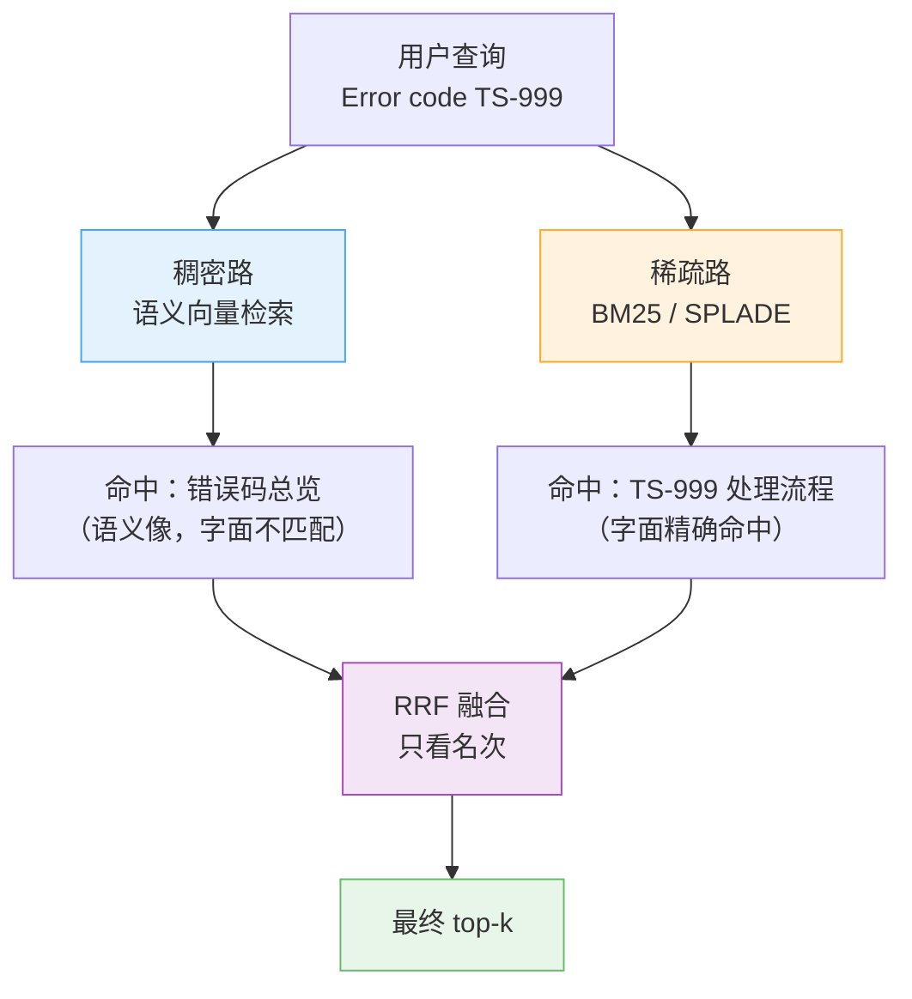
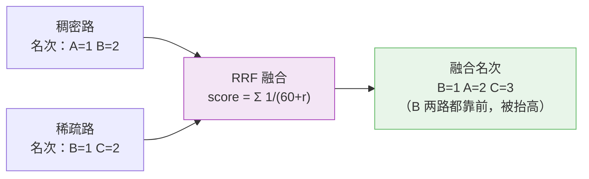
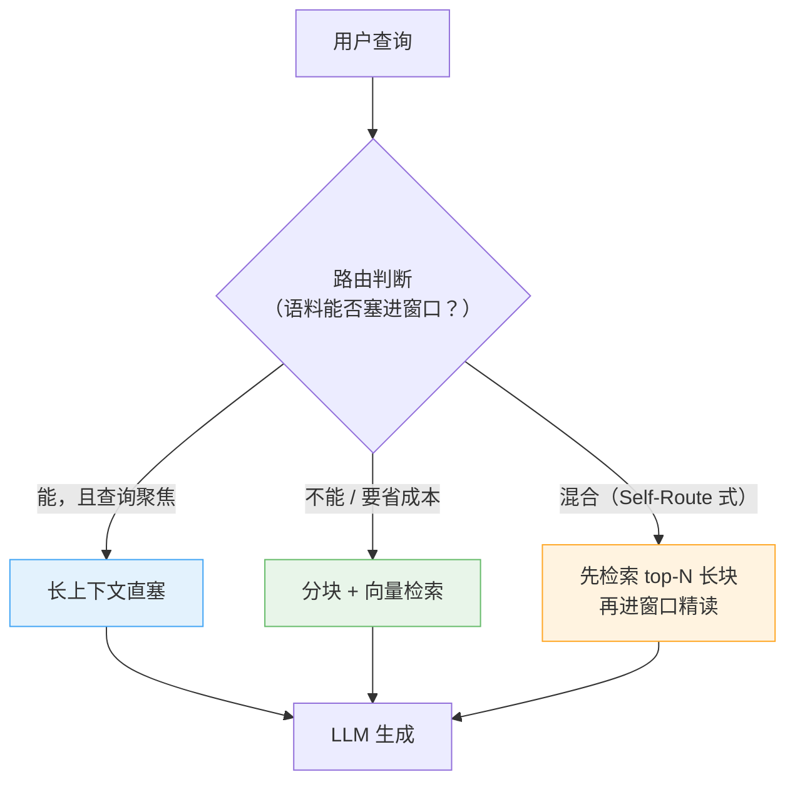

# [[Embedding-与向量检索]]

> [!tip] 学习目标
> 能独立完成：用 Python 跑通一个 Embedding 模型（编码 → 归一化 → 检索 → 算余弦），能背出 6 款主流开/闭源 Embedding 模型的维度、语种数与最大输入长度并说出各自的取舍，能用 $d \times N \times b$ 公式算出自己语料的向量存储量，能解释「归一化后余弦与点积等价」的推导，能说清 dense 与 sparse 各自擅长什么、为什么混合检索几乎必做，能手写 RRF 公式并解释参数 $k$ 的作用，能定位各向异性 / 维度坍缩现象并给出至少两种缓解手段。

> [!note] 本篇与 [[向量数据库]] 的分工
> 本篇讲**向量从哪来、怎么比、怎么把它调准**；[[向量数据库]] 讲**这些向量怎么存、怎么建索引、怎么选库**。ANN 索引原理（HNSW / IVF）与向量库选型表只在 [[向量数据库]] 里写，本篇 2.6 只讲到「精确 vs 近似检索的取舍」这一层，深度索引内容请直接跳转。

---

## 🎯 难度分段学习路径

| 难度 | 核心关注 | 预估时长 |
|---|---|---|
| **入门** | Embedding 是什么、语义向量空间、余弦相似度直觉、几何性质、编码→检索最小可运行示例 | 8h |
| **进阶** | 模型生成方式（双塔 + 对比学习）、开/闭源模型选型对比、维度选择与存储估算、四种相似度度量、精确 vs 近似检索与 top-k | 14h |
| **高级** | 混合检索、过滤检索、查询扩展（Multi-query / HyDE / Rewrite / RAG-Fusion + RRF）、长上下文 vs 分块、各向异性、常见陷阱排查 | 16h |

**总学时**：38h ｜ **前置知识**：`[[LLM-基础]]`（Transformer 与表示学习）、`[[Python-工程基础]]`（numpy、虚拟环境）、线性代数（点积、夹角）

> [!note] 数值核验声明
> 本篇所有模型的维度、语种数、最大输入长度与榜单分数，**均于 2026-09-25 逐条核验**，来源见各章末尾的「本章权威资料」。凡标注「经验法则」的，都是行业通行做法而非公开实验结论，面试时要说清区别。

---

## 📖 第一章 入门（Beginner）

### 1.1 Embedding 是什么：从离散符号到连续向量

**知识点详解**

**结论先行**：==Embedding（嵌入 / 向量表示）就是「把一段文本映射成一个固定长度的浮点数组，使得**语义相近的文本在数组空间里距离也近**」==。这是一个函数：$f: \text{text} \rightarrow \mathbb{R}^d$。输入可以是句子/段落/文档/代码，输出是长度 $d$（**维度**）的定长浮点数组，**方向**承载语义、模长一般无意义；==同一模型对不同文本总输出同样的维度==（3 个字和 3000 字的文章都是 768 维）。

**为什么需要它**：计算机原生只认数字。传统做法是 one-hot / TF-IDF，把「手机」和「iphone」当成两个毫无关系的词袋 —— 同义、反义、上下位关系全丢失。Embedding 用**神经网络**把「谁和谁该靠近」直接从海量文本里学出来，于是 TF-IDF 做不到的「苹果手机续航」和「iPhone 电池能用多久」能被认成近义。

**三种范式的区别（别混）**：

| 范式 | 代表 | 作用 | 能否直接比距离 |
|---|---|---|---|
| **词级 Embedding** | word2vec / GloVe | 一个词一个向量 | 可以，但有多义词问题 |
| ==**句级 / 段级 Embedding**== | BERT 系 / `bge-m3` / Qwen3-Embedding | **整段文本一个向量** | 可以，**本篇讨论的就是这一种** |
| Token 级嵌入 | LLM 内部词嵌入（`[[LLM-基础]]` 里的 token embedding） | 供模型内部注意力用 | **不能**，不同 token 的位置不可比 |

> [!warning] 最常见的概念混淆
> 「Embedding 模型」≠「LLM 的词嵌入层」。前者是独立训练、可单独调用的编码器（几百 MB 到几 GB）；后者是 LLM 的一部分，输出的是每个 token 的向量，直接拿来算句子相似度是错的。

**填空题**（每章 4 道，答案见章节末尾）

1. Embedding 本质是一个函数 $f$，它的定义域是 ______，值域是 ______。
2. Embedding 向量中真正承载语义的是 ______（方向 / 模长）。
3. 与 TF-IDF 相比，Embedding 的关键增量是能捕捉 ______ 和 ______ 这类词袋模型无法表达的关系。
4. 句级 Embedding 与 LLM 内部的 token 词嵌入，最本质的区别是前者可以 ______ 而后者 ______。

**答案**：
1. 文本，$\mathbb{R}^d$（$d$ 维浮点空间）
2. 方向
3. 同义（语义等价），上下位 / 相似概念
4. 直接计算两段文本的相似度；不同 token 位置之间不可比

### 1.2 余弦相似度：用夹角而不是直线距离

**知识点详解**

**结论先行**：==文本 Embedding 检索用**余弦相似度**，因为它只测两个向量的**夹角**、完全忽略模长 ==。

$$\text{cos}(\mathbf{a}, \mathbf{b}) = \frac{\mathbf{a} \cdot \mathbf{b}}{\|\mathbf{a}\|\|\mathbf{b}\|}$$

值域 $[-1, 1]$：$1$ = 完全同向（两段话说的是同一件事），$0$ = 正交（毫无关系），$-1$ = 完全反向（语义对立，真实语料里极少出现）。

**为什么不用欧氏距离**：欧氏距离 $\|\mathbf{a} - \mathbf{b}\|$ 把「方向差」和「长度差」搅在一起。一段长文本的向量模长天然更大，它跟所有文本的欧氏距离都更远，于是 ==长文档会在欧氏排序里系统性吃亏==。余弦把模长约掉，只留方向。

**归一化（normalize）是什么**：把向量除以自己的模长，$\hat{\mathbf{a}} = \mathbf{a} / \|\mathbf{a}\|$，使 $\|\hat{\mathbf{a}}\| = 1$。归一化之后 $\|\hat{\mathbf{a}} - \hat{\mathbf{b}}\|^2 = 2 - 2\hat{\mathbf{a}} \cdot \hat{\mathbf{b}} = 2(1-\cos)$，==所以「欧氏距离」和「余弦相似度」在单位球面上是**单调等价**的== —— 这是 2.5 讲「归一化 × 度量组合错误」的前提。

```python
import numpy as np
a, b, c = np.array([1.,2.,3.]), np.array([2.,4.,6.]), np.array([9.,1.,0.])
cos = lambda x, y: float(x @ y / (np.linalg.norm(x) * np.linalg.norm(y)))

print(cos(a, b), np.linalg.norm(a - b))  # 1.0  3.74
# 关键观察：a 和 b 长度差一倍，欧氏距离很大，但余弦完全不受影响
print(cos(a, c))                        # 约 0.41 —— 方向不同
```

> [!tip] 记忆锚点
> ==**余弦 = 归一化之后的点积**==。这句话既是理解 1.2 的钥匙，也是 2.5 里所有组合错误的根源，务必背下来。

**填空题**

1. 余弦相似度的取值范围是 ______ 到 ______，等于 ______ 表示两向量同向。
2. 欧氏距离会把「方向差」和 ______ 混在一起，导致 ______ 的文本在排序里吃亏。
3. 归一化的做法是把向量除以它的 ______，使归一化后向量的模长恒等于 ______。
4. 在单位球面上，欧氏距离与余弦相似度之间的关系是 ______（单调同向 / 互相独立）。

**答案**：
1. $-1$，$1$，$1$
2. 长度差（模长差），长文档
3. 模长（欧氏范数），$1$
4. 单调同向（$\|\hat a - \hat b\|^2 = 2(1-\cos)$）

### 1.3 语义向量空间的四条几何性质

**知识点详解**

**结论先行**：一个「好」的 Embedding 空间应该满足下面四条性质。==这四条是**判断一个检索结果是否正常**的诊断清单==，排查时逐条对照，比瞎调参数有效得多。

| 性质 | 含义 | 坏掉时的症状 | 怎么量 |
|---|---|---|---|
| **语义邻近性** | 意思相近 → 距离近 | 搜「怎么退款」找不到退款文档 | MTEB / STS 榜单 |
| **各向同性（Isotropy）** | 向量在空间中**均匀铺开**而不是挤在一个锥形里 | 所有东西都「有点像」，top-10 分数都 0.8+ | 随机采样两两平均余弦，==应接近 0== |
| **低维坍缩 / 维度坍缩** | 大量维度上信息量极低，实际只用到少数方向 | 768 维和 128 维效果一样，白付存储 | 各维方差分布 / 内在维度 |
| **Hubness（枢纽现象）** | 少数几个向量和**几乎所有**向量都相似 | 某个「万金油」文档永远排第一 | 统计每个向量的近邻数分布 |

> [!warning] 「各向异性」不是玄学
> [Ethayarajh（EMNLP-IJCNLP 2019）](https://aclanthology.org/D19-1006/) 的实验结论：BERT、ELMo、GPT-2 **任何一层的词表示都不是各向同性的**，GPT-2 最后一层极端到「两个随机词的平均余弦接近 1」。含义：==未微调的原始模型产出的向量挤在一个狭窄锥形里，距离几乎不携带区分信息==。3.5 讲怎么缓解。

**填空题**

1. 语义向量空间应满足的四条性质是：语义邻近性、______、低维坍缩、______。
2. 判断各向同性最直接的指标是 ______，好的模型应接近 ______。
3. 「Hubness」现象指的是 ______。
4. 维度坍缩的直接后果是：模型在 ______ 维上就能达到和完整维度几乎一样的效果，意味着你多付了 ______ 倍的存储。

**答案**：
1. 各向同性（Isotropy），Hubness（枢纽现象）
2. 随机采样向量两两之间的平均余弦相似度，$0$
3. 少数向量和几乎所有向量都相似，导致它们在几乎任何查询里都排得很前
4. 少数（很低），存储

### 1.4 最小可运行示例：编码 → 归一化 → 检索

**知识点详解**

**结论先行**：==用 numpy 手写一次，能把「模型是干什么的」和「检索库是干什么的」彻底分开== —— 模型只负责「文本 → 向量」，剩下的排序全是线性代数。

```python
# pip install sentence-transformers
from sentence_transformers import SentenceTransformer
import torch

model = SentenceTransformer("BAAI/bge-m3")   # 1024 维，最多 8192 token，100+ 语种
corpus = ["退款政策：订单签收后 7 天内可无理由退货",
          "配送范围：全国大陆地区，偏远地区除外",
          "发票可在订单完成后在「我的-发票」页自助开具"]
queries = ["我买的东西不想要了怎么退", "怎么开发票"]

with torch.no_grad():
    doc_emb = model.encode(corpus, normalize_embeddings=True)   # 归一化，重要
    qry_emb = model.encode(queries, normalize_embeddings=True)

for q, qe in zip(queries, qry_emb):
    scores = qe @ doc_emb.T                    # 单位向量点积 == 余弦相似度
    top = scores.argmax().item()
    print(f"{q}\n  -> {corpus[top]}  (cos={scores[top]:.4f})\n")
```

> [!tip] 三个必须记住的代码细节
> ① **`normalize_embeddings=True`** —— 归一化后可以直接用点积，比在库里调余弦度量更快也更省心；② **`torch.no_grad()`** —— 纯推理不需要计算图，白白占显存；③ **句首指令前缀不是所有模型都要** —— 检索类微调模型（如 `bge-m3`）要求给**查询**加任务前缀，但文档侧不加；`e5` 系则要求 `query:` / `passage:` 前缀。==前缀规则跟着模型卡走，不要凭印象==（见 2.2）。

**填空题**

1. 上例中 `normalize_embeddings=True` 之后，两个单位向量的相似度可以直接用 ______ 计算得到。
2. `torch.no_grad()` 的作用是 ______。
3. 检索类 Embedding 模型通常要求**查询侧**加任务前缀，而文档侧 ______。
4. 若忘记归一化而模型输出又恰好未归一化，用点积排序的直接后果是 ______。

**答案**：
1. 点积（`qe @ doc_emb.T`）
2. 关闭梯度记录，纯推理时省显存
3. 不加
4. 长文本向量模长更大，会稳定压过短文本（长文本霸榜）

### 1.5 第一章综合练习

**填空题**

1. Embedding 把文本映射成 ______ 维的浮点数组，语义主要由向量的 ______ 承载。
2. 余弦相似度 = ______（归一化之后的 ______）。
3. 「所有结果余弦都在 0.85 以上」最可能指向 1.3 中的 ______ 现象。
4. 在 1.4 的代码里，把 `normalize_embeddings=True` 去掉并改用欧氏距离排序，最先出问题的场景是 ______。

**本章答案**：

1. 定长（$d$），方向
2. 归一化后的点积
3. 各向异性 / Hubness
4. 长文本（模长大）在排序里被系统性压后

**综合项目**：用 1.4 的代码搭一个 20 条语料的「小黄历」—— 放入 20 条金融/客服类语句，构造 5 个查询（其中 2 个是**精确匹配类**如具体编号，3 个是**语义改写类**如口语化提问）。产出物：① 一张 5×20 的余弦相似度矩阵（用 numpy 打印）；② 你对每一行 top-3 的观察记录。**验收标准**：能明确指出哪两个查询的 top-1 不正确，并说明这是「语义召回」还是「字面召回」的问题 —— 这个观察会直接引出 3.1 的混合检索。

> [!tip] 常见陷阱
> 1. **把 Embedding 当「压缩工具」**：它是为「相似度」优化的，不是为「还原原文」优化的，低维截断会掉信息（见 2.4）；**拿不同模型的向量混在一个集合里**也是同理 —— 不同模型的向量空间完全不兼容，混用是静默错误（见 3.6）。
> 2. **用平均词向量代表一句话**：那是词级 Embedding 的老做法，句级模型有自己的池化/指令机制（见 1.1）。
> 3. **忘了查询前缀**：不少检索模型在训练时就带了指令前缀，推理时不给会明显掉点。

> [!note] 本章权威资料
> - [Sentence Transformers 快速开始](https://sbert.net/docs/quickstart.html) — 1.4 代码的 API 依据
> - [Sentence Transformers 语义检索示例](https://www.sbert.net/examples/applications/semantic-search/README.html) — 归一化 + 点积的官方写法
> - [Sentence Transformers 模型参考](https://www.sbert.net/docs/package_reference/sentence_transformer/models.html) — `normalize_embeddings` 参数来源

---

## 📖 第二章 进阶（Intermediate）

> [!warning] 与上一章的衔接
> 第一章回答了「向量是什么、怎么比」。本章回答三个工程问题：**这个向量由谁生成（2.1-2.3）、维度怎么选（2.4）、四种度量分别在什么场景用（2.5）**。跳过 1.2 的「余弦 = 归一化点积」，2.5 的组合错误就讲不清楚。

### 2.1 Embedding 模型是怎么生成的

**知识点详解**

**结论先行**：主流句级 Embedding 模型是 **双塔（bi-encoder / two-tower）+ 对比学习**：查询和文档**分别**编码成向量，训练时拉近正样本、推开负样本。

| 组件 | 做法 | 为什么这么设计 |
|---|---|---|
| **编码器（tower）** | BERT / XLM-R / Qwen3 等 Transformer 主干，取 `[CLS]` 或末层池化 | 共享一套权重，降低语料需求 |
| **投影层** | 可选，把隐层维度映射到目标维度 $d$ | 让 768 维主干输出 1024 维等 |
| **池化** | 平均池化 / CLS / 加权池化 | 决定哪些 token 的话语权更大 |
| **训练目标** | 对比学习（InfoNCE）+ 大规模弱标注挖掘 | ==负样本质量决定效果上限== |
| **训练数据** | 弱监督合成数据（Qwen3 用自家 LLM 合成）+ 模型融合 | 纯人工标注扩展不起来 |

**DPR 与 BEIR 奠定的两条经验**（均已核验标题与结论）：**DPR（Karpukhin et al. 2020）**证明「双塔 + 对比学习 + 大规模挖掘负样本」是稠密检索的可行路线，也把「==同一编码器同时编码查询与文档==」变成行业默认；**BEIR（Thakur et al. 2021）**在 18 个异质数据集上评测 10 套检索系统，结论是：==BM25 是极其稳健的基线；重排与晚交互模型零样本效果最好但算力代价高；稠密与稀疏检索更省算力但通常弱于前两者== —— ==这句话是 3.1「为什么要混合检索」最硬的证据==。

**填空题**

1. 主流句级 Embedding 模型的架构叫 ______（双塔 / bi-encoder），其查询与文档两侧 ______ 共享编码器权重。
2. 双塔架构的关键代价是：在训练和推理时，查询与文档之间 ______ 直接交互（这正是它比交叉编码器快的根本原因）。
3. DPR 证明了双塔 + 对比学习 + ______ 是稠密检索的可行路线。
4. BEIR 在 18 个数据集上的结论：零样本效果最好但算力代价高的是 ______ 与 ______ 模型；最稳健的基线是 ______。

**答案**：
1. 双塔（bi-encoder），是
2. 不能（只靠最终的向量相似度间接交互）
3. 大规模挖掘负样本
4. 重排（re-ranking），晚交互（late-interaction），BM25

### 2.2 开源 Embedding 模型选型对比

**知识点详解**

**结论先行**：截至 2026-09-25 核验，==开源阵营的实际可用者集中在 `bge-m3` 与 Qwen3-Embedding 两个系列==；前者是「多语种 + 三种检索范式一体」，后者是「榜单分数更高 + 32K 长上下文」。

| 模型 | 维度 | 最大输入 | 语种 | 检索范式 | 许可 | 关键特征 |
|---|---|---|---|---|---|---|
| `BAAI/bge-m3` | 1024 | 8192 token | 100+ | ==dense + sparse + ColBERT 多向量，三者同一模型== | MIT | 唯一能一次调用同时产出稠密向量、稀疏词权重、多向量表示的模型；多粒度（短句到长文档） |
| `Qwen3-Embedding-0.6B` | 1024（可 32-1024 自定义） | 32K | 100+ | dense（另配 reranker） | Apache-2.0 | 支持 MRL（可截断维度）、指令感知（instruction aware）、推理成本最低 |
| `Qwen3-Embedding-4B` | 2560 | 32K | 100+ | dense | Apache-2.0 | 中间档，MTEB 多语 69.45 |
| `Qwen3-Embedding-8B` | 4096 | 32K | 100+ | dense | Apache-2.0 | ==本系列最强，MTEB 多语 70.58==（2025-06-05 官方博客口径登顶） |
| `multilingual-e5-large-instruct` | 1024 | 512 token | 100+ | dense | MIT | 经典强基线，MTEB 多语 mean(task) 63.22；**512 token 上限是硬伤** |
| `voyage-code-4`（闭源 API） | 1024 | 32K | 多语 | dense | API | 代码检索专用 |

**Qwen3-Embedding 的三个实用特性**（官方技术报告已核验）：**MRL（Matryoshka 表示学习）** —— 一份向量在任意截断长度下都可用，存 4096 维、检索时按需截到 1024/256，**一份数据两种成本**；**Instruction Aware** —— 编码时接受任务指令，检索/聚类/分类可分别给不同指令；**配套 Reranker 同系列**（0.6B/4B/8B）—— 检索用 0.6B、重排用 4B，成本可控。

**MRL 是什么**（[Matryoshka Representation Learning](https://arxiv.org/abs/2205.13147)）：训练时就要求「前 $k$ 维单独拿出来也能独立完成任务」，于是训练出「粗到细」的嵌套表示。论文在 ImageNet-1K 上给出==相同精度下最多 14× 更小的向量、14× 检索加速==（这是图像任务的结果，文本 Embedding 的收益幅度会不同）。对文本侧的实际意义：==同一份语料，你可以在不重新灌库的前提下换维度策略==。

> [!warning] 选型时必须问的四个问题（经验法则，非实验结论）
> ① **你的语料有多长**？超 512 token 就把 `e5-large` 排除；② **要不要跨语言检索**？只要单语就别为了多语种牺牲单语效果（`bge-m3` 模型卡自己就提醒：多语模型在单语检索上可能不如单语专用模型）；③ **要不要自托管**？要控成本/数据出本域就必须开源权重；④ **要不要稀疏/多向量**？只有 `bge-m3` 一家一个模型全给。

**填空题**

1. `BAAI/bge-m3` 的维度、最大输入长度、语种数分别是 ______、______、______。
2. ==唯一一个「dense + sparse + ColBERT 多向量」都由同一个模型产出的是______==。
3. Qwen3-Embedding 的 MRL 特性在实践上给部署带来的好处是：一份语料灌一次，==之后可以______而不必重建索引==。
4. `multilingual-e5-large-instruct` 的最大输入只有 512 token，这意味着：处理长文档时必须先 ______。

**答案**：
1. 1024，8192 token，100+ 语种
2. `BAAI/bge-m3`
3. 按需改变输出维度（或截断维度）
4. 分块（chunking），且块大小不能超 512 token

### 2.3 闭源 API 模型选型对比

**知识点详解**

**结论先行**：闭源 API 的真实差异不在「谁更准」，而在 ==**能不能调维度、上下文有多长、能不能跨语言**==。这三项直接决定你的存储账单和召回上限。

| 模型 | 输出维度 | 最大输入 | 维度可调 | 特征 |
|---|---|---|---|---|
| OpenAI `text-embedding-3-small` | 默认 1536 | 8192 token | ==支持==（`dimensions` 参数） | 便宜、通用；MTEB 62.3% |
| OpenAI `text-embedding-3-large` | 默认 3072 | 8192 token | ==支持== | 官方口径 MTEB 64.6%；截到 256 维仍能超过未截断的 `ada-002`（1536 维） |
| OpenAI `text-embedding-ada-002` | 1536 | 8192 token | 不支持 | 上一代，MTEB 61.0% |
| Voyage `voyage-4` / `-large` / `-lite` | 1024（256/512/1024/2048 可选） | ==32000 token== | 支持 | 同系列向量互相兼容（升配文档编码器不必重灌库） |
| Voyage `voyage-3.5` | 1024（256/512/1024/2048） | 32000 | 支持 | 上一代 |
| Cohere `embed-v4.0` | 256/512/1024/==1536（默认）== | ==128k== | 支持 | 支持文本 + 图片混合输入 |
| Cohere `embed-english-v3.0` | 1024 | 512 | 否 | 英文专用 |
| Cohere `embed-english-light-v3.0` | 384 | 512 | 否 | 小而快 |

> [!note] 链接核验说明（OpenAI 部分）
> `openai.com` / `platform.openai.com` / `developers.openai.com` / `help.openai.com` 对本机 **curl 全部返回 403**，故**不写入 OpenAI 官方链接**。上表数值取自官方页面正文（经搜索工具读取，核验日期 2026-09-25），**链接改用可核验的微软官方文档**：[Azure OpenAI 模型概念](https://learn.microsoft.com/en-us/azure/ai-foundry/openai/concepts/models)（已核验，其正文明确「第三代模型支持 `dimensions` 参数缩减向量大小」「即使把第三代维度降到低于 `text-embedding-ada-002` 的 1536 维，性能仍略优」）。==用前请以 OpenAI 官方文档当天的表述为准==。

**闭源 vs 开源，怎么选（经验法则）**：快速验证想法、语料 < 100 万 → 闭源 API（省掉部署与 GPU）；数据不能出本域或长期高频调用 → 开源自托管（边际成本递减、版本可控）；需要超长文档（> 8K）→ Voyage 系（32K）或 `bge-m3` / Qwen3（32K），==8192 token 是 OpenAI 的硬上限==；需要跨语言检索 → 多语模型（`e5-large` 的 512 上限太短）；要「一份数据多种维度」→ 选 MRL 模型或 `dimensions` 可调的 API（见 2.2）。

**填空题**

1. 闭源 API 之间差异最大的三项是：==维度______、上下文长度、是否______==。
2. OpenAI 第三代嵌入模型的 `dimensions` 参数作用是 ______；`text-embedding-ada-002` 是否支持？______。
3. Voyage 4 系列「同系列向量互相兼容」的部署价值是：升级文档编码器时 ______。
4. 若你的文档平均 20000 token，OpenAI 系（8192 上限）与 Voyage 系（32000 上限）分别需要做什么？

**答案**：
1. 是否可调，是否支持跨语言（其余按需核对）
2. 缩减输出向量维度并相应降低存储与算力；不支持
3. 不必重新灌库（旧文档向量仍可与新查询向量匹配）
4. OpenAI 必须先分块再编码；Voyage 可以整篇直接编码（但仍建议分块以提高检索粒度）

### 2.4 维度选择：存储与效果的权衡

**知识点详解**

**结论先行**：==维度越高并非越好。== 维度买到的是**召回上限**，同时强制你付**存储、带宽、索引内存和检索延迟**四笔钱。选维度的正确顺序是：先确定用哪个模型 → 再看它是否支持降维 → 用你自己的评测集决定降到多少。

**存储量估算公式**（$d$ = 维度，常见 384/768/1024/1536/2560/4096；$N$ = 向量条数，即 **chunk 数而非文档数**，10 万~1 亿；$b$ = 每维字节数，float32 = **4**、float16 = **2**、int8 = **1**）：

$$\text{向量存储} = d \times N \times b \text{ 字节}$$

| 场景（float32，$b=4$） | $d$ | $N$ | 原始体积 | 降 float16 后 |
|---|---|---|---|---|
| 小型知识库 | 1024 | 10 万 | $1024 \times 10^5 \times 4 \approx$ **409 MB** | ≈ 205 MB |
| 中型语料 | 1024 | 1000 万 | ≈ **41 GB** | ≈ 20 GB |
| 长文档重度降维 | 256 | 1000 万 | ≈ **10.2 GB** | ≈ 5.1 GB |

> [!warning] 别忘了公式外的东西
> 上表只是**向量本体**。实际占用还要加：==HNSW 图的连接开销（通常按每条向量再乘几倍算）、副本数、过滤字段的标量索引、原文与元数据==，图开销与副本系数属于向量库的账，见 [[向量数据库]] 的内存估算一节。

**降维的三条技术路径（按推荐顺序）**：**MRL / `dimensions` 参数**（模型训练时就支持「前 $k$ 维独立可用」，模型自己知道哪些维最重要，==最优路径==）；**后处理截断**（直接丢掉尾部维度，OpenAI 第三代可用，但不是所有模型都保证前 $k$ 维有意义）；**降精度**（float32 → float16 / int8 / 二值量化，维度不变，**省的是字节不是维度**，召回下降幅度通常更小）。

> [!tip] 一条被反复验证的顺序
> ==**先降精度，再降维度**==。float16 通常是近乎无损的（精度减半、召回基本不变），而砍掉 60% 的维度是明确的有损操作。详见 [[向量数据库]] 的「省内存顺序」。

**填空题**

1. 向量存储量公式是 ______，其中 $b$ 在 float32 下是 ______，float16 下是 ______。
2. $d = 1024$、$N = 1000$ 万、float32 时，向量本体约 ______ GB。
3. 降维的三条路径按推荐顺序是：______、______、______。
4. ==为什么说「先降精度、再降维度」？==（各一句）

**答案**：
1. $d \times N \times b$，4 字节，2 字节
2. $1024 \times 10^7 \times 4 \approx 4.1\times 10^{10}$ 字节 ≈ 41 GB
3. MRL / `dimensions` 参数，后处理截断，降精度（float16 / int8 量化）
4. float16 是近乎无损的减半；砍维度是明确有损的，优先用模型自己支持的降维

### 2.5 相似度度量：cosine / dot / euclidean / manhattan

**知识点详解**

**结论先行**：==四种度量的选择取决于「语义只在方向」还是「幅值也带信息」；文本 Embedding 场景，**余弦是默认答案，点积是它归一化后的等价物**==。

| 度量 | 公式要点 | 值域（归一化后） | 适用场景 | 陷阱 |
|---|---|---|---|---|
| **余弦 cosine** | 夹角 | $[-1, 1]$ | ==文本 Embedding 默认== | 忽略幅值；若模长本身带信息（置信度、长度）会丢信息 |
| **点积 dot / IP** | $\mathbf{a}\cdot\mathbf{b}$ | $[-1, 1]$（归一化后） | ==归一化后与余弦完全等价==；未归一化时用于「相关度推荐」 | ==未归一化时长文本天然高分== |
| **欧氏 L2** | $\|a-b\|$ | $[0, 2]$（归一化后） | 幅值/位置本身有意义（图像特征、坐标） | 对幅值敏感；实现常用「平方 L2」省算力 |
| **曼哈顿 L1** | $\sum|a_i-b_i|$ | $[0, 2]$（归一化后） | 稀疏向量、特征维度独立的场景 | 高维下比 L2 更稠密，剪枝效果通常更差 |

**「归一化 × 度量」的组合错误（高频面试题，逐条背）**：

| 组合 | 是否正确 | 说明 |
|---|---|---|
| 归一化 + 余弦 | ==正确（只是多一次除法）== | 没毛病，放心用 |
| ==归一化 + 点积== | ==正确，且与余弦等价== | $\hat a \cdot \hat b = \cos$。**这是性能最优的常用组合** |
| **未归一化 + 点积** | ==错误，除非你确实想让幅值计分== | 长文本模长大 → 稳定霸榜。推荐/召回场景常用，但要明确这是有意的 |
| **未归一化 + 余弦** | 正确 | 余弦本身会约掉模长 |
| ==**建索引用 A 度量、查询用 B 度量**== | ==**最危险：静默给出错误排序，不报错**== | pgvector 明确「一种距离函数建一个索引」；图上近的边在另一种度量下未必近，选错不会崩、只会悄悄变差 |
| **归一化两次** | ==纯归一化无害（幂等）== | 单位向量再除以 1 还是自己。==真正出事的是：① 在已归一化向量上又乘了业务权重（如热度）后算余弦 —— 方向里混进了热度；② 归一化后没同步建索引的度量== |

**距离 ↔ 相似度的转换**（写排序逻辑时别搞反）：拿到的是**距离**（cosine distance $= 1-\cos \in [0,2]$、L2、IP distance）就 ==**升序**取 top-k==；拿到的是**相似度**（$\cos \in [-1,1]$、点积得分）就 ==**降序**==。

**填空题**

1. 归一化之后，点积与余弦的关系是 ______；所以生产上「归一化 + 点积」比「余弦」更优的原因是 ______。
2. 未归一化向量用点积排序，最典型的坏现象叫 ______。
3. ==在向量库里**建索引**用欧氏、**查询**用余弦，会发生什么？为什么它比崩溃更可怕？==（两句）
4. 拿到一批结果后，若 API 返回的是**距离**而不是相似度，排序时应该 ______ 序。

**答案**：
1. 完全等价（$\hat a \cdot \hat b = \cos$）；少一次除法 / 归一化只做一次，检索侧直接点积
2. 长文本霸榜（长文本向量模长天然更大）
3. 静默给出错误的排序结果，不报任何错；因为查询侧用了与索引侧不同的距离假设，图上近的边在另一种度量下未必近，于是召回悄悄变差
4. 升

### 2.6 向量检索基础：精确 vs 近似、top-k、距离转相似度

**知识点详解**

**结论先行**：==「暴力检索（brute force / flat）」给出**绝对正确**的 top-k，「近似最近邻（ANN）」用召回率换速度==。小语料直接暴力，大语料必须 ANN —— ANN 索引的实现与调参在 [[向量数据库]]，本节只讲**怎么选**。

| 维度 | 精确检索（Flat / brute force） | 近似检索（ANN） |
|---|---|---|
| 结果 | ==**保证**是真正的 top-k== | 高概率是 top-k，允许漏 |
| 复杂度 | $O(N \cdot d)$ 每查询 | 近似 $O(\log N)$（HNSW 类） |
| 内存 | 只存向量本体 | ==还要存图结构，吃额外内存== |
| 适用 | ==$N$ 在 10 万以内、要求零召回损失== | 百万级以上 / 有延迟 SLA |

**什么时候可以放心用暴力检索（经验法则）**：==10 万条 × 1024 维 float32 ≈ 400 MB，现代机器用 numpy 矩阵乘法做一次全量点积在几十毫秒量级==。$N$ 不到百万时，暴力检索往往比 ANN 还简单可靠 —— 少一个组件、少一堆调参、少一类 bug。**别为了「用了向量库」而过早上 ANN**。top-k 起点：纯 RAG 喂 LLM 取 3~5 块（多了挤占窗口且引入噪声）；搜索结果页 20~100（分页在应用层做）；==**配合重排时先粗检 50~150、再重排取 top 3~5**==（重排逐条精算，只有粗检候选才值得算）；配合元数据过滤则 k 需**放大**（过滤在检索之后生效，见 3.2）。

> [!warning] top-k 与阈值是绑定的
> 你不能只调 k 不调阈值。==k 决定「最多看几条」，阈值决定「哪几条算够相似」==。阈值太高返回空结果，太低会把毫不相关的内容喂给 LLM 导致幻觉。正确做法见 3.6。

**填空题**

1. 精确检索（Flat）保证返回的是 ______ 的 top-k；ANN 则是用 ______ 换 ______。
2. 精确检索的时间复杂度是 ______，ANN 大约降到 ______ 量级。
3. 什么时候「$N$ 在 10 万以内」可以直接不上 ANN？给一条理由。
4. 用了重排模型时，正确的两段式配置是：粗检 k = ______，重排后取 ______。

**答案**：
1. 真正；召回率；速度（延迟）
2. $O(N \cdot d)$，近似 $O(\log N)$
3. 暴力全量点积的延迟（几十毫秒量级）已能满足 SLA，而 ANN 还要额外吃内存与调参成本
4. 50~150，3~5

### 2.7 第二章综合练习

**填空题**

1. 双塔架构的核心代价是查询与文档之间不能 ______ 交互，这也是它比交叉编码器 ______ 的原因。
2. `bge-m3` 的三个「Multi」分别指：Multi-Functionality、Multi-Linguality、______。
3. 存储量公式 $d \times N \times b$ 中，$d = 4096$、$N = 500$ 万、float16 时约为 ______ GB。
4. 「归一化 + 点积」与「余弦」的关系是 ______；而「建索引用 A 度量、查询用 B 度量」的后果是 ______。

**本章答案**：

1. 直接；快
2. Multi-Granularity（多粒度，从短句到 8192 token 长文档）
3. $4096 \times 5\times10^6 \times 2 = 4.1\times10^{10}$ 字节 ≈ **41 GB**
4. 完全等价；静默的错误排序（不报错，召回悄悄变差）

**综合项目**：写一份**自用的 Embedding 模型选型决策表**（Markdown 即可，600 字以内）。必须包含：① 至少 6 款模型的维度 / 最大输入 / 语种 / 许可；② 针对你的场景（假设：8000 篇中文技术文档 + 每周新增 200 篇 + 需要中文/英文混合检索 + 数据不能出内网）给出**唯一**推荐并写明被排除的模型各自败在哪一条；③ 用 $d \times N \times b$ 算出你的向量体积（写明 $N$ 是怎么估的：文档数 × 每篇平均块数）；④ 列出「换模型时的迁移成本清单」。**验收标准**：每个排除理由都能指向表格里某一列的具体取值，不能只说「不够好」。

> [!tip] 常见陷阱
> 1. **只看榜单选模型**：MTEB 是 60+ 个任务的平均分，与你的具体查询分布可能完全不符；**忽略最大输入长度**（选了个 512 token 的模型处理长文档，被迫激进分块、语义切碎）也是同一类错误。
> 2. **把 MRL 当免费午餐**：MRL 允许你降维，但降维后的召回必须实测，不能假设无损。
> 3. **以为改了 `dimensions` 就不用重灌**：==改了维度就是另一套向量空间，必须重建全部向量与索引==。

> [!note] 本章权威资料
> - [Qwen3 Embedding 技术报告（arXiv 2506.05176）](https://arxiv.org/abs/2506.05176) — 0.6B/4B/8B 的维度、32K 序列长度、MRL 与指令感知（已核验标题与表 1）
> - [Qwen3 Embedding 官方博客](https://qwenlm.github.io/blog/qwen3-embedding/) · [官方仓库](https://github.com/QwenLM/Qwen3-Embedding) — MTEB 多语 70.58、100+ 语种、Apache-2.0、支持语种清单（已核验）
> - [BGE-M3 技术报告（arXiv 2402.03216）](https://arxiv.org/abs/2402.03216) — 三种检索范式与多粒度的设计动机（已核验标题）
> - [BAAI/bge-m3 模型卡（ModelScope 镜像）](https://www.modelscope.cn/models/BAAI/bge-m3) · [NVIDIA NIM 同款文档](https://docs.api.nvidia.com/nim/reference/baai-bge-m3) — 1024 维 / 8192 token / 100+ 语种
> - [Matryoshka Representation Learning（arXiv 2205.13147）](https://arxiv.org/abs/2205.13147) — MRL 原理与 14× 收益的适用范围（已核验标题）
> - [Azure OpenAI 模型概念（微软官方）](https://learn.microsoft.com/en-us/azure/ai-foundry/openai/concepts/models) — `dimensions` 参数与 1536 维基线（OpenAI 官方站对本机 403，用此替代）
> - [Voyage AI Embeddings 文档](https://docs.voyageai.com/docs/embeddings) — 4 系列 32K 上下文、1024 维、系列内向量兼容
> - [Cohere Embed 文档](https://docs.cohere.com/docs/cohere-embed) — embed-v4.0 的 256/512/1024/1536 维与 128k 上限
> - [DPR（arXiv 2004.04906）](https://arxiv.org/abs/2004.04906) · [BEIR（arXiv 2104.08663）](https://arxiv.org/abs/2104.08663) — 双塔路线与 BM25 稳健性结论（均已核验标题）
> - [sentence-transformers 仓库](https://github.com/UKPLab/sentence-transformers) · [MTEB 基准仓库](https://github.com/embeddings-benchmark/mteb)

---

## 📖 第三章 高级（Advanced）

> [!note] 深度标准
> 本章是本篇重点，每节都包含**机制原理 / 边界条件 / 异常行为**，并尽量给出可复现的代码与评测方式。2.6 已给出「粗检 k 要放大」的现象，3.2 解释为什么。

### 3.1 混合检索：dense + sparse（重点）

**知识点详解**

**结论先行**：==**纯向量检索有结构性软肋：它对「精确字面匹配」不敏感**==。混合检索不是「锦上添花」，BEIR 的实验结论已经说明：BM25 是稳健基线，稀疏与稠密各有胜负，==而 Anthropic 2024 的 Contextual Retrieval 给出了一个可引用的量化结果==。

**两类信号各自擅长什么**：

| 信号 | 强在 | 弱在 | 典型失败案例 |
|---|---|---|---|
| **稠密向量（dense）** | 语义改写、跨语言、同义表述、模糊意图 | ==精确字面（型号、错误码、人名、文件路径）== | 搜 `"TS-999"` 找「错误码 TS-999」——向量知道这是「错误码」，但不知道是 **TS-999** 这个具体串 |
| **稀疏 / BM25（sparse）** | 精确字面、罕见词、专业术语、标识符 | 同义改写、跨语言 | 搜「怎么退钱」找不到只写「退货」的文档 |

> [!note] 可引用的量化结果（有公开实验支撑）
> Anthropic 在 2024 年的 Contextual Retrieval 一文中报告：在其知识库集合上，「Contextual Embeddings + Contextual BM25」的检索失败次数**降低 49%**；再叠加重排后，top-20 块的检索失败率从 **5.7% 降到 1.9%（降 67%）**。==注意这是特定数据集 + 特定配置下的数字，不是通用保证== —— 面试时说清「谁的实验、什么配置」。

**稀疏向量的两条技术路线**：**经典稀疏检索**（用 BM25 这类词频-逆文档频率打分，不产生向量 —— 代表：BM25 本身、各库的全文检索）；==**学习式稀疏（Learned Sparse）**==（模型为每个词**学一个权重**，产生「词表大小」的稀疏向量，仍可走倒排索引 —— 代表：SPLADE，用 MLM 的重要性传播学到词权重）。



**融合方式与各库落地写法**（具体语法以各家文档为准）：

| 融合方式 | 做法 | 何时用 |
|---|---|---|
| 分数归一化后加权求和 | 两路分数各自缩放到可比区间，再按 $\alpha$ 加权 | ==分数分布稳定，且愿意扫 $\alpha$== |
| ==**排名融合（RRF）**== | ==只看名次不看分数== | ==默认首选：天然免疫量纲差异== |

| 库 | 混合检索写法 |
|---|---|
| Qdrant | `prefetch` 多路（dense + sparse 向量字段）→ `models.RrfQuery(rrf=models.Rrf(k=60))` |
| Weaviate / Pinecone | `query.hybrid(query=..., alpha=0.5)`，==`alpha` 0 为纯 BM25、1 为纯向量== |
| Milvus 系（Zilliz） | `SPARSE_FLOAT_VECTOR` 字段 + `BM25` 度量做稀疏路，RRF 融合 |

**填空题**

1. 稠密向量检索的结构性软肋是 ______；稀疏 / BM25 的软肋是 ______。
2. BEIR 的实验结论里「最稳健的基线」是 ______，「零样本效果最好但算力代价高」的是 ______ 和 ______。
3. Anthropic 报告的「Contextual Retrieval 降低检索失败次数」是 ______%，叠加重排后是 ______%。
4. 融合两路结果时，为什么**排名融合（RRF）**比「分数加权求和」更常用？因为 ______。

**答案**：
1. 对精确字面匹配（型号 / 错误码 / 人名 / 路径）不敏感；无法处理同义改写与跨语言
2. BM25；重排（re-ranking）模型、晚交互（late-interaction）模型
3. 49，67（5.7% → 1.9%）
4. 两路分数量纲完全不同（余弦在 $[-1,1]$，BM25 无上界），归一化后加权仍对分数分布敏感；RRF 只看名次，天然免疫

### 3.2 过滤检索：元数据过滤与向量检索的组合

**知识点详解**

**结论先行**：==过滤与向量检索的**执行顺序**决定召回上限==。多数索引结构是「先在向量空间找 top-k，再对这 k 条应用过滤」—— 于是「返回不足 k 条」是数学上的必然，不是 bug。

| 顺序 | 做法 | 后果 |
|---|---|---|
| ==**先过滤后检索**（过滤感知）== | 先用元数据索引圈出候选子集，再在这子集里做向量检索 | ==召回正确但延迟不可控==（选择性差时子集接近全量） |
| ==**先检索后过滤**（后置过滤）== | 在全量空间找 top-k，再对这 k 条套过滤条件 | ==返回条数远不足 k==：条件命中 10% 时，top-10 里平均只有 1 条能过 |

**为什么后置过滤必然「不够」**：这是一个简单的概率论问题。设过滤条件的选择性为 $s$（命中比例），粗检取 $k$ 条，则 ==期望通过过滤的条数 ≈ $k \cdot s$==。$k = 40$、$s = 10\%$ → 平均只有 **4 条**能通过，这就是「明明有一万条符合条件，却只返回 4 条」的完整解释。

**三条处置路径（按优先级）**：① **放大粗检 k** —— ==要让过滤后剩 10 条、选择性 10%，候选池至少要能覆盖 100 条==，最直接但延迟线性上升；② **开启迭代 / 放松索引扫描** —— pgvector 0.8.0+ 的 `hnsw.iterative_scan` 会==自动继续扫更多索引块直到凑够结果==，有 `strict_order`（严格保序）与 `relaxed_order`（放松保序、召回略高）两种模式；③ **换过滤感知的索引结构或库** —— Qdrant 会为常过滤字段生成**过滤感知的额外连边**，让带过滤的搜索仍能沿图遍历而不必被过滤条件割裂，IVF 这类聚类索引则可以在**簇心层面**先做粗过滤，比例极高时反而比 HNSW 稳。

**边界条件与异常行为**：过滤字段没建标量索引 → ==退化成全表扫（逐条判断），延迟随 $N$ 线性上升==；过滤后结果为空 → 优先怀疑选择性太低 + k 太小，==不要先怀疑模型==；过滤条件由谁注入 → ==必须由服务端注入，让客户端自己传过滤条件是数据泄露的入口==；组合多个过滤条件 → 各库对 AND / OR / 范围的支持程度不同，先查文档。排查顺序：① 过滤字段建索引了吗 → ② `k` 放大到 $k/s$ 了吗 → ③ 库支持迭代扫描吗 → ④ 选择性是不是高到 (>90%) 该换结构了。==不要一上来就调 Embedding 模型，模型背不了这个锅==。

**填空题**

1. 设过滤选择性 $s$、粗检 $k$，过滤后期望通过条数 ≈ ______。当 $k=40$、$s=10\%$ 时约 ______ 条。
2. 多数 ANN 索引的顺序是「先 ______ 后 ______」，这会导致「返回不足 k 条」。
3. 想让过滤后剩 10 条、选择性 10%，候选池至少要覆盖 ______ 条。
4. 「过滤条件由客户端传入」为什么是安全问题？因为 ______。

**答案**：
1. $k \cdot s$；4
2. 在向量空间检索出 top-k；应用过滤
3. 100
4. 漏写或被篡改过滤条件就会越权读到其他租户 / 其他权限范围的数据

### 3.3 查询扩展：Multi-query、HyDE、Rewrite、RAG-Fusion（重点）

**知识点详解**

**结论先行**：==查询扩展的四招解决同一个问题：**用户写的查询和文档里的说法不一样**==。区别在于「把查询变成什么」以及「要不要打回原文库」。

| 方法 | 做什么 | 检索时用谁 | 额外 LLM 调用 | 主要风险 |
|---|---|---|---|---|
| **Query Rewrite（改写）** | 改写查询措辞：补术语、去口语、扩展缩写 | 改写后的查询 | 1 次 | 改写跑偏，检索反而更差 |
| **Multi-query（同义改写多路召回）** | 生成 N 个不同角度的同义查询，**各跑一遍检索** | ==N 个查询的检索结果合并== | N 次 | 成本 N 倍；多路结果高度重复 |
| **HyDE（假想答案）** | 先让 LLM **写一个假想答案文档**，再用它去检索 | ==假想答案的向量== | 1 次 | 假想答案里的幻觉细节会污染检索 |
| **RAG-Fusion** | Multi-query + RRF 融合 | N 路结果的 RRF 融合 | N 次 | 同上，且 RRF 掩盖了哪一路更对 |

**HyDE 的机制**（[arXiv 2212.10496](https://arxiv.org/abs/2212.10496)，标题已核验）：① 指令模型为查询生成一段**假想文档**（论文指令是「write a paragraph that answers the question」）→ ==查询与文档的**形态**对齐了==，库里是段落，拿短查询去匹配自然吃亏；② 用**对比学习得到的文档编码器**编码这段假想文档 → 编码器只需会「文档-文档相似度」，不必被教「查询-文档相关性」；③ 用这个向量做最大内积检索。论文的观察是：==相关性被交给了生成模型，稠密瓶颈负责滤掉幻觉细节==。论文结论：HyDE 在 **11 个查询集**上（网页搜索、问答、事实核查，以及斯瓦希里语/韩语/日语等）==显著超过当时最强的零样本稠密检索器 Contriever，效果接近有监督微调模型，且不需要任何相关性标注、不训练任何新模型==。

> [!warning] HyDE 的适用边界
> 论文明确说它「不假设有大量标注数据」，解决的是**冷启动 / 无标注**问题。==已有高质量标注或强微调模型时，HyDE 的性价比通常不如「微调 + 混合检索 + 重排」==；而且每次查询都要额外调一次 LLM，延迟与成本都要算进去。

**RRF（Reciprocal Rank Fusion，倒数排名融合）—— 必须能手写**：

$$\text{score}(d \in D) = \sum_{r_d \in R(d)} \frac{1}{k + r_d}$$

其中 $R(d)$ 是文档 $d$ 出现过的所有结果列表（每路检索算一个），$r_d$ 是它在**某一路**中的名次，$k$ 是 ==**平滑常数**==；融合得分**降序**取 top。

**$k$ 的含义（高频追问）**：==$k$ 越大，各名次之间的得分差异被「压平」得越厉害，融合结果越接近「按各路命中次数投票」；$k$ 越小，越看重头部名次，第一名的权重甩开第二名越多==。

| $k$ 取值 | 效果 |
|---|---|
| $k = 0$ | ==$\frac{1}{r}$ 从 0 开始会除零，从 1 开始第一名得 1.0、与第二名差距过大== —— 实际不可用 |
| $k = 1$ | 头名权重极大，一路的第 1 名几乎独断 —— 过于激进 |
| ==$k = 60$== | ==**目前最常用的经验值**，Qdrant 文档示例即用 `k = 60`==；面试提到 60 并说明是经验值即可 |
| $k \to \infty$ | 所有名次得分都趋近 0，等于「只看命中了几路」 —— 退化为投票 |

**RRF 为什么有效**：==它完全丢弃了两路分数的绝对值，只保留名次信息==。余弦距离在 $[-1,1]$、BM25 分数没有上界，两者的相对尺度无法用一个固定 $\alpha$ 调和；名次是无量纲的。

```python
from collections import defaultdict

def rrf_fuse(result_lists, k=60):
    """result_lists: [[doc_id, ...], [doc_id, ...], ...] 每路按相关性降序"""
    scores = defaultdict(float)
    for lst in result_lists:
        for rank, doc_id in enumerate(lst):     # rank 从 0 开始
            scores[doc_id] += 1.0 / (k + rank)
    return sorted(scores, key=scores.get, reverse=True)

# 稠密路命中 A、B；稀疏路命中 B、C
print(rrf_fuse([["A", "B"], ["B", "C"]]))   # → ['B', 'A', 'C']  B 两路都靠前，被抬高
```



**Multi-query 的代码骨架**（LangChain 有现成实现，思路就三步：造 N 个不同角度的查询 → 各跑一次向量检索 → 用上面的 `rrf_fuse` 合并）：

```python
from langchain_core.prompts import ChatPromptTemplate
multiquery_prompt = ChatPromptTemplate.from_template(
    "你是一个检索助手。给出 3 个针对下面问题的不同表述的检索查询。只输出查询，不要编号：\n问题：{question}"
)
```

> [!tip] 什么时候该上哪一招（经验法则）
> · 召回差且**查询很短**（两三词）→ 先试 **HyDE**（形态对齐收益最大）
> · 召回差且**用户表述多样**（同义、口语、缩写）→ **Multi-query** 或 **Rewrite**
> · 完全没有标注、刚起步 → **HyDE**（它的原始定位就是无标注冷启动）
> · 上面都试过还不够 → 加**混合检索 + 重排**（3.1 + 3.6），通常比继续在查询扩展上打磨更有效

**填空题**

1. Multi-query 与 HyDE 的本质区别是：Multi-query 生成 N 个 ______ 去检索；HyDE 生成一段 ______ 去检索。
2. HyDE 论文（Gao et al.）在 ______ 个查询集上验证，覆盖网页搜索、问答、事实核查与多语种，结论是效果 ______ 最强零样本稠密检索器 Contriever。
3. RRF 公式是 $\text{score}(d) = \sum \frac{1}{? + ?}$，其中 $k$ 叫 ______；它越大，头部名次的权重差异越 ______。
4. RRF 目前最常用的经验值 $k$ 是 ______，Qdrant 文档示例用的就是这个值。

**答案**：
1. 同义改写查询，假想答案文档
2. 11，显著超过（并接近有监督微调模型）
3. $k$、名次 $r_d$；平滑常数；越平（越接近「按命中路数投票」）
4. 60

### 3.4 上下文窗口扩展 vs 分块检索

**知识点详解**

**结论先行**：==「把整篇文档塞进长上下文」与「分块 + 向量检索」不是替代关系，而是**成本 / 效果 / 可维护性**上的权衡==。2024 年有一篇专门做这件事的系统对比实验，值得完整读。

**《Retrieval Augmented Generation or Long-Context LLMs?》（arXiv 2407.16833）的核心结论**（已核验标题与摘要）：

| 发现 | 含义 |
|---|---|
| ==**在资源充足的前提下，长上下文（LC）在平均性能上持续优于 RAG**== | 语料能塞进窗口时，「检索」这一步本身是信息损失的来源 |
| ==**但 RAG 的成本显著更低，这是它仍然不可替代的优势**== | 塞满窗口意味着每次查询都要付全量上下文的 token 成本 |
| 两者混合可行 | 论文提出 **Self-Route**：让模型自我判断该走 RAG 还是走长上下文，==在保持接近 LC 性能的同时大幅降低计算成本== |

**长上下文不是「免费的」—— Lost in the Middle**（[arXiv 2307.03172](https://arxiv.org/abs/2307.03172)，已核验标题与摘要）：该文在多文档问答与键值检索两类任务上测量「相关信息放在输入的不同位置」的影响，结论是 ==**性能在信息位于上下文开头或结尾时最高，位于长上下文正中间时显著下降，即使对显式长上下文模型也是如此**==。

| 对比项 | 分块 + 向量检索 | 长上下文直塞 |
|---|---|---|
| 召回 | ==可能漏掉**（索引/分块/阈值任一环节出错就永久丢失）== | 不会漏，全都在窗口里 |
| 上下文连贯性 | 块与块之间断开，答案跨块时会断 | 完整 |
| 成本 | ==只付命中的 $k$ 块的钱== | ==付整篇 / 整个窗口的钱== |
| 规模上限 | 无（索引可无限大） | 受窗口长度硬限制 |
| 可维护性 / 延迟 | 需持续维护分块、索引、重建；检索很快 | 免索引；但受限于长上下文的 prefill 延迟 |



> [!tip] 选型决策（经验法则）
> · **语料总量 ≲ 一次能塞下的窗口**，且查询需要跨全文综合 → 优先长上下文（避免检索的信息损失）
> · **语料 ≫ 窗口**，或**成本敏感 / 高并发** → 分块 + 检索
> · ==**两者混合是当前的主流答案**：先用检索把范围缩到「长块」，再让长上下文模型精读==（图中的第三条路径）
> · 无论走哪条，==都要注意「中间位置」效应：即使走长上下文，把最关键的信息放在开头或结尾更稳==

**填空题**

1. arXiv 2407.16833 的两条核心结论是：资源充足时 ______ 持续优于 RAG；但 RAG 的 ______ 显著更低。
2. 该论文提出的 **Self-Route** 的作用是 ______。
3. Lost in the Middle（arXiv 2307.03172）的发现是：相关信息位于上下文 ______ 或 ______ 时性能最高，位于 ______ 时显著下降。
4. 分块检索相比长上下文直塞，最大的**风险**是 ______（可能永久丢失信息）。

**答案**：
1. 长上下文（LC）平均性能；成本
2. 让模型自我判断该走 RAG 还是长上下文，在保持接近 LC 性能的同时降低计算成本
3. 开头，结尾，正中间
4. 漏召回（分块 / 索引 / 阈值任一环节出错，该信息就再也进不了上下文）

### 3.5 维度坍缩与各向异性

**知识点详解**

**结论先行**：==「维度坍缩」与「各向异性」是同一类问题的两个侧面：名义维度很高，但有效维度低、方向分布挤在狭窄锥形里==，结果是距离几乎不携带区分信息。缓解手段分两派：**训练侧改目标**、**后处理改几何**。

| 现象 | 可测指标 | 典型症状 |
|---|---|---|
| **各向异性（anisotropy）**：方向上不均匀分布，挤在狭窄锥形里 | 随机采样两两平均余弦（==应接近 0==） | 任何查询的 top-10 分数都挤在 0.85+ |
| **维度坍缩（dimensionality collapse）**：大量维度方差极低，实际只用到少数方向 | 各维方差分布 / 内在维度估计 | 768 维和 128 维效果几乎一样 |
| **离群维度（outlier dimensions）**：少数几维的方差与幅值异常大 | 逐维方差 / 幅值统计 | 单维取值比其余维大一个数量级 |

**实验证据（已核验）**：

- [Ethayarajh 2019（EMNLP-IJCNLP）](https://aclanthology.org/D19-1006/)：BERT / ELMo / GPT-2 **任何一层**的词表示都不是各向同性的；==GPT-2 最后一层极端到两个随机词的平均余弦接近 1==。同时，扣除各向异性影响后，静态词向量最多只能解释某词上下文化表示 **5% 以下**的方差 —— 也就是说「上下文表示 ≈ 词义向量」这个假设是错的。
- [Whitening Sentence Representations（arXiv 2103.15316）](https://arxiv.org/abs/2103.15316)：传统机器学习里的**白化（whitening）**——把均值移到 0、协方差矩阵变成单位矩阵——同样能显著改善各向同性，并且==顺带做降维时还能加速检索==（因为检索速度与维度成正比）。

**缓解手段分两派**：**后处理派** —— ① ==**白化（whitening）**==，对语料向量做 ZCA / PCA 白化（减均值、协方差归一），==**必须现算现用**：白化矩阵依赖语料统计量，语料一变就要重算，且查询侧要用**同一套**矩阵==；② **移除主导方向**（PCA 找出方差最大的 1~2 个公共方向并减掉，简单有效但可能误删有用信息）；③ **去离群维度**（直接删掉方差异常大的那几维，多语模型上尤其常见）。**训练侧派** —— ① **对比学习微调**（E5、BGE、Qwen3 全都走这条路，==这是现代 Embedding 模型各向异性不严重的根本原因==）；② **各向异性正则**（I-STAR 等直接加/减惩罚，学术界仍有争议，见下）。

```python
# 白化：先在语料上拟合，再把同一变换套到查询上（切勿两边各算一套）
import numpy as np

def fit_whitening(X, eps=1e-6):
    mu = X.mean(axis=0); Xc = X - mu
    cov = (Xc.T @ Xc) / (len(X) - 1)
    return mu, np.linalg.inv(np.sqrt(cov + eps * np.eye(cov.shape[0])))

doc_emb = model.encode(corpus, normalize_embeddings=False)   # 白化前不要归一化
mu, W = fit_whitening(doc_emb)
doc_w = np.array([(d - mu) @ W for d in doc_emb])
qry_w = np.array([(q - mu) @ W for q in model.encode(queries)])
# 之后用余弦重新归一化，再建索引
```

> [!warning] 一个必须知道的学术争议（面试加分点）
> [Stable Anisotropic Regularization / I-STAR（arXiv 2305.19358）](https://arxiv.org/abs/2305.19358) 指出：==此前大量关于「各向异性有害」的结论，建立在有缺陷的各向同性度量上；他们用更准确的度量发现，**降低**各向异性反而在多数任务上提升性能==。含义：**「把各向异性压下去」不是无条件的正确**，且「各向同性」本身不一定是好指标。==实践上别把白化当必选项，它是可试的后处理手段，不是标准流程==。

**填空题**

1. 各向异性的可测指标是 ______，好的空间该值接近 ______。
2. Ethayarajh 2019 的实验发现，扣除各向异性影响后，静态词向量最多只能解释某词上下文化表示 ______ 的方差；白化（whitening）做的两件事是把 ______ 移到 0、把 ______ 变成单位矩阵。
3. ==白化在实际部署中最容易被忽略的两个坑是什么？==
4. I-STAR 论文对「各向异性有害」提出的质疑是 ______。

**答案**：
1. 随机采样向量两两之间的平均余弦相似度，$0$
2. 5% 以下；均值；协方差矩阵
3. 白化矩阵依赖语料统计量，语料更新后必须重算；查询侧必须用与文档侧**同一套**矩阵，否则两套几何混用
4. 既有结论建立在有缺陷的各向同性度量上；用更准确的度量看，**降低**各向异性反而提升多数任务性能

### 3.6 常见陷阱排查手册

**知识点详解**

按「症状 → 原因 → 处置」组织，可直接当排查清单。

| 症状 | 最可能的原因 | 处置 |
|---|---|---|
| ==所有查询的结果分数都挤在高位== | 各向异性 / Hubness | 先用 3.3 的指标测一下；再考虑白化或换模型 |
| ==加了元数据过滤后返回不足 k 条== | 索引「先检索后过滤」，见 3.2 | $k$ 放大到 $k/s$；开迭代扫描；换过滤感知结构 |
| ==搜「型号 / 错误码 / 人名」搜不到== | 纯稠密检索对字面匹配不敏感 | 上 BM25 / SPLADE 混合检索，见 3.1 |
| ==改了维度后旧向量还能查但结果全乱== | ==新旧向量不在同一空间/维度== | ==全量重建：换了维度或换了模型，集合必须重建== |
| ==短查询召回差，长查询正常== | 短查询与「段落形态」不匹配 | HyDE，或对查询加指令前缀 |
| ==多语检索里跨语言召回明显低于同语言== | 模型跨语言能力不足 | 换多语模型（`bge-m3` / Qwen3 / Voyage / Cohere）；==不要自己翻译查询（会引入新错误）== |
| ==RAG 回答里出现「不相关但看起来合理」的内容== | 阈值太低，噪声块进了上下文 | 提高相似度阈值；提高 top-1 精度（混合 + 重排） |
| 换维度后查询还用旧缓存 | 查询向量缓存未失效 | 清缓存 |
| 检索延迟突然升高 | 过滤字段没建索引；或大批量删除后图碎片化 | 建标量索引；等后台清理或重建索引 |

**四个最容易翻车的「一致性」问题（务必逐条检查）**：

1. ==**模型一致性**==：查询与文档必须用**同一个**模型、同一个版本、同一个维度编码。==用 A 模型编码文档、B 模型编码查询，结果是彻底乱序且不报错==。
2. ==**预处理一致性**==：==分块方式、是否加指令前缀、是否归一化、是否小写化/去标点，必须在查询侧与文档侧完全一致==。典型事故：训练时给查询加了 `query:` 前缀，推理时忘了加，召回无声下降。
3. ==**归一化一致性**==：文档侧归一化了而查询侧没有（或反过来），点积与余弦就混用了。排查方法见下方自检脚本。
4. ==**阈值一致性**==：==阈值必须在自己的评测集上扫出来，不能照抄别人的 0.5==。同一个阈值在不同模型、不同维度、不同语料上完全不可比。正确做法：取 30~50 条真实查询（**记得包含「本该召回不到」的负例**），扫阈值看准确率-召回率曲线。

```python
# 一致性自检：把同一段文本走一遍完整检索管线，与直接编码的结果对比，余弦应 ≈ 1.0
probe = "订单签收后 7 天内可无理由退货"
direct = model.encode(probe, normalize_embeddings=True)[0]
print(float(direct @ retrieved_v))   # retrieved_v = 从库里查回的该文本向量
# 1.0 = 管线一致；明显偏离 = 前缀/归一化/分块/模型有环节不一致
```

**填空题**

1. 「换了模型但忘了改查询前缀」属于四类一致性问题中的 ______ 一致性问题，后果是 ______。
2. 用「模型直接编码同一段文本」与「从检索库取回该文本的向量」做余弦对比，结果应 ≈ ______；明显偏离说明管线的 ______、______、______、______ 中至少一项不一致。
3. 检索相似度阈值不能照抄别人数值的原因是 ______。
4. 排查「加过滤后返回不足 k 条」的正确顺序，第一步应该查 ______，而不是先调 Embedding 模型。

**答案**：
1. 预处理；召回无声下降（不报错，只是变差）
2. $1.0$；模型、预处理（分块/前缀）、归一化、维度
3. 阈值是在特定模型 + 特定语料 + 特定距离度量上校准出来的，换任何一个因素都不可比
4. 过滤字段有没有建标量索引、以及粗检 k 够不够大

### 3.7 第三章综合练习

**填空题**

1. 混合检索的两路信号是 ______ 与 ______；BEIR 实验中「最稳健的基线」是 ______。
2. 后置过滤的期望通过条数 ≈ ______（$k$、$s$ 分别指什么各写一句）。
3. RRF 公式 $\text{score}(d) = \sum \frac{1}{k + r_d}$ 中，$k$ 越大，融合结果越接近「______」；目前常用值是 ______。
4. 各向异性的可测指标是 ______；白化部署中最易忽略的坑是 ______ 与 ______。

**本章答案**：

1. 稠密向量（dense），稀疏/BM25（sparse）；BM25
2. $k \cdot s$；$k$ = 粗检返回条数，$s$ = 过滤条件命中比例
3. 按各路命中次数投票；60
4. 随机采样向量两两的平均余弦（应接近 0）；白化矩阵依赖语料统计量需重算；查询侧必须用与文档侧同一套矩阵

**综合项目**：给你的检索链路做一份**「检索质量提升」实验计划**（Markdown，1000 字以内，可直接当团队 RFC 用）。必须包含：① 现状基线 —— 用 30~50 条真实查询（标注 15 条事实型 / 15 条意图型 / 至少 10 条负例）测出当前 Recall@5 与 nDCG@5；② 四组对照实验，每组只改一个变量 —— **① 切混合检索（加 BM25）、② 加 Multi-query/HyDE、③ 加重排、④ 白化后处理**；③ 每组的**预期方向与判定标准**（哪些指标涨、涨多少算有效）；④ 一张「投入 / 收益 / 延迟代价」对照表；⑤ ==一条明确结论：在预算只够做一件事时先做哪件，并写出判据==。**验收标准**：第⑤条的判据是可量化的（例如「事实型查询 Recall@5 提升 < 5 个点就放弃，优先投在意图型查询上」），不能写「看情况」。

> [!tip] 常见陷阱
> 1. **把「加更多技术」当成提升**：Multi-query、HyDE、RRF、白化全都叠上去，延迟可能涨数倍而收益边际递减。==一次只改一个变量，用评测集决定去留==。
> 2. **在无评测集的情况下调阈值 / alpha / $k$**：==没有评测集的调参全部是过拟合到直觉==；$k=60$ 是经验起点不是最优解，你的语料得自己扫。
> 3. **用平均分掩盖分类型差异**：事实型与意图型查询的最优配置往往不同（见 [[向量数据库]] 里 `alpha` 的 FAQ），要分组看。
> 4. **把上下文窗口变大当作「不需要检索了」**：Lost in the Middle 已经给出反例 —— ==中间位置的信息会被系统性忽略==。
> 5. **忽略「召回漏了就是永久漏了」**：分块检索里任何一次错误（分块切错、索引漏建、阈值太高）都不可恢复，调试期要能逐层回溯。

> [!note] 本章权威资料
> - [Anthropic · Contextual Retrieval（2024）](https://www.anthropic.com/news/contextual-retrieval) — 混合检索五步流程、49% / 67%（5.7%→1.9%）的量化结果
> - [HyDE（arXiv 2212.10496）](https://arxiv.org/abs/2212.10496) · [RAG-Fusion（arXiv 2402.03367）](https://arxiv.org/abs/2402.03367) · [CRAG（arXiv 2401.15884）](https://arxiv.org/abs/2401.15884) — 假想文档机制、多查询 + RRF 融合、检索质量纠错（均已核验标题与摘要）
> - [RAG vs Long-Context（arXiv 2407.16833）](https://arxiv.org/abs/2407.16833) · [Lost in the Middle（arXiv 2307.03172）](https://arxiv.org/abs/2307.03172) — 系统对比与 Self-Route、位置效应的实验证据（均已核验标题与摘要）
> - [BEIR（arXiv 2104.08663）](https://arxiv.org/abs/2104.08663) — BM25 稳健性、重排/晚交互 vs 稠密/稀疏的取舍结论
> - [SPLADE（arXiv 2107.05720）](https://arxiv.org/abs/2107.05720) · [ColBERT（arXiv 2004.12832）](https://arxiv.org/abs/2004.12832) — 学习式稀疏与晚交互两种范式
> - [Qdrant 混合查询文档（RRF 公式与 `k = 60`）](https://qdrant.tech/documentation/concepts/hybrid-queries/) — RRF 的实现形态
> - [Weaviate 混合检索](https://docs.weaviate.io/weaviate/search/hybrid) · [Pinecone 混合检索](https://docs.pinecone.io/guides/search/hybrid-search) · [Zilliz Cloud 混合检索](https://docs.zilliz.com/docs/hybrid-search.md) — `alpha` 权重的官方写法
> - [LangChain MultiQueryRetriever](https://python.langchain.com/docs/how_to/multi_query/) · [查询改写](https://python.langchain.com/docs/how_to/query_rewriting/) — Multi-query 与 Rewrite 的实现范式
> - [Whitening（arXiv 2103.15316）](https://arxiv.org/abs/2103.15316) 与 [官方代码](https://github.com/bojone/BERT-whitening) · [I-STAR（arXiv 2305.19358）](https://arxiv.org/abs/2305.19358) — 白化的可复现实现、对「各向异性有害」的学术质疑

---

## 📚 速查表

| 项 | 一句话 |
|---|---|
| Embedding 定义 | 文本 → $d$ 维浮点向量；**方向**承载语义，模长一般无意义 |
| 余弦相似度 | ==**归一化后的点积**==；只测夹角，忽略模长；文本检索默认 |
| 四种度量 | cosine（默认）/ dot（归一化后 ==等价 cosine==）/ L2（幅值有意义时）/ L1（稀疏向量） |
| ==组合铁律== | 归一化 + 点积最优；==**建索引用 A 度量、查询用 B 度量 = 静默错排**==；距离**升序**、相似度**降序**取 top-k |
| 存储公式 | $d \times N \times b$；float32 $b$=4、float16 $b$=2、int8 $b$=1；==别忘图开销与副本== |
| 降维顺序 | ==**先降精度（float16），再降维度**==；优先 MRL / `dimensions` |
| 主流开源 | `bge-m3`（1024 / 8192 / 100+，dense+sparse+colbert）；Qwen3-Embedding（0.6B/4B/8B，32K，MRL） |
| 主流闭源 | OpenAI 第三代（1536/3072 默认，8192，`dimensions` 可调）；Voyage 4 系（32K，1024）；Cohere embed-v4.0（1536 默认，128k） |
| MTEB 分数读法 | ==**60+ 任务平均分，与你的查询分布可能完全无关**，只能当粗筛== |
| 精确 vs ANN | 10 万条以内直接暴力（几十毫秒）；百万级再上 ANN。详见 [[向量数据库]] |
| top-k | 纯 RAG 取 3~5；配重排先粗检 50~150 再取 3~5；==**配过滤要放大到 $k/s$**== |
| 混合检索 | dense 强在语义、sparse 强在字面；==Anthropic 口径：失败检索降 49%，加重排降 67%== |
| 融合方式 | ==**RRF 首选**（只排名次，免疫量纲）==；次选归一化后按 `alpha` 加权 |
| ==RRF 公式== | $\text{score}(d) = \sum_{r_d \in R(d)} \dfrac{1}{k + r_d}$，**降序**取 top |
| ==$k$ 的含义== | ==平滑常数；越大越平（趋于「按命中路数投票」），越小越看头部；常用 **60**== |
| HyDE | 用假想答案文档去检索；解决**短查询 vs 段落形态不匹配**；无标注冷启动场景最优 |
| Multi-query | 生成 N 个同义查询各检一遍再 RRF 合并；成本 N 倍 |
| 过滤 | ==**后置过滤的期望通过数 ≈ $k \cdot s$**；$k{=}40,s{=}10\% \Rightarrow 4$ 条== |
| 过滤处置 | ① $k$ 放大到 $k/s$ ② 开迭代扫描（`hnsw.iterative_scan`）③ 换过滤感知结构 |
| RAG vs 长上下文 | 资源充足时 LC 平均性能更优，RAG 成本显著更低；混合是主流答案（Self-Route） |
| 位置效应 | ==信息在**开头 / 结尾**性能最高，**正中间**显著下降== |
| 各向异性 | 指标 = 随机两两平均余弦（应近 0）；Ethayarajh：GPT-2 末层两随机词余弦近 1 |
| 白化 | 减均值 + 协方差归一；==**必须语料侧与查询侧同一套矩阵，语料变了要重算**== |
| ==一致性四检查== | 模型一致 / 预处理一致（前缀、分块、归一化）/ 归一化一致 / 阈值一致 |

## ❓ 常见问题

> [!faq]- Q：Embedding 和词向量（word2vec / GloVe）到底差在哪？
> A：差在**粒度与训练目标**。词向量给「一个词」一个固定向量，多义词无法区分；句级 Embedding 给「整段文本」一个向量，且用**成对数据**（query-passage）做对比学习训练，所以学到的是**任务相关的语义等价关系**而不只是共现关系。代价是它**不保留 token 级信息**，所以不能拿来做「这个词的第 3 个字是什么」这类任务。

> [!faq]- Q：为什么 `bge-m3` 要同时输出 dense / sparse / ColBERT 三种？直接用 dense 不行吗？
> A：行，但会丢一半能力。dense 擅长语义、sparse 擅长字面、ColBERT 多向量擅长细粒度对齐（late interaction，见 [arXiv 2004.12832](https://arxiv.org/abs/2004.12832)）。`bge-m3` 的价值在于 ==**一次推理同时拿到三路信号，不用维护三个模型、三套服务、三份索引**==，混合检索的实现成本骤降。代价是单次推理的显存与算力都更高（官方 README 也明确提示全模式同时开启会增加运维复杂度）—— ==要按你自己的延迟预算取舍，不必默认全开==。

> [!faq]- Q：RRF 的 $k$ 到底该取多少？有没有推导？
> A：==**没有理论最优值，只有经验值**==。$k$ 太大就退化成「命中几路」的投票、丢掉排序信息，太小则一路的头名独断。业界与主流库（如 Qdrant 文档示例）普遍用 **60**。==正确做法是把它当超参：在自己的评测集上扫 $k \in \{10, 30, 60, 100\}$，看 Recall@10 / nDCG@10 的曲线拐点==。

> [!faq]- Q：各向异性这么严重，为什么主流 Embedding 模型还能用？
> A：三个原因。① ==**现代模型都经过对比学习微调**，各向异性已被大幅缓解==（这正是训练侧派的意义）；② 你在实践中比较的是**相对排序**而不是绝对距离，窄锥形下排序往往仍可区分；③ 很多场景（尤其是有重排兜底）本身就容忍一定噪声。==但要警惕 3.5 提到的争议：I-STAR 指出「压低各向异性」甚至可能有害，所以白化只是可试的后处理，不是必选项==。

> [!faq]- Q：全角 / 半角、大小写、标点到底要不要统一处理？
> A：==**没有统一答案，取决于模型是怎么训练的**==。做法 A（不在应用层处理，交给模型）是现在的主流 —— 主流模型的分词器与训练数据已经处理了绝大多数表面差异，应用层再「智能」地清洗反而可能破坏关键信息（比如去掉编号里的连字符）。做法 B（统一小写、去标点）是 BM25 路的老传统，稀疏路确实需要。==结论：dense 路别乱清洗，sparse 路按 BM25 惯例走，两路各自的预处理保持一致即可==。

> [!faq]- Q：换 Embedding 模型要重做多少事？
> A：==**全部**==。向量、索引、阈值、`alpha`、RRF 的 $k$、缓存的查询向量、评测基线 —— 一个都不能留。因为换了模型就是换了一套坐标系，==新旧向量混用不会报错，只会静默地给出烂结果==。见 3.6 的「一致性四检查」。

> [!faq]- Q：怎么判断我的检索「已经够好了」？
> A：==先有评测集，再谈好坏==。30~50 条真实查询起步，包含事实型 / 意图型 / 负例三类；报两个数：**Recall@k**（该找到的找到了多少）与 **nDCG@k**（找到的排得对不对）。然后逐条看**失败案例**并归因：是分块切错了？是模型没召回？还是召回了但排序太靠后？==三类失败对应三种完全不同的解法（2.4 / 3.1 / 加重排），不分类就调参等于瞎试==。

---

## 🪤 踩坑记录

- [ ] 查询与文档用了不同模型 / 不同版本的向量（静默全乱）
- [ ] 改了 `dimensions` 却没全量重建集合与索引；换了模型还留着旧的阈值 / `alpha` / RRF $k$
- [ ] 建索引用欧氏、查询用余弦（pgvector 一度量一索引，选错静默错排）
- [ ] 未归一化 + 点积 → 长文本霸榜
- [ ] 忘了查询侧的任务前缀（`e5` 的 `query:`、`bge` 系的任务指令）
- [ ] 文档侧归一化了、查询侧没有
- [ ] 加元数据过滤后返回不足 k 条，还在反复调 Embedding 模型
- [ ] 过滤字段没建标量索引，退化成全表扫；让客户端自己传过滤条件（越权读取的入口）
- [ ] 纯稠密检索搜型号 / 错误码 / 人名搜不到，没上混合检索
- [ ] 直接照抄别人的 RRF $k=60$ 和融合 `alpha=0.5`
- [ ] 没有评测集就调阈值（过拟合到直觉）
- [ ] 把所有查询扩展手段（Multi-query + HyDE + 白化）一次性叠上去，延迟爆炸
- [ ] 白化只对文档侧算，查询侧用了另一套矩阵
- [ ] 认为「窗口够大就不需要检索」，忽略中间位置效应
- [ ] 用平均分掩盖了事实型 / 意图型查询的分组差异
- [ ] MTEB 分数高就直接选，没在自己的查询分布上验证

## 🔗 关联笔记

- [[向量数据库]] — 下游：ANN 索引原理（HNSW / IVF）、七款向量库选型、标量过滤、内存估算与量化
- [[LLM-基础]] — 上游：Transformer 表示学习、token 嵌入与上下文表示的区别
- [[RAG-系统设计]] — 下游（规划中）：把本篇的检索能力接进生成链路
- [[API-调用与模型服务]] — 旁支：调用闭源 Embedding API 的重试、批量与成本控制
- [[AI-Agent-学习路线]] — 本簇在整体路线中的位置

> [!note] 关于本篇链接的说明
> 本文所有外链均于 **2026-09-25 逐条 `curl` 核验 HTTP 200**；arXiv 引用另用 `citation_title` meta 核验了标题与论点一致。**未写入**的来源及原因：`openai.com` / `platform.openai.com` / `developers.openai.com` / `help.openai.com` 对本机全部返回 **403**，OpenAI 的模型规格改用可核验的[微软官方文档](https://learn.microsoft.com/en-us/azure/ai-foundry/openai/concepts/models)并**明确标注了数值来源与核验日期**；`huggingface.co` 全站返回 **000**，`bge-m3` 模型卡改用 **ModelScope 官方镜像**与 **NVIDIA NIM 官方文档**（内容一致，含 1024 维 / 8192 token / 100+ 语种），MTEB 榜单页改用 [MTEB 官方仓库](https://github.com/embeddings-benchmark/mteb)；`sbert.net` 多个子路径 404，只保留已核验的 `quickstart` / 示例 / 模型参考页；`openreview.net` 返回浏览器校验页（200 但内容是挑战页），故不引用。**未写入任何价格与无公开实验支撑的跑分** —— 这类数据按月变化，须以你查询当天的官方页面为准。

---

*由 Hermes Agent 创建于 2026-09-25 · 状态：进行中*
