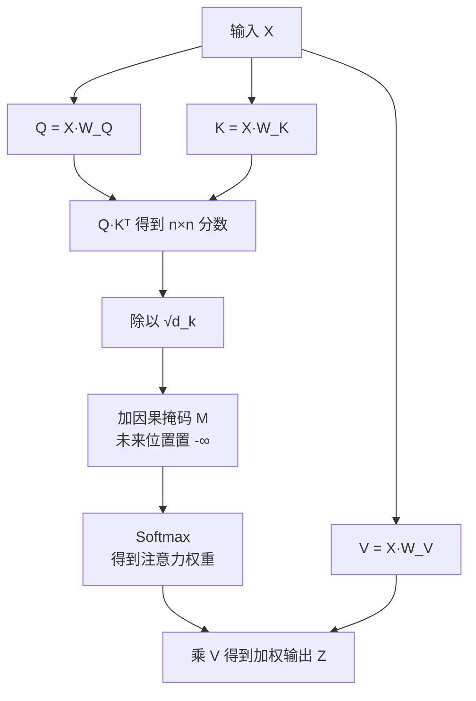
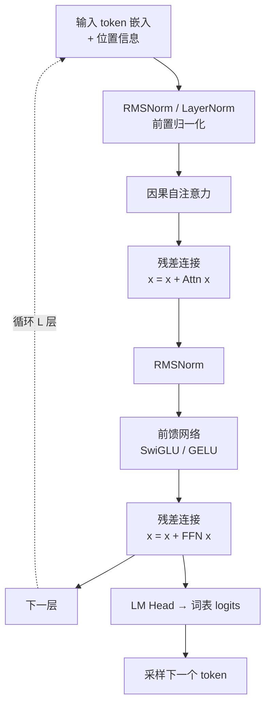
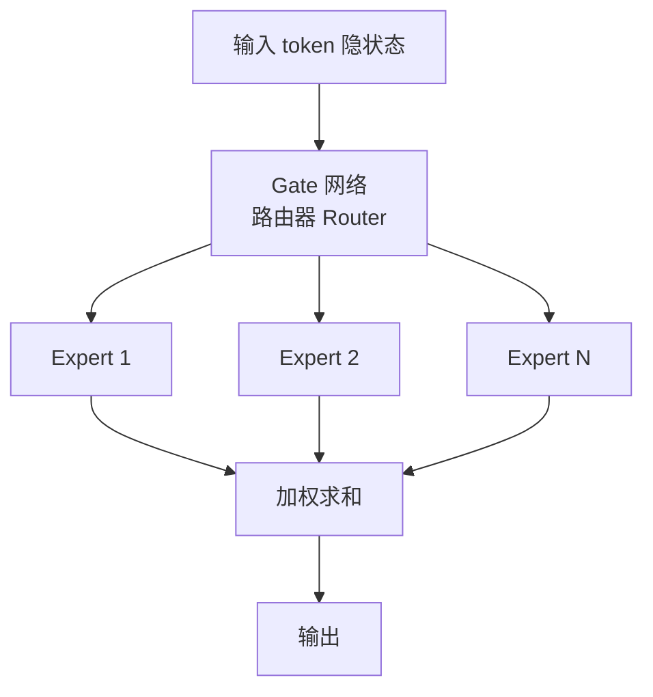
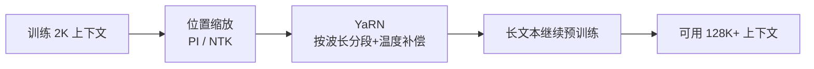

# [[LLM-基础]]

> [!tip] 学习目标
> 能从数学公式讲清自注意力到多头注意力，理解位置编码为什么必须存在，算得清 KV-Cache 占用，能解释主流开源模型（LLaMA 3 / Qwen 2.5）在架构上到底改了什么。

---

## 🎯 难度分段学习路径

| 难度 | 核心关注 | 预估时长 |
|---|---|---|
| **入门** | Tokenizer、位置编码、自注意力、多头注意力的机制与公式 | 12h |
| **进阶** | RoPE、GQA/MQA、MoE、KV-Cache 显存计算、上下文窗口 | 16h |
| **高级** | 主流模型架构对比、长上下文外推技术、LLM 安全攻防 | 12h |

**总学时**：40h ｜ **前置知识**：`[[Prompt-Engineering]]` 可并行；线性代数与概率基础

---

## 📖 第一章 入门（Beginner）

### 1.1 从文本到 Token：Tokenizer 与分词

**知识点详解**

大模型不认识字符串，只处理 **Token（词元）**。Tokenizer 的职责是把文本切成 Token、映射到整数 ID，以及反向还原。

| 方法 | 做法 | 例子 | 问题 |
|---|---|---|---|
| 字符级 | 每个字符一个 token | `中` `文` | 序列太长 |
| 词级 | 按词典切分 | `自然` `语言` | 生僻词/新词无法覆盖，词表爆炸 |
| **BPE**（Byte Pair Encoding） | ==从字节开始，反复合并最高频的相邻对== | 英文按词、中文常按字 | 无空格语言原本不适合，改用 byte 级 BPE 后可覆盖任意字节 |
| SentencePiece | BPE 的工程化实现 | — | 用「▁」表示词首空格，不依赖预分词 |
| WordPiece | 按似然合并子词 | `un` `##play` | BERT 系使用 |

| 概念 | 说明 |
|---|---|
| 词表（vocab） | Token → ID 的映射表；常见 32K-152K |
| 特殊 token | `<pad>` 填充、`<unk>` 未知、`<bos>`/`<eos>` 起止、`<|im_start|>` 对话模板 |
| `unk` 比例 | ==衡量一个 tokenizer 对你业务语言的适配度==；中文场景若 `<unk>` 频出，说明词表不合适 |

> [!tip] 为什么中文「一个字≈一个 token」不是绝对的
> 因为 byte 级 BPE 遇到汉字（UTF-8 占 3 字节）会先按字节兜底，再视词频决定是否合并成字/词。==同一个模型对「英文」和「中文」的 token 效率可能差 2-3 倍==，直接影响成本与上下文预算。

```python
import tiktoken
enc = tiktoken.get_encoding("cl100k_base")   # OpenAI 用的编码之一
text = "Agent 开发需要理解 Transformer 架构"
ids = enc.encode(text)
print(len(ids), ids[:10])          # token 数与 ID
print(enc.decode(ids))             # 还原
# 同一段文本，中英文 token 数差别很大
print(len(enc.encode("hello world")), len(enc.encode("你好世界")))
```

**填空题**

1. BPE 的全称是 ______，它的核心思路是从字节开始反复合并 ______ 的相邻对。
2. SentencePiece 用符号 `▁` 表示 ______。
3. 衡量 tokenizer 对业务语言适配度的关键指标是 ______ 的出现频率。
4. 中文使用 byte 级 BPE 的好处是能覆盖 ______ 字节组成的任意字符。

**答案**：
1. Byte Pair Encoding，最高频
2. 词首空格
3. `<unk>`（未知 token）
4. UTF-8（任意多字节）

---

### 1.2 位置编码：为什么注意力需要「位置」

**知识点详解**

**自注意力本身是置换等变的** —— 打乱输入顺序，输出只是跟着同样打乱，模型无法感知词序。必须额外注入位置信息。

| 方法 | 机制 | 代表模型 | 特点 |
|---|---|---|---|
| **正弦位置编码**（原始 Transformer） | $PE_{(pos,2i)}=\sin\left(pos/10000^{2i/d_{model}}\right)$，奇偶维用 sin/cos | Transformer (2017) | ==无参数、理论上可外推==，但实测外推差 |
| 可学习绝对位置嵌入 | 像词嵌入一样查表 | BERT、GPT-2 | 位置数固定，超出即失效 |
| **RoPE**（旋转位置编码） | ==把位置信息以「旋转」方式注入 Q/K 维空间== | LLaMA、Qwen、几乎所有现代开源模型 | 相对位置性质好，配合插值可外推 |
| ALiBi | 在注意力分数上加线性偏置 | 部分长文本模型 | 实现极简 |

RoPE 的核心思想：对位置 $m$ 的 query 和 key 向量，按维度对施加旋转矩阵

$$
\begin{pmatrix} q^{(1)}_m \\ q^{(2)}_m \end{pmatrix}
=
\begin{pmatrix} \cos(m\theta) & -\sin(m\theta) \\ \sin(m\theta) & \cos(m\theta) \end{pmatrix}
\begin{pmatrix} q^{(1)}_0 \\ q^{(2)}_0 \end{pmatrix}
$$

> [!tip] 关键理解
> ==RoPE 的巧妙之处在于：旋转后的 $q_m \cdot k_n$ 只依赖 $m-n$（相对距离）==。这既保留了相对位置信息，又让「位置」变成可插值的连续量 —— 后续 YaRN / NTK 插值就是在这个基础上把旋转频率拉低来实现长上下文外推。

| 为什么不能直接学位置 | 原因 |
|---|---|
| 长度写死 | 训练时 2048，推理 8192 完全没见过 |
| 外推崩溃 | 注意力对超出范围的嵌入产生垃圾权重 |
| 解法 | RoPE 插值 / YaRN / 分段缩放，见 3.2 |

**填空题**

1. 自注意力对词序是 ______ 的（置换等变/置换不变），所以必须额外注入位置信息。
2. 原始 Transformer 使用的位置编码是 ______ 位置编码。
3. 现代开源模型（LLaMA、Qwen）普遍采用的旋转式位置编码简称是 ______。
4. RoPE 注入后，注意力分数只依赖 query 与 key 的 ______（绝对位置差/内容）。

**答案**：
1. 置换等变
2. 正弦（Sinusoidal）
3. RoPE
4. 相对位置差 $m-n$

---

### 1.3 自注意力：从公式到直觉

**知识点详解**

给定输入 $X \in \mathbb{R}^{n \times d_{model}}$，经三个可学习投影得到：

$$Q = XW^Q, \quad K = XW^K, \quad V = XW^V$$

缩放点积注意力：

$$
\text{Attention}(Q,K,V) = \text{softmax}\left(\frac{QK^T}{\sqrt{d_k}} + M\right)V
$$

| 符号 | 含义 | 直觉 |
|---|---|---|
| $Q$（Query） | 我在找什么 | 「当前词需要什么信息」 |
| $K$（Key） | 我能提供什么 | 「每个词的标签」 |
| $V$（Value） | 我提供的内容 | 「真正被取走的信息」 |
| $QK^T$ | 匹配分数矩阵 $n\times n$ | 每对词的相关度 |
| $\sqrt{d_k}$ | ==缩放因子== | 见下 |
| $M$ | 因果掩码 | 屏蔽未来位置 |
| $Z = AV$ | 加权求和 | ==不是把原 $V$ 取回来，而是按注意力重新组合== |

> [!danger] 为什么必须除以 $\sqrt{d_k}$
> 当 $d_k$ 很大时，点积的方差随维度线性增长。==不缩放的话 softmax 输入过大会饱和，梯度趋近 0，训练直接停滞==。$\sqrt{d_k}$ 把方差拉回 1 附近。

> [!danger] Causal Mask：自回归模型的根基
> 预测第 $t$ 个 token 时**绝不能看到 $t+1$ 之后的内容**，否则等于偷看答案。掩码 $M$ 把未来位置设为 $-\infty$（softmax 后权重为 0）。
> ==训练时因为整段序列已知，可以「一次算完所有位置」并并行计算，这是 Transformer 能高效训练的根本原因。==



**填空题**

1. 缩放点积注意力公式中，Q、K、V 分别由输入乘以三个可学习矩阵得到，记作 $Q=XW^Q$、$K=__$______、$V=XW^V$。
2. 公式里除以 $\sqrt{d_k}$ 的目的是防止 softmax 饱和导致 ______ 消失。
3. 自回归模型的因果掩码 $M$ 的作用是屏蔽 ______ 位置的 token。
4. 注意力输出 $Z=AV$ 里的 $A$ 是 softmax 之后的 ______（注意力权重/原始输入）。

**答案**：
1. $K = XW^K$
2. 梯度
3. 当前位置之后（未来）
4. 注意力权重

---

### 1.4 多头注意力：为什么要「多头」

**知识点详解**

单头注意力的问题：一次 softmax 只能得到**一种**注意力分布。语言里的关系是多种并存的 —— 语法依赖、指代关系、语义相似。

$$
\text{MultiHead}(Q,K,V) = \text{Concat}(\text{head}_1,\dots,\text{head}_h)W^O
$$
$$
\text{where } \text{head}_i = \text{Attention}(QW_i^Q, KW_i^K, VW_i^V)
$$

| 关键点 | 说明 |
|---|---|
| 参数不增加 | ==每个头维度 $d_k = d_{model}/h$，总参数量与单头一致== |
| 真正「多头」在哪 | ==不在第一步矩阵乘，而在于每个头独立做 $QK$ 匹配、掩码、softmax、汇总== |
| 观察方法 | 可视化注意力矩阵，不同头会分工：有的盯句法、有的盯邻近词、有的盯标点 |

| 变体 | Q 头 | KV 头 | KV-Cache | 代表 |
|---|---|---|---|---|
| MHA | h | h | 1.0× | 原始 Transformer、GPT-2 |
| MQA | h | **1** | ==最少== | PaLM、Falcon |
| **GQA** | h | h/g（组内共享） | 中等 | ==LLaMA 3、Qwen 2.5 主流选择== |
| MLA | h | 低秩压缩 | ==最省== | DeepSeek-V2/V3 |

**填空题**

1. 多头注意力相比单头，`$d_k$` 通常设为 `$d_{model}$` 除以 ______（头数）。
2. 多头注意力的==总参数量==与单头相比基本 ______（不变/翻倍）。
3. 「多头」的差异真正体现在每个头独立进行 `$QK$` 匹配、掩码和 ______。
4. 让多个 Query 头共享少量 KV 头以压缩 KV-Cache 的技术简称是 ______。

**答案**：
1. 头数 $h$
2. 不变
3. Softmax 与 Value 汇总
4. GQA（Grouped-Query Attention；极端情况 MQA）

---

### 1.5 完整 Transformer Block 与 Decoder-only 范式

**知识点详解**



| 组件 | 原始 Transformer | 现代开源模型（LLaMA 3 / Qwen 2.5） |
|---|---|---|
| 归一化 | Post-LayerNorm | ==**RMSNorm**（前置，去掉均值中心化，省算力更稳）== |
| FFN 激活 | GELU（两层 MLP） | ==**SwiGLU**（门控）== |
| 注意力 | MHA | GQA |
| 位置 | 正弦编码 | RoPE |
| 结构 | Encoder-Decoder | ==**Decoder-only**== |

> [!tip] 为什么现在是 Decoder-only
> ==因果掩码让每个位置都能看到前文，天然适合「续写」；Encoder-Decoder 需要额外的 cross-attention 与两份参数==。GPT、LLaMA、Qwen、Gemma 全部是 Decoder-only，自回归逐 token 生成。

| 结构类型 | 代表 | 现状 |
|---|---|---|
| Encoder-only | BERT | 理解类任务（分类、抽取） |
| Encoder-Decoder | T5、原始 Transformer | 翻译、摘要 |
| **Decoder-only** | GPT / LLaMA / Qwen | ==绝对主流==，通用生成 |

**填空题**

1. 原始 Transformer 的归一化是前置还是后置？现代开源模型普遍改为 ______ 归一化。
2. 现代模型 FFN 常用的门控激活函数是 ______。
3. 目前占绝对主流的 Transformer 结构是 ______-only。
4. RMSNorm 相比 LayerNorm 省略了 ______ 这一步操作。

**答案**：
1. 前置（RMSNorm，Pre-Norm）
2. SwiGLU
3. Decoder
4. 均值中心化（只做均方根缩放）

---

### 1.6 第一章综合练习

**填空题（本章共 4 道，答案见下方）**

1. BPE 从 ______ 开始反复合并最高频的相邻对。
2. 自注意力需要额外注入位置信息，因为它对词序是 ______ 的。
3. 缩放点积注意力除以 `$\sqrt{d_k}$` 是为了防止 softmax 饱和导致 ______ 消失。
4. 现代开源模型普遍采用的旋转位置编码简称是 ______。

**本章答案**：
1. 字节（byte）
2. 置换等变
3. 梯度
4. RoPE

**综合项目**：用 `tiktoken` 写一个脚本，对比中/英/代码三种文本的 token 效率，并算出一段 8K 上下文的对话里，系统提示、历史消息、当前问题各占多少 token。

> [!tip] 常见陷阱
> 1. **以为「一个汉字 = 一个 token」**：实际取决于词表构成，务必自己用 `tiktoken` 实测。
> 2. **忘了因果掩码的作用**：把自回归模型当双向模型理解，会得出「为什么不能偷看答案」这种困惑。
> 3. **把多头理解成「参数更多」**：头数增加但每头维度减小，总参数量不变。
> 4. **分不清 Encoder-Decoder 与 Decoder-only**：现在几乎全是后者，遇到「为什么不用 BERT 结构做生成」要能回答。

---

## 📖 第二章 进阶（Intermediate）

### 2.1 训练与推理的两个阶段：Prefill 与 Decode

**知识点详解**

| 阶段 | 已知什么 | 计算方式 | 特点 |
|---|---|---|---|
| **训练** | 输入与目标序列**都已知** | ==因果掩码下并行计算所有位置== | 快，但显存峰值高 |
| **Prefill（预填充）** | 整段 Prompt 已知 | 并行处理所有 Prompt 位置 | ==决定 TTFT（首字延迟）==，算力密集 |
| **Decode（解码）** | 只有已生成前缀 | ==生成步之间串行==，每步一个新 token | ==决定 TPOT（每 token 延迟）==，显存带宽密集 |

> [!danger] 「KV-Cache 让计算从 $O(n^2)$ 变 $O(n)$」是有限度的说法
> ==它只把「单个 Decode 步的注意力工作量」从 $O(n^2)$ 降到 $O(n)$==。生成整段长度增长的输出时，每一步仍要读取更长的 KV，**累计注意力工作量仍随输出长度呈二次增长**。KV-Cache 是拿显存容量和带宽换掉了大量重复计算，并没有让长上下文变成常数成本。

| 阶段 | 主要瓶颈 | 优化手段 |
|---|---|---|
| Prefill | 算力（Compute-bound） | ==连续批处理（Continuous Batching）==、Chunked Prefill |
| Decode | 显存带宽（Memory-bound） | GQA/MQA、KV 量化、PagedAttention、PD 分离 |

**填空题**

1. 处理整段 Prompt、并行计算所有位置的阶段叫 ______（Prefill/Decode）。
2. Prefill 阶段主要决定的首字延迟指标英文缩写是 ______。
3. Decode 阶段的主要瓶颈是显存 ______（带宽/容量）。
4. 「KV-Cache 把 $O(n^2)$ 降为 $O(n)$」这个说法只对 ______ 个 Decode 步的注意力计算成立。

**答案**：
1. Prefill
2. TTFT
3. 带宽
4. 单

---

### 2.2 KV-Cache：算得清才部署得下

**知识点详解**

**KV-Cache 缓存的是什么**：每一层历史 token 经过该层投影后的 **K 和 V**。它**不**保存模型权重、历史 Q、注意力权重或答案。

$$
\text{KV-Cache 大小} = 2 \times L \times B \times H_{kv} \times T \times d_h \times \text{bytes}
$$

| 符号 | 含义 |
|---|---|
| $L$ | 层数 |
| $2$ | K 和 V 各一份 |
| $B$ | batch size |
| $H_{kv}$ | ==**KV 头数**（GQA 下远小于 Q 头数）== |
| $T$ | 已处理序列长度 |
| $d_h$ | 头维度 |

```python
# 单 token 的 KV-Cache 字节数与总占用
def kv_cache_bytes(num_layers, num_kv_heads, head_dim, seq_len,
                   batch=1, dtype_bytes=2):   # FP16/BF16 = 2
    per_token = num_layers * 2 * num_kv_heads * head_dim * dtype_bytes
    return per_token * seq_len * batch

# Llama-3-8B：32 层 / 32 个 Q 头 / 8 个 KV 头（GQA）/ head_dim 128
cfg = dict(num_layers=32, num_kv_heads=8, head_dim=128)
for seq in (1024, 4096, 8192, 32768):
    gb = kv_cache_bytes(seq_len=seq, **cfg) / 1024**3
    print(f"{seq:>6} tokens -> {gb:.2f} GB")
```

| 结论 | 说明 |
|---|---|
| ==线性增长== | 序列长度翻倍，KV-Cache 翻倍 |
| ==GQA 的价值== | LLaMA 3 8B 用 8 个 KV 头而非 32 个，KV-Cache 减少到 ==1/4== |
| ==大上下文是显存大户== | 长上下文 + 高并发时，KV-Cache 常比模型权重更占显存 |

| 技术 | 层级 | 解决什么 | 不解决什么 |
|---|---|---|---|
| KV Cache | 模型计算 | 避免 Decode 重算历史 K/V | ==不减少历史 KV 的读取长度== |
| GQA / MQA / MLA | 模型结构 | 减少 KV 体积 | 可能损失精度 |
| FlashAttention | 内核优化 | 降低显存访问、加速 | 不改变复杂度 |
| PagedAttention（vLLM） | 内存管理 | ==降低碎片、提高利用率== | 不判断业务前缀是否值得保留 |
| Prefix Caching | 缓存策略 | ==跳过重复前缀的 Prefill== | ==不加速新 token 的 Decode== |
| KV 量化 | 精度压缩 | 减少存储 | 损失精度 |

> [!tip] Prefix Caching 的判定标准
> ==缓存命中的前提是 token 前缀「完全相同」==，而不是「语义相似」。因为影响隐状态的条件必须一致：token、顺序、位置、模型权重、LoRA/Adapter、多模态输入。
> 典型收益场景：固定长 System Prompt、few-shot 示例、共享文档前缀。==它缩短 TTFT，不会让生成本身变快。==

**填空题**

1. KV-Cache 大小与序列长度成 ______（线性/平方）关系。
2. KV-Cache 公式中的 $H_{kv}$ 指的是 ______ 头数（Q 头 / KV 头）。
3. GQA 让 KV-Cache 减少的根本原因是减少了 ______ 的数量。
4. Prefix Caching 命中要求 token 前缀 ______（完全相同 / 语义相似）。

**答案**：
1. 线性
2. KV 头
3. KV 头
4. 完全相同

---

### 2.3 KV-Cache 显存管理：传统方案为何浪费

**知识点详解**

| 方案 | 做法 | 问题 |
|---|---|---|
| **预分配** | 启动时为每个请求预留 `max_seq_len` 空间 | ==短请求浪费巨大，简单分类任务可能浪费 95%+== |
| 按需连续分配 | 用到多少给多少 | 外部碎片 + 内部碎片 |

vLLM 的 **PagedAttention** 借鉴操作系统**分页虚拟内存**：把 KV-Cache 切成固定大小的 block，用页表映射物理位置，==彻底消除碎片==。

> [!tip] 类比帮助记忆
> 传统 KV-Cache 管理 ≈ 操作系统早期的**固定分区分配**；PagedAttention ≈ 引入**分页虚拟内存**。

| 维度 | 传统方案 | PagedAttention |
|---|---|---|
| 显存利用率 | 50-65% | ==接近 100%== |
| 最大并发 | 受 `max_seq_len × batch_size` 限制 | 动态利用空闲显存 |
| 短请求 | 严重浪费 | 按实际块计费 |

**填空题**

1. 按 `max_seq_len` 预分配 KV-Cache 的主要问题是 ______（短请求严重浪费 / 计算太慢）。
2. vLLM 的 PagedAttention 借鉴了操作系统的 ______ 机制。
3. PagedAttention 的核心作用是消除 ______，提高显存利用率。

**答案**：
1. 短请求严重浪费
2. 分页虚拟内存
3. 内存碎片

---

### 2.4 稀疏激活与 MoE：混合专家

**知识点详解**

**核心洞察**：MoE 保持总参数量巨大，但==每个 token 只激活一小部分参数==，从而在控制推理算力的同时提升容量。



| 概念 | 说明 |
|---|---|
| Expert | 一个 FFN 模块；MoE 把 FFN 替换为 N 个并行 FFN |
| Router / Gate | 决定每个 token 去哪些专家（通常选 top-k，k 常为 2-8） |
| **稀疏激活** | ==参数总量 ≠ 每 token 参与计算的量==；这是 MoE「便宜」的根源 |
| Load Balancing | ==训练难题==：路由器容易塌缩到少数专家，需辅助损失强制均衡 |
| 显存 vs 算力 | ==MoE 显存需求按总参数算，推理算力按激活参数算== —— 这对部署影响极大 |

| 对比 | 稠密模型 | MoE |
|---|---|---|
| 参数量 | N | N（甚至更大） |
| 每 token 激活 | 全部 | ==一小部分== |
| 推理算力 | 高 | 较低 |
| **显存** | 较低 | ==高（全部专家都要装）== |
| 训练难度 | 简单 | ==需解决负载均衡== |

> [!danger] 「MoE 更省显存」是常见误解
> ==MoE 省的是推理算力，不是显存==。所有专家权重都得放进显存。==你只有一张 24GB 卡时，装得下 70B 稠密模型不代表装得下同等激活量的 MoE。==

**填空题**

1. MoE 中决定 token 去哪些专家的组件叫 ______（Router/Gate）。
2. MoE 稀疏激活的含义是每个 token 只使用全部参数中的 ______。
3. MoE 训练时的经典难题是 ______ 塌缩。
4. MoE 相比同等参数量的稠密模型，主要节省的是推理 ______（算力/显存）。

**答案**：
1. Router（门控网络）
2. 一小部分
3. 负载均衡（专家）
4. 算力

---

### 2.5 上下文窗口：能装下 ≠ 能用好

**知识点详解**

| 概念 | 说明 |
|---|---|
| **上下文窗口** | 模型单次能处理的 token 上限（训练时长度 + 外推能力决定） |
| ==标称 vs 有效== | ==官方标称 128K，不代表 128K 都能被有效利用== |
| **大海捞针（Needle in a Haystack）** | 在长文本中埋入一个信息，测模型能否准确取回；衡量有效上下文 |
| Lost in the Middle | ==信息在上下文中部时召回率明显下降，首尾更容易被用到== |
| 滑动窗口注意力 | 局部层只看邻近窗口 + 周期性全局层（Gemma 3 采用 5:1 模式） |

> [!danger] 最常见的工程误判
> ==「模型支持 128K，所以我能把 128K 丢进去」== —— 实际上：成本按 token 线性上涨、KV-Cache 显存爆炸、关键信息可能被「淹没在中段」。生产中更可靠的做法是：检索压缩 + 分层喂入，而不是硬塞。

| 指标 | 含义 |
|---|---|
| TTFT | Time To First Token，首字延迟 |
| TPOT / ITL | Time Per Output Token，每 token 延迟 |
| 吞吐量 | tokens/s（注意区分单请求速度与并发总吞吐） |

**填空题**

1. 官方标称的上下文长度与模型能有效利用的长度往往不等，这种现象在评测中常用 ______（大海捞针）类任务衡量。
2. 「关键信息放在上下文中部时召回率下降」的现象英文叫 ______。
3. TTFT 衡量的是 ______（首 token 延迟 / 每 token 延迟）。
4. 相比硬塞长上下文，更可靠的工程做法是检索压缩与 ______。

**答案**：
1. 大海捞针（Needle in a Haystack）
2. Lost in the Middle
3. 首 token 延迟
4. 分层喂入

---

### 2.6 第二章综合练习

**填空题（本章共 4 道，答案见下方）**

1. 处理整段 Prompt 并行计算的阶段叫 ______。
2. KV-Cache 大小与序列长度成 ______ 关系。
3. MoE 主要节省的是推理 ______（算力/显存）。
4. Prefix Caching 缩短的是 ______（TTFT / 每 token 延迟）。

**本章答案**：
1. Prefill
2. 线性
3. 算力
4. TTFT

**综合项目**：用上面的公式算出 Llama-3-8B 在 4K / 32K 上下文、batch=8 时的 KV-Cache 占用，并回答：你的显存里，KV-Cache 会占多少比例？

> [!tip] 常见陷阱
> 1. **把 KV-Cache 当成省显存的东西**：它是拿显存换算力，显存压力主要来自它。
> 2. **以为 MoE 更轻量**：MoE 的显存需求按总参数算，很重。
> 3. **混淆 TTFT 与 TPOT**：优化 Prefill 和优化 Decode 是两套不同手段。
> 4. **迷信标称上下文**：长上下文的有效召回率远低于标称值。

---

## 📖 第三章 高级（Advanced）

### 3.1 主流开源模型架构对比

**知识点详解**

> [!tip] 关键前提
> GPT、Llama、Qwen、Gemma 都是 ==**Decoder-only 自回归 Transformer** 的近亲==，结构上是「因果自注意力 + 前馈层 + 残差」的循环。差异集中在几个组件的选型上，==而不是「谁用了完全不同的架构」==。

| 代表设计 | 归一化 | 位置信息 | 注意力 | FFN | 参数量布局 |
|---|---|---|---|---|---|
| GPT-2/3 风格 | LayerNorm | 可学习绝对嵌入 | 多头注意力 | GELU MLP | 稠密 |
| **LLaMA 3** | RMSNorm | RoPE | **GQA** | SwiGLU | 稠密 |
| **Qwen 2.5** | RMSNorm | RoPE | GQA（配 QK-Norm） | SwiGLU | 稠密 + MoE 变体 |
| **Gemma 3** | RMSNorm（多处） | RoPE | GQA（局部/全局分层） | GeGLU | 稠密 + MoE 变体 |

| 组件 | 改了什么 | 为什么 |
|---|---|---|
| RMSNorm | LayerNorm → 只做均方根缩放 | ==省掉均值中心化，更快更稳== |
| RoPE | 绝对嵌入 → 旋转编码 | 相对位置性质好，可插值外推 |
| GQA | MHA → KV 头数减少 | ==直接压 KV-Cache== |
| SwiGLU | GELU MLP → 门控 | 表达力更强，参数效率略高 |

> [!danger] 常见误读
> 「base / instruct / coder / reasoning」这些标签描述的是**训练方式与预期用途**，==不是 Transformer 块的结构特征==。不要拿它们当架构差异来比较。

**填空题**

1. LLaMA 3 相比 GPT-2 风格，在归一化上改用 ______，在位置编码上改用 ______。
2. LLaMA 3 采用的注意力变体是 ______，作用是压缩 KV-Cache。
3. Qwen 2.5 的 FFN 激活函数是 ______。
4. `base` / `instruct` / `coder` 这类标签描述的是 ______，不是架构结构。

**答案**：
1. RMSNorm，RoPE
2. GQA（Grouped-Query Attention）
3. SwiGLU
4. 训练方式与预期用途

---

### 3.2 长上下文外推：RoPE 的延伸

**知识点详解**

RoPE 天然适合外推，但直接外推时**高频维度旋转过快**，注意力分布失真。解法都在「拉低旋转频率」上做文章。

| 方法 | 做法 | 代表 |
|---|---|---|
| 线性插值（PI） | 把位置坐标按比例缩小 | LLaMA 2 的早期方案 |
| **NTK-aware 缩放** | ==按频率分段调整，高频多缩、低频少缩== | 社区常用 |
| **YaRN** | ==按波长分段 + 注意力温度补偿==，兼顾短文本性能 | Qwen 2.5 采用 |
| 分段缩放 | 前后段不同缩放比例 | 多种实现 |
| 继续预训练 | 在长文本上继续训练 | 最「笨」但最稳 |



| 方法 | 支持上下文 | 外推性能 | 代价 |
|---|---|---|---|
| 原始 RoPE | 2K-8K | 差 | — |
| 线性插值 | 16K-32K | 中 | 短文本性能略降 |
| YaRN | 128K+ | 较好 | 实现复杂 |

> [!tip] 选型建议
> ==要开箱即用就选已经做过长文本训练的模型（Qwen 2.5 / DeepSeek 等），别自己从短上下文模型硬外推==。真要自己扩，优先 YaRN + 少量长文本继续预训练的组合。

**填空题**

1. RoPE 直接外推失败的主要原因是 ______ 维度旋转过快。
2. Qwen 2.5 用于长上下文外推的技术是 ______。
3. YaRN 相比线性插值的优势是同时做了按波长分段与注意力 ______ 补偿。
4. 最省事的上下文扩展方式是直接选用已做过长文本 ______ 的模型。

**答案**：
1. 高频
2. YaRN
3. 温度
4. 训练

---

### 3.3 MLA：DeepSeek 的 KV 压缩路线

**知识点详解**

即使有了 GQA，百万级 token 上下文下 KV-Cache 仍过大。**MLA（Multi-Head Latent Attention）** 用低秩矩阵把 K/V 压成隐表示，推理时再还原。

$$
K_{compressed} = W_{DK} \cdot K, \quad V_{compressed} = W_{DV} \cdot V
$$

| 特点 | 说明 |
|---|---|
| 压缩率 | ==显著高于 GQA==，是 DeepSeek-V2/V3 的关键技术 |
| 核心技术 | ==**Absorb 操作**：把上投影吸收进下投影，推理时不需要真的解压== |
| 解耦 RoPE | ==额外的位置维度单独承载 RoPE，避免 Absorb 被位置编码阻断== |
| 代价 | 实现复杂度高，需要框架层适配（vLLM / SGLang 有支持） |

> [!tip] 演进路线一句话记住
> ==MHA（KV 全量）→ MQA（1 个 KV 头）→ GQA（分组共享）→ MLA（低秩压缩）==，每一步都在压 KV-Cache，代价是实现复杂度与可能的能力损失。

**填空题**

1. MLA 的全称是 ______，它的目标是压缩 KV-Cache。
2. MLA 中让压缩后的隐表示不必真正解压就能参与计算的技术叫 ______ 操作。
3. Attention 变体的演进顺序是 MHA → ______ → GQA → MLA。

**答案**：
1. Multi-Head Latent Attention
2. Absorb
3. MQA

---

### 3.4 LLM 安全攻防

**知识点详解**

LLM 应用的安全问题与 Web 安全是**两套模型**：模型本身无法「被修好」，只能在应用层约束。

| 风险 | 原理 | 后果 | 防御 |
|---|---|---|---|
| **Prompt 注入** | ==用户输入被当作指令执行== | 绕过权限、泄露系统提示 | 输入输出双向隔离、工具白名单、权限不下放给模型 |
| 间接注入 | ==恶意指令藏在模型读取的内容里==（网页、文档、邮件） | RAG 场景下尤其危险 | 对检索内容做信任分级、工具调用需二次确认 |
| 敏感信息泄露 | 训练数据/系统提示被套出 | 隐私与合规事故 | 输出过滤、最小化系统提示敏感度 |
| 越权工具调用 | 模型调用了不该调用的工具 | 删数据、转账、发消息 | ==工具层独立鉴权，不信任模型的身份判断== |
| 不安全输出处理 | 把模型输出直接当 SQL/HTML 执行 | 注入、XSS | 输出侧转义与白名单 |
| 过度代理 | 给了模型过大的自主权 | 错误被放大 | 限制步数、人工确认关键动作 |

> [!danger] 最重要的一条原则
> ==永远不要把「鉴权」寄托在模型的判断上==。模型可能被注入、可能幻觉、可能误解。**工具调用必须在服务端独立鉴权**，模型只负责提出请求，不负责获得授权。

> [!tip] 系统提示的地位
> 系统提示是**软约束**，不是安全边界。==它可以被诱导泄露，也可以被绕过==。任何真正需要保护的东西，必须在模型之外（服务端权限、数据库约束、网络隔离）实现。

**填空题**

1. 用户输入被模型当作指令执行的风险叫 ______。
2. 恶意指令隐藏在模型读取的网页或文档中，称为 ______ 注入。
3. 工具调用时，鉴权应该由 ______ 独立完成，而不是由模型判断。
4. 系统提示属于软约束，真正需要保护的资源必须在 ______ 实现保护。

**答案**：
1. Prompt 注入
2. 间接
3. 服务端
4. 模型之外

---

### 3.5 第三章综合练习

**填空题（本章共 4 道，答案见下方）**

1. LLaMA 3 采用的注意力变体是 ______，FFN 激活是 ______。
2. 用于长上下文外推、按波长分段并做温度补偿的技术是 ______。
3. MLA 允许压缩表示不真正解压就参与计算，靠的是 ______ 操作。
4. LLM 应用中鉴权必须由 ______ 独立完成，模型只负责提出请求。

**本章答案**：
1. GQA，SwiGLU
2. YaRN
3. Absorb
4. 服务端（工具层）

**综合项目**：拿一个你写的 Agent，找出其中所有「信任模型判断」的地方，逐条改成服务端强制鉴权，并列出系统提示中哪些内容其实不该明文出现。

> [!tip] 常见陷阱
> 1. **把系统提示当安全边界**：它是软约束，会被注入、会被套话。
> 2. **以为长上下文等于强记忆**：标称长度 ≠ 有效召回。
> 3. **忽视间接注入**：RAG 读到的网页里可能藏着攻击指令。
> 4. **把 base/instruct 当架构差异**：那是训练方式，不是结构。

---

## ⚡ 速查表

| 概念 | 一句话 |
|---|---|
| 自注意力 | $Q=XW^Q$、$K=XW^K$、$V=XW^V$；`softmax(QKᵀ/√d_k + M)V` |
| 除以 √d_k | 防止点积过大导致 softmax 饱和、梯度消失 |
| 因果掩码 M | 屏蔽未来位置；训练能并行全靠它 |
| 多头 | 头维度 = d_model/h，**总参数不变**，差异在独立 softmax |
| RoPE | 旋转注入位置；`q_m·k_n` 只依赖 `m-n`，故可插值 |
| RMSNorm | 去掉均值中心化的 LayerNorm，前置使用 |
| GQA | Q 头多、KV 头少，KV-Cache 降为 1/g |
| KV-Cache | 缓存历史 K/V；**显存**随序列长度线性增长 |
| KV 公式 | `2 × L × B × H_kv × T × d_h × bytes` |
| PagedAttention | 借分页虚拟内存，消除碎片 |
| Prefix Caching | 前缀**完全相同**才命中，缩短 TTFT |
| MoE | 每 token 只激活少量参数；**省算力不省显存** |
| TTFT / TPOT | 首字延迟 / 每 token 延迟 |
| Lost in the Middle | 上下文中段的信息召回率更低 |
| YaRN | 长上下文外推：波长分段 + 温度补偿 |
| MLA | DeepSeek 的低秩 KV 压缩 + Absorb 操作 |
| 演进路线 | MHA → MQA → GQA → MLA（都在压 KV-Cache） |
| 安全铁律 | **鉴权在服务端，系统提示不是安全边界** |

## ❓ 常见问题

> [!faq]- Q：为什么注意力要除以 $\sqrt{d_k}$，不除会怎样？
> A：$d_k$ 大时点积方差随维度线性增长，softmax 输入过大会饱和，梯度趋近 0，训练停滞。$\sqrt{d_k}$ 把方差拉回 1 附近。

> [!faq]- Q：KV-Cache 到底省了时间还是省了空间？
> A：==两者都没省，它是拿显存换算力==。省掉的是重复计算，代价是显存占用与带宽压力。所以长上下文、高并发场景下，KV-Cache 才是真正的瓶颈。

> [!faq]- Q：模型标称 128K 上下文，我就能塞 128K 进去吗？
> A：不能这么假设。成本线性上涨、KV-Cache 显存爆炸、关键信息在中部召回率下降。==可靠做法是检索压缩 + 分层喂入，并用大海捞针类任务自己验证有效长度==。

> [!faq]- Q：MoE 模型是不是更「轻量」，适合我部署？
> A：正好相反。==MoE 的显存需求按总参数计算，推理算力才按激活参数算==。显存有限时，MoE 往往比同参数量的稠密模型更难装下。

> [!faq]- Q：系统提示写了「不要泄露 XX」，还需要别的防护吗？
> A：需要。==系统提示是软约束，可被提示注入绕过==。真正的防护要在模型之外：服务端鉴权、输出过滤、最小化提示中的敏感内容。

> [!faq]- Q：GQA 减少了 KV 头，会不会损失精度？
> A：会有影响，但实践中可通过增加 Q 头数补偿。==GQA 是在「精度」与「KV-Cache 体积」之间的显式取舍==，现代模型普遍接受这个方向，MLA 则是更激进的版本。

---

> [!note] 权威资料（链接均于 2026-09-25 逐条核验 HTTP 200）
> **原始论文**
> - [Attention Is All You Need](https://arxiv.org/abs/1706.03762) — Transformer 架构、缩放点积注意力、多头、正弦位置编码
> - [Root Mean Square Layer Normalization（RMSNorm）](https://arxiv.org/abs/1910.07467) — RMSNorm 原始论文
> - [GQA: Training Generalized Multi-Query Transformer Models from Multi-Head Checkpoints](https://arxiv.org/abs/2305.13245) — GQA 原始论文
> - [RoFormer: 旋转位置编码](https://arxiv.org/abs/2104.09864) — RoPE
> - [FlashAttention](https://arxiv.org/abs/2205.14135) — 显存访问优化
> - [LLaMA 系列](https://arxiv.org/abs/2407.21783) / [Qwen2.5 技术报告](https://arxiv.org/abs/2412.15115) — 主流开源模型
> - [DeepSeek-V2（MLA）](https://arxiv.org/abs/2405.04434) / [DeepSeek-V3](https://arxiv.org/abs/2412.19437) — MLA 与 MoE
> - [YaRN 长上下文外推](https://arxiv.org/abs/2309.00071)
>
> **工程与工具**
> - [tiktoken](https://github.com/openai/tiktoken) — 分词实测
> - [SentencePiece](https://www.sbert.net/) — 分词器实现参考
> - [Karpathy: Neural Networks: Zero to Hero](https://karpathy.ai/zero-to-hero.html) · [nanoGPT](https://github.com/karpathy/nanoGPT) — 从零实现最小 LLM
> - [The Annotated Transformer](https://nlp.seas.harvard.edu/2018/04/03/attention.html) — 代码级讲解
>
> **安全**
> - [OWASP Top 10 for LLM Applications](https://owasp.org/www-project-top-10-for-large-language-model-applications/) · [GenAI 风险清单](https://genai.owasp.org/llm-top-10/)

> [!note] 关于来源的说明
> 本篇未使用 Hugging Face 模型页、Google/OpenAI 官方模型页 —— 实测在本机网络下返回 000/403，==无法核验即不写入笔记==。模型架构数据改用 arXiv 论文与已核验的第三方技术文档作为来源。

---

## 🔗 关联笔记

- [[Prompt-Engineering]] - 提示词工程（本篇的实践下游）
- [[Embedding-与向量检索]] - 语义表示与检索
- [[RAG-系统设计]] - 把 LLM 能力接到私域知识
- [[Agent-架构模式]] - 基于本篇原语构建 Agent
- [[大模型微调]] - 继续训练已预训练的模型
- [[API-调用与模型服务]] - 把模型接入工程
- [[AI-Agent-学习路线]] - 本簇在整体路线中的位置

---

*由 Hermes Agent 创建于 2026-09-25 · 状态：进行中*
