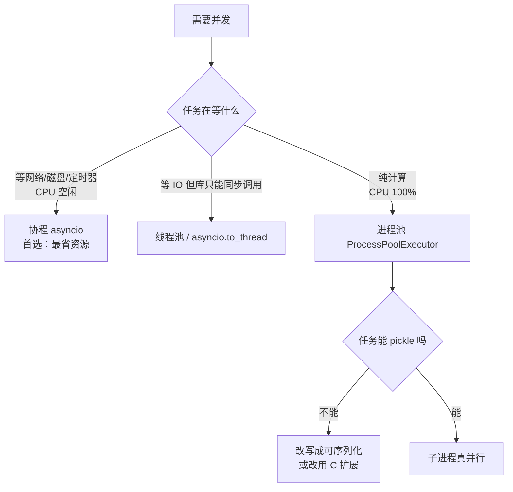

# [[Python-工程基础]]

> [!tip] 学习目标
> 能写出**通过 mypy --strict 的模块**，能说清 GIL 下线程/进程/协程各自的适用边界，能用 `asyncio.TaskGroup` + `asyncio.Queue` 实现带背压的生产者-消费者流水线，能用 httpx + BeautifulSoup 抓取并清洗结构化数据。

> [!warning] 版本基线
> 本文所有结论在 **CPython 3.12.13 / Linux 2 核**上实测。版本差异已逐条标注：`match` 需 3.10+，`TaskGroup`/`ExceptionGroup`/`asyncio.timeout`/`except*` 需 3.11+，`type` 参数语法需 3.12+，`TypeVar` 默认值需 3.13+。文中标注「实测」的数字均来自本机可复现的运行。

---

## 🎯 难度分段学习路径

| 难度 | 核心关注 | 预估时长 |
|---|---|---|
| **入门** | 类型注解与 `TypedDict`/`dataclass`/`Literal`、设计模式在 Python 里的真实形态、装饰器与 `functools` | 14h |
| **进阶** | `async`/`await` 与事件循环、`asyncio.Queue`/`TaskGroup`、线程池 vs 进程池与 GIL、`itertools`/`collections`/`operator` | 20h |
| **高级** | `Protocol` 结构化子类型与类型检查器配置、并发选型决策、httpx + BeautifulSoup 抓取管线 | 16h |

**总学时**：50h ｜ **前置知识**：[[bash-基础语法]] 的基本命令；函数、类、装饰器概念

---

## 📖 第一章 入门（Beginner）

### 1.1 类型注解：注解是给工具看的，不是给解释器执行的

**知识点详解**

==Python 的类型注解在运行时不产生任何强制行为==。`x: int = "a"` 完全合法，解释器照常执行。注解的价值在于**静态检查器**（mypy / pyright）能在你运行之前指出错误。

| 概念 | 说明 | 是否影响运行 |
|---|---|---|
| 函数/变量注解 | `def f(x: int) -> str` | 否 |
| `from __future__ import annotations` | ==所有注解变成字符串、延迟求值==，前向引用不必加引号 | 否（改变求值时机） |
| `TYPE_CHECKING` | `if TYPE_CHECKING: import X` —— 只在静态检查时导入 | 否 |
| `Any` | 关闭该表达式的类型检查 | 否 |
| `cast(T, v)` | 告诉检查器「把 v 当作 T」，==不做任何运行时转换== | 否 |
| `Final` | 绑定后不应重新赋值 | 否 |
| `ClassVar` | 声明类变量（非实例属性） | 否 |

> [!tip] 关键理解
> 注解不改变运行时行为，==所以「加了类型注解」不等于「类型安全」==。收益要等你在 CI 里跑 mypy 且**不通过就不许合并**。只写注解不跑检查，等于写注释。

**填空题**
1. Python 的类型注解在运行期是否被解释器强制检查？答：______。
2. `from __future__ import annotations` 的直接效果是把注解变成 ______。
3. `cast(int, x)` 在运行时是否真的把 x 转成 int？答：______。
4. 标记「绑定后不应重新赋值」的关键字是 ______。

**答案**：
1. 否，注解只对静态检查器有意义
2. 字符串（延迟求值）
3. 否，只影响检查器的推断
4. `Final`

---

### 1.2 泛型与 TypeVar：让类型参数跟着值走

**知识点详解**
| 概念 | 写法 | 作用 |
|---|---|---|
| `TypeVar` | `T = TypeVar("T")` | 声明一个类型变量 |
| 泛型函数/类 | `def first(xs: list[T]) -> T` | ==同一个 T 在所有出现处必须保持一致== |
| 约束 | `TypeVar("T", str, bytes)` | 只能取约束内的类型 |
| 上下界 | `TypeVar("T", bound=int)` | 至少是 int 及其子类 |
| 协变 / 逆变 | `covariant=True` / `contravariant=True` | 前者只允许「子类集合 → 父类」，后者用于参数（消费端） |
| 泛型类（旧写法） | `class Box(Generic[T])` | 3.11 及之前的标准写法 |
| **PEP 695 语法** | `class Box[T]:` / `def first[T](x: T) -> T` | ==3.12+ 新语法，不再需要 `Generic[T]` 和显式 `TypeVar`== |
| TypeVar 默认值 | `class Box[T = str]` | ==3.13+（PEP 696）== |

```python
from typing import Generic, TypeVar
T = TypeVar("T")
class Stack(Generic[T]):              # 跨版本通用写法
    def __init__(self) -> None: self._items: list[T] = []
    def push(self, item: T) -> None: self._items.append(item)
    def pop(self) -> T: return self._items.pop()
s: Stack[int] = Stack(); s.push(1)     # s.pop() 被推断为 int
```

PEP 695 写法（3.12+，本机实测通过）只需把类头换成 `class Stack[T]:`，`__init__`/`push`/`pop` 体完全不变 —— 少的正是 `Generic[T]` 与显式 `TypeVar`。

> [!tip] 选型建议
> ==维护跨版本库用 `TypeVar` + `Generic[T]`；只跑 3.12+ 的服务代码用 PEP 695==。后者更短，且类型参数作用域限定在类/函数内部，不污染模块命名空间。

**填空题**
1. 泛型函数中同一个 `T` 在参数和返回值出现时必须满足什么约束？答：______。
2. `TypeVar("T", bound=int)` 中 `bound` 的作用是 ______。
3. 允许 `list[Dog]` 赋值给 `Iterable[Dog]`（不反向）需要哪种变体？答：______。
4. `class Box[T]:` 这种语法从哪个 Python 版本起可用？答：______。

**答案**：
1. 推断为同一个具体类型，推断冲突时检查器报错
2. 给出类型下界，参数必须是 int 或其子类
3. 协变（`covariant=True`）
4. 3.12

---

### 1.3 Protocol：结构化子类型 = 静态版鸭子类型

**知识点详解**

PEP 484 定义**名义子类型**：`A` 能用在期望 `B` 的地方，当且仅当 `A` 是 `B` 的子类。PEP 544 补上**结构化子类型** —— 只要 `A` 具备 `B` 要求的全部成员，`A` 就是 `B` 的子类型，无需继承。

```python
from typing import Protocol, runtime_checkable

class SupportsRead(Protocol):        # 实际对象可以少实现成员 → 检查器报错
    def read(self, n: int = -1) -> bytes: ...
    def close(self) -> None: ...
def dump(fh: SupportsRead) -> None: print(len(fh.read(10)))
dump(open("a.txt", "rb"))   # FileIO 结构上满足
dump(b"bytes")              # bytes 有 read 没有 close → 类型错误

@runtime_checkable
class MethodProto(Protocol):          # 非数据协议
    def name(self) -> str: ...
@runtime_checkable
class DataProto(Protocol):            # 数据协议
    x: int
class A:
    def name(self): return "a"
class B: x = 1
class C: pass
isinstance(A(), MethodProto)          # True（实测）
isinstance(B(), DataProto)            # True —— 运行期能查数据成员
isinstance(C(), DataProto)            # False
issubclass(B, DataProto)              # TypeError: Protocols with non-method members don't support issubclass()
```

| 关键规则 | 说明 |
|---|---|
| ==Protocol 不可实例化== | 没有任何值属于协议类型，别写 `SomeProtocol()` |
| ==继承 Protocol 不让你成为 Protocol== | 子类必须**再次显式**写 `Protocol` 才保留结构化子类型，否则退化为普通类 |
| 协议只能继承协议 | Protocol 基类列表里其他基类必须也是 Protocol，不能是普通类 |
| `@runtime_checkable` | 让 `isinstance()` 可用；==只对非泛型、未下标化的协议有效== |
| ==数据协议不能 `issubclass`== | 含非方法成员的协议调用 `issubclass()` 抛 `TypeError` |

> [!danger] 最常见的误解
> 官方 typing 规范明确：==继承一个 Protocol 并不会让子类自动成为协议，它只是实现该协议的普通类或 ABC==。子类必须再次显式列出 `Protocol` 才是协议。理由是避免某个类因为偶然继承了协议基类就被当作协议 —— 静态类型系统里仍然略微偏向名义子类型。

**填空题**
1. PEP 484 引入的是名义子类型还是结构化子类型？答：______。
2. 要让 `isinstance()` 对自定义协议可用，需要加哪个装饰器？答：______。
3. 继承自 `Protocol` 的子类若不再次写 `Protocol`，会退化成什么？答：______。
4. 含非方法成员的协议调用 `issubclass()` 会发生什么？答：______。

**答案**：
1. 名义子类型
2. `@runtime_checkable`
3. 普通类（普通 ABC），不再参与结构化子类型判定
4. 抛 `TypeError`

---

### 1.4 NewType、Literal、TypedDict

**知识点详解**
| 工具 | 作用 | 运行期行为 | 版本 |
|---|---|---|---|
| `NewType` | ==给已有类型起一个「不可混用」的新名字== | ==完全透明，返回的还是原类型实例== | 3.10+ 改用 `class` 关键字 |
| `Literal["a","b"]` | 限定取值集合 | 透明 | 3.8+ |
| `TypedDict` | 描述「键固定的字典」 | 就是普通 `dict` | 3.8+ |
| `Required` / `NotRequired` | 覆盖单键的必填性 | 无 | 3.11+ |
| `ReadOnly` | 标记键只读 | 无 | 3.13+（`typing_extensions` 更早） |
| `dataclass_transform` | 告诉检查器「我这个装饰器会生成 dataclass 一样的类」 | 只设 `__dataclass_transform__` 属性 | 3.11+ |

```python
from typing import NewType, Literal, TypedDict, NotRequired, Required
UserId = NewType("UserId", int)         # 实测：UserId(1) == 1，type 是 int
PostId = NewType("PostId", int)
class State(TypedDict):
    kind: Literal["pending", "running", "done"]
    retries: NotRequired[int]           # 这个键可以缺
    trace_id: Required[str]             # 强制必填
s: State = {"kind": "running"}          # 合法
```

> [!warning] NewType 的真相
> ==`NewType` 的保护只存在于类型检查器里==。运行时 `UserId(1)` 就是 `int(1)`，任何绕过注解的赋值（`cast`、来自 JSON 的数据）检查器管不了。当「域类型」用没问题，当「安全边界」用是误解。

**填空题**
1. `NewType` 在运行期返回的对象类型是什么？答：______。
2. 哪个工具用于表达「取值只能是这几个字符串」？答：______。
3. 描述「键固定、键有明确类型」的字典应该用哪个类型？答：______。
4. 3.11+ 用哪个关键字单独覆盖 `TypedDict` 中某个键的必填性？答：______。

**答案**：
1. 原类型本身（如 `int`），`NewType` 运行期完全透明
2. `Literal`
3. `TypedDict`
4. `NotRequired`（或 `Required`）

---

### 1.5 dataclass

**知识点详解**
| 参数 | 作用 | 边界/陷阱 |
|---|---|---|
| `frozen=True` | ==实例不可变，赋值抛 `FrozenInstanceError`==（实测） | 同时自动生成 `__hash__` |
| `slots=True` | ==不创建实例 `__dict__`，省内存、加快属性访问==（实测 `hasattr(p,"__dict__")` 为 False） | 3.10+；不能给已有类加 slots |
| `order=True` | 生成 `__lt__` 等比较 | ==要求所有字段可比较== |
| `kw_only=True` | 全字段改为关键字参数 | 3.10+；==允许「无默认值字段」排在「有默认值字段」之后== |
| `field(default_factory=list)` | ==每实例独立的可变默认值== | ==绝不要写 `= []` 或 `= {}`== |
| `__post_init__` | 初始化后的校验/派生字段 | 派生字段用 `InitVar` |
| `weakref_slot` | 允许弱引用 | 3.11+ |

```python
from dataclasses import dataclass, field
@dataclass(frozen=True, slots=True)
class Point:
    x: int
    y: int
p = Point(1, 2)
p.x = 3                            # FrozenInstanceError（实测）
assert not hasattr(p, "__dict__")  # True（实测）
@dataclass
class Bad:  items: list = []                    # ❌ 所有实例共享同一个列表
@dataclass
class Good: items: list[str] = field(default_factory=list)   # ✅
```

**填空题**
1. `@dataclass(frozen=True)` 时给实例属性赋值会发生什么？答：______。
2. dataclass 中声明每实例独立的列表默认值，正确写法是 ______。
3. `slots=True` 的 dataclass 实例上 `hasattr(obj, "__dict__")` 返回什么？答：______。
4. `kw_only=True` 带来的一个具体能力是允许 ______。

**答案**：
1. 抛 `dataclasses.FrozenInstanceError`
2. `field(default_factory=list)`
3. `False`（slots 类不创建实例 `__dict__`）
4. 无默认值的字段出现在有默认值字段之后

---

### 1.6 设计模式（一）：单例、工厂、策略

**知识点详解**

GoF 模式诞生于强类型静态语言，==Python 落地时形态有明显变化==：有模块级作用域、有装饰器、有鸭子类型，很多模式能退化成一个函数。

| 模式 | GoF 原型 | Python 常用形态 | 关键差异 |
|---|---|---|---|
| **单例** | 私有构造 + 全局访问点 | ==模块本身就是单例==，或 `__new__` / `lru_cache` 缓存工厂函数 | ==Python 惯例是不用单例== |
| **工厂** | 抽象接口 + 具体子类 | ==一个返回对象的普通函数==（最常见） | 无需抽象基类，鸭子类型足够 |
| **策略** | 一族可互换算法 | ==把可调用对象（函数）当算法== | ==函数就是策略，不需要接口== |

```python
import functools
class _Registry:                     # __new__ 版单例
    _instance = None
    def __new__(cls):
        if cls._instance is None: cls._instance = super().__new__(cls)
        return cls._instance
@functools.cache                     # 工厂函数版单例：函数体只执行一次
def get_registry() -> dict[str, str]: return {}
def create_parser(fmt: str):         # 工厂：不写任何类
    match fmt:                       # 3.10+
        case "json": return make_json()
        case "csv":  return make_csv()
        case _:      raise ValueError(f"unsupported: {fmt}")
@functools.singledispatch             # 策略：函数即策略，按首个参数类型分派
def compress(data: bytes) -> bytes: ...
@compress.register
def _(data: bytes) -> bytes: ...
```

> [!warning] 单例的真正代价
> ==单例制造隐式全局状态==，测试之间互相污染，多线程下初始化顺序也可能成为 bug 源。「全局唯一对象」这个需求，==Python 里优先用模块级实例或显式依赖注入==，而不是 `__new__` 判断。

**填空题**
1. Python 中实现「全局唯一实例」最省事、也最符合惯例的机制是什么？答：______。
2. 用 `__new__` 实现单例时，判断实例是否已存在的经典写法是什么？答：______。
3. 「策略模式」在 Python 中落地时，算法对象通常用什么表示？答：______。
4. Python 3.10+ 用哪个语句做工厂的多路分派？答：______。

**答案**：
1. 模块本身（或模块级实例 / `functools.cache` 装饰的工厂函数）
2. `if cls._instance is None`
3. 可调用对象（普通函数、闭包、`functools.partial`）
4. `match` 语句

---

### 1.7 设计模式（二）：装饰器与观察者

**知识点详解**

==装饰器在 Python 里有两种完全不同的身份==，初学者最容易混淆：

| 身份 | 含义 | 例子 |
|---|---|---|
| **装饰器语法糖** | ==接收函数、返回函数的函数== | `@property`、`@functools.lru_cache`、日志/重试/鉴权中间件 |
| **GoF 装饰器模式** | 「对象身份」：==运行时给对象动态附加职责== | 高频的其实是上面那个 |

> [!tip] 关键理解
> ==GoF 的装饰器模式在 Python 里几乎不需要了== —— `functools.wraps` + 闭包几行就完成。真正高频的是「装饰器语法糖」：把日志、缓存、重试、鉴权、计时这些横切关注点从业务函数里抽出来。

```python
import functools
from typing import Callable, TypeVar, ParamSpec
P = ParamSpec("P")   # 保留被装饰函数的完整签名
R = TypeVar("R")
def retry(times: int = 3) -> Callable[[Callable[P, R]], Callable[P, R]]:
    def deco(fn: Callable[P, R]) -> Callable[P, R]:
        @functools.wraps(fn)          # ==不写这个，函数就"失忆"了==
        def wrapper(*args: P.args, **kw: P.kwargs) -> R:
            last: Exception | None = None
            for _ in range(times):
                try:
                    return fn(*args, **kw)
                except Exception as e:
                    last = e
            raise last                 # 全部失败则抛最后一个异常
        return wrapper                 # ==必须在 deco 里，漏了 deco 返回 None==
    return deco
```

**观察者模式的三种 Python 实现**
| 实现 | 机制 | 适用 | 代价 |
|---|---|---|---|
| 回调列表 | 维护 `list[Callable]` | 简单通知 | 检查器难以保证签名一致 |
| `signal` 模块 | ==内置发布-订阅，按信号名解耦== | 跨模块广播 | 发送方需知道信号名，拼错静默失效 |
| 消息队列 | ==生产者-消费者，可异步且天然背压== | 高频/跨进程 | 引入序列化与背压处理 |

```python
async def worker(q: asyncio.Queue[int | None]) -> None:
    while (item := await q.get()) is not None:
        handle(item)
# 背压：maxsize 满了之后 put 挂起，反压到生产者
q: asyncio.Queue[int | None] = asyncio.Queue(maxsize=8)
```

> [!warning] 观察者模式的真实风险
> ==回调里抛异常会中断后续通知，而调用方往往不知情==。跨模块广播时信号名拼错不报错、只是静默不触发 —— 这是它最常见的线上故障源。

**填空题**
1. 装饰器函数里忘记写 `functools.wraps` 会导致被装饰函数丢失哪两个属性？答：______。
2. GoF 的「装饰器模式」与 Python 的「装饰器语法糖」分别是什么身份？答：______。
3. 标准库中实现发布-订阅（观察者）的内置模块是哪个？答：______。
4. `asyncio.Queue(maxsize=8)` 满了之后继续 `await q.put(x)` 会发生什么？答：______。

**答案**：
1. `__name__` 和 `__doc__`（以及 `__qualname__`、`__wrapped__` 等元信息）
2. 「对象身份：运行时给对象加职责」与「函数身份：接收函数返回函数的语法糖」
3. `signal` 模块
4. 协程挂起（阻塞）直到有空位，即形成背压

---

### 1.8 第一章综合练习

**填空题**（本章共 4 道，答案见下方）

1. PEP 484 引入的子类型判定方式叫 ______，PEP 544 引入的叫 ______。
2. `class Box[T]:` 语法比 `TypeVar` + `Generic[T]` 写法要求 Python ______ 及以上。
3. 单例模式在 Python 中的主要问题是引入了 ______，让测试与并发变难。
4. 装饰器里 `@functools.wraps(fn)` 的作用是 ______。

**本章答案**：
1. 名义子类型（nominal subtyping），结构化子类型（structural subtyping）
2. 3.12
3. 隐式全局状态
4. 把原函数的元信息（`__name__`、`__doc__` 等）复制到 wrapper 上

**综合项目**：为一个「模型推理客户端」写三个装饰器 `@retry(n)`、`@timed`（记录耗时）、`@trace_id`（生成或复用追踪 ID）。要求：① 全部用 `functools.wraps`；② 用 `ParamSpec` 保留签名，让 pyright 能对装饰后的函数继续类型检查；③ 用 `Protocol` 定义 `ModelClient` 接口（`complete(prompt: str, *, timeout: float) -> str`），让两个真实实现在**不继承任何基类**的情况下通过 mypy；④ 补 `tests/test_decorators.py`（pytest），覆盖「重试第 3 次成功」与「全部失败抛最后一个异常」两条路径。

> [!tip] 常见陷阱
> 1. **只加注解不跑检查器**：注解的价值来自 CI 里的 mypy/pyright，本地不跑等于写注释。
> 2. **`NewType` 当安全边界**：运行期完全透明，混用照样发生。
> 3. **数据协议用 `issubclass`**：直接 `TypeError`。
> 4. **装饰器漏 `functools.wraps`**：日志、测试名、错误堆栈全部失真。
> 5. **单例缓存不可测**：`_instance` 一旦被某个测试构造，后面全污染。

> [!note] 本章权威资料
> - [typing — Support for type hints（CPython 文档，含名义 vs 结构化子类型）](https://docs.python.org/3/library/typing.html)
> - [typing 规范站（Protocol / dataclass 的当前权威规范）](https://typing.python.org/en/latest/spec/)
> - [PEP 544 — Protocols: Structural subtyping](https://peps.python.org/pep-0544/) · [PEP 484 — Type Hints](https://peps.python.org/pep-0484/)
> - [PEP 695 — Type Parameter Syntax](https://peps.python.org/pep-0695/) · [PEP 696 — Type Defaults](https://peps.python.org/pep-0696/)
> - [PEP 681 — Data Class Transforms](https://peps.python.org/pep-0681/)
> - [dataclasses — Data Classes](https://docs.python.org/3/library/dataclasses.html)
> - [refactoring.guru — 设计模式图解（单例/工厂/策略/装饰器/观察者）](https://refactoring.guru/design-patterns/observer)

---

## 📖 第二章 进阶（Intermediate）

> [!warning] 与上一章的衔接
> 本章依赖第一章的**类型注解**（用 `TypeVar` 标注泛型工具函数）与**装饰器**（`lru_cache`、`contextmanager` 本质都是装饰器）。跳过的直接后果：无法判断一个函数是否阻塞事件循环，也看不出哪些第三方库是 CPU 密集型。

### 2.1 协程、线程、进程：三种并发的本质差异

**知识点详解**
| 维度 | 协程（asyncio） | 线程（ThreadPoolExecutor） | 进程（ProcessPoolExecutor） |
|---|---|---|---|
| 并发方式 | ==单线程协作式切换== | OS 抢占式真并行（受限） | 多进程真并行 |
| 切换触发点 | ==只在 `await` 处== | 解释器锁/系统调度 | 进程调度 |
| GIL 影响 | ==不受影响（无线程切换）== | ==受影响：CPU 密集任务无加速== | 每进程独立解释器，不受 GIL 限制 |
| 内存开销 | 极小（每协程几 KB） | 每线程默认栈 8MB | ==每进程一整套解释器，几十到上百 MB== |
| 共享状态 | 同线程，直接读写 | 需要 `Lock` | ==不能直接共享，需 pickle 或共享内存== |
| 适用负载 | ==IO 等待（网络/磁盘/定时器）== | ==IO 等待 + 已有同步库== | ==CPU 密集（纯计算、图像、压缩）== |



> [!danger] GIL 的实测数据（本机 2 核，CPython 3.12.13，4 个相同 CPU 任务）
> ```
> 串行做 1 次：   0.195s
> 4 线程并行：    0.990s   ← 比串行做 4 次（0.78s）还慢
> 4 进程并行：    0.805s
> ```
> ==多线程跑 CPU 密集任务不是「没加速」，而是「倒退」==：GIL 让它们串行执行，还额外付了线程切换开销。**必须用多进程**。

> [!tip] 例外要说清
> ==GIL 不会让所有多线程都失去意义==。以下情况线程仍能真并行：
> - 网络/文件 IO 由 C 层执行并释放 GIL（`socket.recv`、`read`）；
> - 大量时间在原生调用上（`time.sleep` 等）；
> - **释放 GIL 的 C 扩展**：`hashlib`、图像/压缩库、NumPy 的大部分计算、正则的部分场景。
>
> 判断口诀：==纯 Python 字节码占比高 → 用进程；否则协程或线程都行==。

**填空题**
1. 协程的切换只发生在哪一种语句上？答：______。
2. GIL 下多线程跑 CPU 密集任务反而可能比串行更慢的两个原因是什么？答：______。
3. `ProcessPoolExecutor` 相比线程池最大的额外约束是什么？答：______。
4. 判断「该用进程还是线程」的关键指标是什么？答：______。

**答案**：
1. `await`（让出控制权的挂起点）
2. GIL 使任务仍被串行化；线程切换与锁竞争带来额外开销
3. 提交给它的函数与参数必须可被 pickle 序列化（lambda、局部类、文件句柄都不行）
4. 任务里纯 Python 字节码执行占比（纯计算 → 进程，IO 等待 → 协程/线程）

---

### 2.2 async/await 与事件循环的运行机制

**知识点详解**
| 概念 | 说明 |
|---|---|
| 协程对象 | 调用 `async def` 函数得到，==未 await 前一行都不执行== |
| Task | 把协程交给事件循环调度，`loop.create_task()` 创建 |
| `await` | ==挂起当前协程，把控制权交回事件循环== |
| 事件循环 | 单线程调度器，维护就绪队列与定时器堆 |
| I/O 监听 | Linux 上通过 `selectors` 模块的 `epoll` 监听 fd 就绪 |
| `uvloop` | 第三方高性能事件循环，需自行安装并替换策略 |

```python
import asyncio
async def fetch(name: str, delay: float) -> str:
    await asyncio.sleep(delay)          # ← 唯一的挂起点
    return f"{name}@{delay}"
async def main() -> None:
    t0 = asyncio.get_running_loop().time()
    results = await asyncio.gather(
        fetch("a", 0.3), fetch("b", 0.1), fetch("c", 0.2)
    )
    # results == ['a@0.3', 'b@0.1', 'c@0.2']，总耗时 ≈0.3s 而非 0.6s
```

```mermaid
sequenceDiagram
    participant Loop as 事件循环（单线程）
    participant A as 协程 A
    participant B as 协程 B
    Loop->>A: 调度 A 执行
    A->>A: 执行到 await，登记 future
    A-->>Loop: 挂起，让出控制权
    Loop->>B: 调度 B 执行
    B->>B: 执行到 await
    B-->>Loop: 挂起
    Loop->>Loop: 队列空，epoll 等待 IO/定时器
    Loop->>A: A 的定时器到期 → 恢复 A
```

> [!warning] 协程的三条铁律
> 1. ==`async def` 里写 `time.sleep()` 会阻塞整个事件循环== —— 必须 `await asyncio.sleep()`。同理，任何同步的 CPU 密集调用（`requests.get`、大循环计算）都应通过 `asyncio.to_thread` 或进程池外移。
> 2. ==忘记 `await` 会得到一个协程对象而不报错==，症状是「函数什么都没做」。
> 3. ==`await` 只能出现在 async 函数内==，在同步函数里写是语法错误。

**填空题**
1. 调用一个 `async def` 函数但不加 `await`，会发生什么？答：______。
2. `async` 函数里误用 `time.sleep(1)` 会阻塞谁？答：______。
3. 事件循环在 Linux 上用什么系统调用监听 I/O 就绪？答：______。
4. 三个 `asyncio.sleep` 分别为 0.3/0.1/0.2 秒并发执行，总耗时约多少？答：______。

**答案**：
1. 返回一个协程对象，函数体一行都不执行，且不会有任何报错
2. 阻塞整个事件循环（同线程内其他所有协程都停摆）
3. `epoll`
4. 约 0.3 秒（并发而非累加）

---

### 2.3 asyncio.gather 与 TaskGroup：两种并发语义

**知识点详解**

==这是 asyncio 里最容易搞错的一组 API==，两者对异常的处理语义完全不同。

| 特性 | `asyncio.gather` | `asyncio.TaskGroup`（3.11+） |
|---|---|---|
| 返回 | 结果列表 | 无返回值（结果自己收集） |
| 第一个异常时 | ==立刻向上抛，但**不取消**其他 awaitable== | ==取消所有兄弟 task== |
| 异常聚合 | 逐个抛出 | ==聚合成 `ExceptionGroup`，用 `except*` 捕获== |
| 清理保证 | 无 | ==离开 `async with` 时确保所有 task 已完成== |
| 何时用 | 「跑完就行，失败不关心」 | 「要结构化并发、必须清理干净」 |

> [!danger] gather 的实测行为（最易被误解）
> ```python
> await asyncio.gather(ok(0, 1.0), bad(1, 0.05))
> # → 0.05s 时抛 ValueError("bad1")
> # → 那个还在 sleep(1.0) 的 ok(0) **没有被取消**，仍在事件循环里跑（实测）
> ```
> ==gather 的「快速失败」只是提前返回异常，不是取消其他任务==。如果那些任务持有连接、文件或锁，程序可能带着未完成的清理退出。需要「一个失败全部停」时用 `TaskGroup`。

```python
async def work(i: int) -> str:
    await asyncio.sleep(0.01 * (i + 1))
    if i == 2: raise ValueError(f"item {i} failed")
    return f"ok{i}"
async def main() -> None:
    try:
        async with asyncio.TaskGroup() as tg:     # 3.11+
            for i in range(4):
                tg.create_task(work(i))           # 引用不会自动保留，需有强引用
    except* ValueError as eg:                     # 3.11+ except* 语法
        print(len(eg.exceptions))                 # 实测：3 个
```

> [!tip] 该用哪个
> ==新代码一律用 `TaskGroup`==。`gather` 只保留两种用法：① `return_exceptions=True` 做「全跑完看谁失败」；② 兼容 3.10 及以下。注意 `except*` 只能匹配 `ExceptionGroup`，系统级信号走 `BaseExceptionGroup`。

**填空题**
1. `gather` 中某个 awaitable 抛异常时，其他 awaitable 会怎样？答：______。
2. 哪个 API（3.11+）会在第一个子任务失败时自动取消其余兄弟任务？答：______。
3. 捕获 `ExceptionGroup` 应该用哪种异常处理语法？答：______。
4. `TaskGroup.create_task` 创建的对象若不赋给变量，可能出现什么问题？答：______。

**答案**：
1. 不会被取消，继续在事件循环里运行（实测）
2. `asyncio.TaskGroup`
3. `except*`
4. 对象可能被垃圾回收，导致 task 中途消失（需保留强引用）

---

### 2.4 异步生成器与 asyncio.Queue：生产者-消费者与背压

**知识点详解**
| API | 用途 | 关键点 |
|---|---|---|
| `async def` + `yield` | ==异步生成器：逐个产出，中间可 `await`== | 用 `async for` 消费 |
| `asyncio.Queue` | 协程安全队列 | `get`/`put` 均可 await |
| `Queue(maxsize=N)` | ==N>0 时形成背压：`put` 在队列满时挂起== | N=0（默认）= 无界 |
| `join()` / `task_done()` | ==等待所有 `put` 的项都被消费== | 必须一一配对 |
| `asyncio.timeout()` | 3.11+ 的超时作用域 | 取代 `asyncio.wait_for` |

```python
from collections.abc import AsyncIterator
async def source(n: int) -> AsyncIterator[int]:
    for i in range(n):
        await asyncio.sleep(0.01)      # 每个元素之间都能让出
        yield i
async def worker(q: asyncio.Queue[int | None]) -> None:
    while (item := await q.get()) is not None:
        try: print("处理", item)
        finally: q.task_done()         # ==配对，必须在 finally==
async def pipeline() -> None:
    q: asyncio.Queue[int | None] = asyncio.Queue(maxsize=4)   # 背压阈值
    workers = [asyncio.create_task(worker(q)) for _ in range(2)]
    async for v in source(20):
        await q.put(v)                 # 满时在这里挂起，反压到 source
    for _ in workers: await q.put(None)         # 毒丸：通知结束
    await asyncio.gather(*workers)
    await q.join()                     # 实测：全部消费完才返回
```

> [!danger] 三个必踩的坑
> 1. ==`maxsize` 不设（=0）时队列无界==，`put` 永不阻塞 —— 内存一路涨到 OOM。==背压必须显式设 `maxsize`==。
> 2. ==`task_done()` 漏调用则 `q.join()` 永久挂起==；调用次数必须与 `get` 次数严格相等。
> 3. ==用 `None` 做毒丸要求元素类型不可能为 `None`==。更稳的写法是超时后自己收工：
>    ```python
>    try:
>        item = await asyncio.wait_for(q.get(), timeout=0.5)
>    except asyncio.TimeoutError:
>        return                         # 队列空了，收工
>    ```

**填空题**
1. `asyncio.Queue()` 不传 `maxsize` 时，`await q.put(x)` 会挂起吗？答：______。
2. 什么情况下 `await q.join()` 会永远不返回？答：______。
3. 异步生成器的定义语法是哪个？答：______。
4. `asyncio.wait_for` 在哪个版本被 `asyncio.timeout` 取代为推荐写法？答：______。

**答案**：
1. 不会，队列无界，`put` 立即完成（这是 OOM 风险）
2. `get` 次数与 `task_done()` 调用次数不匹配
3. `async def` 函数体里使用 `yield`
4. 3.11

---

### 2.5 线程池、进程池与 GIL 的落地决策

**知识点详解**
| API | 语义 | 关键点 |
|---|---|---|
| `ThreadPoolExecutor` | 线程池 | `map` 保持输入顺序 |
| `ProcessPoolExecutor` | 进程池 | ==3.14 起不再有全局隐式资源清理器，需显式 `shutdown`== |
| `Executor.map` | 批量提交 | ==返回惰性迭代器；提交慢时不会立即报错，需 `list()` 触发== |
| `as_completed(fs)` | 按完成顺序产出 Future | 用于「谁先好谁先出」 |
| `asyncio.to_thread` | 3.9+ | ==把同步函数丢到默认线程池并 await== |
| `loop.run_in_executor` | 指定自定义 executor | 可传 `ProcessPoolExecutor` |

```python
import asyncio
from concurrent.futures import ProcessPoolExecutor, as_completed
def hash_file(path: str) -> int:        # ==必须是模块顶层 def==
    import hashlib, pathlib
    return len(hashlib.sha256(pathlib.Path(path).read_bytes()).hexdigest())
def main() -> None:
    with ProcessPoolExecutor(max_workers=4) as ex:
        for fut in as_completed([ex.submit(hash_file, p) for p in files]):
            print(fut.result())
if __name__ == "__main__": main()       # ==必须在 __main__ 保护下启动==
```

> [!warning] 进程池的两个硬约束（均为本机实测）
> 1. ==提交 lambda 一定失败==：
>    ```
>    ProcessPoolExecutor().map(lambda x: x*2, [1,2])
>    → _pickle.PicklingError: Can't pickle <function <lambda>> ...
>    ```
>    ==必须写成模块顶层 `def`==，且在 `if __name__ == "__main__":` 里启动，否则 spawn/fork 语义会递归创建进程。
> 2. ==`multiprocessing` 在 Linux 默认是 `fork`==（本机 `get_start_method()` 实测返回 `'fork'`）。fork 复制父进程全部内存状态，==在持有线程锁或已打开连接时 fork 子进程可能死锁==。多线程程序里必须显式 `multiprocessing.get_context("spawn")`。

```python
def blocking(url: str) -> bytes:        # 同步阻塞实现
    import urllib.request
    return urllib.request.urlopen(url, timeout=10).read()
async def fetch_all(urls: list[str]) -> list[bytes]:
    return await asyncio.gather(*(asyncio.to_thread(blocking, u) for u in urls))
```

> [!tip] 决策表（可直接背）
> | 场景 | 选择 |
> |---|---|
> | 1000 个 HTTP 请求 | `asyncio` + 异步客户端 + `Semaphore` 限流 |
> | 调用只能同步的第三方 SDK | `asyncio.to_thread` |
> | 图像处理 / 数值计算 / 压缩 | `ProcessPoolExecutor` |
> | 多个任务读同一份大文件 | ==单进程内多线程，别用进程池==（序列化开销 > 收益） |

**填空题**
1. 向 `ProcessPoolExecutor` 提交 lambda 会抛出什么异常？答：______。
2. 在 Linux 上 `multiprocessing` 的默认启动方法是什么？答：______。
3. `Executor.map` 返回的是立即求值的列表吗？答：______。
4. 把同步阻塞函数移出事件循环的 3.9+ 标准库函数是什么？答：______。

**答案**：
1. `pickle.PicklingError`
2. `fork`（本机实测 `'fork'`）
3. 不是，是惰性迭代器；必须 `list()` 或遍历才会真正执行并抛出子任务里的异常
4. `asyncio.to_thread`

---

### 2.6 常用标准库（一）：functools 与 operator

**知识点详解**
| 函数 | 行为 | 陷阱 |
|---|---|---|
| `lru_cache(maxsize=128)` | ==最近最久未用淘汰==，默认 128 | ==不是线程安全的「恰好一次」== |
| `cache` | ==`lru_cache(maxsize=None)` 的语法糖==（3.9+） | 同上 |
| `partial` | 预绑定部分参数 | ==会让 `inspect.signature` 变形，依赖签名的库可能不认== |
| `wraps` | 复制被包装函数的元信息 | 不写就是「函数失忆」 |
| `singledispatch` | 基于**首个参数类型**分派 | 与 `Protocol` 机制不同，见下 |
| `cmp_to_key` | 把老式比较函数转成排序键 | 3.x 里基本没必要了 |

> [!danger] `lru_cache` 不是「只算一次」——本机实测
> ```
> 5 个线程用相同参数调用 @lru_cache(maxsize=4) 的慢函数
> → 实际执行 5 次，cache_info() = CacheInfo(hits=0, misses=5, currsize=1)
> ```
> ==`lru_cache` 的字典操作受 GIL 保护不会损坏，但「检查 → 计算 → 写入」不是原子的==。高并发下会重复计算，**不能当并发原语**。

```python
import functools, operator
from collections.abc import Sequence
key_name = operator.itemgetter("name")        # ==比 lambda d: d["name"] 快（C 层实现）==
key_age  = operator.attrgetter("age")         # 对象属性
first_two = operator.itemgetter(0, 1)         # 多字段
sorted(users, key=key_name)
greet = functools.partial(print, "[log]")     # 预填第一个参数
shout = functools.partial(str.upper)
```

| `singledispatch` vs `Protocol` vs `match` | 用途 |
|---|---|
| `singledispatch` | ==运行期按首个参数类型分派== |
| `Protocol` | ==静态检查期判定「是否满足某接口」==，无运行期分派 |
| `match` 语句（3.10+） | 结构化模式匹配，也能按类型分派，==可读性通常优于 singledispatch== |

**填空题**
1. `functools.cache` 与 `lru_cache(maxsize=None)` 的关系是什么？答：______。
2. `operator.itemgetter` 相比 `lambda d: d["name"]` 的主要优势是什么？答：______。
3. 多线程下 `lru_cache` 是否保证「同一参数只计算一次」？答：______。
4. 运行期按首个参数类型分派到不同实现，标准库工具是哪个？答：______。

**答案**：
1. `cache` 就是 `lru_cache(maxsize=None)` 的简写（3.9+）
2. 是 C 层实现的调用，比解释执行的 lambda 快，且不创建闭包
3. 否，字典本身受 GIL 保护不损坏，但「检查—计算—写入」非原子，实测会重复计算
4. `functools.singledispatch`（或 3.10+ 的 `match` 语句）

---

### 2.7 常用标准库（二）：itertools 与 collections

**知识点详解**
| `itertools` 函数 | 语义 | 关键点 |
|---|---|---|
| `chain(a, b)` | ==把多个可迭代对象首尾相接== | 惰性 |
| `zip_longest` | 补齐到最长，`fillvalue=` 填缺 | 只给短的那侧补 `None` |
| `groupby(key=)` | ==按 key 分组，**只合并相邻的相同 key**== | ⚠ 见下方陷阱 |
| `product` | 笛卡尔积 | 惰性，先耗尽内层 |
| `permutations` | 排列 | ==元素不可重复选取== |
| `combinations` | 组合（不区分顺序） | 内部维护索引元组 |
| `islice` | 切片 | ==惰性，不会预读== |
| `batched` | 3.12+ 按固定大小分批 | 3.11 及以下需手写 |

> [!danger] `groupby` 的头号陷阱（本机实测）
> ```python
> data = [("a",1), ("b",2), ("a",3)]
> [(k, list(g)) for k,g in itertools.groupby(data, key=lambda t: t[0])]
> → [('a', [('a',1)]), ('b', [('b',2)]), ('a', [('a',3)])]   # 两个 "a" 组！
> ```
> ==`groupby` 只合并**相邻**的相同 key==。需要全局聚合必须先 `sorted(data, key=...)`；实测排序后得到 `[('a', 2), ('b', 1)]`，正确。

| `collections` 类型 | 用途 | 相比内建的优势 |
|---|---|---|
| `defaultdict` | 缺键时用工厂函数建值 | 省 `setdefault` 的重复构造 |
| `Counter` | 计数 + `most_common` | 底层是 `dict` 子类 |
| `deque(maxlen=N)` | ==双端队列，超长自动丢最旧的== | 两端 `O(1)`，滑动窗口首选 |
| `OrderedDict` | 保持插入顺序 | ==3.7+ 普通 `dict` 已保序，仍保留 `move_to_end`== |
| `ChainMap` | 多字典合并视图 | 查找 O(链长) |

```python
import collections, itertools
from operator import itemgetter
recent: collections.deque[str] = collections.deque(maxlen=3)   # 实测：第 4 次 append 后 len 仍为 3
for token in stream:
    recent.append(token)                                     # 自动淘汰最旧
agg: dict[str, list[int]] = {}
for k, g in itertools.groupby(sorted(rows, key=itemgetter("cat")), key=itemgetter("cat")):
    agg[k] = [r["v"] for r in g]
batches = list(itertools.batched(range(7), 3))               # 最后一批短，无 fillvalue
```

**填空题**
1. `itertools.groupby` 对**非相邻**的相同 key 会怎样？答：______。
2. `deque(maxlen=3)` 追加第 4 个元素后长度是多少？答：______。
3. `itertools.batched` 从哪个 Python 版本开始提供？答：______。
4. 普通 `dict` 从哪个版本起成为语言保证的插入有序？答：______。

**答案**：
1. 拆成多个独立的组（只合并相邻项），需要全局聚合必须先排序
2. 3（最旧的被自动丢弃）
3. 3.12
4. 3.7（CPython 3.6 起为实现细节，3.7 起为语言保证）

---

### 2.8 第二章综合练习

**填空题**（本章共 4 道，答案见下方）

1. 多线程执行 CPU 密集任务比串行更慢的两个原因分别是 ______ 和 ______。
2. `asyncio.gather` 与 `asyncio.TaskGroup` 在「一个子任务失败时是否取消其他任务」上的区别是 ______。
3. `asyncio.Queue` 要产生背压必须显式设置 ______，否则 `put` 永不挂起。
4. 提交给 `ProcessPoolExecutor` 的函数与参数必须能被 ______ 序列化。

**本章答案**：
1. GIL 使任务仍串行执行；线程切换与锁竞争带来额外开销
2. `gather` 不取消（只是提前抛异常），`TaskGroup` 取消所有兄弟任务并聚合成 `ExceptionGroup`
3. `maxsize`（大于 0）
4. `pickle`（`lambda`、局部类、文件句柄都不可序列化）

**综合项目**：写一个「并发 URL 校验器」。输入 200 个 URL，产出每个 URL 的状态码与耗时。要求：① 纯 `asyncio` + `asyncio.TaskGroup`，`Semaphore(20)` 限流；② 每个请求 5 秒超时（用 `asyncio.timeout`）；③ 单个 URL 失败不影响整体，错误收进 `errors` 列表；④ 输出按输入顺序排列；⑤ 附 30 行说明：什么情况下把其中一段换成 `asyncio.to_thread`（例如 SDK 只能同步调用），什么情况下换成 `ProcessPoolExecutor`（例如改为对响应做图像/数值处理）。

> [!tip] 常见陷阱
> 1. **在 async 函数里用 `time.sleep` / `requests.get`**：阻塞整个事件循环，且症状隐蔽（只在高并发时暴露）。
> 2. **以为 `gather` 会取消兄弟任务**：实测不会，资源清理可能丢失。
> 3. **`Queue` 不设 `maxsize`**：无界队列 = 没有背压 = OOM。
> 4. **进程池提交 lambda 或在模块顶层启动进程池**：`PicklingError` 或进程递归创建。
> 5. **`groupby` 忘记先排序**：静默产生重复的 key 组。
> 6. **在多线程程序里用 `fork` 创建子进程**：可能因继承的锁状态而死锁。

> [!note] 本章权威资料
> - [asyncio — 异步 IO 顶层文档](https://docs.python.org/3/library/asyncio.html)
> - [协程与任务（Task / gather / TaskGroup / timeout / 取消）](https://docs.python.org/3/library/asyncio-task.html)
> - [同步原语（Queue / Lock / Event / Semaphore）](https://docs.python.org/3/library/asyncio-sync.html)
> - [asyncio Queue](https://docs.python.org/3/library/asyncio-queue.html) · [asyncio Runner](https://docs.python.org/3/library/asyncio-runner.html)
> - [contextlib — asynccontextmanager / suppress 等](https://docs.python.org/3/library/contextlib.html)
> - [concurrent.futures — ThreadPoolExecutor / ProcessPoolExecutor](https://docs.python.org/3/library/concurrent.futures.html)
> - [multiprocessing — 上下文与启动方法](https://docs.python.org/3/library/multiprocessing.html#contexts-and-start-methods)
> - [functools](https://docs.python.org/3/library/functools.html) · [itertools](https://docs.python.org/3/library/itertools.html) · [operator](https://docs.python.org/3/library/operator.html) · [collections](https://docs.python.org/3/library/collections.html)
> - [What's New In Python 3.12（版本差异核对）](https://docs.python.org/3/whatsnew/3.12.html)

---

## 📖 第三章 高级（Advanced）

> [!note] 深度标准
> 本章每条结论都给出机制说明 + 边界条件 + 本机可复现的实测数值。

### 3.1 类型检查器配置：把注解变成真正的防线

**知识点详解**
| 工具 | 特点 |
|---|---|
| mypy | ==事实标准，PEP 484/544/681 完整支持，行为可预测== |
| pyright | 基于 Pylance，语言服务更激进 |

| mypy 严格度选项 | 效果 |
|---|---|
| `disallow_untyped_defs` | 未标注的函数直接报错 |
| `disallow_any_generics` | ==禁止裸 `list` / `dict`，必须写 `list[int]`== |
| `no_implicit_reexport` | 从模块导入的符号必须显式列出 |
| `warn_return_any` | 函数声明了返回值却返回 `Any` 时报错 |
| `warn_unreachable` | 报告永不可达的代码 |
| `warn_unused_ignores` | ==防止 `# type: ignore` 堆积成垃圾== |

```toml
# pyproject.toml（uv 管理项目时的标准位置）
[tool.mypy]
python_version = "3.12"
strict = true
warn_unreachable = true
[[tool.mypy.overrides]]
module = ["some_untyped_lib.*"]
ignore_missing_imports = true
```

```bash
uv run mypy --strict src/          # 用 uv 执行，不污染系统环境
uv run pyright src/
```

> [!tip] 渐进落地路径
> 对已有大仓库，`strict = true` 一次性开会产生几百个错误导致无法合并。顺序：① 先开 `disallow_untyped_defs`（收益最大、改动最小）；② 用 `[[tool.mypy.overrides]]` 这样的 TOML 表头逐目录放行无类型库；③ 最后全量 `strict`。==`warn_unused_ignores` 一定要开==，它会自动告诉你哪些 `# type: ignore` 已经过期。

**填空题**
1. mypy 中「未标注类型的函数一律报错」对应哪个选项？答：______。
2. 哪个严格选项能防止 `# type: ignore` 注释堆积？答：______。
3. 第三方库没有类型标注时，应该用哪个选项局部放行？答：______。
4. `warn_return_any` 会在什么时候报错？答：______。

**答案**：
1. `disallow_untyped_defs`
2. `warn_unused_ignores`
3. `ignore_missing_imports`（用 `[[tool.mypy.overrides]]` 按模块限定）
4. 函数声明了具体返回类型，实际却返回 `Any`

---

### 3.2 Protocol 的工程用法：跨团队解耦

**知识点详解**

Protocol 的真正价值不在类型检查本身，而在==它把「接口」从「继承关系」变成「能力描述」==。

| 场景 | 继承式设计的问题 | Protocol 的解法 |
|---|---|---|
| 第三方库接入你的框架 | 必须继承你的基类 | ==只需方法签名兼容== |
| 同一份代码兼容 v1/v2 接口 | 需要多个 `isinstance` 分支 | ==写两个 Protocol，用联合类型== |
| mock / 假实现 | 继承基类就得实现全部方法 | ==只实现被用到的成员== |
| 循环导入 | 高层基类被低层模块 import | ==低层只声明 `Protocol`== |

```python
@runtime_checkable
class Response(Protocol):
    status_code: int
    text: str
    def json(self) -> object: ...
def handle(r: Response) -> int: return r.status_code
class FakeResp:                      # 不继承任何东西
    status_code = 200
    text = '{"ok": true}'
    def json(self) -> object: return json.loads(self.text)
```

| 协议成员种类 | 定义 | `isinstance` | `issubclass` |
|---|---|---|---|
| 非数据协议 | 只有方法成员 | ✅（需 `@runtime_checkable`） | ✅ |
| 数据协议 | ==含至少一个非方法成员== | ✅ | ❌ 抛 `TypeError`（本机实测） |

> [!warning] Protocol 的隐藏成本
> 1. ==结构化子类型只在编译期存在==，运行时若对象动态删除属性，检查器看不见。
> 2. ==协议方法体会被类型检查== —— 签名与文档字符串里的返回示例不一致会报错。
> 3. ==协议不能被实例化==，别写 `SomeProtocol()`。

**填空题**
1. 只含方法成员的协议属于「数据协议」还是「非数据协议」？答：______。
2. 对非数据协议调用 `issubclass()` 会不会报错？答：______。
3. Protocol 相比抽象基类，在第三方库接入上的核心优势是什么？答：______。
4. 协议对象能否被直接实例化（`SomeProtocol()`）？答：______。

**答案**：
1. 非数据协议
2. 不会（但需 `@runtime_checkable`）
3. 无需继承，只要结构兼容即可被类型检查器接受，避免侵入第三方类
4. 不能，协议没有值属于该类型

---

### 3.3 异步 HTTP 实战：httpx 与 aiohttp

**知识点详解**
| 库 | 特点 | 适用 |
|---|---|---|
| `httpx` | ==同步/异步 API 完全对称，HTTP/1.1 与 HTTP/2 都支持== | 通用首选 |
| `aiohttp` | ==生态成熟，自带连接池、WebSocket、客户端与服务端框架== | 高并发抓取、WebSocket |
| `requests` | 同步 | ==不要在 async 函数里用== |

```python
import asyncio, httpx
async def fetch(client: httpx.AsyncClient, url: str, sem: asyncio.Semaphore) -> dict:
    async with sem:                                  # 限流放在这一层
        try:
            async with asyncio.timeout(10):          # 3.11+
                r = await client.get(url)
                r.raise_for_status()                 # ==httpx 不会自动抛 4xx/5xx==
                return {"url": url, "status": r.status_code, "body": r.text[:2000]}
        except (httpx.HTTPError, asyncio.TimeoutError) as e:
            return {"url": url, "error": f"{type(e).__name__}: {e}"}
async def main(urls: list[str]) -> list[dict]:
    limits = httpx.Limits(max_connections=20, max_keepalive_connections=10)
    timeout = httpx.Timeout(connect=5.0, read=20.0, write=10.0, pool=5.0)
    async with httpx.AsyncClient(limits=limits, timeout=timeout,
                                 headers={"User-Agent": "Mozilla/5.0"}) as c:
        sem = asyncio.Semaphore(20)
        async with asyncio.TaskGroup() as tg:
            tasks = [tg.create_task(fetch(c, u, sem)) for u in urls]
        return [t.result() for t in tasks]           # TaskGroup 无返回值，从 Task 取
```

> [!danger] 四个必须显式处理的点
> 1. ==`AsyncClient` 必须在 `async with` 里创建==。不关闭会泄漏连接池直到进程退出。
> 2. ==`timeout` 必须分项配置==。httpx 默认 `read=5.0`，对长响应接口必然超时；`pool` 超时不给，则并发超过连接数时直接抛 `PoolTimeout`。
> 3. ==`Semaphore` 放在请求函数内部==。放在 `async with` 外面根本不限制并发。
> 4. ==`raise_for_status()` 要显式调用==。

> [!tip] 什么时候 `aiohttp` 更合适
> ==需要 WebSocket、需要自建异步 HTTP 服务端、或已有 aiohttp 生态依赖时选 aiohttp==。纯客户端抓取场景，httpx 的 API 一致性和 HTTP/2 支持更省心。

**填空题**
1. httpx 的 `AsyncClient` 为什么必须放在 `async with` 中？答：______。
2. `httpx.Limits(max_connections=N)` 控制的是什么？答：______。
3. 限制在途请求数应该用哪个 asyncio 原语？答：______。
4. httpx 默认是否会对 404/500 自动抛异常？答：______。

**答案**：
1. 不关闭会泄漏连接池与底层连接，直到进程结束
2. 连接池中的最大并发连接数（超出时排队，池等待超时则抛 `PoolTimeout`）
3. `asyncio.Semaphore`
4. 不会，必须显式调用 `raise_for_status()`

---

### 3.4 网页解析与结构化数据处理

**知识点详解**
| 解析器 | 特点 |
|---|---|
| `BeautifulSoup` | ==上手快、容错好，但解析慢（大文档秒级）== |
| `lxml` 作为 bs4 后端 | `BeautifulSoup(html, "lxml")`，快且容错好 |
| `lxml.etree` + XPath | ==快，但要求文档结构良好，容错差== |
| 选择器 | `select()`（CSS）可读性好；XPath 表达复杂结构更强 |

```python
from bs4 import BeautifulSoup
from dataclasses import dataclass, field

@dataclass(slots=True, frozen=True)
class Item:
    title: str
    url: str
    tags: list[str] = field(default_factory=list)

def parse(html: str) -> list[Item]:
    soup = BeautifulSoup(html, "lxml")      # 必须显式指定解析器
    soup(["script", "style"]).decompose()   # ==去掉脚本里的假标签==
    out: list[Item] = []
    for card in soup.select("div.item"):
        a = card.select_one("a.title")
        if a is None: continue              # ==必须判空==
        out.append(Item(title=a.get_text(strip=True), url=a.get("href", ""),
                        tags=[t.get_text(strip=True) for t in card.select("span.tag")]))
    return out
```

**结构化数据的三层处理**
| 层 | 工具 | 要点 |
|---|---|---|
| 抽取 | BeautifulSoup / lxml | ==选择器写死前先 `print(len(soup.select(...)))` 确认命中数量 != 0== |
| 校验 | `pydantic` / `dataclass` + `TypedDict` | ==外部数据永远不可信，字段类型必须校验== |
| 归一 | `datetime.fromisoformat`、`decimal.Decimal` | ==不要用 float 存金额== |

> [!danger] 网页抓取的三个真实坑
> 1. ==选择器静默失配==：网站改版后 `select()` 返回空列表，不报错，脚本「成功」返回 0 条数据。==必须断言条数或做兜底告警==。
> 2. ==不加 `User-Agent` 直接 403==：很多站点对空 UA 拒绝服务。
> 3. ==`<script>` 里的假标签==：`soup.select("div.item")` 会匹配到脚本字符串中的文本，解析前必须 decompose 掉。

**填空题**
1. `BeautifulSoup(html, ...)` 的第二个参数为什么必须显式指定？答：______。
2. 网页解析时为什么必须对 `select_one` 的结果判空？答：______。
3. 金额数据为什么不应该用 `float` 存储？答：______。
4. 抓取时漏掉 `User-Agent` 常见的直接后果是什么？答：______。

**答案**：
1. 指定解析器（`html.parser` / `lxml` / `html5lib`），默认行为随环境变化且可能不支持
2. 页面结构可能变化，`select_one` 找不到时返回 `None`，直接取属性会抛 `AttributeError`
3. 二进制浮点无法精确表示十进制小数，累加会产生误差（应使用 `decimal.Decimal`）
4. 大量站点直接返回 403

---

### 3.5 上下文管理器：资源生命周期的正确写法

**知识点详解**
| 写法 | 说明 |
|---|---|
| `with open(...) as f:` | 基于 `__enter__` / `__exit__` |
| `@contextlib.contextmanager` | 把「含 `yield` 的生成器」变成上下文管理器 |
| `@contextlib.asynccontextmanager` | ==`async with` 版本== |
| `contextlib.suppress(Exc)` | ==抑制指定异常，等价于空的 `except`== |
| `contextlib.ExitStack` | ==动态数量资源的统一清理== |
| `asyncio.timeout()` | 3.11+ 基于上下文管理器的超时作用域 |

```python
@contextlib.contextmanager
def timed(name: str):
    t0 = time.perf_counter()
    try: yield                        # ==代码在这里执行；异常从 yield 处抛回==
    finally: print(f"{name}: {time.perf_counter() - t0:.3f}s")
@contextlib.asynccontextmanager
async def pooled(name: str):
    try: yield {"conn": f"pooled-{name}"}
    finally: print(f"release {name}")
with contextlib.ExitStack() as stack:
    files = [stack.enter_context(open(p)) for p in paths]   # 数量运行时才确定
```

> [!tip] 关键理解
> ==上下文管理器的本质是「围绕一段代码的 try/finally」==。`yield` 之前是进入，之后是退出，异常在 `yield` 处重新抛出。==`finally` 必须存在==。异步代码里清理动作本身要 await 时，必须用 `@asynccontextmanager` 而不是普通 `with`。

**填空题**
1. 把一个含 `yield` 的生成器函数变成上下文管理器，需要用哪个装饰器？答：______。
2. 异步版本的上下文管理器装饰器叫什么？答：______。
3. 资源数量在运行时才确定时，应该用哪个工具统一清理？答：______。
4. `contextlib.suppress` 的作用是什么？答：______。

**答案**：
1. `contextlib.contextmanager`
2. `contextlib.asynccontextmanager`
3. `contextlib.ExitStack`
4. 抑制指定的异常（等价于一个空的 `except` 分支）

---

### 3.6 第三章综合练习

**填空题**（本章共 4 道，答案见下方）

1. 非数据协议的 `issubclass()` 可正常使用而数据协议抛 `TypeError`，差异来自协议中是否含有 ______ 成员。
2. httpx 的 `AsyncClient` 不关闭会导致 ______ 泄漏。
3. `asyncio.Queue(maxsize=0)`（默认）时队列是 ______ 的，`put` 永不挂起。
4. `asyncio.to_thread` 从 Python ______ 版本开始提供。

**本章答案**：
1. 非方法（数据）成员
2. 连接池与底层 TCP 连接
3. 无界
4. 3.9

**综合项目**：写一个「异步资讯聚合器」。
- **输入**：10 个以上种子 URL，每个页面用正则提取 1-2 层后续链接（BFS 两层，总量 ≤ 200）。
- **并发控制**：`httpx.AsyncClient` + `Semaphore(20)`，单请求 `asyncio.timeout(8)`，用 `asyncio.TaskGroup` 组织。
- **解析**：`BeautifulSoup(html, "lxml")` 提取标题、摘要、发布时间、标签；先 decompose 掉 `script`/`style`。
- **结构化**：`@dataclass(frozen=True, slots=True)` 定义 `Article`；用 `TypedDict` 定义原始 JSON 响应结构；时间与金额分别用 `datetime` 与 `Decimal` 归一。
- **类型**：`Protocol` 声明 `Fetcher` 接口，让 `HttpxFetcher` 与测试用的 `FakeFetcher` 在**不继承基类**的情况下通过 mypy `--strict`。
- **验收标准**：① `mypy --strict src/` 零错误；② 重复运行对同一 URL 的抓取结果一致（用 `lru_cache` 缓存 HTML，注意并发的重复计算）；③ 某页面 500 或超时不影响整体，错误进入 `errors` 列表且每条含 URL 与异常类型；④ 输出一份 40 行设计说明：哪些步骤受 GIL 影响、哪些是真并行、瓶颈在网络还是在解析。

> [!tip] 常见陷阱
> 1. **把 Protocol 当运行期校验**：只在静态期生效，运行时属性被删改检查器看不见。
> 2. **httpx 用默认 5 秒 read 超时**：调用长响应接口必然 `ReadTimeout`。
> 3. **`Semaphore` 写在 `async with` 外面**：并发根本没被限制住。
> 4. **选择器静默失配**：抓取「成功」但 0 条数据 —— 必须对条数做断言。
> 5. **在 `async with` 内用同步 `with` 打开阻塞资源**：清理动作会阻塞事件循环。

> [!note] 本章权威资料
> - [httpx 快速开始](https://www.python-httpx.org/quickstart/) · [超时配置](https://www.python-httpx.org/advanced/timeouts/) · [API 参考](https://www.python-httpx.org/api/)
> - [aiohttp 客户端参考](https://docs.aiohttp.org/en/stable/client_reference.html) · [客户端进阶用法](https://docs.aiohttp.org/en/stable/client_advanced.html)
> - [BeautifulSoup 文档（含 CSS 选择器）](https://www.crummy.com/software/BeautifulSoup/bs4/doc/) · [lxml 官方站](https://lxml.de/)
> - [mypy 文档](https://mypy.readthedocs.io/en/stable/index.html) · [pyright 文档](https://microsoft.github.io/pyright/)
> - [typing 规范 — Protocols](https://typing.python.org/en/latest/spec/protocol.html) · [typing 规范 — dataclasses](https://typing.python.org/en/latest/spec/dataclasses.html)
> - [PEP 681 — Data Class Transforms](https://peps.python.org/pep-0681/)
> - [PEP 315 — Asynchronous IO Support](https://peps.python.org/pep-315/) · [PEP 492 — Coroutines with async and await](https://peps.python.org/pep-0492/)
> - [PEP 654 — Exception Groups and except*](https://peps.python.org/pep-0654/) · [PEP 634 — Structural Pattern Matching](https://peps.python.org/pep-0634/)
> - [PEP 703 — Making the GIL Optional](https://peps.python.org/pep-0703/) · [free-threading HOWTO](https://docs.python.org/3/howto/free-threading-python.html)

---

## ⚡ 速查表

| 概念 | 一句话 |
|---|---|
| 注解运行期 | ==不生效，纯给静态检查器看== |
| 名义 vs 结构化子类型 | PEP 484 名义；PEP 544 结构化（Protocol） |
| `NewType` | 运行期完全透明，只在检查期防混用 |
| `dataclass(frozen/slots)` | 不可变 / 无实例 `__dict__`；均需 3.10+ |
| `Protocol` 继承 | 子类须再次写 `Protocol` 才仍是协议 |
| 数据协议 | 含非方法成员 → `issubclass()` 抛 `TypeError` |
| 协程切换点 | ==只有 `await`== |
| GIL | ==CPU 密集 → 必须多进程==；IO 等待不受影响 |
| `gather` | 快速失败但**不取消**兄弟任务 |
| `TaskGroup` | 3.11+，取消兄弟 + `ExceptionGroup` + `except*` |
| `asyncio.Queue` | 不设 `maxsize` = 无界 = 无背压 |
| `asyncio.to_thread` | 3.9+，把阻塞调用移出事件循环 |
| 进程池约束 | 必须可 pickle；顶层 `def`；多线程程序慎用 `fork` |
| `lru_cache` | ==不是「只算一次」，多线程会重复计算== |
| `groupby` | ==只合并相邻 key，非相邻必先排序== |
| `itertools.batched` | 3.12+ |
| `functools.cache` | `lru_cache(maxsize=None)` 的简写 |
| `contextlib` | `@contextmanager` / `@asynccontextmanager` / `ExitStack` |
| httpx 要点 | ==`AsyncClient` 必须关、timeout 分项配、`raise_for_status()` 手动== |
| 抓取断言 | 选择器命中数必须校验，0 条即失败 |

## ❓ 常见问题

> [!faq]- Q：既然注解运行时不生效，为什么还要写？
> A：==因为价值 100% 来自静态检查器==。但必须配套：① CI 跑 `mypy --strict`；② 不通过不许合并。只写不跑，注解就是注释。

> [!faq]- Q：`NewType` 和「类包装」相比优势在哪？
> A：`NewType` ==零运行期成本==（就是 `int`），类包装要付一个 `__init__` 与一层间接。代价是 `NewType` 的保护只在编译期，运行时随便混。

> [!faq]- Q：为什么 `gather` 不取消其他任务，这样设计合理吗？
> A：`gather` 的语义是「收集结果」，取消属于异常情况下的额外行为。==需要「一个失败全部停」的语义就必须用 `TaskGroup`==（3.11+），它提供结构化并发的清理保证。

> [!faq]- Q：GIL 是不是意味着多线程完全没用？
> A：==不是==。IO 等待时解释器让出执行权，多线程仍能并发；释放 GIL 的 C 扩展（网络、`hashlib`、图像、NumPy）也能真并行。==只有「纯 Python 字节码计算」才被 GIL 卡死==。

> [!faq]- Q：`lru_cache` 到底线程安全吗？
> A：==字典本身不会损坏（GIL 保护字典操作），但不是「恰好一次」==。实测 5 线程同参并发执行了 5 次。==高并发下要靠分布式缓存或接受重复计算==。

> [!faq]- Q：`groupby` 为什么这么反直觉？
> A：它是**流式**的：只看当前元素和前一个的 key，不回溯。==这是它内存友好的代价==。需要全局聚合时先 `sorted`，或者直接用 `defaultdict`。

> [!faq]- Q：Protocol 相比 `abc.ABC` 什么时候更合适？
> A：==优先 Protocol 的三种情况==：① 接入第三方类（不想改人家代码）；② 需要对同一份逻辑兼容多个版本的接口；③ 避免循环导入。

> [!faq]- Q：3.13+ 的自由线程（无 GIL）会改变这些结论吗？
> A：会改变一部分。PEP 703 让 GIL 可选（3.13 起提供自由线程构建），==届时多线程跑 CPU 密集任务可能真的并行==。但==选型结论在当下不变==：库与 C 扩展的适配仍在推进，且多进程能绕过全部问题。

---

## 🔗 关联笔记

- [[LLM-基础]] — 理解模型侧原理，Python 是实现它的载体
- [[AI-Agent-学习路线]] — 本篇在整体学习路线中的位置
- [[AI-Agent-学习时间安排]] — 建议把 3.3-3.4 安排在 Agent 编码阶段
- [[HTTP-详解]] — 抓取实战中的协议细节
- [[TCP-深入]] — 理解连接池、超时与并发上限的物理基础
- [[DNS-详解]] — 抓取时的域名解析链路
- [[TLS-与证书安全]] — 客户端配置与证书校验
- [[bash-基础语法]] — 环境与工具链前置

---

*由 Hermes Agent 创建于 2026-09-25 · 状态：进行中*
