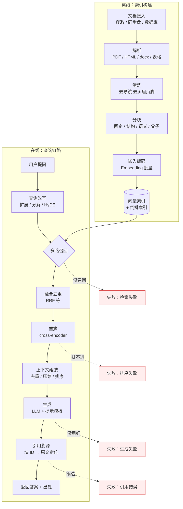
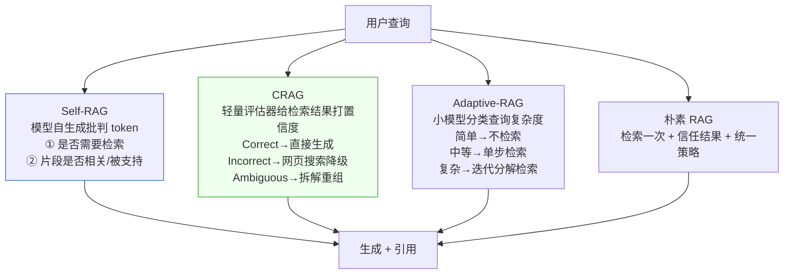
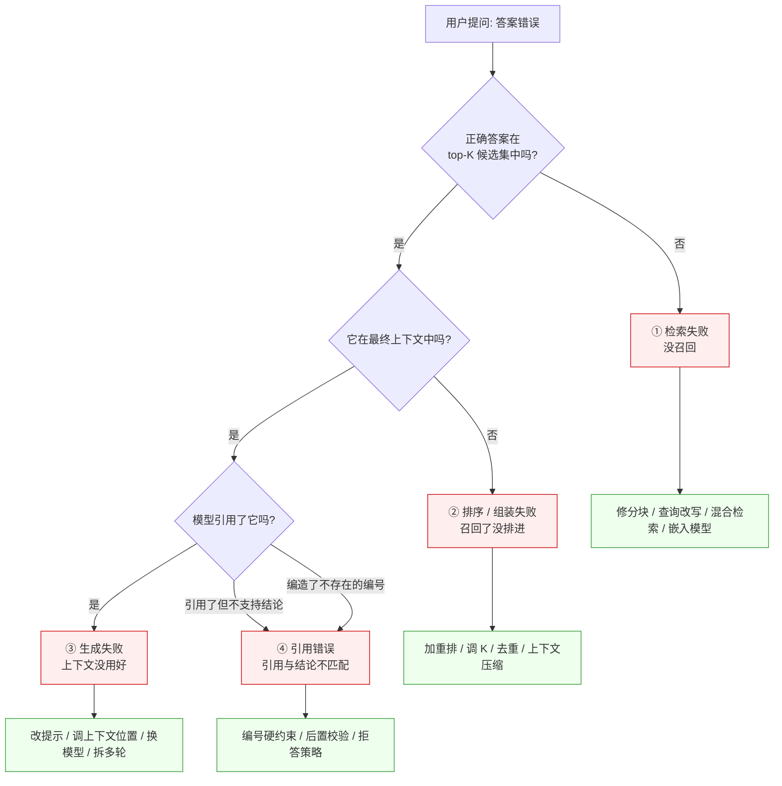

# [[RAG-系统设计]]

> [!tip] 学习目标
> 能独立设计并搭建一个可上线的知识库问答系统：说清每一环的技术选型与取舍，解释固定分块与语义分块在什么场景下谁赢，能把「答错了」拆解成检索/排序/生成/引用四类失败并定位到具体环节，能实现增量更新、文档删除与多租户隔离。

> [!danger] 先说结论：RAG 不是银弹
> ==RAG 只把「知识在哪」这件事外包给了检索系统，它没有消除幻觉，只是把幻觉的成因从「模型不知道」换成了「检索没找到 / 排序没排进 / 模型没用好」。==
> 它的真实价值是三件事：==知识可更新（换索引不重训）、私域数据可用、来源可溯==。它不解决推理能力、不解决数值计算、不解决「知识库里根本没写」的问题。
> 代价同样真实：==延迟叠加、token 成本上升、检索质量直接决定系统上限==。RAG 系统的效果上限由检索器决定，不由生成模型决定 —— 你换 GPT-5 也救不回一个没召回的文档。

---

## 🎯 难度分段学习路径

| 难度 | 核心关注 | 预估时长 |
|---|---|---|
| **入门** | RAG 解决什么问题、完整链路、文档解析、最小可用实现 | 12h |
| **进阶** | 分块策略、嵌入与索引、查询改写、重排、上下文组装、引用溯源 | 20h |
| **高级** | 自反思/纠错/自适应等高级模式、失败模式分类排查、工程化与评估 | 16h |

**总学时**：48h ｜ **前置知识**：[[LLM-基础]]（注意力与上下文窗口）、[[向量数据库]]（索引结构）、[[Prompt-Engineering]]（提示组装）

> [!note] 本篇的分工
> Embedding 模型本身的训练原理、向量索引的内部结构见 [[向量数据库]] 与相关笔记；本篇只讲==在 RAG 系统里怎么用、什么时候不该用==。LoRA/SFT 路线见微调相关笔记。

---

## 📖 第一章 入门（Beginner）

### 1.1 RAG 到底在解决什么问题

**知识点详解**

原始 RAG 论文（Lewis 等，2020）把大模型的记忆分成两半：

| 记忆类型 | 载体 | 特点 | 更新方式 |
|---|---|---|---|
| **参数化记忆** | 模型权重 | 训练时固化，容量有限，无法溯源 | ==只能重新训练== |
| **非参数化记忆** | 外部检索索引 | 容量近乎无限，可溯源 | ==换索引即可== |

原文用了一个很干净的实验来证明「非参数记忆可热插拔」：用 2016 年的维基百科索引问「谁是秘鲁总统」得到 70% 正确率，换成 2018 年索引后，对 2018 年的领导人正确率 68%；而用错索引（2018 索引问 2016 领导人）时正确率暴跌到 12%。==知识更新不需要重训，只要换掉索引==。

RAG 真正解决的四类问题，以及==必须诚实写出的代价==：

| 解决的问题 | 表现 | RAG 怎么解决 | 残留问题 / 代价 |
|---|---|---|---|
| **知识更新滞后** | 模型不知道上周的事 | 索引实时更新，==改数据不改权重== | 解析与索引的延迟 |
| **幻觉** | 编造不存在的条文、号码 | 提供外部证据，==降低幻觉率但不归零== | 检索错 → 照样幻觉 |
| **私域数据** | 公司内部文档、代码库、个人笔记 | 完全在自建索引里 | 权限隔离要自己实现 |
| **来源可溯** | 无法说明答案出处 | 每个块携带元数据，可回链原文 | 模型可能编造引用 |
| *代价：延迟叠加* | 查询链路 = 改写 + 检索 + 重排 + 生成 | — | p95 明显上升；靠缓存、并行、流式输出缓解 |
| *代价：成本上升* | 每次问答输入 token 涨 10-50 倍 | — | 减少 K、上下文压缩、前缀缓存 |
| *代价：上限受限* | ==召回不到就是天花板，与生成模型无关== | — | 混合检索 + 重排 + 查询改写 |
| *代价：排查成本* | 出错时多一层「检索错还是生成错」 | — | 建分层评估集（见 3.4） |
| *代价：注入面扩大* | 检索到的网页里可能藏恶意指令 | — | 信任分级 + 服务端鉴权（见 [[LLM-基础]] 3.4） |

> [!tip] 判断该不该上 RAG 的三个前置问题
> 1. 答案是==不是==确定存在于某个可枚举的文档集合里？否（需要推理/计算/创作）→ RAG 帮不上。
> 2. 答错的代价能否接受？金融/医疗场景里，RAG 提升有限，==流程约束比模型重要==。
> 3. 你的文档能不能被干净地解析出来？==解析质量差就不要往下做分块优化==，那是在垃圾上雕花。

**填空题**

1. 原始 RAG 论文把大模型记忆分为参数化记忆和 ______ 记忆。
2. RAG 论文中「用 2018 年的维基索引回答 2016 年领导人问题」正确率降到 12%，这个实验是为了证明非参数记忆可以 ______。
3. 决定 RAG 系统效果上限的是 ______ 环节，而不是生成模型。
4. RAG 带来的成本上升主要体现在 ______ 消耗上（提示 token）。

**答案**：
1. 非参数化（non-parametric，外部检索索引）
2. 热插拔更新（index hot-swap）——换索引即可更新世界知识，无需重训
3. 检索（召回 + 排序）
4. 输入上下文 token

---

### 1.2 完整链路全景

**知识点详解**

一条 RAG 链路分**离线**与**在线**两条线。==把这两条线分清楚，是理解所有 RAG 工程问题的前提==：离线是数据工程问题，在线是算法/系统问题。

| 阶段 | 离线（索引构建） | 在线（查询） | 常见故障 |
|---|---|---|---|
| 1 文档接入 | 爬取 / 同步盘 / 数据库导出 | — | 漏抓、权限文件混入 |
| 2 解析 | PDF/HTML/docx → 纯文本 + 结构 | — | ==乱码、丢表格、导航栏污染== |
| 3 分块 | 切成 chunk + 附元数据 | — | 跨块截断、块太大 |
| 4 嵌入 | 调用 embedding 模型批量编码 | 查询编码 | 模型不匹配语种 |
| 5 索引 | 写入向量库 + 建倒排 | 相似度检索 / 关键词检索 | 距离度量用错 |
| 6 查询改写 | — | 改写 / 扩展 / 分解 | 改写跑偏 |
| 7 检索 | — | 多路召回（向量 + BM25） | ==没召回== |
| 8 重排 | — | cross-encoder / LLM 打分 | 召回了没排进上下文 |
| 9 组装上下文 | — | 选块、压缩、排序 | 噪声挤占预算 |
| 10 生成 | — | 拼 prompt 调 LLM | 没用好上下文 |
| 11 引用溯源 | — | 块 ID 回链原文 | ==编造出处== |



> [!tip] 排障的第一原则
> ==不要从「模型答得不好」开始倒推。==先看第 7 步：把 top-K 检索结果和人工标注的正确答案并排打印。答案压根不在候选集里 → 检索失败；答案在候选集里但没进最终上下文 → 排序/组装失败；答案在上下文里但模型没用 → 生成失败。==这三类问题的修法完全不同，混在一起调参是浪费时间==。

**填空题**

1. RAG 的离线链路负责的是解析、分块、嵌入和 ______。
2. 排障第一步应该打印 top-K 检索结果并与人工标注对比，而不是直接调 ______ 的参数。
3. 离线链路的 3 个主要故障点是解析乱码/丢表格、______ 污染、以及分块时的跨块截断。
4. 区分「检索失败」与「排序失败」的关键判据是：正确答案是否出现在 top-K ______ 候选集中。

**答案**：
1. 索引构建（写入向量库并建索引）
2. 生成模型（大语言模型）
3. 导航栏/页眉页脚等模板噪声
4. 召回（召回候选集）

---

### 1.3 文档解析：整条链路的垃圾入口

**知识点详解**

> [!danger] 最重要的一句话
> ==RAG 系统的效果上限由检索决定，而检索的上限由解析决定。==解析把表格变成一行乱码、把双栏 PDF 的两栏拼成一行，后面所有分块、嵌入、检索的优化都只是在补救。

各格式的解析难点与处理方式：

| 格式 | 难点 | 处理要点 | 可用工具 |
|---|---|---|---|
| **文本 PDF** | 多栏错乱、页眉页脚混入、连字符断词 | 按列检测切分；删除重复出现的页眉行 | PyMuPDF、pdfplumber |
| **扫描件 PDF** | 无文本层，全是图 | ==必须 OCR==；表格/公式 OCR 质量远低于正文 | MinerU、OCRmyPDF |
| **HTML** | 导航栏、广告、推荐位、页脚大量重复 | 正文抽取 + 密度/链接比过滤 | trafilatura、readability |
| **Markdown** | 基本无难度 | ==直接按标题层级保留结构信息== | 原生解析即可 |
| **docx** | 表格与图片需单独抽取 | 保留标题样式（Heading 1/2/3）作为结构标记 | python-docx |
| **表格** | 线性化后语义崩掉 | 每行加表头前缀，或整表转成 Markdown 表格 | 需专门处理 |
| **图片 / 图表** | 纯文本通道拿不到信息 | 多模态模型转描述后入库，或只保留图注 | 视觉模型 |

OCR 的现实判断：==清晰印刷体扫描件可用；手写体基本不可用（错误直接污染索引）；表格扫描件行列错位很常见，务必人工抽检；带公式的论文需要专门模型==，通用 OCR 会把公式变成乱码。

> [!tip] 解析质量必须能量化
> 不要靠「看起来还行」。抽 20-50 个块人工看：有多少条句子不通顺、多少条表格变成乱码。==这个数字会直接解释你后面 20% 的检索失败==。业内常用做法是把解析后的纯文本随机抽样人工过一遍并记录错误率，作为离线流水线的质量门禁。

**填空题**

1. RAG 效果的上限由 ______ 决定，而检索的上限又由 ______ 决定。
2. 扫描件 PDF 因为没有 ______ 层，必须经过 OCR 才能入库。
3. HTML 解析时去除导航栏和广告的常用思路是正文抽取 + ______ 比 / 文本密度过滤。
4. 表格线性化后语义容易崩掉，常用的补救是给每行加上 ______ 前缀。

**答案**：
1. 检索效果上限，文档解析质量
2. 文本（text layer）
3. 链接密度（或文本密度）
4. 表头（column header）

---

### 1.4 最小可用 RAG：先跑通，再谈优化

**知识点详解**

工程顺序必须是：==先用一个能跑的粗糙版本把端到端链路和评估集建起来==，再做优化。反过来做（一上来就调分块、换嵌入模型）会陷入无法归因的玄学调参。

最小版本的要素清单：

| 要素 | 最小选择 | 后续可替换为 |
|---|---|---|
| 解析 | Markdown / 文本 PDF 直读 | MinerU、docling 等结构化解析 |
| 分块 | 固定大小 + 20% 重叠 | 结构分块 / 父子分块 |
| 嵌入 | 一个中文效果够用的嵌入模型 | 多语言嵌入、加长上下文嵌入 |
| 索引 | 单机向量库（Chroma / FAISS） | 分布式向量库 |
| 检索 | 纯向量 top-20 | 混合检索 + 重排 |
| 生成 | 一个指令模型 | 换更大模型（收益远小于修检索） |

```python
# 最小 RAG 骨架：先跑通链路，再逐环替换
import hashlib

def chunk_fixed(text: str, size: int = 500, overlap: int = 100) -> list[str]:
    """固定大小分块。overlap 约为 size 的 20% 是常用起点。"""
    step = size - overlap
    return [text[i:i + size] for i in range(0, max(len(text) - overlap, 1), step)]

def build_index(chunks: list[dict], embed_fn, vector_store) -> int:
    """离线：批量嵌入 + 写库。chunks 里必须带 doc_id。"""
    for c in chunks:
        c["chunk_id"] = hashlib.md5(
            f"{c['doc_id']}:{c['text'][:64]}".encode()
        ).hexdigest()[:16]
        c["vector"] = embed_fn(c["text"])
        vector_store.upsert(c)   # 元数据与向量必须一起存，否则无法溯源
    return len(chunks)

def retrieve(query: str, embed_fn, vector_store, k: int = 20) -> list[dict]:
    """在线：粗召回。k 取得比最终上下文多，因为后面要重排和截断。"""
    return vector_store.search(embed_fn(query), top_k=k)

def build_context(hits: list[dict], budget_tokens: int, count_fn) -> str:
    """按重排分数顺序装入，遇超预算即停。顺序取舍见 2.5 节。"""
    parts, used = [], 0
    for h in hits:
        t = count_fn(h["text"])
        if used + t > budget_tokens:
            break
        parts.append(f"[{h['chunk_id']}] {h['text']}")
        used += t
    return "\n\n".join(parts)
```

> [!tip] 骨架里两个容易被忽略的设计
> 1. ==`chunk_id` 必须在写库时就生成并存进元数据==。事后补的引用溯源对不上原文，这是 RAG 项目返工的头号原因。
> 2. ==粗召回的 k 要远大于最终上下文块数==。k=20 召回、选 5 进上下文是常见配置；k=5 召回直接进上下文，等于放弃了重排。

**填空题**

1. 固定大小分块中，overlap 常用的起点比例约为块大小的 ______。
2. 粗召回的 top-k 应当 ______ 最终放进上下文的块数，以便重排和截断。
3. `chunk_id` 必须在 ______ 阶段生成并存入元数据，否则引用无法回链原文。
4. 工程上正确的顺序是先跑通 ______ 版本并建好评估集，再逐环优化。

**答案**：
1. 20%
2. 大于（远大于）
3. 离线索引写入（离线建库）
4. 最小可用（粗糙端到端）RAG

---

### 1.5 第一章综合练习

**填空题（本章共 4 道，答案见下方）**

1. 原始 RAG 论文把「换索引即可更新世界知识」的能力称为非参数记忆的 ______。
2. 决定 RAG 系统效果上限的两个环节依次是 ______ 和 ______。
3. 扫描件 PDF 缺少 ______ 层，必须 OCR；扫描的手写体与公式 OCR 质量通常 ______。
4. HTML 解析的经典难点是导航栏、广告、推荐位等 ______ 内容污染正文。

**本章答案**：
1. 热插拔（hot-swap）更新
2. 检索效果上限，文档解析质量
3. 文本，基本不可用
4. 模板噪声（重复出现的非正文内容）

**综合项目**：拿 20 份你手头的真实文档（混合 PDF / HTML / Markdown / docx），实现一条最小 RAG 链路。
- **输入**：20 份文档 + 30 个你手写的问答对（必须标注文档名）。
- **步骤**：① 解析全部文档并导出纯文本；② 随机抽 30 个块人工标注「是否解析正确」，算解析错误率；③ 固定大小分块（500/100）并入库；④ 只用向量检索生成答案；⑤ 人工标注 30 题中「答案是否在 top-20 候选集里」。
- **产出物**：一份 markdown 报告，含解析错误率、检索召回率、以及 3 个最典型的解析失败案例。
- **验收标准**：==解析错误率 < 10%；检索召回率 > 80%==。若召回率不达标，==禁止进入第二章去调分块，先把解析修好==。

> [!tip] 常见陷阱
> 1. **一上来就调分块和嵌入模型**：没有评估集时所有优化都是玄学，==先建评估集再优化==。
> 2. **解析质量靠肉眼**：不量化解析错误率，就永远不知道垃圾是从哪进来的。
> 3. **元数据事后补**：`chunk_id` / 源文件路径没在写库时存好，引用溯源必然做不出来。
> 4. **粗召回 k 等于上下文块数**：k=5 召回直接进上下文，等于把重排这一环整个跳过。

> [!note] 本章权威资料
> - [Retrieval-Augmented Generation for Knowledge-Intensive NLP Tasks](https://arxiv.org/abs/2005.11401) — 原始 RAG 论文，参数化/非参数化记忆、索引热插拔实验
> - [Retrieval-Augmented Generation for Large Language Models: A Survey](https://arxiv.org/abs/2312.10997) — Naive / Advanced / Modular RAG 三代范式的划分
> - [Unstructured 文档分区文档](https://docs.unstructured.io/open-source/core-functionality/partitioning) · [MinerU](https://github.com/opendatalab/MinerU) — 复杂 PDF/扫描件解析
> - [LlamaIndex 摄取管线（ingestion pipeline）文档](https://docs.llamaindex.ai/en/stable/module_guides/loading/ingestion_pipeline/) — 解析到节点的工程化流程

---

## 📖 第二章 进阶（Intermediate）

> [!warning] 与上一章的衔接
> 第一章解决「链路能跑通」，本章解决「每一环怎么调优」。本章的 6 小节对应链路第 3、4、5、6、8、9、11 步。==跳过第一章直接看本章，会失去评估集和 chunk_id 这两个前提==。

### 2.1 分块策略：RAG 调优的第一战场

**知识点详解**

分块同时约束两件事：==块太大，嵌入向量被无关内容稀释；块太小，句子失去上下文，检索到了也答不出来==。所有分块策略都是在这两者间取平衡。

#### 2.1.1 固定大小分块（滑动窗口）

把文本按固定 token 数切，块之间保留重叠（overlap）。

| 参数 | 取值依据 | 调整方向 |
|---|---|---|
| `chunk_size` | ==问题的粒度==：事实型问答 300-500 token；需要推理/总结 800-1500 | 答案常被截断 → 调大；向量被稀释 → 调小 |
| `overlap` | 常用起点 ==块大小的 10-20%== | 答案常在边界被切断 → 调大 |

重叠的取值依据与代价：

| overlap 取值 | 效果 | 代价 |
|---|---|---|
| 0 | 最省索引空间 | ==答案正好横跨边界时必然丢失==，且上下句指代断裂 |
| 10-20% | 覆盖大部分边界截断，性价比最高 | 索引膨胀 20%、检索出现近重复块 |
| 50% | 边界问题基本消失 | ==索引翻倍、top-k 被同一内容的多个副本占满==，重排失效 |
| > 50% | 无意义 | 纯浪费 |

> [!danger] 过高 overlap 的隐性危害
> 很多人只知道 overlap 能防截断，不知道它会挤占 top-k 名额。==当一个段落的 3 个副本占据了 top-10 中的 3 席，另 2 个真正相关的块就被挤出去了==，而重排模型对近乎重复的内容给出的分数也几乎一样，去重逻辑再差一点，重排就等于没做。**结论：overlap 从 20% 起步，召回不满再单独调，不要一次调到位。**

优点是实现极简、无需额外模型、结果可预测；缺点是破坏语义边界（可能截断句子或表格）。==适用于结构不规则的纯文本，并应作为所有方案的基线==。

#### 2.1.2 按结构分块（递归分块）

按文档自身的结构标记切：Markdown 标题层级、HTML 标签、docx 标题样式、PDF 章节。块内语义完整，==召回到即可直接回答==，适用于 Markdown、知识库、产品文档、代码文件；缺点是依赖文档有结构，短章节会产生过小的块。

实现思路：维护一个分隔符优先级列表（如 `\n## ` > `\n### ` > `\n\n` > 空行 > 字符），先按最高优先级切，切出的块若超长再按下级分隔符递归切，还超长才硬切。推荐粒度：API 文档一个端点、技术书一个小节、代码一个函数、会议纪要一条决议。

#### 2.1.3 语义分块

思路：==把相邻句子的嵌入向量依次计算余弦相似度，在相似度出现「断崖」的句子对处切开==。

```python
import numpy as np

def semantic_chunks(sentences, emb_fn, threshold_pct=85):
    """按相邻句相似度的分位数阈值切分。相似度骤降处即为语义边界。"""
    vecs = np.stack([emb_fn(s) for s in sentences])
    sims = [
        float(np.dot(vecs[i], vecs[i + 1]) / (np.linalg.norm(vecs[i]) * np.linalg.norm(vecs[i + 1])))
        for i in range(len(vecs) - 1)
    ]
    # 用分位数而非固定阈值：不同文档相似度分布差异极大
    cut = np.percentile(sims, threshold_pct)
    chunks, buf = [], [sentences[0]]
    for i, s in enumerate(sims):
        if s < cut:
            chunks.append(" ".join(buf))
            buf = [sentences[i + 1]]
        else:
            buf.append(sentences[i + 1])
    chunks.append(" ".join(buf))
    return chunks
```

> [!warning] 语义分块的实证结论
> 有一项系统性评测（[Is Semantic Chunking Worth the Computational Cost?](https://arxiv.org/abs/2410.13070)，NAACL 2025 Findings）用文档检索、证据检索、答案生成三个代理任务比较了语义分块与固定大小分块，结论是：==语义分块在某些场景有收益，但收益高度依赖任务，且在更接近真实世界的非合成数据集上，固定大小分块经常更好==。该文还指出，分块策略的影响常常被嵌入模型质量这一因素盖过。
> **工程含义**：==不要因为「语义分块听起来更高级」就默认采用它==。它多一遍嵌入计算（离线成本），收益不稳定。先用固定大小跑通，再在你的数据上实测对比。

#### 2.1.4 父子分块 / 小大（small-to-big）

思路：==用小块去做嵌入与检索，用大块（包含小块及其周边上下文）去做生成==。

| 步骤 | 做法 | 收益 |
|---|---|---|
| 建索引 | 每个子块存自己的向量，同时记录其 `parent_id` | 检索粒度小，向量精准 |
| 检索 | 对子块做向量检索 top-k | 命中率高 |
| 组上下文 | ==把子块映射回父块==，把父块内容送进 LLM | 保留完整上下文，答案可用 |

| 优点 | 缺点 | 适用场景 |
|---|---|---|
| 同时拿到「检索精准」与「生成有上下文」 | 索引需存父子映射，实现复杂；父块过大浪费 token | ==技术文档、合同、论文：答案需要跨段上下文== |

实现上通常有两种变体：多向量索引（每个 chunk 配一份「用于生成的摘要向量」）与父子节点索引。本质都是==检索用一套粒度，生成用另一套粒度==。

#### 2.1.5 策略对照与选型

| 策略 | 适用场景 | 主要失败模式 |
|---|---|---|
| **固定大小** | 纯文本、结构不规则、作为基线 | 截断句子/表格；把条件与结论切开 |
| **按结构** | Markdown、docx、API 文档 | 无结构文档退化；短章节块过小 |
| **语义** | 主题边界清晰的长文；主题连续变化的语料 | 阈值敏感；计算成本高；==收益不稳定== |
| **父子 / 小大** | 答案需跨段推理的长文档 | 父块过大导致噪声；实现与存储复杂度上升 |
| **句子级窗口 + 表格独立** | 表格密集的报告 | 表格被切碎后完全不可用 |

> [!tip] 选型决策顺序（工程共识）
> 1. 文档有结构 → 按结构分块（收益最确定、成本最低）。
> 2. 文档无结构 → 固定大小 + 20% overlap 作基线。
> 3. 答案需要跨段上下文 → 加父子分块。
> 4. ==以上都测过了仍然不达标，再考虑语义分块==，并且必须实测对比。

**填空题**

1. 固定大小分块中 overlap 的常用起点是块大小的 10-20%，过高 overlap 的主要危害是 ______。
2. 递归分块通过维护一个 ______ 优先级列表来实现先按高优先级结构切、超长再往下级切的逻辑。
3. 语义分块通过计算相邻句嵌入的 ______ 相似度并在其出现断崖处切分。
4. 父子分块（小大）方案中，嵌入与检索用 ______ 块，送入大模型生成用 ______ 块。

**答案**：
1. top-k 名额被同一内容的近重复副本挤占，导致重排失效
2. 分隔符（separator）
3. 余弦相似度
4. 小（子块），大（父块）

---

### 2.2 嵌入与索引

**知识点详解**

| 环节 | 关键决策 | 踩坑点 |
|---|---|---|
| 嵌入模型选择 | 语种匹配（中英混排要实测）、上下文长度、维度 | ==换了嵌入模型必须重建全库索引==，向量不能混用 |
| 维度 | 256 / 512 / 1024 / 1536 | 维度越高存储与检索越贵，收益递减；与距离度量绑定 |
| 距离度量 | ==归一化后余弦 == 内积==；未归一化则用欧氏 | ==度量选错会让排序完全失真== |
| 索引结构 | HNSW（快、内存大）、IVF（省内存、可训练）、磁盘索引 | 参数（ef_construction / nprobe）影响召回与延迟权衡 |

> [!danger] 最容易犯的索引错误
> ==用未归一化的向量 + 余弦相似度，或者归一化的向量 + 欧氏距离的等价假设搞混。==更隐蔽的是「同一库里混用了不同嵌入模型的向量」——两个模型的向量空间不可比，相似度分数毫无意义，==且系统不会报错，只会安静地给出垃圾结果==。**给每个索引打上模型版本标签，模型换代时强制重建。**

混合检索的动机：==稠密向量检索擅长语义，BM25 擅长精确词==。稠密检索在同义改写与跨语言上强，但在精确词匹配（型号、错误码、缩写、人名）上容易失手；BM25 反之。两者互补，实践中混合检索几乎是默认配置。融合方法：

| 方法 | 做法 | 特点 |
|---|---|---|
| **RRF**（倒数排名融合） | `score = Σ 1/(k + rank_i)`，k 常取 60 | ==不需要归一化分数，是最稳的默认选择== |
| 加权求和 | 归一化后 `α·dense + β·bm25` | 需要调 α/β 与分数归一化 |
| 分数归一化后相加 | min-max 归一化各路分数 | 对分数分布敏感 |

**填空题**

1. 同一索引中混用不同嵌入模型的向量会导致相似度分数 ______，且系统通常不会报错。
2. 未归一化的向量常用 ______ 距离；归一化后用内积与余弦等价。
3. 稠密向量检索在 ______ 词（型号、错误码、缩写）上容易失手，需要与 BM25 混合。
4. RRF 融合的优势是不需要对各路检索分数做 ______。

**答案**：
1. 毫无意义（安静地返回垃圾结果）
2. 欧氏（L2）
3. 精确词 / 专有名词
4. 归一化（或校准）

---

### 2.3 查询改写与多路召回

**知识点详解**

用户问「这玩意儿的保质期多久」和文档里写的「产品有效期」之间存在词汇鸿沟。查询改写就是缩小这个鸿沟。

| 技术 | 做法 | 解决什么 | 代价 |
|---|---|---|---|
| **多查询（multi-query）** | 让 LLM 把原问题改写成 3-5 个不同角度的变体，各自检索后融合 | 提高召回覆盖 | 一次查询 = N 次检索，延迟与成本上升 |
| **查询分解（decompose）** | 把复合问题拆成若干子问题，先检索再逐个回答后合并 | ==多跳问题==（需要两次检索才能答） | 需要多轮推理，延迟最高 |
| **HyDE** | ==让 LLM 先「写一段假想的答案文档」==，再用这段假想文档去检索 | 极短查询与文档表述差异大时 | 多一次生成调用；假想内容可能带偏 |
| **指代消解 / 补全** | 把「它的价格呢」补成完整独立问题 | 多轮对话 | 依赖对话历史管理 |

**HyDE 的核心洞察**：稠密检索器是在「文档-文档」空间里做相似度，而不是「查询-文档」。==让指令模型先生成一段假想文档（捕捉相关性模式，但内容是编的），再编码这段假想文档去检索真实语料==。假想文档中的错误细节会被编码器的稠密瓶颈「压掉」。详见 [[向量数据库]]。

**改写的边界**：==查询改写只能提升召回，不能修正语料。==如果正确答案压根不在知识库里，再多路召回也召不回来 —— 此时正确的行为是**让系统说「知识库中没有相关信息」**，而不是强行用最相近的内容拼一个答案。这一点需要写进系统提示并在后处理里强制校验。

**填空题**

1. 多查询（multi-query）通过生成多个 ______ 角度的查询变体来提高召回覆盖。
2. 复合问题需要多次检索才能回答，称为 ______ 跳问题，用查询分解处理。
3. HyDE 的做法是先生成一段 ______ 答案文档，再用它去检索真实语料。
4. 查询改写能提升 ______，但无法修正语料本身缺失的事实。

**答案**：
1. 不同（改写）
2. 多
3. 假想 / 假设性的
4. 召回率

---

### 2.4 重排：把「找到」变成「排进去」

**知识点详解**

粗召回为了不漏，必须宽（k=20~100）；但生成上下文装不下这么多。==重排就是在这两者之间搭一座桥==。

| 方案 | 机制 | 精度 | 成本 | 备注 |
|---|---|---|---|---|
| 无重排 | 直接用向量相似度排序 | 低 | 最低 | 基线 |
| **Cross-encoder** | 把 query 与 doc 拼在一起送进 BERT 类模型算相关性 | ==高== | 每对一次前向，k×次 | 工业界默认；可离线批量化 |
| **LLM 打分** | 让大模型对每个候选打 1-5 分 | 最高 | 高（延迟大） | 候选数少时用，或做二级重排 |
| 混合 | cross-encoder 先排，再用 LLM 复核 top-3 | 很高 | 较高 | 效果与成本的折中 |

跨编码器（cross-encoder）与双编码器（bi-encoder）的本质差别：双编码器对 query 与 doc ==分别==编码，无 token 级交互、只有末态向量，因此**文档可离线预计算**、检索快但精度受限；跨编码器把两者 ==拼在一起==编码，有逐 token 注意力交互，精度高但 ==不能预计算，必须在线逐对算==，线性扫全库不可行。

> [!tip] 这就是为什么是两阶段
> ==两阶段检索用「快」的做粗排保召回，用「准」的重排提精度== —— 这是当前工业界几乎无例外的架构。

ColBERT 走的是第三条路：双编码器分别编码，但保留每个 token 的向量，查询时用 MaxSim 做**后交互**（late interaction），在保持文档可预计算的同时拿到细粒度匹配精度，是介于两者之间的方案。

> [!note] 检索质量的经典观察
> 「中间迷失」（Lost in the Middle）论文的开放域问答案例给了一个很实用的工程结论：==阅读器模型的表现远在检索器召回率见顶之前就饱和了——使用超过 20 篇检索文档只带来约 1.5%（GPT-3.5-Turbo）/ 1%（Claude 1.3）的提升，却显著增加了上下文长度、延迟与成本==。这直接支持了两件事：**有效重排**（把相关内容往前推）与**必要时截断列表**（少给几篇）。

**填空题**

1. 粗召回的 k 取得大是为了保 ______，重排是为了提高送入上下文的精度。
2. 跨编码器必须把 query 与文档 ______ 编码，因此无法离线预计算文档。
3. 双编码器可预计算文档是因为它对 query 与 doc **分别**编码，缺少 token 级 ______ 交互。
4. 「中间迷失」论文的开放域问答案例表明，检索文档超过 20 篇后阅读器收益仅约 ______。

**答案**：
1. 召回率
2. 拼接在一起
3. 注意力
4. 1.5%（Claude 约 1%）

---

### 2.5 上下文组装：顺序、预算、去重

**知识点详解**

这是最被低估、却直接影响答案质量的一步。

#### 2.5.1 顺序：相关度升序还是降序

这是 RAG 圈最经典的争论，==两种顺序都有实证依据，不存在唯一正确答案==。

| 证据 | 结论 |
|---|---|
| 「中间迷失」（Lost in the Middle）论文 | 模型对上下文的利用呈 **U 形**：信息在开头或结尾时表现最好，**在中间时显著下降** |
| 同论文对检索增强阅读器的建议 | ==「有效重排（把相关内容推到上下文靠前位置）」与「列表截断」被点名为有前景的方向== |
| 上下文缓存实践 | 稳定前缀在前有利于**前缀缓存命中**，而把最相关的放开头正是大量框架的默认实现 |
| 同论文的查询感知上下文化实验 | ==在文档前后各放一遍问题，可让键值检索类任务表现大幅提升甚至做到完美== |

> [!tip] 实践建议：不要让相关内容落在无提示的中间地带
> ==开头位置利于缓存复用与「开头效应」，结尾位置利于规避「中间迷失」。==成本敏感就把最相关的放开头（利于前缀缓存）；质量优先就放开尾。==无论选哪种，都应在提示里重复一遍问题（查询感知上下文化），把相关内容「顶」到首尾的有效位置上==。真正错误的做法是让相关内容无提示地沉在上下文中段。

#### 2.5.2 上下文预算分配

上下文不是「有多少塞多少」，要按用途分配。

| 预算项 | 建议 | 说明 |
|---|---|---|
| 系统提示 + 输出预留 | 固定小头 | 预留输出空间，否则长回答被截断 |
| 历史对话 | 滚动摘要或只留最近 N 轮 | 多轮场景下历史会挤爆预算 |
| 检索材料 | ==按重排分数从高到低动态填充==，超预算即停 | 不要为了凑数塞低分块 |
| 指令与格式要求 | 固定小头 | 引用格式要求要占位 |

> [!danger] 「宁多勿少」是错的
> ==塞进上下文的低分块不只是浪费 token，它会主动降低答案质量== —— 噪声材料会让模型把不相干内容也「融合」进答案，制造新的幻觉。**证据：** 开放域问答中阅读器表现远在召回率见顶前就饱和，说明多给的文档模型基本没在用。

#### 2.5.3 去重与压缩

去重与压缩的四项技术：==近重复去除==（重叠分块副本，==基本必做==）、==内容级去重==（相似度超 0.95 只留最高分，用于转载与多版本语料）、==上下文压缩==（只保留与查询相关的句子，或用小模型抽取式压缩）、==摘要替换父块==（原文过长且只需要大意时）。标准流水线：近重复去除 → 内容级去重 → 超长块做句子级相关性打分 → 按分数动态填预算 → 遇超预算即停。

**填空题**

1. 「中间迷失」论文发现模型对上下文信息的利用呈 ______ 形曲线，中部信息最容易被忽略。
2. 无论把最相关内容放开头还是放开尾，共同的实践建议都是在提示里 ______ 一遍问题（查询感知上下文化）。
3. 重叠分块产生的近重复块必须去除，否则会 ______ top-k 名额并使重排失效。
4. 上下文预算应预留一部分给 ______，否则长回答会在生成中途被截断。

**答案**：
1. U
2. 重复
3. 挤占
4. 输出（生成长度）

---

### 2.6 引用与溯源

**知识点详解**

RAG 相对纯参数化记忆的核心优势之一就是可溯源，但这个能力需要显式设计。

四种引用粒度：==**块级引用**==（块带 `[1] [2]` 编号，回答里标 `[1]`；==实现简单，绝大多数场景够用==，缺点是块内可能只有一句相关）、**句子级引用**（块内句子编号，可核对到句，但提示更复杂、模型更容易标错）、**段落级 + 页码**（块携带 PDF 页码坐标，对扫描件与法规体验好，需解析阶段保留版面信息）、**元数据回链**（答案附 `doc_id` + `chunk_id` + 路径 + 时间戳，可跳回原文并判断时效，需离线存全）。

防止引用幻觉（模型编造不存在的出处）的五层手段：

| 手段 | 做法 | 有效性 |
|---|---|---|
| **编号硬约束** | 只允许引用上下文中出现过的编号，并在提示里写明「只能引用 [n] 形式」 | 高，==成本最低、必做== |
| **后置校验** | ==把回答里出现的所有引用编号，与实际注入的块 ID 集合求交集==，出现不在集合中的编号即判失败 | ==高，能兜住模型偶发编造== |
| **句子级对齐** | 校验被引句子是否真的包含答案字符串 | 中，能抓住「引用了但不支持」的情况 |
| **忠实度评分** | 用模型或 NLI 模型判断答案是否被引用内容支持 | 中，成本高，适合离线评估 |
| **无法作答则拒答** | 提示里明确「材料不足时回答『知识库中没有相关信息』」 | 高，==同时防止硬凑答案== |

```python
import re

def verify_citations(answer: str, allowed_ids: set) -> dict:
    """后置校验：拦截模型编造的引用编号。"""
    cited = set(re.findall(r"\[(\w+)\]", answer))
    fabricated = cited - allowed_ids
    if fabricated:
        # 命中即说明模型产生了幻觉引用，应拦截或降级为无引用回答
        return {"ok": False, "fabricated": sorted(fabricated)}
    if not cited:
        return {"ok": False, "reason": "无引用：可能是拒答，也可能是幻觉，需按业务判定"}
    return {"ok": True, "cited": sorted(cited)}
```

> [!tip] 溯源设计必须在离线阶段就做
> ==引用溯源不是生成阶段的后处理，它是离线写库时元数据设计的延续。==如果离线没存 `doc_id` / `chunk_id` / 页码 / 更新时间，在线无论怎么写校验逻辑都补不回来。见 1.4 节的 `chunk_id` 设计。

**填空题**

1. 块级引用的编号必须来自注入上下文中实际存在的块 ID 集合，靠 ______ 约束防止模型编造。
2. 防止引用幻觉最有效且成本最低的手段是在回答中只允许使用 ______ 形式的编号。
3. 回答后置校验的做法是把引用编号与实际注入的 ______ 求交集，出现集合外的编号即判失败。
4. 引用溯源能力依赖离线阶段写入的 ______ 等元数据，事后补是补不回来的。

**答案**：
1. 提示词硬约束
2. `[n]`（方括号编号）
3. 块 ID 集合
4. `doc_id`、`chunk_id`、页码、更新时间

---

### 2.7 第二章综合练习

**填空题（本章共 4 道，答案见下方）**

1. 固定大小分块中 overlap 从块大小的 20% 起步，若继续调大会导致近重复块 ______ top-k 名额。
2. RRF 融合不需要对各路检索分数做 ______，这是它成为默认选择的原因。
3. 两阶段检索中，双编码器负责保 ______，跨编码器负责提 ______。
4. 「中间迷失」论文的 U 形曲线表明，模型对上下文的利用在 ______ 和 ______ 位置最好。

**本章答案**：
1. 挤占
2. 归一化 / 校准
3. 召回率，精度
4. 开头，结尾

**综合项目**：给第一章的项目加上「查询改写 + 混合检索 + 重排 + 引用溯源」，做成一个能回答的项目。
- **输入**：第一章的 20 份文档与 30 个问答对。
- **步骤**：① 文档块级引用编号写入元数据；② 实现查询改写（多查询或 HyDE）；③ 接入 BM25 与向量检索并用 RRF 融合；④ 接入一个 cross-encoder 做重排；⑤ 组装上下文时做近重复去除与预算控制；⑥ 生成时要求带 `[n]` 引用；⑦ 生成后用 `verify_citations` 校验。
- **产出物**：一个可交互的问答脚本 + 一份对比报告（朴素 RAG vs 增强 RAG 的 30 题准确率、引用正确率、平均延迟、平均 token 成本）。
- **验收标准**：==准确率相对朴素版提升 ≥ 15 个百分点；引用正确率 = 100%（无编造编号）；P95 延迟 < 5 秒==。

> [!tip] 常见陷阱
> 1. **overlap 一把调到 50%**：索引翻倍、近重复块挤占 top-k、重排形同虚设。
> 2. **换嵌入模型不重建索引**：新旧向量混在一库里，检索结果静默崩坏。
> 3. **距离度量用错**：未归一化向量配余弦相似度，排序失真。
> 4. **把资料全塞进上下文**：低分块不只是浪费 token，还会引入新的幻觉。
> 5. **只做块级引用不校验**：模型编造 `[7]` 而上下文只有 5 个块，用户点开发现不存在。
> 6. **用「上下文缓存友好」当唯一排序依据**：把相关内容放在无提示的中间地带，恰好触发「中间迷失」。

> [!note] 本章权威资料
> - [Lost in the Middle: How Language Models Use Long Contexts](https://arxiv.org/abs/2307.03172) — U 形曲线、查询感知上下文化、阅读器收益饱和的开放域问答案例
> - [Is Semantic Chunking Worth the Computational Cost?](https://arxiv.org/abs/2410.13070) · [ACL Anthology 版本](https://aclanthology.org/2025.findings-naacl.114/) — 语义分块与固定分块的系统评测
> - [ColBERT: Efficient and Effective Passage Search via Contextualized Late Interaction over BERT](https://arxiv.org/abs/2004.12832) — 后交互方案
> - [Hybrid search：LangChain 检索概念文档](https://python.langchain.com/docs/concepts/retrieval/) · [上下文压缩](https://python.langchain.com/docs/how_to/contextual_compression/) — 工程实现参考
> - [Anthropic: Contextual Retrieval](https://www.anthropic.com/news/contextual-retrieval) — 给块补充上下文说明以提升召回的工业实践
> - [FlagEmbedding（BGE 嵌入与重排模型）](https://github.com/FlagOpen/FlagEmbedding) — 中文嵌入与 cross-encoder 重排的常用开源实现

---

## 📖 第三章 高级（Advanced）

> [!note] 深度标准
> 本章区分两类内容：==**工程共识**（已在生产环境验证、建议默认采用）== 与 ==**研究前沿**（论文方案、收益依场景而定、需自行实测）==。不把论文当银弹，也不轻视论文。

### 3.1 高级 RAG 模式

**知识点详解**

Naive RAG 的三个已知弱点：==只检索一次==、==无条件信任检索结果==、==所有查询用同一策略==。高级模式分别针对这三点。

#### 3.1.1 Self-RAG：批判 token 驱动的按需检索

**机制**：训练一个 LLM 在生成过程中同时输出两类特殊 token。

| token 类型 | 作用 | 推理期用法 |
|---|---|---|
| **检索 token**（`Retrieve`） | ==决定这一段是否需要检索== | 概率超过阈值才触发检索；可按任务调高/调低检索频率 |
| **批判 token**（critique） | 评价检索片段的**相关性**、**是否支持生成**、**回答的完整性** | 段级 beam search 用批判 token 概率加权打分，选最优候选 |

流程：生成一段 → 决定是否检索 → 检索 K 段 → 批判片段相关性 → 基于片段生成 → 批判是否被支持 → 选最优候选。==它把「要不要检索」和「这段靠不靠谱」都交给模型自己判断==。

> [!tip] 论文给出的一个值得记住的量化观察
> Self-RAG 项目页指出：==检索次数减少对不同任务影响差异巨大——开放域问答（PopQA）相对性能下降约 40%，而事实核查任务（PubHealth）只下降约 2%==。**这说明「该不该检索」必须按任务分别调，不能一刀切。**

**边界**：Self-RAG 需要**专门训练**模型（用带批判 token 的自反思数据），不是拿来就能套在你现有的通用 API 模型上。==没有训练资源的团队，参考它的思想（按需检索 + 检索质量批判）用提示 + 小模型实现即可==。

#### 3.1.2 CRAG：检索质量分级 + 降级策略

**机制**：一个**轻量检索评估器**给检索结果打一个置信度，据此触发三种动作。

| 置信度档位 | 动作 | 含义 |
|---|---|---|
| `Correct` | ==直接用内部知识生成== | 检索结果够用 |
| `Incorrect` | ==触发网页搜索扩展知识源== | 内部语料检索失败，降级到开放网络 |
| `Ambiguous` | ==拆解后重组检索结果==（decompose-then-recompose），聚焦关键信息、滤除冗余 | 结果质量中等，提纯后用 |

**定位**：==即插即用（plug-and-play）==，可以插进标准 RAG，也可以插进 Self-RAG（组合出 Self-CRAG）。这是它比 Self-RAG 更容易落地的原因——==不需要改生成模型的结构==。

**边界**：网页搜索降级引入了外部不可控内容源，安全与合规压力明显上升；且其对内部语料覆盖不足的场景依赖度较高。

#### 3.1.3 Adaptive-RAG：按查询复杂度路由

**机制**：训练一个**小模型做复杂度分类器**，把查询路由到不同策略。

| 查询复杂度 | 策略 | 理由 |
|---|---|---|
| 简单（单跳、答案明确） | ==不检索==，直接生成 | 检索是纯粹的延迟与成本浪费 |
| 中等（单跳检索可答） | ==单步检索== + 生成 | 常规路径 |
| 复杂（多跳、需分解） | ==迭代检索==：分解 → 逐个子问题检索 → 合并 | 单次检索覆盖不了 |

**关键洞察**：==不是所有查询都值得走同一条重链路==。原论文的表述是：现有做法要么对简单查询施加不必要的计算开销，要么对复杂多步查询处理不足。分类器的标签可由模型实际预测结果与数据集内在偏置自动收集，降低标注成本。

#### 3.1.4 HyDE 与多路召回

HyDE（详见 2.3 节）与多查询/查询分解都属于**查询侧**增强：==它们不改变生成，只改变「拿什么去检索」==。多路召回的四个要点：==变体数量== 3-5 条通常够（更多会显著拉长延迟）；==融合== 用 RRF，避免分数归一化的调参负担；==变体质量控制== ——明显跑偏的改写结果要过滤掉；==成本意识== —— 变体数 × 检索数才是实际检索量，必须计入延迟预算。



> [!tip] 工程共识 vs 研究前沿，一张表分清
> - ==**工程共识**（默认采用）==：混合检索 + RRF、cross-encoder 重排、查询改写（多查询）、块级引用 + 后置校验、固定大小或结构分块起步。
> - ==**研究前沿**（需实测）==：父子/小大分块、语义分块、CRAG 降级到网页搜索、HyDE。
> - ==**需训练资源**（多数团队不具备）==：Self-RAG（需训练批判 token）、Adaptive-RAG（需训练复杂度分类器）。
>
> ==面试与工程中的正确姿势：默认用工程共识打底，只在实测收益明确时引入前沿方案，并说清代价。==

**填空题**

1. Self-RAG 用两类特殊 token 分别实现「是否检索」与对检索片段和生成结果的 ______。
2. CRAG 的轻量评估器输出置信度，据此触发 Correct / Incorrect / Ambiguous 三种动作，其中 Incorrect 会降级到 ______ 搜索。
3. Adaptive-RAG 用一个 ______ 模型对查询复杂度分类，把简单查询路由到「不检索」以省掉开销。
4. CRAG 相比 Self-RAG 更容易落地的原因是它被设计为 ______（即插即用），不需要改生成模型结构。

**答案**：
1. 自我批判 / 评价
2. 网页（开放网络）搜索
3. 小（轻量）分类器 / 语言模型
4. 即插即用（plug-and-play）

---

### 3.2 RAG 失败模式分类与排查

**知识点详解**

RAG 出错只有四类，==每类的修法完全不同==。这是本篇最实用的一节。

| 失败类型 | 定义 | 典型症状 | 排查手段 | 修法 |
|---|---|---|---|---|
| **检索失败**（没召回） | 正确内容不在候选集中 | 答案完全跑偏、说「没找到」 | ==人工标注 50 条查询的 top-20 候选集，算召回率== | 改分块、加查询改写、加 BM25 混合、调嵌入模型、换索引参数 |
| **排序失败**（召回了没排进） | 正确内容在候选集但没进最终上下文 | 有相关内容却答不出 | ==打印重排前 top-20 与重排后 top-5 的顺序变化== | 加重排、调整 K、上下文压缩、去掉近重复块挤占 |
| **生成失败**（上下文没用好） | 答案在上下文里但模型没用 | 答非所问、漏掉关键点 | ==把上下文原样贴进提示，单独验证模型能否答对== | 改提示（指令/引用格式）、放位置（避开中间）、换模型、拆成多轮 |
| **引用错误** | 引用不存在或不支持结论 | 点开引用发现对不上 | `verify_citations` 校验 + 忠实度检查 | 编号硬约束、后置校验、降级为无引用回答 |



> [!danger] 排查顺序不能乱
> ==必须自上而下走「候选集 → 上下文 → 引用」这条链。==反过来（先怀疑提示词、先换模型）会浪费大量时间：==生成侧的调整永远无法弥补一次没召回==。每层设一个可观测的检查点，层层排除，这是 RAG 排障唯一可靠的方法。

**可观测性最小集**（生产环境必须记录，否则无法排障）：

| 记录项 | 用途 |
|---|---|
| 原始查询 + 改写后的查询 | 复现 |
| 每路召回的 top-K 及其分数 | 定位检索失败 |
| RRF 融合后与重排后的顺序 | 定位排序失败 |
| 最终注入上下文的**全文** | 定位生成失败 |
| 引用的块 ID + 校验结果 | 定位引用错误 |
| token 数、延迟分段（改写/检索/重排/生成） | 定位性能瓶颈 |

**填空题**

1. RAG 的四类失败模式依次是：检索失败、排序/组装失败、______ 失败、______ 错误。
2. 判定「检索失败」还是「排序失败」的判据是：正确答案是否出现在 top-K ______ 候选集中。
3. 生产环境可观测性最小集里必须记录最终注入上下文的 ______，否则无法定位生成失败。
4. 排查顺序必须是自上而下走「候选集 → 上下文 → ______」这条链。

**答案**：
1. 生成，引用
2. 召回
3. 全文
4. 引用

---

### 3.3 工程化：增量更新、版本、多租户

**知识点详解**

Demo 到生产之间，差的全是这一节。

#### 3.3.1 增量更新与删除

| 问题 | 难点 | 方案 |
|---|---|---|
| **新增** | 只需对新文件/新版本分块嵌入 | 按 `doc_id` 建索引，新块直接追加 |
| **修改** | 旧块必须删干净，否则==旧版本内容会被同时召回并与新版本矛盾== | ==删除条件必须用 `doc_id`，不能只用内容哈希== |
| **删除** | 向量库通常没有原生文档级删除 | ==写一个 tombstone（墓碑）表：删除即记录 `doc_id` 失效，检索时过滤== |
| **重建** | 换嵌入模型需要全量重建 | ==双索引并行：新索引重建完再切流，避免服务中断== |

> [!danger] 删除不是「从向量库里删掉三条记录」这么简单
> 三个必须处理的点：① ==解析产物（markdown/分块 JSON）的删除要与向量库删除原子化==，否则会出现「库里有块、文件已删」；② 历史对话里已经引用的块 ID 指向已删内容，==前端需要能显示「该来源已下线」而不是 404==；③ 审计日志与合规要求通常要求保留「谁在什么时候删了什么」，与物理删除是两件事。

#### 3.3.2 文档版本管理

| 要素 | 说明 |
|---|---|
| 内容哈希 | 作为幂等键，避免重复处理同一份没变的文档 |
| 版本号 / 生效时间 | 让检索结果能按时间过滤（问「去年的政策」时只召回当年版本） |
| 解析器 / 嵌入模型 / 管线版本 | ==换任一组件旧块必须全部重建==，否则新旧结果混存；记录版本便于回滚 |

> [!tip] 幂等是增量的前提
> ==用 `hash(文件内容 + 解析器版本 + 嵌入模型版本 + 分块参数)` 作为处理幂等键==。这样重复跑管线不会产生重复块，也能在任一组件升级时精准定位需要重建的子集，而不是全库重来。

#### 3.3.3 多租户隔离

| 隔离强度 | 方案 | 成本 | 适用 |
|---|---|---|---|
| **索引级** | 每租户一个 collection/索引 | 高（索引数量爆炸） | 大客户、强隔离要求 |
| **分区级** | 同一索引内按 `tenant_id` 分区/分片 | 中 | 中等规模多租户 |
| **过滤级** | 同一索引，每块带 `tenant_id`，检索时强制过滤 | ==最低，但依赖引擎过滤不掉全场景== | 小租户数量多 |

> [!danger] 过滤级隔离的安全陷阱
> ==「先全库检索再在应用层过滤 tenant_id」是错的==：一是过滤前若已产生 top-k 截断，正确的块可能在截断前就被挤掉（召回损失）；二是 ==过滤失效一次就是越权数据泄露==。
> **正确做法**：把 `tenant_id` 作为**检索的强制前置过滤条件**下推到引擎，并且在最终组上下文时**再校验一次**每块的租户归属（纵深防御）。==鉴权在服务端独立完成，不信任模型或前端的任何判断==（这条原则见 [[LLM-基础]] 3.4）。

**填空题**

1. 修改文档时删除旧块，删除条件必须用 ______ 而不能只用内容哈希。
2. 向量库通常没有文档级原生删除，通用做法是维护一张 ______ 表，检索时过滤掉已失效的 `doc_id`。
3. 增量的幂等键应包含文件内容、解析器版本、嵌入模型版本和 ______ 。
4. 多租户过滤必须在**检索阶段**下推到引擎，而不是先全库检索再在 ______ 层过滤。

**答案**：
1. `doc_id`（文档 ID）
2. 墓碑（tombstone）失效表
3. 分块参数（分块配置）
4. 应用

---

### 3.4 RAG 评估

**知识点详解**

RAG 评估的核心难点：==答案好不好与检索好不好要分开测==，否则你永远不知道该修哪一环。

指标分四层：==检索层==（召回率 Recall@k、命中率/MRR，看正确块是否在 top-k 及其排名，需要标注块 ID）；==生成层==（**忠实度** faithfulness ==回答是否被检索内容支持==、答案相关性；可免标注，用模型判定）；==检索+生成==（上下文召回率 = 标准答案所需证据是否被召回、答案正确性 = 与标准答案一致程度；需要标准答案）；==端到端==（引用正确率 = 引用是否存在且支持结论，用 `verify_citations`）。

RAGAS 的定位是==免参考（reference-free）评估框架==：把评估拆成检索相关性与生成忠实性两个维度，用模型做评判器，减少人工标注依赖。==注意它的评判本身也是模型，因此不是绝对真值，只能作为趋势跟踪工具==。

> [!tip] 评估集怎么建
> 1. 从真实用户查询日志里抽 100-200 条（==不要自己编问题，编的问题分布和真实分布不一致==）。
> 2. 人工标注每条的正确块 ID（允许标注「知识库中无答案」——==这类样本专门用来测拒答能力==）。
> 3. 每次改动都跑全量评估，看四个数：召回率、忠实度、答案正确性、引用正确率。
> 4. ==只跟踪一个综合分是没有用的，必须分维度跟踪，否则改不动==。

**填空题**

1. RAG 评估必须把 ______ 质量与生成质量分开测，否则无法定位该修哪一环。
2. 忠实度（faithfulness）衡量的是回答是否被 ______ 内容支持。
3. RAGAS 这类免参考评估框架用 ______ 充当评估器，因此结果只能作为趋势跟踪而非绝对真值。
4. 建评估集时应优先从 ______ 用户查询日志抽样，而不是自己编问题。

**答案**：
1. 检索
2. 检索到的（上下文）
3. 大语言模型
4. 真实

---

### 3.5 第三章综合练习

**填空题（本章共 4 道，答案见下方）**

1. Self-RAG 用 ______ token 决定这一段是否需要检索，用 ______ token 评价片段相关性与生成是否被支持。
2. CRAG 在置信度为 `Incorrect` 时降级到 ______ 搜索，`Ambiguous` 时做拆解后重组。
3. 多租户过滤必须下推到 ______ 阶段，且最终组上下文时还要再校验一次块归属。
4. 检索评估最基础的指标是正确块是否进入 top-k 的 ______ 率。

**本章答案**：
1. 检索，批判
2. 网页（开放网络）
3. 检索（引擎）
4. 召回

**综合项目**：把第二章的项目升级为「可上线」的版本，并出一份评估报告。
- **输入**：第二章产出的 RAG 系统 + 100 条真实查询。
- **步骤**：① 人工标注 100 条查询的正确块 ID，其中至少 10 条标注为「知识库中无答案」；② 实现增量更新与删除（`doc_id` 级 tombstone 表），验证「改一篇文档后旧内容不再被召回」；③ 加入 `tenant_id` 强制过滤并写一个越权测试用例；④ 实现 `verify_citations` 与拒答策略；⑤ 用 RAGAS 出一版评估报告；⑥ 加一个检索质量分级器（参考 CRAG 的思路，用提示 + 小模型实现，不必训练），在置信度低时输出「建议换用其他来源」。
- **产出物**：可运行服务 + 评估报告（含四个分维度指标）+ 一页架构图 + 一段说明「哪些是工程共识、哪些是前沿方案」的取舍说明。
- **验收标准**：==召回率 ≥ 90%；无答案的 10 条全部正确拒答；引用正确率 = 100%；越权测试用例 100% 被拦截；修改文档后旧块 0 次被召回==。

> [!tip] 常见陷阱
> 1. **只用一个综合分评估**：看不出该修检索还是修生成，改动无法归因。
> 2. **把 RAGAS 分数当真值**：它也是模型评判，==只能看趋势不能看绝对值==。
> 3. **自己编评估问题**：与真实查询分布不一致，指标虚高。
> 4. **先全库检索再在应用层过滤租户**：既丢召回又是越权隐患。
> 5. **改文档只增量加新块不删旧块**：新旧版本内容同时被召回，模型无所适从。
> 6. **把所有前沿方案一次性堆上**：无法归因、延迟不可控。先用工程共识打底。

> [!note] 本章权威资料
> - [Self-RAG 论文](https://arxiv.org/abs/2310.11511) · [项目页](https://selfrag.github.io/) · [代码](https://github.com/AkariAsai/self-rag) — 反思 token、按需检索、检索频率的量化影响
> - [CRAG 论文](https://arxiv.org/abs/2401.15884) · [代码](https://github.com/HuskyInSalt/CRAG) — 检索评估器与三档置信度动作
> - [Adaptive-RAG 论文](https://arxiv.org/abs/2403.14403) · [NAACL 版本](https://aclanthology.org/2024.naacl-long.389/) · [代码](https://github.com/starsuzi/Adaptive-RAG) — 复杂度分类器与策略路由
> - [HyDE 论文](https://arxiv.org/abs/2212.10496) · [代码](https://github.com/texttron/hyde) — 假想文档嵌入
> - [RAPTOR 论文](https://arxiv.org/abs/2401.18059) · [代码](https://github.com/parthsarthi03/raptor) — 递归聚类摘要建树，多层抽象粒度检索
> - [Ragas 论文](https://arxiv.org/abs/2309.15217) · [指标文档](https://docs.ragas.io/en/stable/concepts/metrics/available_metrics/) · [代码](https://github.com/explodinggradients/ragas) — 免参考评估指标
> - [Evaluating Chunking Strategies for Retrieval（Chroma 技术报告）](https://www.trychroma.com/research/evaluating-chunking) — 分块策略评测方法

---

## ⚡ 速查表

| 项 | 一句话 |
|---|---|
| **RAG 解决什么** | 知识可更新（换索引不重训）、私域数据可用、来源可溯 |
| **RAG 不解决什么** | ==推理能力、数值计算、知识库里没写的事实== |
| **RAG 的代价** | 延迟叠加、输入 token 成本、检索质量决定上限 |
| **上限链条** | 解析 → 分块 → 嵌入 → 检索 → 排序 → 组装 → 生成 |
| **离线线** | 接入 → 解析 → 清洗 → 分块 → 嵌入 → 建索引 |
| **在线线** | 改写 → 多路召回 → 融合 → 重排 → 组装 → 生成 → 溯源 |
| **第一原则** | ==先跑通最小版本并建评估集，再逐环优化== |
| **分块起点** | 有结构按结构切；无结构固定 500 token + 20% overlap |
| **overlap 上限** | 再大就挤占 top-k，近重复块使重排失效 |
| **距离度量** | 归一化向量 + 余弦/内积；未归一化 + 欧氏 |
| **绝不能做** | 一个索引里混用不同嵌入模型的向量 |
| **混合检索融合** | ==RRF：Σ 1/(60 + rank)，无需分数归一化== |
| **两阶段检索** | 双编码器保召回，cross-encoder 提精度 |
| **粗召回 k** | 远大于最终上下文块数（20 → 5 是常见配置） |
| **HyDE** | 先生成假想答案文档，用它去检索真实语料 |
| **查询侧增强** | 多查询、查询分解、指代消解 —— 只能提召回，不能补语料 |
| **上下文顺序** | ==避开「中间迷失」：相关内容不要留在无提示的中段== |
| **上下文预算** | 预留输出空间；低分块宁可不塞，噪声会引入新幻觉 |
| **去重** | overlap 副本与转载必须去重，否则重排形同虚设 |
| **块级引用** | 只允许 `[n]` 形式 + 后置校验块 ID 集合 |
| **防引用幻觉** | 编号硬约束 + 后置校验 + 拒答策略 |
| **四类失败** | 检索失败 / 排序组装失败 / 生成失败 / 引用错误 |
| **排查顺序** | 候选集 → 上下文 → 引用，==自上而下，禁止先换模型== |
| **Self-RAG** | 反思 token：是否检索 + 片段是否被支持（需训练） |
| **CRAG** | 评估器分三档：Correct / Incorrect（网页降级）/ Ambiguous |
| **Adaptive-RAG** | 复杂度分类器路由：简单不检索、复杂迭代分解 |
| **工程共识 vs 前沿** | 共识：混合检索+RRF+重排+改写+块级引用；前沿：父子/语义分块、CRAG |
| **增量幂等键** | `hash(内容 + 解析器版本 + 嵌入模型版本 + 分块参数)` |
| **删除** | tombstone 表按 `doc_id` 标记失效，检索时过滤 |
| **多租户** | 过滤下推到检索引擎 + 组上下文时二次校验（纵深防御） |
| **评估四数** | 召回率、忠实度、答案正确性、引用正确率 —— ==必须分维度看== |
| **RAGAS 定位** | 免参考评估，模型当评判器 ==只跟踪趋势，不当真值== |

## ❓ 常见问题

> [!faq]- Q：RAG 和微调（LoRA/SFT）该怎么选？
> A：==看你要改的是「知识」还是「行为/格式」。==RAG 改知识：换索引即可，事实更新成本极低，但只能改模型「知道什么」。微调改行为：教它输出格式、语气、任务模式更省 token，但更新一个事实要重新训练。==二者不互斥，生产系统常见组合是「微调改格式 + RAG 提供事实」。==判断依据：如果你要改的东西每天都在变，选 RAG；如果它一年不变且极频繁地出现，选微调更划算。

> [!faq]- Q：分块到底该选哪种策略？
> A：==按决策顺序选，不要按先进程度选。==① 文档有结构（Markdown/docx/API 文档）→ 按结构切；② 无结构 → 固定 500 token + 20% overlap 作基线；③ 答案需要跨段推理 → 加父子分块；④ ==以上都实测过仍不达标，再考虑语义分块==。有系统评测（NAACL 2025 Findings）显示语义分块的收益高度依赖任务，在更接近真实的数据上固定大小分块经常更好，而分块策略的影响常被嵌入模型质量盖过。

> [!faq]- Q：为什么我的 RAG 明明检索到了正确文档，模型还是答错？
> A：这是**生成失败**，不是检索失败。==先做这个判别实验：把检索到的上下文原样贴进提示，单独问模型。==如果这样能答对，说明模型能力够，问题在提示组装（位置、指令、格式要求）；如果这样也答错，才是模型能力或上下文过长的问题。检查点：相关内容是不是落在了上下文中段（「中间迷失」）、有没有被噪声块干扰、引用格式要求是不是太复杂。

> [!faq]- Q：检索到的内容要按相关度升序还是降序放进上下文？
> A：==两种顺序都有实证依据，没有唯一正确答案。==放开头：利于上下文缓存命中（高频前缀复用，成本低），也是「中间迷失」论文点名推荐的「把相关内容推到靠前」策略。放开尾：利用 U 形曲线的末端位置效应。==无论选哪种，都应在提示里重复一遍问题（查询感知上下文化），把相关内容顶到首尾的有效位置上==。最差的做法是让它无提示地沉在上下文中段。实践上：成本敏感就放开头，质量优先就放开尾。

> [!faq]- Q：k 该设多大？多给几篇文档不是更保险吗？
> A：==不。==「中间迷失」论文的开放域问答案例给了一个明确数字：==使用超过 20 篇检索文档只带来约 1.5%（GPT-3.5-Turbo）/ 1%（Claude 1.3）的提升，却显著增加了上下文长度、延迟与成本。==更糟的是，低分块不只是浪费 token，还会引入新的幻觉。正确配置是：粗召回 k=20~100 宽召回保召回率，重排后只选 3-8 块进上下文。

> [!faq]- Q：模型老编造不存在的引用编号，怎么防？
> A：三层，缺一不可。① **提示硬约束**：只允许使用上下文中出现过的 `[n]` 形式编号；② **后置校验**：用正则把回答里的编号提出来，与实际注入的块 ID 集合求交集，==出现集合外的编号直接判失败==（见 2.6 节的 `verify_citations`）；③ **拒答策略**：材料不足时明确要求回答「知识库中没有相关信息」，防止硬凑。另外，`chunk_id` 必须在离线写库时就生成并入库，事后补是补不回来的。

> [!faq]- Q：用户改了文档，旧内容还会被检索到怎么办？
> A：==删除必须按 `doc_id` 做，不能只按内容哈希。==用一张 tombstone 表记录失效的 `doc_id`，检索时过滤掉。同时注意三个连带问题：解析产物的删除要与向量库删除保持一致；历史回答里已引用的块 ID 要能显示「该来源已下线」而不是报错；审计日志要记录「谁在何时删了什么」。另外把幂等键设计成 `hash(内容 + 解析器版本 + 嵌入模型版本 + 分块参数)`，这样任一组件升级时能精准定位需要重建的子集。

> [!faq]- Q：多租户隔离用过滤就够了吗？
> A：不够。① 过滤必须**下推到检索引擎**作为前置条件，==「先全库 top-k 再在应用层过滤」既丢召回（正确的块在截断前被挤掉）又是越权隐患==；② 组上下文时要**再校验一次**每块的租户归属，做纵深防御；③ 核心原则见 [[LLM-基础]] 3.4：==鉴权在服务端独立完成，模型和前端都不可信==。租户数量少且要求强隔离时，直接用索引级隔离（每租户独立索引）更省心。

> [!faq]- Q：RAG 系统的效果上限由什么决定？
> A：==由检索决定，而检索的上限由文档解析决定。==这条链是：解析质量 → 分块质量 → 嵌入质量 → 召回率 → 排序精度 → 生成质量。==换更大的生成模型，救不回一次没召回。==所以调优顺序应该是：从解析开始逐环检查，每一环都有量化指标，==不要从提示词和模型开始倒推==。

> [!faq]- Q：Self-RAG / CRAG / Adaptive-RAG 我该从哪个开始？
> A：==CRAG → 自研简化版 Self-RAG → Adaptive-RAG。==CRAG 最好落地，因为它是即插即用的（不改生成模型结构），你可以直接用「提示 + 小模型做检索质量分级」复现它的核心思想。Self-RAG 和 Adaptive-RAG 都需要训练（前者要训练反思 token，后者要训练复杂度分类器），==没有训练资源就别硬上，改用提示工程实现同样的行为==。而且在检索召回率还不到 80% 的系统里，这三种方案都救不了你。

---

## 🪤 踩坑记录

- [ ] 没建评估集就开始调分块参数
- [ ] overlap 调到 50% 导致 top-k 被近重复块占满
- [ ] 换嵌入模型没重建索引，新旧向量混在一库
- [ ] 未归一化向量配余弦相似度，排序失真
- [ ] 解析质量没量化，靠肉眼判断就往下走
- [ ] 扫描手写体/公式也硬上 OCR，索引全是乱码
- [ ] 把导航栏、页眉页脚、推荐位切进块里
- [ ] 粗召回 k 等于上下文块数，等于跳过了重排
- [ ] 表格被线性化切碎，完全不可用
- [ ] 为了凑数把低分块塞进上下文，引出新幻觉
- [ ] 相关内容无提示地落在上下文中段
- [ ] 没预留输出 token，长回答被截断
- [ ] 没做 `verify_citations`，模型编造引用编号
- [ ] 改了文档只加新块不删旧块，新旧版本矛盾
- [ ] 多租户先全库检索再应用层过滤，既丢召回又越权
- [ ] 把 RAGAS 分数当绝对真值
- [ ] 全部失败案例都指向生成，==其实第一步就该查召回率==

---

## 🔗 关联笔记

- [[LLM-基础]] - 上下文窗口、「中间迷失」、安全铁律（服务端鉴权是前提）
- [[向量数据库]] - 嵌入模型原理、索引结构、距离度量、召回
- [[Prompt-Engineering]] - 上下文组装、指令与引用格式的设计
- [[API-调用与模型服务]] - 延迟分段、流式输出、token 成本控制
- [[Python-工程基础]] - 解析与分块流水线的工程实现
- [[AI-Agent-学习路线]] - 本笔记在 W4-W6 RAG 阶段的位置

---

*由 Hermes Agent 创建于 2026-09-25 · 状态：进行中*
