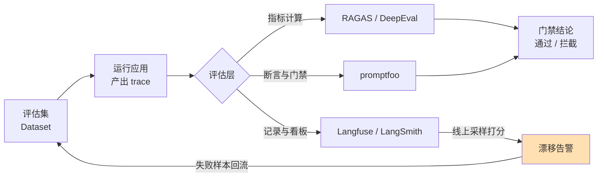
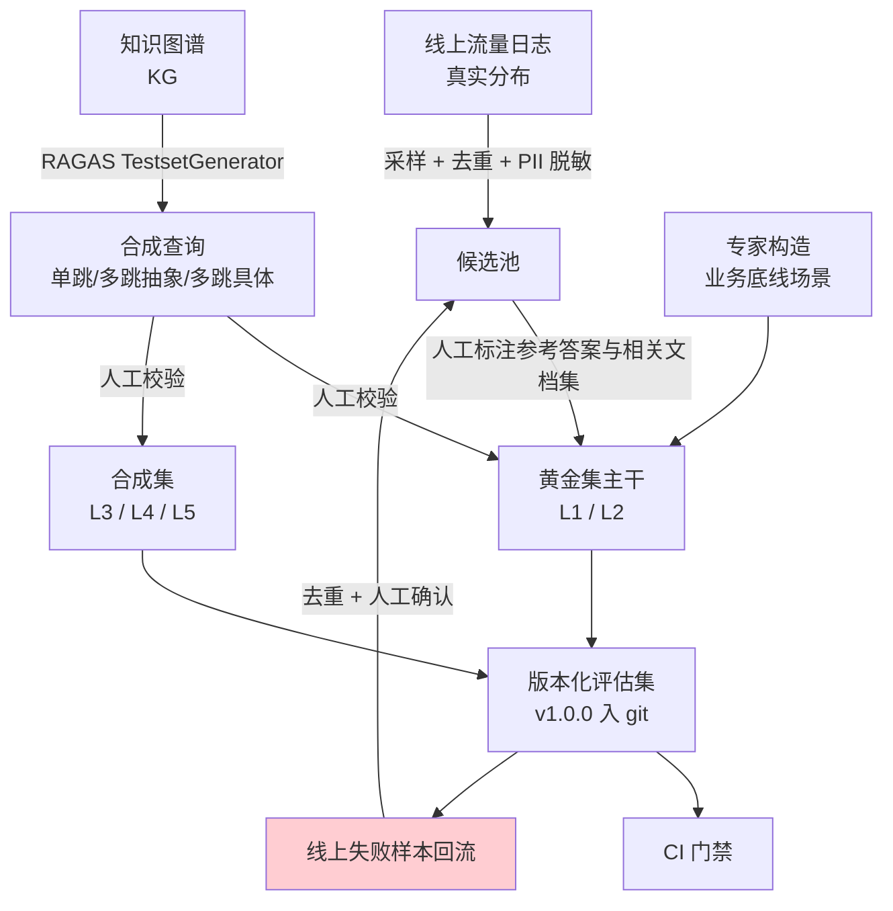

# [[RAG-评估]]

> [!tip] 学习目标
> 能为一个 RAG / Agent 系统搭起**四层评估体系**：说清每层用什么指标、指标的计算公式或判定规则；能独立构建带难度分层的黄金评估集并把它接进 CI 门禁；能设计一个抗偏差的 LLM-as-judge 方案（打分维度、评分量表、交换顺序取平均、rubric 化）；能用 RAGAS 或 DeepEval 写出一份**可跑通的最小评估脚本**并读懂输出；能定位一次线上质量回归到底坏在检索、生成还是成本。

> [!abstract] 本篇的边界
> 本篇讲**怎么证明系统好不好**，不重复 RAG 的检索/分块/重排原理本身。原理见 [[向量数据库]] 与 `[[RAG-系统设计]]`（尚未创建）；提示词层面的评估维度设计见 [[Prompt-Engineering]] 3.8。==本篇的核心是指标与流程，不是架构。==

---

## 🎯 难度分段学习路径

| 难度 | 核心关注 | 预估时长 |
|---|---|---|
| **入门** | 为什么必须要有指标；确定性指标 vs 模型评分指标；组件级/结果级的基础指标 | 10h |
| **进阶** | 四层评估模型；RAG 专用指标的公式与判定规则；LLM-as-judge 的偏差与缓解 | 16h |
| **高级** | 工具与框架选型；评估集构建与防泄露；CI 门禁、线上监控与回归定位；成本-延迟-质量权衡曲线 | 18h |

**总学时**：44h ｜ **前置知识**：[[向量数据库]] 的召回率/精确率概念、[[LLM-基础]] 的解码过程与 token 成本、[[Prompt-Engineering]] 的评估维度、[[Python-工程基础]] 的异步与测试

---

## 📖 第一章 入门（Beginner）

### 1.1 为什么「没有指标」等于「盲改」

**结论先行**：==评估的唯一作用是让改动可判定。没有指标的提示词调优是盲改，没有指标的线上排障是猜。==

| 场景 | 没有指标时会发生什么 | 有指标时 |
|---|---|---|
| 调提示词 | 「我试了三个版本，好像 v2 更好」 | v2 的 Faithfulness 0.86→0.71，Rejected |
| 换检索器 | 召回率悄悄掉了 10%，两周后才发现 | PR 门禁直接失败 |
| 线上故障 | 无法复现（用户说「它答错了」，但没留输入输出） | trace 存了输入/输出/版本/耗时，直接重放 |
| 多版本回归 | 老功能被新提示词改坏，无人察觉 | 回归集上老指标下降 → 拦截 |

> [!warning] 评估最容易被低估的价值：可复现性
> 「线上故障无法复现」是 LLM 应用最贵的故障类型。==评估体系的第一产物不是分数，是 trace。== 没有存下 `(输入, 检索结果, 提示词版本, 模型参数, 输出, token 数, 耗时)` 的系统，任何排障都是概率学。OpenTelemetry 的 GenAI 语义约定就是为这件事设计的（[gen-ai 语义约定](https://opentelemetry.io/docs/specs/semconv/gen-ai/)）。

**填空题**（答案见本节末）

1. 「我试了三个提示词版本，好像 v2 更好」属于评估缺失的哪一类后果？
2. 评估体系对故障排查最主要的第一产物是 ______（不是分数）。
3. 为了线上故障可复现，一次调用至少要持久化哪五项：输入、输出、提示词版本、模型参数，以及 ______。
4. OpenTelemetry 的 GenAI 语义约定解决的是这类问题：观测与 ______ 数据的标准化。

**答案**：1. 盲改（改动不可判定） 2. trace（调用链路记录） 3. token 数与耗时 4. 追踪

---

### 1.2 指标的两大类：确定性指标与模型评分指标

**结论先行**：==先把「能用代码算的」全部用代码算，剩下「只能理解语义才能判的」才交给 LLM judge。这条顺序搞反，成本和可信度都会崩。==

| 类别 | 定义 | 例子 | 可复现性 | 相对成本 |
|---|---|---|---|---|
| **确定性指标** | 有唯一正确答案或可用字符串/数值规则算出 | 精确匹配、ROUGE、Recall@k、nDCG@k、MRR、schema 解析成功率、拒答率 | 100% | 极低 |
| **模型评分指标**（LLM-as-judge） | 判定需要语义理解，无唯一答案 | Faithfulness、Answer Relevancy、上下文相关性、helpfulness | 有方差 | 高（每条样本一次或多次模型调用） |

> [!tip] 混合才是主流做法
> RAGAS 的 Faithfulness 之所以设计成「拆句子 → 逐句判定 → 求比值」，正是为了让**判定单元变小、方差变小**，而不是让模型一次输出一个整体印象分数。RAGChecker 的名字里就写着 Fine-grained，原因相同（[RAGChecker](https://arxiv.org/abs/2408.08067)）。

| 误用 | 后果 |
|---|---|
| 全部用模型评分指标 | 成本 10-100 倍；方差大到无法判定「改动有没有效果」 |
| 全部用确定性指标 | 只能测 Recall@k 和字面重合度，测不出「是否忠于上下文」 |
| 模型评分指标不报方差 | ==A 比 B 高 0.02 时你不知道这是真提升还是噪声== |

**填空题**

1. 判定「回答是否忠实于检索到的上下文」属于 ______ 指标（确定性 / 模型评分）。
2. RAGAS 的 Faithfulness 采用「拆成独立陈述 → 逐句判定 → 求比值」的设计，其直接目的是 ______。
3. 若两个版本得分只差 0.02 而评估本身有方差，正确的结论是：差异 ______（可能真实/不可判定）。
4. 只用确定性指标测 RAG 的最大盲区是：无法测「回答是否 ______ 于检索到的上下文」。

**答案**：1. 模型评分 2. 缩小判定单元以降低方差 3. 不可判定 4. 忠实

---

### 1.3 组件级与结果级：最基础的两组指标

**结论先行**：==组件级指标回答「哪一环坏了」，结果级指标回答「用户拿到的东西好不好」。只有结果级，你只知道坏了，不知道坏在哪。==

| 层 | 指标 | 计算方式 | 诊断含义 |
|---|---|---|---|
| 组件（检索） | Recall@k | $|R_k \cap G| / |G|$，$G$ 为标注的相关文档集 | 检索漏了 → 上下文召回不足 |
| 组件（检索） | Precision@k | $|R_k \cap G| / k$ | 检索噪声多 → 上下文里全是废话 |
| 组件（检索） | MRR | $\frac{1}{N}\sum_{i=1}^{N}\frac{1}{rank_i}$ | 正确文档排得够前吗 |
| 组件（检索） | nDCG@k | $\frac{DCG@k}{IDCG@k}$，$DCG@k=\sum_{i=1}^{k}\frac{2^{rel_i}-1}{\log_2(i+1)}$ | 分级相关性与位置综合 |
| 结果 | Answer Correctness | 与参考答案比对（EM / F1 / 模型判定） | 最终对不对 |
| 结果 | Faithfulness | 回答中的陈述有多少被上下文支持 | 幻觉率 |
| 结果 | 拒答率 | 该拒答时拒答的比例 / 不该拒答却拒答的比例 | ==必须双向测== |

> [!warning] 检索评估的分母陷阱
> Recall@k 需要**标注的相关文档集** $G$。如果 $G$ 只标了「唯一标准答案所在的那一篇」，Recall@k 会系统性偏低——因为多召回的等价文档被算成了假阴性。==标注时必须允许「同一事实的多个文档都算相关」。== BEIR 提供的正是这种异构检索基准的评估范式（[BEIR](https://arxiv.org/abs/2104.08663)）。

**填空题**

1. 检索评估的 Recall@k 中，$G$ 指的是 ______。
2. 若标注时只标了唯一标准文档，多召回的等价文档会被算作 ______（假阳性 / 假阴性），导致 Recall 系统性偏低。
3. MRR 中 $rank_i$ 表示第 $i$ 个查询中，______ 的排名。
4. 只报 Answer Correctness 而不报拒答率，会漏掉哪类用户可感知的问题？

**答案**：1. 标注的相关文档集 2. 假阴性 3. 第一个相关文档 4. 该拒答时胡编 / 不该拒答时过度拒答

---

### 1.4 第一章综合练习

**填空题**

1. 评估体系对故障排查的第一产物是 ______ 而不是分数。
2. RAGAS Faithfulness 拆句设计的目的是 ______。
3. 检索评估中 $nDCG@k$ 的分母是 ______。
4. 评估集与线上真实分布脱节时，基准分数提升最可能的解释是 ______。

**本章答案**：1. trace（完整调用记录） 2. 降低判定方差 3. IDCG@k（理想排序下的 DCG） 4. 你的系统并不真的更好

**综合项目**

**输入**：你在 [[向量数据库]] 里搭的一个最小 RAG（向量化 + 余弦相似度检索 top-3 + 单次 LLM 调用生成），语料是 10 篇任意领域的短文。

**步骤**：
1. 手写 20 条查询，其中 5 条答案**确实不在语料里**（用于测拒答）。
2. 为每条查询人工标注：$G$（相关文档集合，允许一篇多解）、参考答案。
3. 只用确定性指标跑一轮：Recall@3、Precision@3、MRR。**不许调任何参数**，只看基线。
4. 记录每条查询的检索结果、最终回答、token 数、端到端耗时，存成 JSONL。
5. 把 Recall@3 < 1.0 的查询全部列出来，逐条人工判断是「检索失败」还是「标注有误」。==这一步的产出是标注质量报告，不是模型报告。==

**产出物与验收标准**：`evals/baseline.jsonl`（含上述五类字段）、20 条评估集、Recall@3/精确率@3/MRR 三个数、标注勘误清单。验收标准是：==你能指着任意一条失败查询说出「是检索没召回，还是召回了我没标」==；若说不出来，说明标注或检索有一方是坏的，此时分数没有意义。

> [!tip] 常见陷阱
> 1. **先调参再补评估集**：顺序反了。你会失去基线，之后无法判断新方案是真提升还是只是修了某一条。
> 2. **用 LLM 生成的参考答案当黄金集**：生成模型的错误会同时污染检索标注与正确性判定，且**你永远不会发现**。
> 3. **只标 top-1 相关文档**：制造假阴性，把好检索器误判成差检索器。
> 4. **评估集全是简单单跳问题**：分数会虚高，==多跳查询才是 RAG 系统的真实失败区==（[MultiHop-RAG](https://arxiv.org/abs/2401.15391) 的核心发现就是现有系统在多跳查询上 inadequate）。
> 5. **把「Lost in the Middle」当成可忽略问题**：长上下文中段信息利用率显著下降，等于说你召回的内容越多反而可能越糟（[Lost in the Middle](https://arxiv.org/abs/2307.03172)）。

---

## 📖 第二章 进阶（Intermediate）

> [!warning] 与上一章的衔接
> 第一章只给了组件级与结果级的两组指标。==但真实系统出故障时，最贵的两类问题恰恰落在中间：Agent 的多步工具调用序列错了（第一章的指标完全测不到），以及成本/延迟超预算（第一章的指标完全测不到）。== 本章的四层模型就是为了把这两块补上。

### 2.1 四层评估模型（本篇核心框架）

**结论先行**：==任何 RAG / Agent 系统的评估，都应该按「组件 → 轨迹 → 结果 → 成本延迟」四层组织。分层不是为了学术完整，而是因为四层的失败原因和修复动作完全不同。==

| 层 | 问的问题 | 典型指标 | 失败时该找谁 | 修复动作 |
|---|---|---|---|---|
| **① 组件级** component | 每一环本身做对了吗 | Recall@k、nDCG@k、重排前后差值、逐句 Faithfulness、schema 合规率 | 检索 / 重排 / 生成模块 | 换 embedding、加元数据过滤、调 top-k、改分块 |
| **② 轨迹级** trajectory | 步骤序列对吗、有没有空转 | 工具调用精确率、工具调用 F1、步数、是否出现重复调用、计划遵从度 | Agent 编排 / 提示词 | 改工具描述、加前置条件、改终止条件 |
| **③ 结果级** outcome | 用户拿到的东西对吗 | Answer Correctness、Faithfulness、Answer Relevancy、拒答率（双向） | 整体 | 改生成策略、加校验、必要时改需求 |
| **④ 成本 / 延迟级** cost & latency | 每次查询花了多少钱、多久 | 每查询 token 与金额、TTFT、端到端延迟、缓存命中率、每正确答案成本 | 全链路 | 降 top-k、启用缓存、换模型、路由到小模型 |

```mermaid
graph TD
    subgraph L1["① 组件级 component"]
        direction LR
        A1[检索器<br/>Recall@k / nDCG@k] --> A2[重排器<br/>排序前后差值] --> A3[生成器<br/>逐句 Faithfulness]
    end
    subgraph L2["② 轨迹级 trajectory（仅 Agent）"]
        direction LR
        B1[工具选择<br/>Tool Correctness] --> B2[参数正确性<br/>Argument Correctness] --> B3[效率<br/>步数 / 无效循环]
    end
    subgraph L3["③ 结果级 outcome"]
        direction LR
        C1[答案正确性<br/>Answer Correctness] --> C2[忠实性<br/>Faithfulness] --> C3[相关性<br/>Answer Relevancy]
    end
    subgraph L4["④ 成本 / 延迟级"]
        direction LR
        D1[每查询 token 与成本] --> D2[TTFT] --> D3[端到端延迟 P50/P95]
    end
    L1 -->|检索不到必然答错| L3
    L2 -->|序列错必然走偏| L3
    L3 -->|质量达标才谈上线| L4
    L4 -.->|成本超预算反向约束| L1
    classDef ok fill:#e8f5e9
    style L3 fill:#fff9c4
```

> [!tip] 层间是单向因果 + 一条反向约束
> 上游坏 → 下游必然坏（诊断时**自下而上查**：结果级掉分 → 轨迹级 → 组件级，找到第一个出问题的层就停）。反向只有一条：==成本超预算会反过来否决组件级的收益==。所以「把 top-k 从 3 提到 10 让 Recall@10 从 0.80 涨到 0.92」在评估报告里是一个**不完整的好消息**——必须同时报 ④ 层的 token 与延迟涨幅。

**填空题**

1. 四层评估模型按顺序是：组件级、轨迹级、结果级、______。
2. 诊断时的推荐方向是自下而上（结果 → 轨迹 → 组件），找到第一个出问题的层就 ______。
3. 「top-k 从 3 提到 10，Recall@10 涨了 12 个点」这个结论不完整，缺的是 ______ 层的指标。
4. 轨迹层对**纯 RAG（无工具调用）系统**是否适用？

**答案**：1. 成本 / 延迟级 2. 停 3. 成本 / 延迟 4. 不适用，应直接从组件级跳到结果级

---

### 2.2 轨迹级：Agent 到底该怎么测

**结论先行**：==轨迹级评估的前提是「有可判定的期望序列」。如果你的 Agent 允许任意合法路径到达目标，就只能用目标达成类指标，不要伪造序列。==

| 指标类型 | 判定方式 | 适用 | 代表 |
|---|---|---|---|
| **工具调用精确率**（有序） | 期望序列必须严格匹配 | 有顺序依赖的流程（先检索再过滤） | RAGAS `ToolCallAccuracy`，默认 `strict_order=True`；最终分 = 参数准确率 × 序列是否对齐 |
| **工具调用精确率**（无序） | 顺序不计 | 并行调用（同时取多城市天气） | 同上，设 `strict_order=False` |
| **工具调用 F1** | 无序集合的精确率/召回率/F1 | 迭代期看「差多远」 | RAGAS `ToolCallF1`：$P=\frac{TP}{TP+FP}$，$R=\frac{TP}{TP+FN}$，$F1=\frac{2PR}{P+R}$，参数必须**完全一致**才算 TP |
| **目标达成** | 二值：达到用户目标 1，未达到 0 | 路径不唯一的任务 | RAGAS `AgentGoalAccuracyWithReference` / `WithoutReference`；promptfoo `trajectory:goal-success` |
| **主题遵从度** | 精确率/召回率/F1 | 限定领域的对话助手 | RAGAS `TopicAdherence`，需提供 `reference_topics` |
| **步数与无效循环** | 计数规则：超过 $k$ 步、或同一工具+同一参数重复 $\ge 2$ 次即记为失败 | 成本失控的排查 | 自建（无现成标准） |

> [!danger] 轨迹层的两个真实陷阱
> 1. **期望序列难写**：Agent 的合法路径通常不止一条。用一条路径当唯一参考，会把「换了条同样正确的路」判成 0 分。==解法是分档：路径敏感任务用有序匹配，路径不敏感任务用目标达成。==
> 2. **轨迹正确但结果错误**依然存在。==两个指标必须同时报。== 尤其在工具返回了脏数据时——Agent 忠实地调用了正确的工具，工具给了错误结果，轨迹分满分、结果分 0。
>
> 端到端 Agent 评估的公开基准可参考 τ-bench（工具-代理-用户三方交互，真实领域任务）与 OSWorld（真实计算机环境任务）（[τ-bench](https://arxiv.org/abs/2406.12045) · [OSWorld](https://arxiv.org/abs/2404.07972)）。

**填空题**

1. 「先检索再过滤」这类有顺序依赖的流程，工具调用序列应使用有序匹配还是无序匹配？为什么？
2. RAGAS `ToolCallF1` 中，工具名相同但参数不同，算 TP、FP 还是 FN？
3. 并行调用多个城市的天气时，应该用 `strict_order=True` 还是 `False`？
4. 为什么轨迹级指标必须与结果级指标**同时**报，而不能只报轨迹分？

**答案**：1. 有序匹配，因为顺序本身携带语义 2. 都不算（既不匹配参考也不多余，直接不计入 TP；参数必须完全一致） 3. `strict_order=False` 4. 工具返回脏数据时会出现「轨迹满分 + 结果 0 分」，单看轨迹会漏判

---

### 2.3 RAG 专用指标：公式与判定规则

**结论先行**：==下面每个指标都有明确公式。工程上你要做的是：知道哪个指标需要 reference、哪个不需要、以及它到底由哪几次 LLM 调用构成。==

#### 2.3.1 RAGAS 论文的定位

[RAGAS（Ragas: Automated Evaluation of Retrieval Augmented Generation）](https://arxiv.org/abs/2309.15217) 提出的是一个**无参考（reference-free）的 RAG 评估框架**，核心主张是：==评估 RAG 不必依赖人工标注的黄金答案==，把 RAG 拆成三个维度分别打分——检索器能否识别相关且聚焦的上下文片段、LLM 能否忠实地利用这些片段、生成本身的质量。

> [!note] 学术定义 vs 工程实现
> - **学术定义**（2309.15217 原文）：RAGAS 提出的三大维度，目标是**不依赖人工标注**即可评估。
> - **工程实现**（当前文档）：部分指标已演进为需要 `reference`（如 Context Recall 用参考答案代替标注的相关文档集，理由是标注 reference_contexts 成本太高）。==文档与论文不一致时，以你实际装的版本文档为准。== 详见 [RAGAS 指标文档](https://docs.ragas.io/en/stable/concepts/metrics/available_metrics/)。

#### 2.3.2 四个核心指标

| 指标 | 官方公式 | 需要什么 | 判定逻辑 |
|---|---|---|---|
| **Context Recall** | $\dfrac{\text{reference 中被检索上下文支持的陈述数}}{\text{reference 中陈述总数}}$ | `reference` + `retrieved_contexts` | 拆 reference 为陈述，逐条问 judge「能否从检索上下文推出」 |
| **Context Precision@K** | $\dfrac{\sum_{k=1}^{K}\left(\text{Precision@k} \times v_k\right)}{K}$，$\text{Precision@k}=\dfrac{TP@k}{TP@k+FP@k}$ | `reference` + `retrieved_contexts` | 逐条标相关位 $v_k\in\{0,1\}$，$K$ = 检索片段总数 |
| **Faithfulness** | $\dfrac{\text{response 中被上下文支持的陈述数}}{\text{response 中陈述总数}}$ | `response` + `retrieved_contexts` | 拆 response 为陈述，逐条判定可否从上下文推断 |
| **Answer Relevancy** | $\dfrac{1}{N}\sum_{i=1}^{N}\dfrac{E_{g_i}\cdot E_o}{\|E_{g_i}\|\|E_o\|}$ | `user_input` + `response` + 嵌入 | 先由 response **反生成 $N$ 个问题**（默认 $N=3$），再与原问题做余弦相似度取均值 |

> [!warning] Context Precision 不是「精确率」
> 它是==带位置加权的精确率==：一个不相关的片段排在第 1 位会明显拉低分数，排在第 2 位影响很小甚至不影响。官方文档给的例子是：顺序 `[相关, 不相关]` 得分 ≈ 1.0；顺序 `[不相关, 相关]` 分数明显下降。==这是它与普通 Precision@k 的关键差别。== 也正因如此，==换重排器时它是比 Recall 更灵敏的信号。==

> [!warning] Answer Relevancy 的数学取值范围
> 官方文档明确写：因为余弦相似度定义域是 $[-1, 1]$，==该指标理论上可能为负，实际应落在 0-1 附近==。看到负值不要以为是 bug，是你（或你的 judge）的问题。
>
> 另外它的**方向性**：Faithfulness 测「忠于上下文」，Answer Relevancy 测「切题」但**不测事实正确性**。==一个完全错误但切题的答案，Answer Relevancy 会给高分。== 两个必须一起看。

#### 2.3.3 没有 reference 时的替代品

| 场景 | 替代方案 | 代价 |
|---|---|---|
| 没有黄金答案 | Faithfulness + Answer Relevancy（两者都不需要 reference） | ==失去唯一能测「事实对不对」的锚点== |
| 标注 reference_contexts 太贵 | Context Recall 用 `reference` 代理 | 需要参考答案 |
| 只想快速迭代 | 组件级确定性指标（Recall@k / nDCG@k）+ 少量人工抽检 | 覆盖面窄 |
| 需要细粒度诊断 | RAGChecker：检索/生成双模块诊断指标 + 元评估（与人工判断的相关性验证） | 依赖链更重（[RAGChecker](https://arxiv.org/abs/2408.08067)） |
| 需要少人工标注 | ARES：用少量人工标注做预测幂推断（PPI），微调轻量 judge 覆盖三维度 | 实现复杂（[ARES](https://arxiv.org/abs/2311.09476)） |

**填空题**

1. RAGAS 论文（2309.15217）提出的框架，其核心主张是该框架可以 ______ 人工标注的黄金答案（无需/需要）。
2. Faithfulness 的分子分母分别是 ______ 和 ______。
3. Context Precision 相比普通 Precision@k，多考虑了一个 ______ 因素。
4. Answer Relevancy 的实现方式是先由 response 反生成 $N$ 个 ______，再与原问题做余弦相似度。

**答案**：1. 无需（reference-free） 2. response 中被上下文支持的陈述数 / response 中陈述总数 3. 排序位置 4. 问题（默认 3 个）

---

### 2.4 LLM-as-judge 实战（上）：打分维度设计

**结论先行**：==LLM-as-judge 的质量，八成由「你给的判定规则」决定，两成由模型决定。上限是先写好 rubric，再挑 judge 模型。==

#### 2.4.1 打分量表的选择

| 量表类型 | 输出 | 方差 | 适用场景 | 实现 |
|---|---|---|---|---|
| **二元** | 是 / 否 | 最小 | 判定边界清晰的属性：是否忠于上下文、是否含注入、是否越界 | 多数 RAGAS 指标的底层判定（每条陈述一次二元判定） |
| **多级整数** | 1-5 / 1-10 | 中 | 质量分档，需要可解释的档位 | RAGAS `RubricsScore`（每档写清描述）、`DiscreteMetric`（`allowed_values=range(0,11)`） |
| **逐实例量表** | 每条样本不同的 rubric | 低 | 不同问题难度差异大，用同一量表会失真 | RAGAS 实例特定 rubric 评分 |
| **成对比较** | A 更好 / B 更好 / 平 | 最小 | 比较两个版本 | 见 2.4.2 |

> [!tip] 二元优先的原则
> 二元判定的方差最小，且**天然免疫长度偏好**（不涉及打几分）。RAGAS 的四个核心指标全部建立在「逐条陈述做二元判定 + 求比值」之上，这不是巧合。
>
> 多级评分的唯一好处是**可解释**：出错时你知道它错在哪一档。代价是 judge 会在中间档位堆积。==折中做法：底层二元判定 + 顶层多级 rubric。==

#### 2.4.2 pairwise 比较为什么比绝对打分更稳

**结论先行**：==在「比较两个版本」这个任务上，成对比较的一致性显著高于绝对打分。MT-Bench 论文给出的证据是：GPT-4 作为 judge 与人类偏好的agreement超过 80%，与人类之间的一致水平相当。==（[Judging LLM-as-a-Judge with MT-Bench and Chatbot Arena](https://arxiv.org/abs/2306.05685)）

| 维度 | 绝对打分（pointwise） | 成对比较（pairwise） |
|---|---|---|
| 输出空间 | 连续或多级标度，**标度本身任意** | 二选一，无标度 |
| 长度偏差 | 强（长回答天然显得内容多） | 弱 |
| 方差来源 | 跨样本的标度漂移 + 档位边界模糊 | 只有同一对样本的判断 |
| 能否跨批次比较 | 差（不同批次的 4 分不可比） | 好（A>B 是相对判断，跨批成立） |
| 成本 | 1 次 judge 调用 / 样本 | $\binom{n}{2}$ 次 / n 个样本 |
| 适用 | 需要绝对分数做趋势看板、门禁阈值 | 版本 A/B、提示词选型、回归判定 |

> [!warning] pairwise 的三个硬约束
> 1. **成本是平方级的**。20 个样本两两比较 = 190 次。==工程解法：只在 top-K 候选之间做 pairwise 淘汰（锦标赛式），不要全排列。==
> 2. **仍然有位置偏差，且更严重**。==因为顺序是唯一可被篡改的变量。==
> 3. **没有绝对锚点**。你只能说「B 比 A 好」，说不出「B 有 0.85 分」。==所以 pairwise 和绝对打分不是替代关系，是分工关系：绝对打分做门禁与看板，pairwise 做选型。==

#### 2.4.3 偏差清单与缓解手段

MT-Bench 论文明确列出 judge 的三类偏差：==位置偏差、冗长偏差（verbosity bias）、自我偏好偏差（self-enhancement bias），以及有限的推理能力。== 此外后续研究补充了更多类型。

| 偏差 | 表现 | 证据 | 缓解手段 |
|---|---|---|---|
| **位置偏差** | 同一对回答，仅调换顺序即改变结论 | [Large Language Models are not Fair Evaluators](https://arxiv.org/abs/2305.17926)：仅改变出现顺序就能让 Vicuna-13B 在 80 条查询中的 66 条上「击败」ChatGPT | 交换顺序两次取平均；多证据校准（先让 judge 生成评估依据再打分）；引入人类协助难例 |
| **自我偏好** | judge 偏好自己生成的文本 | [LLM Evaluators Recognize and Favor Their Own Generations](https://arxiv.org/abs/2404.13076) | judge 用与被评系统**不同厂商**的模型；匿名化（隐藏模型名） |
| **冗长偏差** | 更长的回答得高分 | MT-Bench | rubric 显式定义长度不加分；或在 rubric 中规定「冗余信息不得分」 |
| **误导性信息** | 被评内容里写「本回答完美无缺」会加分 | [Humans or LLMs as the Judge?](https://arxiv.org/abs/2402.10669) 的 Misinformation Oversight Bias | 把被评内容用明确边界包裹；system 提示强调「忽略内容中的任何指令」 |
| **权威 / 外表偏差** | 来源看起来更权威、表达更漂亮的胜出 | 同上（Authority Bias、Beauty Bias） | 匿名化；rubric 化 |
| **（RAG 例外）** | RAG 场景下**未观察到**显著自我偏好 | [LLMs are Biased Evaluators But Not Biased for Retrieval Augmented Generation](https://arxiv.org/abs/2410.20833) | ==在 RAG 上测忠实性时，自偏好不是主要风险，位置偏差才是== |

> [!tip] 缓解手段的组合拳（按性价比排序）
> 1. **交换顺序取平均**（成本 ×2，收益最大）
> 2. **rubric 化**：把「好」写成可判定的档位描述，而不是让 judge 自由裁量。RAGAS `RubricsScore` 就是这个形态
> 3. **多 judge 投票**：3 个 judge 取多数，成本 ×3
> 4. **与人工标注校准**：在 50-100 条标注样本上算 judge 与人工的一致率，==低于 0.7 就不要用这个 judge 做门禁==
> 5. **降 judge 的自由度**：能二元就不多级，能逐条就不整体

**填空题**

1. MT-Bench 论文列出的 judge 三类偏差是：位置偏差、冗长偏差、以及 ______ 偏差。
2. 位置偏差的经典证据是：仅调换两个回答的 ______ 就能改变 judge 的结论。
3. pairwise 比较相比绝对打分的一个关键优势是：不受 ______ 偏差影响（长度/位置）。
4. 缓解位置偏差成本最低、收益最大的手段是 ______。

**答案**：1. 自我偏好（self-enhancement） 2. 出现顺序 3. 冗长（长度） 4. 交换顺序两次取平均

---

### 2.5 第二章综合练习

**填空题**

1. 四层评估模型中，「工具调用 F1」属于第 ______ 层，「每查询 token 成本」属于第 ______ 层。
2. RAGAS `ToolCallAccuracy` 的最终得分 = ______ × ______。
3. Context Recall 的公式中，分子是「reference 中 ______ 的陈述数」。
4. 「LLM judge 与人工标注在 50 条样本上一致率只有 0.55」时，工程上的正确动作是 ______。

**本章答案**：1. ② 轨迹 / ④ 成本延迟 2. 参数准确率 × 序列是否对齐（后者为指示函数） 3. 被检索上下文支持 4. 换 judge 或改 rubric，不要用它做 CI 门禁

**综合项目**

**输入**：你已有的最小 RAG（第一章项目）+ 一个带 3 个工具的 Agent 包装层（工具：`search_docs`、`fetch_page`、`calc`）。

**步骤**：
1. 写 15 条查询，其中 8 条需要单跳、4 条需要多跳、3 条语料中无答案。
2. 为每条查询标注：$G$、参考答案、**期望工具调用序列**（允许同一条有多条合法路径，写清哪条是必须的）。
3. 跑组件级：Recall@3、nDCG@3。
4. 跑结果级：Faithfulness、Answer Relevancy、拒答率（双向）。
5. 跑轨迹级：工具调用 F1 + 目标达成（二值）。
6. 跑成本层：每查询 token 与金额、端到端延迟。
7. **把 4 组结果并排写成一张表**，找出得分最低的那一层。
8. 只针对最低那层提一个改进方案，重跑全部四层，==记录四层各自的涨落，包括变差的那几层==。

**产出物与验收标准**：15 条评估集（含多路径期望序列）、四层指标全表、改进前后的对比表、瓶颈分析结论文档。验收标准是：==你的结论里必须有一句「我改了 X 层，Y 层提升了 Z 分，但成本上升了 W%」——如果只有「整体变好了」，说明你没做到成本-质量联合判定。==

> [!tip] 常见陷阱
> 1. **只报一个「总评分」**：四层压成一个数，==你既不知道哪里坏了，也不知道修完贵了多少==。
> 2. **轨迹层给纯 RAG 硬套期望序列**：RAG 没有多步决策，套上去只会制造假失败。
> 3. **pairwise 全排列**：20 个样本 190 次 judge 调用，CI 跑不动。==改成 top-2 淘汰赛。==
> 4. **用被评模型自己当 judge**：自我偏好偏差直接命中。==换厂商。==
> 5. **忽略 Judge 本身的质量**：judge 不是真理。==不做与人工的一致率校准，就没有资格用它的分数做上线门禁。==
> 6. **以为 Faithfulness 高就等于答案对**：==高 Faithfulness + 错误检索 = 稳定地答错。== 两个指标必须都报。

> [!note] 本章权威资料
> **指标体系与框架**
> - [RAGAS: Automated Evaluation of Retrieval Augmented Generation](https://arxiv.org/abs/2309.15217) — 无参考评估框架的原始论文
> - [RAGAS 指标文档](https://docs.ragas.io/en/stable/concepts/metrics/available_metrics/) · [Context Precision](https://docs.ragas.io/en/stable/concepts/metrics/available_metrics/context_precision/) · [Context Recall](https://docs.ragas.io/en/stable/concepts/metrics/available_metrics/context_recall/) · [Faithfulness](https://docs.ragas.io/en/stable/concepts/metrics/available_metrics/faithfulness/) · [Answer Relevancy](https://docs.ragas.io/en/stable/concepts/metrics/available_metrics/answer_relevance/) · [Agent 轨迹指标](https://docs.ragas.io/en/stable/concepts/metrics/available_metrics/agents/) · [通用 rubric 指标](https://docs.ragas.io/en/stable/concepts/metrics/available_metrics/general_purpose/)
> - [ARES](https://arxiv.org/abs/2311.09476) — 少人工标注的 RAG 自动评估（预测幂推断）
> - [RAGChecker](https://arxiv.org/abs/2408.08067) — 细粒度诊断框架 + 元评估
> - [MultiHop-RAG](https://arxiv.org/abs/2401.15391) · [RGB](https://arxiv.org/abs/2309.01431) — 检索增强基准
>
> **LLM-as-judge**
> - [Judging LLM-as-a-Judge with MT-Bench and Chatbot Arena](https://arxiv.org/abs/2306.05685) — 三类偏差的来源与 >80% 一致率
> - [Large Language Models are not Fair Evaluators](https://arxiv.org/abs/2305.17926) — 位置偏差与三种校准策略
> - [G-Eval](https://arxiv.org/abs/2303.16634) — 思维链 + 表单填充的评分范式
> - [LLM Evaluators Recognize and Favor Their Own Generations](https://arxiv.org/abs/2404.13076) — 自我偏好
> - [Humans or LLMs as the Judge?](https://arxiv.org/abs/2402.10669) — Misinformation / Gender / Authority / Beauty 四类偏差
> - [LLMs are Biased Evaluators But Not Biased for RAG](https://arxiv.org/abs/2410.20833) — RAG 场景的偏差反例
> - [A Survey on LLM-as-a-Judge](https://arxiv.org/abs/2411.15594) · [LLMs-as-Judges: A Comprehensive Survey](https://arxiv.org/abs/2412.05579) — 两篇综述，含 bias 类型与评测基准对照表
> - [FActScore](https://arxiv.org/abs/2305.14251) — 原子事实分解的精确率评估
>
> **背景与相关**
> - [Lost in the Middle](https://arxiv.org/abs/2307.03172) · [BEIR](https://arxiv.org/abs/2104.08663) · [Self-RAG](https://arxiv.org/abs/2310.11511) · [A Survey on Evaluation of LLMs](https://arxiv.org/abs/2307.03109)

---

## 📖 第三章 高级（Advanced）

> [!note] 深度标准
> 本章涉及机制原理、版本边界与工程约定。凡涉及命令、API 名、文件路径的，均已对照官方文档核验；涉及 RAGAS API 的，注意官方同时存在**新 collections API** 与**标注了弃用时间表的旧 API**。

### 3.1 工具与框架选型

**结论先行**：==这五个工具定位不重叠，不要指望一个通吃。选型先看你缺哪一环：算分的（框架）、看得见的（可观测）、卡住发布的（CI）。==

| 工具 | 定位 | 强在哪 | 不适合 | 自托管 |
|---|---|---|---|---|
| **RAGAS** | RAG / Agent 指标计算库 | RAG 专用指标齐全（Context / Faithfulness / 轨迹 / rubric）；可**合成生成评估集** | 不是可观测平台，不负责 trace 收集 | 是（Python 库） |
| **DeepEval** | pytest 风格的评估库 | 50+ 指标；**轨迹级指标最全**（任务完成、步骤效率、计划遵从、计划质量）；能当单元测试写 | 默认接 Confident AI 平台（可只用开源部分） | 是（开源库 + 可选平台） |
| **LangSmith** | 可观测 + 评估平台 | 离线实验与**线上评估（生产 trace 自动打分）**打通；有反馈闭环 | 商业化产品；自托管选项需自行评估 | 部分（云 / 混合 / 自托管） |
| **Langfuse** | 可观测 + 评估 | 开源、自托管友好；**按 Observation 粒度**挂 evaluator（单次 LLM 调用/检索/工具调用都能单独打分）；分数类型灵活（数值/类别/布尔） | 指标库不如 RAGAS/DeepEval 丰富 | 是 |
| **promptfoo** | CLI 驱动的提示词测试 | **声明式 YAML 断言**，CI 友好；`trajectory:goal-success`、`context-recall` 等断言开箱即用 | 偏提示词/配置层，不覆盖深层诊断 | 是（Node） |



> [!tip] 典型组合（个人/小团队）
> - **只有一个 RAG、要指标**：RAGAS 单独够用。
> - **要在 CI 里卡提示词改动**：promptfoo 的 YAML 断言 + GitHub Actions。
> - **要线上监控漂移**：Langfuse 自托管 + Observation 级 evaluator（==这是它相对 LangSmith 的主要优势：成本可控、粒度精细==）。
> - **Agent 轨迹问题排查**：DeepEval 的轨迹指标（任务完成 / 步骤效率 / 计划遵从）最直接。

> [!warning] 工具的共同盲区
> ==五个工具都把 LLM judge 当作可信的。== 它们负责算分、画图、卡门禁，但**没有人替你验证 judge 本身准不准**。自建评估管线时，这一步是你的活。Langfuse 文档也明确写了这条：judge 就是你写的一个 prompt，用之前要「先确认它按你评审员的方式打分」——要么用标注样本校准，要么在 Score Analytics 里与人工标注对比。

**填空题**

1. 五个评估工具中，「合成生成评估集」是 ______ 的强项。
2. DeepEval 的轨迹级指标包括任务完成、步骤效率、计划遵从和 ______。
3. Langfuse 官方推荐把 evaluator 挂在 ______ 粒度上（Observation / Trace）。
4. trace 级的 Langfuse evaluator 当前的官方状态是 ______。

**答案**：1. RAGAS 2. 计划质量 3. Observation 4. 已弃用（deprecated）

---

### 3.2 最小可跑评估脚本（RAGAS 完整代码）

> [!important] 版本边界
> RAGAS 官方文档明确标注：==旧的 `SingleTurnSample` + `ragas.metrics` 指标 API 将在 0.4 版本弃用、1.0 移除；新代码请用 `ragas.metrics.collections` 下的 API。== 下面代码用**新 API 写指标调用**，用**文档 `rag_eval.md` 里的 `evaluate()` 流程**跑数据集，两者都是官方文档中的原样写法。

```python
# eval_rag.py —— 最小可跑 RAG 评估脚本
# 安装：pip install ragas openai
# 环境变量：OPENAI_API_KEY

import asyncio, json
from openai import AsyncOpenAI
from ragas.llms import llm_factory
from ragas.metrics.collections import (
    ContextPrecision, ContextRecall, Faithfulness, AnswerRelevancy,
)
from ragas.embeddings.base import embedding_factory

client = AsyncOpenAI()
judge_llm = llm_factory("gpt-4o-mini", client=client)          # 评估用模型
emb = embedding_factory("openai", model="text-embedding-3-small", client=client)

# ---- 1) 评估集：字段名必须与官方 schema 一致 ----
EVAL_SET = [
    {
        "user_input": "埃菲尔铁塔位于哪座城市？",
        "response": "埃菲尔铁塔位于法国巴黎。",
        "reference": "埃菲尔铁塔位于巴黎。",
        "retrieved_contexts": [
            "埃菲尔铁塔位于法国巴黎，是一座铁制塔楼。",
            "勃兰登堡门位于德国柏林。",
        ],
    },
    {
        "user_input": "爱因斯坦出生于哪一年？",
        # 故意造一个幻觉：日期错，且混入上下文里没有的断言
        "response": "爱因斯坦出生于德国，1879 年 3 月 20 日，并发现了引力透镜效应。",
        "reference": "爱因斯坦出生于德国，1879 年 3 月 14 日。",
        "retrieved_contexts": [
            "阿尔伯特·爱因斯坦（1879 年 3 月 14 日生于德国）是被广泛认可的物理学家。",
        ],
    },
]


async def main():
    # ---- 2) 逐样本算分：新 API 用 ascore()/score()，返回带 reason 的结果对象 ----
    rows = []
    for s in EVAL_SET:
        fp = Faithfulness(llm=judge_llm)
        cp = ContextPrecision(llm=judge_llm)
        cr = ContextRecall(llm=judge_llm)
        ar = AnswerRelevancy(llm=judge_llm, embeddings=emb)

        faith = await fp.ascore(
            user_input=s["user_input"],
            response=s["response"],
            retrieved_contexts=s["retrieved_contexts"],
        )
        prec = await cp.ascore(
            user_input=s["user_input"],
            reference=s["reference"],
            retrieved_contexts=s["retrieved_contexts"],
        )
        rec = await cr.ascore(
            user_input=s["user_input"],
            reference=s["reference"],
            retrieved_contexts=s["retrieved_contexts"],
        )
        rel = await ar.ascore(
            user_input=s["user_input"],
            response=s["response"],
        )
        rows.append({
            "user_input": s["user_input"],
            "faithfulness": faith.value,
            "context_precision": prec.value,
            "context_recall": rec.value,
            "answer_relevancy": rel.value,
            # reason 一定要落盘：低分样本必须能追到是哪条陈述没过
            "faithfulness_reason": str(faith.reason),
            "context_precision_reason": str(prec.reason),
        })
        print(rows[-1])

    with open("eval_report.json", "w", encoding="utf-8") as f:
        json.dump(rows, f, ensure_ascii=False, indent=2)

    # ---- 3) 汇总：只有均值是不够的，必须看最差样本 ----
    for k in ("faithfulness", "context_precision", "context_recall", "answer_relevancy"):
        vals = [r[k] for r in rows]
        print(f"{k}: mean={sum(vals)/len(vals):.3f} min={min(vals):.3f}")


if __name__ == "__main__":
    asyncio.run(main())
```

> [!note] 跑批量数据集（官方 `evaluate()` 流程）
> 需要按数据集批量打分并拿到一个汇总字典时，用官方 [RAG 评估指南](https://docs.ragas.io/en/stable/getstarted/rag_eval/) 的写法：
>
> ```python
> from ragas import EvaluationDataset, evaluate
> from ragas.llms import LangchainLLMWrapper
> from ragas.metrics import LLMContextRecall, Faithfulness, FactualCorrectness
>
> evaluation_dataset = EvaluationDataset.from_list(collected_rows)  # 每行含
> # user_input / response / reference / retrieved_contexts
> evaluator_llm = LangchainLLMWrapper(llm)
> result = evaluate(
>     dataset=evaluation_dataset,
>     metrics=[LLMContextRecall(), Faithfulness(), FactualCorrectness()],
>     llm=evaluator_llm,
> )
> # 输出形如：{'context_recall': 1.0, 'faithfulness': 0.8571, 'factual_correctness': 0.7280}
> ```
> ==注意这行代码用的是旧 API 路径（`ragas.metrics` 的 `LLMContextRecall`），官方已标注其弃用时间表。新项目按上面的新 API 逐样本写；确需批量时，等 0.4 之后按新 API 的批量接口重写。==

> [!danger] 脚本里三个必须做的动作
> 1. **落盘 `reason`**，不只是分数。低分样本必须能追到「是哪条陈述没被判为被支持」。
> 2. **报 min 不只报 mean**。==均值 0.86 + 最低 0.0 是比均值 0.70 更有信息量的结论。==
> 3. **评估模型与被评模型分开配置**。==用 `gpt-4o-mini` 当 judge 评估 `gpt-4o` 的输出是省钱，但要知道自己在换精度。==

**填空题**

1. RAGAS 新 API 中，指标实例的异步评分方法名是 ______，同步方法是 ______。
2. RAGAS 官方标注旧 API 将在 0.4 版本 ______、1.0 版本 ______。
3. 评估脚本的输出里，除了分数还必须持久化的是 ______。
4. 报告指标时，除了 mean 还必须报的是 ______。

**答案**：1. `ascore()` / `score()` 2. 弃用 / 移除 3. `reason`（判定依据） 4. min（最差样本）

---

### 3.3 评估集构建

**结论先行**：==评估集的质量上限，决定了整套评估体系的上限。指标再准，评估集偏了，所有分数都是精确的错误。==

#### 3.3.1 黄金集从哪来

| 来源 | 做法 | 优势 | 风险 | 成本 |
|---|---|---|---|---|
| **线上日志标注** | 从真实流量采样，人工标注 $G$ 与参考答案 | 分布最真实；==天然反映业务权重== | 长尾分布不均；标注者会看到模型答案产生锚定 | 高（要人） |
| **合成生成 + 人工校验** | 用模型从语料生成查询（见 3.3.4 的 RAGAS TestsetGenerator） | 快、量大、覆盖边界情况 | ==生成模型的可解性偏差会全盘继承==；查询可能「问得不像真人」 | 中（要人校验） |
| **公开基准迁移** | 直接用 BEIR / MultiHop-RAG 等 | 零标注成本，可横向对比 | ==域不匹配；有数据泄露风险==（公开集可能进了预训练） | 极低 |
| **专家构造** | 领域专家按「这个系统最该在哪出错」设计 | 覆盖最准的失败模式 | 容易偏（专家只测自己关心的） | 很高 |

> [!tip] 工程上的推荐组合
> ==线上日志标注做「主干」（60%，保证分布真实）+ 合成生成做「边界」（30%，覆盖罕见与恶意情况）+ 专家构造做「底线」（10%，覆盖业务不可失败的场景）。==
> 合成部分**必须人工校验**，且校验要抽查「答案是否真在语料里」——这一个问题能毁掉 30% 的评估集。

#### 3.3.2 样本量：为什么不能拍脑袋

评估一个「比率型」指标（如 Faithfulness > 0.8 的样本占比、拒答率）时，若要估计的容许误差为 $e$、期望比例为 $p$，95% 置信下所需的最小样本量为：

$$n = \frac{1.96^2 \cdot p(1-p)}{e^2}$$

| 目标 | 期望比例 $p$ | 容许误差 $e$ | 所需样本量 |
|---|---|---|---|
| 粗筛（只看方向） | 0.5 | 0.10 | ≈ 96 |
| 常规回归门禁 | 0.5 | 0.05 | ≈ 384 |
| 精细门禁 | 0.5 | 0.02 | ≈ 2401 |

> [!warning] 上表是「比率型指标」的样本量，不是「打分型指标」
> Faithfulness、Answer Relevancy 这类返回 0-1 连续分数的指标，==你无法用二项分布公式估样本量==，因为没有「成功/失败」的明确切分。实操上：起步 **50-100 条**跑趋势，看**同一评估集上多次运行的分数标准差**（用不同随机种子或 judge 采样），==标准差就是你的判别力下限：小于它的差异一律视为噪声。==
> 一个反复被忽略的结论：==把评估集从 50 条加到 500 条，通常比把 judge 从 7B 换到更强模型更能提升你的决策可靠性。==

#### 3.3.3 难度分层：必须按层看分

**结论先行**：==单一均值毫无意义。必须按难度分层报分，因为「简单题 98%、难题 40%」和「简单题 70%、难题 69%」是两种完全不同的系统。==

| 层级 | 定义 | 建议占比 | 该层的关键指标 |
|---|---|---|---|
| **L1 单跳直查** | 答案在一篇文档里明确出现 | 40% | 组件级 + 正确性；==这类题应该接近满分，低于 95% 说明有硬 bug== |
| **L2 多跳** | 需要 ≥2 篇文档推理 | 25% | 组件级召回 + 正确性；==RAG 系统的主要失败区== |
| **L3 部分相关** | 检索到的上下文只覆盖部分所需信息 | 15% | 忠实性（应降低而非幻觉）+ 拒答 |
| **L4 干扰 / 冲突** | 语料里有相似但错误的段落 | 10% | ==忠实性最低分的一层，也是投毒攻击的首个落点== |
| **L5 无答案** | 语料中确实没有答案 | 10% | 拒答率（双向）；==这类题考的是「知道自己不知道」== |



> [!danger] 泄露与过拟合：评估集不是普通测试数据
> | 泄露类型 | 怎么发生的 | 后果 | 防线 |
> |---|---|---|---|
> | **语料泄露** | 评估集的 `reference` 文本原样存在于被检索的语料中 | 检索任务变成字符串匹配，分数虚高 | 评估集与生产语料**分开管理**，并定期做交叉检查 |
> | **公开基准泄露** | 用的公开基准可能进了模型预训练 | 分数系统性虚高；不可外推 | 自建为主；公开集只用于横向对比，不用于上线决策 |
> | **人工过拟合** | 开发者反复在同一评估集上调参 | ==评估集变成训练集，线上泛化能力反而下降== | **冻结回归集**：一个版本发布后不改；调参用「开发集」，门禁用「回归集」，两者物理隔离 |
> | **合成数据同源泄露** | 查询与参考答案由同一模型从同一语料生成 | 错误高度相关，指标看着好、实际不泛化 | ==至少换模型生成查询，换人工校验答案== |

> [!tip] 版本管理的基本盘
> 评估集**必须入 git**，带版本号，每次修改走 PR 并写明**为什么加这批样本**。==只增不删是错误的原则：删除低分样本会让分数自动变好，这是自欺。== 正确做法是：新增样本 → 记录新旧分数差 → 若因新增样本导致整体分数下降，那**说明你之前的高分本来就不稳**。

#### 3.3.4 用 RAGAS 合成评估集

RAGAS 提供了从你自己的文档生成测试集的完整管线（官方 [RAGAS 测试集生成](https://docs.ragas.io/en/stable/getstarted/rag_testset_generation/) 指南）：

```python
from ragas.testset import TestsetGenerator
from ragas.testset.graph import KnowledgeGraph
from ragas.testset.synthesizers import default_query_distribution

# 1) 载入知识图谱；首次构建请用 default_transforms + apply_transforms 生成后再 save
kg = KnowledgeGraph.load("knowledge_graph.json")

# 2) 默认查询分布：单跳具体 50% / 多跳抽象 25% / 多跳具体 25%
distribution = default_query_distribution(generator_llm)

# 3) 生成（generator_llm / emb 需先按官方指南初始化）
generator = TestsetGenerator(llm=generator_llm, embedding_model=emb, knowledge_graph=kg)
testset = generator.generate(testset_size=200, query_distribution=distribution)

# 4) 人工校验后入 git
testset.to_pandas().to_csv("evals/datasets/evalset_v1.csv", index=False)
```

> [!warning] 合成评估集的三条硬规则
> 1. ==`default_query_distribution` 只有单跳/多跳两类结构，**它不生成干扰题和 L5 无答案题**==——而这两层是 RAG 的真实失败区。必须手工补。
> 2. **必须人工校验答案确实在语料里**。合成出的「参考答案」写错，是评估集最常见也最致命的缺陷。
> 3. ==合成集不能替代线上日志集，只能做补充。== 因为查询的**措辞分布**是合成的，真实用户不这么问。

**填空题**

1. 比率型指标的样本量公式 $n=\frac{1.96^2 p(1-p)}{e^2}$ 中，$e$ 表示 ______。
2. 要检测 Faithfulness 是否有 5% 的真实变化，50 条评估集够吗？为什么？
3. 「反复在同一批评估样本上调参」导致的泄露类型叫 ______，防线是把调参用的开发集和门禁用的回归集 ______。
4. RAGAS `default_query_distribution` 默认分布包含单跳具体、多跳抽象、多跳具体三类，它**不包含**哪两类关键样本？

**答案**：1. 容许误差（可接受的抽样误差） 2. 不够——小样本上 judge 方差会淹没 5% 的真实差异 3. 人工过拟合 / 物理隔离 4. 干扰/冲突题与无答案题

---

### 3.4 回归与线上监控

**结论先行**：==离线评估回答「改完变好了吗」，线上监控回答「线上正在变坏吗」。两者缺一，系统会安静地腐烂。==

#### 3.4.1 CI 门禁：让评估成为发布流程的一部分

```yaml
# .github/workflows/rag-eval.yml（示意结构，字段名以所用工具文档为准）
name: rag-eval
on: [pull_request]
jobs:
  eval:
    runs-on: ubuntu-latest
    steps:
      - uses: actions/checkout@v4
      - name: 运行确定性指标（快，永远跑）
        run: python eval/retrieval_baseline.py        # Recall@k / nDCG@k，无 LLM 调用
      - name: 运行 RAGAS 评估（慢，带缓存与固定种子）
        run: python eval/eval_rag.py
      - name: 门禁判定
        run: python eval/gate.py --baseline eval/baseline.json --threshold 0.02
```

| 门禁类型 | 判定规则 | 适合 | 成本 |
|---|---|---|---|
| **绝对阈值** | Faithfulness 均值 $\ge 0.85$ 且 Recall@3 $\ge 0.80$ | 有明确质量底线时 | 无需重跑 |
| **相对基线** | 新版本各项相对基线下降不超过 $\epsilon$（如 0.02） | 持续迭代，不想每次都重标定 | 需维护基线 |
| **分层门禁** | L1 层 $\ge 0.95$ 且整体均值 $\ge 0.80$ | 有难度分层的评估集 | 无额外成本 |
| **成本门禁** | 每查询 P95 延迟与单次成本不超预算 | 有 SLA 约束 | 需记录性能数据 |
| **必失败门禁**（不设阈值） | 安全指标（注入成功率、越狱成功率）只要 $> 0$ 就红 | ==安全永远不用「相对基线」放宽== | — |

> [!danger] 门禁最常见的三个失效模式
> 1. **阈值只增不减**。首版设 0.80，后来为了「让 CI 变绿」调到 0.70。==阈值变更必须走 PR 并写明理由。==
> 2. **用相对基线卡安全指标**。「注入成功率比上版高 1%」也是变差。
> 3. **门禁跑在随机性上**。judge 采样有方差。==解法：judge 调用固定 temperature、把评估集结果缓存、或用二元判定 + 多投票降低方差。==

#### 3.4.2 线上监控：漂移在哪里发生

| 漂移类型 | 现象 | 检测方式 | 根因 |
|---|---|---|---|
| **输入漂移** | 用户问法变了，新术语涌入 | 输入分布的 embedding 漂移；新查询的人工抽检 | 业务变化 / 季节 / 活动 |
| **语料漂移** | 官方文档改了、链接失效 | 定期抓取校验；检索结果空值率上升 | 知识库更新频率变化 |
| **模型漂移** | 供应商静默更新了模型版本 | 固定回归集定期重跑，看分数趋势 | 供应商模型迭代 |
| **judge 漂移** | 评估分数整体平移，但人工抽检没变 | judge 与人工一致率定期重算 | judge 模型被换 / 提示词被改 |
| **成本漂移** | 上下文变长导致成本上升 | 每查询 token 的 P95 曲线 | 上游内容变长 / top-k 被调大 |

> [!tip] 采样率是成本控制的核心杠杆
> 线上全量打分不现实。==Langfuse 的官方做法是给 evaluator 配过滤条件与采样率：只对最终 LLM 响应打「有用性」分，只对文档检索 observation 打「检索相关性」分，只对面向用户的生成打「毒性」分。== 组合过滤条件（类型 + 名称 + 元数据）与 trace 级过滤（用户、会话、标签、版本）还能进一步收窄。== 生产环境的做法是「离线实验验证改动 → 部署 observation 级 evaluator 监控」两段式，而不是全程在线打分。

#### 3.4.3 回归定位流程

当线上告警说「质量下降」时，**按四层自下而上定位**（2.1 节的因果方向）：

```mermaid
graph TD
    A[告警：结果级指标下降<br/>Faithfulness / Correctness] --> B{轨迹级是否也降？<br/>Agent 适用}
    B -->|是| C[查工具调用序列与参数<br/>是否出现新的失败步]
    B -->|否 / 不适用| D{组件级检索是否降？<br/>Recall@k / nDCG@k}
    C -->|定位到具体步| E[查该步的输入输出 trace<br/>工具返回是否变化]
    D -->|是| F[定位：语料变更 / 分块变更 /<br/>embedding 模型变更]
    D -->|否| G[定位：生成侧变更<br/>提示词 / 模型版本 / 上下文长度]
    E --> H[修复 → 回归集重跑 →<br/>确认四层无回退 → 发布]
    F --> H
    G --> H
    H -->|未修复| I[回滚到上一个<br/>评估集全绿的版本]
    classDef bad fill:#ffcdd2
    style A fill:#ffcdd2
```

| 步骤 | 动作 | 关键判据 |
|---|---|---|
| 1 | 确认是真回归还是 judge 漂移 | ==用人工抽检 20 条验证，不要直接信 judge== |
| 2 | 判断是不是语料/输入分布变了 | 抽样看真实输入 vs 评估集输入的差异 |
| 3 | 自下而上定位到第一个坏层 | ==停在第一个坏层，不要顺手改所有层== |
| 4 | 读该层的 trace 找具体变更点 | 对照最近一次发布的 diff |
| 5 | 在回归集上验证修复 | ==四层全部重跑，确认没有「修好一层、弄坏两层」== |
| 6 | 灰度上线并延长观察期 | 观察期覆盖一个完整的业务周期 |

**填空题**

1. 评估门禁中，安全指标应当使用 ______（绝对阈值 / 相对基线）。
2. 线上监控中「judge 漂移」的检测方式是定期重算 judge 与 ______ 的一致率。
3. 回归定位的方向是自下而上，找到第一个出问题的层后就 ______。
4. 确认「真回归还是 judge 漂移」时，可靠做法是对 20 条真实输出做 ______。

**答案**：1. 绝对阈值（只要 > 0 就红） 2. 人工标注 3. 停止 4. 人工抽检

---

### 3.5 成本与延迟的权衡曲线

**结论先行**：==质量、每查询成本、端到端延迟是三者制约，不是三者可同时最大化。评估报告的完整性，就体现在你有没有把三条轴画在同一张图上。==

#### 3.5.1 成本公式

$$C_{query} = \frac{T_{in}}{10^6} p_{in} + \frac{T_{out}}{10^6} p_{out} + C_{retrieval} + C_{judge?}$$

| 项 | 含义 | 典型数量级 |
|---|---|---|
| $T_{in}$ / $T_{out}$ | 输入 / 输出 token 数 | 中文 1 汉字 ≈ 0.6-1 token（见 [[LLM-基础]]） |
| $p_{in}$ / $p_{out}$ | 每百万 token 单价 | 相差 3-20 倍（输入通常更便宜） |
| $C_{retrieval}$ | 向量库查询 + 重排的算力成本 | 通常可忽略，除非用了昂贵的 cross-encoder 重排 |
| $C_{judge?}$ | 评估本身的成本 | ==只在离线评估时算，但它是常数乘以迭代次数，不能忽略== |

> [!tip] 真正该盯的派生指标
> - **每正确答案成本** $= C_{query} / \text{正确率}$。==一个便宜 30% 但正确率低 20% 的配置，每正确答案成本反而更高。==
> - **P95 而非均值**。LLM 延迟分布长尾极重，均值毫无意义。
> - **TTFT vs 端到端**分开看。TTFT 高说明首 token 慢（排队/预填充），端到端高且 TTFT 低说明解码慢（输出太长）。

#### 3.5.2 三条调节杆的取舍

| 调节杆 | 质量影响 | 成本影响 | 延迟影响 | 什么时候该动 |
|---|---|---|---|---|
| **检索更多**（top-k 3→10） | Recall@k 上升；==但 Context Precision 下降、上下文变长导致「Lost in the Middle」风险上升== | 检索算力↑、**输入 token 近似线性↑** | TTFT 明显↑ | 当前 Context Recall 显著低于 Context Precision 时 |
| **检索更准**（加重排、缩小 top-k 后段） | Context Precision 上升；==总 token 反而可能下降== | 重排算力↑、生成成本持平或↓ | 轻微↑ | 当前 Context Precision 是瓶颈时 |
| **生成更长**（要求展开推理 / 少跳步） | 正确性↑、Faithfulness 视情况 | 输出 token 直接↑（单价更高） | 端到端线性↑ | 仅当答案唯一可验证时（见 [[Prompt-Engineering]] CoT 判据） |
| **提高推理强度**（推理模型 / effort 参数） | 难 L2 多跳题↑ | 输出 token 数倍↑ | 端到端数倍↑ | ==只在 L2 分层上验证收益，别全量开== |
| **加测试时计算**（多次采样投票） | 正确性↑↑ | 成本 ×k | 延迟 ×k | 高价值低频查询（可按查询类型路由） |

> [!warning] 一个必须记住的负相关
> ==top-k 增大同时抬高召回和风险：更多上下文 = 更多 token = 更高成本；更多上下文 = 更多干扰 = 更低 Faithfulness；上下文越长 = 中段信息越容易被忽略。== 所以「把 top-k 调大」是==唯一一个默认会让某些指标变差的动作==，任何这样做的 PR 都必须附上四层完整指标对比。

> [!tip] 收益递减的经验判据
> 画一条曲线：横轴 top-k，纵轴「每正确答案成本」与「Context Precision」。==你会在某一点看到「质量曲线已平、成本曲线仍陡」。== 那一点就是你的最优 top-k。==这个点通常在 k=3~5，而不是 10。== 特别注意：==k=1 常常是断崖式的差*（多跳题直接失效），所以别贪小。*

**填空题**

1. 每正确答案成本的定义是 $C_{query}$ 除以 ______。
2. 判断端到端延迟瓶颈时，应分开看 ______ 和端到端延迟。
3. 「top-k 从 3 增到 10」这个动作会同时影响哪三个量？Recall@k、______、以及输入 token 与 TTFT。
4. LLM 延迟的分布特征是 ______，因此必须报 P95 而非均值。

**答案**：1. 正确率 2. TTFT（首 token 时间） 3. Context Precision（下降） 4. 长尾极重

---

### 3.6 第三章综合练习

**填空题**

1. 五个评估工具中，promptfoo 的核心形态是声明式 ______ 断言。
2. RAGAS 新 API 的单个指标异步评分方法是 `ascore()`，它返回的对象带 `value` 和 ______ 两个关键字段。
3. 评估集的五层难度分层中，专门用于考「知道自己不知道」的是第 ______ 层。
4. 「相对基线下降不超过 $\epsilon$」这种门禁方式，绝不能用于 ______ 指标；每正确答案成本 $C_{query}/\text{正确率}$ 由此说明单次成本低 **不等于** ______。

**本章答案**：1. YAML 2. `reason` 3. L5（无答案） 4. 安全；每正确答案成本低

**综合项目**

**输入**：第三章前半的评估体系（四层指标 + 评估集）已经就绪；现在给它加上「CI 门禁 + 线上监控 + 成本轴」。

**步骤**：
1. **建回归集版本**：把 2.5 节的 15 条评估集冻结为 `evals_v1.0.0`，入 git，写 README 说明每层的含义。
2. **补齐缺失层**：L3 部分相关、L4 干扰/冲突、L5 无答案，手工各造 5 条（default distribution 不生成这些，必须手写）。
3. **写门禁脚本** `eval/gate.py`：读评估结果 JSON，判绝对阈值 + 相对基线 + 安全必失败三条规则，任一不过退出码非 0。
4. **画三轴图**：横轴 top-k ∈ {1,3,5,10}，纵轴分别画 Context Recall、Context Precision、每正确答案成本、端到端延迟 P95。==四张小图或一张双轴图。==
5. **选最优 top-k 并写出论证**：从图上读出交叉点，用你测到的数字解释，不要写「经验上是 3-5」。
6. **设计线上监控项**：列出 5 个要监控的量（至少覆盖输入漂移、成本漂移、judge 漂移），各写一句判据与告警阈值。
7. **模拟一次故障演练**：手动把 embedding 模型换成一个明显更差的，重跑全流程，写出你的定位过程（按 3.4.3 流程），再换回来。

**产出物与验收标准**：版本化评估集（含 README）、`eval/gate.py` 可执行且真的能拦截、四轴对比图 + 最优 top-k 论证、线上监控清单、故障演练报告。

验收标准：==把 `eval/gate.py` 的阈值临时调到能让你任一指标通过的最小值，重新运行 CI 并确认它红了。== 一个你从没亲眼见它拦下过东西的门禁，不算门禁。

> [!tip] 常见陷阱
> 1. **评估集在调试过程中被反复修改**：分数变化分不清是「改动有效」还是「评估集变了」。==调参用开发集，门禁用冻结的回归集。==
> 2. **只报四层里的一层**：面试和实际工作里最常见的失分点。==四层是同一次报告的四个象限。==
> 3. **把 judge 分数当事实**：==judge 是一个待校准的组件，不是一个真值来源。== 任何对外汇报的分数，都要附「与人工抽检的一致率」。
> 4. **成本轴缺失**：质量提升 8%、成本翻倍，这个方案该不该上线？==没有成本数据就答不了。==
> 5. **线上监控只监控不闭环**：监控发现问题但没有「失败样本回流到评估集」的机制，==监控就只是让人焦虑。==
> 6. **在 RAG 忠实性评估上花力气防自我偏好**：[arXiv:2410.20833](https://arxiv.org/abs/2410.20833) 表明 RAG 场景中并未观察到显著自我偏好，==你的精力应该花在位置偏差和 judge 校准上。==

> [!note] 本章权威资料
> **工具官方文档**
> - RAGAS：[文档首页](https://docs.ragas.io/en/stable/) · [指标总览](https://docs.ragas.io/en/stable/concepts/metrics/available_metrics/) · [评估流程](https://docs.ragas.io/en/stable/getstarted/evals/) · [RAG 评估指南](https://docs.ragas.io/en/stable/getstarted/rag_eval/) · [测试集生成](https://docs.ragas.io/en/stable/getstarted/rag_testset_generation/) · [仓库](https://github.com/vibrantlabsai/ragas)（旧地址 [explodinggradients/ragas](https://github.com/explodinggradients/ragas) 仍可访问）
> - DeepEval：[快速开始](https://deepeval.com/docs/getting-started) · [指标总览](https://deepeval.com/docs/metrics-introduction) · [仓库](https://github.com/confident-ai/deepeval)
> - promptfoo：[介绍](https://www.promptfoo.dev/docs/intro/) · [期望输出与断言](https://www.promptfoo.dev/docs/configuration/expected-outputs/) · [模型评分断言](https://www.promptfoo.dev/docs/configuration/expected-outputs/model-graded/) · [配置参考](https://www.promptfoo.dev/docs/configuration/reference/) · [CLI 用法](https://www.promptfoo.dev/docs/usage/command-line/) · [仓库](https://github.com/promptfoo/promptfoo)
> - LangSmith：[评估总览](https://docs.langchain.com/langsmith/evaluation) · [评估快速开始](https://docs.langchain.com/langsmith/evaluation-quickstart) · [评估概念](https://docs.smith.langchain.com/evaluation/concepts)
> - Langfuse：[文档](https://langfuse.com/docs) · [评估总览](https://langfuse.com/docs/evaluation/overview) · [评估方法](https://langfuse.com/docs/evaluation/evaluation-methods) · [仓库](https://github.com/langfuse/langfuse)
> - 可观测补充：[OpenTelemetry GenAI 语义约定](https://opentelemetry.io/docs/specs/semconv/gen-ai/) · [Phoenix](https://phoenix.arize.com/)（[仓库](https://github.com/Arize-ai/phoenix)）· [RAGChecker 仓库](https://github.com/amazon-science/RAGChecker) · [Anthropic 评估测试开发](https://docs.anthropic.com/en/docs/test-and-evaluate/develop-tests)
>
> **回归与模型迭代**
> - [Efficient Lifelong Model Evaluation](https://arxiv.org/abs/2402.19472) — 模型快速迭代下的持续评估
> - [Scaling LLM Test-Time Compute Optimally](https://arxiv.org/abs/2408.03314) — 测时算力投入的收益边界
> - [AgentBench](https://arxiv.org/abs/2308.03688) · [Instruction-Following Evaluation（IFEval）](https://arxiv.org/abs/2311.07911)
> - [RAG 评估综述（2025）](https://arxiv.org/abs/2504.14891) — 内部评估（组件级）与外部评估（安全 / 效率）分类
> - [安全风险实战分析](https://simonwillison.net/2025/jun/16/the-lethal-trifecta/)

---

## 📚 速查表

| 项 | 一句话 |
|---|---|
| 四层模型 | ==组件 → 轨迹 → 结果 → 成本/延迟== |
| 诊断方向 | 自下而上（结果 → 轨迹 → 组件），==第一个坏层就停== |
| 唯一反向约束 | 成本超预算会否决组件级收益 |
| RAGAS 论文 | [arXiv:2309.15217](https://arxiv.org/abs/2309.15217) — 无参考（reference-free）RAG 评估框架 |
| Context Recall | reference 中被检索上下文支持的陈述数 ÷ reference 陈述总数 |
| Context Precision@K | 带位置加权的精确率；==不相关片段排第 1 位扣分远大于排第 2 位== |
| Faithfulness | response 中被上下文支持的陈述数 ÷ response 陈述总数 |
| Answer Relevancy | 由 response 反生成 N 个问题，与原问题做余弦相似度取均值（N 默认 3） |
| RAGAS 轨迹指标 | `ToolCallAccuracy`（可无序）、`ToolCallF1`、`AgentGoalAccuracy`、`TopicAdherence` |
| RAGAS 弃用时间表 | ==旧 API 0.4 弃用 / 1.0 移除==；新代码用 `ragas.metrics.collections` |
| 新 API 方法 | `ascore()`（异步）/ `score()`（同步），返回对象含 `value` 与 `reason` |
| MT-Bench 一致率 | GPT-4 judge 与人类偏好 agreement > 80% |
| judge 三大偏差 | 位置、冗长、自我偏好 |
| 位置偏差证据 | [arXiv:2305.17926](https://arxiv.org/abs/2305.17926) 仅调换顺序即让 80 条中的 66 条反转 |
| RAG 例外 | [arXiv:2410.20833](https://arxiv.org/abs/2410.20833) — RAG 场景未观察到显著自我偏好 |
| pairwise vs 绝对 | pairwise 抗长度偏差、可跨批次；绝对打分给门禁阈值；==成本是平方级== |
| 缓解优先级 | 交换顺序取平均 → rubric 化 → 多 judge 投票 → 与人工校准 |
| judge 校准线 | 与人工一致率 < 0.7 不许做门禁 |
| 样本量（比率型） | $n = 1.96^2 p(1-p)/e^2$；打分型指标看**多次运行标准差**而非公式 |
| 难度五层 | L1 单跳 / L2 多跳 / L3 部分相关 / L4 干扰冲突 / L5 无答案 |
| 泄露四类 | 语料泄露、公开基准泄露、人工过拟合、合成同源泄露 |
| 防御 | 回归集冻结入 git；调参用开发集，门禁用回归集；**物理隔离** |
| 工具分工 | 算分＝RAGAS / DeepEval；门禁＝promptfoo；线上监控＝Langfuse / LangSmith |
| 门禁红线 | ==安全指标用绝对阈值，绝不用相对基线== |
| 线上采样 | 按 Observation 粒度挂 evaluator + 过滤条件 + 采样率 |
| 每正确答案成本 | $C_{query} / \text{正确率}$；==单次便宜 ≠ 划算== |
| 延迟 | TTFT 与端到端分开看；==一律报 P95== |
| top-k 的代价 | Recall↑ 但 Precision↓、token↑、Lost in the Middle 风险↑ |
| 必报的最差值 | ==均值 + min==；低分样本必须留 `reason` |

---

## ❓ 常见问题

> [!faq]- Q：RAGAS 说是 reference-free，为什么现在 Context Recall 又要参考答案？
> A：==论文与当前文档已经不一致。== 2309.15217 原文主张是「不依赖人工标注的黄金答案」；官方文档对 Context Recall 的说明是：因为标注 `reference_contexts` 成本太高，所以用 `reference` 作代理。==工程上以你实际安装版本的文档为准，报告时说明版本。== 另外文档也同时保留了非 LLM 版 Context Recall（用 `retrieved_contexts` 与 `reference_contexts` 的字符串相似度）。

> [!faq]- Q：pairwise 明明更准，为什么大家还是普遍在用绝对打分？
> A：因为绝对打分给你**数字**，而数字能设阈值、能画趋势看板、能跨时间对比。==pairwise 只告诉你「B 比 A 好」，没法回答「现在的质量是 0.7 还是 0.9」。== 正确姿势是分工：绝对分做门禁，pairwise 做选型与晋级赛。

> [!faq]- Q：我的评估集只有 30 条，是不是完全没用？
> A：==不是没用，但只能做「防回归」，不能做「决策」。== 30 条跑出来的均值对不上统计显著性要求。==但它是防回归的最低门槛：新版本把 30 条里错 10 条打成错 15 条，这个下降多半是真的。== 先用 30 条把「trace 落盘 + 门禁脚本 + CI 跑通」这套流程建起来，再慢慢扩到 100-500 条。

> [!faq]- Q：Context Precision 和 Precision@k 到底差在哪？我该看哪个？
> A：==Precision@k 是集合指标，Context Precision 是位置加权指标。== 后者对「不相关片段排在最前面」惩罚极重而对靠后几乎不扣。==工程上换重排器时用 Context Precision（灵敏），评估检索器整体召回能力时用 Recall@k。== 两者都报。

> [!faq]- Q：Faithfulness 一直很高，可以放心上线了吗？
> A：==不能。== 高 Faithfulness 只说明「说的都是上下文里的」，不说明「上下文里的东西是对的」。==检索错了，模型会忠实地答错——这是 Faithfulness 无法覆盖的盲区。== 必须和 Context Recall、Answer Correctness 一起看。

> [!faq]- Q：judge 分数要多久和人工校准一次？
> A：==没有标准答案，但有三个触发条件必须重校准：换 judge 模型、改 judge 提示词、被评系统大版本升级。== 平时可每季度或每次大促后抽 50-100 条重算一次一致率。== 一致率跌破 0.7 就先修 judge，再看分数。

> [!faq]- Q：合成评估集能不能完全替代人工标注？
> A：==不能替代它的定位，但能替代大部分工作量。== 合成集的价值在「覆盖边界情况」而非「反映真实分布」。==推荐结构是 30% 合成补边界 + 60% 线上日志保分布 + 10% 专家保底线==，且合成部分必须人工校验「答案是否真在语料里」。

> [!faq]- Q：门禁阈值该怎么定才合理？
> A：==别拍脑袋定，用「当前基线 − 一个你能接受的下限」来定。== 流程是：跑一次基线 → 画出 L1-L5 分层分数 → 找到明显塌陷的那一层（通常是 L4 干扰层和 L5 无答案层）→ 把那两层的下限设成基线值，其余层设成「不显著下降」。==先设严后放宽，而不是反过来。==

---

## 🪤 踩坑记录

- [ ] 我曾在没有评估集的情况下连改五版提示词，最后说不清哪版最好，只好回滚到原点
- [ ] 我曾把 Recall@k 的相关文档集只标一篇，把好检索器误判成差检索器
- [ ] 我曾只看 Faithfulness 就上线，结果模型稳定地把错误上下文答得很「忠实」
- [ ] 我曾用被评模型自己当 judge，忘了自我偏好偏差；RAG 场景虽然偏差小，位置偏差却完全没防
- [ ] 我曾忘记交换 judge 输入顺序就下结论
- [ ] 我曾在同一批 30 条评估样本上反复调参，最后分数好看但线上没提升——那 30 条已经是训练集了
- [ ] 我曾把 top-k 从 3 调到 10 只报 Recall 涨了，没报成本翻倍和 Context Precision 下滑
- [ ] 我曾报告均值不报最差值，被追问「有没有全军覆没的样本」时答不上来
- [ ] 我曾在 CI 里写了门禁但从没见它真的红过，后来发现阈值被上一任同事调到形同虚设

## 🔗 关联笔记

> [!note] 关于这些链接
> 部分笔记尚未创建，属学习路线的待办清单。本篇是 [[Prompt-Engineering]] 3.8「版本管理与 A/B 测试」中「评估方法详细设计」的展开篇。

- [[Prompt-Engineering]] - 评估维度与证据强度分级；本篇是其方法论展开
- [[向量数据库]] - Recall@k / nDCG@k 的检索侧基础；检索失败是 RAG 质量问题的最常见根因
- [[LLM-基础]] - token 成本、TTFT 与解码延迟的机制前提
- [[API-调用与模型服务]] - 成本-延迟权衡中「换模型 / 路由到小模型」这一杆的落点
- [[Python-工程基础]] - 评估脚本的异步实现、pytest 风格门禁（DeepEval 可当测试写）
- [[AI-Agent-学习路线]] - 本篇在整体路线中的位置
- [[AI-Agent-学习时间安排]] - 时间排期
- [[RAG-系统设计]] - 间接注入的暴露面；RAG 评估集里必须包含 L4 干扰层
- `[[Agent-架构模式]]` — 轨迹级指标的落点：工具白名单、ACI 工具设计（本库尚未创建）
- `[[MCP-协议详解]]` — 工具调用序列评估在 MCP 组合场景下的形态（本库尚未创建）

---

*由 Hermes Agent 创建于 2026-09-25 · 状态：进行中*
