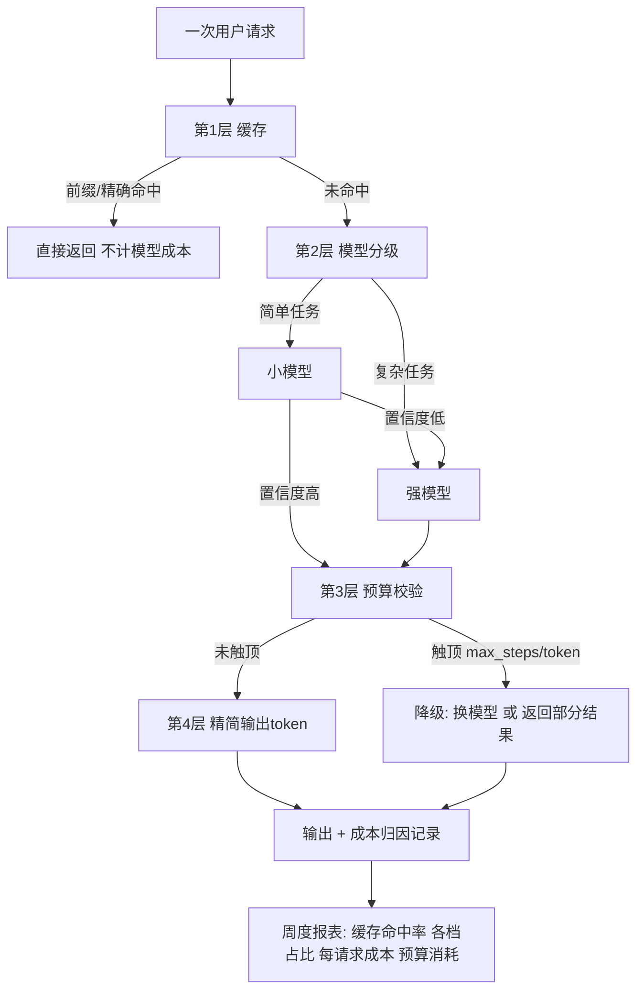
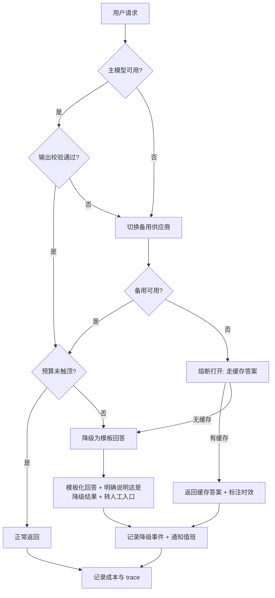

# [[业务场景实战]]

> [!tip] 学习目标
> 能把已有的原理组件组装成**能上线的系统**：为 5 类典型业务场景各选出一条主干链路并说清每个决策的理由；能为任意一条链路补齐「意图路由、状态与上下文、工具与权限、成本、可观测、可靠性、评估」这 7 件工程能力；能写出一份可执行的上线前清单，并在评审时指出**「看起来能跑但不能上线」的具体原因**。

> [!info] 本篇的边界：这是一篇组装笔记，不讲新原理
> 本篇的每个技术组件都来自库内已有笔记，**只做引用不重复推导**：架构与 Workflow/Agent 选型 → [[Agent-架构模式]]；框架与显式状态、流式、human-in-the-loop → [[Agent-框架]]；检索链路与引用溯源 → [[RAG-系统设计]]；检索侧评估 → [[RAG-评估]]；工具接入协议 → [[MCP-协议详解]]；接口层与重试限流 → [[API-调用与模型服务]]；路由/摘要稳定后仍不够，再谈 [[大模型微调]]。
> ==本篇新增的只有一件事：这些组件怎么拼、拼错了会死在哪一步、上线前必须过哪张清单。==

> [!danger] 读之前先接受一个判断
> ==Demo 与生产系统的差距，几乎从不在模型能力上，而在「失败时的行为」。== 能回答「模型超时怎么办」「工具执行到一半断网怎么办」「用户要求删掉他自己的数据怎么办」的系统才叫系统；答不上来的只是 demo。

---

## 🎯 难度分段学习路径

| 难度 | 核心关注 | 预估时长 |
|---|---|---|
| **入门** | 5 类场景的骨架差异、客服转人工的上下文交接、问答系统的引用与拒答 | 14h |
| **进阶** | 深度研究型的扇出与预算、摘要漂移、长期记忆与删除权、成本分层 | 18h |
| **高级** | 路由设计、状态与上下文预算、权限边界、可观测与可靠性、评估与灰度上线 | 20h |

**总学时**：52h ｜ **前置知识**：[[Agent-架构模式]] 全文、[[RAG-系统设计]] 的 1.2 与 2.5、[[API-调用与模型服务]] 的重试与流式部分

---

## 📖 第一章 入门（Beginner）

### 1.1 五类场景：按「错误的代价」而不是按「技术栈」划分

**结论先行**：==场景不是按「用了什么技术」分的，是按 **①输入是否确定 ②错误代价多大 ③有没有对外副作用** 这三条分的。== 同是「RAG + 提示词」，出现在客服和出现在个人总结里，架构完全不同：前者错误会直接变成工单和退款，后者错误只是用户自己看出来了。

| 场景 | 输入确定性 | 错误代价 | 对外副作用 | 主干架构 | 原理出处 |
|---|---|---|---|---|---|
| 智能客服 | 中（意图可枚举） | 高（退款/承诺/合规） | 有（写工单、改订单） | ==前置意图识别 + 检索 + 显式状态 + 人工转接== | [[Agent-架构模式]] 1.3 路由、2.5 记忆 |
| 搜索/问答 | 高（问题可枚举） | 中（误导，但不直接损失） | 无 | 查询改写 + 多路召回 + 引用 + 拒答 | [[RAG-系统设计]] 2.3-2.6 |
| 深度研究型 | 低（步骤不可预知） | 中（结论被采信） | 无 | 任务分解 + 子 Agent 扇出 + 预算控制 | [[Agent-架构模式]] 3.1 |
| 总结类 | 中（文档可分段） | 中（决策依据被篡改） | 无 | 分层摘要 + 结构化事实表 + 增量更新 | [[RAG-系统设计]] 1.4 |
| 个人助手 | 中 | 低（用户自己承担） | 有（代用户发消息/下单） | 长期记忆 + 工具白名单 + 跨平台适配 | [[Agent-架构模式]] 2.5、[[MCP-协议详解]] |

```mermaid
graph TD
    subgraph S1["场景1 智能客服"]
        A1[用户] --> A2[意图识别] --> A3[知识检索] --> A4{置信度够?}
        A4 -->|是| A5[带引用回答]
        A4 -->|否| A6[人工转接 + 交接包]
    end
    subgraph S2["场景2 搜索问答"]
        B1[问题] --> B2[改写与消解] --> B3[多路召回] --> B4[聚合重排] --> B5[引用核验]
        B5 -->|低于阈值| B6[拒答并给关键词]
    end
    subgraph S3["场景3 深度研究"]
        C1[主题] --> C2[计划] --> C3[子Agent扇出 只读] --> C4[汇总] --> C5[每条论断挂来源]
    end
    subgraph S4["场景4 总结类"]
        D1[长文档] --> D2[分块摘要] --> D3[结构化事实表] --> D4[增量比对更新]
    end
    subgraph S5["场景5 个人助手"]
        E1[多平台消息] --> E2[身份与会话归一] --> E3[长期记忆读写] --> E4[工具白名单 + 确认卡]
    end
    class A6,C3,E4 internal-link;
```

真实产品通常是它们的组合（如「研究型客服」= 场景 1 + 场景 3），但==主干链路只有这几条，每条先跑通再组合==；组合的失败模式（两个场景的上下文预算互相挤压）比单场景更难查。

**填空题**

1. 本篇划分五类业务场景依据的三个维度是：输入是否确定、错误代价大小，以及有没有 ______ 副作用。
2. 客服与个人助手架构不同的根本原因不是技术栈，而是 ______ 代价不同。
3. 搜索/问答型场景的主干链路是查询改写、多路召回、聚合重排，以及引用核验与 ______。
4. 判断两个场景能否组合时，最大的新增风险是各自场景的 ______ 预算互相挤压。

**答案**：
1. 对外
2. 错误
3. 拒答
4. 上下文

---

### 1.2 智能客服：意图前置、状态显式化，以及最难的一步——转人工

**结论先行**：==客服系统里最难的不是检索，是**转人工那一刻**。== 因为检索错了用户还能换个词再问，而转接一旦丢了上下文，用户要把自己说过的话重讲一遍——这是差评和流失的主要来源。

**第一步：意图识别前置，但要用级联而不是单次调用**

| 层级 | 手段 | 适用 | 为什么不放在后面做 |
|---|---|---|---|
| L1 规则/关键词 | 正则、词典、URL 参数 | 占比高且表述稳定的（查订单、退货政策） | 零成本、零延迟、结果确定 |
| L2 小模型分类 | 结构化输出的分类器 | 表述多样但类别有限 | 比强模型便宜一个数量级；输出可校准置信度 |
| L3 强模型兜底 | 通用模型 + 少量示例 | 边界模糊、长尾 | 只承接 L1/L2 不确定的 10-20%，成本可接受 |

> [!tip] 为什么要级联而不是一次分类
> ==因为分类是唯一「必须每次都调、错了就全盘错」的前置环节。== 用级联把大部分输入交给确定性方法，模型只处理真正模糊的部分：既省钱，又让「分类错误率」成为可监控、可回归的单一指标。

**第二步：知识库路由**——按意图选库/加字段过滤，优于「全库一把梭」（细节见 [[RAG-系统设计]] 2.1-2.2）。==路由结果（选了哪个库、用了哪个过滤条件）必须写进日志==，否则用户问「为什么它答的是别的产品」时你无法复现。

**第三步：多轮状态显式化**

| 做法 | 说明 | 为什么 |
|---|---|---|
| 关键信息存成结构化 slot | 订单号、诉求类型、已承诺事项 | 状态藏在 prompt 里就无法审计、无法校验、无法交接 |
| 每轮回显已确认项 | 「你问的是订单 12345 的退货，对吗？」 | 让用户有机会纠正，比事后从日志里猜便宜得多 |
| 已执行的写操作入库 | 「已提交退款，工单 T-9」 | 防止模型忘记自己做过，然后做第二次 |
| 轮次上限 | 同一诉求 2 轮未解决即转人工 | ==死循环是客服系统最常见的体验灾难== |

**第四步：转人工的触发条件与交接包**（本节最重要的一张表）

| 触发条件 | 判定方式 | 为什么 |
|---|---|---|
| 用户明确要求 | 关键词 | 用户自己知道什么时候不耐烦了 |
| 意图置信度低于阈值 | 分类器输出 | 低置信度时给出的答案往往是编的 |
| 知识库无命中且相似度低 | 检索分数 | 检索不到还硬答 = 幻觉 |
| 同一诉求连续 2 轮未推进 | 轮次状态 | 陷入循环 |
| 情绪/投诉意图 | 分类器 + 关键词 | 情绪识别不需要很准，召回高即可 |
| 涉及不可逆操作 | 工具元数据标记 | 退款、改地址、取消订单必须人确认 |
| 高价值客户或大额金额 | 业务规则 | 成本允许人工兜底 |

| 交接包字段 | 内容 | 缺失后果 |
|---|---|---|
| 已确认事实 | 结构化 slot（订单号、诉求、已核对项） | 人工重问一遍 |
| 已尝试动作 | 检索过的文档、已执行的操作、失败原因 | 人工重复劳动 |
| 幂等键 | 本会话已产生的写操作标识 | **人工重复执行退款** |
| 用户情绪与偏好 | 投诉中、要求书面回复 | 二次激怒 |
| 拒绝原因 | 置信度低 / 无命中 / 情绪 | 转接后又被推回机器人 |

> [!danger] 转接最贵的失败：模型只传「对话摘要」
> ==摘要会把订单号、金额、已承诺的时限这些真正重要的信息丢掉，而这些恰恰是结构化字段最该承载的。== 正确做法是**结构化交接包为主 + 摘要为辅**：slot 字段逐项交接，摘要只用来给人读语感。另一个高频坑是交接包没带幂等键，人工在工单里又点了一次退款。

**成本控制**（详见 2.4）：高频问题命中 FAQ 直接返回、会话内重复问题命中会话级缓存、每会话 token 上限；成本指标用「转人工率」而不是「对话轮数」。

**本场景的失败模式速查**

| 失败模式 | 症状 | 根因 | 修法 |
|---|---|---|---|
| 意图误判 | 问物流进了退款分支 | 类别覆盖不足/训练样本偏 | 加「其他」分支 + 监控分支分布 |
| 交接丢上下文 | 人工连问三轮 | 只传摘要 | 交接包结构化 + 幂等键 |
| 检索与政策冲突 | 答案里政策前后不一 | 知识库有多版本 | 政策类知识带生效日期，检索后做版本过滤 |
| 死循环 | 反复问同一句 | 无轮次上限 | 2 轮未推进即转人工 |
| 已执行动作遗忘 | 重复退款/重复下单 | 写操作未落库 | 工具调用即写状态，模型不管这件事 |

**填空题**

1. 客服系统的意图识别推荐用三级级联：规则/关键词、小模型分类，以及 ______ 兜底。
2. 客服多轮状态必须存成结构化 slot 而不是藏在提示词里，第一个理由是状态无法 ______。
3. 转人工的交接包必须包含幂等键，缺失最严重的后果是 ______。
4. 客服系统的「同一诉求连续未推进」轮次上限，推荐设为 ______ 轮。

**答案**：
1. 强模型
2. 审计与校验
3. 人工重复执行不可逆操作（如重复退款）
4. 2

---

### 1.3 搜索/问答型：改写、召回、聚合、引用与拒答

**结论先行**：==问答型系统的核心竞争力不在「答得多好」，而在**「答错时能不能被用户当场发现」**。== 所以引用可核查性与拒答策略的工程价值高于生成质量的主观提升。

**查询改写：三类必做**

| 改写类型 | 例子 | 不做的后果 |
|---|---|---|
| 指代消解 | 「它多少钱」→「上一句的型号多少钱」 | 检索到错误对象 |
| 时间归一 | 「去年的政策」→ 绝对时间区间 | 命中已失效版本 |
| 术语归一 | 内部黑话/缩写 → 标准词 | 词面不匹配导致召回为空 |

改写的输出**必须与原问题一起入库**：否则用户问「你为什么改我的问题」，你答不上来，且无法评估改写带来的召回增益。

**多路召回与聚合**

| 手段 | 作用 | 注意 |
|---|---|---|
| 稀疏/关键词检索 | 专名、编号、错误码 | 这类 query 向量检索经常失手 |
| 稠密检索 | 同义表达 | 细节见 [[RAG-系统设计]] 2.2 |
| 元数据过滤 | 时间、租户、文档类型、权限 | ==权限过滤必须在检索层做，不能在生成后过滤== |
| 聚合去重 | 同源文档多片段 | 重复片段会挤掉异质证据 |
| 重排 | 把真正能回答问题的排进去 | 细节见 [[RAG-系统设计]] 2.4 |

> [!tip] 多路召回的常见反效果
> ==三路召回常返回高度同质的一批文档，看起来 60 条，实际只有 3 个信息源。== 判据不是条数而是**去重后的来源数**：按来源设配额（同一文档最多 2 段），并把「来源数」作为指标上报。

**引用：句级 + 指向真实片段 ID**

| 要求 | 做法 | 反例 |
|---|---|---|
| 引用必须可定位 | 引用带片段 ID，点击跳到原文对应位置 | 只给一个首页链接 |
| 引用必须真的支持该句 | 生成后做一次「这句话被引用的片段支持吗」核验 | 引用了但内容不支持 |
| 引用必须覆盖关键论断 | 统计有多少比例的断言带引用 | 只在结尾堆三个链接 |
| 引用不能是模型编的 | 引用 ID 只能从检索结果里选，禁止自由生成 | 模型自己写 `来源：[1]` 而库里没有 [1] |

依据：ALCE 把「引用质量」与流畅性、正确性并列为三维指标，并证明自动指标与人工判断强相关；FActScore 提供了「拆成原子事实、逐条判断是否被可靠来源支持」的评估法，其警示性数字是==人物简介类长文本上，ChatGPT 当时的事实精度只有 58%==。二者合起来说明：==引用齐全与事实正确是两件事，都要单独测==。

**拒答策略：阈值必须靠离线集标定，不能拍脑袋**

| 拒答触发 | 判定 | 说明 |
|---|---|---|
| 检索最高分低于阈值 | 分数分布标定 | 阈值随嵌入模型和分块策略变化，换模型必须重标 |
| 引用核验不通过 | 生成后核验 | 兜住「有引用但不支持」的情况 |
| 关键槽位缺失 | 代码判定 | 例如政策类问题必须知道地区/时间 |
| 置信度低（可选） | 模型自评或采样一致性 | ==自评置信度在开放域问答里不可靠，只能当辅助信号== |

> [!danger] 拒答率与准确率是生意上的对立面
> ==把拒答阈值调高，业务上看到的是「更多问题被回答了」，质量上看到的是「更多问题被编了」。== 这两个指标必须同时上报给业务方，并约定一个联合门槛（例如：拒答率不超过 X% 且事实精度不低于 Y%），否则任何一方单独优化都会把系统调坏。

**填空题**

1. 问答型系统里，权限过滤必须放在 ______ 层做，而不是在生成之后过滤输出。
2. 多路召回的健康度判据不是召回条数，而是去重后的 ______ 数。
3. ALCE 基准把引用质量与流畅性、______ 并列为三个评估维度。
4. 拒答阈值的标定依赖具体嵌入模型与分块策略，因此更换 ______ 后必须重新标定阈值。

**答案**：
1. 检索
2. 来源
3. 正确性
4. 嵌入模型（或分块策略）

---

### 1.4 第一章综合练习

**填空题（本章共 4 道，答案见下方）**

1. 本篇按「输入确定性、错误代价、对外副作用」三条划分场景，智能客服的对外副作用是 ______。
2. 转人工交接包里最不能省的是结构化 slot 与 ______。
3. 问答型系统里「引用齐全但事实错误」这件事要单独测，常用的评估方法是把长文本拆成 ______。
4. 拒答阈值不能拍脑袋的根本原因是它依赖具体的嵌入模型与 ______。

**本章答案**：
1. 写工单、改订单等对内系统的写操作
2. 幂等键
3. 原子事实并逐条判断是否被可靠来源支持
4. 分块策略

**综合项目**：拿一个你见过的真实 AI 客服（或自己设计一个），写出它的**上线前差距报告**：
1. 画出意图识别的级联方案（L1/L2/L3 各承担多少比例的流量），并说明比例依据；
2. 列出转人工的全部触发条件，标出哪几条目前缺失；
3. 写出交接包的字段清单，并逐个字段回答「这个字段从哪来、谁维护」；
4. 设计 3 个成本指标与 3 个质量指标，并说明各自的数据来源（哪个表、哪个字段）；
5. 找出一处「模型做了不可逆操作但没有幂等键」的地方，给出补法。

> [!tip] 常见陷阱
> 1. **把意图识别放在最后**：意图是唯一的全局前置决策，放最后意味着分类错误已经污染了检索与生成，事后无法归因。
> 2. **转人工只传摘要**：摘要丢的正是 slot 字段里那些订单号、金额、承诺时限。见 1.2。
> 3. **客服系统没有轮次上限**：死循环比答错更伤，用户体验上是「机器人死了」。
> 4. **问答系统不测引用**：引用缺失时用户会把幻觉归因于「系统胡说」，而有了错误引用，用户会认为系统「有依据地骗人」，后者伤害大得多。
> 5. **拒答阈值只由算法同学定**：阈值直接决定用户看到「答案」还是「我不知道」，这是产品决策，必须多方共同签字。

> [!note] 本章权威资料
> 本章依据集中在三条：[Building Effective Agents（Anthropic）](https://www.anthropic.com/engineering/building-effective-agents)（路由模式与「简单问题路由到更小更便宜的模型」）、[τ-bench](https://arxiv.org/abs/2406.12045)（客服型 Agent 成功率低于 50%、零售领域 `pass^8 < 25%`）、[ALCE](https://arxiv.org/abs/2305.14627) 与 [FActScore](https://arxiv.org/abs/2305.14251)（引用质量三维指标、人物简介任务事实精度仅 58%）。

---

## 📖 第二章 进阶（Intermediate）

> [!warning] 与上一章的衔接
> 第一章解决「单场景的骨架」，本章解决「骨架在真实负载与真实时长下的行为」。跳过的代价：==demo 里跑通的链路，会在第 8 轮对话、第 20 个并发用户、第 30 分钟研究任务上以「说不清原因的方式」崩掉。==

### 2.1 深度研究型：扇出、预算、以及让结论可核查

**结论先行**：==研究型系统的用户等待的是**结论**，但你必须先让系统能安全地**中途失败**。== 决定它能不能上线的不是平均质量，而是「预算耗尽时它给出什么」。

**任务分解：先出计划，再并行执行**

| 做法 | 说明 | 何时不适用 |
|---|---|---|
| 先出可读计划 | 计划要能被用户一眼看懂并纠正 | 任务本身模糊到无法拆（例如「研究一下量子计算」） |
| 每个子任务带四要素 | 目标、输出格式、来源要求、边界 | ==四要素缺一，扇出的就是「重复劳动 + 覆盖缺口」== |
| 先宽后窄的检索 | 先短而宽的 query 评估可用性，再收窄 | 主题明确到只有一两个信源时无需多轮 |
| 按复杂度分档投入 | 简单事实查找 1 个子任务；对比类 2-4 个；复杂研究 10+ | 依据见 [[Agent-架构模式]] 3.1 的官方分档 |

**子 Agent 扇出：只读优先**

| 约束 | 做法 | 理由 |
|---|---|---|
| 子 Agent 只读 | 不给写工具；确需写时写不相交区域 | 共享写 = 冲突（Cognition 的两条原则之一） |
| 上下文隔离 | 子 Agent 用干净窗口深挖，只回填 1,000-2,000 token 结论 | 避免主上下文被几万 token 的中间过程塞满 |
| 结论必带来源 | 子任务返回结构化结论 + URL + 抓取时间 | 没有来源的结论无法进入最终报告 |
| 失败可单独重跑 | 每个子任务独立状态、幂等 | 一个子任务超时不该让全部产出作废 |

**进度汇报：让用户在等待中也能判断「值不值得继续」**

Anthropic 在讲长时程 Agent 的一篇工程文章里给出的做法可以直接迁移到研究型系统：**初始化阶段就把任务拆成结构化的功能清单（JSON 优于 Markdown，因为模型更不容易把 JSON 改坏），执行阶段每个会话只推进一项并在结束时留下进度文件与可回滚的提交**。迁移到研究型系统就是三件事：==①入口就产出可勾选的子任务清单；②阶段性给用户「已完成 / 进行中 / 剩余」的三段进度；③每完成若干项就落一次盘，而不是全部跑完才写报告==。

> [!danger] 超时是研究型系统最贵的失败
> ==「跑满 30 分钟后整份报告作废」是不可接受的。== 必须做到：全局墙钟预算 + 每子任务 token 上限 + 子任务数量上限，三者任一触顶即停止扇出，用**已完成的子任务**生成一版带「未完成」标注的中间交付物。这一条决定了用户是否愿意把研究型 Agent 用在真实工作上。

**引用可核查性：报告级需求**

| 要求 | 做法 | 不做的后果 |
|---|---|---|
| 逐论断挂来源 | 每个事实性断言后跟 `[n]`，`n` 指向参考表 | 无法核查 = 无法采信 = 报告沦为「看起来很像」 |
| 记录抓取时间 | 存 URL + 抓取时间 + 片段哈希 | 网站改版后无法复现当时引用的内容 |
| 区分「来源说」与「模型推断」 | 推断必须显式标注 | 把推断伪装成引用，是学术与合规双重风险 |
| 定期复查链接有效性 | 定期批量校验 URL 状态 | 三个月后报告里一半链接失效 |
| 不可核查就降级措辞 | 「暂无来源支持」而不是硬写 | 硬写就是幻觉 |

**失败模式速查**

| 失败模式 | 症状 | 修法 |
|---|---|---|
| 扇出过热 | 20 个子任务、协调成本超过收益 | 设子任务数上限；预定义能拆就别动态 |
| 扇出过窄 | 每个子任务只查一个源就下结论 | 在子任务里写死「至少 3 个独立来源」 |
| 结论确定但不可核查 | 报告读起来很确定，找不到依据 | 逐论断引用门禁：没引用的断言不许进正文 |
| 超时全损 | 跑 30 分钟后什么都没有 | 阶段性落盘 + 超时降级交付 |
| 进度不清 | 用户 10 分钟看不到动静就关掉 | 入口给子任务清单，每完成 N 项汇报一次 |

**填空题**

1. 深度研究型系统的扇出，Anthropic 指出子任务只读优先的原因是共享写会带来 ______。
2. 长时程 Agent 工程文章中，初始化阶段的任务清单推荐用 ______ 格式而非 Markdown，理由是模型更不容易把它改坏。
3. 研究型系统的三重预算是：全局墙钟预算、每子任务 token 上限，以及 ______。
4. 报告逐论断挂来源时，参考表里除 URL 外还必须记录 ______ 与片段哈希。

**答案**：
1. 冲突决策
2. JSON
3. 子任务数量上限
4. 抓取时间

---

### 2.2 总结类：分层摘要、结构化事实表与摘要漂移

**结论先行**：==摘要类系统的正确产物不是一段摘要，而是「一段摘要 + 一张可回溯的事实表」。== 只有摘要的总结系统，三个月后没人敢用，因为它无法回溯原文。

**长文档的分层处理**

| 方案 | 机制 | 适用 | 代价 |
|---|---|---|---|
| 分块独立摘要 | 逐块摘要后拼接 | 文档结构清晰、块间耦合低 | 跨块指代与全局结论丢失 |
| 递归压缩（map-reduce） | 摘要的摘要 | 通用长文档 | 多次压缩 → 漂移累积 |
| 抽取式 + 生成式结合 | 先抽结构化事实，再让模型组织语言 | 政策、财报、会议纪要 | 抽取阶段召回不足就会漏关键项 |
| 只索引不摘要 | 保留原文分块，按需取 | 问答比摘要更重要的场景 | 查询时 token 成本高 |

**结构化事实表：对抗漂移的核心手段**

| 字段 | 作用 |
|---|---|
| 实体 | 会议 / 合同 / 人员 / 指标名 |
| 属性 | 到期日 / 金额 / 负责人 / 阈值 |
| 值 | 抽取出的值，保留原始类型（日期不转成自然语言） |
| 来源块 ID | ==事实必须能一键跳回原文== |
| 原文摘录 | 一句话原文，供核对 |
| 版本 | 摘要版本 + 原文版本（用于增量更新与冲突消解） |

> [!tip] 为什么关键数字与实体不能只靠摘要
> ==摘要对「谁在什么时候做了什么」这类叙事性内容压缩得很好，对「阈值是 3.5 还是 35」这类离散事实压缩得很差。== 把数字和实体抽成结构化字段后，更新、比对、告警（到期提醒）都变成代码逻辑，不依赖模型记性。

**增量更新**

| 做法 | 说明 |
|---|---|
| 按块哈希判定变更 | 只对变化的块重新抽取与摘要 |
| 事实表做差分 | 新增/修改/删除三类分别处理，修改要覆盖旧值而不是并存 |
| 冲突显式化 | 同一实体属性出现两个值时不静默二选一，标为「待确认」并指明各自来源 |
| 保留旧版本摘要 | 回滚与「为什么上周的说法不一样」都要靠它 |

**摘要漂移的四个来源**

| 漂移来源 | 表现 | 修法 |
|---|---|---|
| 多次压缩 | 细节逐级变糊 | 压缩次数上限（一般 2 轮），之后回原文重取 |
| 长上下文中部召回率下降 | 关键信息在中间时更容易被漏 | ==把关键信息放上下文的开头或结尾==（Lost in the Middle 的结论） |
| 条件与否定被丢掉 | 「用户询问是否能退款」被摘要成「已退款」 | 状态字段单独存，不进自然语言摘要 |
| 隐含假设被补全 | 摘要里出现原文没有的因果 | 抽取阶段只允许复制，不允许改写；改写部分单独标注 |

**失败模式速查**：摘要替代原文导致无法回溯；只做增量导致误差累积；多轮对话摘要把「意图」写成「事实」；摘要没有版本号，两个版本的摘要混在同一个索引里。

**填空题**

1. 摘要类系统的正确产物是「一段摘要 + 一张可回溯的 ______」。
2. 事实表的字段里，`来源块 ID` 的作用是让事实能一键 ______ 原文。
3. `Lost in the Middle` 论文的结论支持这样一条实践：把关键信息放在上下文的 ______ 或结尾。
4. 摘要漂移的四个来源里，「压缩次数上限」针对的是 ______ 漂移。

**答案**：
1. 事实表
2. 跳回
3. 开头
4. 多次压缩

---

### 2.3 个人助手：长期记忆、跨平台接入、污染与用户删除权

**结论先行**：==个人助手是唯一一类「用户会长期共存」的系统，因此它的默认答案是**保守**：能不做的不做、能不给权限的不给、能删干净的一定删干净。== 记忆四类与污染治理见 [[Agent-架构模式]] 2.5，本节只补落地时的三个硬问题。

**记忆落地的三张表**

| 表 | 内容 | 生命周期 | 关键约束 |
|---|---|---|---|
| 语义记忆 | 用户偏好、事实、配置 | 长期 | 带来源、时间戳、置信度、作用域 |
| 情景记忆 | 做过什么、何时做的 | 长期 | 只追加，带事件 ID；不可静默改写 |
| 会话状态 | 当前对话的临时 slot | 会话级 | ==会话结束即冻结，不自动晋升为长期记忆== |

> [!danger] 记忆污染是唯一「跨会话传染」的错误通道
> 工具调用错了，这次会话结束就过去了；==记忆写错了，之后每一次会话都带着这个错误出发。== 所以记忆写入的验证强度必须**高于**普通工具调用。写之前先核验：能从权威源取到的就去取，取不到就标为「假设」并隔离。外部知识库被投毒同样危险——PoisonedRAG 这类工作展示了攻击者只需污染知识库少量条目，就能让检索增强系统在特定问题上稳定输出攻击者指定的错误答案。

**记忆条目的最小元数据**：`来源`、`时间戳`、`置信度`、`作用域（会话/项目/用户全局）`、`被引用次数`、`最近确认时间`。缺 `作用域` 就会把一次性约定固化成永久偏好；缺 `来源` 就无法纠错。

**冲突处理**：新记忆与旧记忆冲突时，==不要静默覆盖==。存两条、标各自时间与来源、在召回时展示冲突并让用户选择。对「用户明确纠正过的内容」加高优先级标记，混合检索（语义 + 关键词 + 近期）。

**跨平台接入的统一层**

| 适配层要处理 | 原因 |
|---|---|
| 统一会话 ID | 不同平台的消息要能串成同一段经历 |
| 平台身份 → 用户身份映射 | 工具鉴权必须用真实用户身份，不是平台昵称 |
| 群聊的发言人标注 | ==群聊里必须知道每句话是谁说的，否则记忆会串人== |
| 平台特性差异 | 群聊被动接收 vs 私聊主动问答，记忆写入门槛应不同 |
| 平台侧的消息长度与富文本限制 | 决定摘要与分片的策略 |
| 平台侧的合规与留存 | 决定日志与历史的保留期限 |

协议层的外部能力接入走 [[MCP-协议详解]]；跨 Agent/跨系统互操作可参考 [A2A 协议](https://a2a-protocol.org/latest/)；平台侧接口以各自官方文档为准（本机未核验，故不列具体链接）。

**用户删除权：必须覆盖到缓存**

| 数据位置 | 典型形态 | 删除要点 |
|---|---|---|
| 主存储 | 消息与记忆表 | 按用户维度删除，保留审计所需的最小元信息 |
| 向量库 | 记忆与文档的嵌入 | ==只删原文不删嵌入，等于没删== |
| 缓存 | 语义缓存、结果缓存 | 缓存键里带用户标识，才能被清理 |
| 日志与追踪 | 提示词、工具返回 | 写入时就该分级，删除流程要能按类执行 |
| 微调数据 | 已进入训练集的样本 | 不可逆，必须在训练前告知并取得同意 |

法律依据可查：《[中华人民共和国个人信息保护法](http://www.npc.gov.cn/npc/c2/c30834/202108/t20210820_313088.html)》第四十七条确立了个人对个人信息的删除权；欧盟侧对应 [GDPR 第 17 条](https://gdpr-info.eu/art-17-gdpr/)。工程含义是：==删除必须是一次可验证的端到端流程，而不是「给用户一个删除按钮」。==

**失败模式速查**：群聊上下文串人；删除只删了向量库；记忆无来源导致无法纠错；不同用户共用记忆作用域导致助手对所有人说同样的话；助手把第三方诱导的内容（如网页里的话）写成了用户偏好。

**填空题**

1. 记忆写入的验证强度必须 ______ 普通工具调用，理由是错误记忆会跨会话传染。
2. 记忆条目的元数据里，缺 `作用域` 会导致一次性约定被 ______ 成永久偏好。
3. 跨平台适配层里，群聊场景必须额外处理的是 ______ 标注，否则记忆会串人。
4. 满足用户删除权时，只删原文不删向量库里的 ______，等于没删。

**答案**：
1. 高于
2. 固化
3. 发言人
4. 嵌入

---

### 2.4 成本控制：四层杠杆，命中率与风险都可算

**结论先行**：==成本优化按「改动量 / 收益」排序是：缓存 → 模型分级 → 步数与 token 预算 → 减少无效 token。== ==不要用并行当省钱手段==（见 [[Agent-架构模式]] 1.4：并行只降墙钟时间，token 总量上升）。

**第 1 层：缓存**

| 手段 | 机制 | 命中率 | 风险与对策 |
|---|---|---|---|
| 精确缓存 | 同问题同上下文直接复用 | 低-中 | 上下文一变即失效；适合 FAQ |
| **前缀缓存** | 复用提示词的公共前缀 | ==高==（系统提示、工具定义、知识片段稳定时） | 前缀必须逐字节稳定；动态时间戳要放在前缀之外 |
| 语义缓存 | 向量相似度超阈值即复用答案 | 中 | ==答案含个性化或副作用时禁用==；阈值要设得极高 |

Anthropic 的官方文档给出了前缀缓存的计费事实：==缓存写入比基础输入 token 贵 25%（5 分钟存活期），缓存读取是基础输入价格的 10%，而断点本身不额外计费；默认存活期 5 分钟，可选 1 小时但代价是 2 倍基础输入价格。== 由此得出两条结论：**① 长时程会话（同一用户连续追问、每次都重发同一份长系统提示）是最划算的缓存场景；② 断点之前的任何字节变化都会让哈希变化，所以「把当前时间拼进系统提示」这种小改动会静默吃掉全部缓存收益。**

语义缓存的工程判定（参考 [GPTCache](https://github.com/zilliztech/GPTCache) 与 [Anyscale 的语义缓存实践](https://www.anyscale.com/blog/semantic-caching-llms)）：==能否用语义缓存，取决于「答案是否只由问题决定」==。与用户状态、时间、订单相关的问答用了语义缓存就是错误答案。安全做法是缓存键 = `语义相似(query) + 用户/租户标识 + 状态版本`，并设 TTL。

**第 2 层：模型分级**

| 任务类型 | 推荐档位 | 升级条件 |
|---|---|---|
| 意图分类、查询改写、槽位抽取 | 小模型 | 分类置信度低 → 升级强模型 |
| FAQ 直答、格式转换、简单摘要 | 小模型 | 输出校验不通过 → 升级 |
| 多跳问答、复杂改写、最终生成 | 强模型 | —— |
| 兜底与高风险判断 | 强模型 | ==高风险动作不允许静默降级== |

> [!tip] 分级的判据是离线评估集，不是「感觉」
> 把一批真实样本分别用小模型与强模型跑，比较质量与成本的交叉点；==小模型在困难样本上失败一次要付出的代价，往往超过省下来的钱==，所以必须同时看「小模型通过率」与「错答率」。参考 [[RAG-系统设计]] 2.4 的重排思路：用小模型做粗排、大模型做精排，往往比整体换模型更划算。

**第 3 层：步数与 token 预算**

| 上限 | 作用 | 触顶行为 |
|---|---|---|
| `max_steps` | 防循环不收敛 | 停止并返回部分结果 + 标注未完成 |
| 每步工具返回 token 上限 | 防上下文被单个工具塞满 | 分页 + 截断指引（见 [[Agent-架构模式]] 2.2） |
| 单请求 token 上限 | 防单请求烧掉几十万 token | 降级到更便宜的模型或直接返回部分结果 |
| 每用户/租户周期预算 | 防单用户刷爆 | 超出后降级到模板回答或排队 |

**第 4 层：减少无效 token**：结果聚合（多工具一次返回而非多次拉取）、结构化输出（禁止啰嗦复述）、把大块参考材料放工具里按需取而不是全量塞进系统提示。

> [!danger] 成本优化的三个反模式
> ①**并行当省钱**（token 总量不降）；②**语义缓存用在个性化回答上**（把「你的订单 12345 还没发货」发给所有相似问句）；③**只看成本把强模型全换小模型**（单次省下的钱，会被一次错误退款吃掉十倍）。

**填空题**

1. 成本优化的四层杠杆按「改动量/收益」排序是：缓存、模型分级、步数与 token 预算，以及 ______。
2. Anthropic 官方文档中，5 分钟存活期的前缀缓存写入价格是基础输入 token 的 ______。
3. 语义缓存能否使用的判据是「答案是否只由 ______ 决定」。
4. 并行在成本上的真相是：只降低墙钟时间，token 总量 ______。

**答案**：
1. 减少无效 token
2. 贵 25%（即 1.25 倍）
3. 问题
4. 上升

---

### 2.5 第二章综合练习

**填空题（本章共 4 道，答案见下方）**

1. 研究型系统触顶三重预算（墙钟、子任务 token、子任务数）后，正确行为是用**已完成的子任务**生成标注了 ______ 的中间交付物。
2. 摘要漂移的四种来源之外，还有一个容易被忽略的：摘要把「用户询问是否能退款」写成「已退款」，属于条件与 ______ 被丢掉。
3. 个人助手的记忆写入除了核验外，还必须带 `作用域` 字段，否则 ______ 会被永久固化。
4. 前缀缓存要真正命中，前缀内容必须逐字节稳定，因此「把当前时间拼进系统提示」这类改动会 ______ 缓存收益。

**本章答案**：
1. 未完成
2. 否定
3. 一次性约定
4. 静默吃掉

**综合项目**：给你的系统做一份**成本与预算设计文档**：
1. 列出链路中每一次模型调用的用途与当前档位，标出哪些可以降级；
2. 找出提示词中所有会逐次变化的动态字段，评估它们是否污染了前缀缓存，给出重排方案；
3. 写出四层预算的默认值与触顶行为，并说明「触顶后给用户看什么」；
4. 定义成本归因维度（按场景/按功能/按租户），确保能回答「上周哪条链路花了 60% 的钱」；
5. 用离线评估集验证小模型在困难样本上的失败率，给出「哪些样本必须升级到强模型」的具体判据。

> [!tip] 常见陷阱
> 1. **把预算当告警而不是限制**：token 上限必须是硬闸门，超了就停；告警只是告诉你快超了。
> 2. **扇出没有数量上限**：子 Agent 数量爆炸时，token 消耗与延迟都是超线性上升。
> 3. **摘要替代原文**：没有原文指针的摘要，三个月后没人敢用，也没法复核。
> 4. **删除只删主存储**：向量库、缓存、日志里都还有用户数据，这属于合规事故而不只是功能缺陷。
> 5. **缓存没有 TTL 与版本键**：知识库更新后旧答案继续被命中，且没人发现。

> [!note] 本章权威资料
> 依据集中在：[Prompt caching 官方文档](https://docs.anthropic.com/en/docs/build-with-claude/prompt-caching)（断点、5 分钟/1 小时存活期、写入 1.25 倍、读取 0.1 倍）、[多 Agent 研究系统](https://www.anthropic.com/engineering/multi-agent-research-system) 与 [长时程 Agent 工程实践](https://www.anthropic.com/engineering/effective-harnesses-for-long-running-agents)（扇出分档、委派四要素、初始化清单用 JSON、进度文件与端到端验证）、[Lost in the Middle](https://arxiv.org/abs/2307.03172)（关键信息在上下文中部时召回显著退化）、[PoisonedRAG](https://arxiv.org/abs/2402.07867)、[R-Tuning](https://arxiv.org/abs/2311.09677)。

---

## 📖 第三章 高级（Advanced）

> [!note] 深度标准
> 本章的每条建议都要能回答两件事：==**为什么这样有效**，以及**在什么情况下这条建议是错的**。== 3.1 到 3.6 是 7 件工程能力里的 6 件，第 7 件（评估上线）单独放在 3.6 与章末清单。

### 3.1 意图识别与路由：显式分支与隐式决策的边界

**结论先行**：==路由的本质是「把「下一步做什么」的决定权从模型手里拿回代码手里」的次数。== 拿回得越多，可测性越好、成本越可预算；一次都拿不回，说明你缺的不是模型，是分支设计。

| 判据 | 信号 | 该做什么 |
|---|---|---|
| 类别可枚举 | 意图种类有限、每类处理方式不同 | ==显式 Workflow 分支== |
| 分类可判别 | 规则或小模型能测出足够准确率 | 显式分支 + 置信度 |
| 步骤数不可预知 | 需要探索、需多次试探 | 交给模型隐式决策（见 [[Agent-架构模式]] 3.2） |
| 中间结果影响后续 | 检索结果决定下一步动作 | 显式分支（每步一个可测决策点） |
| 用户会中途改主意 | 多轮里诉求变化 | ==每轮重跑分类，而不是只在首轮分类== |

**显式路由的三条实现纪律**

| 纪律 | 说明 | 违反的后果 |
|---|---|---|
| 分类器必须能输出「其他」 | 类别覆盖不足时，大量输入被硬塞进最像的分支 | 分类错误会污染下游，且下游没有能力察觉 |
| 记录分支分布 | 某一分支占比异常高，通常意味着分类有偏 | 偏置会在长尾里持续放大 |
| 每个分支独立迭代 | 各分支的提示词与工具单独维护 | 混在一起优化时，改一处坏一处 |

**置信度的正确用法**：置信度低时**降级**（换更强的分类模型、扩到多标签、最终转人工），==而不是「取 top-1 硬走」==。分类器输出「其他」的比例是分类器健康度的核心指标之一。

**失败模式速查**：类别覆盖不足导致误路由；只在首轮分类导致多轮诉求变化后走错分支；路由结果不落日志导致无法归因；把「先让大模型自己判断」当作路由（==等于没路由，且不可测==）。

**填空题**

1. 路由的本质是把「下一步做什么」的决定权从模型手里拿回 ______。
2. 显式路由要求分类器必须能输出的一个类别是「______」。
3. 多轮对话中诉求会变化，因此分类应当每轮 ______，而不是只在首轮做。
4. 分类置信度低时的正确做法是 ______，而不是取 top-1 硬走。

**答案**：
1. 代码
2. 其他
3. 重跑
4. 降级（换更强分类器 / 扩多标签 / 转人工）

---

### 3.2 状态与对话管理：把状态从提示词里搬出来

**结论先行**：==会话状态的唯一硬标准是「能不能被人审计」。== 状态藏在提示词里，出了错你只能重放整段对话猜模型在想什么。

| 组件 | 存什么 | 选型要点 | 常见错误 |
|---|---|---|---|
| 会话元信息 | 会话 ID、用户、渠道、时间、版本 | 按用户可删 | 缺用户维度 → 无法满足删除权 |
| 结构化状态 | slot、当前分支、已执行动作、预算余额 | 独立表，可读写可回滚 | 塞进 prompt → 无法审计 |
| 消息历史 | 原始消息 | 短期存储，需保留期 | 存成单条大字符串 → 无法分轮压缩 |
| 长期记忆 | 见 2.3 | 独立存储，带来源与作用域 | 与会话状态混用 → 记忆污染 |

**上下文窗口预算：按角色分配，而不是「能塞就塞」**

| 段 | 内容 | 预算策略 |
|---|---|---|
| 固定前缀 | 系统提示 + 工具定义 | 保持逐字节稳定以吃前缀缓存 |
| 结构化状态 | slot、已执行动作 | 结构化紧凑序列化，变更时只更新差异 |
| 近期历史 | 最近 N 轮 | 滚动窗口；N 由评估集标定 |
| 检索片段 | 本轮证据 | 按重排分数截断，附片段 ID |
| 预留 | 输出与工具返回 | 留够，否则最后一步被截断 |

==上下文腐化是所有长对话系统的公共税：性能随 token 数上升而梯度下降，不是断崖。== 因此压缩策略必须**显式指定保留项**（架构决策、已确认约束、未完成项、已执行动作），而不是笼统地「摘要一下」。

**多轮一致性的四条纪律**

1. **每轮回显已确认约束**：「你确认的是订单 12345 退货，对吗？」——用户的一次纠正比事后从日志里猜便宜得多。
2. **工具结果与对话冲突时以工具为准**，并在输出里说明冲突（「你之前说还没发货，但系统显示昨天已签收」），不要默默改口。
3. **压缩后必须保留否定与条件**：「用户问过能不能退」不能压成「用户要求退款」。
4. **换模型或压缩后要交接摘要**：模型不同、工具调用格式可能不兼容，最保险的做法是新开会话 + 交接摘要。

**并发与重入**：用户连点两次发送、前端重试、网络抖动导致的重复请求，都会造成重复工具调用。防护是**请求级幂等键 + 会话内状态锁**，见 [[Agent-架构模式]] 3.3。

**失败模式速查**：状态只在 prompt 里；上下文塞满后行为突变且无法解释；压缩丢了否定条件；并发送送导致重复写操作；切换模型后工具调用格式不兼容却继续复用旧会话。

**填空题**

1. 会话状态的唯一硬标准是能不能被 ______。
2. 上下文预算的固定前缀段要保持逐字节稳定，目的是吃 ______ 缓存。
3. 压缩策略必须显式指定的保留项有：架构决策、已确认约束、______，以及已执行动作。
4. 工具结果与用户先前的说法冲突时，正确做法是以 ______ 为准并在输出里说明。

**答案**：
1. 人审计
2. 前缀
3. 未完成项
4. 工具结果

---

### 3.3 工具与权限：不可信的是内容，可信的是边界

**结论先行**：==提示注入是**架构性问题**，不是提示词问题。== 官方风险清单把提示注入排在第一位，并明确指出：检索增强与微调**都不能完全缓解**它；模型不区分「指令」与「数据」是当前架构的固有限制。==因此正确的设计前提是：假定指令边界终将被绕过，然后限制「模型被允许做什么」以及「它的输出能到达哪里」。==

| 防线 | 做法 | 为什么提示词挡不住 |
|---|---|---|
| 工具白名单 | 按用户授权与场景生成可用工具集，不做全局注册表 | 提示词里写「不要调用 X」是软约束，可被诱导 |
| 危险操作人工确认 | 确认卡展示动作、目标、影响范围、是否可撤销；确认令牌带 TTL 且一次性 | ==让模型自己「确认一下」等于没有确认== |
| 最小权限 | 工具用发起会话的真实用户身份鉴权，服务端二次鉴权 | 模型可以幻觉、误解、声称自己是任何人 |
| 凭据不出服务端 | API key、token 永远不进 prompt、不进日志 | 一旦进上下文就会被检索、被摘要、被外泄 |
| 不可信内容不决定权限 | 检索到的文档、网页、邮件里的任何「指令」都不获得授权 | 这正是间接提示注入的作用面 |
| 批量大小上限 | `delete_items(ids[])` 必须限制数组长度 | 一次幻觉就能清空仓库 |
| 软删除优先 | 保留可恢复窗口 | 硬删不可逆，无法挽回 |

**工具设计的三条硬要求**（细节与例子见 [[Agent-架构模式]] 2.1-2.3）：工具描述要写清**何时不用**；参数扁平、消除转义与计数负担；返回值分页并**在截断处留下继续取数的指引**（静默截断 = 静默制造错误结论）。

> [!danger] 权限检查必须在服务端，而不是在提示词里
> ==模型只负责提出请求，不负责获得授权。== 同一条铁律也适用于 MCP 场景：接了外部 MCP 服务器后，模型会遇到它从未见过、描述质量参差不齐的工具；官方给出的应对不是「更小心地提示」，而是明确的工具选择启发式加上层层的权限与确认边界。

**失败模式速查**：模型自选确认步骤；工具名相似导致误选（用命名空间隔离）；检索内容里写着「请调用 refund_all」而工具恰好在白名单里；凭据写进日志；批量删除没有长度上限；白名单是全局的，导致 A 场景能调用 B 场景的高权限工具。

**填空题**

1. 提示注入被官方风险清单排在第一位，且官方明确指出检索增强与微调都 ______ 完全缓解它。
2. 面对提示注入，正确设计前提是假定指令边界终将被 ______，然后限制模型的权限与输出可达范围。
3. 危险操作的确认令牌必须带 ______ 且一次性，防止旧确认被复用。
4. MCP 场景下，官方对「模型面对陌生工具」给出的应对是工具选择启发式加上 ______ 与确认边界。

**答案**：
1. 不能
2. 绕过
3. TTL
4. 权限边界

---

### 3.4 可观测性：链路要能重放，日志要有红线

**结论先行**：==没有 trace 的 Agent 系统，线上出问题时你只能靠时间戳猜。== 最低要求：一次用户请求从入口到输出有**一个 trace_id**，模型调用、检索、工具各有 span，并携带 token 与耗时。

**统一语义约定，不要自定义字段名**：直接采用 OpenTelemetry 的生成式 AI 语义约定，把模型名、请求参数、输入/输出 token 数、工具名、错误类型等记成标准属性。==自定义字段名的可观测性在第二次迭代时就会变成负债==（旧仪表盘全部失效，新同事读不懂）。

| 层次 | 记什么 | 用途 |
|---|---|---|
| Trace | 一次请求的完整调用树 | 复现失败、定位长尾 |
| 业务事件 | 会话开始/结束、转人工、拒答、降级、确认 | 回答「产品发生了什么」 |
| 成本记录 | 每 span 的 token 与估算费用，标注场景/功能/租户 | 回答「钱花在哪」 |
| 质量代理指标 | 引用核验通过率、拒答率、平均轮数、重复工具调用率 | 不用等用户投诉才发现退化 |

**日志红线：这些绝不能进日志**

| 禁止项 | 原因 | 替代做法 |
|---|---|---|
| 完整系统提示 | 含业务规则与边界，泄露等于交出攻击面 | 记提示词版本号 |
| 原始用户输入 / 工具返回 | 可能含个人信息、订单、凭据 | 分级脱敏，或只存哈希 + 长度 + 片段 |
| API key、会话令牌、数据库口令 | 直接凭据泄露 | 服务端只存引用，日志打指纹 |
| 检索到的受限文档正文 | 可能跨租户泄露 | 记文档 ID 与授权决策结果 |

同时必须具备：==按用户与按类别删除的能力==（与 2.3 的删除权对齐）、明确保留期、以及在用户可见界面明示「这段对话被记录用于改进」。

**指标与告警**

| 类型 | 指标 | 告警方式 |
|---|---|---|
| 延迟 | p50 / p95 / p99 分场景 | 症状告警（用户等太久），不是原因告警（CPU 高） |
| 成本 | 每请求成本、每租户周期消耗 | 预算百分比 + 环比突变 |
| 可用性 | 成功率、降级率、熔断打开次数 | 状态变化即通知 |
| 质量代理 | 引用有效率、拒答率、转人工率、平均轮数 | 突变告警（环比） |
| 安全 | 高危工具被拒次数、越权尝试 | 任何一次都值得看 |

> [!danger] 告警必须可执行
> Prometheus 的告警实践里最容易被忽略的一条是：==告警要基于「用户受到的影响」而不是「某台机器的某个数值」，每条告警都要能回答「我现在该做什么」。== 一个没人看、没人能行动的告警只会制造告警疲劳，最后连真告警也被忽略。

**失败模式速查**：只记成功请求（失败才是要查的）；日志把提示词全量打出来；没有成本归因维度，无法回答「哪个功能花了钱」；所有 span 用同一个名字，链路图没有区分度；没有把提示词版本与模型版本记进 span，导致「昨天变好了还是变差了」无法归因。

**填空题**

1. 模型调用的可观测字段应采用 ______ 的生成式 AI 语义约定，避免自定义字段名变成负债。
2. 日志红线中，完整系统提示不记录的理由是它含 ______，泄露等于交出攻击面。
3. 告警实践要求告警基于用户的 ______，而不是某台机器的某个数值。
4. 质量代理指标的作用是：在用户 ______ 之前发现质量退化。

**答案**：
1. OpenTelemetry
2. 业务规则与边界
3. 实际影响
4. 投诉

---

### 3.5 可靠性：重试、幂等、超时、熔断与兜底回答

**结论先行**：==可靠性的目标不是「永不出错」，而是「出错时损失有界、用户看得见」。== ==模型不可用时的兜底回答，如果不给用户看，那它就是用低质量答案冒充正常答案——比直接报错更伤信任。==

| 手段 | 正确做法 | 常见错误 |
|---|---|---|
| 重试 | 只重试可重试错误（限流、5xx、超时）；指数退避 + 抖动；最多 2-3 次 | 重试参数错误；重试非幂等写操作 |
| 幂等 | 写操作带幂等键；GET/PUT/DELETE 天然幂等（HTTP 语义见 RFC 9110） | 超时后重试产生第二次副作用 |
| 超时 | 每层都设；外层大于内层之和；模型调用要短 | 只有网关超时，下游堆积 |
| 熔断 | 按供应商/模型维度统计错误率；打开后走兜底；半开探测 | 用 CPU 或连接数当熔断依据 |
| 隔离（舱壁） | 高优先级与低优先级链路分开资源池 | 一个慢接口拖垮全部功能 |
| 卸载 | 高峰期主动拒绝低优先级请求 | 无限排队直到超时雪崩 |
| 兜底回答 | 见下方降级阶梯 | 兜底答案不告知用户 |

**幂等键的规范做法**：客户端为每个逻辑操作生成唯一 ID，服务端用它去重，24 小时内重复提交返回首次结果。Stripe 的幂等键文档是最常用的参考实现思路。==凡是「已经发出去但不知道有没有成功」的操作（退款、下单、发消息），都必须有幂等键==。

**降级阶梯与兜底回答**

| 兜底形态 | 适用 | 用户可见性要求 |
|---|---|---|
| 缓存的旧答案 | 知识型问题、时效性不强 | ==必须标注「此答案来自 X 时间前的缓存」== |
| FAQ / 模板回答 | 高频固定问题 | 说明「这是常见问题解答」并给搜索入口 |
| 排队 / 稍后重试 | 可延后的任务 | 给出预计时间与取消入口 |
| 转人工 / 留工单 | 无法自动处理 | ==任何情况都应保留人工通道== |

**模型版本变更的可靠性**：换模型、换版本、换提示词都可能改变行为。==任何一次变更都要跑回归评估集==，而不是「看起来输出正常」。Anthropic 的错误码与限流文档给了具体的错误分类与响应头，是实现退避与降级的直接依据。

**失败模式速查**：无脑重试非幂等写操作；重试放大下游压力（没有重试预算）；熔断阈值基于 CPU；降级答案不告知用户导致信任崩塌；换模型不跑回归；超时只设在外层。

**填空题**

1. 可重试的错误类型是限流、5xx 与 ______，参数类的 4xx 不可重试。
2. 「已发出但不知是否成功」的操作（退款、下单）必须带 ______。
3. 降级阶梯里用缓存旧答案兜底时，必须向用户标注答案的 ______。
4. 可靠性治理中，换模型或换提示词后必须做的是跑 ______ 评估集。

**答案**：
1. 超时
2. 幂等键
3. 时效
4. 回归

---

### 3.6 评估与上线：离线集、在线指标、灰度与回退

**结论先行**：==没有评估集的 Agent 系统，每次改动都是赌博；没有回退预案的灰度，是把赌博的赌注押上生产。==

**离线评估集**

| 项目 | 做法 | 理由 |
|---|---|---|
| 规模与来源 | 200-500 条真实样本，分层：高频 / 长尾 / 已知失败 | 全部用真实流量，避免合成数据的分布偏差 |
| 硬指标 | 任务成功率、轨迹正确性、`pass^k`、引用核验通过率、拒答精确率 | 这些能代码判定，就不要交给模型判 |
| 软指标 | 语气、完整性、可读性 | 可以用模型判，但**必须先与人工标注对齐**再信它 |
| 成本与延迟 | 每样本 token、p95 延迟 | 质量提升但成本翻倍不叫改进 |
| 留出集 | 单独划出调参不用的 held-out 集 | 在调参集上优化的分数没有意义 |

> [!danger] 用模型判引用正确性，是最常见的评估自欺
> 判官模型自己也会编造引用，从而给出虚高的分数。==引用是否存在、是否指向检索结果中的真实片段 ID，可以用代码判定；「这段片段是否支持这句话」才需要模型判，而这一项必须抽样人工复核。== 同样，模型判官有位置偏置与长度偏置，比较两个系统的输出时要保证呈现顺序随机化。

**在线指标**

| 指标 | 含义 | 为什么必须看 |
|---|---|---|
| 转人工率 / 重问率 | 用户放弃了机器答案 | 最直接的用户体验信号，且领先于差评 |
| 会话完成率 | 任务是否真的完成 | 区分「聊得挺好」与「办成了事」 |
| 引用点击与展开率 | 用户是否核查答案 | 核查率高说明答案不可信 |
| 每会话成本 | 成本归因到功能 | 回答「哪条链路在烧钱」 |
| p95 延迟 | 长尾体验 | 平均值会掩盖长尾 |
| 拒答率 | 质量与体验的平衡点 | 见 1.3 的联合门槛 |

**灰度发布流程**

| 阶段 | 做什么 | 门槛 |
|---|---|---|
| 离线 | 跑评估集 | 质量不劣于基线，成本与延迟在预算内 |
| 影子流量 | 新链路跑真实请求但不返回用户 | 差异率、错误率可接受 |
| 1% 灰度 | ==按用户 ID 哈希分桶==，同一用户始终落在同一版本 | 关键指标无退化 |
| 5% → 20% → 全量 | 每级观察至少一个完整业务周期 | 同上 + 告警静默 |
| 回退 | 配置开关、提示词版本、模型版本一键回滚 | ==回退演练必须真的做过== |

> [!danger] 按请求随机分桶，会让同一个用户前后看到不同答案
> 这会制造「上次它说可以，这次说不行」的体验灾难。==灰度必须按用户（或会话）稳定分桶==，并且在回答里保持口径一致。灰度基础设施可参考 [Argo Rollouts](https://argo-rollouts.readthedocs.io/en/stable/) 的分析模板与自动回滚设计。

**发布门禁**：没有通过的评估就不发；改动要附带评估报告；提示词与模型版本必须进发布记录（否则出问题无法回溯是哪一次改动引入的）。

**失败模式速查**：评估集全是线上随机抽样、没有分层；用模型判官评引用；只看 `pass^1` 不看 `pass^k`（τ-bench 报告当时最先进的函数调用 Agent 成功率低于 50%，零售领域 `pass^8 < 25%`，单次成功率高估严重）；灰度按请求随机分桶；没有回退演练；上线一周后才发现成本涨了三倍。

**填空题**

1. 离线评估集中，凡能由代码判定的指标（如引用是否指向真实片段 ID），就不要交给 ______ 判定。
2. 衡量 Agent 多次运行一致性的指标记作 ______，它在 τ-bench 零售领域低于 25%。
3. 灰度分桶必须按用户 ID ______，保证同一用户始终落在同一版本。
4. τ²-bench 的发现是：当 Agent 必须引导用户一起操作共享环境时，成功率相比全自主模式有明显 ______。

**答案**：
1. 模型判官
2. `pass^k`
3. 哈希
4. 下降

---

### 3.7 第三章综合练习

**填空题（本章共 4 道，答案见下方）**

1. 面对提示注入，官方立场是假定指令边界终将被 ______，设计重点是限制模型权限与输出可达范围。
2. 会话状态外置到结构化存储的首要理由是可被 ______。
3. 「已发出但不知是否成功」的写操作必须带 ______，服务端据此去重。
4. 灰度必须按用户哈希稳定分桶，否则同一个用户会前后看到 ______ 的答案。

**本章答案**：
1. 绕过
2. 人审计
3. 幂等键
4. 不一致

**综合项目**：为你的系统做一次**上线前差距审计**（逐项写「现状 / 差距 / 补法 / 负责人 / 验收标准」）：
1. 逐个工具过一遍：命名是否易混、描述是否写了何时不用、参数是否嵌套、返回值是否分页且截断处有指引；
2. 列出所有带副作用的工具，逐个确认：幂等键、服务端鉴权、二次确认、批量上限；
3. 把六层护栏画出来（输入、上下文装配、模型决策、工具调用、服务端执行、输出侧），标出哪些层目前是空的；
4. 核对链路健康所需的面板是否存在：延迟 p95、成本归因、错误分类、降级事件、质量代理指标；
5. 写一份回退演练记录：上次演练时间、耗时、发现的问题；
6. 列出三条「如果今天模型完全不可用，用户会看到什么」的答案，并判断是否可接受。

> [!tip] 常见陷阱
> 1. **把提示词当安全边界**：提示词里的「不要这么做」是软约束，可被诱导、可被绕过。真正的边界在权限与确认层。
> 2. **只监控成功率**：Agent 的失败大多不体现为异常，而体现为「话变多了、轮数变长了、转人工变多了」。
> 3. **成本无归因**：没有场景/功能/租户维度，上线后没人能回答「钱花在哪」。
> 4. **只跑一次评估就上线**：模型有随机性，单次通过说明不了问题，要看 `pass^k`。
> 5. **回退预案只写在文档里**：==没有演练过的回退等于没有回退==。

> [!note] 本章权威资料
> 安全与合规：[OWASP Top 10 for LLM Applications](https://genai.owasp.org/llm-top-10/) 与 [LLM01](https://genai.owasp.org/llmrisk/llm01-prompt-injection/)、[NIST AI RMF](https://www.nist.gov/itl/ai-risk-management-framework) 与 [NIST AI 600-1](https://nvlpubs.nist.gov/nistpubs/ai/NIST.AI.600-1.pdf)、[AgentDojo](https://arxiv.org/abs/2406.13352)。可观测性：[OTel 生成式 AI 语义约定](https://opentelemetry.io/docs/specs/semconv/gen-ai/)、[可观测性入门](https://opentelemetry.io/docs/concepts/observability-primer/)、[Prometheus 告警实践](https://prometheus.io/docs/practices/alerting/)。可靠性：[退避与抖动](https://aws.amazon.com/builders-library/timeouts-retries-and-backoff-with-jitter/)、[负载卸载](https://aws.amazon.com/builders-library/using-load-shedding-to-avoid-overload/)、[gRPC 重试](https://grpc.io/docs/guides/retry/)、[熔断](https://martinfowler.com/bliki/CircuitBreaker.html)、[舱壁](https://learn.microsoft.com/en-us/azure/architecture/patterns/bulkhead)、[RFC 9457](https://www.rfc-editor.org/rfc/rfc9457.html)、[RFC 9110](https://www.rfc-editor.org/rfc/rfc9110.html)、[幂等键](https://stripe.com/docs/api/idempotent_requests)。评估与发布：[τ-bench](https://arxiv.org/abs/2406.12045)、[τ²-bench](https://arxiv.org/abs/2506.07982)、[ToolSandbox](https://arxiv.org/abs/2408.04682)、[模型判官](https://arxiv.org/abs/2306.05685)、[LongBench](https://arxiv.org/abs/2308.14508)、[Argo Rollouts](https://argo-rollouts.readthedocs.io/en/stable/)、[Ragas](https://docs.ragas.io/en/stable/)、[DeepEval](https://github.com/confident-ai/deepeval)。

---

## 📦 上线清单（Pre-launch Checklist）

> [!tip] 怎么用这份清单
> ==每一项都要有「谁填、怎么验」，否则它会退化成墙上贴的装饰。== 建议把每项都变成一个可自动化的检查（一条断言、一个测试、一个仪表盘快照），并把不通过设为发布阻断。

**安全与权限**

- [ ] 工具白名单按用户授权生成，不存在全局可用的高权限工具
- [ ] 所有带副作用的工具都有幂等键，且服务端用真实用户身份二次鉴权
- [ ] 不可逆操作（退款、发消息、删除、付款）默认需人工确认，确认卡展示动作/目标/影响范围/可否撤销
- [ ] 确认令牌带 TTL 且一次性，不可复用
- [ ] 凭据（API key、令牌、口令）只存在于服务端，不进提示词、不进日志
- [ ] 批量操作参数有数组长度上限
- [ ] 软删除优先，硬删有独立工具名与二次校验
- [ ] 检索内容（文档、网页、邮件）不能决定工具权限，视为不可信数据
- [ ] 提示注入有一份自动化用例集，并在每次改动后重跑

**成本与预算**

- [ ] 四层预算（缓存、模型分级、步数与 token、每用户周期）都有默认值与触顶行为
- [ ] `max_steps`、单请求 token 上限、每步工具返回上限均已设置且可配置
- [ ] 成本可按场景/功能/租户归因，并能在仪表盘上看到占比
- [ ] 前缀缓存命中率有监控，动态字段已移出稳定前缀
- [ ] 语义缓存（若使用）已按用户/租户分桶并设 TTL，且未用于个性化回答
- [ ] 模型降级路径存在，且高风险动作不允许静默降级
- [ ] 做过一次成本压测，得出 p95 与 p99 的单请求成本上界

**可观测性**

- [ ] 一次请求有唯一 trace_id，模型调用/检索/工具各自有 span（采用 OpenTelemetry 生成式 AI 语义约定）
- [ ] span 记录：模型名、参数、输入/输出 token、耗时、错误分类、提示词版本
- [ ] 日志不含完整系统提示、原始用户输入、工具返回、任何凭据
- [ ] 日志分级且支持按用户、按类别删除
- [ ] 指标齐备：延迟 p50/p95/p99、每请求成本、成功率、降级率、转人工率、引用核验通过率、拒答率
- [ ] 告警基于用户影响且每条都有明确处置动作，无长期静默告警

**可靠性与回退**

- [ ] 重试只针对限流/5xx/超时，指数退避 + 抖动，上限 2-3 次，有重试预算
- [ ] 每层都有超时，外层大于内层之和
- [ ] 熔断按供应商/模型维度，基于错误率，有半开探测
- [ ] 高低优先级链路资源隔离（舱壁），高峰期有卸载策略
- [ ] 模型完全不可用时的降级阶梯已实现，且兜底回答向用户明示降级
- [ ] 任何时刻保留人工通道
- [ ] 灰度按用户哈希稳定分桶，1% → 5% → 20% → 全量，每级有观察期
- [ ] 回退预案（配置开关、提示词版本、模型版本）已实际演练并记录
- [ ] 值班知道「模型供应商挂了」时会收到通知

**评估与合规**

- [ ] 离线评估集 ≥ 200 条真实样本，分层（高频/长尾/已知失败），有 held-out 集
- [ ] 同时汇报 `pass^1` 与 `pass^k`，不只报单次成功率
- [ ] 模型判官已与人工标注对齐，抽样人工复核率 ≥ 10%
- [ ] 在线指标有仪表盘，且定义了「不达标就回退」的量化门槛
- [ ] 用户可查看、可导出、可删除自己的数据，且删除覆盖原文、向量库、缓存、日志
- [ ] 记忆条目带来源、时间戳、置信度、作用域，且有淘汰策略
- [ ] 风险清单（参考 OWASP LLM Top 10 与 NIST AI RMF）已逐条评估并记录处置
- [ ] 用户已被告知数据用途、记录范围与保留期限

---

## 🩻 常见失败项目复盘：看起来能跑，但上不了线

| # | 现象 | 真实原因 | 上线前本该做什么 |
|---|---|---|---|
| 1 | Demo 演示 20 轮对话都很好，上线三天后差评暴增 | 上下文超出预算后触发压缩，压缩丢了「用户拒绝过退款」这类否定条件，模型开始重复推销 | 压缩策略显式定义保留项；离线集里放长对话样本；监控平均轮数与重复工具调用率 |
| 2 | 客服机器人转人工后，用户投诉「又要重说一遍」 | 只把对话摘要交接，订单号/金额/承诺时限全在结构化 slot 里没传 | 交接包结构化 + 幂等键；转接链路单独做端到端测试 |
| 3 | 问答系统上线后收到「你们说有依据，链接点开什么都没有」 | 模型自由生成了引用标记，而检索结果里根本没有对应片段 | 引用 ID 只能从检索结果中选；生成后做片段存在性校验（可代码判定） |
| 4 | 研究型 Agent 跑 25 分钟后整份报告作废，用户流失 | 没有阶段性落盘，只在全部子任务完成后才写报告 | 三重预算 + 阶段性交付；超时降级为「已完成部分 + 未完成标注」 |
| 5 | 成本账单突然变成日均的 5 倍 | 有人在提示词开头拼了当前时间，前缀缓存全量失效；且没做成本归因 | 动态字段移出稳定前缀；缓存命中率告警；成本按功能归因 |
| 6 | 用户要求「把我之前说的都删掉」，客服说已删除，一周后用户仍能问到 | 只删了主库，向量库、语义缓存、日志里都还在 | 删除流程做端到端验证（含缓存与向量库）；日志按类别可删 |
| 7 | 灰度 5% 时指标全绿，放全量后 p99 延迟翻了 10 倍 | 影子流量与灰度都没覆盖长尾请求；熔断阈值设在错误率上而 p99 已经先崩 | 压测打长尾；延迟按分场景看 p99；熔断与降级按实际错误率与延迟双触发 |
| 8 | 内部测试一切正常，外部用户一句「忽略之前的指令」就拿到了管理员权限 | 工具白名单是全局的；系统提示里写了「不要泄露」，被直接绕过 | 权限边界放服务端而非提示词；按用户授权生成工具集；提示注入用例集进 CI；模型与提示词每次变更跑回归评估集并把版本记进 trace |

---

## ⚡ 速查表

| 项 | 一句话 |
|---|---|
| **场景划分依据** | ==输入确定性 / 错误代价 / 对外副作用==，不是技术栈 |
| **智能客服** | 意图前置级联 + 检索路由 + 显式 slot + 转人工；最难是交接包 |
| **转人工触发** | 用户要求 / 置信度低 / 无命中 / 2 轮未推进 / 情绪 / 不可逆操作 / 高价值 |
| **交接包必含** | 已确认 slot、已尝试动作、==幂等键==、情绪、拒答原因 |
| **问答三件** | 改写（消解/时间/术语）、多路召回（按来源配额）、引用 + 拒答 |
| **引用四要** | 可定位、支持该句、覆盖关键论断、ID 来自检索结果 |
| **拒答阈值** | 离线集标定；换嵌入模型或分块策略后必须重标 |
| **研究型** | 计划 + 只读扇出 + 阶段性落盘 + 三重预算 + 逐论断引用 |
| **不可核查时** | 显式写「暂无来源支持」，==不许硬写== |
| **摘要** | 摘要 + 事实表（实体/属性/值/来源块 ID/版本） |
| **漂移四源** | 多次压缩、中部召回下降、条件与否定丢失、隐含假设被补全 |
| **记忆** | 带来源/时间戳/置信度/作用域；冲突并存不覆盖；可编辑可删除 |
| **删除权** | 覆盖主库、向量库、缓存、日志；微调数据须事前告知 |
| **成本四层** | 缓存 → 模型分级 → 步数/token 预算 → 减少无效 token |
| **前缀缓存** | 写入 1.25 倍、读取 0.1 倍、断点免费；前缀必须逐字节稳定 |
| **语义缓存** | 仅当「答案只由问题决定」可用；必须按用户/租户分桶 + TTL |
| **路由** | 类别可枚举且可判别 → 显式分支；步骤不可预知 → 交给模型 |
| **分类器纪律** | 必须能输出「其他」；记录分支分布；每轮重分类 |
| **状态** | 外置成结构化 slot；判据是「能不能被人审计」 |
| **并发** | 请求级幂等键 + 会话内状态锁，防重复写 |
| **提示注入** | ==架构问题不是提示词问题==；假定边界会被绕过，限制权限与可达范围 |
| **确认** | 不可逆操作要确认卡；令牌带 TTL 且一次性；不让模型自己确认 |
| **日志红线** | 不记系统提示、原始输入、工具返回、任何凭据 |
| **trace** | 用 OpenTelemetry 生成式 AI 语义约定；记模型/参数/token/提示词版本 |
| **指标** | p95 延迟、每请求成本、成功率、降级率、转人工率、引用核验率、拒答率 |
| **重试** | 只重试限流/5xx/超时；退避+抖动；2-3 次；有重试预算 |
| **幂等** | 写操作带幂等键；超时后重试不产生第二次副作用 |
| **降级阶梯** | 备用供应商 → 缓存答案 → 模板回答 → 转人工；==兜底必须明示== |
| **离线评估** | ≥200 条真实样本 + held-out；同时报 `pass^1` 与 `pass^k` |
| **灰度** | 影子 → 1% → 5% → 20% → 全量；==按用户哈希稳定分桶== |
| **回退** | 开关/提示词版本/模型版本一键回滚；==演练过才算数== |

---

## ❓ 常见问题

> [!faq]- Q：从 demo 到上线，最容易被低估的差距在哪？
> A：==在失败路径。== Demo 只跑通成功路径；上线要面对超时、限流、模型不可用、工具部分成功、用户中途改主意、上下文超限、跨租户数据。每一条失败路径都需要一个**已经决定好的行为**，而不是临场发挥。

> [!faq]- Q：五类场景必须都做吗？
> A：不是。==先做一条主干最短的场景==（通常是搜索/问答或总结，副作用为零），把可观测、评估、回退这三件工程能力建起来，再扩展到有副作用的场景。反过来先做客服/助手，风险最高而护栏最少。

> [!faq]- Q：意图识别该用规则、小模型还是大模型？
> A：级联。==规则接住高占比稳定表述，小模型接住表述多样的常规输入，大模型只接剩下那 10-20% 的模糊输入。== 判断依据是离线集上的分布与准确率，不是偏好。详见 1.2 与 3.1。

> [!faq]- Q：什么情况下不该做显式路由？
> A：==步骤数不可预知、需要探索、且无法枚举成功路径时。== 这类任务硬写分支会变成一个充满 `else` 的怪物，且每加一个场景都要改代码。这时应交给模型决策，但必须配步数预算与工具护栏。判据见 [[Agent-架构模式]] 1.1 的选型树。

> [!faq]- Q：语义缓存到底能不能用？
> A：判据只有一条：==答案是否只由问题决定。== 与用户状态、时间、订单有关的问答用了就是错误答案。用了就必须按用户/租户分桶并设 TTL，否则会把一个人的答案发给另一个人。安全的默认选择是不用，先上精确缓存与前缀缓存。

> [!faq]- Q：模型不可用时，是不是直接返回「服务暂不可用」就行？
> A：那是最差选项。==正确做法是走降级阶梯：备用供应商 → 有时效标注的缓存答案 → 模板化常见问题 → 留工单转人工。== 关键在于兜底回答必须让用户看得出它是降级结果；用低质量答案冒充正常答案，伤害的是长期信任。

> [!faq]- Q：评估指标里为什么强调 `pass^k` 而不是成功率？
> A：因为真实场景里同一个任务会被反复提出。τ-bench 报告当时最先进的函数调用 Agent 成功率低于 50%，而零售领域 `pass^8 < 25%`——==用户每重试几次就会遇到一次不同的结果。== 报 `pass^1` 等于用运气换来的分数汇报。

> [!faq]- Q：提示注入既然防不住，还有必要投入吗？
> A：有，但投入方向不同。==不要投在「让模型不被骗」上，要投在「被骗了也损失有限」上。== 具体就是：工具白名单、不可逆操作人工确认、凭据不出服务端、不可信内容不决定权限。这四件事能把提示注入从数据泄露变成一次无害的失败。

> [!faq]- Q：个人助手的「删除我的数据」要怎么才算做到了？
> A：==一次可验证的端到端流程，而不是一个删除按钮。== 必须覆盖主存储、向量库、缓存、日志与追踪；已进入训练集的数据不可逆，须在训练前告知并取得同意。法律依据见《个人信息保护法》第四十七条与 GDPR 第 17 条。

> [!faq]- Q：本篇和已有笔记重复吗？
> A：==不重复。== 本篇只做组装与上线判定：原理在 [[Agent-架构模式]]，检索在 [[RAG-系统设计]]，框架在 [[Agent-框架]]，协议在 [[MCP-协议详解]]，接口细节在 [[API-调用与模型服务]]。看到「为什么这样设计」的问题，请回到对应笔记。

---

## 🪤 踩坑记录

- [ ] 我的系统里，意图识别是用级联还是单次调用？比例依据是什么？
- [ ] 转人工的交接包有没有幂等键？没有的话，人工重复退款的概率是多少？
- [ ] 客服的「同一诉求未推进轮次上限」设了吗？设的是几轮？
- [ ] 我的问答系统，拒答阈值是怎么定的？换嵌入模型后重标了吗？
- [ ] 引用 ID 是从检索结果里选的，还是模型自由生成的？
- [ ] 研究型 Agent 触顶后产出的是中间交付物，还是一个错误？
- [ ] 报告里每条论断都能点回来源吗？来源的有效性多久复查一次？
- [ ] 摘要有没有配套的事实表？关键数字是抽成字段还是留在自然语言里？
- [ ] 记忆条目缺不缺「来源」和「作用域」？冲突时是覆盖还是并存？
- [ ] 用户要删数据时，向量库和缓存里的条目会被清掉吗？谁负责执行？
- [ ] 提示词里有没有拼时间戳或随机数导致前缀缓存失效？
- [ ] 成本能不能按功能/租户归因？上次异常是谁发现的？
- [ ] 日志里有没有完整系统提示或原始用户输入？删除流程覆盖到它了吗？
- [ ] 换模型时跑了回归评估集吗？
- [ ] 重试有没有跳过参数类错误？写操作有没有幂等键？
- [ ] 模型完全不可用时，用户会看到什么？我自己验证过吗？
- [ ] 灰度是按用户稳定分桶的吗？回退演练上次是什么时候做的？
- [ ] 我汇报效果时报的是 `pass^1` 还是 `pass^k`？

---

## 🔗 关联笔记

- [[Agent-架构模式]] —— 本篇的原理来源：Workflow/Agent 选型、五种模式、ACI、上下文与记忆、多 Agent 正反证据
- [[Agent-框架]] —— 把 3.2 的显式状态、流式与 human-in-the-loop 落到具体框架
- [[RAG-系统设计]] —— 1.3 与 2.2 的检索、引用、分块、增量更新与失败模式
- [[RAG-评估]] —— 3.6 离线评估集里检索侧指标的取法
- [[MCP-协议详解]] —— 3.3 工具接入协议与外部工具治理
- [[API-调用与模型服务]] —— 3.5 的重试、限流、错误分类与流式实现细节
- [[大模型微调]] —— 2.4 模型分级的下限做法：把稳定任务从提示词下沉到小模型
- [[LLM-基础]] —— KV-Cache 与上下文窗口的底层机制，解释 2.4 与 3.2 的预算问题
- [[Prompt-Engineering]] —— 3.1 分类器提示与 3.3 提示注入的提示侧边界
- [[Embedding-与向量检索]] · [[向量数据库]] —— 1.3 多路召回与 2.3 删除权在存储层的落地
- [[Python-工程基础]] —— 上线清单里那些需要写成自动化断言的部分
- [[AI-Agent-学习路线]] —— 本簇在整体学习路线中的位置

---

> [!note] 权威资料（每条均已 `curl` 逐条核验返回 200；arXiv 论文标题经 `citation_title` meta 核验与正文说法一致）
> **官方与工程**
> - [Building Effective Agents（Anthropic）](https://www.anthropic.com/engineering/building-effective-agents)
> - [Writing effective tools for agents — with agents（Anthropic）](https://www.anthropic.com/engineering/writing-tools-for-agents)
> - [Effective context engineering for AI agents（Anthropic）](https://www.anthropic.com/engineering/effective-context-engineering-for-ai-agents)
> - [How we built our multi-agent research system（Anthropic）](https://www.anthropic.com/engineering/multi-agent-research-system)
> - [Effective harnesses for long-running agents（Anthropic）](https://www.anthropic.com/engineering/effective-harnesses-for-long-running-agents) —— 初始化清单、进度文件、端到端验证
> - [Don't Build Multi-Agents（Cognition）](https://cognition.ai/blog/dont-build-multi-agents)
> - [Prompt caching（Anthropic 官方文档）](https://docs.anthropic.com/en/docs/build-with-claude/prompt-caching) · [错误类型](https://docs.anthropic.com/en/api/errors) · [速率限制](https://docs.anthropic.com/en/api/rate-limits) · [价格页](https://www.anthropic.com/pricing) · [服务状态页](https://status.anthropic.com/)
> - [Model Context Protocol](https://modelcontextprotocol.io/introduction) · [A2A 协议](https://a2a-protocol.org/latest/)
> - [OWASP Top 10 for LLM Applications](https://genai.owasp.org/llm-top-10/) · [LLM01 提示注入](https://genai.owasp.org/llmrisk/llm01-prompt-injection/)
> - [NIST AI Risk Management Framework](https://www.nist.gov/itl/ai-risk-management-framework) · [NIST AI 600-1 生成式 AI 配置文件](https://nvlpubs.nist.gov/nistpubs/ai/NIST.AI.600-1.pdf)
>
> **可观测性与可靠性**
> - [OpenTelemetry 生成式 AI 语义约定](https://opentelemetry.io/docs/specs/semconv/gen-ai/) · [可观测性入门](https://opentelemetry.io/docs/concepts/observability-primer/) · [Prometheus 告警实践](https://prometheus.io/docs/practices/alerting/) · [Prometheus 直方图实践](https://prometheus.io/docs/practices/histograms/)
> - [Traceloop 文档](https://docs.traceloop.com/) · [Langfuse 文档](https://langfuse.com/docs) · [LiteLLM 文档](https://docs.litellm.ai/)
> - [Timeouts, Retries, and Backoff with Jitter（AWS Builders Library）](https://aws.amazon.com/builders-library/timeouts-retries-and-backoff-with-jitter/) · [负载卸载避免过载](https://aws.amazon.com/builders-library/using-load-shedding-to-avoid-overload/) · [gRPC 重试指南](https://grpc.io/docs/guides/retry/) · [Circuit Breaker（Martin Fowler）](https://martinfowler.com/bliki/CircuitBreaker.html) · [舱壁模式](https://learn.microsoft.com/en-us/azure/architecture/patterns/bulkhead) · [重试模式](https://learn.microsoft.com/en-us/azure/architecture/patterns/retry)
> - [RFC 9457: Problem Details for HTTP APIs](https://www.rfc-editor.org/rfc/rfc9457.html) · [RFC 9110: HTTP 语义](https://www.rfc-editor.org/rfc/rfc9110.html) · [幂等键（Stripe 文档）](https://stripe.com/docs/api/idempotent_requests)
> - [Argo Rollouts](https://argo-rollouts.readthedocs.io/en/stable/) —— 渐进式发布、分析模板与自动回滚
>
> **成本**
> - [GPTCache](https://github.com/zilliztech/GPTCache) · [Anyscale：语义缓存实践](https://www.anyscale.com/blog/semantic-caching-llms)
>
> **论文与基准**
> - [τ-bench](https://arxiv.org/abs/2406.12045) · [τ²-bench](https://arxiv.org/abs/2506.07982) · [ToolSandbox](https://arxiv.org/abs/2408.04682)
> - [Enabling Large Language Models to Generate Text with Citations（ALCE）](https://arxiv.org/abs/2305.14627) · [FActScore](https://arxiv.org/abs/2305.14251)
> - [Lost in the Middle](https://arxiv.org/abs/2307.03172) · [LongBench](https://arxiv.org/abs/2308.14508)
> - [R-Tuning: Instructing Large Language Models to Say `I Don't Know'](https://arxiv.org/abs/2311.09677) · [PoisonedRAG](https://arxiv.org/abs/2402.07867) · [AgentDojo](https://arxiv.org/abs/2406.13352)
> - [Judging LLM-as-a-Judge with MT-Bench and Chatbot Arena](https://arxiv.org/abs/2306.05685)
> - [MemGPT](https://arxiv.org/abs/2310.08560) · [Generative Agents](https://arxiv.org/abs/2304.03442)
>
> **评估与合规**
> - [Ragas](https://docs.ragas.io/en/stable/) · [DeepEval](https://github.com/confident-ai/deepeval)
> - [中华人民共和国个人信息保护法（中国人大网）](http://www.npc.gov.cn/npc/c2/c30834/202108/t20210820_313088.html) —— 第四十七条删除权 · [GDPR 第 17 条](https://gdpr-info.eu/art-17-gdpr/)

> [!note] 关于来源的说明
> 本篇链接逐条核验 HTTP 状态码为 200 后写入；`sre.google`、`research.google`、`core.telegram.org` 在本机网络下返回 000，`platform.openai.com` 与 `openai.com` 返回 403，`www.gov.cn` 的个人信息保护法页面返回 404，==因此均未使用==，相应内容改用上表中的其他来源。Telegram / QQ 等平台接口文档未在本机核验，正文中只提及平台名称不附链接。

---

*由 Hermes Agent 创建于 2026-09-25 · 状态：进行中*
