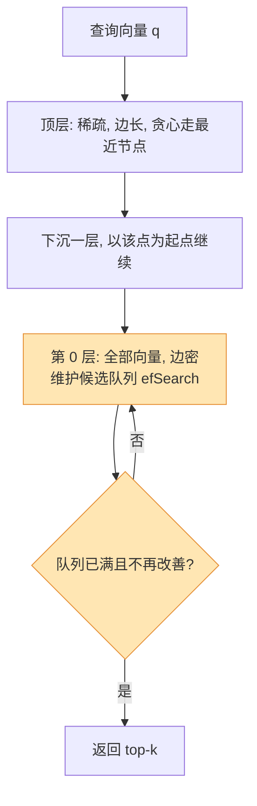
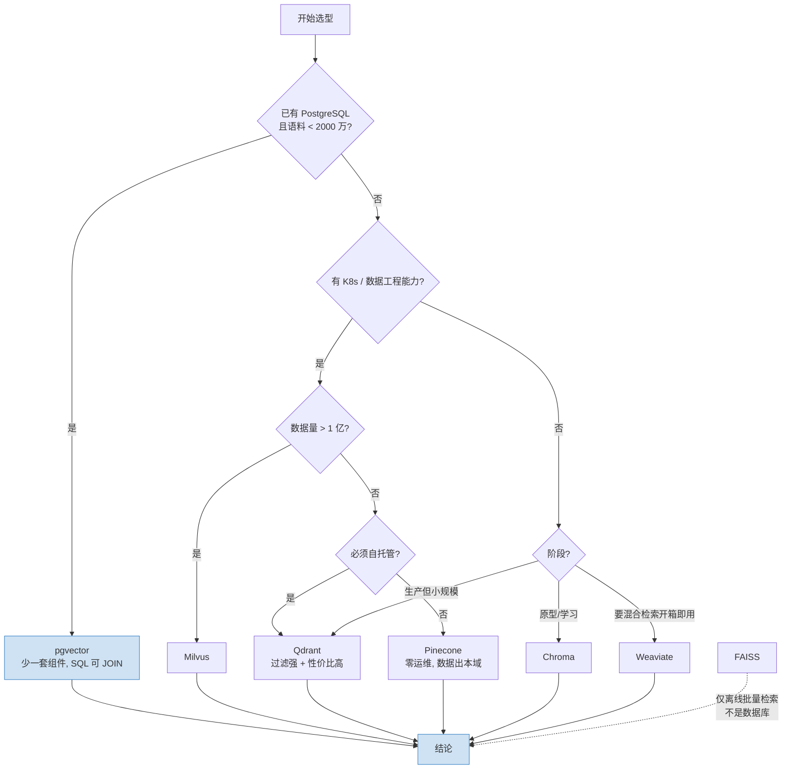

# [[向量数据库]]

> [!tip] 学习目标
> 能独立完成：从零跑通一个 Python 向量库（建集合 → 建索引 → 写入 → 检索 → 标量过滤 → 混合检索），能背出 HNSW 三个参数与 IVF 两个参数的作用方向，能按「团队有无运维能力 + 数据量级 + 过滤强度 + 是否允许数据出本域」四条轴给出**明确的**选型结论并说明理由，能算出自己业务的数据内存占用。

---

## 🎯 难度分段学习路径

| 难度 | 核心关注 | 预估时长 |
|---|---|---|
| **入门** | 为什么需要向量检索、近似最近邻的取舍、集合与元数据、距离度量、Chroma 最小可运行示例 | 10h |
| **进阶** | HNSW / IVF 索引原理与调参、七款向量库选型对比、标量过滤、混合检索（向量 + BM25）、pgvector 实操 | 18h |
| **高级** | 更新删除一致性、多租户隔离、内存估算与量化、冷热分层、索引重建与备份恢复、过滤导致召回骤降的排查 | 14h |

**总学时**：42h ｜ **前置知识**：`[[LLM-基础]]`（理解 Embedding 概念）、`[[Embedding-与向量检索]]`（Embedding 模型与相似度）、线性代数（点积、余弦）

> [!note] 阅读顺序建议
> 本篇把「原理」和「选型」分开：1.1-1.4 建立概念，2.1-2.3 是**本篇重点**（索引调参与选型表），3.x 面向要把它放进生产的场景。求职面试里最常被追问的正是 **2.3 的选型表**和**索引参数为什么这样调**，务必吃透。

---

## 📖 第一章 入门（Beginner）

### 1.1 为什么需要专门的向量检索

**知识点详解**

**结论先行**：传统数据库（B 树、倒排）擅长**精确匹配与范围查询**，而向量检索要回答「和这个语义最像的 10 条是哪些」—— 这是**近似最近邻**问题，索引结构完全不同。

$N$=100 万、$d$=768 时，暴力检索单次要算 7.68 亿次乘加；而 B 树虽然 $O(\log N)$ 却==只能查「等于」和「范围」，无法表达「方向相近」==。向量索引（HNSW / IVF）靠预先组织好的结构把「全扫」变成「只走一小撮」，把复杂度降到近似 $O(\log N)$。

> [!tip] 关键理解
> 向量数据库的核心贡献**不是**「能存向量」（任何数据库都能存浮点数组），而是：**(1) 用 ANN 索引把暴力检索降几个数量级；(2) 把标量过滤、混合检索、多租户、持久化、备份这些工程问题一起解决**。所以「numpy 存 npy + 暴力算」在 10 万条以内够用，超过就该上专门的库。

**填空题**

1. 向量检索要回答的核心问题是 ______（精确匹配 / 近似最近邻）。
2. 暴力检索的时间复杂度是 ______，在 $N$=100 万、$d$=768 时单次查询约需 ______ 亿次乘加。
3. 传统 B 树索引无法回答「方向相近」，它擅长的是 ______ 和 ______。
4. 向量数据库相对于「npy 文件 + 暴力算」的真正增量是 ______ 和 ______。

**答案**：
1. 近似最近邻（ANN）
2. $O(N \cdot d)$，7.68
3. 精确匹配（等值查询），范围查询
4. ANN 索引加速，标量过滤/混合检索/持久化等工程能力

---

### 1.2 核心概念：集合、向量、元数据

**知识点详解**

几乎所有向量库的抽象都是同一套三件套，名字不同（集合 / collection / namespace / class）但职责一致。

| 概念 | 职责 | 关键约束 |
|---|---|---|
| **集合（Collection / Namespace）** | 向量 + 原文 + 元数据的容器 | ==维度建集合时定死，中途不能改，要改只能重建== |
| **向量（Vector / Embedding）** | 定长浮点数组，检索的唯一排序依据 | 精度（float32 / float16 / int8）直接决定内存 |
| **元数据（Metadata / Payload）** | 结构化字段：租户 ID、文档 ID、时间、标签、权限 | ==过滤字段必须建标量索引，否则退化成全表扫== |
| **主键 ID** | 每条记录的标识，用于更新/删除/引用原文 | upsert 语义各库不同，见 3.1 |

维度由 Embedding 模型决定（常见 384 / 768 / 1024 / 1536 / 3072），精度由你选，见 3.3 的内存估算。

**填空题**

1. 一个集合内的向量维度必须 ______，中途要改只能 ______。
2. 向量库的三件套是：集合、向量、______。
3. 标量过滤字段不建索引的后果是检索会退化成 ______。
4. 记录的唯一标识字段叫 ______，它的存在是为了支持 ______ 与 ______。

**答案**：
1. 统一，重建集合
2. 元数据（Metadata / Payload）
3. 全表扫描（暴力过滤）
4. 主键 ID（ID），更新，删除

---

### 1.3 距离度量：余弦 / 点积 / 欧氏

**知识点详解**

**结论先行**：==文本 Embedding 场景直接用余弦；模型输出已归一化时点积与余弦等价；欧氏距离适合「绝对位置有意义」的场景（如图像坐标）==。

| 度量 | 取值方向 | 适用场景 | 踩坑点 |
|---|---|---|---|
| **余弦距离（Cosine）** | 越小越像 | 文本 Embedding **默认选择** | 需要向量非零；==只看夹角，忽略向量长度== |
| **内积 / 点积（IP）** | 越小越像 | ==归一化后等价于余弦==；未归一化时同时反映夹角与幅值，推荐场景常用 | 未归一化时**长向量天然得分高**，易被「霸榜」样本污染 |
| **欧氏 / L2 距离** | 越小越像 | 绝对几何距离有意义的场景 | 对幅值敏感；KNN 库常用「平方 L2」（不取平方根）省算力 |

> [!warning] 归一化与度量的组合错误（高频面试题）
> ① **点积 + 未归一化向量** —— 长文本向量模长天然更大，会稳定压过短文本，除非明确要「长度也计分」，否则先归一化；② **余弦 + 已归一化向量** —— 不会错，只是多一次除法；③ **建索引用 A 度量、查询用 B 度量** —— pgvector 要求「**一种距离函数建一个索引**」，选错会静默给出错误排序。

> [!tip] 记忆锚点
> 各库默认值并不一致：Zilliz Cloud（Milvus 系）默认 `COSINE`，Chroma 单机默认 `l2`，pgvector 要你建索引时显式选。==**以你自己模型的模长分布为准，不要以库的默认值为准**==。

**填空题**

1. 文本 Embedding 检索的默认距离度量是 ______。
2. 余弦距离只看两个向量的 ______，忽略向量的 ______。
3. 点积度量在向量已归一化后与 ______ 等价。
4. pgvector 要求「一种距离函数建一个索引」，用 A 度量建索引、查询时用 B 度量排序会导致 ______。

**答案**：
1. 余弦距离（Cosine）
2. 夹角（方向），模长（幅值）
3. 余弦相似度
4. 排序结果错误（静默出错，不报错）

---

### 1.4 最小可运行示例（Chroma + Python SDK）

**知识点详解**

`pip install chromadb`，以下是 Chroma 官方入门写法：

```python
import chromadb

chroma_client = chromadb.Client()                    # 内存客户端，进程退出数据即丢
collection = chroma_client.get_or_create_collection(name="my_collection")
collection.upsert(                                    # 必须提供唯一字符串 ID
    ids=["id1", "id2"],
    documents=["This is a document about pineapple",  # 由默认嵌入函数自动向量化
               "This is a document about oranges"])
results = collection.query(                           # 内部完成「文本 → 向量 → ANN 检索」
    query_texts=["This is a query document about hawaii"], n_results=2)
print(results["documents"], results["distances"])
```

持久化换成 `chromadb.PersistentClient(path="./chroma_db")`；多人共享用客户端-服务端模式（`chroma run` 起服务）。==同名集合重复创建会抛异常、可重复运行的脚本必须用 `get_or_create_collection` + `upsert`==。

**填空题**

1. Chroma 的内存客户端构造函数是 ______，持久化客户端用 ______。
2. `add` 与 `upsert` 的关键差别是：重复写入同一个 ID 时 `add` 会 ______，而 `upsert` 会 ______。
3. 在 `collection.query` 中不传 `n_results` 时默认返回 ______ 条。
4. 集合名重复创建会 ______，所以脚本里应改用 ______。

**答案**：
1. `chromadb.Client()`，`chromadb.PersistentClient(path=...)`
2. 报错（ID 冲突），覆盖更新
3. 10
4. 抛异常，`get_or_create_collection`

### 1.5 第一章综合练习

**填空题**

1. 向量检索要解决的问题是 ______，暴力检索的复杂度是 ______。
2. 一个集合内所有向量的维度必须 ______，标量过滤字段不建索引会导致 ______。
3. 文本场景默认用 ______ 距离；归一化后点积与它 ______。
4. Chroma 内存客户端是 ______，重复写同一 ID 要用 ______ 而不是 `add`。

**本章答案**：
1. 近似最近邻（ANN），$O(N \cdot d)$
2. 统一，退化为全表扫描
3. 余弦，等价
4. `chromadb.Client()`，`upsert`

**综合项目**：用 Chroma 内存客户端搭一个 50 条的中文「菜谱」知识库。输入：50 条 `(菜名, 食材列表, 难度)`；步骤：① 建集合并写入，② 用 3 个不同措辞的自然语言查询（例如「想用鸡蛋做简单的」），③ 每次返回 top-3。**产出物**：一个可重复运行的 `.py` 脚本 + 一段 3 次查询的实际输出。**验收标准**：能观察到「措辞不同但语义相近」的查询命中同一批文档，而不是只匹配原词。

> [!tip] 常见陷阱
> 1. **以为 Chroma 自动用你的模型**：默认嵌入函数是句向量模型，中文效果与维度未必合用，生产必须显式指定。
> 2. **不指定 `n_results` 就以为只会返回几条**：默认返回 10 条，库里不足时返回全部，容易误判过滤是否生效。
> 3. **把 `ids` 写成整数**：Chroma 要求字符串 ID，混用会在写第二个 ID 时报错。
> 4. **用 `add` 写可重复运行的脚本**：第二次运行就崩，必须用 `upsert` 或先 `delete`。

> [!note] 本章权威资料
> - [Chroma 官方文档 · 入门](https://docs.trychroma.com/docs/overview/getting-started) — 本节全部代码来自此页
> - [Chroma 官方文档 · 概览](https://docs.trychroma.com/docs/overview/introduction)
> - [Chroma 官方文档 · 管理集合](https://docs.trychroma.com/docs/collections/manage-collections) — 集合命名规则、增删改
> - [Zilliz Cloud 文档 · 距离度量](https://docs.zilliz.com/docs/search-metrics-explained.md) — 各类度量的取值范围与公式

---

## 📖 第二章 进阶（Intermediate）

> [!warning] 与上一章的衔接
> 第一章告诉你「向量检索要做什么」，但暴力算一遍在 10 万条以内就够用。==本章讲的是「怎么让它在百万级以上还够快」，核心是索引结构与参数==。跳过 2.1 直接看 2.3 的选型表，你会知道「HNSW 内存占用高」却不知道为什么，也就没法解释选型理由。

### 2.1 HNSW：多层小世界图

**知识点详解**

**结论先行**：==HNSW 是目前内存内近似最近邻的事实标准。查询 $O(\log N)$ 级别，召回率高（通常 95%-99%），代价是**内存占用高、建索引慢**==。

**原理三点**：① **高速公路网络** —— 底层（第 0 层）含全部向量、连接密集、距离短，上层节点稀疏、跳跃距离长；查询从顶层入口点出发，每层贪心朝查询点走一跳，到达该层最近点后下沉，最终在底层收敛。② **层次随机分配** —— 每条向量最高能出现在哪一层由 $M$ 决定（衰减因子经验值 $m_L = 1/\ln M$），$M$=16 时通常 3-5 层；==所以不需要训练阶段，插进来的向量直接建索引 —— 这就是 HNSW 能增量写入而 IVF 不能的原因==。③ **连边要「多样」** —— 只连最近 $M$ 个点会让彼此靠近的向量形成团簇、遍历进去出不来，所以连边时剔除「你比我更靠近我的邻居」这类冗余连接；代价是==单点最近邻可能搜不全，近似误差正来源于此==。



| 参数 | 含义 | 调大的效果 | 能否查询时改 |
|---|---|---|---|
| **M**（别名 `m` / `max_neighbors`） | 每层每个节点的最大连接数 | 召回↑、图更密、**内存↑**、建索引慢 | ❌ 需重建 |
| **efConstruction**（别名 `ef_construct`） | 建索引时找邻居的候选队列大小 | **图质量↑**、建索引慢 | ❌ 需重建 |
| **efSearch**（别名 `ef`） | 查询时的候选队列大小 | **召回↑、延迟↑**（主调参旋钮） | ✅ **随时可改** |

> [!warning] 调参的因果方向要记牢
> ==`M` 与 `efConstruction` 是建库期质量参数，改动要重建索引、属离线操作==；==`efSearch` 是查询期参数，可按请求动态下发，是线上唯一能实时调的旋钮==。
> **常见误解一**：「把 `efSearch` 拉满就能弥补 `efConstruction` 低」。不能 —— 图的连通性构建时就定死了，`efSearch` 再大也搜不到不存在的边；召回卡在天花板（比如 85%）时，**唯一出路是提高 `M` / `efConstruction` 后重建**。
> **常见误解二**：`efSearch` 必须 $\ge k$（你要的返回条数），否则结果条数本身就被候选队列卡住。

**各库默认值对照**：Chroma 单机 `max_neighbors`/`ef_construction`/`ef_search` = 16/100/100；Qdrant `m`/`ef_construct`/`ef` = 16/100/查询时默认等于 `ef_construct`；pgvector `m`/`ef_construction`/`hnsw.ef_search` = 16/64/40；Milvus 系 HNSW `M`/`efConstruction`/`ef` = 16/200/查询时动态。

> [!note] Chroma 的一个关键差异
> Chroma 单机集合用 HNSW，但**分布式版与 Chroma Cloud 用 SPANN 索引**（先分簇、簇内再建小索引），且**明确不允许自定义 SPANN 配置**（设了也被服务端忽略）。==本地 Chroma 的 HNSW 调参结论不能搬到 Chroma Cloud==。

**填空题**

1. HNSW 层次划分的经验衰减因子是 ______，$M$=16 时通常有 ______ 层。
2. HNSW 支持增量写入而不需要训练阶段，而 IVF 需要 ______ 阶段，这是二者能否在线更新的关键差别。
3. `M` 与 `efConstruction` 属于建库期参数，改动需要 ______；`efSearch` 可以 ______。
4. 若召回率卡在 85%，继续增大 `efSearch` 有效吗？为什么？

**答案**：
1. $m_L = 1/\ln M$，3-5
2. 训练（k-means 聚类）
3. 重建索引，随时按请求调整
4. 无效。图的连通性由 `M` / `efConstruction` 在构建时定死，`efSearch` 只能访问已有的边，必须提高构建参数后重建

---

### 2.2 IVF：倒排文件 + 粗聚类精排

**知识点详解**

**结论先行**：==IVF 的思路是「先把空间划成 nlist 个簇，查询时只扫 nprobe 个簇」。建索引快、内存省，但**增量插入要重新分配簇归属，且高选择性过滤下表现往往比 HNSW 稳**==。

**三步**：① **训练**，对样本集跑 k-means 得到 `nlist` 个簇心；② **建索引**，每条向量归到最近的簇、每簇存一份倒排列表；③ **查询**，算到全部簇心的距离后取最近 `nprobe` 个簇，**只在这 nprobe 个簇内做精确距离计算**。

**流程**：查询向量 → 算到全部 `nlist` 个簇心的距离 → 取最近 `nprobe` 个簇 → 合并这几个簇做精确距离计算 → 返回 top-k。==与 HNSW 的区别在于「粗排」是聚类划分而非图遍历，所以可以在簇心层面就带上过滤条件==。

| 参数 | 含义 | 调大的效果 | 调小的效果 | 能否查询时改 |
|---|---|---|---|---|
| **nlist** | 建索引时聚成多少个簇 | 每簇更小、**需扫的向量更少（更快）**；但簇心表占内存、**真邻居可能落在没选中的簇里，召回↓** | 簇更大、每簇要扫更多向量、慢 | ❌ 需重建 |
| **nprobe** | 查询时扫几个簇 | 召回↑、延迟↑（近似线性） | 快、但漏簇 | ✅ 随时可改 |

**取值经验**：`nlist ≈ √N`（N 为单分片向量数），100 万条先试 1024。pgvector 的官方口径更具体：`rows ≤ 100 万时 lists = rows/1000`，否则 `√rows`；查询 `probes` 起点取 `√lists`。

> [!tip] HNSW vs IVF 怎么选（看约束，不二选一）
> **选 HNSW**：内存充裕、需要频繁增量插入、不做量化、要求最高召回。**选 IVF**：内存紧张或十亿级、过滤比例高（>90%，可在簇心层先粗过滤）、索引需频繁重建。==过滤比例高这条最常被忽略：HNSW 的图被过滤割裂后会退化为近全图遍历，可能比暴力还慢==。

**填空题**

1. IVF 索引在建库阶段需要做的训练是 ______。
2. 查询时 IVF 只扫 ______ 个簇内的向量，这个参数叫 ______。
3. nlist 的常见经验取值与向量条数的关系是 ______；pgvector 给的起点是 ______。
4. 高选择性过滤（过滤掉 90%+）时，HNSW 的图会出现什么问题？

**答案**：
1. k-means 聚类，产出 nlist 个簇心
2. nprobe
3. `nlist ≈ √N`；`rows ≤ 100 万时 lists = rows/1000`，否则 `√rows`
4. 图被过滤条件割裂成大量孤立节点，遍历退化为近全图遍历，可能比暴力还慢

---

### 2.3 选型对比：七款向量库（本篇重点）

**知识点详解**

> [!tip] 先给结论
> **按你的实际处境（学生 / 求职作品集 / 中小团队）直接抄**：
> 1. **学习和做 RAG 原型** → Chroma（嵌入式、零部署），但要清楚它不是生产方案；**FAISS 不是数据库** —— 它是嵌进你自己进程的库，无服务/权限/备份，只适合离线批量检索或本地实验。
> 2. **已有 PostgreSQL 且语料 < 2000 万** → **pgvector 最优**：多一套组件就多一套运维/备份/权限/高可用，而 SQL 让「向量结果 JOIN 业务表」变成一行。
> 3. **生产 RAG 且团队没有专职运维** → ==有运维能力选 Qdrant（过滤性能与性价比更好），没有就 Pinecone（省心但数据出本域）==。
> 4. **十亿级 + 有数据工程团队** → Milvus。**必须混合检索且要开箱即用** → Weaviate。

**选型大表**

| 维度 | Chroma | Milvus | Qdrant | Pinecone | Weaviate | pgvector | FAISS |
|---|---|---|---|---|---|---|---|
| **部署形态** | 嵌入式（进程内）/ 客户端-服务端 / 托管云 | 分布式集群（Kubernetes 为主，依赖 etcd、对象存储、消息队列） | 自托管单二进制 / 集群 / 托管云 | **仅全托管云**（不支持自托管） | 自托管 / 托管云 | PostgreSQL 插件，随 PG 部署 | **库**（pip 装进你的进程），无服务端 |
| **标量过滤** | 支持（`where` 字典语法）；小规模够用，大规模性能一般 | 支持且强（`expr` 表达式 + 标量索引） | ==最强==（`must`/`should`/`must_not` 可递归嵌套 + payload 索引 + 过滤感知 HNSW 额外连边） | 支持（元数据过滤）；过滤命中很小时性能会退化 | 支持（`Filter.by_property` 链式，GraphQL 的 `where`） | 支持（`WHERE` 子句，可用 B 树/部分索引/分区） | ❌ 无（自己写） |
| **混合检索（向量+BM25）** | 支持全文检索（`$search` 风格全文），但表达能力弱 | 支持（稀疏向量 + BM25 度量，或 RRF 融合） | ==支持且干净==（`prefetch` 多路 + `RrfQuery` 原生融合，支持参数化 k） | ==支持最完整==（三种模式：先过滤再排序 / 客户端 RRF / 单索引 dense+sparse 加权） | ==开箱即用==（内置 BM25F，`alpha` 调权重） | 支持（与 Postgres 全文检索配合，再用 RRF 或交叉编码器融合，官方给了示例） | ❌（FAISS 自身无 BM25，需自己接） |
| **更新与删除** | 支持 `upsert` / `delete` | 支持（delete 后需等合并才真正释放） | ==支持且即时可见性最好==（写日志 + 段优化器） | 支持（最终一致，需容忍短暂不可见） | 支持 | ==最强：ACID 事务，可与业务表同事务提交/回滚== | 支持（`remove_ids`），需自己管重建 |
| **水平扩展** | 单机为主；分布式版有，但生态最弱 | ==为十亿级设计的原生分布式==（分片 + 分段） | 分片 + 多副本 + 一致性因子 | 自动扩缩容，托管方负责 | 支持，Kubernetes 原生 | 靠 PG 分区 / Citus / PgBouncer 等外部方案 | ❌ 单机 |
| **最大维度** | 未公开硬限制（受内存约束） | `FLOAT_VECTOR` 2-32768 | 大维度可支持 | 较高 | 较高 | **`vector` 最多 2000 维**，`halfvec` 4000 维，`bit` 64000 维 | 无硬限制（内存约束） |
| **主要缺点** | ==不是为生产/大规模设计的==；亿级场景性能与功能都不够；分布式配置复杂 | ==架构复杂、依赖多、学习曲线陡==；组件多 = 故障面大 | 生态与文档比 Weaviate/Pinecone 薄；Rust 栈对不熟的人不友好 | ==数据必须出本域==；按量付费，长期成本高；无法自托管 | 自托管资源消耗偏高（同等负载常比 Qdrant 更吃内存）；云定价透明度一般 | 维度上限 2000；大规模（>2000 万）带过滤时延迟明显落后于专用库；与 OLTP 抢共享缓冲区 | ==根本不是数据库==：无服务、无鉴权、无备份、无并发控制、无持久化事务 |
| **适用场景** | 本地学习、原型验证、小规模内部工具 | 十亿级工业检索、有数据工程与 K8s 能力的团队 | 生产级 RAG、过滤条件复杂、成本敏感、团队有基本运维能力 | 企业生产、零运维是硬要求、p99 延迟与 SLA 比成本更重要 | 多模态、内置向量化、混合检索开箱即用 | 已有 PG、语料 <2000 万、需要向量与关系数据 JOIN、团队是 PG 原生 | 离线批量检索、本地实验、作为自研检索引擎的底座 |



> [!warning] 三个选型陷阱
> 1. **拿跑分表当决策依据**：公开基准多数是「无过滤、均匀分布、单机」的干净场景，真实 RAG 却是「每次查询都带租户/时间/权限过滤」。==过滤选择性才是决定性因素，不是无过滤的平均延迟==；跑分还要看 p99 和召回，不要只看 p50。
> 2. **低估「多一套组件」的代价**：多一个组件就多一套升级、监控、备份、权限、故障演练。**对 5 人团队，pgvector 的价值往往超过它的性能短板。**同理，把「数据出本域」当小事也很危险 —— Pinecone 纯托管且无法自托管，涉敏数据、需 VPC 对等连接或合同禁止出境时这条直接一票否决。

**填空题**

1. 「数据必须出本域、且无法自托管」直接排除掉的是 ______。
2. pgvector 的 `vector` 类型维度上限是 ______，`halfvec` 是 ______。
3. 多租户隔离最强的两个选项是 ______（ACID 事务）和 ______（过滤感知 HNSW + 成熟多租户 API）。
4. 为什么「公开跑分领先」不足以直接决定选型？因为多数基准测的是 ______ 场景，而真实 RAG 的决定性因素是 ______。

**答案**：
1. Pinecone
2. 2000 维，4000 维
3. pgvector，Qdrant
4. 无过滤的干净 ANN；**过滤选择性**（以及 p99 延迟与召回率）

### 2.4 标量过滤语法对照

**知识点详解**

语义相同、形状不同：**Chroma** 用 `where` 字典（比较运算符 `$` 前缀，`$and`/`$or` 组合，`$in`/`$nin` 判集合，数组用 `$contains`）；**Qdrant** 用三个可递归嵌套的子句（`must`=AND、`should`=OR、`must_not`=全部不满足）；**Weaviate** 用链式 `Filter`（`&`=AND、`|`=OR）；**pgvector** 直接用 SQL `WHERE`。

```python
# Qdrant：最常用的复杂过滤形态
models.Filter(must=[
    models.FieldCondition(key="tenant_id", match=models.MatchValue(value="acme")),
    models.FieldCondition(key="year", range=models.Range(gte=2024))])
```

```sql
-- pgvector：过滤字段建 B 树索引；筛到低比例时规划器可能改走精确扫描
CREATE INDEX ON items (category_id);
SELECT * FROM items WHERE category_id = 123 ORDER BY embedding <-> '[3,1,2]' LIMIT 5;
-- 只涉及少数取值时可用部分索引
CREATE INDEX ON items USING hnsw (embedding vector_l2_ops) WHERE (category_id = 123);
```

**填空题**

1. Chroma 的过滤参数名是 ______，比较运算符带 `$` 前缀，如 ______（大于）。
2. Qdrant 中等价于 AND、OR、「全部不满足」的三个子句分别是 ______、______、______。
3. pgvector 里向量距离运算符按语义分别是：`<->`（L2）、`<=>`（余弦）、______（内积）。
4. pgvector 中过滤字段建 B 树索引后，为什么低选择性的过滤可能完全不用向量索引？

**答案**：
1. `where`，`$gt`
2. `must`，`should`，`must_not`
3. `<#>`
4. 因为过滤后命中的行数很少，直接在这些行上算精确距离比走近似索引更快 —— 规划器会正确地选更优计划

### 2.5 混合检索：向量 + BM25

**知识点详解**

**结论先行**：==纯向量检索的软肋是「精确匹配」—— 用户搜产品编号、错误码、专有名词时，稠密向量往往不如关键词==。向量擅长「语义相近」、BM25 擅长「字面精确」，但==两路分数不可直接相加==（余弦距离在 $[-1,1]$，BM25 分数无上界），必须先归一化或改用**排名融合**。

**RRF（Reciprocal Rank Fusion，倒数排名融合）**只看名次不看分数，天然免疫量纲问题：

$$RRF(d) = \sum_{i} \frac{1}{k + rank_i(d)}$$

$k$ 是平滑常数（Qdrant 支持参数化，示例值 60）。==两路都靠前的文档会被显著抬高，这就是混合检索起效的机制==。

```python
# Qdrant 原生 RRF：prefetch 多路查询，RRF 融合
client.query_points(
    collection_name="docs",
    prefetch=[
        models.Prefetch(query=models.SparseVector(indices=[1, 42], values=[0.22, 0.8]),
                        using="sparse", limit=20),          # 关键词路
        models.Prefetch(query=[0.01, 0.45, 0.67],
                        using="dense", limit=20),           # 稠密语义路
    ],
    query=models.RrfQuery(rrf=models.Rrf()), limit=10)      # 融合
```

其余各家：**Weaviate** 一行 `query.hybrid(query=..., alpha=0.5)`（`alpha` 0 为纯 BM25、1 为纯向量）；**pgvector** 与 Postgres 全文检索配合后用 RRF 或交叉编码器融合；**Milvus 系**用 `SPARSE_FLOAT_VECTOR` 字段 + `BM25` 度量做稀疏路。

**调参**：先用 `alpha = 0.5` 起步，用自己的评测集扫 0 / 0.3 / 0.5 / 0.7 / 1.0。==别照抄默认值==：事实型查询（找编号、找人名）偏 0，人意图型查询偏 1。

**填空题**

1. 混合检索要融合的两路信号是 ______ 与 ______。
2. 两路分数不能直接相加的原因是 ______。
3. RRF 融合只看 ______，因此天然免疫量纲问题。
4. Weaviate 混合检索里 `alpha = 0` 相当于纯 ______，`alpha = 1` 相当于纯 ______。

**答案**：
1. 稠密向量（语义），BM25 关键词
2. 余弦距离在 $[-1,1]$ 而 BM25 分数无上界，量纲不可比
3. 名次（排名）
4. BM25，向量

### 2.6 第二章综合练习

**填空题**

1. HNSW 的 `M`、`efConstruction`、`efSearch` 中，**可以按请求动态调整**的是 ______；另外两个改动需要 ______。
2. IVF 的 `nlist` 与 `nprobe` 中，可在查询时调整的是 ______；经验起点 `nlist ≈ √N`。
3. pgvector 的 `vector` / `halfvec` / `bit` 三种类型的维度上限分别是 ______。
4. Pinecone 无法自托管，因此要求 ______ 的场景应直接排除它。

**本章答案**：
1. `efSearch`，重建索引
2. `nprobe`
3. 2000 / 4000 / 64000
4. 数据不能出本域（涉敏、VPC 内对等连接、合同禁止数据出境）

**综合项目**：拿 2.3 的选型大表，给你的目标场景写一份**一页选型决策文档**。必须包含：① 四条判断轴的取值；② 首选方案与**一个明确的首选理由**（不是罗列优点）；③ 落选方案中最有竞争力的那一个，以及**什么条件变化会让你改选它**（给出可观测触发指标，如「语料超过 2000 万」）；④ 一条必须提前验证的风险项。**验收标准**：第二个人拿着它能复现你的决策，无需再问你。

> [!tip] 常见陷阱
> 1. **以为 pgvector 只能存 2000 维所以「不能用」**：文本 Embedding 主流是 768 / 1024 / 1536 / 3072，==3072 维要改用 `halfvec`（上限 4000）而不是放弃 pgvector==。
> 2. **在 pgvector 上忘了 `ivfflat.probes` 默认为 1**：这是官方默认值，等于只扫 1 个簇，召回会低得离谱。起步就该设成 `√lists`。
> 3. **照抄默认值**：Qdrant 查询时 `ef` 默认等于 `ef_construct`（100），你的召回目标可能需要 200-500；Weaviate 的 `alpha = 0.5` 也高度依赖查询类型。两者都必须实测。
> 4. **以为 Chroma Cloud 上调 HNSW 参数有效**：分布式/Cloud 版用 SPANN，==自定义配置会被服务端忽略==。

> [!note] 本章权威资料
> - [HNSW 原始论文（Malkov & Yashunin）](https://arxiv.org/abs/1603.09320) — 多层图、层次衰减、连边策略
> - [Elasticsearch Labs · HNSW 图原理](https://www.elastic.co/search-labs/blog/hnsw-graph) — M / ef_construction 的作用方向与构建流程
> - [OpenSearch · HNSW 超参选择实践指南](https://opensearch.org/blog/a-practical-guide-to-selecting-hnsw-hyperparameters/) — 推荐的配置梯度与调参方法
> - [Pinecone Learn · HNSW 详解](https://www.pinecone.io/learn/series/faiss/hnsw/) — $m_L = 1/\ln M$ 与 Faiss 实现
> - [pgvector 官方 README](https://github.com/pgvector/pgvector) — HNSW/IVFFlat 参数默认值、维度上限、过滤与多租户、分区
> - [Qdrant 文档 · 索引](https://qdrant.tech/documentation/concepts/indexing/) · [过滤](https://qdrant.tech/documentation/concepts/filtering/) · [混合查询](https://qdrant.tech/documentation/concepts/hybrid-queries/) · [集合](https://qdrant.tech/documentation/concepts/collections/)
> - [Chroma 文档 · 配置集合](https://docs.trychroma.com/docs/collections/configure) · [元数据过滤](https://docs.trychroma.com/docs/querying-collections/metadata-filtering) — HNSW 参数与 SPANN 差异
> - [Weaviate 文档 · 混合检索](https://docs.weaviate.io/weaviate/search/hybrid) · [过滤](https://docs.weaviate.io/weaviate/search/filters)
> - [Pinecone 文档 · 索引概览](https://docs.pinecone.io/guides/index-data/indexing-overview) · [混合检索](https://docs.pinecone.io/guides/search/hybrid-search) · [元数据过滤](https://docs.pinecone.io/guides/search/filter-by-metadata)
> - [Zilliz Cloud 文档 · 索引](https://docs.zilliz.com/docs/indexes.md) · [自动索引](https://docs.zilliz.com/docs/autoindex-explained.md) · [混合检索](https://docs.zilliz.com/docs/hybrid-search.md) · [全文检索](https://docs.zilliz.com/docs/full-text-search.md) · [多租户](https://docs.zilliz.com/docs/multi-tenancy.md) · [分区键](https://docs.zilliz.com/docs/use-partition-key.md)
> - [ANN-Benchmarks](https://ann-benchmarks.com/) — 标准化 ANN 评测榜单，读法与局限见 2.3 陷阱 1

---

## 📖 第三章 高级（Advanced）

> [!note] 深度标准
> 本章每节都给出可执行的验证手段：3.1 有实测 SQL，3.3 有一条可复算的公式，3.6 有可直接照抄的排查顺序。==高级章节的判据是「能定位问题」，不是「知道名词」==。

### 3.1 更新、删除与一致性

**知识点详解**

| 一致性级别 | 含义 | 代价 | 适合 |
|---|---|---|---|
| 强一致 | 写后立即可读 | 延迟更高、吞吐更低 | 权限/账务类过滤条件 |
| 最终一致（多数托管库默认） | 写后短时间内可读 | 性能好 | 大多数 RAG 场景 |
| 弱一致 | 可能读到旧值或丢更新 | 最快 | 离线分析 |

**各库取向**：pgvector ==索引就在 Postgres 里，向量行与业务行可同事务提交/回滚，这是它最被低估的优势==；Qdrant 写日志 + 段优化器，可见性快但删除后需等段合并才真正释放磁盘；Pinecone 托管方控制、通常最终一致，读己之写需等待；Milvus 系提供多档一致性级别，==更强的一致性换更高延迟==；Chroma 客户端-服务端模式写后即可读，嵌入式则读写同进程。

**删除的两个隐性成本**：① ==HNSW 图里删点不会真删边==，普遍用「墓碑标记 + 后台清理」，墓碑期间的图仍被遍历，删掉 20% 数据后性能可能比全量更差；② ==「删一条插一条」是最糟的更新方式==，正确做法是保留同一 ID 原地更新。

**验证手段**（pgvector）：在事务内 `SET LOCAL enable_indexscan = off;` 强制精确检索，与默认的近似检索结果对比，即得召回差异。

**填空题**

1. pgvector 在一致性上的独特优势是 ______。
2. `delete` 后向量在磁盘上真正消失之前，图里会留下 ______，这期间检索性能可能反而变差。
3. 「更新一条记录」的正确做法是保留同一个 ______ 原地更新，而不是删除后重插。
4. Qdrant 删除数据后磁盘空间要等 ______ 完成才真正释放。

**答案**：
1. 向量行与业务行可同事务提交/回滚（ACID）
2. 墓碑标记（tombstone）
3. 主键 ID
4. 段优化 / 段合并

---

### 3.2 多租户隔离

**知识点详解**

> [!warning] 最危险的一句设计
> 「所有租户共用一个集合，查询时用 `tenant_id = X` 过滤」——**在应用层是隔离，在检索层不是**。HNSW 的图全租户共建，租户 A 会影响租户 B 的召回与延迟；漏写一个过滤条件就是**跨租户数据泄露**。

**四种隔离方案**：

| 方案 | 做法 | 优点 | 代价 |
|---|---|---|---|
| **物理隔离** | Chroma 每租户一集合；pgvector 每租户一张表或**列表分区** | 隔离最彻底，可单独备份删除、独立调参 | 租户多时元数据操作爆炸；小租户索引效率低 |
| **字段过滤 + 强约束** | 共享集合，强制 `tenant_id` 过滤 | 资源利用率最高、扩展最平滑 | ==必须在服务端强制注入过滤条件，不能信任调用方传入== |
| **分区键** | Zilliz Cloud / Milvus 系按 `tenant_id` 自动路由到分区；Pinecone 的 namespace 概念同理 | 库层面做隔离 + 负载均衡 | 隔离粒度是分区/命名空间而非独立索引，强度取决于实现细节 |

**pgvector 的官方建议**：共享近似索引意味着**一个租户的向量会影响其他租户的召回率与速度**，要做租户隔离就用列表分区或独立表 —— `CREATE TABLE items (customer_id int, embedding vector(3)) PARTITION BY LIST(customer_id);`

> [!tip] 工程做法
> 1. **过滤条件由服务端注入**：客户端只传「租户 ID」，`tenant_id = ?` 由中间件拼，不给客户端拼过滤器的机会。
> 2. **过滤字段一定要建索引，且在导入数据之前建**：Qdrant 官方明确 payload 索引要在建集合后、==**导入数据之前**创建==，因为过滤感知 HNSW 的额外连边只能在 payload 索引存在后生成。字段选择上，租户 ID 基数高（适合分片/分区），文档类型、状态这类低基数字段适合做部分索引或位图索引。

**填空题**

1. 「所有租户共用集合 + `tenant_id` 过滤」在应用层隔离，但**在检索层不隔离**，因为 ______。
2. 最危险的失败模式是 ______。
3. Qdrant 要求 payload 索引在什么时候创建？为什么？

**答案**：
1. HNSW 图是全租户共建的，一个租户的向量会影响其他租户的召回与延迟
2. 漏写过滤条件导致跨租户数据泄露
3. 导入数据之前；因为过滤感知 HNSW 的额外连边只能在 payload 索引存在后生成

---

### 3.3 内存估算：先算账再选型

**知识点详解**

**结论先行**：==向量数据量 = 维度 × 条数 × 精度字节数。选型前先算这个数，它直接决定你能不能用 HNSW、要不要量化、要不要冷热分层==。

$$\text{向量原始体积} = d \times N \times b$$

$d$ 是维度（常见 384/768/1024/1536/3072），$N$ 是条数，$b$ 是每维字节数（float32 = **4**、float16 = **2**、int8 = **1**）。实算（$d$=768）：

| 场景 | $N$ | 精度 | 向量原始体积 | 实际量级 |
|---|---|---|---|---|
| 个人 RAG 原型 | 10 万 | float32 | 0.29 GiB | ≈ 0.35 GiB |
| 中小团队生产 | 1000 万 | float32 | 29.1 GiB | ≈ 33 GiB |
| 同上、省内存 | 1000 万 | float16 | 14.6 GiB | ≈ 17 GiB |
| 10 亿级专用集群 | 10 亿 | float32 | 2.84 TiB | 必须量化 + 分布式 |

> [!warning] 三个只算「原始体积」会低估的坑
> 1. **HNSW 的图开销**：每个节点的边占 $O(M)$，==`M` 从 16 提到 64，图的内存开销大致是原来的 4 倍，这部分不含在 $d \times N \times b$ 里==（FAISS 官方 wiki 有专门的「索引内存占用」页可查经验系数）。
> 2. **副本**：3 副本就是 3 倍，==且副本是 N+1 切换的前提，为了高可用这笔钱省不掉==。
> 3. **元数据与原文**：RAG 场景里正文与元数据总量常与向量本身相当（768 维 float32 = 3 KB/条）。

**省内存三条路（代价从小到大）**：① **降精度** float32 → float16 内存直接减半、召回略降，==几乎总是划算的第一步==（pgvector 用 `halfvec`，Qdrant 用 int8 标量量化）；② **乘积量化** 把 $d$ 维切成 $m$ 段、每段用 1 字节码本表示，$d$=768、$m$=96 时每条从 3072 字节压到 96 字节（约 32 倍），代价是量化误差带来的几个百分点召回损失；③ **落盘 + 冷热分层**，见 3.4。

**填空题**

1. 向量原始体积的计算公式是 ______，其中 $b$ 在 float32 下是 ______。
2. $d$=768、$N$=1000 万、float32 时向量原始体积约 ______ GiB。
3. 把 float32 降到 float16 内存变成原来的 ______，这是最划算的第一步。
4. 除了 $d \times N \times b$，还必须额外算进内存的三项是 ______、______、______。

**答案**：
1. $d \times N \times b$，4
2. 29.1
3. 一半
4. HNSW 图边开销，副本数，元数据与原文

---

### 3.4 冷热分层与落盘

**知识点详解**

**核心思想**：==不是所有数据都值得留在内存。把「近期写入 + 高频查询」的数据放内存，其余下沉到磁盘或低配存储==。Milvus 系还多一个概念：集合建好后要显式「加载（load）」到内存才能被搜索、之后可「释放（release）」，==这是它与传统库最大的操作差异，也是架构复杂的根源==。

| 手段 | 做法 | 谁支持 |
|---|---|---|
| **内存分层** | Qdrant v1.2.0 起按向量粒度配 `memory`（`cold` 只放磁盘），标量 payload 同理 | Qdrant |
| **落盘索引** | 换内存为 IO | Milvus 系（DiskANN 类）、Qdrant（`on_disk`） |
| **量化** | 内存减半到数十倍 | Qdrant、Milvus 系、FAISS |
| **手写两级** | 热集合放 HNSW、冷集合放暴力检索，两路各取 top-k 后 RRF 融合 | ==任何库都能做，面试里最能体现「你真的做过」== |

**索引重建的安全做法**（任何库通用）：建**新集合/新表**用新参数灌数据 → **对比召回**（pgvector 的做法是临时关掉索引扫描拿精确结果当基准）→ 验证通过后**原子切换别名** → 观察一段时间再删旧集合。

> [!warning] 绝不要做的事
> ==不要在生产服务正在读写的集合上原地重建 HNSW 索引==。建索引是 CPU 密集且不可中断的（$N$ 大时以小时计），期间查询延迟严重劣化。pgvector 的建议一致：**先灌数据再建索引**，生产用 `CREATE INDEX CONCURRENTLY` 避免阻塞写入。

**填空题**

1. Qdrant 从哪个版本起支持按向量粒度配置冷热内存分层（`memory: cold`）？v ______。
2. Milvus 系特有的、必须在建集合后显式执行的两个操作是 ______ 和 ______。
3. pgvector 官方建议的建索引顺序是：先 ______，再 ______。
4. 索引重建的安全四步是什么？

**答案**：
1. v1.2.0
2. 加载（load）到内存，释放（release）
3. 批量灌入初始数据，创建索引
4. 建新集合灌数据 → 对比召回验证 → 原子切换别名 → 观察后删旧

---

### 3.5 备份与恢复

**知识点详解**

> [!warning] 备份的核心认知
> ==向量索引是**可重建的派生产物**，原始的「向量 + 正文 + 元数据」才是不可再生的资产==。备份优先级：**先保住原始数据，再考虑索引恢复速度**。

| 层级 | 备份什么 | 恢复代价 | 建议 |
|---|---|---|---|
| **第 1 层：数据源** | 原始文档 + 业务库 | 慢，但一定能恢复 | **必须有，且定期演练** |
| **第 2 层：导出的向量库** | 集合全量快照（含向量、元数据、ID） | 中等；==索引仍需重建，但重建是自动的== | 每天一次，跨可用区留存 |
| **第 3 层：索引文件** | HNSW 图结构 | 快 | 价值低，==不划算；不如把重建时间控制在业务可接受范围内== |

**各库备份能力**：pgvector 最简单（跟备份 PostgreSQL 一样，索引恢复后自动重建，==备份方案是现成的==）；Qdrant 提供 collection 快照并可复制到对象存储；Pinecone 托管方提供备份恢复接口；Zilliz Cloud 提供定时自动备份与跨区域备份；Milvus 自托管要备份对象存储数据文件 + etcd 元数据，==流程最复杂==；FAISS ==没有备份概念，只能自己 `write_index` 落盘==。

**冷热分层的备份要点**：热数据可高频备份、冷数据按访问频率降频，但==热数据丢了能重建，冷数据丢了就真丢了==。

**填空题**

1. 向量数据库备份时，**不可再生的资产**是 ______，而 HNSW 索引属于 ______ 产物。
2. pgvector 的备份方案为什么最省事？因为它就是 ______，跟着备份 ______ 即可。
3. Qdrant 官方提供的备份机制叫 ______。
4. 为什么不值得专门备份索引文件？

**答案**：
1. 原始的向量 + 正文 + 元数据，可重建的派生产物
2. 备份 PostgreSQL，索引恢复后自动重建
3. Collection 快照（snapshot）
4. 索引可从数据自动重建，专门备份索引的收益低于成本，不如把重建时间压到可接受范围

---

### 3.6 常见坑与排查手册

**知识点详解**

按「症状 → 原因 → 处置」组织，可以直接当排查清单用。

| 症状 | 最可能的原因 | 处置 |
|---|---|---|
| ==写入时报维度错误== | 换了 Embedding 模型，维度与集合不一致 | 建新集合全量重灌；==维度是建集合时定死的，不能改== |
| ==检索结果明显不对/全乱== | 建索引用 A 度量、查询用 B 度量（pgvector 需一度量一索引） | 检查索引的 `*_ops` 与查询运算符是否一致 |
| 排序反了 / 短文本霸榜 | 距离与相似度混淆；或点积 + 未归一化（长向量天然得分高） | 确认取的是**距离**（越小越像）；归一化后改用点积或直接用余弦 |
| ==加了过滤后召回骤降/返回不足 k 条== | 近似索引在**扫描之后**才过滤 | 见下方专题 |
| 召回上不去 | 建库参数太低 | 提高 `M` / `efConstruction` 后**重建索引**；调 `efSearch` 无效 |
| 召回上不去 | pgvector 参数停在默认值 | `hnsw.ef_search` 默认 40 → 调大（或开 `iterative_scan`）；`ivfflat.probes` 默认 **1** → 调大到 `√lists` |
| 召回上不去 | pgvector 在空表上建了索引 | ==IVFFlat 需要数据训练簇心，先灌数据再建索引== |
| 延迟高 | `efSearch` / `nprobe` 过大 | 扫参数找「刚好达标召回」的最小值 |
| 延迟高 | 过滤字段没建索引；或大量删除后查询变慢 | 建标量/payload 索引；墓碑与图碎片要等后台清理或重建 |
| 内存爆 | 没算图开销与副本 | 见 3.3 重算；降精度或冷热分层 |
| 结果里有已删数据 | 可见性延迟（最终一致） | 容忍或等延迟窗口；pgvector 可靠事务绕过 |

**专题：过滤导致召回骤降（这是本领域最反直觉的问题）**

==HNSW 是**先在图上找 top-k，再对这 k 条应用过滤**==。pgvector 官方文档给了精确算术：过滤条件命中 10% 的行、`hnsw.ef_search` 为默认的 40 时，==平均只有 4 条能通过过滤==。这就是「明明有一万条符合条件，却只返回 4 条」的原因。**三条处置路径**：

1. **提高 `efSearch` / `ef`**：最直接但延迟线性上升。==若过滤后要 10 条、选择性 10%，候选队列至少得能覆盖 100 条==。
2. **开启迭代索引扫描**（pgvector 0.8.0+）：==引擎自动继续扫更多索引块直到凑够结果，或触达 `hnsw.max_scan_tuples` / `ivfflat.max_probes` 上限==，分 `strict_order`（严格保序）与 `relaxed_order`（放松保序、召回略高）。
3. **换索引结构或换库**：过滤比例 >90% 时 IVF 可在**簇心层面**先粗过滤；Qdrant 靠 payload 索引生成**过滤感知额外连边**让带过滤的搜索仍能沿图遍历；再不行就用**过滤字段的精确索引**做候选集（pgvector 的 B 树/部分索引）。

对应 pgvector 写法：`SET hnsw.iterative_scan = strict_order;` 配合 `SET hnsw.max_scan_tuples = 20000;`（`ivfflat` 侧用 `relaxed_order`）。

**排查顺序（记忆版）**：召回不对 → 先查维度与度量组合 → 再查 `efSearch` / `nprobe` 是否是默认值 → 再查索引是不是空表建的 → 最后才怀疑模型与数据本身。

**填空题**

1. pgvector 中 HNSW 默认 `hnsw.ef_search` 是多少？过滤命中 10% 时平均有几条能通过？
2. 「先 ANN 找 top-k，再应用过滤」这个顺序会导致什么现象？
3. pgvector 0.8.0 引入的迭代索引扫描开关名和两种模式分别是什么？
4. 过滤比例超过 90% 时，为什么 IVF 比 HNSW 更稳？

**答案**：
1. 40；平均 4 条
2. 加了过滤后返回条数远不足 k，召回骤降
3. `hnsw.iterative_scan`；`strict_order` 与 `relaxed_order`
4. IVF 可以在簇心（centroid）层面先做粗粒度过滤，快速缩小候选集，而 HNSW 的图已被过滤割裂成孤立节点，会退化为近全图遍历

### 3.7 第三章综合练习

**填空题**

1. 向量索引是 ______ 产物，备份真正要保住的是 ______。
2. 「共享集合 + `tenant_id` 过滤」的最大风险是 ______，pgvector 官方给的隔离方案是 ______。
3. 向量原始体积公式是 ______；降精度到 float16 的收益是 ______。
4. HNSW 上加过滤后召回骤降的三条处置路径分别是 ______、______、______。

**本章答案**：
1. 可重建的派生产物，向量 + 正文 + 元数据
2. 漏写过滤条件导致跨租户泄露，列表分区（`PARTITION BY LIST`）或独立表
3. $d \times N \times b$，内存减半
4. 提高 `efSearch`，开启迭代索引扫描，换索引结构/换库（或走过滤感知的额外连边）

**综合项目**：为首选方案做一份**上线前验收清单**。必须包含：① 3.3 的内存估算（具体数字与副本系数）；② 10 条来自 3.6 排查表的「症状 → 检查动作」；③ 索引重建的切换方案（含如何验证召回）；④ 分 3 层的备份方案与每层恢复代价；⑤ 多租户隔离方案，且写明「过滤条件由哪一层注入」。**验收标准**：每一条都能被第二个人独立执行，无需口头补充。

> [!tip] 常见陷阱
> 1. **以为删数据等于释放空间**：图里的墓碑要等后台清理，Chroma/Qdrant/Milvus 都如此。
> 2. **用 `upsert` 反复覆盖同一批数据制造「更新」**：应原地更新同一 ID，否则图持续碎片化。
> 3. **在生产集合上原地重建索引**：HNSW 建索引以小时计且不可中断，会拖垮线上延迟。
> 4. **只备份索引不备份数据源**：索引随时可重建，数据丢了就是永久丢失。
> 5. **让客户端自己传过滤条件**：这是数据泄露的入口，过滤必须由服务端注入。
> 6. **先做冷热分层再算内存**：分层是降本手段，不是替代计算。

---

## 📚 速查表

| 项 | 一句话 |
|---|---|
| 为什么需要向量库 | B 树/倒排只能精确匹配与范围查询；向量库的核心是 **ANN 索引**（把 $O(N \cdot d)$ 的暴力检索降几个数量级）+ 过滤/混合检索/持久化等工程能力 |
| 集合 | 向量 + 正文 + 元数据的容器，**维度建后不可改**；标量过滤字段不建索引会退化成全表扫 |
| 距离度量 | 文本 Embedding 用 **余弦**；归一化后点积等价；欧氏适合幅值有意义 |
| HNSW | 多层小世界图，$O(\log N)$，召回高，**吃内存、建索引慢、支持增量写（无训练阶段）** |
| `M` | 每层最大连接数；↑ 召回↑ 内存↑；**需重建** |
| `efConstruction` | 建索引候选队列；↑ 图质量↑ 建索引慢；**需重建** |
| `efSearch` / `ef` | 查询候选队列；↑ 召回↑ 延迟↑；**可按请求动态调** |
| IVF | k-means 分簇 + 只扫 nprobe 簇；**建索引快、省内存、过滤更稳、插入需重分配（需训练）** |
| `nlist` | 簇数量，`≈ √N`；**需重建** |
| `nprobe` | 查询扫几个簇，起点 `√lists`；**可动态调** |
| 混合检索 | 向量 + BM25 融合；RRF = $1/(k+rank)$，只看名次免疫量纲 |
| 选型四轴 | ① 有无 K8s/数据工程能力 ② 数据量级（<2000 万 → pgvector，亿级 → Milvus）③ **过滤选择性**（比无过滤延迟重要得多）④ 数据能否出本域（→ 排除 Pinecone） |
| 场景 → 首选 | 已有 PG + 小语料 → **pgvector**（少一套组件 + 可同事务 + 可 JOIN）；过滤性能最强 → **Qdrant**（payload 索引 + 过滤感知额外连边）；混合检索开箱即用 → **Weaviate**（内置 BM25F + `alpha`）；零运维 → **Pinecone**（但数据出本域、不可自托管）；离线/本地 → **FAISS**（==是库不是数据库==，无服务/鉴权/备份/事务） |
| pgvector | 维度上限 `vector` 2000 / `halfvec` 4000 / `bit` 64000；默认 `m`=16、`ef_construction`=64、`hnsw.ef_search`=40、`ivfflat.probes`=**1** |
| 内存公式 | $d \times N \times b$；float32 的 $b$=4 |
| 省内存顺序 | float16 → 量化（int8 / 乘积量化）→ 冷热分层 |
| 过滤召回骤降 | 因为**先 ANN 后过滤**；调大 `efSearch` / 开迭代扫描 / 换结构 |
| 索引安全重建 | 新集合灌数据 → 比召回 → 原子切别名 → 观察后删旧（**绝不原地重建**） |
| 备份铁律 | **索引可重建，数据不可再生**；pgvector 跟 PG 备份走最省事 |

## ❓ 常见问题

> [!faq]- Q：为什么 FAISS 不算向量数据库？它不是也能存和检索向量吗？
> A：它**能**存和检索，但数据库的定义包含独立服务、并发访问、鉴权权限、事务、持久化恢复、备份、监控 —— FAISS 提供的是**零条**，它只是你进程里的一个索引对象。==当「高性能检索库」用没问题，当「数据库」用在生产会立刻出事==。

> [!faq]- Q：`efSearch` 调到很大能不能弥补 `efConstruction` 建得差？IVFFlat 为什么必须先有数据？
> A：前者==不能== —— 图有哪些边在构建时就固化了，`efSearch` 只能决定走多远，走不出不存在的边，召回卡在天花板时只能提高 `M`/`efConstruction` 后**重建索引**。后者是因为 IVF 要跑 k-means 学出 `nlist` 个簇心，空表无样本可学；==HNSW 无需训练阶段，所以能空表建索引、也能轻松增量插入==。

> [!faq]- Q：pgvector 明明维度上限只有 2000，为什么还有人推荐它？
> A：三个原因。① **你的语料大概率用不到专用库** —— 2000 万条以内 pgvector 完全够；② ==它把「向量」变成「一张带向量列的普通表」，可以直接 JOIN 业务表、可以用事务、可以用 PG 的备份与权限体系==；③ 3072 维超限时改用 `halfvec`（上限 4000）即可，召回略降但可用。**对 5 人团队，少一个组件的价值常常高于那点延迟差距。**

> [!faq]- Q：加了 `tenant_id` 过滤就算多租户隔离了吗？
> A：==不算，这只是应用层隔离==。HNSW 图是全租户共建的，租户 A 的数据量会拖慢或干扰租户 B 的检索；而漏写一次过滤条件就是跨租户泄露。要么用物理隔离（独立集合/表，或 pgvector 的 `PARTITION BY LIST`），要么在服务端强制注入过滤条件并做足隔离测试。

> [!faq]- Q：混合检索的 `alpha` 该怎么定？
> A：别抄默认值。==准备 30-50 条真实查询，分成「事实型」（找编号、找人名、找错误码）和「意图型」（描述需求、问原因）两组，分别扫 `alpha = 0 / 0.3 / 0.5 / 0.7 / 1.0`，看两组的最佳值是否不同==。通常事实型偏 0、意图型偏 1，最终取一个折中值并分类路由。

> [!faq]- Q：向量库的索引参数该怎么开始调？
> A：==先定召回目标（如 recall@10 ≥ 0.95），再生成暴力检索的 ground truth，然后单向扫参数==：固定 `M`/`efConstruction`，把 `efSearch` 从小往大扫，画出「召回 vs 延迟」曲线，取**刚好达标召回的最小值**。召回仍不达标时，唯一的下一步才是提高构建参数并重建索引。==没测过召回就调参，等于没调==。

---

## 🪤 踩坑记录

- [ ] 维度不匹配：换 Embedding 模型后忘了集合维度不可改
- [ ] 归一化 + 度量组合错：点积配未归一化向量，短文本被长文本霸榜
- [ ] 建索引用 A 度量、查询用 B 度量（pgvector 需一度量一索引）
- [ ] 过滤导致召回骤降：反复调 `efSearch` 却不见效（真因是「先 ANN 后过滤」）
- [ ] pgvector `ivfflat.probes` 停在默认 1，或在空表上建了 IVFFlat 索引
- [ ] Qdrant 的 payload 索引在导入数据之后才建（过滤感知连边无法生成）
- [ ] 以为 Chroma Cloud 上调 HNSW 参数有效（实际是 SPANN，配置被忽略）
- [ ] 多租户只靠字段过滤，漏写条件即跨租户泄露
- [ ] 批量 `upsert` 制造「更新」，图持续碎片化
- [ ] 在生产集合上原地重建 HNSW 索引
- [ ] 只备份索引不备份原始数据
- [ ] 忘了算图开销与副本数；拿无过滤基准的 p50 延迟做选型

## 🔗 关联笔记

- [[Embedding-与向量检索]] — 上游：向量从哪来、相似度怎么定义
- [[LLM-基础]] — 同批次姊妹篇，本篇的检索服务于 RAG
- [[RAG-系统设计]] — 下游：把向量检索接到生成链路
- [[Agent-架构模式]] / [[AI-Agent-学习路线]] — 检索是 Agent 的工具调用之一；本簇在整体路线中的位置

> [!note] 关于本篇链接的说明
> 本文所有外链均于 **2026-09-25 逐条 curl 核验 HTTP 200**。**未写入**的来源及原因：Hugging Face 全站在本机网络下返回 000；`milvus.io` 文档站对本机返回 302（重定向到人机校验页），故 Milvus 的参数说明改用已核验的 **Zilliz Cloud 文档**（Milvus 系官方托管服务的开发者文档）；`docs.qdrant.tech` 无 `www` 版本返回 000，全部改用 `qdrant.tech` 主站。选型表中的性能特征来自功能与架构层面的可核验事实，**未写入任何具体价格与跑分数字** —— 这类数据按月变化，须以你查询当天的官方页面为准。

---

*由 Hermes Agent 创建于 2026-09-25 · 状态：进行中*
