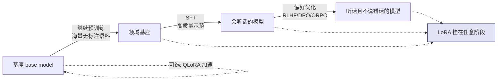
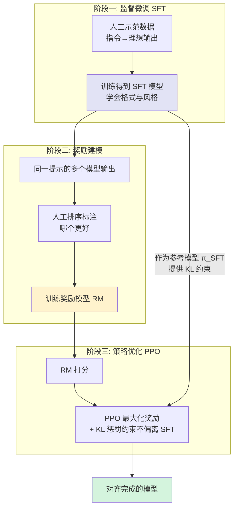
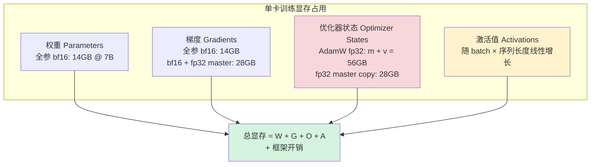

# [[大模型微调]]

> [!tip] 学习目标
> 能独立判断一个需求「该用 Prompt、RAG、还是微调」，能说清 SFT / LoRA / 偏好优化 / 继续预训练四者各自解决什么问题，能手写一份可运行的 LoRA 微调脚本并估出它的显存账单。

> [!warning] 先说实话：对双非背景的求职者，微调不是最优先的技能
> 微调需要 **数据 + 显卡 + 调参时间 + 评估纪律** 四样东西同时到位。校招面试里，考官问微调，问的绝大多数不是「你会调 LoRA 吗」，而是 **「你为什么选择微调而不是 RAG？」** —— 能答出这句话的人比能背出 LoRA 公式的人稀缺得多。
>
> **优先级排序（按投入产出比）**：
> 1. **Prompt 工程 + 结构化输出** —— 成本最低，见 [[Prompt-Engineering]]
> 2. **RAG + 向量检索** —— 解决知识时效性与可溯源，见 [[向量数据库]]
> 3. **Agent 工程与工具编排** —— 解决「模型不够强」以外的绝大多数问题，见 [[Agent-架构模式]]
> 4. **评测体系** —— 解决「我不知道改完是变好还是变坏」，这是所有微调的前提，见 [[RAG-评估]]
> 5. **微调** —— 只在以上四项都做完、且瓶颈被证明是「模型行为」而非「知识缺失」时才动
>
> ==微调能解决的是「模型不会按你要的方式做事」，不能解决「模型不知道你要的事」。后者只能靠 RAG 或继续预训练。== 面试时把这句话说出来，比讲十页 LoRA 更有用。

> [!info] 学术界标准做法 vs 开源社区流行实践
> 本篇会明确区分两者：
> - **学术界标准做法**：SFT → 偏好优化（RLHF/DPO）的分阶段流程，偏好数据由人工标注，结论建立在受控实验上。
> - **开源社区流行实践**：直接拿一个社区 LoRA 权重、灌几万条自动生成的合成数据、训 3 个 epoch 就上线。很多效果来自 **基座模型本身很强**，而不是这次微调。
>
> ==读到「7B 模型 LoRA 微调后效果暴涨」这类结论时，先问：基座是 base 还是 instruct？评测集和训练集重了吗？==

---

## 🎯 难度分段学习路径

| 难度 | 核心关注 | 预估时长 |
|---|---|---|
| **入门** | 四选一决策（Prompt / RAG / 微调 / 继续预训练）、四种微调类型的目的区分、什么场景绝对不该微调 | 6h |
| **进阶** | 指令数据格式（Alpaca / ShareGPT / messages）、数据清洗与质量证据、合成数据与防泄露、LoRA 原理与超参、QLoRA 与显存估算 | 14h |
| **高级** | SFT→偏好优化的完整链路、RLHF 三阶段与 DPO/ORPO 简化、训练工程（AdamW 显存公式、梯度累积、bf16、梯度检查点、ZeRO/FSDP）、框架选型、合并与量化部署、微调后评估与灾难性遗忘 | 20h |

**总学时**：40h ｜ **前置知识**：[[LLM-基础]]（Transformer / LoRA 作用在哪些矩阵上）、[[Prompt-Engineering]]、基本的 PyTorch 训练循环

---

## 📖 第一章 入门（Beginner）

### 1.1 最重要的判断：Prompt / RAG / 微调 / 继续预训练 四选一

这是全篇最有价值的一节。**在做任何训练之前，先用这张表把需求归类。**

| 维度 | Prompt 工程 | RAG 检索增强 | 微调（SFT/LoRA/DPO） | 继续预训练 |
|---|---|---|---|---|
| **要什么能力** | 改变单次行为指令 | 注入外部知识 | 改变**稳定的行为/风格/格式/领域术语习惯** | 注入大规模领域**语料级**语言能力 |
| **典型问题** | 「让它按 JSON 输出」「别废话」 | 「它不知道我们公司 2024 年的报销标准」 | 「它写代码总是不带注释」「它老是不懂我们的 DSL 语法」「它语气不对」 | 「它连这个领域的行话都读不懂」 |
| **训练数据需求** | 0 条 | 0 条（只需文档） | ==几百到几万条高质量样本== | 数亿到数千亿 token |
| **成本量级** | 近 0 | 索引成本 + 每次调用的检索开销 | 单卡数十到数百美元 | 数万到数百万美元 |
| **知识可解释/可溯源** | 完全可溯源（就是那段提示） | ==完全可溯源（能指回原文片段）== | 不可溯源，权重里的黑盒 | 不可溯源 |
| **知识时效性** | 改提示即时生效 | ==重建索引即可更新== | 要重训才能更新 | 要重训 |
| **失效模式** | 上下文超长、指令冲突 | 检索召回错、上下文干扰、多跳失败 | 过拟合、灾难性遗忘、能力偏移 | 成本失控、算力不足 |
| **可逆性** | 秒级回滚 | 秒级下架文档 | ==需重新训练/回滚权重== | 需重新训练 |

**决策树（照着走，不要跳）**：

```mermaid
graph TD
    A[一个需求: 模型表现不达预期] --> B{缺的是知识<br/>还是行为?}
    B -->|不确定| B1[先问: 正确答案是否<br/>随时间变化/是私有的?]
    B1 -->|是| B2[99% 是知识问题<br/>→ 走 RAG 分支]
    B1 -->|否, 是稳定的领域表达习惯| C[走行为分支]
    B -->|明确缺知识| R1[先用 RAG 做<br/>检索 + 引用]
    R1 --> R2{RAG 后<br/>仍不达标?}
    R2 -->|达标| R3[结束. 不要微调<br/>RAG 已解决问题]
    R2 -->|不达标, 但能明确定位<br/>是"格式/风格/领域表达"| C
    R2 -->|不达标, 但说不清<br/>哪里不对| R4[先建评测集<br/>定位到具体失败样本]
    R4 --> C
    C --> C1{改 Prompt<br/>能解决吗?}
    C1 -->|能| C2[结束. Prompt 就够<br/>这是最优解]
    C1 -->|不能, 且拒绝执行是<br/>稳定的风格问题| C3{有 ≥ 数百条<br/>高质量样本吗?}
    C1 -->|不能, 是模型读不懂<br/>这个领域的语言| C4[考虑继续预训练<br/>或换基座]
    C3 -->|有| M1[微调: SFT 优先<br/>LoRA 省显存]
    C3 -->|没有| C2
    M1 --> M2{需要压制<br/>坏行为吗?}
    M2 -->|需要| M3[SFT 后接<br/>DPO / ORPO]
    M2 -->|不需要| M4[部署 + 持续评估]
    M3 --> M4

    classDef ok fill:#d4f4dd,stroke:#2d8659
    classDef bad fill:#f8d7da,stroke:#a94442
    class R3,C2 ok
    class C4 bad
```

> [!tip] 一个可以直接背的判据
> ==「答案会过期吗？」→ 会，用 RAG。→「答案是固定的吗？」→ 是，用 Prompt 或微调。==
> 「这批反馈数据是自然产生的（用户点赞/点踩、客服转人工记录、人工标注对比）吗？」→ 是，考虑偏好优化。
> 「你能一次性人工写出几百条完美示范吗？」→ 不能，别急着微调，先想办法造数据或换方案。

**填空题**

1. 需求判断的第一步是区分模型缺的是 ______ 还是 ______。
2. 当「正确答案会随时间变化」时，四选一里应当优先选 ______。
3. 「知识注入应该用 RAG 而不是微调」的核心理由是微调后的知识 ______（可溯源 / 可更新）。
4. 微调中「只改行为不改知识」对应的是 ______（SFT / 继续预训练 / RAG）。

**答案**：
1. 知识，行为
2. RAG
3. 可更新（且可溯源）
4. SFT

---

### 1.2 四种「微调」目的完全不同，必须分清

「微调」这个词在中文语境里被混用得很厉害。下面四种东西**目的、成本、数据形态、失败表现全都不同**，混为一谈是新人最常犯的认知错误。

| 方法 | 目的 | 更新哪些参数 | 数据量级 | 数据形态 | 典型失败表现 |
|---|---|---|---|---|---|
| **继续预训练**<br/>（continued pretraining / CPT） | 扩领域语言能力 | 全部参数（或大部分） | ==10⁸ ~ 10¹¹ token== | 无标注原始语料 | 成本失控；学了新领域但忘了通用能力；评测集（若是公开基准）被污染 |
| **SFT**<br/>（监督微调 / 指令微调） | 教会模型「按这种格式、这种风格回答」 | 全部或 PEFT 子集 | ==10² ~ 10⁴ 条高质量样本== | (指令, 输入, 输出) 三元组 | 输出风格不统一；过拟合（训练 loss 降、验证不降）；能力偏移 |
| **偏好优化**<br/>（RLHF / DPO / ORPO） | 压制坏行为、偏好好行为 | 全部或 PEFT 子集 | ==10³ ~ 10⁶ 条偏好对== | (提示, chosen, rejected) | 奖励被「hack」（模型学会骗奖励模型）；输出变得又长又啰嗦；被拒答案的似然没降反升 |
| **PEFT / LoRA**<br/>（不是独立目的，是一种手段） | ==让上面三种变便宜== | 只有注入的低秩矩阵 | 同上 | 同上 | rank 不够导致容量不足；target_modules 选错导致学不到 |

> [!warning] 最常见的误用
> 1. **把知识灌进 SFT**。你写 5000 条「公司报销标准是 X」的问答去微调。结果：知识无法溯源、无法更新、答错无法定位，而且**评测集极易泄露**。==这 500 条文档做 RAG 是十分钟的事，微调是三天的事。==
> 2. **拿 SFT 解决偏好问题**。你想让模型「不要说教」，但只用 SFT 喂正例。SFT 只知道「该这样说」，不知道「不该那样说」——ORPO 论文明确观察到：**只用 SFT 时 chosen 和 rejected 的对数似然会同时上升**。
> 3. **以为 LoRA 是一种「微调方法」**。LoRA 是参数高效的实现手段，可以套在 SFT 上、也可以套在 DPO 上。LLaMA-Factory 里的 `finetuning_type: lora` 和 `stage: dpo` 是**两个正交的配置项**。

**四者与训练阶段的关系**：



> [!tip] 记住这句话
> ==继续预训练给模型「词汇和语感」，SFT 给它「说话方式」，偏好优化给它「什么话不该说」。三者叠加是完整的开源后训练流水线（post-training pipeline）。==

**填空题**

1. 继续预训练的数据形态是 ______ （有标注示范 / 无标注原始语料）。
2. SFT 优化的目标是让模型学会按某种 ______ 和风格回答。
3. 偏好优化的数据形态是包含 chosen 与 ______ 的三元组。
4. LoRA 在四者中的角色是 ______ （一种微调目的 / 一种参数高效手段）。

**答案**：
1. 无标注原始语料
2. 格式
3. rejected
4. 一种参数高效手段

---

### 1.3 什么时候 LoRA 也不够用 / 什么时候连微调都不该做

| 情况 | 该做什么 | 理由 |
|---|---|---|
| 领域语料多但**不需要特定风格**（如医疗、法律文本） | RAG，或选一个已做过该领域继续预训的基座 | 微调不会给你准确知识，只会给你近似记忆 |
| 需要**真实**的偏好信号（安全、无害） | 人工标注偏好对 → DPO | 合成偏好对会继承标注模型的偏差，且自我强化 |
| 模型**已经很强**，只是偶发格式错 | 约束解码 / 结构化输出 / 后处理校验 | 见 [[API-调用与模型服务]] 中的 schema 校验 |
| 需要**多个能力**同时增强 | 混训，或分阶段 + 混合回放（见 3.8） | 纯顺序训练会灾难性遗忘 |
| 要改变**基础认知/推理能力** | 继续预训练或换更大基座 | PEFT 容量不够 |
| 训练/评估集与公开基准**高度重叠** | 先做去污染，或换私有评测集 | ==分数好看但不可信，等于给面试挖坑== |
| LoRA 训完 **train loss 降、验证集不升** | 停。数据不够或学习率过大 | 过拟合，此时加数据/加正则，而不是加 epoch |

**填空题**

1. 需要「真实」偏好信号时，用合成偏好对的问题是会继承标注模型的 ______。
2. LoRA 容量不足最直接的表现是训练 loss 降但 ______ 不升。
3. 需要同时增强多个能力时，纯顺序训练的主要风险是 ______。
4. 当模型偶发输出格式错误但整体能力够时，成本最低的解法是约束 ______ 或后处理校验。

**答案**：
1. 偏差（并自我强化）
2. 验证集指标
3. 灾难性遗忘
4. 解码

---

### 1.4 第一章综合练习

**填空题**

1. 四选一决策中，「不可溯源」是 ______（RAG / 微调）这一路的主要代价。
2. ORPO 论文指出，只用 SFT 训练时，chosen 与 rejected 的对数似然会 ______（同时上升 / 一升一降）。
3. LoRA 的 `finetuning_type` 与 `stage` 在 LLaMA-Factory 中是两个 ______ 的配置项。
4. 面试中比「会调 LoRA」更能体现判断力的回答是解释为什么选择 ______ 而不是微调。

**本章答案**：
1. 微调
2. 同时上升
3. 正交
4. RAG

**综合项目**：拿你手上任意一个「模型效果不好」的真实需求，写一份 200 字的技术选型说明，必须包含：① 缺的是知识还是行为（给判据）② 四选一的结论与被排除的三个选项各自的排除理由 ③ 如果选微调，训练集/验证集/测试集怎么切分、如何防泄露 ④ 上线后用什么指标判断它是变好了还是变坏了。==交付物是一份文档，不是一段代码。== 验收标准：每个「排除」都有具体理由，不能写「不适合」三个字。

> [!tip] 常见陷阱
> 1. **把微调当知识库用**。这是最贵也最常见的错误，且面试时一问就穿。
> 2. **先训再想评估**。没有评测集的微调等于掷骰子，loss 曲线好看不代表模型变好。
> 3. **分不清 base 和 instruct 基座**。对 instruct 模型再做「教它怎么对话」的 SFT，是重复劳动甚至有害。
> 4. **把社区微调权重的效果归功于数据**。同一套数据换个基座可能完全相反，务必自己做消融。

---

## 📖 第二章 进阶（Intermediate）

> [!warning] 与上一章的衔接
> 第一章回答了「该不该做」。从本章起假设你已经决定要做，并且已经能说清「缺的是行为不是知识」。跳过的后果是：你会花两周构造数据，最后发现该用 RAG。

### 2.1 指令数据的三种主流格式

三种格式在表达能力上差距很大，**选错格式会让你在模板上反复踩坑**。

| 格式 | 结构 | 优点 | 缺点 | 典型来源 |
|---|---|---|---|---|
| **Alpaca** | 三个平铺字符串：`instruction` / `input` / `output` | 极简、字段语义清晰、人工易读易改 | 无法表达多轮；无法表达 system 角色；`input` 为空时要写 `""` 而非省略 | Stanford Alpaca（52K 合成数据） |
| **ShareGPT** | 嵌套 `conversations` 数组，每轮含 `from`（human/gpt）与 `value` | 支持多轮；社区生态最广（LLaMA-Factory 默认支持） | 嵌套结构易写错；`from` 的取值必须与训练模板一致 | 早期中文开源指令集的通用格式 |
| **OpenAI messages** | 扁平 `messages` 数组，含 `role`（system/user/assistant）与 `content` | ==语义最规范==；system 优先；与主流推理 API 对齐 | 老训练脚本支持较差 | 现代数据集与 `transformers` 对话模板 |
| **Prompt-Completion** | 单个 `prompt` + `completion` 纯文本 | 任何模型都能用，无结构约束 | 模板不统一时模型学到不稳定 | Alpaca 的 OpenAI 变体、早期 GPT-3 微调 |

**关键机制：chat template（对话模板）**

不同模型的对话格式不同，LLaMA 3 用 `<|start_header_id|>user<|end_header_id|>`，Qwen 用 `<|im_start|>role\ncontent<|im_end|>`。==模板必须与基座模型预训练时用的完全一致，否则微调等于在教它一种它没见过的外星语法==。

```python
# 官方 API 写法：从基座 tokenizer 读出该模型的对话模板
from transformers import AutoTokenizer

tok = AutoTokenizer.from_pretrained("Qwen/Qwen2.5-1.5B-Instruct")
messages = [
    {"role": "system", "content": "你是严谨的编程助手。"},
    {"role": "user", "content": "用一句话解释 GQA。"},
]
text = tok.apply_chat_template(messages, tokenize=False, add_generation_prompt=True)
print(text)
# 再把 assistant 的答案拼上，构成完整训练样本
full = text + "GQA 让多个 Q 头共享更少的 K/V 头，从而压缩 KV-Cache。" + tok.eos_token
```

> [!danger] 真实事故类型
> TRL 官方 issue #3432 记录过一个典型现象：**同数据、同基座、同超参，TRL 训出来的模型分数远低于 LLaMA-Factory**。差异来源之一就是 `completion_only_loss` 的掩码处理与 chat template 的细微差别（尾部换行、思考块是否保留）。==结论：`completion_only_loss=True` 与「损失只算 assistant 部分」必须配对使用，且推理时模板要逐字复现。==

**填空题**

1. Alpaca 格式的三个核心字段是 instruction、input 和 ______。
2. ShareGPT 格式相对 Alpaca 的关键优势是能表达 ______ 。
3. 与基座模型预训练格式不一致的对话模板会导致微调效果 ______ 。
4. `completion_only_loss=True` 要求训练样本的损失只在 ______ 部分计算。

**答案**：
1. output
2. 多轮对话
3. 显著下降
4. assistant（回复）

---

### 2.2 数据清洗：质量远比数量重要（有证据）

| 清洗动作 | 做什么 | 不做会怎样 |
|---|---|---|
| **去重** | 精确去重（哈希）+ 近似去重（MinHash / SimHash / n-gram Jaccard） | 重复样本被反复学，模型对单一模式过拟合；==也是最常见的泄露来源== |
| **去噪** | 剔除乱码、模板残留（`Below is an instruction...`）、网页导航、纯符号行 | 模型学会「输出网页导航」这种模式 |
| **长度过滤** | 剔除过短（信息量为零）与过长（截断后语义断裂）样本 | 截断的样本教模型「说到一半就断」 |
| **格式一致性** | 统一模板、统一角色标记、统一换行、剔除混合语种 | 模型学到的是「格式噪声」而非「任务」 |
| **质量过滤** | 用更强模型给样本打分，剔除低分 | 见下 |
| **难度配比** | 保证任务类型分布不过度集中 | 单一类型占比过高会拖累通用能力 |

**质量 vs 数量的证据链（全部来自已核验论文）**：

| 论文 | 数据量 | 关键结论 |
|---|---|---|
| **LIMA** | ==1,000 条==精心筛选的示范，65B 基座 | 不用任何强化学习或偏好建模，人工评测中 43% 情况下与 GPT-4 相当或更优；==消融实验显示：只加数量不升多样性，收益急剧衰减；提升数据质量收益显著== |
| **Deita** | ==6,000 条==自动选出的 SFT 样本 | 超过使用 10 倍数据的开源对齐模型 |
| **How Abilities are Affected by SFT Data Composition** | 分档实验 | ==通用能力（MT-Bench 方向）在约 1,000 条样本后即趋于平台期；数学推理与代码生成则随数据量持续提升== |
| **Self-Instruct 作者自述** | 52K 自生成 | ==他们自己分析 200 条随机样本，发现约 46% 可能有问题== |
| **QLoRA 论文** | 小而精的数据集 | 「用小而高质量的数据集做 QLoRA 微调即可达到 SOTA」 |

> [!warning] 「数据质量远比数量重要」这句话的边界
> ==上面每一条都有前提：基座是已经做过大规模预训练的强模型。== LIMA 的结论是「预训练已经教会了知识，对齐只需教风格」——它 **不是** 在说「任何任务 1000 条就够」。
>
> 已被证据支持的正确表述是：
> - **风格/格式类目标**：数据量很快饱和（千级），质量决定上限。
> - **需要新能力的任务**（如特定领域的复杂推理、特定编程语言）：数据量持续有效，甚至越大越好。
> - 社区里流传的「1000 条就够」，指的是第一种。

> [!tip] 可落地的质量过滤流水线
> 1. **规则层**：长度、去重、模板残留、重复行（先用规则挡掉 60% 的垃圾，成本几乎为 0）
> 2. **模型层**：用一个更强的模型对每条 (指令, 输出) 打 0-5 分，剔除 < 3 分。==这一步是 Deita 论文的核心思想，也是目前性价比最高的做法==。
> 3. **多样性层**：对指令做嵌入聚类，按簇均衡采样，避免某一类占 40%。
> 4. **人工层**：==人工抽查 200 条==，统计问题率。Self-Instruct 团队就是这么发现 46% 问题的；你省下这 200 条，就不知道自己那 52K 里有多少是垃圾。

**填空题**

1. 近似去重的常用算法是 MinHash、SimHash 或基于 ______ 的 Jaccard 相似度。
2. LIMA 用 ______ 条精心筛选的示范就达到了很高的对齐效果。
3. Deita 用 ______ 条自动选出的 SFT 样本超过了使用十倍数据的开源模型。
4. Self-Instruct 作者人工检查 200 条样本，发现约 ______ 比例可能存在问题。

**答案**：
1. n-gram
2. 1,000
3. 6,000
4. 46%

---

### 2.3 合成数据与人工校验

| 数据来源 | 优点 | 风险 | 建议比例（经验法则） |
|---|---|---|---|
| 人工撰写 | 质量最高、风格可控 | 极贵、难覆盖长尾 | 种子集必备，10%-30% |
| 强模型蒸馏（如用 GPT-4 类模型生成） | 便宜、量大、格式统一 | ==风格单一；错误会被批量复制；模型可能学到「像强模型但不严谨」== | 主体，50%-80% |
| 真实用户日志 | 分布真实、有偏好信号 | 含隐私噪声、含大量低质；需脱敏 | 20%-50% |
| 爬取 + 清洗 | 量大 | 版权风险、质量方差极大 | 谨慎，且不要用于商业闭源产品 |

> [!warning] 合成数据的三个已知陷阱
> 1. **风格坍缩**。全用同一个强模型生成，输出格式会高度一致，模型在真实多样输入下容易「格式对了、内容空泛」。
> 2. **错误放大**。强模型也会答错。==错误被复制 5000 份，比 5000 条无关数据更有害==，因为模型会高置信度地重复这个错误。
> 3. **能力天花板**。==学生模型的上限受教师模型限制==。想让它学会教师没有的能力，蒸馏帮不上忙。

**防泄露（数据泄漏）是评估可信度的生死线**：

| 泄漏类型 | 怎么发生 | 后果 |
|---|---|---|
| **训练/测试重叠** | 同一份文档既进知识库（RAG）又进评测集 | 评测分数虚高 |
| **测试集进训练集** | 用 benchmark 训练集微调，测 benchmark 测试集 | ==分数漂亮但完全不可信，面试被追问即崩== |
| **去重不足** | 语义相同、措辞不同的样本跨集合 | 去重是防泄露的第一道防线 |
| **模板泄露** | 评测 prompt 模板与训练模板高度重合 | 模型学到「看到这个模板就输出这答案」 |

**可执行的防泄露检查**（写进你的项目文档，面试可讲）：

```python
# 1) 精确重复：训练/验证/测试集三向交叉查重
import hashlib
def norm(t: str) -> str:
    return " ".join(t.lower().split())          # 归一化：去空白、统一大小写
def h(t: str) -> str:
    return hashlib.sha256(norm(t).encode()).hexdigest()

train = [d for d in load_jsonl("train.jsonl")]
val   = [d for d in load_jsonl("val.jsonl")]
test  = [d for d in load_jsonl("test.jsonl")]

seen = {}
for name, rows in [("train", train), ("val", val), ("test", test)]:
    for d in rows:
        k = h(d["instruction"] + "||" + d["output"])
        if k in seen:
            print(f"[LEAK] {name} 命中 {seen[k]}")
        seen[k] = name

# 2) 近似重复：MinHash / SimHash，或直接用嵌入做余弦相似度批量比对
# 3) 公开基准污染：把 benchmark 的 test 集也灌进去做同样比对
```

```bash
# 命令行快速检查：训练集与测试集是否有完全相同的行
comm -12 <(sort -u train.jsonl) <(sort -u test.jsonl) | head
```

**填空题**

1. 合成数据量过大时，模型容易出现输出格式统一但内容 ______ 的「风格坍缩」。
2. 用强模型蒸馏时，学生模型的能力上限受 ______ 模型限制。
3. 去重之所以是防泄露的第一道防线，是因为泄露常常以语义相同但 ______ 不同的形式出现。
4. 人工抽查的推荐规模是每批数据抽 ______ 条做问题率统计。

**答案**：
1. 空泛
2. 教师（强）
3. 措辞
4. 200

---

### 2.4 第二章综合练习

**填空题**

1. LLaMA-Factory 中表达多轮对话最常用的数据格式是 ______ 。
2. 质量过滤流水线中性价比最高的一层是用更强模型对样本 ______ 。
3. 「数据质量远比数量重要」这个结论的隐含前提是基座模型已经完成 ______ 。
4. 评估数据可信度的第一道防线是对训练集与测试集做 ______ 。

**本章答案**：
1. ShareGPT
2. 打分并剔除低分样本
3. 大规模预训练
4. 去重（精确 + 近似）

**综合项目**：为一个真实场景（可以是你的毕设、课程项目或某个开源项目 issue）构建一套 500 条的指令数据集，要求：① 用 Alpaca 与 ShareGPT 两种格式各存一份，写一个转换脚本并验证二者可互相还原；② 跑完规则层 + 模型层清洗，输出清洗前后的条数与被剔除原因分布；③ 切分 train/val/test 并跑上面的防泄露脚本，附上输出；④ 人工抽 100 条标注问题率。==验收标准：产出一个 `dataset_report.md`，含清洗统计表、泄露检查结果、以及你从 100 条抽查里发现的 5 个具体错误样例。==

> [!tip] 常见陷阱
> 1. **格式选对了但模板错了**。ShareGPT 的 `from` 字段与模型模板的 role 名不一致，训练全程不报错但效果差。
> 2. **loss 掩码没做**。默认全序列算 loss，模型把学习预算浪费在模仿用户提问上，信噪比极差。
> 3. **盲目信「去重就够了」**。语义级泄露靠精确哈希抓不住，必须有近似去重。
> 4. **把清洗脚本当一次性任务**。==清洗参数（阈值、去重算法）是超参数，要像调学习率一样记录并做消融。==

---

## 📖 第三章 高级（Advanced）

> [!note] 深度标准
> 本章每节包含：机制原理 / 边界条件 / 异常行为 / 可复现的验证命令。显存公式与超参范围为工程经验值，已标注来源与误差来源。

### 3.1 LoRA 原理：为什么 W = BA 有效

**核心机制**：冻结预训练权重 $W_0 \in \mathbb{R}^{d \times k}$，只训练两个小矩阵 $A \in \mathbb{R}^{d \times r}$、$B \in \mathbb{R}^{r \times k}$（$r \ll \min(d,k)$），前向计算：

$$h = W_0 x + \frac{\alpha}{r} B A x$$

| 机制点 | 说明 |
|---|---|
| **低秩假设** | 论文的实证发现：适配下游任务的权重更新 $\Delta W$ 具有**低秩性**，即 $\Delta W \approx BA$，$r$ 可以远小于 $d$ |
| **`r`（rank）** | ==容量旋钮==。论文实验的关键结论之一：==增大 $r$ 收益递减，$r=8$ 或 $r=16$ 在多数任务上已接近全参数微调==。调大只增加显存和过拟合风险 |
| **`lora_alpha`** | 缩放系数，实际缩放为 `alpha / r`。==惯例是固定 alpha（如 16 或 32）并随 r 同比调整，使 `alpha/r` 恒定==；只调 r 不调 alpha 会让有效学习率突变 |
| **`target_modules`** | 注入到哪些矩阵。==只加到 attention 的 q/v 上是最小配置；加到 q/k/v/o + MLP 的 gate/up/down 覆盖面更广、效果更好但显存翻倍== |
| **初始化** | ==$A$ 用高斯随机初始化，$B$ 初始化为全零==。这样训练开始时 $BA = 0$，模型行为与原模型完全一致（不会一上来就破坏预训练能力） |
| **推理无额外延迟** | 论文强调：LoRA 可在部署前 merge 进 $W_0$（$W' = W_0 + \frac{\alpha}{r}BA$），==因此不像 adapter 那样引入串行推理延迟==。这是 LoRA 相对 adapter 的核心工程优势 |
| **可训练参数量** | 论文报告：GPT-3 175B 上 LoRA 把可训练参数减少 ==10,000 倍==，GPU 显存需求降低 3 倍 |

**显存估算（LoRA，7B 模型，rank=16，bf16，batch=1，seq=2048）**：

| 组成 | 计算 | 约占用 |
|---|---|---|
| 冻结基座权重（bf16） | 7B × 2 bytes | 14 GB |
| LoRA 可训练参数（r=16，全 target） | 约 40M × (2 权重 + 2 梯度 + 8 AdamW 状态) | 0.5 GB |
| 激活值（开梯度检查点） | 约为不开的 1/30 | 1-3 GB |
| 框架开销（CUDA context、碎片） | 经验值 | 1-2 GB |
| **合计** | | ==≈ 17-19 GB，单张 24GB 卡可行== |

> [!warning] 三个必须记住的边界条件
> 1. **「LoRA 与全参微调效果相当」有前提**：LoRA 论文的实验设定是「任务与基座预训练分布接近」。当任务需要基座完全没有的新能力时，低秩假设不成立，LoRA 会明显落后。
> 2. **trainable params 打印不出来 ≠ 参数没生效**。用 `peft` 打印 `model.print_trainable_parameters()` 确认数量级对不对。
> 3. **`merge_and_unload` 会把 LoRA 焊死进基座**。==合并后无法再摘下来单独分发，也不能再切回原模型==。分发时务必同时保留 adapter 权重。

**填空题**

1. LoRA 的低秩矩阵 $B$ 必须初始化为 ______ ，以保证训练开始时模型行为不变。
2. `lora_alpha` 在前向计算中的实际缩放是 `alpha /` ______ 。
3. LoRA 论文报告 GPT-3 175B 上可训练参数减少了约 ______ 倍。
4. LoRA 相对 adapter 的推理优势是可以通过 ______ 合并进基座，从而不引入额外延迟。

**答案**：
1. 全零
2. r（rank）
3. 10,000
4. merge（合并权重）

---

### 3.2 QLoRA：4bit + NF4 + 双重量化

QLoRA 让「单卡微调 65B」成为可能。三个关键组件：

| 组件 | 做什么 | 收益 |
|---|---|---|
| **4bit NormalFloat（NF4）** | ==针对近似正态分布的权重设计的信息论最优 4bit 数据类型==。它把 16 个可表示值按正态分位数摆放，而非等距 | 论文消融：==NF4 配双重量化后完全追平 16-bit LoRA 的 MMLU 表现；FP4 则落后约 1 个百分点== |
| **双重量化（Double Quantization）** | 把第一层量化产生的**量化常数本身**再量化一次（8bit） | ==平均每个参数再省约 0.37 bit，65B 模型约省 3 GB== |
| **Paged Optimizer** | 用 NVIDIA unified memory 管理优化器状态，吸收梯度检查点带来的显存尖峰 | 避免长序列 mini-batch 时的 OOM |

| 数字 | 值 | 来源 |
|---|---|---|
| 65B 16-bit 全参微调显存需求 | > 780 GB | QLoRA 论文 |
| 65B QLoRA 显存需求 | < 48 GB | QLoRA 论文 |
| 最小 Guanaco（7B）部署显存 | 约 5 GB | QLoRA 论文 |
| QLoRA 论文微调规模 | 超过 1,000 个模型，涵盖 8 个指令数据集 | QLoRA 论文 |

**对应官方 API 参数**（`transformers` + `peft` + `bitsandbytes`）：

```python
from transformers import BitsAndBytesConfig

bnb_config = BitsAndBytesConfig(
    load_in_4bit=True,                       # 4bit 权重
    bnb_4bit_quant_type="nf4",               # NF4 数据类型
    bnb_4bit_use_double_quant=True,          # 双重量化
    bnb_4bit_compute_dtype=torch.bfloat16,   # 反量化后的计算精度
)
```

**什么时候 QLoRA 不够用**：
1. **需要训练 Embedding / LM head**。QLoRA 默认只量化并冻结线性层；词表相关的层通常保持高精度，要单独处理。
2. **目标模块与量化冲突**。部分 `target_modules` 在 bitsandbytes 的 4-bit 路径下支持不完整，报错或精度异常。
3. **需要极长上下文**。序列长 × 激活值才是瓶颈，4bit 省的是权重，解决不了激活。
4. **对数值精度敏感的任务**。==论文明确指出 FP4 落后 NF4 约 1 个百分点==，如果你对精度有硬要求，不要随手换 FP4。

**填空题**

1. QLoRA 中的 NF4 是针对 ______ 分布设计的信息论最优 4bit 数据类型。
2. 双重量化节省的机制是把量化 ______ 本身再量化一次。
3. QLoRA 论文报告 65B 模型 QLoRA 的显存需求低于 ______ GB。
4. QLoRA 论文消融中，FP4 相比 NF4 在 MMLU 上落后约 ______ 个百分点。

**答案**：
1. 近似正态（权重）
2. 常数（quantization constants）
3. 48
4. 1

---

### 3.3 对齐方法：SFT 之后为什么还要偏好优化

**SFT 的先天缺陷**（ORPO 论文实测，Figure 3）：只用 SFT 训练时，**chosen 与 rejected 的对数似然同时上升**。原因很直观：交叉熵只惩罚「没说对的话」，不惩罚「说了不该说的话」。所以 SFT 训完后，模型对坏答案的置信度甚至可能比训练前更高。



**三个阶段（InstructGPT 论文的标准流程）**：

| 阶段 | 数据 | 产出 | 工程难点 |
|---|---|---|---|
| 1. SFT | 人工示范的 (提示, 理想回答) | SFT 模型 $\pi_{\text{SFT}}$ | 数据贵；见 2.3 |
| 2. 奖励建模 | 同一提示的 4-9 个输出 + 人工排序 | 奖励模型 RM | ==奖励模型会被「hack」==：策略学会专门骗高分 |
| 3. 策略优化（PPO） | 策略实时采样 + RM 打分 + KL 惩罚 | 最终模型 | ==调参极其痛苦、训练不稳定==；显存需同时装 4 个模型（策略、参考、奖励、价值） |

InstructGPT 论文的另一个关键结论：==1.3B 的 InstructGPT 在人类评测中优于 175B 的原始 GPT-3，尽管参数少 100 倍==。这条结论支撑了「对齐 >> 堆参数」的工程判断。

**DPO 的简化（为什么不需要显式奖励模型）**：

| 方法 | 需要训练的对象 | 在线采样 | 显存中的模型数 | 稳定性 |
|---|---|---|---|---|
| RLHF (PPO) | 策略 + 参考 + 奖励 + 价值 | ==需要== | 4 | 调参痛苦 |
| **DPO** | 策略 + 参考 | 不需要 | ==2== | 论文称「无需大量超参调优」 |
| **ORPO** | 策略 | 不需要 | ==1== | 无参考模型、无独立 SFT 阶段 |

**DPO 的核心洞察**：奖励函数与最优策略之间存在解析映射关系。把这个映射代入 KL 约束的奖励最大化目标，整个问题化简为**一个二分类损失**：

$$\mathcal{L}_{\text{DPO}} = -\mathbb{E}\left[\log \sigma\left(\beta \log\frac{\pi_\theta(y_w|x)}{\pi_{\text{ref}}(y_w|x)} - \beta \log\frac{\pi_\theta(y_l|x)}{\pi_{\text{ref}}(y_l|x)}\right)\right]$$

==读法：拉开「chosen 相对参考模型提升了多少」与「rejected 相对参考模型提升了多少」的差距。β 控制偏离参考模型的强度。==

**ORPO 的进一步简化**：不需要参考模型，直接在 SFT 的负对数似然上附加一个几率比（odds ratio）惩罚项 $\mathcal{L}_{OR} = -\log\sigma\left(\log\frac{\text{odds}_\theta(y_w|x)}{\text{odds}_\theta(y_l|x)}\right)$。==ORPO 论文报告：相比 DPO 训练时间减少 56.3%，单卡 batch size 可增大 4 倍==。

| 偏好方法 | 是否需要参考模型 | 是否需要独立 SFT 阶段 | 论文/arXiv |
|---|---|---|---|
| RLHF (PPO) | 是 | 是 | 2203.02155 |
| DPO | ==是==（但只需前向、不训练） | 实践中是 | 2305.18290 |
| ORPO | ==否== | ==否== | 2403.07691 |
| KTO | 否 | 是 | 2402.01306 |

**偏好数据（chosen / rejected）的质量要求**：

| 要求 | 说明 | 踩坑 |
|---|---|---|
| **必须是真实偏好，不是随机配对** | 随机配对会让模型学到「长度差异」这类伪特征 | 早期工作用「同提示不同随机种子」构造 rejected，模型学会了「长的更好」 |
| **长度要控制** | 长度偏置是自动评测（AlpacaEval 类）的主要失真源，==专门的论文 Length-Controlled AlpacaEval 就是为此提出长度控制校正== | 不控制长度，评测胜率不可比 |
| **标注者一致性** | 多标注者 + Krippendorff α / Fleiss κ 衡量 | 一致性太低说明标注准则没定清，标注员在猜 |
| **AI 反馈可替代但有代价** | UltraFeedback 用强模型生成多维度反馈 | 会继承教师偏差；建议混合人工抽检 |

**填空题**

1. ORPO 论文实测发现，只用 SFT 训练时 chosen 与 rejected 的对数似然会 ______ 上升。
2. InstructGPT 论文中 ______ 参数的 InstructGPT 在人类评测中优于 175B 的原始 GPT-3。
3. DPO 相比 RLHF 省掉了显式的 ______ 模型训练。
4. ORPO 相比 DPO 省掉了 ______ 模型。

**答案**：
1. 同时
2. 1.3B
3. 奖励（RM）
4. 参考

---

### 3.4 训练工程：显存构成与省显存手段

**训练显存的四大部分**：



**AdamW 显存估算公式（务必会推，面试常问）**：

$$
M_{\text{AdamW}} = P \times (b_w + b_g + 2 b_{opt} + b_{master})
$$

| 符号 | 含义 | bf16 混合精度下的典型值 |
|---|---|---|
| $P$ | 可训练参数量 | — |
| $b_w$ | 权重存储精度（bytes） | 2（bf16） |
| $b_g$ | 梯度精度 | 2（bf16）或 4（fp32） |
| $b_{opt}$ | 优化器一阶/二阶动量精度 | 4（fp32 m 和 v 各一个） |
| $b_{master}$ | fp32 主权重副本 | 4 或 0（若优化器直接持有 fp32 参数则为 0，但**通常保留**） |

> [!tip] 动手算一遍（这是检验你是否真的会做微调的最快方法）
> **7B 模型全参微调，bf16 混合精度，梯度 fp32，优化器状态 fp32，保留 fp32 主权重**：
> - 权重：$7\times10^9 \times 2 = 14$ GB
> - 梯度：$7\times10^9 \times 4 = 28$ GB
> - 优化器动量（m + v）：$7\times10^9 \times 4 \times 2 = 56$ GB
> - fp32 主权重：$7\times10^9 \times 4 = 28$ GB
> - **小计：126 GB** → 加上激活，单张 80GB 卡也放不下，必须 ZeRO-2/3 分片
>
> **同样 7B，只训 LoRA（rank=16，约 40M 参数）**：
> - 冻结基座：$7\times10^9 \times 2 = 14$ GB（不参与优化器状态）
> - 可训练部分：$4\times10^7 \times 16 = 0.64$ GB
> - **小计：约 15 GB** + 激活 ≈ 17-19 GB
>
> ==结论：LoRA 之所以流行，不是因为效果更好，而是因为它把「优化器状态」这一大块从显存账单上删掉了。== 因为 $P$ 从 $7\times10^9$ 降到 $4\times10^7$，降了 175 倍。

| 省显存手段 | 省哪部分 | 代价 |
|---|---|---|
| **bf16 混合精度** | 权重与激活减半 | ==Ampere（A100/30 系/40 系）之前不支持 bf16，只能用 fp16；fp16 需 loss scaling，梯度可能下溢为 0== |
| **梯度累积** | ==不省显存，只等效放大 batch== | 优化器更新次数不变，收敛行为与真正大 batch 不同 |
| **Gradient Checkpointing** | 激活值（重算换显存，约 30% 速度损失） | 计算量增加；QLoRA 论文的 Paged Optimizer 专门处理它带来的显存尖峰 |
| **ZeRO-1** | 优化器状态分片 | 通信量不变 |
| **ZeRO-2** | + 梯度分片 | 通信量略增 |
| **ZeRO-3** | ==+ 权重分片== | ==通信量大，需注意与量化模型不兼容== |
| **CPU offload** | 优化器状态/权重挪到内存 | PCIe 带宽成为瓶颈，显著变慢 |
| **FSDP** | PyTorch 原生的分片方案，思路同 ZeRO-3 | 需调 `auto_wrap_policy` |

**验证命令（可复现）**：

```bash
# 训练中实时看显存与利用率
watch -n 1 nvidia-smi

# 精确定位显存分配（PyTorch 官方自带统计）
python -c "
import torch
from torch.cuda import memory
print('已分配 %.2f GB' % (memory.allocated()/1024**3))
print('峰值已分配 %.2f GB' % (memory.max_memory_allocated()/1024**3))
print('已保留 %.2f GB' % (memory.reserved()/1024**3))
"

# 找出最耗显存的张量（定位到具体层）
python -c "
import torch
from torch.profiler import profile, ProfilerActivity
with profile(activities=[ProfilerActivity.CPU, ProfilerActivity.CUDA]) as prof:
    # 你的训练 step
    pass
print(prof.key_averages().table(sort_by='self_cuda_memory_usage', row_limit=10))
"
```

**填空题**

1. AdamW 优化器状态包含一阶动量 $m$ 与二阶动量 $v$，两者通常都是 ______ 精度（fp32 / bf16）。
2. 梯度累积的作用是等效放大 batch，但它 ______ （省显存 / 不省显存）。
3. Gradient Checkpointing 的代价是约 ______% 的额外计算。
4. ZeRO-3 与 ZeRO-2 的关键差别是 ZeRO-3 额外分片了 ______ 。

**答案**：
1. fp32
2. 不省显存
3. 30
4. 权重（参数）

---

### 3.5 最小可运行的 LoRA 微调脚本

基于官方 API 写法（`transformers` + `peft` + `trl`）。==本脚本是「结构正确」的最小示例，未在本机实际训练（无 GPU 环境）；若报错请优先核对三个库的版本兼容性。==

```python
# lora_sft_minimal.py
# 环境：pip install torch transformers peft trl datasets bitsandbytes accelerate
import torch
from datasets import load_dataset
from transformers import (
    AutoModelForCausalLM,
    AutoTokenizer,
    BitsAndBytesConfig,
    TrainingArguments,
)
from peft import LoraConfig, get_peft_model, prepare_model_for_kbit_training
from trl import SFTTrainer

# ---------- 1. 数据：ShareGPT 格式，多轮对话 ----------
# 每条形如 {"messages": [{"role": "system", ...}, {"role": "user", ...}, ...]}
dataset = load_dataset("json", data_files="data/train.jsonl", split="train")
dataset = dataset.map(
    lambda x: {"messages": x["messages"]},   # 已是 messages 格式则原样
    remove_columns=dataset.column_names,
)

# ---------- 2. 加载 tokenizer ----------
# trust_remote_code 只在你信任该模型仓库的自定义代码时才开
model_id = "Qwen/Qwen2.5-1.5B"             # 建议先从 1.5B 跑通流程
tokenizer = AutoTokenizer.from_pretrained(model_id)
if tokenizer.pad_token is None:            # Qwen 等模型需要显式设置 pad token
    tokenizer.pad_token = tokenizer.eos_token

# ---------- 3. 量化配置（QLoRA） ----------
bnb_config = BitsAndBytesConfig(
    load_in_4bit=True,
    bnb_4bit_quant_type="nf4",
    bnb_4bit_use_double_quant=True,
    bnb_4bit_compute_dtype=torch.bfloat16,
)

# ---------- 4. 加载模型 ----------
model = AutoModelForCausalLM.from_pretrained(
    model_id,
    quantization_config=bnb_config,          # 去掉这一行即为普通 LoRA（16bit 基座）
    device_map="auto",                        # accelerate 自动分配设备
    torch_dtype=torch.bfloat16,
)
model = prepare_model_for_kbit_training(model)   # 4bit 训练的前置：冻结归一化层等
model.config.use_cache = False               # 训练时关掉 KV-Cache，否则显存暴涨

# ---------- 5. LoRA 配置 ----------
lora_config = LoraConfig(
    r=16,                                    # rank：容量旋钮，8~16 通常够用
    lora_alpha=32,                           # 惯例：alpha 随 r 同比调整，使 alpha/r 恒定
    lora_dropout=0.05,
    bias="none",                             # 不训练 bias
    task_type="CAUSAL_LM",
    # 最小配置：只注入注意力。覆盖面更广：加上 MLP
    target_modules=["q_proj", "k_proj", "v_proj", "o_proj"],
    # target_modules=["q_proj","k_proj","v_proj","o_proj",
    #                 "gate_proj","up_proj","down_proj"],
)
model = get_peft_model(model, lora_config)
model.print_trainable_parameters()            # 关键校验：数量级对不对
# 预期输出类似：trainable params: 35,651,840 || all params: 1,544,571,392 || trainable%: 2.31

# ---------- 6. 训练参数 ----------
training_args = TrainingArguments(
    output_dir="./out/lora-sft",
    num_train_epochs=3,
    per_device_train_batch_size=1,           # 显存不够就降这里
    gradient_accumulation_steps=16,          # 有效 batch = 1 × 16
    learning_rate=2e-4,                      # LoRA 常用量级：1e-4 ~ 3e-4
    lr_scheduler_type="cosine",
    warmup_ratio=0.03,
    logging_steps=10,
    save_strategy="epoch",
    save_total_limit=2,                      # 只留最近 2 个 checkpoint，否则磁盘爆
    bf16=True,                               # Ampere+ 用 bf16；老卡改 fp16=True
    gradient_checkpointing=True,             # 省激活显存
    gradient_checkpointing_kwargs={"use_reentrant": False},
    optim="paged_adamw_8bit",                # 8bit 优化器进一步省显存（QLoRA 论文的做法）
    report_to=[],
    seed=42,
)

# ---------- 7. 训练 ----------
trainer = SFTTrainer(
    model=model,
    args=training_args,
    train_dataset=dataset,
    processing_class=tokenizer,             # 近期版本参数名为 processing_class
    max_seq_length=2048,                     # 旧版本参数名为 max_length
    packing=True,                            # 把短样本拼接成长序列，提高 GPU 利用率
    # completion_only_loss=True,            # 损失只在 assistant 部分计算（关键！）
)
trainer.train()

# ---------- 8. 保存：adapter 与合并版分别存 ----------
adapter_dir = "./out/lora-sft/adapter"
model.save_pretrained(adapter_dir)           # 只存 adapter（几十 MB，可上传）
tokenizer.save_pretrained(adapter_dir)

merged = model.merge_and_unload()            # 合并进基座：推理零额外延迟
merged.save_pretrained("./out/lora-sft/merged")
tokenizer.save_pretrained("./out/lora-sft/merged")
print("完成：adapter 在", adapter_dir, "；合并版在 ./out/lora-sft/merged")
```

**加载 adapter 做推理**（不加载合并版）：

```python
from peft import PeftModel
from transformers import AutoModelForCausalLM, AutoTokenizer

base = AutoModelForCausalLM.from_pretrained(
    "Qwen/Qwen2.5-1.5B",
    quantization_config=BitsAndBytesConfig(load_in_4bit=True),
    device_map="auto",
)
model = PeftModel.from_pretrained(base, "./out/lora-sft/adapter")
tokenizer = AutoTokenizer.from_pretrained("./out/lora-sft/adapter")

messages = [{"role": "user", "content": "用一句话解释 LoRA 的低秩假设。"}]
text = tokenizer.apply_chat_template(messages, tokenize=False, add_generation_prompt=True)
inputs = tokenizer([text], return_tensors="pt").to(model.device)
out = model.generate(**inputs, max_new_tokens=128, do_sample=False)
print(tokenizer.decode(out[0][inputs["input_ids"].shape[1]:], skip_special_tokens=True))
```

**超参起点表（经验值，非论文结论）**：

| 超参 | 常见起点 | 说明 |
|---|---|---|
| `r` | 8 / 16 / 32 | LoRA 论文显示 $r$ 增大收益递减；先试 8 和 32 看差异 |
| `lora_alpha` | 16 或 32 | 保持 `alpha/r` 恒定；改 r 时同比改 alpha |
| `lora_dropout` | 0.05 | 权重小时可设 0；数据量大时调大 |
| `learning_rate` | 1e-4 ~ 3e-4 | ==远高于全参微调（通常 1e-5 ~ 2e-5），因为只训小矩阵== |
| `num_train_epochs` | 2 ~ 3 | ==超过 3 轮且无正则时过拟合风险陡增== |
| 有效 batch size | 16 ~ 128 | 用梯度累积凑，不要靠显式大 batch |
| `max_seq_length` | 按数据 95 分位长 | 过长会 OOM，过短会截断 |

**填空题**

1. `prepare_model_for_kbit_training` 的作用是为 4bit 训练做 ______ 前置准备。
2. 训练时必须设 `model.config.use_cache = False`，否则会因 ______ 而显存暴涨。
3. LoRA 微调的学习率通常比全参微调 ______ （高 / 低）。
4. `merge_and_unload` 之后 LoRA 权重被 ______ 进基座，无法再单独摘下。

**答案**：
1. 量化（k-bit）
2. KV-Cache
3. 高
4. 合并（焊死）

---

### 3.6 训练框架与工具选型

| 工具 | 定位 | 什么时候用 | 不适合 |
|---|---|---|---|
| **transformers** | 基础库：模型、tokenizer、Trainer | 任何微调的底座 | ==不提供高级对齐算法== |
| **peft** | ==参数高效微调的标准库==：LoRA / QLoRA / Adapter / IA³ 等 | 显存有限、要分发小 adapter | 全参微调 |
| **trl** | 对齐算法库：`SFTTrainer` / `DPOTrainer` / `PPOTrainer` | 做 SFT、DPO、RLHF | 复杂分布式编排 |
| **bitsandbytes** | 量化内核：4bit NF4、8bit 优化器、LLM.int8() | QLoRA 必需 | ==Windows 需单独装 CUDA 版，见仓库说明== |
| **accelerate** | 设备映射与分布式启动抽象 | 单机多卡 | 复杂流水线并行 |
| **DeepSpeed** | ZeRO 分片 + 3D 并行 + CPU offload | ==大模型（≥13B）全参训练、多机多卡== | 单卡小模型（杀鸡用牛刀） |
| **FSDP** | PyTorch 原生分片 | 不想引入 DeepSpeed 依赖时 | 同上 |
| **LLaMA-Factory** | ==一站式 GUI/CLI 微调平台==，封装 100+ 模型、SFT/DPO/PO/RM 四阶段、量化导出 | ==个人与小团队的首选：一条命令跑通全流程== | 需要深度定制训练逻辑 |
| **Unsloth** | 手写 Triton kernel + 手写反传引擎，宣称 2× 速度、80% 显存节省 | ==单卡消费级 GPU 上微调大模型== | ==不兼容部分模型与自定义 loss== |
| **Axolotl** | 配置驱动的微调框架 | 需要声明式配置、复现实验 | 极简流程 |

**LLaMA-Factory 最小 QLoRA 训练命令**（以 YAML 配置为例，配置项名与官方文档一致）：

```yaml
# qwen_lora_sft.yaml
model_name_or_path: Qwen/Qwen2.5-1.5B
stage: sft                       # sft | dpo | rm | ppo
do_train: true
finetuning_type: lora            # full | freeze | lora
lora_target: all                 # all 等价于覆盖 attention + MLP 全部线性层
lora_rank: 16
lora_alpha: 32
lora_dropout: 0.05

dataset: my_sft                  # 对应 data/my_sft.json 与 data/dataset_info.json 中的注册名
dataset_dir: data
template: qwen                   # ==必须与基座模型的对话模板一致==
cutoff_len: 2048
overwrite_cache: true
preprocessing_num_workers: 4
max_samples: 20000

output_dir: saves/qwen1_5b/lora/sft
logging_steps: 10
save_steps: 500
plot_loss: true
overwrite_output_dir: true

per_device_train_batch_size: 1
gradient_accumulation_steps: 16
learning_rate: 2.0e-4
num_train_epochs: 3.0
lr_scheduler_type: cosine
warmup_ratio: 0.1
bf16: true
gradient_checkpointing: true
```

```bash
# 训练（YAML 与上面的文件同名）
llamafactory-cli train qwen_lora_sft.yaml

# 合并 LoRA 到基座
llamafactory-cli export \
  --model_name_or_path Qwen/Qwen2.5-1.5B \
  --adapter_name_or_path saves/qwen1_5b/lora/sft \
  --template qwen \
  --finetuning_type lora \
  --export_dir saves/qwen1_5b/lora/merged

# 合并 + 量化导出（导出为 GPTQ 4bit）
llamafactory-cli export \
  --model_name_or_path Qwen/Qwen2.5-1.5B \
  --adapter_name_or_path saves/qwen1_5b/lora/sft \
  --template qwen \
  --finetuning_type lora \
  --export_dir saves/qwen1_5b/lora/gptq \
  --export_quantization_bit 4 \
  --export_quantization_dataset dummy_data
```

> [!warning] 三个最容易踩的坑
> 1. **`template` 与基座不匹配**。这是「配置全对但效果就是差」的头号原因。模板列表见官方仓库 examples 目录。
> 2. **`--export_quantization_dataset dummy_data` 漏了**。量化导出需要校准数据，缺这个参数会直接失败。
> 3. **Unsloth 不是「更好的 transformers」**。它通过替换 kernel 与反传引擎实现加速，官方 FAQ 明确说明存在模型覆盖不全与自定义 loss 不可用的情况。==先跑通官方 TRL 流程，再考虑换 Unsloth 求速度。==

**填空题**

1. LLaMA-Factory 中 `stage` 与 `finetuning_type` 分别控制 ______ 和 ______ 。
2. QLoRA 必需的量化内核库是 ______ 。
3. LLaMA-Factory 量化导出时必须提供校准数据参数 `--export_quantization_dataset` ______ 。
4. Unsloth 的加速原理是手写 ______ kernel 与反传引擎。

**答案**：
1. 训练阶段，参数高效方式
2. bitsandbytes
3. dummy_data
4. Triton

---

### 3.7 模型合并与量化部署

| 环节 | 做什么 | 注意事项 |
|---|---|---|
| **LoRA merge** | $W' = W_0 + \frac{\alpha}{r}BA$，把 adapter 焊进基座 | 推理零额外延迟；==合并后不可逆，务必保留 adapter 备份== |
| **多 adapter 合并** | 同一基座下多个任务 adapter 合并成一个 | 任务冲突时可能劣化；不要默认「多合一」更好 |
| **模型级合并（TIES/ SLERP）** | 合并不同训练来源的**整个模型** | 与 LoRA 合并是两回事，别混 |

| 量化方式 | 分类 | 特点 |
|---|---|---|
| **INT4（NF4）** | 量化训练时使用（QLoRA） | ==训练专用，不是部署最优选择== |
| **GPTQ** | 训练后量化（PTQ），逐层用二阶信息（海森矩阵）做误差补偿 | 精度损失小；==重建过程可能对校准集过拟合== |
| **AWQ** | PTQ，==激活感知==：只保护约 1%（论文给 0.1%-1%）的显著权重通道 | ==不依赖反向传播或重建，因此泛化性更好，跨领域与多模态不易过拟合==；推理框架支持广 |
| **FP8** | W8A8 | Hopper（H100）以上原生支持；A100 需软件模拟 |
| **GGUF / llama.cpp** | 端侧生态 | 消费级硬件与 CPU 推理首选 |
| **W4A16** | 通用描述 | ==只量化权重、激活保持 16bit，是当前 LLM 权重量化的主流范式== |

**量化对精度的影响与验证方法**：

| 影响来源 | 机理 |
|---|---|
| 权重舍入误差 | 低 bit 直接截断权重，累积到输出 |
| 离群值 | LLM 权重分布有离群通道，均匀量化会为它们浪费大量量化区间（GPTQ 的出发点） |
| 量化激活 | W8A8 会同时量化激活，风险高于 weight-only |
| 校准集过拟合 | ==GPTQ 的重建可能让模型在非校准领域能力退化==（AWQ 论文的主要论点之一） |
| 长文本与数学能力 | 这两类对精度最敏感，==常见现象是「闲聊无感、数学明显变差」== |

```bash
# 验证方法：必须在与线上一致的评测集上对比，且要有非校准领域的题目
# 1) 困惑度对比（快，适合回归监控）
# 2) lm-evaluation-harness 跑标准基准
lm_eval --model hf \
  --model_args pretrained=./merged,quantization=gptq \
  --tasks mmlu,gsm8k,humaneval \
  --batch_size 1 \
  --output_path ./eval_gptq.json

# 3) 业务私有评测集：上线前必做，公开基准只能作参考
# 4) 关键：加入「非校准领域」的自有题目，暴露 GPTQ 过拟合
```

> [!tip] 验证清单
> 1. 报告要写明**量化前后**的同一评测集数字，而不是「量化后也能用」。
> 2. 必须包含推理类任务（数学/代码），因为这是最先崩的。
> 3. 必须包含**未参与校准**的自有业务数据，这是区分 AWQ 与 GPTQ 表现的关键。
> 4. 报告显存与吞吐变化，否则无法论证「精度损失是否值得」。

**填空题**

1. AWQ 相比 GPTQ 的核心方法论差异是它 **不依赖反向传播或重建**，因此 ______ 性更好。
2. W4A16 指的是只量化 ______，激活保持 16bit。
3. QLoRA 中的 NF4 属于 ______ （训练后量化 / 量化训练）阶段的手段。
4. 验证量化影响时，除了标准基准还必须加入 ______ 领域的自有题目。

**答案**：
1. 泛化
2. 权重
3. 量化训练
4. 未参与校准

---

### 3.8 微调后的评估与灾难性遗忘

**为什么微调必须先建评测集**：
微调是一次「用模型本身当参数空间的搜索过程」的操作。==没有评测集时，你无法区分「模型变强了」与「模型只是把训练集背下来了」。== 训练 loss 下降不构成任何证据（尤其在 SFT 上，模型有能力把训练集拟合到接近 0）。

| 评估层次 | 测什么 | 怎么测 |
|---|---|---|
| **能力保持** | 微调前的通用能力有没有退化 | 微调前后的基座在同一基准上对比 |
| **目标任务** | 目标能力有没有提升 | 私有评测集（切分出的测试集） |
| **格式遵循** | 输出是否稳定符合要求 | 规则校验（JSON 可解析、字段齐全），比人工打分更可靠 |
| **安全不退化** | 有没有变得更啰嗦/更爱说教 | 长度分布、拒答率、拒答质量抽检 |
| **RAG 兼容性** | ==微调后接 RAG，检索质量是否受影响== | 见 [[RAG-评估]] |

**灾难性遗忘（catastrophic forgetting）**：

| 现象 | 表现 | 缓解手段 |
|---|---|---|
| 顺序训练遗忘 | 先训 A 能力再训 B，A 能力消失 | ==混训；或分阶段 + 在后一阶段混入前一能力的数据回放== |
| 混训冲突 | 混在一起训，各能力互相拖累 | 检查数据配比；必要时拆成两个 adapter |
| 通用能力退化 | 微调后「不会说人话」、只会用固定模板 | 混入通用数据；控制训练轮数 |
| 领域能力退化为领域能力 | 只会答垂直问题，通用问题答崩 | ==通用数据占比与垂直数据 1:1 或更高；用基座表现做对照== |

论文证据：How Abilities are Affected by SFT Data Composition（arXiv 2310.05492）的四组策略对比实验结论清晰：

| 训练策略 | 专用能力 | 通用能力 | 结论 |
|---|---|---|---|
| 多任务混合训练 | 保留最好 | ==受损最严重== | 数据混得不好会互相冲突 |
| 顺序训练 | ==严重遗忘== | 保留 | 后一阶段完全覆盖前一阶段 |
| 混合顺序训练 | 部分遗忘 | 保留 | 略好于纯顺序 |
| **DMT（双阶段混合）** | 显著提升 | ==保持甚至略升== | ==先全量学专用，再在通用数据里混入极小比例（论文用 $k=1/256$）的专用数据== |

**该论文的三条可迁移结论**：
1. 通用对齐能力在约 1,000 条样本后即**趋于平台期**；数学推理与代码生成则**持续受益于更多数据**。==所以「1000 条就够」只对前者成立。==
2. 数据**配比**在低资源下能互补，在高资源下会造成冲突 —— 别以为混合总是更好。
3. ==影响性能的主要是「配比数据量」而不是「配比比例」==。与其纠结 1:3 还是 1:10，不如先把两类数据都加够。

**与 RAG 评估的衔接**：如果你的微调目的是配合 RAG（比如让模型更善于使用检索到的片段），评测必须包含检索质量维度，详见 [[RAG-评估]] 的 Faithfulness / Context-Recall 指标体系。==只看「最终答案对不对」会掩盖「模型是否真的在用检索结果」这一关键信号。==

**填空题**

1. 训练 loss 下降 ______ （构成 / 不构成）微调有效的证据。
2. 灾难性遗忘在顺序训练下表现为前一阶段学到的 ______ 能力消失。
3. DMT 策略的第二阶段在通用数据中混入的比例极小（论文用 $k=$ ______）。
4. 论文指出通用能力在约 ______ 条样本后趋于平台期。

**答案**：
1. 不构成
2. 专用（领域）
3. 1/256
4. 1,000

---

### 3.9 第三章综合练习

**填空题**

1. `lora_alpha` 与 `r` 的比值在实践中应保持 ______ ，否则有效学习率会突变。
2. DPO 需要在显存中同时保留策略模型和 ______ 模型。
3. DeepSpeed ZeRO-3 与 QLoRA 的组合存在已知的 ______ 问题（量化模型与权重分片不兼容）。
4. 长度控制校正是针对自动评测中 ______ 偏置提出的方法。

**本章答案**：
1. 恒定（`alpha/r`）
2. 参考（ref / SFT）
3. 不兼容
4. 长度

**综合项目**：在一个单卡环境（≥24GB 显存）上完成一次端到端 QLoRA 微调，要求：① 用 1.5B 级别 instruct 基座，跑通 3.5 节的最小脚本；② 自建或改造 ≥500 条指令数据，输出清洗前后的统计表与人工抽查问题率；③ 训练前先写好评测脚本（≥100 条私有测试题，覆盖格式遵循、目标任务、通用能力三类），训练前后各跑一次并贴出对比数字；④ 合并 adapter 并导出 4bit 量化版，量化后再跑一次评测，量化前后差异要写进报告。==验收标准：产出一份 `finetune_report.md`，含评测对比表、显存峰值数字、以及「如果重做一次我会先改什么」这一节。最后一节是面试时最能体现工程判断力的部分。==

> [!tip] 常见陷阱
> 1. **在 base 模型上做「教它对话」的 SFT**，而基座其实已有 instruct 版本。==先确认基座是什么，这是零成本的收益。==
> 2. **只报训练 loss**。面试官问「怎么知道变好了」时答不上来。
> 3. **lr 照抄全参微调的 1e-5 给 LoRA**。LoRA 的合理量级是 1e-4 ~ 3e-4，==差 10 倍会导致几乎学不动==。
> 4. **epoch 拉满**。SFT 3 轮以上极易过拟合，尤其数据只有几百条时。
> 5. **DPO 后不做长度检查**。偏好优化经常导致输出显著变长，线上成本与体验双重下降。
> 6. **adapter 训完没留备份就 merge**。==合并不可逆。==

---

## ⚡ 速查表

| 概念 | 一句话 |
|---|---|
| 四选一 | 缺知识 → RAG；缺行为 → Prompt 先行 → 微调；缺语感 → 继续预训练 |
| 继续预训练 | 注入领域语言能力，数据 $10^8$+ token，成本最高 |
| SFT | 教「按这种格式风格回答」，$10^2$~$10^4$ 条示范 |
| 偏好优化 | 教「什么话不该说」，需要 chosen/rejected 对 |
| LoRA | ==参数高效手段，不是独立目的==；$W_0 + \frac{\alpha}{r}BA$ |
| LoRA 初始化 | $A$ 高斯随机，$B$ **全零**（保证初始等价原模型） |
| alpha/r | 实践中保持恒定 |
| LoRA 论文数字 | 175B 上可训练参数减 10,000 倍，显存减 3 倍 |
| QLoRA | 4bit + **NF4** + 双重量化 + Paged Optimizer |
| NF4 | 针对近似正态权重分布的信息论最优 4bit 类型 |
| 双重量化 | 量化常数再量化，省约 0.37 bit/参数 |
| QLoRA 显存 | 65B：>780GB → <48GB |
| AdamW 显存 | $P \times (b_w + b_g + 2b_{opt} + b_{master})$；7B 全参 bf16 ≈ 126GB |
| 为什么 LoRA 省显存 | 可训练参数 $P$ 降百倍，**优化器状态随之消失** |
| 梯度累积 | 不省显存，只等效放大 batch |
| bf16 | Ampere+；老卡用 fp16 需 loss scaling |
| Gradient Checkpointing | 激活省约 30 倍，代价约 30% 计算 |
| ZeRO-1/2/3 | 分别分片：优化器状态 / +梯度 / +权重 |
| RLHF 三阶段 | SFT → 奖励模型 → PPO（+KL 约束） |
| DPO | 不训 RM、不在线采样，损失化简为二分类；需参考模型 |
| ORPO | ==不需参考模型、不需独立 SFT；比 DPO 省 56.3% 训练时间== |
| SFT 的缺陷 | chosen 与 rejected 似然**同时上升** |
| 偏好数据 | 必须真实排序；长度偏置要控制；标注一致性要测 |
| chat template | 必须与基座一致，否则「配置全对效果就是差」 |
| 清洗流水线 | 规则 → 模型打分 → 多样性聚类 → 人工抽 200 条 |
| LIMA | 1,000 条 → 43% 情况下与 GPT-4 相当或更优 |
| Deita | 6,000 条 → 超过用 10 倍数据的开源模型 |
| 通用能力饱和点 | 约 1,000 条；数学/代码不饱和 |
| 防泄露 | 精确去重 + 近似去重 + benchmark 污染检查 |
| AWQ vs GPTQ | AWQ 激活感知、无重建，泛化更好 |
| 灾难性遗忘缓解 | 混训，或分阶段 + 专用数据回放（$k=1/256$） |
| 关键超参 | LoRA lr 1e-4~3e-4；全参 lr 1e-5~2e-5 |
| 训练轮数 | SFT 2~3 轮，多了过拟合 |
| 面试金句 | ==「微调解决行为，RAG 解决知识」== |

---

## ❓ 常见问题

> [!faq]- Q：我只有一张消费级显卡，能微调吗？
> A：能。==7B 级别 QLoRA 在 24GB 卡上可行==，1.5B/3B 更宽松。优先用 LLaMA-Factory 一条命令跑通，再考虑优化速度。Unsloth 能进一步压显存，但会牺牲部分模型兼容性。

> [!faq]- Q：数据只有几十条，还有必要微调吗？
> A：==先别。== 几十条连验证集都切不出来，评测不可信。先看能不能用 few-shot prompt 或 RAG 解决（见 [[Prompt-Engineering]]）。如果确实要微调，几十条可以配极小 rank（r=4~8）做风格对齐，但必须承认这属于实验性质。

> [!faq]- Q：为什么不能拿 benchmark 的训练集微调然后测它的测试集？
> A：因为那不是评估，是训练。而且公开 benchmark 的测试集污染是普遍现象，==分数在社区里不再可比==。正确做法是用私有评测集，公开基准只作为「通用能力是否退化」的守门指标。

> [!faq]- Q：LoRA 的 rank 该怎么选？
> A：先试 `r=8` 和 `r=32`，看验证集差异。LoRA 论文显示收益递减很快。==如果两者没差异，说明瓶颈不在容量，而在数据质量或任务本身该用别的方案解决。== 别在 rank 上反复调参，数据侧的收益大得多。

> [!faq]- Q：DPO 之后模型变得特别啰嗦，怎么办？
> A：这是偏好优化的典型副作用 —— 更长的回答往往更容易被判为「更好」。三个手段：① 检查偏好数据的长度偏置；② 用长度控制校正后的评测（AlpacaEval 类）；③ 在偏好数据里主动做长度平衡采样。

> [!faq]- Q：微调后的模型还能接 RAG 吗？
> A：能，而且经常是最佳组合：==微调解决「会好好用检索结果」，RAG 解决「知道私域知识」。== 评测时必须加检索质量维度，见 [[RAG-评估]]。

> [!faq]- Q：unsloth 是不是「更好的 transformers」？
> A：不是。它通过替换 kernel 与反传引擎换速度，官方 FAQ 明确列出模型覆盖不全、自定义 loss 不可用等限制。==先跑通官方 TRL 流程建立基线，再换 Unsloth 比对加速比。== 否则出问题时分不清是流程错了还是框架的坑。

> [!faq]- Q：面试被问「你会微调吗」，怎么答才显得有判断力？
> A：不要从 LoRA 公式答起。==先说「我会先判断这个需求是不是该用微调」，给出四选一的判据，再说我实际做过什么、踩过什么坑、怎么验证效果。== 面试官见过太多能背公式的人，缺的是能判断「什么时候不该做」的人。

---

## 🪤 踩坑记录

- [ ] 训练前没有建私有评测集，训完只能看 loss，无法判断好坏
- [ ] `template` / chat template 与基座不一致，配置全对但效果就是差
- [ ] 忘记 `model.config.use_cache = False`，训练时显存莫名暴涨
- [ ] LoRA 用 1e-5 的学习率，几乎学不动（LoRA 需要 1e-4 量级）
- [ ] 4bit 训练忘了 `prepare_model_for_kbit_training`
- [ ] DPO 忘了加参考模型或未加载 `ref_model`，loss 曲线看着正常但行为漂移
- [ ] 评测集与训练集有语义级重叠，分数虚高
- [ ] 混训了过多公开 benchmark 数据，线上/离线表现不一致
- [ ] merge 之前没备份 adapter，合并后想回退已不可能
- [ ] 量化导出时漏了 `--export_quantization_dataset`，命令直接失败
- [ ] 蒸馏数据全来自同一个教师模型，风格坍缩导致真实输入下表现脆弱
- [ ] 连续顺序训练多个能力，前一个能力被完全遗忘
- [ ] 在 base 基座上做「教它对话」的 SFT，而基座已有 instruct 版本

---

> [!note] 权威资料（链接均于 2026-09-25 逐条核验 HTTP 200）
> **微调与参数高效**
> - [LoRA: Low-Rank Adaptation of Large Language Models](https://arxiv.org/abs/2106.09685) — 低秩假设、rank/alpha、可合并性、10,000 倍参数削减
> - [QLoRA: Efficient Finetuning of Quantized LLMs](https://arxiv.org/abs/2305.14314) — NF4、双重量化、Paged Optimizer、65B 单卡 48GB
> - [Fine-Tuning Language Models from Human Preferences](https://arxiv.org/abs/1909.08593) — 偏好建模的奠基工作
>
> **对齐方法**
> - [Training language models to follow instructions with human feedback](https://arxiv.org/abs/2203.02155) — InstructGPT，RLHF 三阶段、1.3B 优于 175B
> - [Direct Preference Optimization: Your Language Model is Secretly a Reward Model](https://arxiv.org/abs/2305.18290) — DPO 推导
> - [ORPO: Monolithic Preference Optimization without Reference Model](https://arxiv.org/abs/2403.07691) — SFT 使 chosen/rejected 似然同升、ORPO 省 56.3% 时间
> - [Training a Helpful and Harmless Assistant with Reinforcement Learning from Human Feedback](https://arxiv.org/abs/2204.05862) — 偏好数据集的来源论文
> - [KTO: Model Alignment as Prospect Theoretic Optimization](https://arxiv.org/abs/2402.01306) — 无需成对数据的替代路线
>
> **数据集与数据质量**
> - [LIMA: Less Is More for Alignment](https://arxiv.org/abs/2305.11206) — 1,000 条示范、消融实验
> - [What Makes Good Data for Alignment? A Comprehensive Study of Automatic Data Selection in Instruction Tuning](https://arxiv.org/abs/2312.15685) — Deita，复杂度/质量/多样性三维打分，6K 数据
> - [Self-Instruct: Aligning Language Models with Self-Generated Instructions](https://arxiv.org/abs/2212.10560) — 自举生成与过滤流程
> - [Stanford Alpaca: An Instruction-following LLaMA Model](https://github.com/tatsu-lab/stanford_alpaca) — Alpaca 格式的来源仓库
> - [yizhongw/self-instruct](https://github.com/yizhongw/self-instruct) — 官方代码与数据，==作者自述约 46% 样本可能有问题==
> - [How Abilities in Large Language Models are Affected by Supervised Fine-tuning Data Composition](https://arxiv.org/abs/2310.05492) — 通用能力 1,000 条饱和、DMT 与灾难性遗忘
> - [UltraFeedback: Boosting Language Models with Scaled AI Feedback](https://arxiv.org/abs/2310.01377) — AI 反馈的偏好数据集
> - [Length-Controlled AlpacaEval: A Simple Way to Debias Automatic Evaluators](https://arxiv.org/abs/2404.04475) — 长度偏置校正
> - [Instruction-Following Evaluation for Large Language Models](https://arxiv.org/abs/2311.07911) — IFEval，指令遵循的客观评测
> - [Tulu 3: Pushing Frontiers in Open Language Model Post-Training](https://arxiv.org/abs/2411.15124) — 完整后训练流水线的公开复现
> - [Finetuned Language Models Are Zero-Shot Learners](https://arxiv.org/abs/2109.01652) — FLAN，指令微调的规模化起点
>
> **量化与部署**
> - [ZeRO: Memory Optimizations Toward Training Trillion Parameter Models](https://arxiv.org/abs/1910.02054) — ZeRO 分片
> - [LLM.int8(): 8-bit Matrix Multiplication for Transformers at Scale](https://arxiv.org/abs/2208.07339) — 离群通道处理
> - [GPTQ: Accurate Post-Training Quantization for Generative Pre-trained Transformers](https://arxiv.org/abs/2210.17323) — 训练后量化
> - [AWQ: Activation-aware Weight Quantization for LLM Compression and Acceleration](https://arxiv.org/abs/2306.00978) — 激活感知、保护 1% 显著权重
>
> **框架与工具**
> - [huggingface/transformers](https://github.com/huggingface/transformers) · [huggingface/peft](https://github.com/huggingface/peft) · [huggingface/trl](https://github.com/huggingface/trl) · [huggingface/accelerate](https://github.com/huggingface/accelerate) — 官方主线四件套
> - [hiyouga/LLaMA-Factory](https://github.com/hiyouga/Llama-Factory) · [官方示例目录](https://github.com/hiyouga/LLaMA-Factory/tree/main/examples) · [merge_lora 示例](https://github.com/hiyouga/LLaMA-Factory/tree/main/examples/merge_lora) · [deepspeed 配置示例](https://github.com/hiyouga/LLaMA-Factory/tree/main/examples/deepspeed) — 一站式微调平台
> - [bitsandbytes-foundation/bitsandbytes](https://github.com/bitsandbytes-foundation/bitsandbytes) — NF4 / 8bit 优化器 / LLM.int8()
> - [unslothai/unsloth](https://github.com/unslothai/unsloth) · [官方文档](https://docs.unsloth.ai/) — 消费级 GPU 加速
> - [deepspeedai/DeepSpeed](https://github.com/deepspeedai/DeepSpeed) · [ZeRO-3 官方文档](https://deepspeed.readthedocs.io/en/latest/zero3.html) — 分布式训练
> - [microsoft/LoRA](https://github.com/microsoft/LoRA) — LoRA 论文的官方实现仓库
> - [xfactlab/orpo](https://github.com/xfactlab/orpo) — ORPO 官方仓库
> - [mit-han-lab/llm-awq](https://github.com/mit-han-lab/llm-awq) · [IST-DASLab/gptq](https://github.com/IST-DASLab/gptq) — 量化官方实现
> - [EleutherAI/lm-evaluation-harness](https://github.com/EleutherAI/lm-evaluation-harness) · [tatsu-lab/alpaca_eval](https://github.com/tatsu-lab/alpaca_eval) — 评测工具
> - [ggerganov/llama.cpp](https://github.com/ggerganov/llama.cpp) · [vllm-project/vllm](https://github.com/vllm-project/vllm) — 推理部署
> - [PyTorch AMP 文档](https://pytorch.org/docs/stable/amp.html) · [PyTorch FSDP 文档](https://pytorch.org/docs/stable/fsdp.html) — 混合精度与分片
> - [FlashAttention: Fast and Memory-Efficient Exact Attention with IO-Awareness](https://arxiv.org/abs/2205.14135) — 显存与速度优化，见 [[LLM-基础]]
>
> [!note] 关于来源的说明
> 本篇**未使用任何 huggingface.co 链接** —— 实测在本机网络下 huggingface.co 的文档站与模型页均返回 `000`（连接失败），==无法核验即不写入笔记==。相关 API 用法改用已核验的官方 GitHub 仓库（transformers / peft / trl / LLaMA-Factory / unsloth / deepspeed）与 PyTorch 官方文档作为来源。
> LoRA 最小脚本基于 `transformers` + `peft` + `trl` 的官方公开 API 写法（`SFTTrainer`、`LoraConfig`、`BitsAndBytesConfig`），==本机无 GPU 环境，未实际执行训练==，版本相关的参数名（如 `max_seq_length` / `max_length`、`processing_class` / `tokenizer`）在不同版本间有差异，读者以自己安装版本的官方文档为准。
> 超参起点表与显存估算标注为工程经验值，非论文结论；其中 LoRA「rank 增大收益递减」有 LoRA 论文实验支持，AdamW 显存公式为教科书级标准推导，其余建议在自己的环境上做一次基线测量再固化。

> [!info] 关于关联笔记的前向引用
> 本篇的「关联笔记」中，[[RAG-评估]]、[[Embedding-与向量检索]]、[[Agent-架构模式]] 等尚未创建的目标是本簇学习路线的**计划笔记**（见 [[AI-Agent-学习路线]] 的笔记清单）。判断方法：若该链接出现在学习路线表的「待写」列中，它就是待补的待办，不是错误链接；若链接的笔记已存在却解析不到，才是断链。

---

## 🔗 关联笔记

- [[LLM-基础]] - 微调作用的模型结构、注意力矩阵、MoE 与显存背景
- [[Prompt-Engineering]] - 四选一的第一顺位，改 Prompt 成本最低
- [[向量数据库]] - RAG 的检索底座，微调的替代方案之一
- [[RAG-评估]] - 微调后的评估方法与 Faithfulness / Context-Recall
- [[Embedding-与向量检索]] - 检索质量决定 RAG 上限
- [[RAG-系统设计]] - 端到端 RAG 链路
- [[Agent-架构模式]] - 很多「模型不够强」的问题在编排层解决
- [[API-调用与模型服务]] - 部署、schema 校验、vLLM / Ollama
- [[Python-工程基础]] - 训练脚本与数据管线的工程基础
- [[AI-Agent-学习路线]] - 本篇在整体路线中的位置（第五阶段，W13-W14）

---

*由 Hermes Agent 创建于 2026-09-25 · 状态：进行中*
