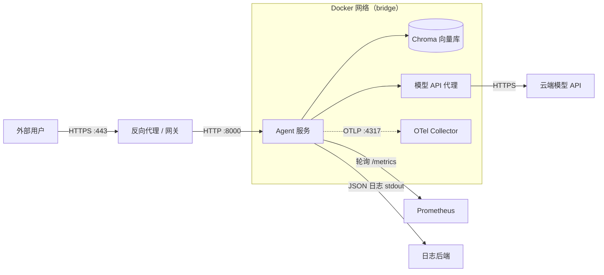
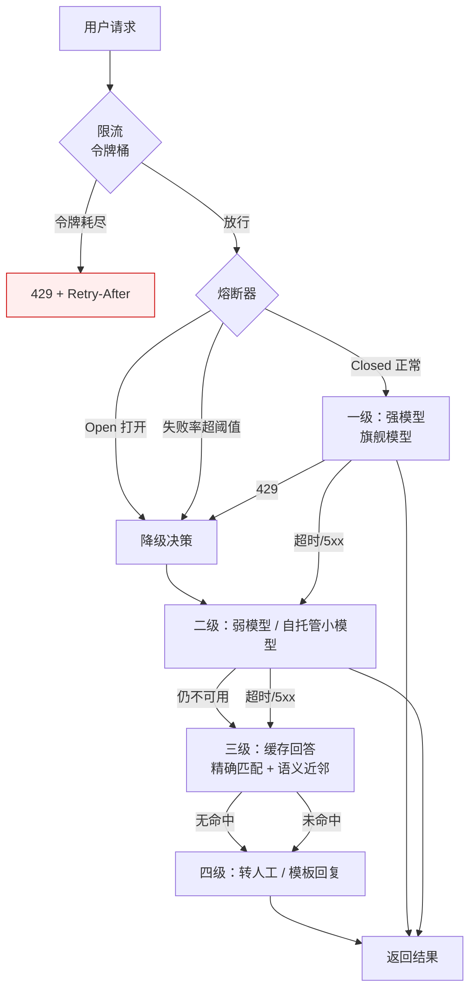
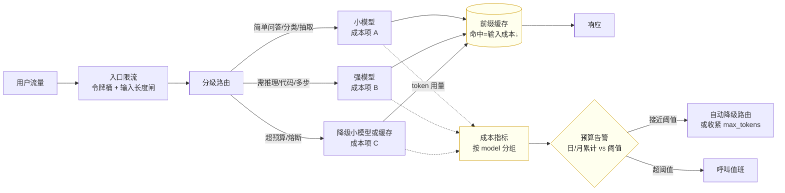

# [[工程化与部署]]

> [!tip] 学习目标
> 能独立把一个 Agent 服务从「本地能跑」推到「线上敢放量」：写出可复现的多阶段 Dockerfile 与 Compose 编排；按 GPU 显存与并发规划选型自托管推理或调用云 API；用 OpenTelemetry 打通 metrics/logs/traces 三支柱并按 RED/USE 定义指标；配好 SLO 告警、令牌桶限流与四级降级链路；用评估集做 CI 回归门禁；最后跑完一份可勾选的上线 checklist。

> [!info] 关于本篇的数字与链接
> 本篇所有链接于 **2026-09-25** 逐条 `curl -s -o /dev/null -w '%{http_code}' -m 25 -A 'Mozilla/5.0' -L` 核验，仅写回 200 的地址。
> ==本篇不写任何具体云厂商价格、GPU 型号报价、模型上下文长度与 token 单价== —— 这些是最易过期且无法在本机核验的数字。成本一律拆成**成本构成项**（算式 + 影响因素 + 你的量级），具体单价请查对应厂商官方页面。
> 启动参数、Compose 键名、Prometheus 指标名等「可被读者敲下去验证」的内容，均已对照官方文档页原文核对；核对不到的一律不写。

> [!note] 与 [[API-调用与模型服务]] 的分工
> [[API-调用与模型服务]] 讲的是**调用协议层**：两套接口、SSE 解析、工具调用结构化、退避重试、错误归一化。本篇讲的是**服务运行层**：这个服务怎么打包、怎么编排、怎么部署、怎么观测、怎么在故障时优雅降级。
> ==两篇唯一重叠的地方是「本地推理服务的选型」==（vLLM / Ollama / llama.cpp），本篇 2.1 只从**部署与运维视角**谈（显存规划、并发参数、健康检查、故障恢复），API 兼容性细节请回 [[API-调用与模型服务]] 3.4–3.5。
> 可观测性的**字段级 API 调用规范**（`gen_ai.*` 属性、token 用量、请求追踪 ID）也在 [[API-调用与模型服务]] 2.5/3.5，本篇 3.1 只讲**如何把这些信号变成可运维的告警与看板**。

---

## 🎯 难度分段学习路径

| 难度 | 目标 | 核心关注 | 预估时长 |
|---|---|---|---|
| **入门** | 能把服务跑起来且可复现 | 部署形态决策、镜像分层、多阶段构建、Compose 服务依赖与健康检查 | 8h |
| **进阶** | 能上线且故障可诊断 | 推理服务选型与显存规划、配置与密钥管理、日志与追踪落地、指标体系 | 12h |
| **高级** | 能扛量、能省钱、能安全 | SLO 与告警设计、限流熔断降级、CI/CD 评估门禁、灰度回滚、漏洞扫描与密钥轮换 | 12h |

**总学时**：32h ｜ **前置知识**：[[API-调用与模型服务]]（第 1–2 章）、[[Python-工程基础]]（第 5 章打包与依赖）、[[RAG-系统设计]]（有多组件才有编排需求）

---

## 📖 第一章 入门（Beginner）

> [!warning] 本章的分界线
> 第一章只解决「**跑得起来、别人也能跑起来**」。所有涉及成本优化、高可用、告警策略的内容都放到第二、三章 —— 因为==一个没有观测能力的多副本服务，扩到多副本只会让故障更难定位==。

### 1.1 部署形态决策：五种形态与选择依据

**结论先行**：==个人项目与内部工具直接上「单机 Docker Compose」；有 GPU 且 QPS 稳定后再考虑自托管推理；流量有明显波峰波谷时优先「云 API + 网关」，而不是自己扛 GPU==。

**知识点详解**

| 形态 | 适用场景 | 上手成本 | 主要风险 | 何时该换 |
|---|---|---|---|---|
| **本地开发** | 写代码、调 prompt | 最低 | 别人跑不起来（依赖本机环境） | 出现第二个协作者时 |
| **单机 Docker** | Demo、内部工具、毕业设计 | 低 | ==单点故障，主机挂了服务就没了== | 有真实外部用户时 |
| **云主机**（一台 VM 手工部署） | 长期运行的小服务、想完全自控 | 中 | ==要自己管系统更新、防火墙、备份、监控== | 组件超过 5 个时 |
| **容器编排（K8s）** | 多服务、多副本、需自动扩缩容 | 高 | ==运维复杂度陡增，小项目上是负债== | ==真的出现「副本数 > 1」或「跨服务 HPA」需求== |
| **Serverless** | 事件驱动、流量极稀疏 | 低-中 | ==冷启动、请求时长上限、长连接（SSE）不适配== | 常驻长任务时 |
| **托管推理服务**（云 API） | 流量波动、模型更新频繁 | 最低 | ==单 token 成本随量线性增长、数据出域== | 成本超过自托管 TCO 时 |

> [!tip] 决策的三个真实触发条件（不是「感觉该上了」）
> 1. **单机扛不住了** —— 磁盘写满 / 内存 OOM / 单机带宽打满，这三条出现任何一条就该迁走。
> 2. **一个人维护不动了** —— 服务数量 > 5 或「回滚一次要改 4 个地方」，Compose 的编排收益已归零。
> 3. **流量形状变了** —— 白天 50 QPS 夜里 0.1 QPS，自托管 GPU 就是在为闲置时间付全价；此时「云 API + 缓存」比扩容便宜。

**成本构成项（不写具体价格，写算式）**

| 构成项 | 算式 | 影响因素 | 能不能省 |
|---|---|---|---|
| 自托管推理 · 硬件 | `单卡单价 × 卡数 × 24h`（若长期开） | 卡的显存档位、是否专用 | 只能靠「能不能不用这张卡」 |
| 自托管推理 · 闲置 | `硬件成本 × (1 - 实际利用率)` | **峰谷比**是最大杠杆 | ==用完就关机 / 按需拉起== |
| 自托管推理 · 运维人力 | `人天 × 人天单价` | 升级、扩缩容、排障 | ==组件越少越省== |
| 云 API · token | `输入 token + 输出 token`（分别计价） | 上下文长度、输出上限、缓存命中 | ==提示词精简 + 前缀缓存 + 模型分级== |
| 云 API · 托管工具 | 每次调用附加计费 | 搜索、代码执行等 | 按需开 |
| 存储 · 向量库 | `数据量 × 副本数` | 分块大小、是否多副本 | 单副本够用就单副本 |
| 网络 · 出网流量 | `出网字节 × 单价` | 是否走 CDN、是否跨区 | 静态资源上 CDN |

> [!danger] 成本表里最容易漏的两项
> ==「自托管」不等于「便宜」==：把硬件成本 + 运维人天 + 故障损失加起来，自托管的 TCO 拐点通常出现在**利用率长期高于某个阈值**之后，而不是「QPS 大于某个数」。
> ==云 API 的真正变量不是单价，是 token 数==：同样一句话，`max_tokens` 从 512 放到 4096 意味着允许模型多写 8 倍。==限制输出长度是成本控制里性价比最高的一个开关==。

**填空题**

1. 部署形态决策中，「一个人维护不动了」的具体触发条件是服务数量超过 ______ 个，或回滚一次要改超过 3 个地方。
2. 自托管推理成本中，峰谷比影响最大的成本构成项是 ______（硬件成本 × 闲置比例）。
3. Serverless 形态对 LLM 应用最不适配的原因是冷启动、请求时长上限与 ______ 不适配。
4. 控制云 API 成本里性价比最高的单一开关是限制 ______。

**答案**：
1. 5
2. 闲置（`硬件成本 × (1 - 实际利用率)`）
3. 长连接（SSE 流式）
4. 输出长度（`max_tokens`）

---

### 1.2 Dockerfile 编写要点：分层缓存、多阶段、瘦身、非 root

**结论先行**：==Docker 缓存的判定规则只有一条 —— 「指令 + 它依赖的文件」没变才复用；所以依赖清单必须先于源码 COPY==。

**知识点详解**

| 要点 | 做法 | 官方依据/说明 |
|---|---|---|
| **分层顺序** | 变化少的放前面（依赖安装），变化多的放后面（源码） | 官方明确建议把**昂贵步骤靠前、易变步骤靠后**，改一个源码文件不该触发依赖重装 |
| **多阶段构建** | `FROM x AS builder` 编译 → `FROM 最小运行时` 只 `COPY --from=builder` 产物 | `FROM` 可在单个 Dockerfile 中出现多次；`COPY --from=<name>` 引用前一阶段 |
| **.dockerignore** | 根目录放 `.dockerignore` 排除 `.git`、`__pycache__`、`.env`、模型权重 | 规则作用于**整个构建上下文（含子目录）**，是粗粒度但有效的手段 |
| **非 root** | 末尾加 `USER appuser` | 官方 Dockerfile 参考里 `USER` 用于设置 UID/GID |
| **HEALTHCHECK** | `HEALTHCHECK CMD ...` | 状态初始为 `starting`，通过后 `healthy`，连续失败后 `unhealthy`；可 `--interval/--timeout/--start-period/--start-interval/--retries` |
| **ARG ≠ ENV** | 密钥用 `RUN --mount=type=secret`，==不要用 ARG== | ==官方警告：`ARG` 传的密钥会出现在 `docker history` 与 max 模式 provenance 证明中== |
| **exec 形式** | `CMD ["uvicorn","app:api"]` 而非 shell 形式 | exec 形式按 JSON 数组解析，避免 shell 字符串处理 |

**可运行示例（Python FastAPI + uv）**

```dockerfile
# syntax=docker/dockerfile:1
# ---------- 阶段 1：构建 ----------
FROM python:3.12-slim AS builder

ENV UV_COMPILE_BYTECODE=1 UV_LINK_MODE=copy
WORKDIR /app

# 先只拷依赖清单 —— 源码变动不会让这一层失效
COPY pyproject.toml uv.lock ./
RUN --mount=type=cache,target=/root/.cache/uv \
    uv pip install --system --no-cache .

# ---------- 阶段 2：运行 ----------
FROM python:3.12-slim AS runtime

# 非 root 运行
RUN groupadd -r app && useradd -r -g app app
WORKDIR /app

COPY --from=builder --chown=app:app /usr/local /usr/local

# 只拷应用代码与配置（不含测试与密钥）
COPY --chown=app:app app ./app
COPY --chown=app:app pyproject.toml ./

USER app
EXPOSE 8000

# 健康检查：进程活着但端口没监听也算不健康
HEALTHCHECK --interval=30s --timeout=5s --start-period=20s --retries=3 \
  CMD python -c "import urllib.request,sys; sys.exit(0 if urllib.request.urlopen('http://127.0.0.1:8000/healthz',timeout=3).status==200 else 1)"

ENTRYPOINT ["uvicorn", "app.main:api", "--host", "0.0.0.0", "--port", "8000"]
```

**.dockerignore（同样可运行）**

```gitignore
.git
.venv
__pycache__/
*.pyc
.env
.env.*
secrets/
tests/
docs/
*.md
models/
data/
.DS_Store
```

> [!tip] 缓存挂载的三种用法，别搞混
> - `--mount=type=cache,target=...` —— **跨构建持久**的包管理器缓存。官方例子：pip 用 `/root/.cache/pip`、npm 用 `/root/.npm`、Go 用 `/go/pkg/mod`。
> - `--mount=type=bind,target=...` —— 构建期只读挂载宿主目录，**不进入镜像也不进缓存**；官方明确说明 bind mount **默认只读**，要写需显式 `rw`，且写入内容在 `RUN` 结束后丢弃。
> - `--mount=type=secret,id=...,target=...` —— 密钥挂载，默认落在 `/run/secrets/<id>`，默认权限 `0400`。==不要用 `ARG` 传密钥，这是官方点名的反模式==。

> [!danger] 三个真实踩过的坑
> 1. ==`COPY . .` 写在 `pip install` 前面== → 改一行代码就要重装全部依赖，构建从 40 秒变 4 分钟。正确顺序永远是「依赖清单 → 安装 → 源码」。
> 2. ==`ENV OPENAI_API_KEY=...` 写进 Dockerfile== → 密钥固化进镜像层，任何人 `docker history` 都能看到，且无法通过删掉后续层删除。密钥必须在运行期注入。
> 3. ==忘了 `.dockerignore`== → 本地 8G 的 `models/` 目录被塞进构建上下文，`docker build` 先花几分钟上传，再得到一个和运行无关的巨大镜像。

**填空题**

1. Docker 层缓存复用的判定条件是「______ 与它依赖的文件」自上次构建以来没有变化。
2. 多阶段构建中，跨阶段取产物用的指令是 `COPY ______ <stage>`。
3. 官方文档点名**不建议**用 `ARG` 传递密钥，因为密钥会出现在 `______` 与 max 模式 provenance 证明中。
4. `HEALTHCHECK` 的初始状态是 `______`，连续失败后变为 `unhealthy`。

**答案**：
1. 指令（instruction）
2. `--from=`
3. `docker history` 命令
4. `starting`

---

### 1.3 Compose 编排：依赖、健康检查、卷、网络

**结论先行**：==`depends_on` 的短语法只保证「启动顺序」，不保证「服务可用」；要等对方真正能接请求，必须用 `condition: service_healthy` + 对方的 `healthcheck`==。

**知识点详解**

| 需求 | 正确键 | 官方语义 |
|---|---|---|
| 启动顺序 | `depends_on` | 短语法只等「容器 started」 |
| **等对方健康** | `depends_on: {condition: service_healthy}` | 依赖被 `healthcheck` 判为 healthy 才启动；`service_started`、`service_completed_successfully` 是另两个条件 |
| 依赖可缺失 | `required: false` | 只在依赖缺失时 Compose **警告**而非失败（仅 v2 短/长语法配合） |
| 健康检查参数 | `healthcheck: {test, interval, timeout, retries, start_period, start_interval}` | 官方示例默认值：`interval 1m30s` / `timeout 10s` / `retries 3` / `start_period 40s` / `start_interval 5s` |
| 覆盖镜像自带的检查 | 同上（`test` 会在镜像 `HEALTHCHECK` 之上） | Compose 文件可覆盖 Dockerfile 里的值 |
| 持久化数据 | `volumes` | 命名卷由引擎管理生命周期 |
| 资源限制 | `mem_limit` / `cpus` | ==不给上限的容器会吃光宿主机内存== |
| 只读根文件系统 | `read_only: true` | 配合 `tmpfs` 放临时文件 |
| 密钥 | `secrets`（顶层 + 服务内引用） | Compose 官方 Secrets 文档 |
| 优雅停机 | `stop_grace_period` | 默认 10s；<你的应用清理耗时就等于强杀 |

> [!tip] 依赖等待的正确写法
> 短语法 `depends_on: [db]` 的语义是「**started**」—— 容器起来了，但 Postgres 可能还在启动初始化、Chroma 还在建索引。此时 Agent 第一次查询就会连不上并抛错。
> ==长语法 + `service_healthy` 才是「可用」语义==。前提是**被依赖服务必须真的定义了 `healthcheck`**（Dockerfile 里或 Compose 里），否则这个条件永远不成立，行为退化成不等待。

**可运行示例：Agent 服务 + 向量库 + 模型 API 代理**

```yaml
# docker-compose.yml —— Agent 服务 + 向量库 + 模型 API 代理
name: agent-stack

x-py-health: &py-health                 # YAML 锚点：三个服务复用同一条健康检查
  test: ["CMD", "python", "-c", "import urllib.request,sys; sys.exit(0 if urllib.request.urlopen('http://127.0.0.1:%d/healthz',timeout=3).status==200 else 1)"]
  interval: 30s
  timeout: 5s
  retries: 3
  start_period: 30s

services:
  # ---------- 向量库：命名卷 + 健康检查 + 内存上限 ----------
  chroma:
    image: chromadb/chroma:0.6.3          # ==固定版本，不要用 :latest==
    restart: unless-stopped
    environment: { IS_PERSISTENT: "TRUE", ANONYMIZED_TELEMETRY: "FALSE" }
    volumes:
      - chroma-data:/chroma/chroma       # 命名卷：重建容器不丢数据
    healthcheck:
      test: ["CMD", "curl", "-fsS", "http://localhost:8000/api/v2/heartbeat"]
      interval: 10s
      timeout: 5s
      retries: 5
      start_period: 30s
    mem_limit: 2g
    networks: [agent-net]

  # ---------- 模型 API 代理：密钥只在这里，不给下游服务 ----------
  model-proxy:
    image: ghcr.io/your-org/llm-proxy:0.4.2
    restart: unless-stopped
    env_file: [.env.proxy]              # 不在版本库里（见 .gitignore）
    environment:
      UPSTREAM_BASE_URL: ${UPSTREAM_BASE_URL}
      LOG_LEVEL: ${LOG_LEVEL:-INFO}
    healthcheck: *py-health
    mem_limit: 512m
    networks: [agent-net]

  # ---------- Agent 主服务：等两个依赖都健康 ----------
  agent:
    build: { context: ., dockerfile: Dockerfile, target: runtime }
    image: your-org/agent-api:0.1.0
    restart: unless-stopped
    depends_on:
      chroma:       { condition: service_healthy }
      model-proxy:  { condition: service_healthy }
    environment:
      APP_ENV: production
      CHROMA_URL: http://chroma:8000
      LLM_BASE_URL: http://model-proxy:8080/v1
      OTEL_EXPORTER_OTLP_ENDPOINT: http://otel-collector:4317
      OTEL_TRACES_SAMPLER: parentbased_traceidratio
      OTEL_TRACES_SAMPLER_ARG: "0.01"
      LOG_FORMAT: json                   # 生产用 JSON，开发用 text
    ports:
      - "127.0.0.1:8000:8000"            # ==只绑回环：外部流量必须走反向代理==
    healthcheck: *py-health
    stop_grace_period: 40s                # > 应用处理 SIGTERM 的耗时
    mem_limit: 2g
    pids_limit: 512                       # 防 fork 炸弹
    read_only: true
    tmpfs: [/tmp]
    security_opt: [no-new-privileges:true]
    cap_drop: [ALL]
    networks: [agent-net]

  # ---------- 可观测性收集端（第二章展开） ----------
  otel-collector:
    image: otel/opentelemetry-collector-contrib:0.115.0
    restart: unless-stopped
    command: ["--config=/etc/otel/config.yaml"]
    volumes: ["./otel-collector-config.yaml:/etc/otel/config.yaml:ro"]
    ports: ["127.0.0.1:4317:4317", "127.0.0.1:4318:4318"]   # OTLP gRPC / HTTP
    mem_limit: 512m
    networks: [agent-net]

volumes:
  chroma-data:                            # 命名卷声明
networks:
  agent-net: { driver: bridge }
```



> [!danger] 这份 Compose 里最容易被忽略的四个键
> 1. **`mem_limit`** —— 不写上限，一个内存泄漏的服务会把宿主机的 swap 吃光，**连带杀掉同一台机器上的向量库**。这比服务本身挂掉严重得多。
> 2. **`ports: "127.0.0.1:8000:8000"`** —— 写成 `"8000:8000"` 会把端口绑到 `0.0.0.0`，==等于跳过反向代理直接暴露到公网==，认证、限流、TLS 全部失效。
> 3. **`read_only: true` + `tmpfs: [/tmp]`** —— Python 的 `__pycache__`、部分临时文件默认往根目录写，只读根文件系统下不挂 tmpfs 会导致运行时报错。
> 4. **镜像固定版本** —— `chromadb/chroma:0.6.3` 而不是 `:latest`。`latest` 意味着一次无关的 `pull` 就可能换掉向量库的存储格式。

**填空题**

1. Compose `depends_on` 的短语法只保证依赖服务进入 `______` 状态，不保证可用。
2. 要等依赖被 `healthcheck` 判为健康才启动，条件值应写 `condition: service______`。
3. Compose `healthcheck` 的 `start_period` 参数的作用是 ______（给出官方默认值）。
4. `stop_grace_period` 必须设置为大于应用处理 `SIGTERM` 的耗时，否则容器会被 ______。

**答案**：
1. started（已启动）
2. `service_healthy`
3. 启动宽限期，默认 `40s`
4. 强杀（SIGKILL）

---

### 1.4 第一章综合练习

**填空题（本章共 4 道，答案见下方）**

1. Docker 缓存复用的判定标准是「______ 与它依赖的文件」未变。
2. 跨阶段复制构建产物用 `COPY ______=builder`。
3. 官方文档明确指出**不要**用 `ARG` 传密钥，因为会泄漏到 `docker ______`。
4. `condition: service_healthy` 生效的前提是被依赖服务定义了 ______。

**本章答案**：
1. 指令
2. `--from`
3. `history`
4. `healthcheck`

**综合项目**：把手上任意一个 FastAPI/Flask 项目容器化，要求
- 输入：一个有 `pyproject.toml` 的 Python 服务（Agent 服务或 [[RAG-系统设计]] 里的问答服务）
- 步骤：① 写多阶段 Dockerfile（builder + runtime，非 root，HEALTHCHECK）；② 写 `.dockerignore`；③ 写 Compose，包含「向量库 + 你的服务」，向量库用命名卷且带 healthcheck；④ 你的服务用 `condition: service_healthy` 依赖向量库；⑤ 加 `mem_limit`、`pids_limit`、`read_only`、`cap_drop: ALL`；⑥ 端口只绑 `127.0.0.1`
- 产出物：`Dockerfile` + `.dockerignore` + `docker-compose.yml` + 一页 `README.md`（写清每条 `security_opt` / `cap_drop` 的作用与验证方法）
- 验收标准（逐条可执行验证）：
  1. `docker compose up -d && docker compose ps` 显示两个服务都是 `healthy`（不是 `running`）
  2. 改一行业务代码后 `docker compose build`，确认**依赖安装层被复用**（日志中出现 `CACHED` 且不是重新下载依赖）
  3. `docker compose exec agent id` 输出非 root 用户
  4. `docker compose down && docker compose up -d`，向量库数据仍在（命名卷生效）
  5. `docker compose config` 输出里看不到任何真实密钥（应为 `[REDACTED]` 或环境变量引用）

> [!tip] 常见陷阱
> 1. **`COPY . .` 在 `pip install` 之前** → 改代码就重装依赖。正确顺序：依赖清单 → 安装 → 源码。
> 2. **`ENV API_KEY=...` 写进 Dockerfile** → 密钥固化在镜像层里。密钥必须运行期注入。
> 3. **健康检查探 `/` 而不是专用探针** → 任何业务 500 都会被判定容器不健康，触发重启风暴。==探针必须只反映「进程是否具备接流量能力」，不含业务逻辑==。
> 4. **`depends_on` 短语法当成「等可用」** → 首次启动必现一次连接拒绝，凌晨的告警就是这么来的。
> 5. **端口绑 `0.0.0.0`** → 绕过反向代理，TLS 与鉴权全部失效。
> 6. **镜像用 `:latest`** → 一次无关 pull 换掉运行时行为，回滚时无法确定回哪个版本。


---

## 📖 第二章 进阶（Intermediate）

> [!warning] 与上一章的衔接
> 第一章解决「跑起来」，本章解决「**跑得稳、看得见**」。依赖 1.3 的 Compose 结构：把 `agent` / `chroma` / `model-proxy` 三个服务分别考虑「该放哪、该给多少资源、该配什么配置、该吐出什么信号」。
> ==跳过第一章直接读本章会踩的坑：把 `--gpu-memory-utilization` 调大后 OOM，因为不知道 1.2 的 `mem_limit` 也在同一条约束链上==。

### 2.1 模型服务部署：vLLM / Ollama / llama.cpp 选型与资源规划

**结论先行**：==生产自托管选 vLLM（吞吐与并发）、个人/边缘选 Ollama（零配置）、CPU 与极简部署选 llama.cpp（GGUF + 量化）==。选型的第一约束不是软件特性，而是==你的日均 token 量能不能把一张卡摊薄==。

**知识点详解**

| 维度 | vLLM | Ollama | llama.cpp |
|---|---|---|---|
| 定位 | 高吞吐服务引擎（PagedAttention） | 零配置本地运行器 | 轻量 C/C++ 推理，GGUF 生态 |
| 部署形态 | 有 GPU 的主机 / K8s | 本机 / 边缘小主机 | CPU / 边缘 / 单机 |
| 并发能力 | ==强（连续批处理 + 分页注意力）== | 弱-中 | 弱 |
| 显存管理 | ==`--gpu-memory-utilization` 显式控制== | 自动 | 主要在主存/CPU 内存 |
| 前缀缓存 | `--enable-prefix-caching` | 不以此为主卖点 | 不以此为主卖点 |
| 运维可观测性 | ==原生 Prometheus 指标（`vllm:` 前缀）== | 基础 | 基础 |
| 协议细节 | 见 [[API-调用与模型服务]] 3.4 | ==原生 `/api/chat` 是 NDJSON，`/v1` 才 OpenAI 兼容== | 见 [[API-调用与模型服务]] 3.4 |

> [!tip] 选型一句话
> ==先把「日均 token 量 × 单价」算出来，再和「一张卡的摊销成本」比==。低于摊销拐点就用云 API —— 这时候自托管省下的不是钱，是运维时间和故障风险。==注意本篇不给具体单价，请以各厂商官方页面为准==。

**vLLM 关键启动参数（均已对照官方 CLI/EngineArgs 页核对）**

| 参数 | 官方语义 | 规划要点 |
|---|---|---|
| `--gpu-memory-utilization` | 模型执行器可用的**显存比例**（0–1），官方默认 `0.92`；==是 per-instance 限制== | 同卡跑第二个 vLLM 实例时必须显式下调 |
| `--max-model-len` | 上下文长度（prompt + 输出）；未指定则从模型配置推导；支持 `1k/1K/25.6k` 等可读格式；`-1`/`auto` = 自动选能塞进显存的最大值 | ==调小它是最有效的「省显存 / 提并发」手段==，代价是超长请求被拒 |
| `--max-num-seqs` | 单次迭代处理的最大序列数 | 与 KV 缓存容量共同决定并发 |
| `--enable-prefix-caching` | 开启前缀缓存 | 与 [[API-调用与模型服务]] 2.6 的缓存友好性设计配套 |
| `--num-gpu-blocks-override` | 覆盖 profile 出的 GPU block 数；`None` 时不生效 | 官方说明其用途是**测试抢占**，生产慎用 |
| `--tensor-parallel-size` / `--pipeline-parallel-size` | 张量并行组数 / 流水并行组数，默认均为 `1` | 单卡保持 1；跨卡再调 |
| `--enable-chunked-prefill` | 按剩余 `max_num_batched_tokens` 切分 prefill | 长短请求混跑时改善排队 |
| `--served-model-name` | API 中暴露的模型名；响应 `model` 字段回显列表中第一个；==也用于 Prometheus 指标的 `model_name` 标签== | ==多模型网关场景下必须设置，否则指标无法区分模型== |
| `--enable-lora` / `--max-loras` / `--max-lora-rank` | 启用 LoRA 适配器；单批最多 LoRA 数默认 1；LoRA 最大 rank 允许值含 8/16/32/64/128/256/320/512，默认 16 | 与 [[大模型微调]] 衔接：微调产物要能被服务直接加载 |
| `--max-logprobs` | 指定 `logprobs` 时返回的最大对数概率数，默认 20；`-1` 为不限制（==可能导致 OOM==） | ==不要设 -1== |
| `--compilation-config` / `-cc` | `torch.compile` 与 cudagraph 捕获配置，可用 `-cc.mode=3` 简写或 JSON | 首次启动会编译，==要给足 `start_period`== |

**显存估算（算式，非实测数值）**

```text
可用 KV 缓存显存 ≈ 总显存 × gpu_memory_utilization − 模型权重显存 − 激活/临时缓冲
并发请求数上限 ≈ 可用 KV 缓存显存 / (单请求 KV 占用)
单请求 KV 占用 ≈ 2(K,V) × 层数 × 注意力头数_kv × head_dim × 序列长度 × 数据类型字节数
```

> [!danger] 三个 OOM 相关的必须记住的点
> 1. ==`--gpu-memory-utilization` 默认 0.92 意味着 vLLM 会假定「这台卡基本归我」==。同卡跑第二个实例时第二个会 OOM，必须给两者都显式设值（例如各 0.45）。
> 2. ==`--max-model-len` 调大不会增加并发，只会让每个请求吃掉更多 KV 缓存==，总并发反而下降。宁可调小 `max_model_len` 并在网关层做分片。
> 3. ==KV 缓存的公式前提是「GQA / MQA 模型的 `num_kv_heads` 远小于 `num_attention_heads`」==。MHA 模型（两者相等）下 KV 占用是 GQA 的数倍，同卡并发会低一个量级。**具体头数请查该模型的 `config.json`**，本篇不写具体模型的数字。

**vLLM 自带的关键指标（官方指标页实际存在的名称）**

| 指标 | 用途 |
|---|---|
| `vllm:time_to_first_token_seconds` | ==TTFT，最贴近用户感知的首字延迟== |
| `vllm:request_time_per_output_token_seconds` | 每输出 token 间隔（TPOT） |
| `vllm:inter_token_latency_seconds` | token 间延迟 |
| `vllm:num_requests_running` / `vllm:num_requests_waiting` | ==排队深度：waiting 高而 running 不满 = 显存/KV 不足== |
| `vllm:kv_cache_usage_perc` | KV 缓存使用率 |
| `vllm:num_preemptions` | ==抢占次数：持续非 0 说明并发超配== |
| `vllm:prefix_cache_queries` / `vllm:prefix_cache_hits` | 前缀缓存命中率（分子分母） |
| `vllm:prompt_tokens` / `vllm:generation_tokens` | token 流量 |
| `vllm:request_success` | 成功请求数（算错误率用） |
| `vllm:request_queue_time_seconds` / `vllm:request_prefill_time_seconds` / `vllm:request_decode_time_seconds` | 阶段耗时拆分 |

> [!tip] 指标要连成一条线才算可用
> 单看 `time_to_first_token_seconds` 偏高，你不知道该加卡还是该查网络。==把 `num_requests_waiting`、`kv_cache_usage_perc`、`num_preemptions`、`request_queue_time_seconds` 放同一张图上==：
> `waiting ↑ + kv_cache_usage ≈ 100% + preemptions > 0` → ==KV 缓存不足，考虑降 `--max-model-len` 或扩卡==；
> `waiting ↑ + kv_cache_usage 低` → ==调度或上游问题，不是显存问题==。

**填空题**

1. vLLM 的 `--gpu-memory-utilization` 官方默认值是 ______，且它是 per-instance 限制。
2. ==同一张 GPU 上要跑两个 vLLM 实例时，必须显式下调该参数，因为它是______限制==。
3. vLLM 指标中，`vllm:num_requests_waiting` 升高而 `vllm:kv_cache_usage_perc` 仍很低，最可能的原因是 ______（而非显存不足）。
4. `--max-logprobs` 设为 `-1` 的官方警告是可能 ______。

**答案**：
1. `0.92`
2. per-instance（单实例）
3. 调度问题或上游问题（不是显存）
4. 导致 OOM

---

### 2.2 配置与密钥管理：环境变量、配置分离与 fail fast

**结论先行**：==优先级应该反着来 —— 代码默认值最弱、环境变量次之、配置文件最强；密钥只在运行期注入且永不进仓库==。

**知识点详解**

| 项 | 放哪 | 理由 | 常见错误 |
|---|---|---|---|
| **密钥**（API key、数据库口令、签名密钥） | ==运行期环境变量 / 密钥管理服务== | 一旦落盘就会进版本库或镜像层 | 写进 `.env` 并 `git add` |
| **环境相关**（base_url、日志级别、采样率） | 环境变量 | 与代码解耦，容器友好 | 硬编码在代码里 |
| **行为配置**（超时、限流阈值、降级顺序） | 配置文件（YAML/TOML） | 需要结构化、需要校验、需要评审 | 散落成 20 个环境变量 |
| **业务不变常量** | 代码 | 需要版本化与 code review | 藏在配置文件里被随手改 |
| **开发/生产差异** | 独立配置文件 + 独立环境变量组 | ==生产配置必须能被 diff 与评审== | 靠 `if os.getenv("ENV")` 在代码里分支 |

**优先级链（从弱到强）**

```text
代码里的默认值  <  环境变量  <  配置文件  <  命令行参数
```

> [!danger] `.env` 的三种命运，必须分清
> | 放法 | 风险 |
> |---|---|
> | `.env` 在仓库里 | ==最严重：永久泄漏在历史里，删文件也删不掉历史== |
> | `.env` 在 `.gitignore` 里，人工维护 | 可接受，但容易在新人 clone 后漏建导致启动失败 |
> | `.env.example` 入库（只写键名，值写 `[REDACTED]`） | ==推荐做法：新人照着建自己的 `.env`== |
>
> `.gitignore` 必含：
> ```gitignore
> .env
> .env.*
> !.env.example
> secrets/
> *.pem
> *.key
> ```

**fail fast：启动时校验配置（可直接跑）**

```python
# config.py —— fail fast：配置错就在启动时死掉，不带病运行
from __future__ import annotations
import os
from dataclasses import dataclass, field
from typing import Literal

class ConfigError(RuntimeError):
    """配置不合法 —— 故意让进程在启动阶段就退出。"""

def _require(name: str) -> str:
    v = os.environ.get(name, "").strip()
    if not v:
        raise ConfigError(f"缺少必需的环境变量：{name}")   # 只说缺哪个键，绝不打印值
    return v

def _float(name: str, default: float, lo: float, hi: float) -> float:
    raw = os.environ.get(name)
    if raw is None:
        return default
    try:
        v = float(raw)
    except ValueError as e:
        raise ConfigError(f"环境变量 {name} 必须是数字，收到 {raw!r}") from e
    if not (lo <= v <= hi):
        raise ConfigError(f"环境变量 {name}={v} 超出合法区间 [{lo}, {hi}]")
    return v

@dataclass(frozen=True)
class Config:
    app_env: Literal["dev", "staging", "prod"]
    llm_base_url: str
    llm_model: str
    llm_api_key: str = field(repr=False)      # repr=False：防一行 print 泄漏全站密钥
    llm_timeout_s: float = 60.0
    fallback_models: tuple[str, ...] = ()    # 降级顺序：从强到弱
    log_format: Literal["json", "text"] = "json"
    log_level: str = "INFO"
    otel_endpoint: str | None = None
    trace_sample_ratio: float = 0.1

    @classmethod
    def from_env(cls) -> "Config":
        env = os.environ.get("APP_ENV", "dev")
        if env not in ("dev", "staging", "prod"):
            raise ConfigError(f"APP_ENV 必须是 dev/staging/prod 之一，收到 {env!r}")
        if env == "prod":                      # 生产的硬约束在启动时就卡死
            if _float("TRACE_SAMPLE_RATIO", 0.1, 0.0, 1.0) <= 0:
                raise ConfigError("生产环境采样率不能为 0，否则等于没有追踪")
            if os.environ.get("LOG_FORMAT", "json") != "json":
                raise ConfigError("生产环境必须使用 json 结构化日志")
        return cls(
            app_env=env,
            llm_base_url=_require("LLM_BASE_URL"),
            llm_model=_require("LLM_MODEL"),
            llm_api_key=_require("LLM_API_KEY"),
            llm_timeout_s=_float("LLM_TIMEOUT_S", 60.0, 1.0, 600.0),
            fallback_models=tuple(m for m in
                                  os.environ.get("FALLBACK_MODELS", "").split(",") if m.strip()),
            log_format=os.environ.get("LOG_FORMAT", "json"),
            log_level=os.environ.get("LOG_LEVEL", "INFO").upper(),
            otel_endpoint=os.environ.get("OTEL_EXPORTER_OTLP_ENDPOINT"),
            trace_sample_ratio=_float("TRACE_SAMPLE_RATIO", 0.1, 0.0, 1.0),
        )

# main.py —— 配置错误时打印可读原因后退出（78 = EX_CONFIG，编排层据此判为配置问题）
def main() -> None:
    try:
        cfg = Config.from_env()
    except ConfigError as e:
        print(json.dumps({"level": "FATAL", "event": "config_invalid", "reason": str(e)}))
        raise SystemExit(78)
```

> [!tip] 为什么要 `field(repr=False)`
> ==只要有人写了 `print(cfg)` 或把它塞进异常栈，非 `repr=False` 的字段就会把 API key 打进日志==。这是防「一行 print 泄漏全站密钥」的最便宜保险。同理，错误信息里只写「缺哪个键」，绝不打印值（见 `_require`）。

**填空题**

1. 配置优先级从弱到强的正确顺序是：代码默认值 ______ 环境变量 ______ 配置文件 ______ 命令行参数。
2. 官方文档指出密钥**不要**用 `ARG` 传递，因为会出现在 `docker history` 与 ______ 中。
3. `.gitignore` 中的 `!.env.example` 这一行取反的作用是让 `.env.example` ______。
4. `dataclass` 中给密钥字段加 `field(repr=False)` 的作用是防止 ______ 时把密钥打印出来。

**答案**：
1. `<`
2. max 模式 provenance 证明（provenance attestations）
3. 不被 `.env.*` 规则排除（入版本库）
4. `print()` / 日志 / 异常栈输出对象

---

### 2.3 可观测性三支柱：metrics / logs / traces 各自解决什么

**结论先行**：==三支柱不是「三选三都要」，而是各管一件事：metrics 回答「有没有事」，logs 回答「发生了什么」，traces 回答「在哪一步、为什么慢」==。少了任何一个，故障定位都会退化成猜。

**知识点详解**

| 信号 | 回答的问题 | 典型形态 | 存储特性 | 排查时的角色 |
|---|---|---|---|---|
| **Metrics** | ==有没有事== | 数值时间序列（counter/gauge/histogram） | 体积小、可长期留存、聚合查询快 | ==告警与趋势的唯一可靠来源== |
| **Logs** | ==具体发生了什么== | 带时间戳与字段的记录行 | 体积大、按需检索、保留期短 | 给出错误细节与上下文 |
| **Traces** | ==在哪一步、为什么慢== | 有父子关系的 span 树 | 体积最大、采样存储 | ==跨服务定位延迟与错误的唯一手段== |

> [!tip] 一个真实故障里三者如何配合
> 用户报「回答很慢」。**metrics** 看到 `request_duration_seconds` 的 p99 上升 → **traces** 展开发现 span 树里 `llm.generate` 占了 80% → **logs** 在该 trace_id 下看到 `llm_error retry=2`。
> ==只有 metrics 你知道慢在哪类请求；只有 traces 你不知道这是普遍现象还是个别案例；只有 logs 你得在几百万行里靠时间戳猜==。

**官方对信号类型的划分（OpenTelemetry 文档）**

| 概念 | 定义要点 |
|---|---|
| Traces | 描述分布式系统中请求的移动过程，==适合高层与深入分析== |
| Metrics | 数值测量，支持聚合，适合统计与告警 |
| Logs | 离散记录，==官方明确说「日志是三种信号里最难自动化的」==，需要人工设计 |
| 上下文传播 | ==默认传播器使用 W3C TraceContext 规范定义的请求头== |

> [!danger] 指标不能当日志用，trace 不能当日志用
> Prometheus 官方实践文档明确：==在线服务应该在**客户端与服务端两侧**同时监控**；当两侧看到的行为不一致时，这本身就是极有价值的调试信息==。
> 反过来，把每次请求的完整 prompt 塞进指标 label 是经典事故：==label 是高基数维度，模型名 + 用户名 + 请求 ID 拼一起会让时序数量爆炸，Prometheus 直接被拖垮==。==`trace_id` 和 `user_id` 绝不能做 label==。

**零代码埋点：先用自动注入拿到基线**

| 场景 | 方案 | 说明 |
|---|---|---|
| Python 服务 | [OpenTelemetry Python 零代码埋点](https://opentelemetry.io/docs/zero-code/) | ==生产前两周先只开零代码埋点，确认「服务能不能被观测」再谈精细指标== |
| 库/框架 | 自动 instrument | OTel 官方维护大量 contrib 库（见下方资料） |
| 统一收集/脱敏/改写 | [OpenTelemetry Collector](https://opentelemetry.io/docs/collector/) | ==在 Collector 里统一做字段裁剪与脱敏，业务代码不接触== |

> [!tip] 本篇建议的落地顺序
> ==第 1 步：零代码埋点 + 指标暴露，确认「有数据」==；
> ==第 2 步：加 RED 指标（3.1），确认「数据够用」==；
> ==第 3 步：手工 span 包住 LLM 调用与工具调用，确认「能定位」==；
> ==第 4 步：加采样策略（2.4），确认「成本可控」==。
> ==跳过第 1 步直接埋点，很容易埋了两周才发现 OTLP 出口根本没通==。

**填空题**

1. 三支柱里，==**回答「有没有事」的是 ______，回答「在哪一步、为什么慢」的是 ______**==。
2. OpenTelemetry 官方文档指出，**默认传播器**使用的请求头规范是 ______。
3. Prometheus 官方实践要求在线服务应该在 ______ 与 ______ 两侧同时监控。
4. 把 `trace_id` 或 `user_id` 放进指标 label 的主要危害是产生 ______ 维度、拖垮时序存储。

**答案**：
1. Metrics；Traces
2. W3C TraceContext
3. 客户端；服务端
4. 高基数（高基数时序爆炸）

---

### 2.4 结构化日志与分布式追踪：JSON 日志、红线字段、trace/span 与采样

**结论先行**：==日志的价值在于能被机器解析。生产环境一律 JSON；同时把「不记什么」写进规范 —— PII、凭据、完整提示词，这三类进了日志系统就是等着被合规审计和二次泄漏==。

**知识点详解**

| 层级 | 级别 | 用途 | 成本 |
|---|---|---|---|
| ERROR | 需要人介入 | 不可自动恢复的失败 | 最高（必须保留） |
| WARNING | 需要人知道但不用立刻动 | 降级发生、重试成功、配置回退 | 中 |
| INFO | 业务里程碑 | 请求开始/结束、工具调用摘要 | 中（生产默认） |
| DEBUG | 排查用细节 | 中间状态 | 高（生产默认关闭） |
| TRACE | 极细粒度 | 基本不用 | 最高 |

**JSON 日志示例（可直接跑）**

```python
# logging_json.py —— 单行 JSON 日志，日志后端可直接按字段索引
import json, logging, sys, time

class JsonFormatter(logging.Formatter):
    # 允许通过 extra= 传入的字段白名单（其余一律不进日志，防止意外泄漏）
    ALLOWED = ("trace_id", "span_id", "request_id", "user_id", "model", "provider",
               "route", "status_code", "latency_ms", "input_tokens", "output_tokens",
               "cached_tokens", "attempt", "fallback_to")

    def format(self, record: logging.LogRecord) -> str:
        out: dict = {
            "ts": time.strftime("%Y-%m-%dT%H:%M:%S", time.gmtime(record.created))
                  + f".{int(record.msecs):03d}Z",
            "level": record.levelname,
            "logger": record.name,
            "event": getattr(record, "event", record.getMessage()),
        }
        for key in self.ALLOWED:                      # 白名单而非黑名单
            val = getattr(record, key, None)
            if val is not None:
                out[key] = val
        if record.exc_info:
            out["exc"] = self.formatException(record.exc_info)
        return json.dumps(out, ensure_ascii=False)

def setup_logging(level: str = "INFO", fmt: str = "json") -> None:
    handler = logging.StreamHandler(sys.stdout)
    handler.setFormatter(
        JsonFormatter() if fmt == "json"
        else logging.Formatter("%(asctime)s %(levelname)s %(name)s %(message)s")
    )
    root = logging.getLogger()
    root.handlers.clear()                               # 避免重复 handler 导致日志翻倍
    root.addHandler(handler)
    root.setLevel(level)
    for noisy in ("httpx", "httpcore", "urllib3", "openai", "chromadb"):
        logging.getLogger(noisy).setLevel(logging.WARNING)
```

> [!danger] 绝不能进日志的字段（按风险排序）
> | 禁止字段 | 为什么 | 该记什么代替 |
> |---|---|---|
> | ==API key / token / 口令 / 连接串== | 泄漏即被滥用；日志后端的读权限远宽于密钥系统 | 只记 `key_id`（自己环境里的凭据标识） |
> | ==完整 prompt 与完整 response== | 既是 PII 泄漏面，又是存储成本黑洞 | 记 `prompt_chars`、`prompt_sha256`、`input_tokens` |
> | ==工具返回的原文== | 检索结果里可能含用户文档、外发内容 | 记 `tool_name`、`result_count`、`result_sha256` |
> | PII（手机号、身份证、地址、邮箱） | 合规风险 | 记 `user_id`（哈希后的） |
> | 完整 `Authorization` 头 | 同 key | 只记 `has_auth: true/false` |
>
> ==OWASP 日志 Cheat Sheet 的核心建议是：日志本身也要当作可能含敏感数据来保护，并明确列出不记什么== —— 「不记」比「记得小心」可靠得多。

**分布式追踪：trace / span 模型与上下文传播**

| 概念 | 定义 | 实践要点 |
|---|---|---|
| Trace | 一次端到端请求的完整记录 | 由 `trace_id` 标识，跨服务唯一 |
| Span | trace 内的一个操作单元 | 由 `span_id` 标识，有 `parent_id`，==必须有开始与结束时间== |
| 上下文传播 | 把 `trace_id` / `span_id` 传给下游 | ==默认传播器使用 W3C TraceContext 请求头== |
| `traceparent` 头格式 | 官方示例：`<version>-<trace-id>-<parent-id>-<trace-flags>`，如 `00-a0892f3577b34da6a3ce929d0e0e4736-f03067aa0ba902b7-01` | ==字段由标准定义，不是各家自定义== |
| 日志-追踪关联 | OTel SDK 能把 `Trace ID` / `Span ID` 注入日志记录 | ==这是「三支柱合一」的关键动作== |

```python
# tracing.py —— 手工包 LLM 调用 span，并把 trace 关联进日志
import logging
from opentelemetry import trace
from opentelemetry.trace import SpanKind, Status, StatusCode

tracer = trace.get_tracer(__name__)
log = logging.getLogger(__name__)

def with_trace_context(extra: dict | None = None) -> dict:
    """把 trace/span ID 塞进日志 extra，实现「日志 ↔ 追踪」互查。"""
    out = dict(extra or {})
    ctx = trace.get_current_span().get_span_context()
    if ctx.is_valid:
        out.setdefault("trace_id", format(ctx.trace_id, "032x"))
        out.setdefault("span_id", format(ctx.span_id, "016x"))
    return out

def generate_with_span(client, model: str, messages: list[dict], **kw) -> str:
    with tracer.start_as_current_span("llm.generate", kind=SpanKind.CLIENT) as span:
        # 只记可观测维度，不记原文（字段名取自 OTel GenAI 语义约定）
        span.set_attribute("gen_ai.operation.name", "chat")
        span.set_attribute("gen_ai.provider.name", kw.get("provider", "unknown"))
        span.set_attribute("gen_ai.request.model", model)
        span.set_attribute("gen_ai.request.max_tokens", kw.get("max_tokens", 0))
        span.set_attribute("gen_ai.request.stream", bool(kw.get("stream", False)))
        try:
            resp = client.chat.completions.create(model=model, messages=messages, **kw)
            usage = getattr(resp, "usage", None)
            if usage:
                span.set_attribute("gen_ai.usage.input_tokens", usage.prompt_tokens)
                span.set_attribute("gen_ai.usage.output_tokens", usage.completion_tokens)
            logger_kwargs = with_trace_context({
                "event": "llm_generate", "model": model,
                "input_tokens": getattr(usage, "prompt_tokens", None),
                "output_tokens": getattr(usage, "completion_tokens", None),
            })
            log.info("llm.generate ok", extra=logger_kwargs)
            return resp.choices[0].message.content
        except Exception as e:
            span.record_exception(e)
            span.set_status(Status(StatusCode.ERROR, type(e).__name__))
            log.error("llm.generate failed", extra=with_trace_context({"event": "llm_error"}),
                      exc_info=True)
            raise
```

> [!tip] 官方语义约定：别自己发明字段名
> OpenTelemetry 的 **GenAI 语义约定**已经定义了 `gen_ai.operation.name`、`gen_ai.provider.name`、`gen_ai.request.model`、`gen_ai.request.max_tokens`、`gen_ai.request.stream`、`gen_ai.usage.input_tokens`、`gen_ai.usage.output_tokens`、`gen_ai.response.finish_reasons`、`gen_ai.response.id`、`gen_ai.conversation.id` 等属性。
> ==用约定名，你的看板/告警就能被别人复用；自己造 `llm_cost_usd` 这种名字，将来换 SDK 就得全部重写==。完整属性表见下方资料链接。

**采样策略（官方文档口径）**

| 方式 | 机制 | 优点 | 缺点 |
|---|---|---|---|
| ==Head Sampling（头部采样）== | ==基于 `trace_id` 与目标百分比做决策，也叫确定性/一致概率采样== | 简单、易配置、流水线任意位置都能做 | ==无法基于整条 trace 的内容决策（如「含错误的全采」）== |
| ==Tail Sampling（尾部采样）== | ==在看到大部分或全部 span 之后再决策== | ==可保证「所有含错误的 trace 都被采样」== | 实现与运维复杂；==需有状态组件，量大时可能需要数十上百个计算节点== |
| 组合 | 两者配合 | 兼顾成本与完整性 | 配置复杂度上升 |

官方给出的**该考虑采样的判据**：==每秒产生 1000 条以上 trace；大部分 trace 是健康流量；有明确的错误/高延迟等判据；有领域特有判据；能区分服务以差异化采样==。
官方给出的**不该采样的判据**：==数据量很小（每秒几十条以下）；只做聚合使用；受法规约束不允许丢弃数据且无法路由到低成本存储==。
官方也明确提醒了采样的三项隐含成本：==采样本身的算力成本、维护采样策略的工程成本、以及采样不当导致关键信息缺失的机会成本==。

> [!danger] 采样的两个反直觉点
> 1. ==官方特别澄清了术语方向==：「被采样（sampled）」= 被处理并导出；「未被采样」= 未被处理导出。==把「丢弃数据」叫成「sampling out data」是错的== —— 方向搞反了，容量规划就会算反。
> 2. ==1% 采样率在高流量系统里就足以代表整体==，因为采样的依据是「代表性」原则且可数学验证。==不要因为「只有 1%」就认为数据不可信；但也不要用采样数据去回答「某个具体用户这次请求发生了什么」== —— 那种问题只能靠 100% 采样的临时调试。

**本篇建议的采样配置（可直接用）**

| 环境 | 采样策略 | 参数 |
|---|---|---|
| 本地开发 | 全采 | `OTEL_TRACES_SAMPLER=always_on` |
| 预发 | 全采 | 同上 |
| ==生产常态== | ==按 trace_id 固定比例（父级一致）== | `OTEL_TRACES_SAMPLER=parentbased_traceidratio` + `OTEL_TRACES_SAMPLER_ARG=0.01` |
| ==故障排查== | ==临时提到 1.0，排查完立刻降回== | ==改采样率必须能不改代码、不重启就生效== |

> [!tip] 故障期「全采」的正确实现方式
> ==把采样率做成配置中心的一个键，而不是代码常量==。出故障时改配置 → 1 分钟内全采 → 定位完成 → 改回。
> ==更稳的做法是「错误必采」的尾采样策略==：常态 1% 头采样保证代表性，同时在 Collector 侧对 `span.status == ERROR` 的 trace 强制保留。==这样排查时不用改任何配置==。

**填空题**

1. OpenTelemetry 默认传播器使用 ______ 规范的请求头，官方示例格式为 `<version>-<trace-id>-<parent-id>-<trace-flags>`。
2. ==基于 `trace_id` 做决策、也称「确定性采样」的是 ______ 采样；能在看到整条 trace 后再决策的是 ______ 采样==。
3. 官方判据中，「每秒产生 1000 条以上 trace」属于**应该**采样的信号；「每秒几十条以下」则属于 ______ 采样。
4. `gen_ai.usage.input_tokens` / `gen_ai.usage.output_tokens` 这类属性名来自 OpenTelemetry 的 ______ 语义约定。

**答案**：
1. W3C TraceContext
2. Head（头部）；Tail（尾部）
3. 不需要（应该避免）
4. GenAI

---

### 2.5 第二章综合练习

**填空题（本章共 4 道，答案见下方）**

1. vLLM 的 `--gpu-memory-utilization` 官方默认值是 ______，同卡多实例时必须 ______。
2. 官方文档指出 `ARG` 传密钥会出现在 `docker history` 与 ______ 中。
3. 三支柱中，metrics 回答「______」，traces 回答「______」。
4. ==把用户 ID 放进 Prometheus 指标 label 的后果是 ______==。

**本章答案**：
1. `0.92`；显式下调（它是 per-instance 限制）
2. max 模式 provenance 证明
3. 有没有事；在哪一步、为什么慢
4. 产生高基数时序，拖垮存储与查询

**综合项目**：给第一章的 Compose 栈加上完整的可观测性底座，要求
- 输入：第一章产出的 `docker-compose.yml`（agent / chroma / model-proxy）
- 步骤：
  1. 业务服务接入 OpenTelemetry：`--enable-prefix-caching` 无关，要接的是**LLM 调用 span**（用 `gen_ai.*` 约定字段）
  2. 配置 `OTEL_EXPORTER_OTLP_ENDPOINT` 指向 Compose 里的 Collector；日志改成 JSON 并把 `trace_id` / `span_id` 注入
  3. `model-proxy` 暴露 `/metrics`，用 `prom/client_python` 埋 3 个指标：请求计数（counter）、延迟（histogram）、token 总量（counter）
  4. 配置生产采样：`parentbased_traceidratio` + `0.01`，并写清如何临时提到 `1.0`
  5. 写一份「日志字段红线」文档，列出 2.4 表格里的禁止字段与替代字段
- 产出物：改造后的 `docker-compose.yml` + `otel-collector-config.yaml` + `metrics.py` + `tracing.py` + `LOGGING-POLICY.md`
- 验收标准：
  1. 一次请求能在日志里搜到 `trace_id`，并用该 `trace_id` 查到完整的 span 树（含 `llm.generate`）
  2. `curl` 代理的 `/metrics` 能看到 histogram 的 `_bucket` / `_sum` / `_count` 三组序列
  3. 采样率为 `0.01` 时，10 个请求约只有 1 个有 trace；把采样率改成 `1.0` 后 10 个请求全有 trace
  4. `grep` 全部日志输出，确认没有出现 API key、完整 prompt、工具返回原文
  5. 人为把 `LLM_API_KEY` 环境变量删掉，进程启动即以退出码 78 退出并打印缺失键名（不打印值）

> [!tip] 常见陷阱
> 1. ==`--gpu-memory-utilization` 不改就同卡跑两实例== → 第二个启动即 OOM。官方默认 0.92 意味着「这卡是我的」。
> 2. ==把 `--max-model-len` 调大当作「提升能力」== → 每个请求 KV 占用上升，**总并发反而下降**，排队时间变长。
> 3. ==`vllm:num_requests_waiting` 飙升就加卡== → 先看 `kv_cache_usage_perc`。waiting 高但 KV 使用率低，说明是调度或上游问题，加卡不解决。
> 4. ==日志里打完整 request/response== → 存储成本与合规风险双输。记 token 数、记长度、记哈希。
> 5. ==`trace_id` / `user_id` 做成指标 label== → 高基数把 Prometheus 拖垮。
> 6. ==配置文件里写死降级模型顺序且带 `if DEV` 分支== → 生产配置无法 diff 与评审。改用 2.2 的配置优先级链。
> 7. ==把 `--max-logprobs` 设成 `-1`== → 官方明确警告可能导致 OOM。

> [!note] 本章权威资料
> - [vLLM 文档](https://docs.vllm.ai/en/latest/) · [`vllm serve` 命令行](https://docs.vllm.ai/en/latest/cli/serve.html) · [引擎参数全表](https://docs.vllm.ai/en/latest/configuration/engine_args.html) · [OpenAI 兼容服务](https://docs.vllm.ai/en/latest/serving/openai_compatible_server.html) · [并行与伸缩](https://docs.vllm.ai/en/latest/serving/parallelism_scaling.html) · [自动前缀缓存](https://docs.vllm.ai/en/latest/features/automatic_prefix_caching.html) · [指标（`vllm:` 前缀）](https://docs.vllm.ai/en/latest/usage/metrics.html) · [性能调优](https://docs.vllm.ai/en/latest/configuration/optimization.html) · [仓库](https://github.com/vllm-project/vllm)
> - [Ollama](https://docs.ollama.com/api/introduction) · [GPU 支持](https://docs.ollama.com/gpu) · [常见问题](https://docs.ollama.com/faq) · [llama.cpp](https://github.com/ggml-org/llama.cpp) · [TGI](https://github.com/huggingface/text-generation-inference)
> - [OTel · Metrics](https://opentelemetry.io/docs/concepts/signals/metrics/) · [Logs](https://opentelemetry.io/docs/concepts/signals/logs/) · [Traces](https://opentelemetry.io/docs/concepts/signals/traces/) · [采样](https://opentelemetry.io/docs/concepts/sampling/) · [上下文传播](https://opentelemetry.io/docs/concepts/context-propagation/) · [插桩](https://opentelemetry.io/docs/concepts/instrumentation/) · [Python SDK](https://opentelemetry.io/docs/languages/python/) · [零代码埋点](https://opentelemetry.io/docs/zero-code/) · [GenAI 语义约定](https://opentelemetry.io/docs/specs/semconv/gen-ai/) · [gen_ai 属性表](https://opentelemetry.io/docs/specs/semconv/registry/attributes/gen-ai/) · [Collector](https://opentelemetry.io/docs/collector/) · [遥测改写](https://opentelemetry.io/docs/collector/transforming-telemetry/) · [规范仓库](https://github.com/open-telemetry/opentelemetry-specification) · [Python contrib](https://github.com/open-telemetry/opentelemetry-python-contrib)
> - [K8s 探针](https://kubernetes.io/docs/concepts/configuration/liveness-readiness-startup-probes/) · [配置探针](https://kubernetes.io/docs/tasks/configure-pod-container/configure-liveness-readiness-startup-probes/) · [资源请求与限制](https://kubernetes.io/docs/concepts/configuration/manage-resources-containers/) · [分配内存资源](https://kubernetes.io/docs/tasks/configure-pod-container/assign-memory-resource/) · [Python logging](https://docs.python.org/3/library/logging.html)
> - [OWASP 日志 Cheat Sheet](https://cheatsheetseries.owasp.org/cheatsheets/Logging_Cheat_Sheet.html) · [密钥管理 Cheat Sheet](https://cheatsheetseries.owasp.org/cheatsheets/Secrets_Management_Cheat_Sheet.html)
---
## 📖 第三章 高级（Advanced）

> [!warning] 与上一章的衔接
> 第二章让你**看得见**，本章让你**看得见之后能做决策**：用什么指标告警（RED/USE/LLM 专有）、阈值怎么定（SLO 而非拍脑袋）、故障时怎么降级、发布怎么灰度回滚、依赖漏洞怎么管、token 花费怎么控。
> ==跳过前两章直接上高级章的典型后果：监控面板很漂亮，但没人知道该在什么数值上半夜起床==。

### 3.1 指标体系：RED、USE 与 LLM 专有指标

**结论先行**：==在线服务看 RED（Rate / Errors / Duration），资源与饱和度看 USE（Utilization / Saturation / Errors），LLM 应用在这两套之外必须再加四个 LLM 专有指标：token 消耗、前缀缓存命中率、工具调用成功率、单位请求成本==。

**RED 方法（面向「用户感受」）**

| 维度 | 含义 | 指标形态 | 典型名字 |
|---|---|---|---|
| **Rate** | 请求速率 | Counter | `http_requests_total` / `agent_requests_total` |
| **Errors** | 失败请求数与比例 | Counter | `agent_requests_failed_total` |
| **Duration** | 处理时长分布 | Histogram | `agent_request_duration_seconds` |

> [!danger] Duration 必须用 Histogram 而不是 Summary
> Prometheus 官方文档指出：histogram 与 summary 都记录观测值（通常是请求时长或响应大小），==在所有变体里它们都跟踪观测数量与观测值之和，因此可以算出平均值==。
> 算平均值的两种官方写法（classic histogram / summary 用 `_sum` 与 `_count` 后缀）：
> ```
> rate(http_request_duration_seconds_sum[5m]) / rate(http_request_duration_seconds_count[5m])
> ```
> 原生 histogram 用 `histogram_avg(rate(...))`，等价于 `histogram_sum(rate(...)) / histogram_count(rate(...))`。
> ==官方还指出了一个易错点：`_count` 序列的行为与 counter 完全相同（只增不减，除非 counter reset）== —— 所以你可以直接用 `rate(x_count[5m])` 当 RPS，==不需要为「请求数」单独再埋一个 counter==。**但别在有负观测值时对 `_sum` 做 rate**，官方明确说这会被误判成 counter reset。

> [!tip] 为什么用 Histogram 而不是 Gauge 存瞬时值
> Gauge 存不了分布。==`p99` 是「在窗口内所有请求里最慢的那 1%」的速度，只有 Histogram/Summary 能算==。用 Gauge 记「上次请求 3.2 秒」会在下次 0.4 秒时让面板剧烈跳变，告警也随之抖动。

**USE 方法（面向「资源状态」）**

| 维度 | 含义 | LLM 场景的实例 |
|---|---|---|
| **Utilization** | 资源忙碌的时间比例 | GPU 利用率、显存占用率、容器 CPU 使用率、连接池使用率 |
| **Saturation** | 资源排队/超载的程度 | ==`vllm:num_requests_waiting`（排队深度）==、KV 缓存使用率、事件循环延迟、线程池队列长度 |
| **Errors** | 资源相关的失败 | OOM 次数、`vllm:num_preemptions`、上下文超长被拒次数、容器重启次数 |

==USE 方法的权威出处是 Brendan Gregg 的 USE 论文页==，本篇只引用其三维度框架，不复制具体阈值（阈值与硬件强相关，本机无法核验）。

> [!danger] Saturation 是最被忽略、也最能提前预警的维度
> ==利用率 100% 不一定是问题（GPU 满载是好状态）；饱和度飙升一定是问题（waiting 队列变长意味着用户已经在等）==。
> `vllm:num_requests_waiting` 从 0 涨到几十，==在用户投诉之前几十分钟就会发生==。这个指标应该出现在「容量」看板里，而不是故障复盘时才第一次打开。

**LLM 专有指标（本篇建议的最小集）**

| 指标 | 类型 | 为什么必须有 | 怎么算 |
|---|---|---|---|
| ==token 消耗== | Counter，按 `model` / `provider` 打标签 | ==直接对应账单== | `input_tokens` / `output_tokens` / `cached_tokens` 分别计数；vLLM 侧已有 `vllm:prompt_tokens` / `vllm:generation_tokens` |
| ==前缀缓存命中率== | 比率 | ==衡量 2.6 的缓存友好性设计是否真的生效== | `vllm:prefix_cache_hits / vllm:prefix_cache_queries` |
| ==工具调用成功率== | 比率 | ==Agent 系统的效果瓶颈通常在这里，不在模型== | 成功返回的工具调用数 / 发起的工具调用总数 |
| ==单位请求成本== | 比率（自带 label `model`） | 唯一能回答「这次发布是省了还是贵了」的指标 | `按 model 分组的 token 消耗 × 你的单价表` |
| 降级触发次数 | Counter | ==降级是「用户没投诉但你在悄悄降质」的唯一信号== | 每级降级各一个计数器 |
| 工具循环步数分布 | Histogram | 步数爆炸 = 成本爆炸 | 每请求的工具循环次数 |
| 上下文超长被拒次数 | Counter | 配置错误的早期信号 | 上游返回 context 错误的次数 |

> [!warning] 成本指标的 label 设计陷阱
> ==`llm_cost_usd_total{model="..."}` 是好设计，`llm_cost_usd_total{user="...", request_id="..."}` 是灾难==。
> 正确做法：==成本用低基数标签（model / provider / 业务场景）聚合，**逐次请求的成本通过 trace 查询，不通过 label**==。把 `trace_id` 做成 label 的后果见 2.3。

**填空题**

1. RED 的三个维度是 Rate、Errors 与 ______；USE 的三个维度是 Utilization、Saturation 与 ______。
2. Prometheus 官方指出，classic histogram / summary 的 `_count` 序列行为与 ______ 相同，因此可以直接 `rate()` 出 RPS。
3. vLLM 中同时对应 USE 的 **Saturation** 维度的指标是 `vllm:______`。
4. 成本指标 `llm_cost_usd_total` 的标签只能放低基数字段（如 `model`），而**不能**放的两个高基数字段是 `______` 与 `______`。

**答案**：
1. Duration；Errors
2. Counter（只增不减，除非 counter reset）
3. `num_requests_waiting`（与 `kv_cache_usage_perc` 一起看）
4. `trace_id`；`user_id`

---

### 3.2 告警设计：阈值、SLO 与告警疲劳

**结论先行**：==告警的唯一标准是「这条告警响的时候，有没有需要人立刻做的事」。没有 → 不该是告警，该是看板==。

**Prometheus 官方告警实践（已对照官方实践文档核对）**

官方在「Alerting」页开头引用了 Rob Ewaschuk 的告警哲学并给出四条总结：==**保持告警简单；只对症状告警；配好控制台以便定位原因；避免出现「无事可做」的告警**==。

官方对「该告什么」的分类：

| 系统类型 | 官方建议 |
|---|---|
| **在线服务** | ==尽可能在栈的高层对高延迟和高错误率告警；延迟只在一处告警；如果底层组件变慢但整体用户延迟正常，就不需要告警==；错误率只对**用户可见的错误**告警 |
| **离线处理** | 关键指标是数据流过整个系统所需的时间；高到影响用户时才呼叫 |
| **批处理任务** | ==对「最近一次成功时间距今过久」告警；阈值至少要够 2 次完整运行==。==官方举例：每 4 小时跑一次、每次跑 1 小时的任务，10 小时是合理阈值== |
| **容量** | ==不立即影响用户，但接近容量往往需要人介入以避免近期故障== |
| **元监控** | ==对 Prometheus / Alertmanager 等监控基础设施本身做告警==；==官方建议用黑盒测试「告警能否从告警源一路走到通知渠道」，优于对每一环单独告警== |

> [!danger] 告警疲劳的代价（官方四条原则的反面）
> | 疲劳来源 | 代价 | 修法 |
> |---|---|---|
> | 阈值无 `for` 抖动容忍 | ==一次 GC 就呼叫== | 加 `for: 5m`；官方明确说「为小幅抖动留出余量」 |
> | 对原因告警而非症状 | 底层 CPU 高但用户无感 → 半夜起床毫无意义 | ==只对症状告警== |
> | 重复告警同一根因 | 三条告警一次故障，人被刷屏 | 告警聚合、按服务分组 |
> | 阈值来自拍脑袋 | 一次没响 → 误以为安全 → 真出事没响 | ==SLO 错误预算== |
>
> ==官方对「响应慢」的表述值得抄下来：允许告警留有余量以容纳小幅抖动（allow for slack）==。所有告警规则都应该有 `for` 和一个合理的评估窗口。

**基于 SLO 的告警（multiwindow multi-burn-rate）**

```text
错误预算 = (1 - SLO) × 总请求数
快速燃烧：5 分钟窗口错误率 > 14.4 × 预算  → 立刻呼叫（消耗预算极快）
慢速燃烧：1 小时窗口错误率 > 6 × 预算    → 呼叫
             6 小时窗口错误率 > 3 × 预算 → 呼叫
             3 天窗口错误率 > 1 × 预算     → 工单（不呼叫）
```

| 组件 | 作用 |
|---|---|
| SLO 目标 | ==SLO 描述一段持续时间内的期望（如「28 天内 99.9% 的请求成功」）== |
| 错误预算 | 剩余可失败量；==预算耗尽就停止发布新功能== |
| 燃烧率 | 当前消耗预算相对于「匀速消耗」的速度；==快燃烧 = 错误率远高于 SLO 允许== |
| 多窗口 | ==同时看快窗口（要敏感）与慢窗口（要可靠）==，任一超阈值即触发 |

> [!tip] 为什么必须是「多窗口」
> ==单窗口会有两种失效==：只用 5 分钟窗口，正常流量波动会造成误报；只用 1 天窗口，真实故障发生后要等太久才响。
> ==快窗口负责「响得快」，慢窗口负责「不乱响」==，两条同时触发才呼叫。这是 SRE 社区的标准做法，实践门槛低于「精确的错误预算扣减」。

**告警规则示例（YAML，可直接改造）**

```yaml
groups:
  - name: agent-slo
    interval: 30s
    rules:
      # 快燃烧：5 分钟错误率 > 14.4 倍预算 → 立刻呼叫
      - alert: AgentErrorBudgetBurnFast
        expr: |
          sum(rate(agent_requests_failed_total[5m]))
            / clamp_min(sum(rate(agent_requests_total[5m])), 1e-9) > 14.4 * 0.001
        for: 2m
        labels: { severity: page }
        annotations:
          summary: "Agent 错误预算快速燃烧（5m）"
          runbook: "① 查 LLM 上游是否 5xx；② 查熔断器是否打开；③ 查降级是否已触发"

      # 慢燃烧：1 小时 + 6 小时双窗口 → 呼叫但可延后
      - alert: AgentErrorBudgetBurnSlow
        expr: |
          ( sum(rate(agent_requests_failed_total[1h]))
              / clamp_min(sum(rate(agent_requests_total[1h])), 1e-9) >  6 * 0.001 )
          and
          ( sum(rate(agent_requests_failed_total[6h]))
              / clamp_min(sum(rate(agent_requests_total[6h])), 1e-9) >  3 * 0.001 )
        for: 15m
        labels: { severity: page }
        annotations:
          summary: "Agent 错误预算持续燃烧（1h+6h 双窗口）"

      # 容量：饱和度 —— 排队但 GPU 未满，是扩容/降 max-model-len 的信号
      - alert: AgentInferenceSaturated
        expr: vllm:num_requests_waiting > 20
        for: 10m
        labels: { severity: ticket }        # ==不呼叫，进工单==
        annotations:
          summary: "推理服务排队深度持续 > 20，考虑扩卡或下调 --max-model-len"

      # 元监控：告警链路自身是否可用（黑盒：告警能否从告警源走到通知渠道）
      - alert: AlertPipelineDown
        expr: up{job="alertmanager"} == 0 or up{job="prometheus"} == 0
        for: 5m
        labels: { severity: page }
        annotations:
          summary: "Prometheus/Alertmanager 不可用 —— 当前告警可能无法送达"
```

> [!danger] 三个必须写进告警的元数据
> 1. **每个 page 级告警必须带 `runbook` 链接或处置步骤** —— ==凌晨三点你不该现场推理该查什么==。
> 2. **必须区分 `severity: page` 与 `severity: ticket`** ==这是告警疲劳治理的主要杠杆==：能进工单的一律进工单。
> 3. ==告警规则本身要能被告警监控（`prometheus_rule_evaluation_failures_total` 之类）==，否则规则写错了你永远不会知道。

**填空题**

1. Prometheus 官方告警实践的核心主张是：只对 **______** 告警，而不是对原因告警。
2. 官方对「在线服务」的建议是延迟只在栈的 **______** 处告警一处。
3. 基于 SLO 的告警采用「多窗口多燃烧率」的核心原因是：==快窗口负责 ______，慢窗口负责 ______==。
4. 官方举例：一个每 4 小时跑一次、每次耗时 1 小时的批任务，告警阈值取 ______ 小时是合理的。

**答案**：
1. 症状（symptoms）
2. 一
3. 响得快（敏感）；不乱响（可靠）
4. 10

---

### 3.3 可靠性：健康检查、优雅停机、限流、熔断与降级链路

**结论先行**：==可靠性不是「不出故障」，而是「出故障时用户拿到的东西还在」。对 LLM 应用，==降级链路的最后一档必须是人工或固定答案，而不是让用户面对一个 500==。

**健康检查：三种探针的分工**

| 探针 | 语义 | 失败后果 | 关键参数 |
|---|---|---|---|
| **startup** | 启动是否完成 | 失败重启容器 | ==专治「启动慢被 liveness 误杀」== |
| **liveness** | 进程是否还活着 | ==失败 → 重启容器== | ==只检测「不可恢复的卡死」，**绝不能包含依赖检查**== |
| **readiness** | 是否能接流量 | ==失败 → 从负载均衡摘除，不重启== | ==可以检查关键依赖== |

> [!danger] liveness 探针里写依赖检查是最经典的自杀式设计
> ==向量库抖动 30 秒 → 所有 Agent 容器 liveness 失败 → 全部重启 → 重启风暴把所有依赖一起压垮==。
> 正确分工：==`liveness` 只回答「这个进程自己的线程是不是卡死了」；「向量库能不能连」属于 `readiness`==。==`readiness` 失败不重启，只是暂时不接流量== —— 这样流量被摘掉后，Agent 有机会自己恢复。

**优雅停机四步（缺一步就有请求被强杀）**

| 步骤 | 做什么 | 配置/代码落点 |
|---|---|---|
| 1. 停止接新请求 | 从负载均衡摘除 | ==`readiness` 立即返回失败== |
| 2. 等待传播 | 给 LB/上游留感知时间 | 预留几秒 sleep |
| 3. 停止接 SIGTERM | 应用进入关闭态，拒绝新连接 | 应用层注册信号处理 |
| 4. 清理后退出 | 关连接池、刷缓冲、结束 span | 应用层 `shutdown()` |

```python
# shutdown.py —— 优雅停机的正确形态（摘流 → 等传播 → 清理退出）
import asyncio, signal, json, logging
from fastapi import FastAPI
from fastapi.responses import JSONResponse

log = logging.getLogger(__name__)
state = {"draining": False}
app = FastAPI()

@app.get("/healthz")
async def healthz() -> JSONResponse:
    """readiness 探针：关闭中立刻 503，让负载均衡先把我摘掉。"""
    return JSONResponse({"status": "shutting_down"}, status_code=503) if state["draining"] \
        else JSONResponse({"status": "ok"})

@app.post("/admin/drain")
async def drain() -> JSONResponse:
    """运维手动触发的排空：先摘流量，再由编排层完成重启。"""
    state["draining"] = True
    return JSONResponse({"status": "draining"})

async def main() -> None:
    loop = asyncio.get_running_loop()
    stop = asyncio.Event()

    def _on_signal() -> None:
        # 第一次信号改状态；第二次意味着「等太久，直接杀」
        state["draining"] = True
        log.info("收到终止信号，开始优雅停机")
        stop.set()

    for sig in (signal.SIGTERM, signal.SIGINT):
        loop.add_signal_handler(sig, _on_signal)

    server = asyncio.create_task(serve())
    await stop.wait()
    # 给负载均衡留出摘除传播时间 —— 少了这几百毫秒，滚动更新必然有 502
    await asyncio.sleep(3.0)
    await shutdown(server)
    log.info("优雅停机完成")
```

```yaml
# Compose / K8s 侧必须留够时间：stop_grace_period > 摘流 3s + 清理耗时；超时后才发 SIGKILL
services:
  agent:
    stop_grace_period: 40s
```

> [!tip] `stop_grace_period` 是最容易被忽略的一行
> ==默认值 10 秒；超过就被 SIGKILL==。而滚动更新时，正在处理的流式请求（[[API-调用与模型服务]] 1.3 的 SSE）==可能在 10 秒内还没吐完字就被杀死==，用户看到的是「回答到一半断了」。
> ==把 `stop_grace_period` 设成「摘流等待 + 最长单次生成时长 + 清理缓冲」==，是流式应用上线前必须做的一步。

**限流：令牌桶 vs 漏桶**

| 算法 | 行为 | 允许突发 | 适合 |
|---|---|---|---|
| ==**令牌桶（Token Bucket）**== | 桶按固定速率加令牌，请求取 1 个令牌；桶有容量上限 | ==允许（桶满时积累的令牌可被一次突发消耗）== | ==API 网关限流（推荐）== |
| ==**漏桶（Leaky Bucket）**== | 请求进入队列，按固定速率匀速漏出 | ==不允许（输出速率恒定）== | 需要平滑下游负载 |

**令牌桶的三色标记（RFC 语境，注意这是电信 QoS 规范而非 HTTP 限流标准）**

| RFC | 名称 | 说明 |
|---|---|---|
| **RFC 2697** | `A Single Rate Three Color Marker` | 单速率三色标记：绿/黄/红三色，==被标记而非丢弃== |
| **RFC 2698** | `A Two Rate Three Color Marker` | 双速率三色标记：两个桶（一个高优先级、一个低优先级） |

> [!note] 为什么把 RFC 2697/2698 写进来
> ==很多资料把「三色标记」直接等同于「令牌桶/漏桶」，这是不准确的==。三色标记是==流量监管（metering）算法，输出的是颜色标记而不是放行/拒绝决策==；令牌桶与漏桶是限流算法。
> ==面试或设计评审里被人追问时，正确的说法是：「RFC 2697/2698 定义的三色标记是电信 QoS 的流量监管，我在网关里用的是令牌桶式的限流，两者概念相近但不等同。」==

**可运行的令牌桶限流器（单进程版）**

```python
# rate_limit.py —— 令牌桶：单进程版，桶容量决定允许的最大突发
import time
from dataclasses import dataclass

@dataclass
class TokenBucket:
    rate_per_s: float          # 每秒补充令牌数
    capacity: int              # 桶容量 = 允许的最大突发
    tokens: float
    last: float

    @classmethod
    def new(cls, rate_per_s: float, capacity: int) -> "TokenBucket":
        return cls(rate_per_s, capacity, float(capacity), time.monotonic())

    def allow(self, cost: float = 1.0) -> tuple[bool, float]:
        """返回 (是否放行, 若拒绝则建议重试的秒数)。"""
        now = time.monotonic()
        self.tokens = min(self.capacity,                       # 先按时间补充，上限为桶容量
                          self.tokens + (now - self.last) * self.rate_per_s)
        self.last = now
        if self.tokens >= cost:
            self.tokens -= cost
            return True, 0.0
        return False, (cost - self.tokens) / self.rate_per_s
```

> [!danger] 限流维度选错，等于没限
> ==按 `user_id` 限流挡不住新注册用户刷爆；按 IP 挡不住同一 NAT 后的正常用户==。正确做法是三层叠加：IP（挡脚本，宽松）→ 用户/租户（挡超额消耗，配额制）→ ==成本预算（最重要，见 3.6）==。
> ==对 LLM 来说「一次请求的代价」差异可达百倍（1 token vs 4096 tokens），按「请求数」限流是失真的==。可运行实现见 3.5 的 `abuse_guard.py`。

**熔断与降级链路**

| 机制 | 解决的问题 | 触发条件 | 动作 |
|---|---|---|---|
| 超时 | 上游挂起 | 单次调用超预算时长 | 放弃，走下一级 |
| 重试（退避 + 抖动） | 瞬时失败 | 可重试错误（429/5xx/超时） | 退避后重试，==4xx 不重试== |
| ==**熔断（断路器）**== | ==服务持续不可用== | ==连续 N 次失败 / 失败率超阈值== | ==快速失败一段时间，不再排队等待== |
| 限流 | 超出容量 | 令牌耗尽 | 拒绝或排队 |
| ==**降级**== | ==保住核心功能== | 上游确认不可用 | ==切换到更弱的实现== |

> [!tip] 熔断三态
> `Closed`（正常，统计失败）→ 失败率超阈值 → `Open`（==快速失败，不再打上游==）→ 冷却时间到 → `Half-Open`（放少量请求试探）→ 成功则回 `Closed`，失败则回 `Open`。
> ==`Open` 状态的价值是「立刻降级」而不是「让用户等 30 秒退避后报错」== —— 这与 [[API-调用与模型服务]] 2.5 的熔断一节是同一件事。



**四级降级链路的工程要求**

| 级别 | 实现 | 必须记录 | 常见失败 |
|---|---|---|---|
| 一级 · 强模型 | 旗舰模型，正常 prompt | 正常指标 | 超时/5xx/429 |
| 二级 · 弱模型 | 更小更快的模型；==缩短 `max_tokens`==；降为非流式 | ==必须打降级计数与 `fallback_to` 标签== | 忘记打标 → 降级不可见 |
| 三级 · 缓存 | 精确匹配 → 语义近邻（[[Embedding-与向量检索]]） | ==命中率要单独告警：缓存命中突然升高 = 上一级已经挂了== | 只做精确匹配，命中率太低形同虚设 |
| 四级 · 人工/模板 | 明确的转人工入口或「稍后重试」模板 | ==人工转接率是产品健康度指标== | ==没设人工档 → 用户直接撞 500== |

> [!danger] 降级链路最容易失败的两个地方
> 1. ==降级没有埋点== → 系统悄悄降质三周，没人知道。==每一级降级都必须是一个带标签的计数器==，并且「三级缓存命中率上升」要作为独立告警项。
> 2. ==降级路径本身没被测试== → 真故障时才发现第二级模型的 API key 根本没用过。==降级链路必须在上线前被强制演练（kill 掉一级，看是否真的落到二级）==。

**填空题**

1. liveness 探针失败会 ______ 容器；readiness 探针失败只是把容器从 ______ 中摘除。
2. liveness 探针**不应该**包含依赖检查，因为依赖抖动会导致所有容器同时重启，形成 ______ 风暴。
3. 令牌桶相比漏桶的主要区别是它 ==允许突发==，因为桶容量限制了累积上限。
4. RFC 2697 的正式名称是 `A Single Rate Three Color Marker`，它属于电信 QoS 的 ______ 算法，**不等同于** HTTP 限流里的令牌桶。

**答案**：
1. 重启；负载均衡（Service 端点列表）
2. 重启
3. 允许（消耗累积的令牌）
4. 流量监管（metering）

---

### 3.4 CI/CD：测试分层、评估门禁、构建发布与灰度回滚

**结论先行**：==LLM 应用的 CI 门禁不能只有单元测试。必须有「单元 → 集成 → E2E」三层，==并且在 E2E 层之上再加一道「评估集回归门禁」== —— 因为 prompt 改一个字，功能测试全绿而线上效果崩掉，是这类系统最常见的失败模式。

**知识点详解**

| 层级 | 测什么 | 典型时长 | 是否进主分支门禁 | LLM 特有的点 |
|---|---|---|---|---|
| **单元** | 纯函数：prompt 模板拼装、参数校验、token 估算、配置解析 | 秒级 | ==必须== | ==prompt 快照测试：模板结构变化要有意为之== |
| **集成** | 与真实依赖交互：向量库读写、模型 API 调用、工具执行 | 分钟级 | ==必须== | ==用固定的小模型 + 录制的响应做断言，避免真实调用== |
| **E2E** | 完整链路：一次用户提问到最终回答 | 分钟级 | 建议 | ==必须开启流式与非流式两条路径== |
| ==**评估集回归**== | ==效果指标是否退化== | ==分钟到小时级== | ==必须（可夜间跑 + 阻断发布）== | ==见 [[RAG-评估]]== |

> [!danger] 为什么功能测试全绿不代表没坏
> ==改了一句 prompt，`"请简洁回答"` → `"请用一句话回答"`，所有单元测试、集成测试、E2E 都会通过，但答案质量变了==。这类「行为回归」只有评估集能抓住。
> ==所以评估集是唯一能防止「静默质量退化」的 CI 门禁==。评估方法详见 [[RAG-评估]]，本篇只讲**如何把它接进流水线**。

**CI 流水线示例（GitHub Actions）**

```yaml
# .github/workflows/agent-ci.yml
name: agent-ci
on: { push: { branches: [main] }, pull_request: }
permissions:
  contents: read          # ==默认最小权限，按需提权==
  id-token: write         # OIDC 换取短期云凭据，避免长期密钥
concurrency:
  group: ci-${{ github.ref }}
  cancel-in-progress: true # ==同分支旧流水线直接取消，省 CI 额度==
jobs:
  # ---------- 门禁 1：静态检查 + 单元（最快，先跑） ----------
  unit:
    runs-on: ubuntu-latest
    steps:
      - uses: actions/checkout@v4
      - uses: actions/setup-python@v5
        with: { python-version: "3.12", cache: pip }
      - run: pip install -e ".[dev]"
      - run: |
          ruff check . && ruff format --check . && mypy app
          pytest -m "not integration and not eval" -q
          pytest -q --cov=app --cov-fail-under=70

  # ---------- 门禁 2：镜像构建（构建即验证 Dockerfile 可用） ----------
  build:
    needs: unit
    runs-on: ubuntu-latest
    steps:
      - uses: actions/checkout@v4
      - uses: docker/setup-buildx-action@v4
      - uses: docker/login-action@v4
        with: { registry: ghcr.io, username: ${{ github.actor }}, password: ${{ secrets.GITHUB_TOKEN }} }
      - uses: docker/build-push-action@v7
        with:
          context: .
          tags: ghcr.io/your-org/agent-api:${{ github.sha }}   # ==用 SHA，不用 latest==
          cache-from: type=registry,ref=ghcr.io/your-org/agent-api:buildcache
          cache-to: type=registry,ref=ghcr.io/your-org/agent-api:buildcache,mode=max
      - name: 漏洞扫描（阻断）
        run: |
          docker scout cves --exit-code --only-severity critical,high \
            ghcr.io/your-org/agent-api:${{ github.sha }}
          docker scout cves evaluate --to-policy-file .scout-policy.yaml
      - name: 模型与数据文件风险扫描
        run: pip install modelscan && modelscan -r .

  # ---------- 门禁 3：评估集回归（阻断发布） ----------
  eval:
    needs: unit
    runs-on: ubuntu-latest
    steps:
      - uses: actions/checkout@v4
      - uses: actions/setup-python@v5
        with: { python-version: "3.12", cache: pip }
      - run: pip install -e ".[dev]"
      - name: 运行评估集并与基线对比（未达标则失败）
        env: { LLM_API_KEY: ${{ secrets.LLM_API_KEY }}, EVAL_PROFILE: ci }
        run: |
          python -m evals.run --out eval-report.json
          python -m evals.compare --report eval-report.json --baseline evals/baseline.json

  # ---------- 门禁 4：静态安全分析 ----------
  security:
    runs-on: ubuntu-latest
    steps:
      - uses: actions/checkout@v4
      - uses: github/codeql-action/init@v3
        with: { languages: python }
      - uses: github/codeql-action/analyze@v3
```

**构建与发布：四条不可妥协的规则**

| 规则 | 理由 |
|---|---|
| ==镜像标签用 commit SHA，不用 `latest`== | ==回滚时能确定回的是哪个版本==；`latest` 是移动目标 |
| ==一次发布只改一个变量== | 效果变化时才能归因 |
| ==CI 里不产生新的密钥== | 用 OIDC 换短期凭据（工作流权限里只给 `id-token: write`） |
| ==构建上下文里不能有模型权重与数据集== | `.dockerignore` + 构建缓存（1.2）双重保证 |

**灰度与回滚**

| 阶段 | 流量比例 | 观察窗口 | 通过标准 | 回滚动作 |
|---|---|---|---|---|
| **影子流量** | 复制真实请求到新版本，==不返回给用户== | 1-2 小时 | 新版本输出无异常、延迟无退化 | 直接停掉影子任务 |
| **金丝雀 1%** | 1% 真实用户 | 2 小时 | ==错误率、p99 延迟、成本/请求三项均不劣于基线== | 路由切回旧版 |
| **金丝雀 10%** | 10% | 4 小时 | 同上 + 降级计数未异常上升 | 路由切回旧版 |
| **全量** | 100% | 24 小时持续观测 | 评估集线上指标不退化 | 回滚镜像 digest |

> [!tip] 回滚要能在 1 分钟内完成
> ==这要求「回滚」是一个路由/标签切换动作，而不是一次重新构建==。
> 具体做法：K8s 里保留上一个版本的 `image: ...@sha256:...`，回滚 = 改一行 digest + `rollout undo`。==如果你的回滚需要重新构建镜像，那你的发布流程就是不可回滚的==。

> [!danger] 灰度只看技术指标是不够的
> ==三个必须同时看的指标：技术（错误率/延迟）、成本（单位请求成本）、质量（评估集指标或线上人工抽检）==。
> ==只看技术指标的灰度会通过「把 max_tokens 砍到 100」这种让成本降一半、质量崩掉的版本==。

**填空题**

1. 为什么必须加「评估集回归」这一层：==改 prompt 后功能测试全绿但 ______ 会退化==。
2. 灰度回滚能在 1 分钟内完成的架构前提是镜像用 ______ 而非 `latest`，且保留上一版本 digest。
3. 灰度通过的判定标准不能只看错误率，还必须看 **______** 与 **______**。
4. CI 中避免使用长期密钥的正确做法是用 **OIDC** 换取短期凭据，并在工作流权限里只授予 ______。

**答案**：
1. 答案质量（行为）
2. commit SHA
3. 单位请求成本；答案质量
4. `id-token: write`

---

### 3.5 安全上线：传输、鉴权、限流防刷、输入输出过滤、漏洞与密钥轮换

**结论先行**：==LLM 应用的安全面比传统 Web 多两块：==**提示注入（prompt injection）导致的数据外泄**==与==**过度自主的工具调用导致的越权**==。传统那套（TLS、鉴权、限流、依赖扫描、密钥轮换）一个都不能少，但不够。

**知识点详解**

| 层面 | 措施 | 对应 OWASP 视角 |
|---|---|---|
| **传输** | ==全程 HTTPS，HSTS，证书自动续期==；==内部服务间也算（尤其是出网调云 API）== | 传输层失效（TLS/证书） |
| **认证** | 用户身份验证 + 会话管理 | API2 破坏性认证 |
| **授权** | ==按对象与功能分别鉴权==，不能只判断「已登录」 | 越权（对象级/功能级） |
| **限流防刷** | 见 3.3 三层限流；==注册/登录/匿名接口必须最严== | API4 资源消耗与限流缺失 |
| **输入过滤** | ==长度上限、类型校验、注入字符集== | 注入 |
| **输出过滤** | ==渲染端转义；模型输出视为不可信输入== | 数据暴露 |
| **依赖漏洞** | SCA 扫描 + 镜像扫描 + SBOM | 已知漏洞 |
| **密钥轮换** | ==定期轮换 + 泄漏后立即轮换 + 审计可追溯== | 凭据管理 |
| **供应链** | ==镜像签名 / 来源证明 / 固定版本== | 供应链完整性 |

> [!danger] LLM 特有的两条风险
> | 风险 | 机制 | 缓解 |
> |---|---|---|
> | ==**提示注入导致的数据外泄**== | ==用户输入被拼进 prompt 后，模型可能把系统提示/检索到的文档/其他用户数据吐出来== | ==不信任模型输出：输出视为不可信输入，下游渲染转义==；工具执行前做参数白名单校验；敏感操作要求二次确认 |
> | ==**工具调用越权**== | 模型被诱导调用有副作用的工具（删文件、发请求、转账） | ==工具按风险分级：只读工具自动执行，有副作用工具需确认或人工审批==；==工具参数走严格 schema 校验== |
>
> OWASP 的大模型应用 Top 10 与 API Security Top 10 是这类评审的标准参照，本篇只引用其**风险类别**，不复制清单（以官网为准）。

**限流防刷的具体实现（IP / 用户 / 全局三层，可运行）**

```python
# abuse_guard.py —— 滑动窗口计数，三层维度：全局 / 单 IP / 单用户
import time
from collections import defaultdict, deque

class SlidingWindowCounter:
    def __init__(self, window_s: float = 60.0) -> None:
        self.window, self.hits = window_s, defaultdict(deque)

    def check_and_hit(self, key: str, limit: int) -> tuple[bool, float]:
        now, q = time.monotonic(), self.hits[key]
        while q and now - q[0] > self.window:
            q.popleft()
        if len(q) >= limit:
            return False, self.window - (now - q[0])    # Retry-After 秒数
        q.append(now)
        return True, 0.0

GLOBAL_GUARD = SlidingWindowCounter(60.0)      # 保护整机
SCRIPT_GUARD  = SlidingWindowCounter(60.0)      # 挡脚本：宽松
USER_GUARD    = SlidingWindowCounter(3600.0)    # 挡超额消耗：按小时配额

def admit(client_ip: str, user_id: str | None,
          script_limit: int = 20, user_limit: int = 300) -> tuple[bool, int, str]:
    for guard, key, limit, name in (
        (GLOBAL_GUARD, "all", 2000, "global"),
        (SCRIPT_GUARD, client_ip, script_limit, "per_ip"),
    ):
        ok, retry = guard.check_and_hit(key, limit)
        if not ok:
            return False, int(retry) + 1, name
    if user_id:
        ok, retry = USER_GUARD.check_and_hit(user_id, user_limit)
        if not ok:
            return False, int(retry) + 1, "per_user"
    return True, 0, "ok"
```

**输入输出过滤（可运行）**

```python
# filter.py —— 输入输出过滤：长度闸 + token 闸 + 输出转义
import html, re, unicodedata

# ==控制字符与零宽字符：绕过审计与关键词匹配的老办法==
_CONTROL_RE = re.compile(r"[\x00-\x08\x0b\x0c\x0e-\x1f\x7f-\u200b\u2028\u2029\ufeff]")
MAX_PROMPT_CHARS = 32_000     # 超长输入 = 直接烧钱
MAX_OUTPUT_TOKENS = 4_096     # 单次允许的最大声明输出 token —— 成本第一道闸

def sanitize_user_input(text: str) -> str:
    """只做「归一化 + 长度限制」，不试图『识别』恶意内容。"""
    text = _CONTROL_RE.sub("", unicodedata.normalize("NFKC", text))  # 全角→半角
    text = text.strip()
    if len(text) > MAX_PROMPT_CHARS:
        raise ValueError(f"输入过长：{len(text)} 字符，上限 {MAX_PROMPT_CHARS}")
    return text

def clamp_output_tokens(requested: int | None) -> int:
    """把客户端声明的 max_tokens 夹到服务端允许的区间。"""
    if requested is None:
        return MAX_OUTPUT_TOKENS
    if requested <= 0:
        raise ValueError("max_tokens 必须为正整数")
    return min(requested, MAX_OUTPUT_TOKENS)

def escape_for_html(model_output: str) -> str:
    """==模型输出是不可信输入。前端渲染前必须转义。=="""
    return html.escape(model_output, quote=True)
```

> [!tip] 为什么「限制输入长度 + 夹紧 max_tokens」比「内容审核」优先级更高
> ==内容审核一定会被绕过，而长度与 token 上限是硬边界，绕不过去==。
> 一个匿名用户提交 30 万字符的 prompt + 要求输出 100 万 token，==在没有这两个闸门的情况下，一发请求就能吃掉你整天的预算==。==这两个闸门必须在应用层的第一行代码里，不是在网关里== —— 因为网关会漏，代码不会。

**依赖漏洞扫描与密钥轮换**

| 项 | 工具/做法 | 门禁要求 |
|---|---|---|
| Python 依赖漏洞 | OWASP Dependency-Check | ==高危及以上阻断合并== |
| 镜像漏洞 | Docker Scout（`scv`/cves 扫描 + 策略文件） | ==严重级别阻断发布== |
| 静态分析 | CodeQL / Semgrep | 阻断 |
| 模型与数据文件风险 | ModelScan | 阻断（防止误提交恶意权重） |
| SBOM 与来源证明 | 镜像 SBOM / 供应链签名（SLSA 思路） | 存档可审计 |
| ==**密钥轮换**== | ==见下方流程== | ==有 SLA（如发现泄漏 1 小时内）== |

**密钥轮换流程（必须写进 runbook）**

```text
1. 在密钥管理系统里创建新版本密钥（旧的先不删）
2. 更新运行环境的注入值（Compose env_file / K8s Secret 引用 / 云密钥服务）
3. 滚动重启服务（staged rollout，先 10% 验证）
4. 验证新密钥生效（调用一次带健康检查的接口，确认 audit 日志里用的是新 key_id）
5. 撤销旧密钥
6. 记录轮换时间与操作人
```

> [!danger] 轮换顺序错了会全站挂
> ==「先删旧密钥再更新新密钥」是最常见的致命顺序== —— 中间窗口内所有服务拿着已撤销的密钥调用，==直接 401 全量失败==。
> ==正确顺序永远是「新旧并存 → 切流量 → 验证 → 撤旧」==。另外，==撤销旧密钥前必须确认 audit 日志里已无旧 key_id 的调用==，否则有长连接/缓存的实例会延迟很久才失败。

**填空题**

1. LLM 应用相对传统 Web 特有的两类安全风险是：**提示注入导致的数据外泄** 与 ______。
2. 模型输出必须被视为 ______ 输入，前端渲染前需转义。
3. 对 LLM 应用而言，比「内容审核」更优先、成本更可控的两道硬闸是限制 **______** 与夹紧 **______**。
4. 密钥轮换的正确顺序是「新旧并存 → 切流量 → 验证 → ______」。

**答案**：
1. 工具调用越权（副作用工具被诱导执行）
2. 不可信（untrusted）
3. 输入长度（prompt 字符数）；`max_tokens`
4. 撤销旧密钥

---

### 3.6 成本治理：token 可观测、预算告警、模型分级路由、缓存与批处理

**结论先行**：==LLM 应用的成本治理只有一个公式：`总花费 = Σ(输入 token) + Σ(输出 token)`。所有手段都是在这个式子上做文章 —— 要么减少 token 数，要么让 token 更便宜，要么避免重复计算==。

**成本构成拆解（不写具体单价，写影响因子）**

| 分项 | 计算方式 | 主要影响因素 | 主要治理手段 |
|---|---|---|---|
| 输入 token · 缓存未命中 | 全量 prompt 过 Prefill | ==系统提示长度、few-shot 样例数、检索到的文档数== | ==精简 prompt；控制召回条数== |
| ==输入 token · 缓存命中== | ==通常显著低于未命中== | ==前缀是否逐 token 完全相同== | ==稳定内容在前、易变内容在后==（2.6 / [[API-调用与模型服务]] 2.6） |
| 输出 token | 单价通常高于输入 | ==`max_tokens` 上限、要求的回答长度== | ==限制输出；要求「先给结论」== |
| 重试产生的浪费 | `重试次数 × 单次成本` | ==不可重试错误也重试、无抖动退避== | ==按错误类别决定可重试性（[[API-调用与模型服务]] 2.4）== |
| 工具循环浪费 | `步数 × 单次成本` | ==无步数上限、工具失败后无限重试== | ==设步数上限；工具错误用本地反馈修正而非重新调模型== |
| 无效请求 | 被限流/拦截但已计费 | 限流位置太晚（计费后才拦） | ==在网关/应用层入口就拦== |
| 闲置自托管资源 | `硬件 × (1 - 利用率)` | ==峰谷比== | ==按需拉起；错峰批处理== |



**成本可观测性：必须能按维度拆账**

| 维度 | 为什么 | 怎么打标签 |
|---|---|---|
| `model` | ==不同模型单价差异巨大，必须分账== | Counter `llm_tokens_total{model, direction}` |
| `provider` | 区分自托管与云 API | 同上 |
| `route` / 业务场景 | ==知道哪个功能在烧钱== | 低基数（不要用 URL 路径做标签，会高基数） |
| `user` / `tenant` | 配额与防刷 | ==用聚合维度或单独配额表，不要做成高频指标 label== |
| `cache_hit` | 衡量缓存策略效果 | 独立 Counter |

```python
# cost.py —— 单价表可热更新 + 三档预算处置
from dataclasses import dataclass
from typing import Mapping

@dataclass(frozen=True)
class PriceTable:
    """(provider, model) -> 每百万 token 单价。单价自行从厂商官方页面维护。"""
    version: str
    input_per_mtok: Mapping[tuple[str, str], float]
    output_per_mtok: Mapping[tuple[str, str], float]
    cached_input_per_mtok: Mapping[tuple[str, str], float]

    def cost_of(self, provider: str, model: str, *, input_tokens: int,
                output_tokens: int, cached_tokens: int = 0) -> float:
        key = (provider, model)
        if key not in self.input_per_mtok:
            raise KeyError(f"单价表中缺少 {provider}/{model}，请先更新 PriceTable")
        fresh = input_tokens - cached_tokens
        return (fresh / 1e6 * self.input_per_mtok[key]
                + cached_tokens / 1e6 * self.cached_input_per_mtok.get(key, 0.0)
                + output_tokens / 1e6 * self.output_per_mtok[key])

def budget_status(spent: float, daily_cap: float, monthly_cap: float,
                  month_spent: float) -> tuple[str, str]:
    """三档：警戒（收紧输出）/ 超日预算（自动降级路由）/ 超月预算（硬上限 + 呼叫）。"""
    if month_spent >= monthly_cap:
        return "exceeded", "page_and_hard_cap"    # 只放行已命中缓存的请求
    if spent >= daily_cap:
        return "daily_exceeded", "degrade_routing" # 自动降级到小模型
    if spent >= daily_cap * 0.8 or month_spent >= monthly_cap * 0.8:
        return "warning", "tighten_max_tokens"
    return "ok", "none"
```

**模型分级路由**

| 任务类型 | 路由到 | 理由 |
|---|---|---|
| 意图分类、格式转换、简单抽取 | ==小模型== | ==不需要推理深度，输入输出都短== |
| 多轮对话中的澄清与改写 | 小模型 | 机械任务 |
| 复杂推理、代码生成、多步工具规划 | 强模型 | ==这里才是强模型的边际价值所在== |
| 检索结果的最终综合 | 视召回质量 | 召回噪声大时强模型也救不回来，先修检索 |
| ==成本超预算时== | ==全部降级到小模型== | ==保住可用性，牺牲质量== |

> [!tip] 分级路由的收益比想象中大
> ==LLM 应用的调用里，简单任务往往占大多数（分类、改写、格式化），而强模型在这些任务上的边际收益很低==。
> ==把 50%-70% 的调用路由到小模型，通常能在质量几乎不变的前提下把总成本显著压下来== —— 具体比例要==用自己的评估集测==，不能照抄。本篇不给具体百分比，因为每家的任务分布不同。

**缓存策略（三层）**

| 层级 | 命中条件 | 实现 | 注意 |
|---|---|---|---|
| ==**精确缓存**== | 请求逐字节相同 | 键 = 模型 + 全部参数 + 消息的哈希 | ==最简单、最可靠；适合固定 FAQ== |
| ==**前缀缓存**== | token 前缀完全相同 | vLLM `--enable-prefix-caching`；云 API 侧看厂商支持 | ==见 2.1；命中要求前缀逐 token 一致== |
| ==**语义缓存**== | 问题语义相近 | 嵌入 + 相似度阈值（[[Embedding-与向量检索]]） | ==阈值太松会返回「相似但错误」的答案== |

> [!danger] 语义缓存是最容易做出事故的一层
> ==「1 岁的孩子能喝牛奶吗」和「1 岁的小孩可以喝牛奶吗」余弦相似度极高，但如果有用户上下文（比如过敏史），答案必须不同==。
> ==语义缓存必须：① 相似度阈值设高；② 把影响答案的上下文（用户 ID、权限、时间）纳入缓存键或直接禁用；③ 命中时打指标，便于发现「缓存导致的错误回答」==。

**批量处理（Batch API）**

| 特征 | 说明 |
|---|---|
| 适用场景 | ==离线任务：文档分类、语料标注、批量摘要、数据清洗== |
| 收益 | ==批量接口通常有独立的、更低的单价档位==（具体以厂商页面为准） |
| 代价 | ==响应时延显著变长（可能需要小时级）==；不适合在线请求 |
| 迁移方式 | ==把在线链路按模型版本抽出来，喂给评估集先验证质量没退化，再切批量== |

> [!danger] 迁移到批量前必须先过评估集
> ==批量接口与实时接口的模型版本、参数默认值可能不同==。==直接切过去意味着线上用了一个你从未评估过的模型配置==。
> 正确顺序：==① 用评估集跑一遍批量接口（[[RAG-评估]]）；② 与线上基线对比；③ 通过后再迁移==。

**填空题**

1. LLM 成本公式 `总花费 = Σ输入 token + Σ输出 token` 中，==对前缀缓存友好性设计最敏感的分项是 **______**==。
2. `PriceTable` 中单价表必须做成可热更新的独立配置，而不是硬编码，因为 ==单价是会变的==。
3. 日预算达到 100% 时的自动处置动作是 ______，月预算超限时的动作是 ______。
4. 语义缓存最危险的设置缺陷是 ==相似度阈值过松 + 未把影响答案的上下文纳入缓存键==。

**答案**：
1. 输入 token（缓存命中与否的差价）
2. 厂商保留调价权利，价格会变
3. 自动降级路由到小模型；硬上限（拒绝高成本请求 + 呼叫）
4. 返回「相似但错误」的答案

---

### 3.7 第三章综合练习

**填空题（本章共 4 道，答案见下方）**

1. 降级链路的四级依次是：强模型 → ______ → 缓存回答 → ______。
2. `liveness` 探针失败会 ______ 容器；`readiness` 探针失败只是把它从负载均衡中 ______。
3. RED 方法的三个维度是 Rate、Errors 与 ______；USE 方法的 Saturation 在 vLLM 中对应的指标是 `vllm:______`。
4. 密钥轮换的正确顺序是「新旧并存 → 切流量 → 验证 → ______」。

**本章答案**：
1. 弱模型/自托管小模型；转人工（或模板回复）
2. 重启；摘除
3. Duration；`num_requests_waiting`
4. 撤销旧密钥

**综合项目**：为一个已上线的 Agent 服务做完整的可靠性与成本治理，要求
- 输入：第一章 Compose 栈 + 第二章可观测性底座
- 步骤：
  1. 实现 3.1 的 LLM 专有指标（token 消耗、缓存命中率、工具调用成功率、单位请求成本、降级次数）
  2. 写 3.2 的 multi-window burn-rate 告警规则 + 容量告警 + 元监控告警，每条 page 级告警带 runbook
  3. 实现 3.3 的四级降级链路，每级一个带标签的计数器；实现令牌桶限流（三层维度）
  4. 加 3.6 的模型分级路由 + 语义缓存（含上下文隔离与命中率指标）+ 预算告警
  5. 补 3.4 的 CI 门禁（单元 / 集成 / 评估集 / 安全扫描 / 镜像构建）
  6. 写 3.5 的输入输出过滤（长度闸 + `max_tokens` 夹紧 + 输出转义）与密钥轮换 runbook
- 产出物：代码 + `alerts.yaml` + `RUNBOOK.md`（含每个告警的处置步骤 + 降级演练步骤 + 密钥轮换步骤）
- 验收标准（逐条可执行）：
  1. `kill` 掉一级模型服务的连接 → 请求自动落到二级，==降级计数器 +1、日志含 `fallback_to` 标签==
  2. 二级也失败时落到三级缓存；构造「语义相近但答案必须不同」的问题 → ==上下文隔离生效，不会返回错误缓存==
  3. 把日预算阈值调到当前已用量的 100% → 自动切小模型路由并触发告警
  4. 压测 1000 次请求 → 成本指标按 `model` 分组算出的总账与逐条累加一致
  5. 提交一个只改 prompt 的 PR → ==单元/集成/E2E 全绿但评估集门禁失败==（证明门禁真在起作用）
  6. 完整走一遍密钥轮换 → 旧密钥撤销后无 401（audit 日志无旧 key_id）

> [!tip] 常见陷阱
> 1. ==liveness 探针里 ping 向量库== → 依赖抖动触发全体重启，造成重启风暴。依赖检查只放 readiness。
> 2. ==`stop_grace_period` 用默认值 10s== → 流式长回答被 SIGKILL，滚动更新必有「回答到一半断了」。
> 3. ==降级链路不埋点== → 系统悄悄降质三周无人知。==每级降级必须是带标签的计数器==。
> 4. ==告警对原因不对症状== → 底层 CPU 高但用户无感，仍然半夜呼叫。官方口径：只对症状告警。
> 5. ==告警无 `for` 无余量== → 一次 GC 就呼叫，最终全员忽略告警（告警疲劳）。官方明确建议「为小幅抖动留余量」。
> 6. ==`trace_id` / `user_id` 做成指标 label== → 高基数拖垮 Prometheus。逐请求成本请走 trace 查询。
> 7. ==回滚需要重新构建镜像== → 架构上不可回滚。必须用 digest 切换。
> 8. ==把「先撤旧密钥」当成轮换第一步== → 全站 401。顺序必须是「并存→切换→验证→撤旧」。
> 9. ==语义缓存阈值过松且不含上下文== → 返回「相似但错误」的答案，这是比不缓存更糟的失败。
> 10. ==只看内容审核不做长度闸== → 一次超长请求烧掉一天预算。==长度与 `max_tokens` 是硬边界，绕不过去==。
> 11. ==成本指标标签带 URL 路径或用户== → 又一次高基数事故。用低维度的 `model` / `route` / `provider`。

> [!note] 本章权威资料
> - [Prometheus 告警实践](https://prometheus.io/docs/practices/alerting/) · [埋点实践（含客户端/服务端双侧监控、缓存与线程池指标、label 基数）](https://prometheus.io/docs/practices/instrumentation/) · [指标与 label 命名](https://prometheus.io/docs/practices/naming/) · [Histogram 与 Summary（含 `_sum`/`_count` 官方写法与 counter reset 陷阱）](https://prometheus.io/docs/practices/histograms/) · [记录规则](https://prometheus.io/docs/practices/rules/) · [指标类型](https://prometheus.io/docs/concepts/metric_types/) · [概览](https://prometheus.io/docs/introduction/overview/) · [告警管理 API](https://prometheus.io/docs/alerting/latest/management_api/) · [通知配置](https://prometheus.io/docs/alerting/latest/notifications/)
> - [USE 方法（Brendan Gregg）](https://www.brendangregg.com/usemethod.html)
> - [OpenTelemetry 采样](https://opentelemetry.io/docs/concepts/sampling/) · [上下文传播](https://opentelemetry.io/docs/concepts/context-propagation/) · [GenAI 语义约定](https://opentelemetry.io/docs/specs/semconv/gen-ai/) · [gen_ai 属性表](https://opentelemetry.io/docs/specs/semconv/registry/attributes/gen-ai/) · [Collector](https://opentelemetry.io/docs/collector/) · [Collector 遥测改写](https://opentelemetry.io/docs/collector/transforming-telemetry/)
> - [Kubernetes 探针](https://kubernetes.io/docs/concepts/configuration/liveness-readiness-startup-probes/) · [配置探针](https://kubernetes.io/docs/tasks/configure-pod-container/configure-liveness-readiness-startup-probes/) · [资源请求与限制](https://kubernetes.io/docs/concepts/configuration/manage-resources-containers/) · [Pod 生命周期与终止](https://kubernetes.io/docs/concepts/workloads/pods/pod-lifecycle/) · [init 容器](https://kubernetes.io/docs/concepts/workloads/pods/init-containers/) · [水平 Pod 自动伸缩](https://kubernetes.io/docs/tasks/run-application/horizontal-pod-autoscale/) · [Service](https://kubernetes.io/docs/concepts/services-networking/service/) · [Ingress](https://kubernetes.io/docs/concepts/services-networking/ingress/) · [Secret](https://kubernetes.io/docs/concepts/configuration/secret/) · [集群监控](https://kubernetes.io/docs/concepts/cluster-administration/monitoring/) · [系统指标](https://kubernetes.io/docs/concepts/cluster-administration/system-metrics/) · [命名空间](https://kubernetes.io/docs/concepts/overview/working-with-objects/namespaces/)
> - [GitHub Actions 文档](https://docs.github.com/en/actions) · [工作流语法](https://docs.github.com/en/actions/using-workflows/workflow-syntax-for-github-actions) · [Actions 安全加固](https://docs.github.com/en/actions/security-guides/security-hardening-for-github-actions) · [Dependabot 配置](https://docs.github.com/en/code-security/dependabot/dependabot-version-updates/configuration-options-for-the-dependabot.yml-file) · [REST API 入门](https://docs.github.com/en/rest/using-the-rest-api/getting-started-with-the-rest-api)
> - [OWASP API Security Top 10](https://owasp.org/API-Security/) · [API4:2023 资源消耗与限流](https://owasp.org/API-Security/editions/2023/en/0xa4-unrestricted-resource-consumption/) · [OWASP Web Top 10](https://owasp.org/www-project-top-ten/) · [OWASP 密钥管理 Cheat Sheet](https://cheatsheetseries.owasp.org/cheatsheets/Secrets_Management_Cheat_Sheet.html) · [OWASP 认证 Cheat Sheet](https://cheatsheetseries.owasp.org/cheatsheets/Authentication_Cheat_Sheet.html) · [OWASP 日志 Cheat Sheet](https://cheatsheetseries.owasp.org/cheatsheets/Logging_Cheat_Sheet.html) · [OWASP 依赖检查](https://owasp.org/www-project-dependency-check/) · [OWASP ASVS](https://owasp.org/www-project-asvs/) · [OWASP 大模型应用 Top 10](https://genai.owasp.org/llm-top-10/) · [OWASP API Security 仓库](https://github.com/OWASP/API-Security)
> - [Docker 镜像扫描（Scout）](https://docs.docker.com/scout/quickstart/) · [镜像策略评估](https://docs.docker.com/scout/policy/) · [容器安全](https://docs.docker.com/engine/security/) · [userns-remap](https://docs.docker.com/engine/security/userns-remap/) · [rootless](https://docs.docker.com/engine/security/rootless/) · [ModelScan](https://github.com/protectai/modelscan) · [SLSA](https://slsa.dev/)
> - [vLLM 引擎参数](https://docs.vllm.ai/en/latest/configuration/engine_args.html) · [vLLM 指标](https://docs.vllm.ai/en/latest/usage/metrics.html) · [vLLM 并行与伸缩](https://docs.vllm.ai/en/latest/serving/parallelism_scaling.html) · [vLLM 调优](https://docs.vllm.ai/en/latest/configuration/optimization.html)
> - [RFC 2697 A Single Rate Three Color Marker](https://www.rfc-editor.org/rfc/rfc2697.html) · [RFC 2698 A Two Rate Three Color Marker](https://www.rfc-editor.org/rfc/rfc2698.html)
> - [Envoy 架构（熔断等）](https://github.com/envoyproxy/envoy) · [Grafana Loki](https://github.com/grafana/loki) · [Grafana Tempo](https://github.com/grafana/tempo) · [Grafana Pyroscope](https://github.com/grafana/pyroscope) · [Langfuse 文档](https://langfuse.com/docs)
> - [Caddy 文档（反向代理/自动 HTTPS）](https://caddyserver.com/docs/) · [Nginx 文档](https://nginx.org/en/docs/) · [Let's Encrypt](https://letsencrypt.org/)


> [!note] 本章权威资料
> - [Prometheus 告警实践](https://prometheus.io/docs/practices/alerting/) · [埋点实践](https://prometheus.io/docs/practices/instrumentation/) · [指标与 label 命名](https://prometheus.io/docs/practices/naming/) · [Histogram 与 Summary](https://prometheus.io/docs/practices/histograms/) · [记录规则](https://prometheus.io/docs/practices/rules/) · [指标类型](https://prometheus.io/docs/concepts/metric_types/) · [概览](https://prometheus.io/docs/introduction/overview/) · [告警管理 API](https://prometheus.io/docs/alerting/latest/management_api/) · [通知配置](https://prometheus.io/docs/alerting/latest/notifications/) · [USE 方法（Brendan Gregg）](https://www.brendangregg.com/usemethod.html)
> - [OTel 采样](https://opentelemetry.io/docs/concepts/sampling/) · [上下文传播](https://opentelemetry.io/docs/concepts/context-propagation/) · [GenAI 语义约定](https://opentelemetry.io/docs/specs/semconv/gen-ai/) · [gen_ai 属性表](https://opentelemetry.io/docs/specs/semconv/registry/attributes/gen-ai/) · [Collector](https://opentelemetry.io/docs/collector/)
> - [K8s 探针](https://kubernetes.io/docs/concepts/configuration/liveness-readiness-startup-probes/) · [资源请求与限制](https://kubernetes.io/docs/concepts/configuration/manage-resources-containers/) · [Pod 生命周期与终止](https://kubernetes.io/docs/concepts/workloads/pods/pod-lifecycle/) · [init 容器](https://kubernetes.io/docs/concepts/workloads/pods/init-containers/) · [HPA](https://kubernetes.io/docs/tasks/run-application/horizontal-pod-autoscale/) · [Service](https://kubernetes.io/docs/concepts/services-networking/service/) · [Ingress](https://kubernetes.io/docs/concepts/services-networking/ingress/) · [Secret](https://kubernetes.io/docs/concepts/configuration/secret/) · [集群监控](https://kubernetes.io/docs/concepts/cluster-administration/monitoring/) · [系统指标](https://kubernetes.io/docs/concepts/cluster-administration/system-metrics/) · [命名空间](https://kubernetes.io/docs/concepts/overview/working-with-objects/namespaces/)
> - [GitHub Actions](https://docs.github.com/en/actions) · [工作流语法](https://docs.github.com/en/actions/using-workflows/workflow-syntax-for-github-actions) · [Actions 安全加固](https://docs.github.com/en/actions/security-guides/security-hardening-for-github-actions) · [Dependabot 配置](https://docs.github.com/en/code-security/dependabot/dependabot-version-updates/configuration-options-for-the-dependabot.yml-file) · [REST API 入门](https://docs.github.com/en/rest/using-the-rest-api/getting-started-with-the-rest-api)
> - [OWASP API Security Top 10](https://owasp.org/API-Security/) · [API4:2023 资源消耗与限流](https://owasp.org/API-Security/editions/2023/en/0xa4-unrestricted-resource-consumption/) · [Web Top 10](https://owasp.org/www-project-top-ten/) · [密钥管理 Cheat Sheet](https://cheatsheetseries.owasp.org/cheatsheets/Secrets_Management_Cheat_Sheet.html) · [认证 Cheat Sheet](https://cheatsheetseries.owasp.org/cheatsheets/Authentication_Cheat_Sheet.html) · [日志 Cheat Sheet](https://cheatsheetseries.owasp.org/cheatsheets/Logging_Cheat_Sheet.html) · [依赖检查](https://owasp.org/www-project-dependency-check/) · [ASVS](https://owasp.org/www-project-asvs/) · [大模型应用 Top 10](https://genai.owasp.org/llm-top-10/) · [API Security 仓库](https://github.com/OWASP/API-Security)
> - [Scout 扫描](https://docs.docker.com/scout/quickstart/) · [镜像策略评估](https://docs.docker.com/scout/policy/) · [容器安全](https://docs.docker.com/engine/security/) · [userns-remap](https://docs.docker.com/engine/security/userns-remap/) · [rootless](https://docs.docker.com/engine/security/rootless/) · [ModelScan](https://github.com/protectai/modelscan) · [SLSA](https://slsa.dev/)
> - [vLLM 引擎参数](https://docs.vllm.ai/en/latest/configuration/engine_args.html) · [vLLM 指标](https://docs.vllm.ai/en/latest/usage/metrics.html) · [vLLM 并行与伸缩](https://docs.vllm.ai/en/latest/serving/parallelism_scaling.html) · [vLLM 调优](https://docs.vllm.ai/en/latest/configuration/optimization.html)
> - [RFC 2697 Single Rate Three Color Marker](https://www.rfc-editor.org/rfc/rfc2697.html) · [RFC 2698 Two Rate Three Color Marker](https://www.rfc-editor.org/rfc/rfc2698.html) · [Envoy](https://github.com/envoyproxy/envoy) · [Loki](https://github.com/grafana/loki) · [Tempo](https://github.com/grafana/tempo) · [Pyroscope](https://github.com/grafana/pyroscope) · [Langfuse](https://langfuse.com/docs) · [Caddy](https://caddyserver.com/docs/) · [Nginx](https://nginx.org/en/docs/) · [Let's Encrypt](https://letsencrypt.org/)
---

## 📚 速查表

| 项 | 一句话 |
|---|---|
| 部署形态 | ==Demo/内部工具 → 单机 Compose；流量波动大 → 云 API；副本 > 1 或需 HPA 才上 K8s== |
| 换档触发 | 单机磁盘/内存/带宽打满；组件 > 5 个；峰谷比过大 |
| 成本算式 | 自托管 `硬件 × 24h × (1-利用率) + 运维人天`；云 API = 输入 token + 输出 token |
| 成本最大杠杆 | ==自托管看峰谷比；云 API 看 `max_tokens`== |
| Docker 缓存判定 | ==「指令 + 它依赖的文件」未变才复用== |
| Dockerfile 顺序 | 依赖清单 → 安装 → 源码 |
| 跨阶段取产物 | `COPY --from=builder` |
| 密钥进镜像 | ==禁止。`ARG` 传密钥会进 `docker history` 与 max 模式 provenance== |
| 安全构建 | `RUN --mount=type=secret,id=...`（默认 `/run/secrets/<id>`，权限 `0400`） |
| build 缓存加速 | `RUN --mount=type=cache,target=/root/.cache/pip`（跨构建持久） |
| bind mount | ==默认只读；`RUN` 结束后不落镜像、不进缓存== |
| Compose 等可用 | ==`depends_on: {condition: service_healthy}`，前提是被依赖方定义了 `healthcheck`== |
| Compose 其他条件 | `service_started` / `service_completed_successfully`；`required: false` 只警告 |
| Compose healthcheck 默认 | `interval 1m30s` / `timeout 10s` / `retries 3` / `start_period 40s` / `start_interval 5s` |
| 容器加固 | `mem_limit` / `pids_limit`；`read_only: true`+`tmpfs:[/tmp]`+`cap_drop: ALL`+`no-new-privileges` |
| 镜像标签 | ==commit SHA 或 digest，不用 `latest`== |
| 配置优先级 | 代码默认值 < 环境变量 < 配置文件 < 命令行参数 |
| `.env` | 入库 `.env.example`（值写 `[REDACTED]`），真 `.env` 进 `.gitignore` |
| 防误打印密钥 | `field(repr=False)`；错误信息只写「缺哪个键」，不打印值 |
| vLLM 显存 | `--gpu-memory-utilization` 默认 `0.92`，==per-instance，同卡多实例必调== |
| vLLM 降并发 | ==调小 `--max-model-len`（不是调大）== |
| vLLM 模型标签 | `--served-model-name` 决定 API 名与指标的 `model_name` 标签 |
| vLLM 别设 | `--max-logprobs -1`（官方警告 OOM） |
| vLLM 关键指标 | `time_to_first_token_seconds` / `num_requests_waiting` / `kv_cache_usage_perc` / `num_preemptions` / `prefix_cache_hits` / `prefix_cache_queries` |
| 排队排查 | `waiting↑ + kv≈100% + preemptions>0` → KV 不足；`waiting↑ + kv低` → 调度或上游 |
| 三支柱 | metrics = 有没有事；logs = 发生了什么；traces = 在哪一步、为什么慢 |
| 官方难点 | ==OpenTelemetry 明确指出日志是三种信号里最难自动化的== |
| 双侧监控 | ==官方要求在线服务在客户端与服务端同时监控== |
| 日志红线 | ==不记 key、不记完整 prompt/response、不记工具返回原文、不记 PII== |
| 日志替代 | 记 `input_tokens` / `char_count` / `sha256` / `key_id` / 哈希后的 `user_id` |
| trace 关联 | ==把 `trace_id` / `span_id` 注入每条日志== |
| 传播头 | ==W3C TraceContext 的 `traceparent`：`<version>-<trace-id>-<parent-id>-<trace-flags>`== |
| LLM span 字段 | 用 OTel **GenAI 语义约定**的 `gen_ai.*` 属性，别自造字段名 |
| 采样 | Head（基于 `trace_id`，也称确定性采样）vs Tail（看完 trace 再决策） |
| 采样判据 | ==每秒 1000+ trace 该采；每秒几十条以下不该采== |
| 采样术语 | 「被采样」= 被处理并导出（官方明确纠正了反向说法） |
| 生产采样 | `parentbased_traceidratio` + `0.01`；故障期临时改 `1.0` |
| RED | Rate（Counter）/ Errors（Counter）/ Duration（Histogram） |
| Histogram 均值 | `rate(x_sum[5m]) / rate(x_count[5m])`；原生 histogram 用 `histogram_avg(rate(x))` |
| `_count` 的妙用 | ==行为与 Counter 相同，可直接 `rate()` 出 RPS== |
| 有负观测值 | ==别对 `_sum` 做 `rate()`，会被误判为 counter reset== |
| USE | Utilization / Saturation / Errors；==Saturation 最能提前预警== |
| LLM 专有指标 | token 消耗、缓存命中率、工具调用成功率、成本/请求、降级次数 |
| 指标 label 红线 | ==禁止 `trace_id` / `user_id` / URL 路径== |
| 告警官方口径 | ==只对症状告警；延迟只告一处；允许抖动余量；避免无事可做的告警== |
| 告警分级 | `severity: page` 只给需要立刻处理的；其余 `severity: ticket` |
| SLO 告警 | ==多窗口多燃烧率：快窗口灵敏，慢窗口可靠== |
| 批处理阈值 | ==官方举例：每 4 小时跑 1 小时的任务，10 小时是合理阈值== |
| 元监控 | ==黑盒测试「告警能否走到通知渠道」优于逐环告警== |
| 探针分工 | startup=启动完成；liveness=进程活着（失败重启）；readiness=能接流量（失败摘除） |
| 探针红线 | ==liveness 绝不能含依赖检查== |
| 优雅停机 | 摘流 → 等传播 → 拒新连接 → 清理退出；`stop_grace_period` 默认 10s |
| 限流算法 | 令牌桶（允许突发，推荐）/ 漏桶（匀速） |
| 三色标记 | ==RFC 2697 单速率 / 2698 双速率；是 QoS 流量监管，**不等同于**令牌桶== |
| LLM 限流维度 | ==IP（挡脚本）+ 用户（配额）+ 成本预算（最重要）== |
| 熔断三态 | Closed → Open（快速失败）→ Half-Open（试探） |
| 降级四级 | 强模型 → 弱模型 → 缓存回答 → 转人工/模板；==每级必须埋计数== |
| 测试分层 | 单元 / 集成 / E2E / ==评估集回归（唯一能抓静默质量退化的门禁）== |
| 灰度四阶段 | 影子 → 1% → 10% → 全量；每阶段看错误率+延迟+成本+质量 |
| 回滚 | ==digest/tag 切换，不是重新构建== |
| LLM 安全两类特有 | ==提示注入导致数据外泄 / 工具调用越权== |
| 模型输出 | ==一律视为不可信输入，渲染前转义== |
| 成本第一道闸 | ==限制输入长度 + 夹紧 `max_tokens`（硬边界，绕不过）== |
| 密钥轮换 | ==并存 → 切流量 → 验证 → 撤旧==（反向会全站 401） |
| 扫描组合 | Dependency-Check + Docker Scout + CodeQL + ModelScan + SBOM |

---

## ❓ 常见问题

> [!faq]- Q：小项目有必要上 K8s 吗？
> A：==通常没有==。K8s 解决的是「多副本、跨节点、自动扩缩容、服务发现」这四件事。==如果你只有 1-2 个副本、流量稳定、不需要按 CPU 扩缩容，K8s 给你的只有运维复杂度，没有任何收益==。Compose + 主机自愈脚本（或 systemd `Restart=always` + 一个反向代理）能覆盖 90% 的小项目需求。==判断标准很简单：你什么时候第一次因为「服务挂了但没人发现」而熬夜，就是该上 K8s（或至少上健康检查告警）的时候==。

> [!faq]- Q：Docker Compose 算「生产环境」吗？
> A：==单机 Compose 完全可以用在生产上，前提是你把该做的都做了==：镜像用 digest 固定、健康检查 + 外部监控、`mem_limit`/磁盘水位告警、自动重启、备份与恢复流程。反过来，==很多人「上了 K8s」但没有健康检查、没有告警、没有回滚，那才是真的不安全== —— ==安全性的下限由「能不能发现并恢复」决定，不由用了什么编排工具决定==。

> [!faq]- Q：为什么 liveness 和 readiness 要分成两个探针？
> A：==因为它们的失败后果完全不同==。`readiness` 失败 = 「我暂时不接流量」，这是**可逆的、安全的**；`liveness` 失败 = 「杀了我重启」，这是**破坏性的**。==如果 liveness 里检查了向量库：向量库抖 30 秒 → 全部 Agent 容器被杀 → 重启后的容器一起连刚启动的向量库 → 更抖 → 死亡螺旋==。所以 ==「依赖能不能连」永远属于 readiness，「我自己的线程是不是卡死了」才是 liveness==。

> [!faq]- Q：`--gpu-memory-utilization` 到底该设多少？
> A：==官方默认 0.92 是「单实例独占一卡」的假设==。==同卡跑多实例时必须显式下调==（例如两实例各 0.45，留 10% 给碎片与驱动）。单实例独占时如果遇到 OOM，可以先试着下调这个值，再考虑调小 `--max-model-len`。
> 但要记住：==这个参数和 `--max-model-len` 是同一个约束链上的两个旋钮 —— 显存是固定的，KV 缓存 = 显存 − 权重，KV 缓存 / 单请求 KV 占用 = 并发==。==与其纠结这个百分比，不如直接看 `vllm:kv_cache_usage_perc` 和 `vllm:num_requests_waiting` 这两个实际指标==。

> [!faq]- Q：告警应该设多少条？
> A：==官方给的方向是「尽可能少」：目标是只保留那些「响的时候一定有需要人立刻做的事」的告警==。实操上从 3-5 条 page 级开始：① 错误预算快燃烧；② 错误预算慢燃烧；③ 推理服务饱和（进工单）；④ 告警链路自身可用。==其余全部进看板，不进告警==。
> ==判断某条规则该不该呼叫的自检问题：「这条告警响了，我今晚要做什么？如果答案是『看一眼发现没问题』，它就不该呼叫。」==

> [!faq]- Q：为什么用 Histogram 不用 Summary？
> A：==两者都能算平均值，但只有 Histogram 可以在后端做跨实例/跨时间的分位数聚合==（Summary 的分位数是客户端算的，跨实例不可加）。而且 ==`_count` 序列的行为与 Counter 完全相同，可以直接 `rate()` 出 RPS==，Summary 同样具备这个特性。
> 反过来，Summary 的优势是客户端就能算分位数、不产生大量时间序列。==对 Agent 服务这种「实例数少、需要精确 p99」的负载，Histogram 更合适==；对「实例极多、只关心自己那一份分位数」的负载，Summary 更省存储。

> [!faq]- Q：语义缓存看起来很美好，为什么不建议一上来就上？
> A：==因为它的失败模式是「安静地给错答案」==。精确缓存的失败是显式的（miss 了而已）；语义缓存的失败是「命中了但答案是别的用户/别的上下文下才对的答案」。==在有用户上下文（权限、账户状态、过敏史、时间敏感）的系统里，相似度高不代表答案可复用==。
> 所以顺序是：==先把精确缓存做好（它绝对安全），把 prompt 缓存友好性设计做好（它也绝对安全），再评估是否需要语义缓存==。==上语义缓存前必须先有评估集，否则你根本不知道它有没有在制造错误==。

> [!faq]- Q：降级到「弱模型」时，怎么知道质量掉了多少？
> A：==这需要评估集，不能靠线上感觉==。做法是：① 用评估集跑一遍强模型，记录基线；② 把路由切到弱模型，再跑一遍；③ 对比差异样本。==如果差异可接受，弱模型就成为降级档；如果不可接受，弱模型只能降级在「简单问题」子集上==（这也是分级路由要按任务类型分的原因）。
> ==同时线上必须有「降级触发次数」计数器与「降级期间回答的人工抽检率」== —— 前者告诉你降级发生了多少次，后者告诉你降级期间用户实际感受如何。

> [!faq]- Q：怎么在面试里讲清这一套？
> A：==讲「决策依据」而不是「我用了什么工具」==。可以这样组织：
> 1. **部署形态** —— 「我先判断流量形状和峰谷比，再决定自托管还是云 API，理由是自托管的成本拐点在利用率而不是 QPS」
> 2. **可靠边界** —— 「我定义了四级降级链路，每级有计数器；限流是 IP+用户+成本三层；liveness 和 readiness 分开是为了避免重启风暴」
> 3. **观测设计** —— 「我用 RED 定服务健康、USE 定资源饱和度，再加四个 LLM 专有指标；日志不记 prompt 原文只记 token 数；trace 采样用 head 1%，故障期临时全采」
> 4. **发布纪律** —— 「每次发布只看三个数：错误率、单位成本、评估集分数；回滚是 digest 切换不是重新构建」
> 5. **成本** —— 「我把成本拆成输入（分缓存命中/未命中）、输出、重试浪费、工具循环浪费四块，分级路由+缓存友好性设计把前两项压下去」
> ==能讲清这五条的「为什么」，比背下五个组件名有用得多==。

---

## ✅ 上线 Checklist

> [!warning] 怎么用这份清单
> ==每条都可以在 5 分钟内验证==。「验证方法」列写的是具体命令或具体观察，不是「检查一下」。上线前逐条打勾；==打不了勾的要么补上，要么在 runbook 里写明风险与应对==，不要留着假装过了。

### A. 镜像与构建

- [ ] Dockerfile 用**多阶段构建**，最终镜像不含编译器 ｜ 验证：`docker history` 无 gcc/cmake 层
- [ ] 依赖清单 `COPY` 在源码 `COPY` 之前 ｜ 验证：改一行代码后 `docker build`，依赖层为 `CACHED`
- [ ] `.dockerignore` 排除 `.git` / `.env` / `__pycache__` / 模型权重 ｜ 验证：构建上下文体积符合预期
- [ ] ==**任何密钥都没出现在 Dockerfile / ARG / ENV / 构建脚本里**== ｜ 验证：`grep -rniE '(api[_-]?key|secret|token|password)'` 全为 `[REDACTED]` 或占位
- [ ] 构建期密钥用 `RUN --mount=type=secret` 而非 `ARG` ｜ 验证：`docker history` 无明文
- [ ] 容器以**非 root** 运行 ｜ 验证：`docker compose exec agent id` 非 root
- [ ] 镜像标签用 **commit SHA / digest**，不用 `latest` ｜ 验证：`docker compose config` 可见 sha
- [ ] `docker scout` 无严重/高危漏洞 ｜ 验证：CI 中该步骤为阻断步骤
- [ ] 镜像 SBOM 已生成归档 ｜ 验证：CI 有 SBOM 产物

### B. 编排与运行时

- [ ] 所有服务定义了 `healthcheck` ｜ 验证：`docker compose ps` 全部 `healthy`（不是 `running`）
- [ ] 依赖用 `condition: service_healthy` ｜ 验证：首次 `up -d` 后立即请求无连接拒绝
- [ ] 探针探专用 `/healthz`，不含业务逻辑 ｜ 验证：业务返回 500 时探针仍 healthy
- [ ] 每个服务设了 `mem_limit` 与 `pids_limit` ｜ 验证：`docker compose config` 中存在
- [ ] `read_only: true` 且已挂 `tmpfs: [/tmp]` ｜ 验证：运行 10 分钟无只读文件系统错误
- [ ] `cap_drop: ALL` + `no-new-privileges:true` ｜ 验证：同上
- [ ] 端口只绑 `127.0.0.1` ｜ 验证：`ss -tlnp` 显示回环
- [ ] 数据持久化到命名卷 ｜ 验证：`down`→`up` 后数据仍在
- [ ] `stop_grace_period` > 摘流等待 + 最长单次生成时长 ｜ 验证：滚动更新中长回答不中断
- [ ] 应用处理 `SIGTERM`：先 readiness 失败，再清理退出 ｜ 验证：`docker compose stop` 无 502

### C. 配置与密钥

- [ ] `.env` 在 `.gitignore`，`.env.example` 入库且值为 `[REDACTED]` ｜ 验证：`git check-ignore .env` 有输出
- [ ] 启动时 fail fast：缺配置即非 0 退出并说明缺哪个键 ｜ 验证：删掉一个环境变量
- [ ] 开发/生产配置物理分离，无 `if DEV` 分支 ｜ 验证：`grep -rn "APP_ENV =="` 无结果
- [ ] 错误信息只打印键名不打印值 ｜ 验证：人为触发配置错误
- [ ] 密钥字段用 `field(repr=False)` ｜ 验证：`print(cfg)` 无密钥
- [ ] ==**密钥轮换 runbook 已写好且演练过**== ｜ 验证：走一遍「并存→切换→验证→撤旧」无 401
- [ ] 仓库历史中无泄漏密钥 ｜ 验证：全历史搜索关键字段模式

### D. 可观测性

- [ ] `/metrics` 暴露且可被抓取 ｜ 验证：`curl` 返回指标文本
- [ ] 日志为 **JSON** 且每条带 `trace_id` ｜ 验证：`grep trace_id` 命中
- [ ] ==**日志中无 API key、无完整 prompt/response、无工具返回原文、无 PII**== ｜ 验证：全量 grep + 人工抽检 20 条
- [ ] LLM 调用被 span 包裹，字段用 OTel GenAI 语义约定 ｜ 验证：trace 详情可见 `gen_ai.*`
- [ ] RED 三项齐备 ｜ 验证：看板可见
- [ ] USE 关键项（`vllm:num_requests_waiting` + `kv_cache_usage_perc`）已采集 ｜ 验证：看板可见
- [ ] LLM 专有四项（token / 缓存命中率 / 工具调用成功率 / 成本）齐备 ｜ 验证：可按 `model` 分组
- [ ] ==**指标 label 中无 `trace_id` / `user_id` / URL 路径**== ｜ 验证：`grep -rn "label="` 逐条确认
- [ ] 采样策略已配置，故障期可临时提到 1.0 且不改代码 ｜ 验证：改配置后采样生效
- [ ] 元监控就绪（监控组件自身可告警） ｜ 验证：模拟故障收到告警

### E. 告警与可靠性

- [ ] 每条 `severity: page` 告警都带 **runbook** ｜ 验证：逐条点开 `annotations`
- [ ] 每条告警都有 `for`（抖动余量） ｜ 验证：`alerts.yaml` 每条 rule 都有 `for`
- [ ] 只对**症状**告警 ｜ 验证：没有对 CPU/内存单独 page
- [ ] 延迟告警只有一处 ｜ 验证：检查规则数量
- [ ] SLO 告警用多窗口多燃烧率 ｜ 验证：快窗口 + 慢窗口同时存在
- [ ] 三种探针语义正确且不含依赖检查 ｜ 验证：kill 依赖，Agent 容器**不**重启、只是被摘流量
- [ ] 令牌桶三层限流（IP / 用户 / 成本）都生效 ｜ 验证：压测超限收到 429 与 `Retry-After`
- [ ] ==**熔断器三态可观测**== ｜ 验证：人为制造失败，查指标
- [ ] ==**四级降级链路完整且每级有计数器**== ｜ 验证：`kill` 一级，确认落到二级且计数 +1
- [ ] ==**「三级缓存命中率上升」有独立告警**== ｜ 验证：降级演练时该告警会响
- [ ] 「转人工/模板回复」档已实现，不是 500 ｜ 验证：演练到第四级
- [ ] 超时分层（connect / read / 总时长）已设 ｜ 验证：见 [[API-调用与模型服务]] 2.5

### F. CI/CD 与回滚

- [ ] CI 门禁含：静态检查 → 单元 → 镜像构建 → 评估集回归 → 安全扫描 ｜ 验证：逐个 job 可触发
- [ ] ==**评估集回归确实验证过会失败**== ｜ 验证：只改 prompt 提交一次，确认被拦
- [ ] CI 中不产生长期密钥，用 OIDC 短期凭据 ｜ 验证：workflow 含 `id-token: write`
- [ ] `concurrency` 会取消旧任务 ｜ 验证：连续推两次只跑一个
- [ ] 发布一次只改一个变量 ｜ 验证：review 检查
- [ ] 灰度四阶段（影子 → 1% → 10% → 全量）已配置 ｜ 验证：路由规则存在
- [ ] 灰度判定同时看**错误率、延迟、成本、质量** ｜ 验证：看板上四项齐全
- [ ] ==**回滚是 digest/tag 切换，不需重新构建**== ｜ 验证：演练一次，目标 1 分钟内完成
- [ ] 上一版本 digest 保留可用 ｜ 验证：本地能拉起

### G. 安全

- [ ] 全链路 HTTPS，HSTS 已配置，证书自动续期 ｜ 验证：`curl -I` + 证书到期日检查
- [ ] 内部服务间通信也加密（尤其出网调云 API） ｜ 验证：抓包或检查 SDK 配置
- [ ] 认证与授权分离，==**按对象与功能分别鉴权**== ｜ 验证：越权测试用例通过
- [ ] ==**输入长度上限**已生效 ｜ 验证：超长输入被拒
- [ ] ==**`max_tokens` 被夹紧到服务端上限**== ｜ 验证：客户端声明超大值时被夹紧
- [ ] 模型输出在前端渲染前转义 ｜ 验证：注入用例不执行
- [ ] 工具按风险分级：有副作用工具需确认/审批 ｜ 验证：越权调用被拦
- [ ] 工具参数走严格 schema 校验 ｜ 验证：畸形参数被拒
- [ ] 依赖漏洞扫描、镜像扫描、静态分析均已接入且阻断 ｜ 验证：制造一个高危依赖确认 CI 失败
- [ ] ModelScan 已接入 ｜ 验证：扫描步骤存在

### H. 成本

- [ ] token 用量按 `model` / `provider` / `route` 分组计量 ｜ 验证：看板可按维度拆分
- [ ] 单价表独立且可热更新，**不在业务代码里硬编码** ｜ 验证：改文件即生效
- [ ] 日/月预算告警含警戒/收紧/硬上限三档 ｜ 验证：人为调低阈值触发
- [ ] ==**超日预算时自动降级路由**已实现 ｜ 验证：触发后流量切到小模型
- [ ] 月预算超限时**硬上限 + 呼叫**已实现 ｜ 验证：手工触发
- [ ] 前缀缓存友好性已落实（稳定在前、易变在后） ｜ 验证：`prefix_cache_hits/queries` 达标
- [ ] 精确缓存已启用，键包含模型与全部参数 ｜ 验证：同请求第二次为缓存命中
- [ ] ==**语义缓存若启用：阈值够严、上下文已入键、命中率与错误率都有指标**== ｜ 验证：构造「相似但答案不同」用例
- [ ] 批量接口若使用：**已先过评估集**再迁移 ｜ 验证：有评估报告
- [ ] 工具循环有步数上限 ｜ 验证：构造死循环用例被截断

### I. 数据与恢复

- [ ] 向量库/数据库有**备份**策略与保留期 ｜ 验证：能恢复到一份已知时间点的备份
- [ ] ==**恢复流程演练过**（不是只写了文档）== ｜ 验证：在预发环境完整恢复一次，记录耗时
- [ ] RTO / RPO 明确写在 runbook 里 ｜ 验证：文档中有明确数字
- [ ] 备份文件加密且访问受控 ｜ 验证：备份存储的权限配置

---

## 🪤 踩坑记录

> [!note] 与各章「常见陷阱」的关系
> 下面是**跨章重复出现、最容易反复踩**的项。各章末尾的「常见陷阱」是本章专属清单；两处重复的条目以本页为准（修一次即全篇生效）。

- [ ] 改一行业务代码 → 依赖安装层没被复用（`COPY . .` 写在了 `pip install` 前）
- [ ] 密钥写进 `Dockerfile` 的 `ENV`/`ARG` → 固化在镜像层，`docker history` 可见
- [ ] 端口绑 `0.0.0.0` → 绕过反向代理，TLS 与鉴权全部失效
- [ ] 健康检查探业务路径 → 业务 500 触发重启风暴
- [ ] 镜像用 `:latest` → 无法回滚到确定版本
- [ ] 指标 label 带 `trace_id` / `user_id` / URL 路径 → 高基数拖垮 Prometheus
- [ ] 日志打完整 request/response → 存储成本与合规风险双输
- [ ] liveness 探针里 ping 依赖 → 重启风暴
- [ ] `stop_grace_period` 用默认 10s → 流式长回答被 SIGKILL
- [ ] 告警无 `for` 无余量 → 一次 GC 就呼叫，最终全员忽略
- [ ] 降级链路不埋计数 → 悄悄降质三周无人知
- [ ] 语义缓存阈值过松且不含上下文 → 返回「相似但错误」的答案
- [ ] 密钥轮换「先撤旧再上新」→ 全站 401
- [ ] 只做内容审核不做长度闸 → 一次超长请求烧掉一天预算
- [ ] 评估集门禁没验证过会失败 → 门禁形同虚设

---

## 🔗 关联笔记

- [[API-调用与模型服务]] - 本篇的上游：调用协议、退避重试、缓存友好性、错误归一化（API 层内容在那篇）
- [[LLM-基础]] - Prefill/Decode 与 KV-Cache 原理，是 2.1 显存估算公式的前提
- [[RAG-评估]] - 本篇 3.4 的「评估集回归门禁」的方法学来源
- [[RAG-系统设计]] - 多组件架构是本篇编排需求的来源
- [[向量数据库]] - 3.1 运维章节里向量库的持久化与备份
- [[Embedding-与向量检索]] - 3.6 语义缓存的相似度判定来源
- [[Agent-架构模式]] - 工具调用链路的可靠性设计
- [[Agent-框架]] - 框架自带的重试/降级能力与本篇的手工实现如何取舍
- [[Prompt-Engineering]] - prompt 改动导致静默质量退化的问题（3.4 评估门禁存在的原因）
- [[大模型微调]] - 3.1 LoRA 加载参数（`--enable-lora` / `--max-loras` / `--max-lora-rank`）的上游
- [[MCP-协议详解]] - 工具接入的标准化方式与工具风险分级
- [[业务场景实战]] - 降级链路的业务语义（何时该转人工）
- [[Python-工程基础]] - 项目结构、依赖管理与本篇的镜像构建
- [[HTTP-详解]] - SSE 流式、超时分层与优雅停机的协议基础
- [[TLS-与证书安全]] - 3.5 传输安全章节的展开
- [[TCP-深入]] - keep-alive 与长连接在流式场景下的行为
- [[AI-Agent-学习路线]] - 本簇在整体学习路线中的位置（W15-16 工程化阶段）
- [[AI-Agent-学习时间安排]] - 16 周计划中工程化与评估的排期

---

*由 Hermes Agent 创建于 2026-09-25 · 状态：进行中*
