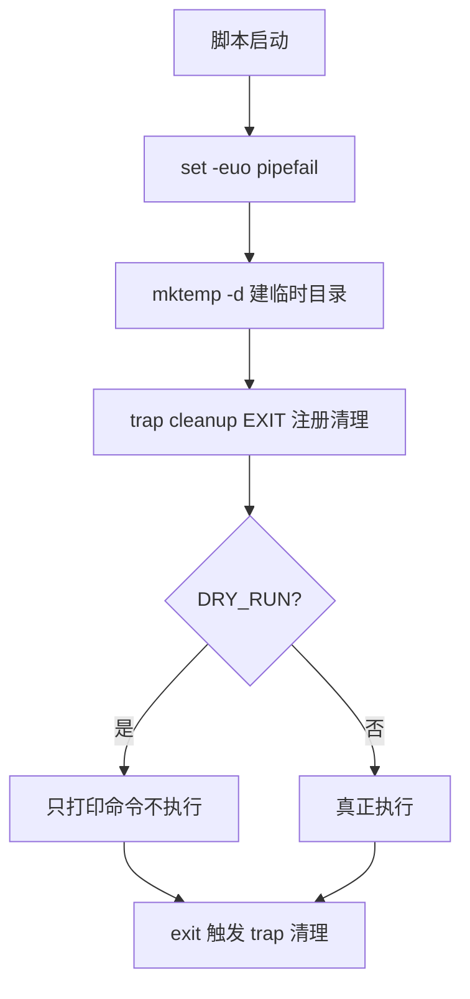

# [[Bash-基础语法]]

> [!tip] 学习目标
> 作为有 Shell 使用经验的开发者，系统掌握 Bash 的核心语法与高级特性，能够编写健壮的自动化脚本，并具备阅读他人脚本的能力。

---

## 🎯 难度分段学习路径

| 难度     | 目标人群             | 核心关注                 | 预估时长 |
| ------ | ---------------- | -------------------- | ---- |
| **入门** | 有命令行经验、初次接触 Bash | 语法基础巩固、常用命令规范、简单脚本编写 | 12h  |
| **进阶** | 需要编写自动化脚本        | 循环与函数、文本处理、错误处理      | 18h  |
| **高级** | 系统运维、项目自动化       | 并发控制、进程管理、调试定位、项目实战  | 25h  |

**总学时**：55h | **适用**：已知 Linux 基础，需精通 Bash 脚本编写

---

## 📖 第一章 入门（Beginner）

### 1.1 Shell 与 Bash 基础

**核心概念填空题（每章 4 道，答案见本节末尾）**

1. Bash 是一种 ______ 类型的命令语言解释器，常用于 Linux 系统自动化。
2. Shell 负责解释用户输入的命令，并与 ______ 内核通信以执行任务。
3. Bash 同时提供 ______（读命令、给提示符）与 ______（按文件顺序批量执行）两种使用方式。
4. 典型的 Shell 还有 ______（zsh）和 ______（sh），但 Bash 是最常用的。

**答案**：
1. 解释型
2. 操作系统
3. 交互式 shell, 非交互式脚本
4. zsh, sh

---

### 1.2 变量

**知识点详解**

| 概念 | 说明 | 示例 |
|---|---|---|
| 变量定义 | 等号两侧不能有空格 | `name="Hello"` |
| 只读变量 | 使用 `readonly` 关键字 | `readonly PI=3.14` |
| 删除变量 | 使用 `unset` 删除 | `unset name` |
| 参数引用 | 脚本启动时的位置参数 | `$1`, `$2`, `$#`, `$*` |

**填空题**

1. 变量名只能由 ______、数字和下划线组成，不能以数字开头。
2. 引用变量时建议使用 ______ 防止单词分割，如 `echo "$name"`。
3. 只读变量后续不能被 ______ 修改，尝试修改会报错。
4. `$#` 表示脚本传入的 ______ 参数个数。

**答案**：
1. 字母
2. 双引号
3. 赋值
4. 第一个

---

### 1.3 基本命令速查

| 命令 | 功能 | 常用选项 |
|---|---|---|
| `ls` | 列出目录内容 | `-l` (详细), `-a` (含隐藏) |
| `cd` | 切换当前目录 | `cd /path`、`cd` (返回家目录) |
| `mkdir` | 创建目录 | `mkdir -p a/b/c` (递归创建) |
| `rm` | 删除文件/目录 | `rm -f` (强制), `rm -r` (递归) |
| `cp` | 复制文件 | `cp -r` (递归复制目录) |
| `mv` | 移动/重命名文件 | `mv old new` |

**填空题**

1. `ls -l` 显示文件的 ______ 信息，包括权限、所有者、大小、修改时间。
2. `mkdir -p` 的 `-p` 表示 ______，如果中间目录不存在则创建。
3. `rm -f` 的 `-f` 表示 ______，即使文件不可写也强制删除。
4. `cd` 无参数时，会跳转到 ______ 目录。

**答案**：
1. 元数据
2. 递归
3. 强制
4. 家目录

---

### 1.4 条件判断

**知识点详解**

| 类型 | 语法 | 说明 |
|---|---|---|
| 数值比较 | `if [ $a -eq $b ]` | `-eq` 表示相等，`-ne` 表示不相等 |
| 字符串比较 | `if [ "$str" = "hello" ]` | `=` 表示相等，`!=` 表示不相等 |
| 文件测试 | `if [ -f "file" ]` | `-f` 表示文件存在，`-d` 表示目录存在 |

**填空题**

1. `if [ $a -eq $b ]` 中 `-eq` 表示 ______ 比较，用于整数。
2. 字符串比较建议变量使用 ______，避免空格导致错误。
3. `-f` 选项用于测试 ______ 是否存在。
4. `-d` 选项用于测试 ______ 是否存在。

**答案**：
1. 数值
2. 双引号
3. 文件
4. 目录

---

### 1.5 循环结构

**知识点详解**

| 循环类型 | 语法结构 | 适用场景 |
|---|---|---|
| `for` 循环 | `for i in 1 2 3; do ... done` | 遍历一个列表/文件集，次数由列表长度决定 |
| `while` 循环 | `while condition; do ... done` | 条件为真时持续执行 |
| `until` 循环 | `until condition; do ... done` | 条件为假时持续执行 |

**填空题**

1. `for i in 1 2 3` 中 `in` 后面跟的是要逐个遍历的 ______（词表）。
2. `while` 循环会在每次迭代前 ______ 条件是否为真。
3. `until` 循环会在每次迭代前 ______ 条件是否为假。
4. 使用 `break` 可以 ______ 当前循环。

**答案**：
1. 一个
2. 测试
3. 测试
4. 退出

---

### 1.6 函数

**知识点详解**

| 概念 | 说明 |
|---|---|
| 定义函数 | `func() { commands; }` |
| 参数传递 | `$1`, `$2`, ... `$n` 表示函数参数 |
| 返回值 | `return N` 表示返回退出码（0-255） |
| 局部变量 | `local var` 仅在函数内有效 |

**填空题**

1. 函数定义时，花括号 `{` 必须与函数名 ______ 紧挨着，中间不能有空格。
2. `$1` 表示函数的 ______ 个参数。
3. `return 0` 表示函数 ______ 成功执行。
4. `local var` 定义的变量仅在 ______ 内有效。

**答案**：
1. 名称
2. 第一个
3. 返回
4. 函数

---

### 1.7 第一章综合练习

**填空题（本章共 4 道，答案见下方）**

1. 变量定义时 `name="Hello"` 等号两侧 ______ 有空格。
2. `for i in 1 2 3; do ... done` 中 `in` 后面跟 ______ 列表。
3. `if [ -f "file" ]` 中 `-f` 用于测试文件是否 ______。
4. `return 0` 表示函数 ______ 执行完毕。

**本章答案**：
1. 不能
2. 一个
3. 存在
4. 成功

**综合项目**：编写 `welcome.sh` 脚本，接受姓名参数，输出带颜色的问候语，并判断参数是否提供。

> [!tip] 常见陷阱
> 1. **变量未引用**：使用 `echo $name` 而不是 `echo "$name"`，可能导致单词分割
> 2. **单引号vs双引号混淆**：单引号不转换变量，双引号会转换；记住：变量用双引号
> 3. **空格导致错误**：命令参数间的空格会被 Shell 解析，始终对含空格的变量使用双引号
> 4. **`set -e` 误用**：在错误处理前使用 `set -e` 可能导致脚本意外退出，谨慎启用

> [!note] 本章权威资料（链接已于 2026-09-25 核验）
> - GNU Bash 手册（在线版）：https://man7.org/linux/man-pages/man1/bash.1.html
> - Bash 常见坑（Greg's Wiki）：https://mywiki.wooledge.org/BashPitfalls
> - Google Shell 风格指南：https://google.github.io/styleguide/shellguide.html
>
> > [!warning] 关于网课
> > 上一版本这里挂的是**编造的 B 站 BV 号**（把同一个假链接同时当成「Bash 入门」「系统编程」「TCP 拥塞」三个不同主题），已全部删除。Bash 官方手册比任何二手视频都准确，优先读手册。

---

## 第二章 进阶（Intermediate）

### 2.1 数组

**知识点详解**

| 概念 | 说明 | 示例 |
|---|---|---|
| 定义数组 | `arr=(a b c)` | 下标从 0 开始 |
| 获取长度 | `${#arr[@]}` | 返回数组元素个数 |
| 遍历数组 | `for i in ${!arr[@]}; do ... done` | 索引遍历 |

**填空题**

1. Bash 数组是 ______ 的，即可以动态添加元素。
2. `${#arr[@]}` 表示 ______ 数组的元素个数。
3. `${arr[0]}` 表示访问数组的 ______ 个元素。
4. 使用 `${!arr[@]}` 可以 ______ 数组的下标。

**答案**：
1. 动态
2. 获取
3. 第一个
4. 遍历

---

### 2.2 位置参数与脚本健壮性

**知识点详解**

| 概念 | 说明 |
|---|---|
| `$*` | 表示所有参数作为一个单词 |
| `$@` | 表示所有参数作为多个单词 |
| `$?` | 上一条命令的退出码 |
| `set -e` | 遇到错误则退出脚本 |
| `set -u` | 遇到未定义变量则退出 |

**填空题**

1. `$*` 和 `$@` 的区别在于 ______ 时是否被视为单词。
2. `$?` 表示上一条命令的 ______ 码。
3. `set -e` 用于 ______ 脚本中的错误。
4. `set -u` 用于 ______ 未定义变量的使用。

**答案**：
1. 空格
2. 退出
3. 检测
4. 检测

---

### 2.3 文本处理：sed 与 awk

**知识点详解**

| 工具 | 适用场景 | 示例 |
|---|---|---|
| `sed` | 流编辑器，适合简单的文本替换 | `sed 's/old/new/g' file` |
| `awk` | 文本处理与报告生成，强大的字符串处理 | `awk '{print $1}' file` |

**填空题**

1. `sed 's/old/new/g'` 中 `g` 表示 ______，全局替换。
2. `awk` 的默认域分隔符是 ______（空格/制表符）。
3. `awk '{print $1}'` 表示打印每一行的 ______ 域。
4. `sed` 适用于 ______ 类型的文本修改。

**答案**：
1. 全局
2. 空格
3. 第一个
4. 简单

---

### 2.4 错误处理与调试

**知识点详解**

| 技巧 | 命令 | 说明 |
|---|---|---|
| `set -x` | 开启调试模式 | 逐行打印执行的命令 |
| `set -e` | 遇错退出 | 仅在「未被测试」的普通命令失败时退出；见 2.7 的例外清单 |
| `2>&1` | 重定向 | 将错误输出重定向到标准输出 |
| `||` | 逻辑或 | 前面失败时执行后面 |

**填空题**

1. `set -x` 开启后，Shell 会 ______ 执行的每一行命令。
2. `2>&1` 表示将标准错误 ______ 到标准输出。
3. `set -e` 会在遇到 ______ 退出脚本。
4. `cmd1 || cmd2` 表示 ______ 时执行 cmd2。

**答案**：
1. 打印
2. 重定向
3. 命令失败
4. cmd1 失败

---

### 2.5 引号与展开（Bash 最核心，也最容易翻车）

**知识点详解**

| 写法 | 是否分词 | 变量/命令替换 | 用法 |
|---|---|---|---|
| `$var` | 🔴 会 | 会 | 仅当确定无空格时才用 |
| `"$var"` | ✅ 不会 | 会 | ==默认写法== |
| `'$var'` | ✅ 不会 | 🔴 不会 | 单引号内一切都是字面量 |
| `$(cmd)` | — | 命令替换 | 比反引号 `` `cmd` `` 更可读、可嵌套 |
| `$((1+2))` | — | 算术展开 | 整数运算 |
| `{a,b,c}` | — | — | 大括号展开，配合 glob |

> [!danger] 最经典的翻车现场
> ```bash
> book="my book.txt"
> rm $book        # ❌ 被拆成 rm my book.txt，报 "No such file"
> rm "$book"      # ✅
> rm -- "$book"   # ✅ 更稳：以 - 开头的文件名需要 --
> ```

**展开顺序（考试/面试常考）**：==括号内 → 参数/命令/算术替换 → 单词分割 → glob 展开==。

```bash
IFS=$'
	'   # Google 风格建议：把 IFS 收窄，避免分词意外
```

**填空题**

1. `"$var"` 与 `$var` 的关键差别是前者不会发生 ______。
2. 单引号内 `$var` 和 `$(cmd)` 都 ______ 生效。
3. `$(cmd)` 相比反引号的优势是支持 ______ 和可读性更好。
4. Google 风格建议把 `IFS` 设为 `$'\n\t'`，目的是 ______。

**答案**：
1. 单词分割（分词）
2. 不会
3. 嵌套
4. 收窄分词字符，避免意外分割

---

### 2.6 重定向与 Here Document

**知识点详解**

| 写法 | 含义 |
|---|---|
| `cmd > file` | 标准输出覆盖写入 |
| `cmd >> file` | 标准输出追加 |
| `cmd 2> file` | 只重定向标准错误 |
| `cmd &> file` | stdout + stderr 一起写入（Bash 4+） |
| `cmd > file 2>&1` | ==先开文件，再把 stderr 指到 stdout==（顺序不能反） |
| `cmd 2>&1 > file` | ❌ stderr 仍指向原 stdout，顺序反了 |
| `cmd < file` | 标准输入来自文件 |
| `cmd <<EOF ... EOF` | Here Document（多行输入） |
| `cmd <<< "string"` | Here String（单行输入） |
| `cmd <<-'EOF'` | Here Document + 缩进用 `-` 去掉行首 Tab |

```bash
# 标准写法：可配置、错误可见
log() { printf '%s [%s] %s\n' "$(date +%F)" "$1" "$2" >&2; }

# Here Document 变量是否展开由定界符是否加引号决定
name="world"
cat <<EOF
你好 $name     # 展开
EOF
cat <<'EOF'
你好 $name     # 不展开（推荐用于含 $ 的模板）
EOF
```

**填空题**

1. `cmd > f 2>&1` 与 `cmd 2>&1 > f` 中，==正确==把两个流都写进文件的是 ______。
2. `>>` 表示 ______ 写入，`&>` 同时重定向 ______ 和 ______。
3. `<<'EOF'`（定界符加引号）的作用是禁止变量 ______。
4. Here String 的简写是 ______。

**答案**：
1. `cmd > f 2>&1`
2. 追加
3. 展开
4. `<<< "string"`

---

### 2.7 测试与分支：`[[ ]]`、`case`

**知识点详解**

| 场景 | 用法 | 说明 |
|---|---|---|
| 单测 | `[ "$a" = "$b" ]` | POSIX 兼容，变量需加引号 |
| 条件测试 | `[[ "$a" == "$b" ]]` | ==Bash 专用==，内部不分割，`=`/`==` 都行 |
| 正则匹配 | `[[ "$s" =~ ^[a-z]+$ ]]` | 右侧不加引号；用 `BASH_REMATCH` 取结果 |
| 数值/字符串 | `-eq -ne -lt -le -gt -ge` / `= != -z -n` | `-z` 空、`-n` 非空 |
| 多分支 | `case "$x" in ... esac` | 比 if-elif 链更清晰，支持 glob |

```bash
case "$1" in
  start)   do_start ;;
  stop)    do_stop ;;
  restart) do_stop; do_start ;;
  -h|--help) usage ;;
  *)       echo "未知参数：$1" >&2; exit 2 ;;
esac

if [[ "$file" =~ ^/etc/.*\.conf$ ]]; then echo "系统配置"; fi
```

> [!tip] 选型经验
> 脚本里统一用 `[[ ]]` + `==`；只有需要兼容 `dash`/POSIX 时才退回 `[ ]`。`case` 取代「参数分发」的长 if 链，可读性天差地别。

**填空题**

1. Bash 专用的条件测试语法是 ______，它在内部不会做单词分割。
2. 判断字符串非空的测试运算符是 `-______`。
3. `[[ "$s" =~ ^a ]]` 用的是 ______（正则/通配符）匹配，且右侧不能加引号。
4. `case` 语句的分支模式支持 ______（glob）匹配。

**答案**：
1. `[[ ]]`
2. n
3. 正则
4. glob

---

### 2.8 严格模式、`trap` 与幂等脚本

**知识点详解**

```bash
#!/usr/bin/env bash
set -euo pipefail     # 严格模式（Bash Strict Mode）
IFS=$'\n\t'
```

| 选项 | 作用 | 注意 |
|---|---|---|
| `-e` / `errexit` | 未被测试的命令失败即退出 | 🔴 ==不是万能错误处理==，见下方例外 |
| `-u` / `nounset` | 使用未定义变量即报错 | 可用 `${var:-}` 显式给默认值 |
| `-o pipefail` | 管道任一环节失败，整条管道失败 | 单独的 `sh`（Ubuntu 是 dash）不支持 |
| `-x` / `xtrace` | 打印执行过的命令 | 排障用，勿留在生产脚本 |

> [!warning] `set -e` 的五个例外（不触发退出）
> ① 处于 `if`/`while`/`until` 条件中的命令；② `cmd && other` 中 `cmd` 失败；③ `cmd || other` 中 `other` 失败；④ 被 `!` 取反的命令；⑤ 管道中非最后一段（除非开了 `pipefail`）。
> 结论：==`set -e` 只兜底，真正的错误处理要靠显式 `if`/`||`/`trap`==。

> [!danger] 语法陷阱：`set -o errexit pipefail` 是错的
> `-o` 后面只能跟**一个**选项名，`pipefail` 会被当成位置参数。正确写法二选一：
> ```bash
> set -euo pipefail        # 短选项法（推荐）
> set -o errexit -o pipefail   # 多次 -o
> ```

**`trap` + `mktemp`：写幂等脚本的标准组合**

```bash
tmpdir="$(mktemp -d)"
cleanup() { rm -rf "$tmpdir"; }
trap cleanup EXIT                 # 无论怎么退出都清理
trap 'echo "中断"; exit 130' INT TERM

# 危险操作前先 dry-run
run() { [[ $DRY_RUN -eq 1 ]] && echo "[dry-run] $*" || "$@"; }
```



**填空题**

1. Bash 严格模式的三个短选项组合写作 `set -______ pipefail`。
2. `-o` 后面一次只能跟 ______ 个选项名。
3. Ubuntu 上 `/bin/sh` 实际指向 ______，因此它不支持 `pipefail`。
4. `trap cleanup EXIT` 的作用是脚本 ==无论正常还是异常退出== 都执行 `cleanup`。

**答案**：
1. `-euo`
2. 一
3. dash
4. 无论正常还是异常退出

---

### 2.9 第二章综合练习

**填空题（本章共 4 道，答案见下方）**

1. `${#arr[@]}` 表示 ______ 数组的元素个数。
2. `$*` 和 `$@` 的区别在于参数被 ______ 还是不被视为单词。
3. `awk '{print $1}'` 中 `$1` 表示 ______ 域。
4. `sed 's/old/new/g'` 中 `g` 表示 ______。

**本章答案**：
1. 获取
2. 被视为单词
3. 第一个
4. 全局

**综合项目**：编写 `log-analyzer.sh` 脚本，接受日志文件路径参数，使用 `awk` 提取其中的 IP 地址和访问次数，并使用 `sed` 进行简单的文本清洗。

> [!tip] 常见陷阱
> 1. **awk 正则转义**：在 awk 中使用正则时，特殊字符如 `.` `*` 需要转义，否则含义改变
> 2. **sed 模式空行**：`sed '/pattern/'` 会删除匹配行，注意是否想保留非匹配行
> 3. **变量交互问题**：在 awk 中引用 Shell 变量，记得双引号扩展：`awk -v var="$var" '{print var}'`
> 4. **输出重定向覆盖**：`>` 会覆盖原文件，如需追加请使用 `>>`

> [!note] 本章权威资料（链接已于 2026-09-25 核验）
> - GNU Bash 手册：https://man7.org/linux/man-pages/man1/bash.1.html
> - Bash 常见坑：https://mywiki.wooledge.org/BashPitfalls
> - Google Shell 风格指南：https://google.github.io/styleguide/shellguide.html
> - shellscript.sh 实战脚本库：https://www.shellscript.sh/
>
> > [!warning] 关于网课
> > 原「Awk 与 Sed 实战」指向的 `BV1ff4y1X7Ng`，经 B站 API 实测是**一首音乐视频**（"NEW超喜欢的配色 衬衫 温柔浪"），与 sed/awk 毫无关系 —— 说明该链接是**凭空生成的**。Coursera 的 `linux-performance` 与 Egghead 的 `the-command-line` 也无法确认对应课程，已一并删除。

---

## 第三章 高级（Advanced）

### 3.1 进程管理

**知识点详解**

| 命令 | 功能 | 示例 |
|---|---|---|
| `ps` | 显示当前进程 | `ps aux` |
| `top` | 实时监控进程 | `top` |
| `kill` | 终止进程 | `kill -9 PID` |
| `nice` | 调整调度优先级，==数值越大优先级越低== | `nice -n 10 command`（降权） |

**填空题**

1. `ps aux` 显示的列中，`PID` 列表示 ______ 标识符。
2. `kill -9` 发送 ______ 信号，强制终止进程。
3. `nice -n 10` 表示把进程优先级 ______（调低/降权），数值越大越晚被调度。
4. `top` 的交互式命令 `k` 用于 ______。

**答案**：
1. 进程 ID
2. SIGKILL
3. 降低
4. 终止

---

### 3.2 网络编程基础

**知识点详解**

| 工具 | 功能 | 示例 |
|---|---|---|
| `curl` | 传输数据的命令行工具 | `curl -O https://example.com` |
| `wget` | 下载文件的命令行工具 | `wget http://example.com/file` |
| `nc` | 网络工具，用于读写网络连接 | `nc -zv example.com 80` |

**填空题**

1. `curl -O` 的 `-O` 表示 ______，保存为原始文件名。
2. `wget` 常用于 ______ 文件。
3. `nc -zv` 中 `-z` 表示 ______，`-v` 表示 ______。
4. 网络编程通常结合 ______ 使用这些工具。

**答案**：
1. 保存为原始文件名
2. 下载
3. `-z`：静默模式，`-v`：详细模式
4. Shell 脚本

---

### 3.3 进程间通信

**知识点详解**

| 机制 | 说明 | 使用场景 |
|---|---|---|
| `pipe` |  `|` 符号，输出重定向 | `cmd1 \| cmd2` |
| `fifo` | 命名管道 | `mkfifo mypipe` |

**填空题**

1. `|` 符号用于 ______，即将前一命令的输出作为后一命令的输入。
2. `mkfifo` 用于创建 ______。
3. 管道正是用来让 ==没有亲缘关系== 的进程通信，因此它可以跨命令、跨脚本。
4. 命名管道的路径由你自己指定，通常放在 ______（如 `/tmp`），并不强制。

**答案**：
1. 输出重定向
2. 命名管道
3. 无亲缘关系的
4. 临时目录

---

### 3.4 调试、静态检查与测试

> [!tip] 这一节的性价比最高
> 写脚本的时间里，调试往往占一半。与其手搓 `echo` 定位，不如把工具用起来。

**知识点详解**

| 手段 | 命令/文件 | 用途 |
|---|---|---|
| 打印执行轨迹 | `bash -x script.sh` 或 `set -x` | 看每条命令展开后的真实样子 |
| 打印函数与变量 | `declare -f` / `set` | 查函数定义与所有变量 |
| 预演不执行 | `bash -n script.sh` | ==只做语法检查，不执行== |
| 静态检查 | `shellcheck script.sh` | 抓未加引号的变量、`$0` 误用等 |
| 单元测试 | `bats` | 给脚本写测试用例 |

```bash
# shellcheck 修完再跑，效率翻倍
shellcheck -S warning deploy.sh && bash -n deploy.sh && ./deploy.sh --dry-run
```

```bash
#!/usr/bin/env bats
@test "greet 输出问候语" {
  run ./greet.sh world
  [ "$status" -eq 0 ]
  [[ "$output" == *"hello world"* ]]
}

@test "缺少参数时退出码为 2" {
  run ./greet.sh
  [ "$status" -eq 2 ]
}
```

**填空题**

1. `bash -n script.sh` 的作用是只做 ______ 检查，不实际执行。
2. `set -x` 会把每条命令 ==展开后== 的真实形式打印出来，便于发现引号问题。
3. 检查脚本里未加引号的变量等问题的工具是 ______。
4. 给 Shell 脚本写单元测试的框架是 ______。

**答案**：
1. 语法
2. 展开后
3. shellcheck
4. bats

---

### 3.5 第三章综合练习

**填空题（本章共 4 道，答案见下方）**

1. `ps aux` 中 `PID` 列表示 ______ 标识符。
2. `kill -9` 发送 ______ 信号。
3. `|` 符号用于 ______ 命令的输出。
4. `mkfifo` 用于创建 ______。

**本章答案**：
1. 进程 ID
2. SIGKILL
3. 输出重定向
4. 命名管道

**综合项目**：编写 `system-check.sh` 脚本，收集系统信息（内存使用、磁盘空间、运行的进程数），将结果输出到 `/tmp/system-report.txt`，并使用 `nc` 检查本机 80 端口是否监听。

> [!tip] 常见陷阱
> 1. **进程快照过时**：`ps` 显示的是快照，进程状态可能在采集瞬间就已经变化，实时监控用 `top` 或 `htop`
> 2. **磁盘使用率误区**：`df -h` 显示的已用空间可能包含预留块，实际可用空间更小
> 3. `nc` 端口探测：`nc -zv` 的 `-z` 标志只检测端口是否开启，不测试服务是否可用
> 4. 系统信息采集频率：过于频繁的采集可能影响系统性能，建议设置合理的采集间隔

> [!note] 本章权威资料（链接已于 2026-09-25 核验）
> - ShellCheck 官方站：https://www.shellcheck.net/ — 静态检查，抓未加引号的变量等低级错误
> - Bats 文档：https://bats-core.readthedocs.io/en/stable/ — 给 Shell 脚本写单元测试
> - shellscript.sh 实战模式：https://www.shellscript.sh/ — 大量可复用的脚本模板
> - Advanced Bash Scripting Guide：https://www.tldp.org/LDP/abs/html/ — 讲解比手册更易读
>
> > [!warning] 关于网课
> > 原「本章视频推荐」里的 `BV1xxfs1xEBlu` 是**编造链接**，已删除。Bash 官方手册比任何二手视频都准确，优先读手册。

---

## 📚 结语与资源

> [!tip] 学习路径建议
> - **有基础**：先完成入门章节巩固语法（约 12h），确保掌握变量、循环、函数
> - **进阶需求**：重点突进进阶章节（约 18h），重点掌握数组、文本处理、错误处理
> - **高级项目**：挑选高级项目（约 25h），针对实际场景定制脚本（如系统审计、自动化部署）

> [!warning] 避坑指南
> - **不要**跳过基础语法直接学习高级特性，务必扎实掌握基础
> - **练习**要多写脚本，多碰壁才能进步，建议每天写 1-2 行新语法
> - **阅读** 开源脚本（如 `tldp` 官方文档），学习他人的写法和技巧

> [!note] 关联笔记
> - `[[Neovim-基本用法]]` - Neovim 基础配置（配套学习）
> - `[[Linux-常用命令]]` - 系统命令速查

> [!faq]- Q：为什么脚本报 `command not found`？
> A：① 检查 `PATH`；② 非交互 shell（cron、systemd）**不加载 `.bashrc`**，用绝对路径或显式 `export PATH`。

> [!faq]- Q：为什么 `for` 循环只执行一次 / 变量被拆成了多个词？
> A：几乎都是 ==单词分割== 作祟。`for f in $files` 会被 `IFS` 拆开，写成 `for f in "${files[@]}"`。

> [!faq]- Q：为什么 `for i in $PATH` 展开后路径不对？
> A：`PATH` 用 `:` 分隔，直接展开不可靠。正解：`IFS=':' read -r -a dirs <<< "$PATH"`。

> [!faq]- Q：如何获取脚本自身的绝对路径？
> A：Bash 4+ 用 `BASH_SOURCE[0]`：`script_dir="$(cd "$(dirname "${BASH_SOURCE[0]}")" && pwd)"`。

---

## 📦 资源链接

| 资源 | 链接 | 说明 |
|---|---|---|
| [[Bash 高级脚本编程]] | https://www.tldp.org/LDP/abs/html/ | 完整在线教程 |
| [[Shell 调试技巧]] | https://wiki.bash-hackers.org/scripting/debugging | 调试技巧 |
| [[Real World Scripting]] | https://www.shellscript.sh/ | 实战指南 |
| [[Google Shell 编程风格指南]] | https://google.github.io/styleguide/shellguide.html | 代码风格 |

---

## ⚡ 速查表

| 场景 | 一行命令 |
|---|---|
| 严格模式 | `set -euo pipefail` |
| 安全引用 | `"$var"`、`"${arr[@]}"` |
| 数组 | `arr=()` / `arr+=(x)` / `${arr[@]}` / `${#arr[@]}` |
| 遍历文件 | `for f in *.txt; do ...; done` |
| 遍历含空格文件名 | `find . -name '*.txt' -print0 \| while IFS= read -r -d '' f; do ...; done` |
| 安全临时目录 | `d=$(mktemp -d)` + `trap 'rm -rf "$d"' EXIT` |
| 调试轨迹 | `bash -x s.sh` / `set -x` |
| 只查语法 | `bash -n s.sh` |
| 静态检查 | `shellcheck s.sh` |
| 写测试 | `bats t.bats` |
| 读文件进数组 | `mapfile -t arr < file` |
| 默认值 | `${var:-default}` |
| 退出码 | `cmd; echo $?` / `cmd || echo failed` |

---

*由 [[Hermes Agent]] 创建于 2026-09-09 · 更新于 2026-09-25 · 状态：进行中*