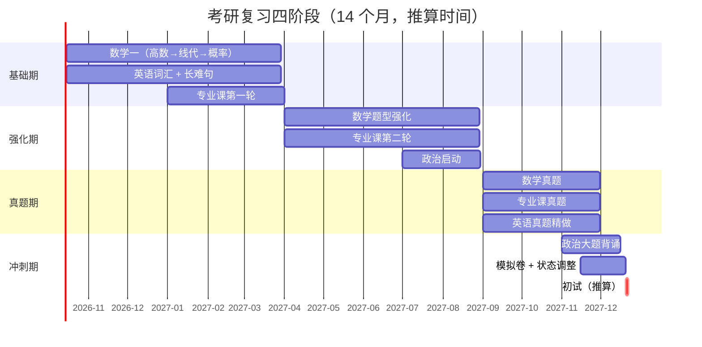

# [[考研备考计划]] 学习笔记

> [!tip] 学习目标
> 读完你能：①按 14 个月的周期排出可执行的复习计划；②知道公共课与专业课的时间如何分配；③区分"官方规定"与"经验建议"，不被机构话术带偏；④设计自己的进度检查机制。

> [!warning] 本篇的性质与其他篇不同
> [[考研总览与择校]]、[[考研报考流程]] 里的数据**几乎全是官方事实**（分数线、报考点规则、报名流程）。
> **本篇不同**：复习方法**没有官方标准**。教育部的文件只规定考什么、什么时候考，从不规定你怎么复习。
>
> 所以本篇严格区分两类内容：
> - **【官方】** —— 考试科目、分值、题型、时间（可核验）
> - **【经验】** —— 复习顺序、时间分配、资料选择（行业共识，**非权威**，且因人而异）
>
> **不要把【经验】当成规则。** 任何说"必须这样复习"的说法都值得怀疑。

> [!info] 你的情况（本篇按此分支）
> - 身份：往届生，时间相对可控（但需自律）
> - 目标：深圳大学
> - 方向：**未定**（计算机 408 / 通信 802 / 电子）→ 见 [[考研方向深度对比]]
> - 起点：2026 年 10 月，距初试（推算 2027 年 12 月）约 **14 个月**

---

## 🎯 难度分段学习路径

| 难度 | 目标 | 核心关注 | 预估时长 |
|---|---|---|---|
| **入门** | 搞清考什么、怎么分配时间 | 官方科目结构、四阶段划分 | 3h |
| **进阶** | 制定可执行的周计划 | 公共课复习方法、专业课路径、进度控制 | 6h |
| **高级** | 设计抗中断的复习系统 | 往届生自律机制、状态管理、应急调整 | 6h |

**总学时**：15h ｜ **前置知识**：[[考研总览与择校]] + [[考研方向深度对比]]（先定方向，再排计划）

---

## 📖 第一章 入门（Beginner）

### 1.1 官方考试结构（可核验的硬事实）

**知识点详解**

**【官方】初试科目与分值**（这是唯一不会因复习方法而变的部分）：

| 科目 | 代码 | 分值 | 时长 | 说明 |
|---|---|---|---|---|
| 思想政治理论 | 101 | 100 | 180 分钟 | 全国统考 |
| 英语（一） | 201 | 100 | 180 分钟 | 全国统考 |
| 数学（一） | 301 | 150 | 180 分钟 | 全国统考 |
| 专业课 | 408 或 802 等 | 150 | 180 分钟 | 408 统考 / 802 深大自命题 |
| **合计** | | **500** | | 初试总分 |

**【官方】408 的结构**（深大计算机技术用）：

| 科目 | 分值 | 占比 | 题型 |
|---|---|---|---|
| 数据结构 | 45 | 30% | 单选 + 综合应用 |
| 计算机组成原理 | 45 | 30% | 单选 + 综合应用 |
| 操作系统 | 35 | 23.3% | 单选 + 综合应用 |
| 计算机网络 | 25 | 16.7% | 单选 + 综合应用 |
| **合计** | **150** | | 单选 40 题（80 分）+ 综合应用 7 题（70 分） |

> [!info] 一个容易忽略的算分逻辑
> 初试 500 分里，**数学 + 专业课 = 300 分，占 60%**。政治和英语各 100 分。
>
> **含义**：数学和专业课是**拉开差距的科目**，英语和政治是**保底的科目**。复习时间的分配应该反映这个结构，而不是平均用力。
>
> **但注意**：这不意味着可以放弃英语和政治。它们是**单科线**科目 —— 任一科不过线，总分再高也没用。

> [!warning] 关于"专业课满分"的一个坑
> 少数专业课满分不是 150（如部分管理类联考、部分 3 小时以上科目）。你考的 408 和 802 都是 **150 分 / 180 分钟**，属常规结构。

**填空题**（每节 4 道，答案见章末）

1. 初试总分 500 分中，数学和专业课合计占 ______ 分。
2. 408 中分值最高的两门课是 ______ 和 ______，各占 45 分。
3. 408 的题型为单项选择题 ______ 题和综合应用题 7 题。
4. 政治和英语的满分各为 ______ 分，是 ______ 科目（一旦不过线则总分无效）。

**答案**：
1. 300
2. 数据结构 / 计算机组成原理
3. 40
4. 100 / 单科线

---

### 1.2 四阶段划分（【经验】通用框架）

**知识点详解**

> [!warning] 以下为经验框架，非官方
> 四阶段划分是考研圈的通行做法，**没有官方依据**。它的价值在于提供一个进度参照，不是必须遵守的时间表。

| 阶段 | 时间（按 14 个月推算） | 目标 | 检验标准 |
|---|---|---|---|
| **① 基础期** | 2026-10 ~ 2027-03（6 个月） | 数学过一遍、英语词汇 + 长难句、专业课第一轮 | 能说出每章的核心概念 |
| **② 强化期** | 2027-04 ~ 2027-08（5 个月） | 数学题型强化、专业课第二轮、政治启动 | 能做中等难度题 |
| **③ 真题期** | 2027-09 ~ 2027-11（3 个月） | 真题成套训练、查漏补缺 | 真题分数稳定 |
| **④ 冲刺期** | 2027-11 ~ 2027-12（1.5 个月） | 模拟、政治大题背诵、状态调整 | 模拟卷达标 |

> [!tip] 这个框架最重要的一个特征
> **数学和英语从第一天开始，横跨全程（约 14 个月）。**
>
> 原因：
> - **数学**需要大量练习形成肌肉记忆，突击无效
> - **英语**词汇和语感需要长期积累，短期提分有限
> - 而**政治和专业课**可以后置（政治甚至有人 9 月才开始）
>
> **结论**：如果你现在（2026 年 10 月）只能开始一件事，那就开始**数学**。

**填空题**

1. 四阶段划分是 ______（官方规定 / 经验框架）。
2. 基础期的主要任务是数学过一遍、英语积累和 ______。
3. 强化期通常从 ______ 月开始，政治一般在 ______ 月启动。
4. 横跨全程的两门科目是 ______ 和 ______。

**答案**：
1. 经验框架
2. 专业课第一轮
3. 4 / 7
4. 数学 / 英语

---

### 1.3 往届生的时间账（真实可用小时数）

**知识点详解**

往届生的优势和劣势都很明显。**先算清账，再排计划**：

| 项目 | 应届生 | 往届生（全职备考） |
|---|---|---|
| 可用时间 | 上课 + 实习挤占 | **相对完整** |
| 自律来源 | 同学、图书馆氛围 | **靠自己**（最大劣势） |
| 信息渠道 | 同学互通 | **需自己搜集**（第二大劣势） |
| 经济压力 | 较小 | **可能有**（影响心态） |
| 身份焦虑 | 低 | **高**（"别人都工作了"） |

**【经验】可用小时数估算**

| 情形 | 每日有效学习 | 14 个月累计 |
|---|---|---|
| 全职备考、状态好 | 6–8h | 约 2500–3300h |
| 全职备考、状态一般 | 4–5h | 约 1700–2100h |
| 边工作边备考 | 2–3h | 约 850–1250h |

> [!warning] "有效学习"不等于"坐在桌前"
> 刷手机、发呆、反复整理笔记都不算。**判断标准**：这段时间结束时，你能说出自己学会了什么具体的东西。
>
> 很多人自报"每天学 10 小时"，实际有效时间不到 4 小时。**建议第一周先做诚实记录**（见 3.1 的时间审计方法），拿到真实基线再排计划。

> [!danger] 往届生最大的风险不是时间不够，是中途放弃
> 你有 14 个月，时间**充足**。真正的风险是：
> - 前 3 个月热情高涨，每天 8 小时
> - 第 4–6 个月开始松懈，降到 3 小时
> - 第 7–9 个月因为"落后太多"而焦虑
> - 第 10 个月放弃
>
> **对策**：计划要**可持续**，不要设计一个"理想状态下的完美计划"。每周留出 1 天机动时间，允许自己掉队再追上。

**填空题**

1. 往届生相对应届生的最大劣势是 ______ 和 ______。
2. 全职备考状态好时，14 个月累计有效学习约 ______ 小时。
3. "有效学习"的判断标准是 ______。
4. 往届生最大的风险是 ______，因此计划必须 ______。

**答案**：
1. 缺乏自律环境 / 信息渠道少
2. 2500–3300
3. 这段时间结束时能说出学会了什么具体内容
4. 中途放弃 / 可持续（每周留机动时间）

---

### 1.4 第一章综合练习

**填空题**

1. 初试 500 分中，政治、英语、数学、专业课的分值分别是 ______、______、______、______。
2. 四阶段中时间最长的是 ______ 期，约 ______ 个月。
3. 如果你现在只能开始一件事，应该开始 ______。
4. 往届生设计计划的核心原则是 ______。

**答案**：
1. 100 / 100 / 150 / 150
2. 基础 / 6
3. 数学
4. 可持续（而非理想化）

**综合项目**：算出你的真实时间预算

- **输入**：你每天实际可支配的时间
- **步骤**：
  1. 列出一天的固定占用（睡眠、吃饭、通勤、家务）
  2. 算出差额 = 24h − 固定占用
  3. 从差额中扣除"必然浪费"（休息、社交、意外），保守估计取 60%
  4. 得到"每日可学习时间"的诚实估计
  5. 乘以 30 天 × 14 个月，得到总预算
- **产出物**：一句话结论 —— "我每天能学 ___ 小时，14 个月共 ___ 小时"
- **验收标准**：这个数字让你**不焦虑也不自满**。如果它让你觉得"太少了"，说明你在自欺；如果觉得"太多了"，说明你在低估自己

**常见陷阱**

| 陷阱 | 后果 | 正确做法 |
|---|---|---|
| 高估可用时间 | 计划必然失败，然后自责 | 按 60% 保守估算 |
| 把"坐在桌前"当"学习" | 进度假象 | 用"能说出学到什么"检验 |
| 设计理想化计划 | 第 3 个月就崩盘 | 每周留 1 天机动 |
| 平均分配四科时间 | 数学专业课优势无法发挥 | 按分值权重倾斜（但保底单科线） |
| 政治过早开始 | 占用数学专业课时间 | 政治 7 月后再启动 |
| 相信"必须每天 12 小时" | 不可持续 | 6–8h 有效学习已很好 |

---

## 📖 第二章 进阶（Intermediate）

### 2.1 数学一：分值最大、最需要长期投入

**知识点详解**

**【官方】数学一的构成**：

| 模块 | 占比 | 分值（150 分制） |
|---|---|---|
| 高等数学 | 56% | 约 84 分 |
| 线性代数 | 22% | 约 33 分 |
| 概率论与数理统计 | 22% | 约 33 分 |

> [!warning] 数学一 vs 数学二的关键差异
> **数学二不考概率论**，且高等数学占比更高（78%）。
>
> 深大三个候选方向（085404 计算机 / 085402 通信 / 085403 集成电路）**全部要求数学一**。
> 所以如果你考虑过"专硕是不是考数二"，答案是**不是** —— 至少深大这三个方向都考数一。

**【经验】数学复习的顺序与要点**

| 阶段 | 内容 | 关键做法 |
|---|---|---|
| 基础期 | 高数 → 线代 → 概率 | 每章先理解定义，再做基础题；**不要只看视频不动笔** |
| 强化期 | 按题型分类训练 | 建立"题型 → 方法"的条件反射 |
| 真题期 | 成套做历年真题 | 严格计时，模拟考场 |
| 冲刺期 | 错题回顾 + 模拟 | 重点看错题，不碰新难题 |

> [!danger] 数学复习最容易犯的三个错
> **1. 只看视频不做题** —— 看懂了 ≠ 会做。视频是被动输入，做题才是主动输出。**建议看视频时间 ≤ 做题时间的 1/3**。
>
> **2. 追求进度不追求掌握** —— "我过完三遍了"但每遍都只是翻了一遍。**判断标准是能否独立做出题目**，不是过了几遍。
>
> **3. 不整理错题** —— 错题是最有价值的复习材料。建议用错题本记录：题目、错因、正确思路。**错因比答案重要**（是概念不清？计算失误？还是思路方向错？）。

> [!tip] 关于复习资料
> 数学复习资料市场高度成熟，主流选择包括各类"复习全书""辅导讲义""习题集"。**选择原则**：
> - 一套跟到底，不要中途换
> - 基础用一套，强化可以用另一套补充
> - **不要同时用三本习题集**（会做不完，制造焦虑）
>
> 本篇**不推荐具体书目** —— 资料优劣因人而异，且版本每年更新。请自行选择并坚持。

**填空题**

1. 数学一中高等数学占 ______%，线性代数占 ______%，概率占 ______%。
2. 深大 085404 / 085402 / 085403 三个方向要求的数学科目是 ______。
3. 看视频时间建议不超过做题时间的 ______。
4. 错题本中比答案更重要的是 ______。

**答案**：
1. 56 / 22 / 22
2. 数学一
3. 1/3
4. 错因（概念不清 / 计算失误 / 思路错误）

---

### 2.2 英语一：长期积累、短期难提分

**知识点详解**

**【官方】英语一的题型结构**（常见分值分布）：

| 题型 | 题量 | 分值 | 建议用时 |
|---|---|---|---|
| 完形填空 | 20 题 | 10 | 15–20 分钟 |
| 阅读理解 | 4 篇 20 题 | 40 | 60–70 分钟 |
| 新题型 | 5 题 | 10 | 15–20 分钟 |
| 翻译 | 5 句 | 10 | 20 分钟 |
| 写作 | 2 篇 | 30 | 50 分钟 |
| **合计** | | **100** | 180 分钟 |

> [!info] 阅读理解的权重
> 阅读理解 40 分，**占总分的 40%**，且是拉开差距的部分。**英语复习的重心在阅读**。
>
> 而阅读的难点是**长难句**和**词汇**。所以词汇和长难句是英语的"基础设施"。

**【经验】英语复习的三个支柱**

| 支柱 | 做法 | 时间投入 |
|---|---|---|
| **词汇** | 每天固定背，反复滚动。优先高频词 | 每天 30–60 分钟，贯穿全程 |
| **长难句** | 精读真题文章，逐句分析结构 | 基础期重点，每周 2–3 篇 |
| **真题** | 近 10–15 年真题精做，不贪多 | 真题期成套训练，严格计时 |

> [!danger] 英语复习的两个常见错误
> **1. 只背单词不做阅读** —— 单词书背了 5 遍，阅读还是读不懂。**原因**：脱离语境记的词，遇到长难句还是无法理解。**做法**：单词 + 阅读同步，在真题中反复遇到才记得住。
>
> **2. 把真题留到最后模拟** —— 真题是**学习材料**，不是测试卷。近 10–15 年真题应该**精做、反复做**，而不是留到最后当模拟卷。**模拟卷用市面上的模拟题**。

> [!warning] 英语一 vs 英语二
> 深大三个候选方向**全部要求英语一**。英语一比英语二难（更学术、更灵活）。
> 不要因为"专硕考英二"的旧认知而低估英语复习量。

**填空题**

1. 英语一中阅读理解占 ______ 分，是分值最高的题型。
2. 英语复习的三个支柱是 ______、______、______。
3. 真题的正确用法是当作 ______ 而非测试卷。
4. 深大三个候选方向要求的外语科目是 ______。

**答案**：
1. 40
2. 词汇 / 长难句 / 真题
3. 学习材料
4. 英语一

---

### 2.3 专业课：两条分支路径

**知识点详解**

专业课**取决于你的方向选择**（见 [[考研方向深度对比]]）。两条路径的复习逻辑完全不同：

**分支 A：408 计算机学科专业基础综合（统考）**

**【经验】复习顺序**（行业共识，非官方）

| 顺序 | 科目 | 理由 |
|---|---|---|
| 1 | **数据结构** | 基础中的基础，其他三门都涉及 |
| 2 | 计算机组成原理 | 需要数据结构的基础（如寻址计算） |
| 3 | 操作系统 | 与组原有交叉（内存管理、中断） |
| 4 | 计算机网络 | 相对独立，可放最后 |

> [!info] 408 复习的优势：路径成熟
> 408 是全国统考，**十几年完整真题公开**，市面上有成体系的复习资料。这意味着：
> - 你能看到命题规律和难度分布
> - 有大量公开的解析和讨论
> - 复习路径清晰（多数人采用"教材 + 辅导书 + 真题"三段式）
>
> **这是 408 最大的隐性优势** —— 信息透明。

**分支 B：802 电子信息与通信系统综合（深大自命题）**

| 项目 | 内容 |
|---|---|
| 科目构成 | **信号与系统 + 通信原理**（两门） |
| 命题方 | 深圳大学（自命题） |
| 大纲 | 深大**只提供考试大纲，不提供参考书目** |
| 真题 | 数量较少，且科目代码多次变更（902 → 802） |

> [!danger] 802 复习的最大风险：资料陷阱
> 深大这门课的代码与内容演进：
> - **2022 年及以前**：902「电子系统综合」，考**数字电路**类内容
> - **2023–2024 年**：902「电子信息与通信系统综合」，改考信号与系统 + 通信原理
> - **2025 年起**：改为 **802**，内容与 902 一致
>
> **后果**：网上搜到的"深大 902 资料"可能是**旧版数字电路内容**，与现在的考试范围完全不符。
> **收集资料时必须核对年份和内容**，不能只看科目代码。

> [!warning] 802 需要额外做的一件事
> 由于是自命题、真题少、资料不透明，**必须**：
> 1. 找到深大官方发布的 **802 考试大纲**（在深大专业目录系统的"考试大纲"入口）
> 2. 找到**近年真题**（年份要与当前内容一致）
> 3. 找到**已上岸学长**的经验（了解实际难度和范围）
>
> 这三件事做不成，802 就是**盲选**。这也是为什么 [[考研方向深度对比]] 里我把"802 专业课均分"列为待核验的关键数据。

**填空题**

1. 408 的推荐复习顺序是数据结构 → ______ → ______ → 计算机网络。
2. 408 的最大隐性优势是 ______。
3. 深大 802 包含的两门课是 ______ 和 ______。
4. 深大对初试专业课只提供 ______，不提供 ______。

**答案**：
1. 计算机组成原理 / 操作系统
2. 信息透明（真题公开、资料成体系）
3. 信号与系统 / 通信原理
4. 考试大纲 / 参考书目

---

### 2.4 第二章综合练习

**填空题**

1. 数学一中分值最高的模块是 ______，占 56%。
2. 英语中占比最高的题型是 ______，占 40 分。
3. 408 复习的推荐起点科目是 ______，因为它是其他三门的基础。
4. 收集 802 资料时必须核对 ______，因为科目代码变过。

**答案**：
1. 高等数学
2. 阅读理解
3. 数据结构
4. 年份与考试内容

**综合项目**：制作周计划模板

- **输入**：本篇 2.1–2.3 的各科方法 + 你在第一章算出的时间预算
- **步骤**：
  1. 把每日时间切成 3–4 个区块（如上午 3h / 下午 3h / 晚上 2h）
  2. 为每个区块指定固定科目（如上午数学、下午专业课、晚上英语）
  3. 设定每周的"最低完成量"（如数学完成 1 章 + 30 题），而不是"每天必须学 8 小时"
  4. 留出每周 1 天机动
  5. 设计一个每周日晚的"对账"动作（完成度 / 未完成原因 / 下周调整）
- **产出物**：一张可打印的周计划表
- **验收标准**：这张表在你状态最差的那天也能完成 60% —— 如果做不到，说明设计得太满

**常见陷阱**

| 陷阱 | 后果 | 正确做法 |
|---|---|---|
| 只看视频不做题 | 假性掌握 | 看视频 ≤ 做题时间的 1/3 |
| 同时用多本习题集 | 做不完、焦虑 | 一套跟到底 |
| 把英语真题留到最后模拟 | 浪费最好的学习材料 | 真题当学习材料，反复精做 |
| 只背单词不做阅读 | 单词与语境脱节 | 单词 + 阅读同步 |
| 用旧版 902 资料复习 802 | 范围完全错误 | 核对年份与内容 |
| 政治过早启动 | 挤占数学专业课 | 7 月后再开始 |
| 用"过了几遍"衡量进度 | 进度假象 | 用"能否独立做题"衡量 |

---

## 📖 第三章 高级（Advanced）

### 3.1 时间审计：先量出真实基线

**知识点详解**

> [!warning] 这一节是整篇最重要的一节
> 所有复习计划失败的根本原因只有一个：**计划基于想象的时间，而非真实的时间**。
>
> 解决办法：**先测一周，再定计划。**

**【经验】时间审计方法**

| 步骤 | 做法 |
|---|---|
| 1 | 连续 7 天，每 30 分钟记录一次"刚才在做什么" |
| 2 | 把活动分成三类：**有效学习** / **伪学习**（整理笔记、找资料、看经验帖）/ **非学习** |
| 3 | 算出每天的"有效学习"真实时长 |
| 4 | 取 7 天的**中位数**（不是平均值 —— 避免被最好的一天拉高） |

> [!danger] "伪学习"是最大的时间黑洞
> 以下活动**感觉像学习但不是**：
> - 反复整理笔记、调格式、换配色
> - 花 2 小时找"最好的复习资料"
> - 看"考研经验分享"视频
> - 在群里讨论"今年会不会变难"
> - 制定/修改计划本身
>
> **判断标准**：这个活动**直接产生解题能力**吗？不产生就是伪学习。
>
> **建议**：给"伪学习"设一个每周配额（如每周 2 小时），超了就停。

**填空题**

1. 时间审计应连续记录 ______ 天，每 ______ 分钟记录一次。
2. 计算真实学习时长时应取 7 天的 ______，而非平均值。
3. "伪学习"的判断标准是 ______。
4. 建议给"伪学习"设置每周 ______。

**答案**：
1. 7 / 30
2. 中位数
3. 该活动是否直接产生解题能力
4. 配额（如 2 小时）

---

### 3.2 往届生的自律系统设计

**知识点详解**

应届生靠环境（图书馆、同学），往届生**必须自己造环境**。以下是【经验】做法：

| 维度 | 问题 | 对策 |
|---|---|---|
| **场所** | 在家学习容易躺平 | 固定一个"只用于学习"的场所（图书馆/自习室/咖啡馆固定座位） |
| **时间** | 作息混乱 | 固定起床时间（比固定学习时长更有效） |
| **社交** | 被问"你在干嘛" | 准备一个简短回答，避免反复解释消耗心力 |
| **进度** | 无人对照 | 加入备考群或找研友（只交换进度，不讨论难度） |
| **反馈** | 长期无正反馈 | 设置**周度小目标**（可完成、可验证），而不是只盯 14 个月后的大目标 |
| **中断** | 一次掉队就放弃 | 预设"掉队恢复机制"（见下） |

> [!success] 掉队恢复机制（最关键的一条）
> **规则**：允许自己掉队，但**必须在 3 天内恢复**。
>
> **具体做法**：
> 1. 提前写好"最小维持量"—— 状态最差时也要完成的最低任务（如"数学 10 题 + 单词 30 个"，约 1 小时）
> 2. 掉队时执行"最小维持量"，**不要试图补回全部**
> 3. 3 天内回到正常节奏
>
> **为什么不要补**：试图补回落后进度的结果是再次失败，然后彻底放弃。**接受损失，向前看**，比追求完美进度更可持续。

> [!warning] 关于心态：往届生的特有压力
> 你可能遇到的：
> - "同学都工作了，我还在考试" —— **身份焦虑**
> - "万一考不上，这一年就白费了" —— **沉没成本焦虑**
> - "家里人的期待" —— **外部压力**
>
> **三条应对**：
> 1. **写下你的理由**（在 [[考研方向深度对比]] 的决策备忘里），报名期和低谷期拿出来读
> 2. **给失败设定预案** —— 想清楚"如果没考上，我做什么"。有了退路，焦虑会下降
> 3. **把"这一年"重新定义** —— 即使没考上，你获得的数学/英语/专业能力是真实的，不是白费

**填空题**

1. 往届生自律系统的核心是 ______（应届生靠环境）。
2. 设置反馈时应采用 ______ 目标，而非只盯大目标。
3. 掉队恢复机制的规则是允许掉队但必须在 ______ 天内恢复。
4. 掉队时执行 ______，不要试图补回全部。

**答案**：
1. 自己造环境（固定场所 / 固定起床时间）
2. 周度小目标
3. 3
4. 最小维持量

---

### 3.3 进度检查与动态调整

**知识点详解**

计划必须能调整，否则会在第一次偏离时失效。

**【经验】三级检查机制**

| 频率 | 检查内容 | 调整动作 |
|---|---|---|
| **每周** | 完成度 vs 计划 | 微调下周任务量 |
| **每月** | 阶段目标是否达成 | 调整阶段划分或方法 |
| **每 3 个月** | 整体方向是否正确 | 可能需要换方向/换资料 |

> [!danger] 一个必须做的检查：专业课方向复核
> **2027 年 9 月**（深大发布新招生目录时）你必须做一次**方向复核**：
> - 核对 085404 / 085402 / 085403 的初试科目是否变化
> - 核对拟招生人数与推免比例
> - 如果专业课变更（如自命题改统考），**立即调整复习计划**
>
> **为什么重要**：深大 2026 年就发布过《关于调整 2027 年硕士研究生招生考试部分专业及初试自命题科目的公告》。虽然经核对不涉及你的三个候选方向，但**每年都可能变**。
>
> **这是"计划必须能调整"的最实际理由** —— 你的专业课可能在复习到第 12 个月时被迫更换。

> [!info] 关于"要不要换方向"
> 如果 2027 年 9 月发现专业课变更，你有两个选择：
> 1. **继续**（如果有 3 个月能补上新科目）
> 2. **换到科目未变的专业**（同校不同专业代码，或同专业不同学院）
>
> **这正是数学/英语通用的价值** —— 无论怎么换，公共课投入不浪费。

**填空题**

1. 三级检查机制的频率是 ______、______、______。
2. 每周检查后应做 ______ 调整。
3. 2027 年 9 月必须做的一次检查是 ______。
4. 换方向时"不浪费"的投入是 ______。

**答案**：
1. 每周 / 每月 / 每 3 个月
2. 微调下周任务量
3. 专业课方向复核（核对新招生目录）
4. 数学和英语的复习

---

### 3.4 第三章综合练习

**填空题**

1. 时间审计取中位数而非平均值，是为了避免被 ______ 拉高。
2. 伪学习包括反复整理笔记、找资料和 ______。
3. 掉队恢复机制要求状态最差时完成 ______。
4. 2027 年 9 月要做方向复核，因为深大每年可能调整 ______。

**答案**：
1. 最好的一天
2. 看经验帖 / 讨论难度（任一即可）
3. 最小维持量
4. 招生专业及初试科目

**综合项目**：写一份「个人备考系统」

- **输入**：前三节的方法 + 你的时间预算
- **步骤**：
  1. 完成 7 天时间审计，算出真实基线
  2. 按 1.2 的四阶段框架，结合你的方向（待定），排出 14 个月的阶段目标
  3. 设计周计划模板（含机动日）
  4. 写下"最小维持量"和"掉队恢复规则"
  5. 写下"如果没考上，我做什么"的预案
  6. 设定 2027 年 9 月的方向复核提醒
- **产出物**：一份不超过 800 字的个人备考系统文档
- **验收标准**：包含 5 个要素 —— 时间基线、阶段目标、周模板、掉队规则、失败预案。缺任何一个都不算完成

**常见陷阱**

| 陷阱 | 后果 | 正确做法 |
|---|---|---|
| 不做时间审计直接排计划 | 计划必然失败 | 先测 7 天 |
| 用平均值算学习时长 | 被最好的一天拉高 | 用中位数 |
| 掉队后试图补回全部 | 再次失败 → 放弃 | 执行最小维持量，3 天内恢复 |
| 不设失败预案 | 焦虑放大 | 提前想好"没考上做什么" |
| 不设方向复核提醒 | 科目变更后措手不及 | 2027 年 9 月复核 |
| 无检查机制 | 偏离后计划失效 | 周/月/季三级检查 |

---

## ⚡ 速查表

**【官方】硬事实**

| 项目 | 数据 |
|---|---|
| 初试总分 | 500（政治 100 + 英语 100 + 数学 150 + 专业课 150） |
| 各科时长 | 均为 180 分钟 |
| 408 分值 | 数据结构 45 / 组原 45 / OS 35 / 网络 25 |
| 408 题型 | 单选 40 题（80 分）+ 综合应用 7 题（70 分） |
| 数学一构成 | 高数 56% / 线代 22% / 概率 22% |
| 英语一阅读 | 4 篇 20 题，40 分 |
| 深大 802 构成 | 信号与系统 + 通信原理 |
| 深大专业课资料 | 只提供考试大纲，不提供参考书目 |

**【经验】时间与顺序（非权威）**

| 项目 | 建议 |
|---|---|
| 四阶段 | 基础 6 个月 / 强化 5 个月 / 真题 3 个月 / 冲刺 1.5 个月 |
| 最先开始 | 数学 + 英语（横跨全程） |
| 政治启动 | 强化期（约 7 月） |
| 408 顺序 | 数据结构 → 组原 → OS → 网络 |
| 有效学习时长 | 全职 6–8h / 边工作 2–3h |
| 看视频 : 做题 | ≤ 1 : 3 |
| 掉队恢复 | 3 天内，用最小维持量 |
| 检查频率 | 周 / 月 / 3 个月 |

---

## ❓ 常见问题

> [!faq]- 现在（2026 年 10 月）开始，来得及吗？
> **来得及，而且时间充裕。** 你的初试在推算的 2027 年 12 月，还有约 14 个月。但要注意：**时间充裕的最大风险是拖延**。建议现在就开始数学和英语 —— 这两门三个方向都要考，投入不会浪费。

> [!faq]- 我应该先定方向还是先开始复习？
> **先开始数学和英语，边复习边定方向。** 理由：①这两门是公共课，与方向无关；②你有 2–3 个月的决策窗口；③方向的核心判断依据（信号与系统自测）现在就能做。

> [!faq]- 政治什么时候开始？
> **【经验】通常 7 月后**（强化期）。政治的特点是**短期可提分、长期会遗忘**，过早开始会占用数学专业课的黄金时间。但不要晚于 9 月，否则背诵压力过大。

> [!faq]- 数学只看视频不做题行吗？
> **绝对不行。** 看视频是被动输入，做题是主动输出。看懂了 ≠ 会做。建议看视频时间不超过做题时间的 1/3。这是数学复习最常见也最致命的错误。

> [!faq]- 英语真题要留到最后模拟吗？
> **不要。** 真题是**最好的学习材料**，不是测试卷。近 10–15 年真题应该精做、反复做，在真题中记单词、分析长难句。模拟卷用市面上的模拟题。

> [!faq]- 408 和 802 哪个复习量更大？
> **不能简单比较。** 408 是 4 门但信息透明（真题公开、资料成体系）；802 是 2 门但信息不透明（自命题、真题少、科目代码变过）。**再算上复试**：408 方向复试 1 门综合考核，802 方向复试笔试 5 门课。详见 [[考研方向深度对比]]。

> [!faq]- 我是往届生，自律很差怎么办？
> **不要靠意志力，要造环境。** 三个最有效的动作：①固定一个"只用于学习"的场所；②固定起床时间（比固定学习时长更有效）；③设计"最小维持量"，状态最差时也能完成。详见 3.2。

> [!faq]- 如果复习进度落后很多，要不要放弃？
> **先分清"落后"和"崩盘"。** 落后 1–2 周很正常，用"3 天恢复机制"追上。真正的崩盘信号是：连续 2 周以上完全没学。这时需要的不是加倍努力，而是**重新评估计划是否过满**，然后砍掉不必要的内容。

> [!faq]- 这篇笔记里的时间是推算的，能用来排计划吗？
> **可以用来划分阶段，不能用来定具体日期。** 28 考研的官方时间要到 2027 年 9 月才发布。阶段划分（基础/强化/真题/冲刺）是相对时间，不受影响；但"10 月 15 日开始"这类具体日期必须等官方公告。详见 [[考研总览与择校]] 的双表设计。

---

## 🪤 踩坑记录

| 坑 | 后果 | 规避方法 |
|---|---|---|
| 不做时间审计就排计划 | 计划必然失败 | 先测 7 天真实基线 |
| 高估可用时间 | 长期自责 | 按 60% 保守估算 |
| 只看视频不做题 | 假性掌握，考场写不出 | 看视频 ≤ 做题的 1/3 |
| 同时用多本习题集 | 做不完、焦虑 | 一套跟到底 |
| 把英语真题留到最后 | 浪费最好的学习材料 | 真题当学习材料反复精做 |
| 用旧版 902 资料复习 802 | 范围完全错误 | 核对年份与内容 |
| 政治过早启动 | 挤占数学专业课 | 7 月后再开始 |
| 掉队后试图补回全部 | 再次失败 → 放弃 | 最小维持量，3 天恢复 |
| 不设失败预案 | 焦虑放大 | 提前想好退路 |
| 不设方向复核 | 科目变更后措手不及 | 2027 年 9 月复核 |
| 无检查机制 | 偏离后计划失效 | 周/月/季三级检查 |
| 靠意志力对抗环境 | 不可持续 | 造环境而非拼意志 |

---

## 📌 待办与信息缺口

> [!todo] 你必须完成的事（按优先级）
> - [ ] **做信号与系统 5 题自测**（决定 802 是否可行）→ 见 [[考研方向深度对比]] 3.1
> - [ ] **做 7 天时间审计**（拿到真实时间基线）
> - [ ] **确定方向**（计算机 408 / 通信 802 / 电子）
> - [ ] **开始数学**（不等方向确定）
> - [ ] **开始英语词汇**（不等方向确定）
> - [ ] 找到深大 **802 官方考试大纲**（如选通信）
> - [ ] 找到 **802 专业课均分数据**（判断是否压分）
> - [ ] 找 **1–2 位已上岸学长**了解实情
> - [ ] 设定 **2027 年 9 月**的方向复核提醒

> [!todo] 本篇未核验的信息（诚实声明）
> - [ ] **28 考研初试具体日期**（2027 年 9 月发布）
> - [ ] **408 的官方考试大纲**（教育部每年可能微调）
> - [ ] **深大 802 的考试大纲与题型**（未能抓到官方全文）
> - [ ] **深大 085403 集成电路工程的专业课科目代码**（未逐一核验）
> - [ ] 各类复习资料的具体书目与版本（**刻意不推荐** —— 因人而异且版本更新快）

> [!warning] 关于本篇"经验"内容的诚实说明
> 本篇的复习顺序、时间分配、阶段划分**均无官方依据**，来源是行业通行做法与公开讨论。
> **它们不是规则，只是起点。** 你的实际进度、基础、时间都会让最优方案不同。
> **判断任何复习建议的标准**：它是否直接提高你的解题能力？不能的话，无论谁说都不要照做。

> [!question] 待你回答
> - [ ] 信号与系统自测结果？
> - [ ] 每日可支配时间？
> - [ ] 数学基础如何（高数/线代/概率各占多少把握）？
> - [ ] 英语当前水平（能否读懂考研阅读）？

> [!success] 我的备考系统（待填写）
> - **时间基线**：每日 ______ 小时有效学习
> - **方向**：______
> - **最小维持量**：______
> - **失败预案**：______
> - **方向复核日期**：2027 年 9 月

---

## 📦 资源链接

| 资源 | 链接 | 说明 |
|---|---|---|
| **中国研究生招生信息网** | [yz.chsi.com.cn](https://yz.chsi.com.cn) | 官方考试大纲、政策、报名入口 |
| **研招网考试大纲汇总** | [研招网](https://yz.chsi.com.cn/kyzx/jybzc/) | 教育部政策与大纲原文 |
| **深大招生专业目录系统** | [ehall.szu.edu.cn/gsapp/sys/zsjzapp](https://ehall.szu.edu.cn/gsapp/sys/zsjzapp/index.do) | 查科目代码 + **考试大纲**（802 大纲在此） |
| **深大 2027 科目调整公告** | [yz.szu.edu.cn/info/1041/15116.htm](https://yz.szu.edu.cn/info/1041/15116.htm) | 每年 7 月发布，**必须核对** |
| **深大研招网** | [yz.szu.edu.cn](https://yz.szu.edu.cn) | 招生章程、目录、复试线 |

> [!important] 关键电话
> - **深大研招办**：0755-26536177（问考试大纲、科目变更）
> - **深大计算机与软件学院**：0755-26534301（问 F110 复试范围）
> - **深大电信学院**：0755-26534393（问 802 大纲与复试 5 门课）

> [!warning] 关于复习资料（刻意不给具体推荐）
> 本篇**不推荐具体书目**，原因：
> 1. 资料优劣因人而异（基础不同，适合的书不同）
> 2. 版本每年更新，链接会失效
> 3. 推荐具体书会制造"必须买这本"的焦虑
>
> **选择原则**（见 2.1）：一套跟到底、不要中途换、不要同时用三本习题集。
> 想知道市场主流选择，建议问已上岸的学长 —— 比任何攻略都可靠。

---

## 🔗 关联笔记

> [!note] 关于「待创建」标记
> 上面标了**（待创建）**的笔记尚未写入本库，因此这里写成纯文本而非 wikilink —— 教学型笔记里的断链会被 Obsidian 当成错误，而它们目前确实还不存在。
> 它们的内容依赖尚未确定的信息（你的方向选择、802 大纲核验结果），等这些确定后再写。

> [!info] 阅读方式
> - **上游**（先学）：[[考研方向深度对比]] —— 先定方向，再排计划
> - **下游**（后学）：考研专业课-408、考研专业课-信号与系统、考研院校数据
> - **横向**（同层）：[[考研总览与择校]]、[[考研报考流程]]

**上游**

- [[考研方向深度对比]] —— 决定考 408 还是 802，本篇的专业课部分按此分支
- [[考研总览与择校]] —— 考研基本结构、时间线、深大概况

**下游**

- 考研专业课-408（待创建）—— 408 四门课的具体复习要点（方向确定后）
- 考研专业课-信号与系统（待创建）—— 802 两门课的复习要点（方向确定后）
- 考研院校数据（待创建）—— 目标院校历年分数线与报录比

**横向**

- [[考研报考流程]] —— 报名、网上确认、材料准备（2027 年 10 月执行）
- [[AI-Agent-学习路线]] —— 如果最终选择就业路线，这份是技术能力主线

---

*由 Hermes Agent 创建于 2026-10-10 · 状态：进行中*
