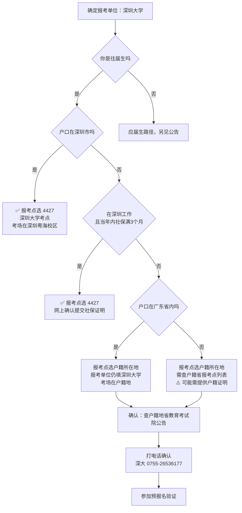

# [[考研报考流程]] 学习笔记

> [!tip] 学习目标
> 读完你能：①判断自己该在哪个报考点报名；②列出往届生需要准备的全部材料；③按 12 步流程完成网报不出错；④知道哪些信息填错就**无法修改**；⑤处理学历校验未通过。

> [!danger] 时效声明（本篇是操作手册，最易过期）
> 所有数据核验于 **2026-10-10**。报考流程每年由教育部与各省教育考试院重新发布，**细节会变**。
> **执行前必须核对三处**：
> 1. 研招网 https://yz.chsi.com.cn （网报公告栏）
> 2. 你选的报考点官网公告（报考点规则由**各报考点**自行发布）
> 3. 打电话确认：深大研招办 **0755-26536177** / 深圳市招考办 **0755-82181999**
>
> 本文的 27 考研数据是**已发布**的；28 考研（你考的）**尚未发布**，相关时间见 [[考研总览与择校]] 的推算表。

> [!info] 你的情况（本篇内容按此分支）
> - 身份：**往届生**（已毕业）
> - 目标院校：**深圳大学**
> - 报考点：**待确认**（取决于你的户籍地与社保情况）—— 这是本篇第 2 章的核心

---

## 🎯 难度分段学习路径

| 难度 | 目标 | 核心关注 | 预估时长 |
|---|---|---|---|
| **入门** | 搞懂报名的完整流程与时间节点 | 12 步网报流程、预报名 vs 正式报名 | 3h |
| **进阶** | 确定报考点并备齐材料 | 往届生报考点规则、材料清单、学历校验 | 6h |
| **高级** | 避开不可逆的错误 | 关键信息不可改、常见失败案例、应急预案 | 5h |

**总学时**：14h ｜ **前置知识**：[[考研总览与择校]]（了解基本结构与报考点规则）

---

## 📖 第一章 入门（Beginner）

### 1.1 报名的三个阶段

**知识点详解**

考研报名**不是一次操作**，而是三个必须全部完成的阶段。任何一步没做，报名无效：

| 阶段 | 时间（27 考研已发布） | 做什么 | 没做的后果 |
|---|---|---|---|
| **① 网上报名** | 2026-10-15 ~ 10-24（9:00–22:00） | 填信息、选报考点、生成报名号 | 无法参加考试 |
| **② 网上缴费** | 报名截止前 | 网上支付报考费 | **报名无效** |
| **③ 网上确认** | 2026 年 10 月下旬 ~ 11 月上旬 | 上传材料、报考点审核 | **报名无效** |

> [!warning] 预报名与正式报名的关系
> **预报名**（27 考研为 2026-10-09 ~ 10-12）**不是必须参加**的，但**预报名期间填的信息是有效数据**。
>
> 官方原文：*"预报名期间填写的报名信息为有效数据，完成预报名后无需在正式报名期间重复填报"*
>
> **建议参加预报名**：①可以提前发现信息填写问题；②避免正式报名期间系统拥堵；③心理上提前完成一件事。

> [!info] 2027 研考的两项流程优化（新变化，需留意）
> 据研招网与新华社报道，**自 2027 年研考起**：
> 1. **报名照片采集提前** —— 从原来的"网上确认阶段"提前到"网上报名的基本信息填写阶段"
> 2. **无需提前准备照片** —— 由报名系统采集，不需要考生自备电子照片
>
> 这个变化对你是**利好**（少一件准备工作），但 28 考研是否会继续沿用，需在 2027 年 9 月核对当年公告。

**填空题**（每节 4 道，答案见章末）

1. 考研报名必须完成三个阶段：网上报名、______、______。
2. 27 考研的网上报名时间为 2026 年 10 月 ______ 日至 ______ 日。
3. 预报名期间填写的报名信息 ______（是 / 不是）有效数据。
4. 自 2027 年研考起，报名照片采集从网上确认阶段提前到 ______ 阶段。

**答案**：
1. 网上缴费 / 网上确认
2. 15 / 24
3. 是
4. 网上报名的基本信息填写

---

### 1.2 网报 12 步流程（官方）

**知识点详解**

以下是**研招网官方发布的完整流程**，逐步照做即可：

| 步骤 | 操作 | 关键提醒 |
|---|---|---|
| 1 | **登录研招网** | 读报名公告和报名须知 |
| 2 | **实名注册** | 牢记学信网用户名密码（后期查分、下载准考证、调剂都要用） |
| 3 | **填写考生信息并采集照片** | 含学籍学历、基本信息、户籍档案、家庭成员、学习工作经历、奖惩、联系方式 |
| 4 | **选择招生单位、考试方式、专项计划** | 按各省及招生单位网报公告要求 |
| 5 | **选择报考专业、研究方向、考试科目** | 专业名带"(专业学位)"字样的是专硕 |
| 6 | **选择报考点** | ⚠️ **最易出错的一步**，见第 2 章 |
| 7 | **生成报名号** | 核对信息后提交，系统自动生成 |
| 8 | **网上支付** | 检查支付是否成功（银行卡扣费即成功） |
| 9 | **上传报考点要求的材料** | 按报考点要求提交核验材料 |
| 10 | **修改或查询报名信息** | ⚠️ 关键信息生成报名号后**不可修改** |
| 11 | **预报名 / 正式报名** | 二选一即可，预报名有效则无需重复 |
| 12 | **等待报考点审核** | 关注审核结论，材料不符需及时补交，**逾期不得补办** |

> [!danger] 第 3 步的硬性要求（容易踩坑）
> 官方原文明确：
> - **必须使用半角英文输入法填写信息**（全角字符会导致校验失败）
> - 带 `*` 的文本框为必填
> - **家庭主要成员、学习与工作经历每部分至少完整填写一条**
> - 学历（学籍）信息系统会自动校验，未通过者需在招生单位规定时间内完成核验

> [!warning] 第 10 步：哪些信息填错就无法修改
> 官方原文：*"所填报的'报考单位''报考点'和'考试方式'等关键信息不能更改"*
>
> **错填的后果**：必须在**网上报名截止时间前**取消报名后重新报名，并**重新缴纳报考费**（已缴费用网报结束后系统自动退还）。
>
> **逾期不再修改。** 这是本篇最重要的单条警告 —— 请在第 7 步生成报名号之前反复核对这三项。

**填空题**

1. 网报第 3 步中，填写信息必须使用 ______ 输入法。
2. 网报流程共 ______ 步。
3. 生成报名号后，______、______、______ 等关键信息不能更改。
4. 错填关键信息的补救方式是：在报名截止前 ______ 后重新报名。

**答案**：
1. 半角英文
2. 12
3. 报考单位 / 报考点 / 考试方式
4. 取消已有报名

---

### 1.3 报考费与支付

**知识点详解**

报考费**按科目数计费**，各省标准不同。广东省的标准（官方原文）：

| 考试类型 | 收费标准 |
|---|---|
| 统考 / 法律硕士联考 / 管理类联考（会计、审计、图书情报） | **每生每科 40 元** |
| 单独考试 / 管理类联考（工商管理、公共管理、工程管理、旅游管理） | 按各报考点标准 |

> [!info] 你的报考费计算
> 你考 **4 门**（政治 + 英语一 + 数学一 + 专业课），按广东标准：
> **40 元 × 4 科 = 160 元**
>
> 如果你在**非广东**的报考点报名，按该省标准收费（各省差异较大，普遍在 120–200 元区间）。

> [!warning] 退费规则（重要）
> 官方原文：*"已参加网上确认但未参加考试的考生，报考费不予退还。"*
>
> - **已网上确认但不考试** → 不退费
> - **重复支付**（同一报名号付两次）→ 退重复部分
> - **不要在缴费后立即注销银行卡**，否则影响退费
>
> **实际含义**：一旦完成网上确认，这 160 元就"沉没"了。所以确认前想清楚 —— 但不要因为心疼 160 元而放弃考试，那是本末倒置。

**填空题**

1. 广东省统考的报考费标准为每生每科 ______ 元。
2. 你考 4 门，按广东标准报考费合计 ______ 元。
3. 已参加网上确认但未参加考试的考生，报考费 ______。
4. 缴费后不要立即 ______，否则会影响退费。

**答案**：
1. 40
2. 160
3. 不予退还
4. 注销银行卡

---

### 1.4 第一章综合练习

**填空题**

1. 报名的三个阶段是网上报名、______、______，缺一不可。
2. 27 考研预报名时间为 2026 年 10 月 ______ 日至 ______ 日。
3. 网报流程中，选择报考点之后的下一步是 ______。
4. 广东省报考费按 ______ 计费，标准为每科 40 元。

**答案**：
1. 网上缴费 / 网上确认
2. 9 / 12
3. 生成报名号
4. 科目数

**综合项目**：制作你的报名执行清单

- **输入**：本篇 1.2 的 12 步流程表
- **步骤**：
  1. 把 12 步按"需要准备材料"和"纯线上操作"分成两类
  2. 对需要准备材料的步骤，列出具体材料名称与获取途径
  3. 在"选择报考点"和"生成报名号"两步旁标注 ⚠️（高风险）
  4. 设定两个提醒：报名开始日（2027-10 上旬）、网上确认截止日（2027-11 初）
- **产出物**：一份可勾选的清单，存入本笔记末尾的"个人进度"区
- **验收标准**：清单里每一项都能回答"我需要去哪里拿到这个东西"

**常见陷阱**

| 陷阱 | 后果 | 正确做法 |
|---|---|---|
| 只报名不缴费 | 报名无效 | 提交后立刻缴费 |
| 不参加网上确认 | 报名无效 | 关注报考点公告，按期上传材料 |
| 用全角字符填信息 | 校验失败 | 切半角英文输入法 |
| 生成报名号后才发现报考点错了 | 需重新报名+重新缴费 | 第 7 步前反复核对 |
| 不填家庭成员/工作经历 | 无法提交 | 每部分至少填一条 |
| 以为预报名可跳过 | 错过提前发现问题的机会 | 建议参加预报名 |

---

## 📖 第二章 进阶（Intermediate）

### 2.1 往届生报考点：规则层次

**知识点详解**

**这是往届生最容易翻车的环节。** 规则分三层，从宽到严：

| 层次 | 规则内容 | 来源 |
|---|---|---|
| **教育部总则** | 往届生只能选**户口所在地**或**工作单位所在地**的报考点 | 教育部管理规定 |
| **省级（广东）** | 往届生须满足：**工作或户口所在地在广东省** | 广东省教育考试院 |
| **报考点（深大 4427）** | 只接受报考深大的考生，且须满足 4 个条件之一 | 深大考点公告 |

> [!danger] 最关键的一条规则
> 深圳市招考办与广东省报名须知**都明确写了**：
>
> > "符合深圳市各报考点报考条件的考生，**如报考深圳大学，则必须选择深圳大学报考点报名**"
>
> **这造成一个两难**：
> - 想报深大 → 必须选深大报考点（4427）
> - 选深大报考点 → 必须满足它的 4 个条件之一（深圳户口 / 深圳社保 / 深圳高校应届 / 深圳实习）
>
> **如果你既不满足深大报考点条件，又想报深大**，那只能回**户籍所在地**报考（报考单位仍填深大，报考点填户籍地）。这条路径是可行的，但你的初试考场会在户籍地，不在深圳。

**填空题**

1. 教育部总则规定，往届生只能选 ______ 或 ______ 所在地的报考点。
2. 广东省要求往届生的工作或户口所在地在 ______。
3. 报考深大的考生必须选择 ______ 报考点。
4. 既不满足深大报考点条件又想报深大，应选择 ______ 报考点。

**答案**：
1. 户口所在地 / 工作单位所在地
2. 广东省
3. 深圳大学（4427）
4. 户籍所在地

---

### 2.2 深大报考点（4427）的四个条件

**知识点详解**

深大考点网报公告原文列出 **4 个条件，满足其一即可**：

| # | 条件 | 网上确认需提交 |
|---|---|---|
| 1 | **户口在深圳市的非应届毕业生** | 户口本个人页 |
| 2 | 深圳户籍或深圳市高校应届毕业生 | 户口本 / 学生证内页 |
| 3 | **深圳市内工作的往届毕业生** | **当年内至少 3 个月的社保证明** |
| 4 | 深圳市内实习的应届本科毕业生 | 实习证明（盖学校/学院与实习单位公章） |

> [!success] 你该怎么判断
> 你是往届生，适用条件 **1 或 3**：
>
> | 你的情况 | 是否满足 | 报考点选择 |
> |---|---|---|
> | 深圳户口 | ✅ 满足条件 1 | 深大 4427，**在深圳考试** |
> | 非深户，但在深圳工作且社保满 3 个月 | ✅ 满足条件 3 | 深大 4427，**在深圳考试** |
> | 非深户，不在深圳工作 | ❌ 不满足 | **户籍所在地报考点**，考场在户籍地 |
>
> **第 3 个条件的关键细节**：社保证明要求是"**当年内**至少三个月"。也就是说如果你打算用社保路径，**必须在报考当年的 7–10 月之间有社保记录**（不同年份公告的月份范围可能调整，以当年公告为准）。

> [!warning] 社保路径的时间倒推（如果你考虑这条路）
> 假设 28 考研报名在 **2027 年 10 月**，网上确认在 **2027 年 10 月底~11 月初**：
> - 需要在 **2027 年内**有至少 3 个月社保记录
> - 意味着最晚 **2027 年 7 月**就要开始缴纳
> - 而 2027 年 7 月正是**复习强化期的关键时段**
>
> **代价**：为了满足报考点条件去深圳找一份工作，会直接冲击复习时间。**这个决策要在 2026 年底之前想清楚**，不能拖到 2027 年夏天。

> [!info] 深圳的另外两个报考点（不适用你）
> 深圳共 3 个报考点：
> - **4411 深圳市招考办** —— 接受报考**除深大、南科大、西工大之外**其他院校的考生
> - **4427 深圳大学** —— 只接受报考深大的考生
> - **4429 南方科技大学** —— 只接受报考南科大、西工大的考生
>
> **你不能选 4411 来考深大** —— 公告明确"报考其他院校的，必须选择深圳市招生办报考点"，反过来，报深大的**不能**选 4411。

**填空题**

1. 深大报考点的代码是 ______，共列出 ______ 个报考条件。
2. 深圳市内工作的往届生报考深大，网上确认需提交当年内至少 ______ 个月的社保证明。
3. 如果你在 2027 年 10 月报名，用社保路径最晚应在 2027 年 ______ 月开始缴纳社保。
4. 报考深大的考生 ______（能 / 不能）选择深圳市招考办报考点（4411）。

**答案**：
1. 4427 / 4
2. 三
3. 7
4. 不能

---

### 2.3 往届生材料清单

**知识点详解**

网上确认需要上传的材料，按**通用**和**分支**两类整理：

**通用材料（所有往届生都要）**

| 材料 | 要求 | 获取途径 |
|---|---|---|
| **身份证** | 正反面扫描/照片，清晰可见身份证号、发证机关、有效期 | 现有 |
| **毕业证书** | 清晰可见毕业学校名称、毕业证号码、发证日期 | 现有 |
| **学历在线认证码** 或 **学历认证报告编号** 或 **境外学历学位认证书编号** | 学历校验未通过时必需 | 学信网 |
| **诚信复试承诺书** | 复试阶段现场签订（报名阶段不涉及） | 现场 |

**分支材料（按报考点要求）**

| 情况 | 需要提交 |
|---|---|
| 广东省内户籍 | 户口本个人页 |
| 非广东户籍、在广东工作 | 在粤参加社保证明（不限参保月数） |
| 港澳考生 | 港澳身份证 |
| 军人 | 所在部队开具的同意报考证明 |
| 身份核验未通过 | 本人身份证件 |
| 退役大学生士兵 | 入伍证明书 + 退出现役证明 |

> [!warning] 学历校验未通过怎么办（往届生高发问题）
> 报名期间研招网会**自动校验学历（学籍）信息**。往届生常见不通过的原因：毕业证编号填错、毕业年份填错、姓名/身份证号与学信网记录不一致。
>
> **处理方式**（按毕业年份分支）：
> - **2001 年及以后毕业** → 提供《**教育部学历证书电子注册备案表**》
> - **2000 年及以前毕业** → 提供《**中国高等教育学历认证报告**》
> - **军校学历** → 需在学信网提前做验证报告
> - **境外学历** → 《国外学历学位认证书》
>
> **重要**：学历认证报告的办理**需要时间**（可能数周），**不要等到网上确认截止前才去申请**。建议在报名开始前就登录学信网确认自己的学历信息能否正常校验通过。

> [!tip] 提前做这件事能省很多麻烦
> **现在（2026 年 10 月）就可以**：
> 1. 登录学信网 https://www.chsi.com.cn 查自己的学历信息是否存在、信息是否准确
> 2. 如果发现姓名、身份证号有误，立即联系毕业院校学籍部门更正
> 3. 如果学历信息查询不到，现在就开始申请学历认证报告
>
> 这三件事**不占用复习时间**，但能在 2027 年报名的关键期避免致命问题。

**填空题**

1. 往届生网上确认的通用材料包括身份证、______ 和学历认证材料。
2. 2001 年及以后毕业的考生，学历校验未通过时需提供 ______。
3. 2000 年及以前毕业的考生，需提供 ______。
4. 学历认证报告办理需要时间，建议在 ______ 前就申请。

**答案**：
1. 毕业证书
2. 《教育部学历证书电子注册备案表》
3. 《中国高等教育学历认证报告》
4. 报名开始（或网上确认截止）

---

### 2.4 第二章综合练习

**填空题**

1. 报考点规则分三层：教育部总则、______、______。
2. 深大报考点 4427 的四个条件中，适用于往届生的是第 ______ 条和第 ______ 条。
3. 广东省内户籍考生网上确认时需上传 ______。
4. 非广东户籍但在广东工作的考生，需上传 ______。

**答案**：
1. 省级（广东）规则 / 报考点自身规则
2. 1 / 3
3. 户口本个人页
4. 在粤参加社保证明

**综合项目**：报考点资格判定

- **输入**：你的户籍地、工作地、社保缴纳情况
- **步骤**：
  1. 对照 2.2 的四个条件，逐条标注"满足 / 不满足"
  2. 如果满足条件 1 或 3 → 报考点填 **4427**，考场在深圳
  3. 如果都不满足 → 报考点填**户籍所在地**的报考点（需查户籍地省教育考试院的报考点列表）
  4. **打电话确认**：深大研招办 0755-26536177
  5. 把结论和电话确认的日期写下来
- **产出物**：一句话结论 —— "我在 ___ 报考点报名，报考单位深圳大学，考场在 ___"
- **验收标准**：三个空都能填出确定答案，且经过电话确认

**常见陷阱**

| 陷阱 | 后果 | 正确做法 |
|---|---|---|
| 以为可以随意选报考点 | 报名无效 | 先看报考点接受范围 |
| 报深大却选了深圳市招考办（4411） | 报名无效 | 报深大必须选 4427 |
| 社保月份不够就报名 | 网上确认失败 | 提前 6 个月规划 |
| 拖到网上确认截止前才办学历认证 | 来不及 | 现在就查学信网 |
| 户籍地报考点规则想当然 | 材料不符 | 查户籍地省考试院公告 |
| 全角字符填信息 | 校验失败 | 切半角英文输入法 |

---

## 📖 第三章 高级（Advanced）

### 3.1 不可逆操作与补救路径

**知识点详解**

报名流程里有几处**操作后无法回退**，必须提前识别：

| 操作 | 可逆性 | 补救方式 | 代价 |
|---|---|---|---|
| 填写考生信息 | ✅ 可改 | 直接修改 | 无 |
| **生成报名号后改报考单位** | ❌ 不可改 | 取消报名→重新报名 | 重新缴费、重新选报考点 |
| **生成报名号后改报考点** | ❌ 不可改 | 取消报名→重新报名 | 同上 |
| **生成报名号后改考试方式** | ❌ 不可改 | 取消报名→重新报名 | 同上 |
| 网上缴费 | ⚠️ 部分 | 重复支付可退；已确认不考试不退 | 160 元 |
| **网上确认通过** | ❌ 不可逆 | 无 | 报考费沉没 |
| 报名截止后 | ❌ 不可逆 | 无 | 错过一年 |

> [!danger] 一个真实的风险场景
> 假设你在正式报名期间（10 月中下旬）才发现报考点选错：
> 1. 取消原报名 → 2. 重新填写全部信息 → 3. 重新选择报考点 → 4. 重新缴费
>
> **问题**：热门报考点可能**已经满了**（官方公告提到"如因考生报考集中导致超过报考点容量，省教育考试院将视实际情况，调整部分考生到其它报考点参加考试"）。
>
> **规避方式**：**参加预报名**。预报名在正式报名之前，能让你提前发现报考点选择问题，且此时报考点容量充足。

> [!info] 取消报名的费用处理
> 官方原文：*"已缴费用网报结束后系统自动退还"*
>
> 所以取消报名**不会损失报考费**，但会损失**时间和报考点容量优势**。这也是为什么要尽早操作。

**填空题**

1. 生成报名号后，报考单位、______、______ 三项不可修改。
2. 修改这三项的唯一方式是 ______ 后重新报名。
3. 取消报名后已缴费用会 ______。
4. 避免报考点选错的最佳方式是参加 ______。

**答案**：
1. 报考点 / 考试方式
2. 取消报名
3. 在网报结束后系统自动退还
4. 预报名

---

### 3.2 报考点选择的决策树

**知识点详解**

把前面的规则整合成一张可执行的判断流程：

> [!warning] 决策树的使用前提
> 这张图基于**2027 年公告**。规则每年可能调整，**必须**用当年的公告重新核对一遍。
> 特别是"社保月份范围"这一项 —— 2026 年公告要求"2025 年内至少三个月"，2027 年公告要求"不限参保月数"（对深圳市招考办报考点）。**不同报考点的口径不同，必须看你要报的那个点的公告。**

**填空题**

1. 深圳户口且为往届生，报考点应选 ______。
2. 非深户但在深圳工作且社保满 3 个月，报考点应选 ______。
3. 既不满足深大报考点条件，户口在广东省内，报考点应选 ______。
4. 决策树的最后一步是 ______。

**答案**：
1. 4427（深圳大学考点）
2. 4427（深圳大学考点）
3. 户籍所在地报考点
4. 打电话确认（深大研招办 0755-26536177）

---

### 3.3 报名期与复习期的冲突管理

**知识点详解**

报名期（10 月）恰好撞上**复习冲刺期**。这是往届生最容易崩盘的时间段：

| 时间 | 报名相关任务 | 复习阶段 | 冲突程度 |
|---|---|---|---|
| 2027-09 | 关注公告、准备材料 | 真题阶段 | 中 |
| **2027-10 上旬** | 预报名（填信息、采集照片） | **冲刺期开始** | **高** |
| **2027-10 中下旬** | 正式报名 + 缴费 | 冲刺期 | **高** |
| **2027-10 底 ~ 11 初** | 网上确认（上传材料、等审核） | 冲刺期 | **高** |
| 2027-11 | 材料补充（如有问题） | 冲刺期 | 中 |
| 2027-12 | 打印准考证 | 最后冲刺 | 低 |

> [!success] 三条降低冲突的具体做法
> **1. 材料提前扫描（2026 年底前完成）**
> 把身份证正反面、户口本个人页、毕业证书都扫描成清晰图片存好。注意官方对图片的要求：一般要求小于 200K 的 JPG。提前处理好，报名时直接上传。
>
> **2. 把报名任务"批处理"**
> 报名操作本身约需 1–2 小时。建议：
> - 用**预报名**完成主体填写（避开正式报名高峰）
> - 正式报名期只做核对
> - 网上确认期只做上传（材料已备好）
> 三次各花 1 小时，而不是连续几天分心。
>
> **3. 报名当天不要安排新知识点**
> 报名需要来回核对信息，容易焦虑。当天只做"复习旧内容 + 报名"两件事，不安排新内容。

> [!warning] 心理层面的提醒
> 报名期是往届生**动摇高发期** —— 填表时会反复确认"我真的要考吗"，看到报考人数会焦虑。
> **提前写好"为什么考研"的一段话**（放在 [[考研方向深度对比]] 的决策备忘里），报名期拿出来读一遍，比临时做决定更可靠。

**填空题**

1. 报名期（2027 年 10 月）与 ______ 阶段重叠，是冲突最严重的时段。
2. 降低冲突的做法之一是提前 ______ 所有材料。
3. 报名操作本身约需 ______ 小时，建议分三次批处理。
4. 报名期是往届生 ______ 的高发期，建议提前写好决策备忘。

**答案**：
1. 复习冲刺
2. 扫描/准备
3. 1–2
4. 动摇（心理焦虑）

---

### 3.4 第三章综合练习

**填空题**

1. 报名流程中不可逆的三项信息是 ______、______、______。
2. 取消报名后重新报名需要重新 ______。
3. 深圳户口往届生报考深大，考场在 ______。
4. 报名期与复习冲刺期重叠，建议采用 ______ 策略降低冲突。

**答案**：
1. 报考单位 / 报考点 / 考试方式
2. 缴费
3. 深圳大学粤海校区
4. 批处理（分三次完成，材料提前准备）

**综合项目**：写一份「报名应急预案」

- **输入**：本篇 3.1 的不可逆操作表
- **步骤**：
  1. 列出你可能遇到的 3 种失败场景（如报考点选错、学历校验不过、材料不合格）
  2. 对每种场景写出：发现时机、补救步骤、最坏后果
  3. 标注每种场景的"预警信号"（什么迹象说明要出问题了）
  4. 设定检查点：预报名后、正式报名后、网上确认提交后各检查一次
- **产出物**：一张三行的应急预案表
- **验收标准**：每种场景都能回答"我最早能在什么时候发现"

**常见陷阱**

| 陷阱 | 后果 | 正确做法 |
|---|---|---|
| 拖到正式报名才第一次操作 | 报考点可能已满 | 用预报名试水 |
| 材料临时准备 | 图片不合格，反复上传 | 2026 年底前扫描好 |
| 报名期安排新知识点 | 焦虑叠加，两头都做不好 | 当天只复习旧内容 |
| 报名期临时质疑考研决定 | 动摇甚至放弃 | 提前写好决策备忘 |
| 不看户籍地省考试院公告 | 材料不符 | 提前查并打电话 |

---

## ⚡ 速查表

| 项目 | 数据 | 核验日期 |
|---|---|---|
| **网报流程步数** | 12 步 | 2026-10-10 |
| 27 考研预报名 | 2026-10-09 ~ 10-12 | 2026-10-10 |
| 27 考研正式报名 | 2026-10-15 ~ 10-24（9:00–22:00） | 2026-10-10 |
| 27 考研网上确认 | 2026 年 10 月下旬 ~ 11 月上旬 | 2026-10-10 |
| **广东报考费** | 每生每科 **40 元**（你 4 科 = 160 元） | 2026-10-10 |
| **深大报考点代码** | **4427** | 2026-10-10 |
| 深圳市招考办代码 | 4411（不接受报深大的考生） | 2026-10-10 |
| 南方科技大学代码 | 4429 | 2026-10-10 |
| **深大报考点条件** | 4 个，满足其一（深户 / 深圳社保 3 个月 / 深圳高校应届 / 深圳实习） | 2026-10-10 |
| 不可修改信息 | 报考单位、报考点、考试方式 | 2026-10-10 |
| 往届生通用材料 | 身份证、毕业证、学历认证材料 | 2026-10-10 |
| 2001 年后毕业认证 | 《教育部学历证书电子注册备案表》 | 2026-10-10 |
| 深大研招办电话 | **0755-26536177** | 2026-10-10 |
| 深圳市招考办电话 | 0755-82181999 | 2026-10-10 |
| 学信网 | https://www.chsi.com.cn | 2026-10-10 |

---

## ❓ 常见问题

> [!faq]- 我是往届生，户口不在深圳也没在深圳工作，能考深大吗？
> **能，但报考点不能选深大。** 报考点选**户籍所在地**（报考单位仍填深圳大学）。这样你的初试考场在户籍地。注意：某些特殊科目（用画板、超 3 小时）要求必须选报考院校作为报考点，你的 408/802 不属于这类，所以不受影响。**报名前打电话确认**：0755-26536177。

> [!faq]- 预报名必须参加吗？
> **不是必须，但强烈建议。** 预报名信息是有效的，完成后无需在正式报名期重复填报。参加预报名能提前发现信息填写问题，且此时报考点容量充足 —— 这是避免"正式报名时报考点满了"的最佳方式。

> [!faq]- 报名信息填错了怎么办？
> 分两种情况：
> - **普通信息**（联系方式、家庭成员等）：报名期间可直接修改
> - **关键信息**（报考单位、报考点、考试方式）：生成报名号后**不能改**，必须在报名截止前取消报名后重新报名并重新缴费（已缴费用网报结束后退还）
>
> **逾期不再修改** —— 所以生成报名号前务必反复核对这三项。

> [!faq]- 学历校验没通过，会影响报名吗？
> 校验未通过**不影响继续填写其他信息**，但最终必须在招生单位规定时间内完成学历核验。往届生需提供：
> - 2001 年及以后毕业 → 《教育部学历证书电子注册备案表》
> - 2000 年及以前毕业 → 《中国高等教育学历认证报告》
>
> **认证报告办理需要时间**，建议现在就登录学信网确认学历信息能否正常校验。

> [!faq]- 报考费什么时候交？能退吗？
> 成功提交网报信息后，在**报名截止前**通过网上支付缴纳。退费规则：
> - 已参加网上确认但未考试 → **不退**
> - 重复支付 → 退重复部分
> - 取消报名 → 网报结束后退还
>
> **缴费后不要立即注销银行卡**，否则影响退费。

> [!faq]- 照片需要提前准备吗？
> **自 2027 年研考起不需要。** 研招网优化了报名照片采集模式，采集时间从网上确认阶段提前到网上报名的基本信息填写阶段，且由系统采集，考生无需提前准备电子照片。但 28 考研是否沿用，需核对当年公告。

> [!faq]- 网上确认和现场确认是一回事吗？
> 现在**绝大多数报考点都采用网上确认**（上传材料 + 报考点在线审核）。深圳的报考点均为网上确认。但具体方式以你选的报考点公告为准。

> [!faq]- 报名时用什么浏览器/输入法？
> 官方要求：**必须使用半角英文输入法填写信息**（全角字符会导致校验失败）。另外建议**关闭网页拦截功能的软件**（官方原文提到"请勿开启有网页拦截功能的软件"），否则可能影响报名流程。

---

## 🪤 踩坑记录

| 坑 | 后果 | 规避方法 |
|---|---|---|
| 只报名不缴费 | 报名无效 | 提交后立即缴费 |
| 不做网上确认 | 报名无效 | 关注报考点公告 |
| 报深大选了 4411 报考点 | 报名无效 | 报深大必须选 4427 |
| 用全角字符填信息 | 校验失败 | 切半角英文输入法 |
| 生成报名号后才发现报考点错 | 需取消重报，报考点可能已满 | 用预报名提前验证 |
| 拖到网上确认前才办学历认证 | 来不及，报名失败 | 现在就查学信网 |
| 社保月份不够 | 网上确认失败 | 提前 6 个月规划 |
| 不填家庭成员/工作经历 | 无法提交 | 每部分至少一条 |
| 报名期临时质疑考研决定 | 动摇放弃 | 提前写决策备忘 |
| 只看二手经验帖不打电话 | 规则理解错误 | 打 0755-26536177 |

---

## 📌 待办与信息缺口

> [!todo] 你必须补齐的信息（决定能否顺利报名）
> - [ ] **你的户籍所在省份**（决定报考点选哪里）
> - [ ] **户籍所在地的报考点列表与规则**（查该省教育考试院公告）
> - [ ] **是否在深圳工作 / 是否计划去深圳工作**（决定能否用 4427）
> - [ ] **学信网学历信息能否正常校验**（现在就能查）
> - [ ] **身份证有效期**（须覆盖到 2028 年 9 月之后）
> - [ ] **毕业证书是否在手边**（需要扫描）
> - [ ] 打电话确认报考点资格（深大 0755-26536177）

> [!todo] 本篇未核验的信息（诚实声明）
> - [ ] **28 考研的报名时间**（2027 年 9 月发布）
> - [ ] **28 考研深大报考点的条件是否变化**（每年可能调整）
> - [ ] **28 考研是否延续"照片系统采集"**（27 考研起的新变化）
> - [ ] **非广东户籍在户籍地报考深大的具体材料要求**（各省不同）
> - [ ] 广东省 2027 年报名须知的原文（本文引用的是 2026 年版）

> [!question] 待你回答（回答后本篇可细化）
> - [ ] 户籍在哪个省？
> - [ ] 会去深圳工作吗？
> - [ ] 学信网能查到自己的学历信息吗？

> [!success] 我的报名结论（待填写）
> - **报考点**：______（代码 ______）
> - **考场城市**：______
> - **需准备的材料**：______
> - **电话确认日期**：______

---

## 📦 资源链接

| 资源 | 链接 | 说明 |
|---|---|---|
| **中国研究生招生信息网** | [yz.chsi.com.cn](https://yz.chsi.com.cn) | 唯一官方报名入口；网报公告、流程、政策原文 |
| **研招网网报流程（官方）** | [2027 网报流程图](https://yz.chsi.com.cn/kyzx/kp/202609/20260927/2293973610.html) | 12 步流程的官方说明 |
| **研招网统考网报入口** | [yz.chsi.com.cn/yzwb](https://yz.chsi.com.cn/yzwb/) | 填写考生信息、采集照片 |
| **学信网（学历查询）** | [chsi.com.cn](https://www.chsi.com.cn) | 查学历信息、申请学历认证报告 |
| **广东省教育考试院** | [eea.gd.gov.cn](http://eea.gd.gov.cn/) | 广东省报名须知、报考点列表 |
| **广东省报名须知（2026 版）** | [研招网转载](https://yz.chsi.com.cn/kyzx/kydt/202509/20250930/2293436365.html) | 报考费标准、报考点接受范围原文（本文多处引用） |
| **深圳市招考办报考点须知** | [szeb.sz.gov.cn 公告](https://szeb.sz.gov.cn/szzkw/qt/tzgg/content/post_13009605.html) | 深圳 3 个报考点的接受范围 |
| **深大考点网报公告** | [yz.szu.edu.cn/info/1041/13806.htm](https://yz.szu.edu.cn/info/1041/13806.htm) | 4427 考点的 4 个条件原文 |

> [!important] 关键电话（比网页更可靠）
> - **深大研招办**：0755-26536177（工作日 08:30–12:00 / 14:00–17:30，寒暑假除外）
> - **深圳市招考办**：0755-82181999
> - **研招网客服**：010-67410388（客服邮箱 kefu@chsi.com.cn）
> - **广东省教育考试院**：见官网

---

## 🔗 关联笔记

> [!note] 关于「待创建」标记
> 上面标了**（待创建）**的笔记尚未写入本库，因此这里写成纯文本而非 wikilink —— 教学型笔记里的断链会被 Obsidian 当成错误，而它们目前确实还不存在。
> 它们的内容依赖尚未确定的信息（你的方向选择、802 大纲核验结果），等这些确定后再写。

> [!info] 阅读方式
> - **上游**（先学）：[[考研总览与择校]] —— 考研结构、时间线、报考点规则概览
> - **下游**（后学）：[[考研备考计划]] —— 报名完成后的复习安排
> - **横向**（同层）：[[考研方向深度对比]]、考研院校数据

**上游**

- [[考研总览与择校]] —— 考研基本结构、时间线、深大概况；本篇 2.1 的报考点规则在那篇有概览

**下游**

- [[考研备考计划]] —— 报名与确认完成后的分阶段复习计划

**横向**

- [[考研方向深度对比]] —— 专业选择与竞争强度分析（决定报哪个专业代码）
- 考研院校数据（待创建）—— 目标院校历年分数线与报录比汇总

---

*由 Hermes Agent 创建于 2026-10-10 · 状态：进行中*
