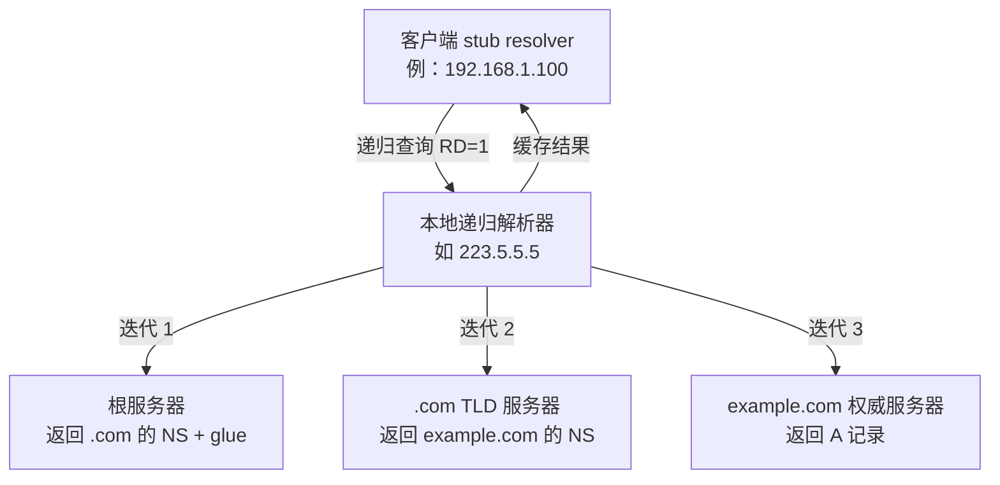

# [[DNS-详解]]

> [!tip] 学习目标
> 独立解释一次 DNS 解析从域名到 IP 的完整过程，读懂 `dig` 输出的每一段，理解缓存/TTL/递归/迭代的区别，并能判断 DNS 相关的排障与安全问题（劫持、投毒、放大攻击、DNS 隧道）。

---

## 🎯 难度分段学习路径

| 难度 | 核心关注 | 预估时长 |
|---|---|---|
| **入门** | 层次结构、查询流程、记录类型、报文格式、`dig` 基本用法 | 8h |
| **进阶** | 缓存与 TTL 细节、递归/迭代、EDNS(0)、DNSSEC、现代扩展（CAA/HTTPS/ECS） | 12h |
| **高级** | 加密 DNS（DoT/DoH/DoQ）、攻击面与防护、DNS 隧道与 DoH 滥用、排障手册 | 10h |

**总学时**：30h ｜ **前置知识**：[[计算机网络基础#1.2 IP 地址与子网划分]]（IP、端口、UDP/TCP）

---

## 📖 第一章 入门（Beginner）

### 1.1 DNS 是什么：分布式层次数据库

**知识点详解**

| 概念 | 说明 | 示例 |
|---|---|---|
| 域名 | 人类可读的层次化名字 | `www.example.com` |
| 标签（label） | 域名的每一段，单标签 ==最长 63 字节== | `www` / `example` / `com` |
| FQDN | 完整域名，以根点结尾 | `www.example.com.` |
| 根（root） | 顶级之上的虚拟根，由 13 个逻辑标识符（根服务器）承载 | `.` |
| TLD | 顶级域 | `com` / `cn` / `org` |
| 权威服务器 | 某区域（zone）唯一说了算的服务器 | `ns1.example.com` |
| 递归解析器 | 代替你查到底并缓存结果的服务器 | `223.5.5.5` / `8.8.8.8` |
| 注册商/注册局 | 卖域名的（注册商）与管 TLD 的（注册局） | ICANN → `.com` 注册局 |

> [!tip] 关键理解
> DNS ==不是数据库，而是一套「委托 + 缓存」的分布式命名系统==。没有一台机器存着全部信息，靠**逐级委托**找到答案。

**填空题**

1. 单个 DNS 标签最长 ______ 字节。
2. `www.example.com.` 末尾的点是 ______（根），它可以省略。
3. 某个 zone 唯一能修改其记录并对外权威应答的服务器叫 ______ 服务器。
4. 代替客户端查到底并缓存结果的服务器叫 ______ 解析器。

**答案**：
1. 63
2. 根
3. 权威
4. 递归

---

### 1.2 一次解析的完整流程

**知识点详解**

| 模式 | 谁干活 | 标志位 |
|---|---|---|
| **递归查询** | 递归服务器替我查到底，只给我最终答案 | 请求 `RD=1`，响应 `RA=1` |
| **迭代查询** | 每一级只告诉我「下一级该问谁」，我自己接着问 | 响应返回 referral（NS 记录） |

> [!danger] 常见误解
> 「递归 vs 迭代」说的是**客户端与递归服务器之间**的关系：客户端通常只发**一次递归查询**；而递归服务器向根/TLD/权威发的是**迭代查询**。==服务器之间不用「递归」这个说法==。



> [!tip] 为什么抓包常看到 5 个问题
> `dig example.com` 实际会依次查 `A?` →（拿到 CNAME 时）`A?` 对应的别名 → `AAAA?` → `MX?`…，每次都是独立事务。

**填空题**

1. 客户端发给递归服务器的通常是 ______ 查询（递归/迭代）。
2. 递归服务器向根服务器发的是 ______ 查询。
3. 响应中 `RD=1` 且 `RA=1` 说明服务器 ______ 处理了递归请求。
4. `dig example.com` 可能出现多个 Question 段，原因是 __________（CNAME 链 / 多种记录类型）。

**答案**：
1. 递归
2. 迭代
3. 支持（提供了递归服务）
4. CNAME 链与多种记录类型

---

### 1.3 记录类型与 TTL

**知识点详解**

| TYPE | 用途 | 示例值 |
|---|---|---|
| `A` | 主机 IPv4 | `93.184.216.34` |
| `AAAA` | 主机 IPv6 | `2606:2800:220:1::` |
| `CNAME` | 别名（==不能与其他记录共存于同名==） | `www` → `example.com` |
| `NS` | 权威服务器 | `ns1.example.com.` |
| `SOA` | 区域起始，携带**主从**与否定缓存参数 | `mname rname serial refresh retry expire minimum` |
| `MX` | 邮件服务器 + 优先级 | `10 mail.example.com.` |
| `TXT` | 文本（SPF / 域名验证） | `v=spf1 -all` |
| `PTR` | 反向解析（IP → 名字） | `34.216.184.93.in-addr.arpa` |
| `SRV` | 服务位置（端口 + 目标） | `_sip._tcp.example.com.` |
| `CAA` | ==限制哪些 CA 可签发本域证书== | `0 issue "letsencrypt.org"` |
| `HTTPS` / `SVCB` | 服务端点与替代服务（可引导 HTTP/3、ECH） | `altsvc=h3=":443"` |
| `ANY` | ==已不推荐==，各实现裁剪不一，且常被用于反射放大 | — |

| SOA 字段 | 作用 |
|---|---|
| `serial` | ==区域版本号==，从服务器据此判断是否需要同步 |
| `refresh/retry/expire/minimum` | 从服务器刷新策略；`minimum` 即==负缓存 TTL==（NXDOMAIN 缓存多久） |

**TTL 速记**：`TTL` 是「这条记录还能被缓存多久（秒）」。TTL **越大**：切 IP/切流量越慢；TTL **越小**：查询量与延迟成本越高。

**填空题**

1. `CNAME` 记录不能与同一名称的 ______ 记录共存。
2. 邮件服务器记录类型是 ______，优先级数字越小越优先。
3. SOA 中用于判断区域是否变更的字段是 ______。
4. NXDOMAIN（域名不存在）会被缓存，其时长取自 SOA 的 ______ 字段。

**答案**：
1. 其他（如 A/AAAA/MX/NS）
2. MX
3. serial（序列号）
4. minimum

---

### 1.4 DNS 报文格式

**知识点详解**

```
┌───────────────┐  固定 12 字节
│  Header       │  ID | QR Opcode AA TC RD RA Z RCODE
│               │  QDCOUNT | ANCOUNT | NSCOUNT | ARCOUNT
├───────────────┤
│  Question     │  QNAME | QTYPE | QCLASS
├───────────────┤
│  Answer       │
├───────────────┤
│  Authority    │  放 NS（referral）或 SOA（否定应答）
├───────────────┤
│  Additional   │  放 glue（A 记录）、OPT 伪记录
└───────────────┘
```

| 标志 | 含义 | 排障价值 |
|---|---|---|
| `QR` | 0=查询，1=响应 | 第一个就该看 |
| `AA` | ==权威应答==（这台服务器是权威） | 0 说明只是递归缓存的结果 |
| `TC` | ==响应被截断== | 1 时客户端要改用 TCP 重查 |
| `RD` / `RA` | 请求递归 / 服务器允许递归 | RA=0 → 你的解析器配置有问题 |
| `RCODE` | 0=NOERROR，3=NXDOMAIN，2=SERVFAIL，5=REFUSED | ==SERVFAIL 与超时是最常见故障== |

| 限制 | 值 | 备注 |
|---|---|---|
| UDP 报文（原始） | ==512 字节== | 超了要截断并转 TCP |
| 域名总长 | 255 字节 | 每个标签 ≤ 63 字节 |
| TCP 报文 | 65535 字节 | 区域传送（AXFR）用 |

**填空题**

1. DNS 报文头固定为 ______ 字节。
2. `TC=1` 表示响应被 ______，客户端通常改用 TCP 重查。
3. `RCODE=3` 表示域名 ______。
4. 原始 UDP DNS 报文上限是 ______ 字节。

**答案**：
1. 12
2. 截断
3. 不存在（NXDOMAIN）
4. 512

---

### 1.5 实操：三个解析工具

**知识点详解**

```bash
# 最详细：显示完整查询过程、TTL、权威标识、缓存
dig example.com

# 只要结果，适合脚本
dig +short example.com A

# 指定解析器对比（排查劫持/污染的第一招）
dig @8.8.8.8 example.com
dig @223.5.5.5 example.com

# 走完整链路：从根开始逐级追踪
dig +trace example.com

# 只看某条记录类型
dig example.com MX
dig example.com CAA +short

# 老牌交互式工具（输出不如 dig 清晰）
nslookup example.com
host example.com        # 最精简，只给结论

# systemd-resolved 环境清缓存
resolvectl flush-caches
resolvectl status        # 看当前用的是哪个 DNS
```

| 工具 | 读什么 |
|---|---|
| `dig` 输出 `SERVER:` | 当前递归解析器是谁 |
| `dig` 输出 `flags:` | 看 `qr aa rd ra` |
| `AUTHORITY SECTION` 里的 SOA | ==NXDOMAIN 时看这里==，确认是否权威否定 |
| `dig` 输出 `Query time:` | 慢解析的第一指标 |

**填空题**

1. 只要 A 记录结果且适合脚本的命令是 `dig ______ example.com`。
2. 指定使用 8.8.8.8 查询要加 `dig @______ example.com`。
3. 追踪从根开始的完整解析链路用 `dig ______ example.com`。
4. systemd-resolved 清理 DNS 缓存的命令是 `resolvectl ______`。

**答案**：
1. `+short A`
2. `8.8.8.8`
3. `+trace`
4. `flush-caches`

---

### 1.6 第一章综合练习

**综合项目**：对 `github.com` 完成以下动作并记录结果：
1. `dig github.com` —— 记录 SERVER、flags、TTL、`Query time`
2. `dig github.com AAAA` —— 看是否返回 AAAA
3. `dig @8.8.8.8 github.com` 与 `dig @223.5.5.5 github.com` 对比 —— 结果是否一致？TTL 差多少？
4. `dig +trace github.com` —— 数一数从根到权威有几跳

> [!tip] 常见陷阱
> 1. **递归 vs 迭代用反**：客户端 → 递归服务器是递归；递归服务器 → 根/TLD/权威是迭代。
> 2. **以为 `dig` 一次就够**：CNAME 链、多记录类型、IPv4/IPv6 双栈，实际会产生多个事务。
> 3. **只看 A 记录**：只查 A 就下结论，会漏掉 CNAME、AAAA、MX 的问题。
> 4. **拿 TTL 背 IP**：CDN 与轮询会变，TTL 是缓存策略，不是永久地址。

---

## 📖 第二章 进阶（Intermediate）

> [!warning] 与上一章的衔接
> 上一章回答「流程怎么走」，这一章回答「为什么结果会不一致」——**答案几乎总是缓存**。

### 2.1 缓存：谁在缓存、缓存多久

| 缓存位置 | 说明 | 怎么清 |
|---|---|---|
| 浏览器 / App | 按响应首部决定 | 开发者工具 → Disable cache |
| 操作系统 / stub | `systemd-resolved`、`nscd` | `resolvectl flush-caches` |
| 递归解析器 | ==影响面最大==（所有用户共享） | 只能等 TTL 或联系运营商 |
| 权威服务器 | 很少缓存自己的数据 | — |

```bash
# 递归缓存提前过期：dnsmasq 的 --min-cache-ttl
# BIND 的 minimal-responses / max-cache-ttl
```

> [!danger] 排障大坑
> 你在本地 `dig` 到的结果，**可能来自递归缓存而不是权威**。判断方法：看 `flags:` 里有没有 `aa` 标志 —— ==没有 `aa` 就说明不是权威应答==。

**TTL 决策的工程含义**

| 场景 | TTL 建议 | 理由 |
|---|---|---|
| 蓝绿/切流、迁移 IP | 短（60-300s） | 快速生效 |
| 常态稳定服务 | 长（3600-86400s） | 减少查询压力 |
| 首次上线 | 短 | 避免错误配置长时间生效 |
| CDN 节点调度 | 短 | 让客户端就近重算 |

**填空题**

1. 影响面最大的 DNS 缓存位于 ==递归解析器==。
2. `dig` 输出中没有 `aa` 标志，说明结果来自 ______（缓存/权威）。
3. 需要快速切流量时，TTL 应调 ______（长/短）。
4. 浏览器开发者工具里的 `Disable cache` 作用是绕过 ______ 缓存。

**答案**：
1. 递归解析器
2. 缓存
3. 短
4. 浏览器

---

### 2.2 权威应答与 referral 的区别

| 响应类型 | `flags` 表现 | Authority 段 | 含义 |
|---|---|---|---|
| 权威应答 | `aa` | 空（或有 CNAME） | 我就是权威，别再问了 |
| Referral | ==无 `aa`== | NS + 可能带 glue A | 「你去问这台，这是它的地址」 |
| 否定应答（NXDOMAIN） | 无 `aa`（来自递归时） | ==SOA== | 名字不存在，且缓存 negative TTL 秒 |
| SERVFAIL | — | 空 | 服务器内部失败（常见于 DNSSEC 校验失败） |

> [!tip] 一条能定位半壁江山的经验
> ==`dig +trace` 中每一跳都以 referral 形式返回（带 NS、无 aa）直到最后一跳才是权威应答==。如果中间某一跳直接返回 NXDOMAIN，通常是你链路上的中间 DNS 在「代你查」而失败。

**填空题**

1. referral 响应不设置 `aa` 标志，并在 Authority 段返回 ______ 记录。
2. NXDOMAIN 的否定应答在 Authority 段返回 ______ 记录。
3. `SERVFAIL` 常见原因之一是 ______（DNSSEC 校验失败 / 网络不通）。
4. 判断一次响应是否来自权威服务器，看 `flags` 中有没有 `______` 标志。

**答案**：
1. NS
2. SOA
3. DNSSEC 校验失败
4. aa

---

### 2.3 EDNS(0) 与大响应

**知识点详解**

| 问题 | EDNS(0) 的解法 |
|---|---|
| UDP 只有 512 字节，ANY/大量记录会截断 | 客户端与服务器协商更大的 UDP 载荷（典型 1232/4096） |
| 扩展 RCODE（12 位）与新标志无处安放 | 放进 **OPT 伪记录** |

```bash
# 看 EDNS 协商与是否被截断
dig +edns=0 +stats example.com
# 关键行：EDNS: version: 0, flags:; udp: 1232  → 服务器支持的 UDP 尺寸
#         MSG SIZE  rcvd: 512                → 疑似被中间设备截断
```

| 常量 | 值 |
|---|---|
| DNS over UDP（传统） | ==53== |
| DNS over TLS（DoT） | ==853== |
| DNS over HTTPS（DoH） | ==443== |
| DNS over QUIC（DoQ） | ==853==（规范规定同 DoT 端口） |

**填空题**

1. 传统 DNS 使用 UDP 端口 ______。
2. EDNS(0) 用 ______ 伪记录承载扩展信息。
3. `MSG SIZE rcvd: 512` 常见于没有启用 EDNS 或被中间设备 ______（截断/丢弃）。
4. DoT 默认使用 TCP 端口 ______。

**答案**：
1. 53
2. OPT
3. 截断
4. 853

---

### 2.4 DNSSEC：给 DNS 结果签名

**知识点详解**

| 概念 | 说明 |
|---|---|
| 签名链 | 根 → TLD → 你的域，每层用自己的 DNSKEY 签下层的 DS |
| 锚点 | 根区签名密钥（KSK），预置在客户端/解析器 |
| 验证流程 | 从根开始逐级验签，最终验证 A/AAAA 的 RRSIG |
| 能防什么 | ==篡改与伪造==（域被劫持到恶意 IP 会验签失败） |
| ==不能防什么== | ==不加密==，不防「权威服务器本身被攻破」，不防运营商递归缓存投毒（除非链上都有验证） |

```bash
# 本机是否启用 DNSSEC 校验（systemd-resolved）
resolvectl status | grep -i dnssec
dig +dnssec example.com     # 看 RRSIG / DS 记录
```

| 其他扩展 | 作用 |
|---|---|
| `CAA` | ==限制本域证书可由哪些 CA 签发==（配合 HTTPS 部署） |
| `HTTPS` / `SVCB` RR | 服务端点映射、`altsvc` 引导 HTTP/3、`ech` 支持 ECH |
| `ECS`（EDNS Client Subnet，RFC 7871） | 告诉 CDN「我来自这个网段」，用于定向调度；**也带来隐私与缓存碎片化权衡** |

**填空题**

1. DNSSEC 提供的是 ______（加密/签名）保护。
2. DNSSEC ==不能== 防止的场景是：权威服务器自身被攻破。
3. 限制哪些 CA 可为本域签发证书的记录是 ______。
4. 预置在客户端/解析器里的信任起点是根区的 ______ 记录（KSK/DS）。

**答案**：
1. 签名
2. 不能防止
3. CAA
4. DS / DNSKEY（KSK 锚点）

---

### 2.5 第二章综合练习

**综合项目**：
1. 用 `dig +edns=0 +stats example.com` 记录 `udp:` 协商值与 `MSG SIZE rcvd`
2. 用 `dig +trace` 走一遍 `example.com`，标出哪一跳首次出现 `aa` 标志
3. `dig example.com CAA +short` 与 `dig example.com HTTPS +short`，解释各记录的实际作用
4. 对一个你能修改的域名（自己的站点），给一个子域设 60s TTL，验证「改 DNS 记录 → 60 秒内全网生效」

> [!tip] 常见陷阱
> 1. **把 TTL 当延迟**：`dig` 显示的 TTL 是剩余缓存时间，**不是** DNS 响应延迟；响应延迟看 `Query time`。
> 2. **忽略 CNAME 链**：A 记录可能指向 CNAME，再指向 CDN，排查时要顺着链走。
> 3. **误以为 DNSSEC=加密**：DNSSEC 只保证完整性与真实性，==查询内容在链路上仍是明文==（要加密用 DoH/DoT）。
> 4. **调完 TTL 不清缓存就下结论**：各级缓存独立生效，切换要按 TTL 逐层等待。

---

## 📖 第三章 高级（Advanced）

### 3.1 加密 DNS：DoT / DoH / DoQ

| 方案 | 端口 | 加密 | 现状与代价 |
|---|---|---|---|
| **DoT**（RFC 8945） | 853 | TLS | 标准清晰；==853 端口常被企业网络封锁== |
| **DoH**（RFC 8484） | 443 | HTTPS | ==借用 443，几乎不被封==；也**绕过传统 DNS 审计**（IT 部门看不到域名） |
| **DoQ**（RFC 9250） | 853 | QUIC | 减少握手与队头阻塞，生态仍在推进 |

> [!danger] DoH 不是纯收益
> 对**个人隐私**是收益（运营商看不到查询）；对**企业安全**可能是灾难（绕过 DNS 审计、防火墙按域名封禁失效、BGP/流量分析能力下降）。企业常选择**强制接管 DoH 流量**而不是直接封禁。

**本机验证**

```bash
# 浏览器配置 DoH：Chrome/Edge/Firefox 均有内置设置
# 命令行测试 DoH（需支持 DoH 的工具，如 curl --doh-url）
curl --doh-url https://1.1.1.1/dns-query -s -o /dev/null -w '%{http_code}\\n' https://example.com
```

**填空题**

1. DoT 默认端口是 ______，DoH 通常借用 ______ 端口。
2. DoH 让运营商难以做域名级审计，这对 ______（个人隐私/企业审计）有利，对 ______ 不利。
3. DoT 被部分企业网络拦截的根因是它的非标准端口 ______。
4. 加密 DNS 解决「查询内容被偷看」，==不解决== DNS 结果被 ______ 的问题。

**答案**：
1. 853, 443
2. 个人隐私, 企业审计
3. 853
4. 篡改/劫持（需 DNSSEC 配合）

---

### 3.2 DNS 攻击面与防护

| 攻击 | 原理 | 后果 | 防御 |
|---|---|---|---|
| **DNS 劫持/投毒** | 让域名解析到恶意 IP | 流量被劫走 | DNSSEC 验证、HTTPS 证书校验、`--doh-url` |
| **缓存投毒** | 伪造 IP 抢答进入缓存 | 持续影响所有用户 | ==随机化源端口 + TXID==、DNSSEC |
| **反射放大攻击** | 以 UDP 53 作为反射器放大流量 | 打爆目标带宽 | 递归服务器禁开放递归、限速、响应源验证 |
| **DNS 隧道** | 把数据编码进子域名做外传 | C2 通道、绕过出网管控 | 域名注册监控、查询日志分析、DLP |
| **NXDOMAIN 攻击** | 大量请求不存在的域名 | 递归服务器/权威被打满 | 负缓存、限速 |
| **CAA 缺失被抢签** | 未设 CAA 的域被非预期 CA 签发 | 证书误签 | 配置 CAA 记录 |
| **子域接管** | CNAME 指向已释放/已删除的资源 | 账号/权限被接管 | 定期核查 DNS 记录指向 |

```bash
# 检测反射放大：自家递归服务器是否对公网开放递归？
dig @<你的递归服务器IP> example.com +short
# 从外部视角测试任意域名：返回正常即说明 ==对全网开放递归==，是巨大风险
```

> [!danger] 自建 DNS 的头号事故
> **把递归服务器直接暴露在公网** → 被当作反射放大跳板，几小时内就会被打瘫。只监听内网，或强制 ACL 限制来源。

**填空题**

1. DNS 反射放大攻击利用的是 UDP 的 ==无连接、可伪造源地址==特性。
2. DNSSEC 防的是篡改与伪造，==不防== 权威服务器自身失陷。
3. 防止数据外传通道的 DNS 隧道，主要靠域名注册监控与 ______ 日志分析。
4. 想限制本域证书签发机构，应配置 ______ 记录。

**答案**：
1. 无连接、可伪造源地址
2. 不防
3. DNS 查询
4. CAA

---

### 3.3 DNS 排障手册

> [!tip] 铁律
> **先确认「谁给的答案」**（哪个解析器、有没有 `aa`、TTL 剩多少），再确认「答案对不对」。否则你会一直在改本地文件，而问题在上游。

```bash
# Step 1：本机用的是哪个解析器？
cat /etc/resolv.conf
resolvectl status 2>/dev/null

# Step 2：固定解析器做交叉验证（排除本地缓存与运营商干扰）
dig @8.8.8.8 example.com
dig @223.5.5.5 example.com
dig @1.1.1.1 example.com

# Step 3：看是否被截断/走 TCP
dig +edns=0 +stats example.com | grep -E 'udp:|MSG SIZE'

# Step 4：权威链路
dig +trace example.com

# Step 5：类型齐检
dig example.com A +short
dig example.com AAAA +short
dig example.com CNAME +short
dig example.com MX +short
dig example.com NS +short

# Step 6：把 DNS 故障与应用故障分开
curl -v https://example.com -o /dev/null
# 卡在 "Could not resolve host" → DNS 问题
# 已 Connected 但 HTTP 5xx → ==不是 DNS 问题==
```

| 现象 | 最可能原因 | 下一步 |
|---|---|---|
| `SERVFAIL` | 上游失败、DNSSEC 校验失败 | 换解析器对比，看是否普遍 |
| `REFUSED` | 服务器拒绝服务（常见于开放递归被禁） | 换解析器 |
| 超时（无响应） | UDP/53 被网络设备屏蔽 | 试 DoT/DoH；检查出口策略 |
| 只有 IPv4 站点可访问 | AAAA 记录指向了失效 IPv6 | `dig AAAA` 核对；双栈栈配置 |
| 首次访问慢、之后快 | 递归缓存生效 | 正常行为 |
| IP 通但域名不通 | DNS 问题 | 本表 Step 1-2 |
| 域名通但 HTTPS 报错 | 证书/SNI 问题 | 转 [[TLS-与证书安全]] |

**填空题**

1. 排障第一步应先确认当前使用的解析器是 ______。
2. `SERVFAIL` 最常见的两个方向是上游失败与 ______ 校验失败。
3. 抓包或 `curl` 卡在 `Could not resolve host` 说明问题在 DNS；已 `Connected` 后返回 5xx 说明问题在 ______。
4. UDP/53 被屏蔽的典型表现是查询 ______（超时 / 返回 SERVFAIL）。

**答案**：
1. 哪个
2. DNSSEC
3. 应用/服务端
4. 超时

---

### 3.4 自建 DNS 的工程要点

| 要点 | 说明 |
|---|---|
| ==不要把递归服务暴露公网== | 只对内网或白名单开放，否则被当放大跳板 |
| 分层部署 | 权威服务器与递归缓存分离，递归可水平扩展 |
| 主从同步 | 关注 SOA `serial`；同步延迟 = 故障恢复时间 |
| 变更即审计 | 所有变更走版本管理，`dig @权威IP` 验证生效 |
| 监控指标 | 查询 QPS、SERVFAIL/NXDOMAIN 比例、响应时延分位、TSIG 失败 |
| 现代实现 | CoreDNS（云原生、轻量）、BIND（传统权威）、unbound（递归缓存） |

```bash
# CoreDNS 验证配置（容器里最常见）
# Corefile: example.com:53 { file /etc/coredns/example.com db.example.com }
coredns -plugins -validate
```

**填空题**

1. 自建递归 DNS 的头号风险是把它暴露在公网导致被当作 ______ 跳板。
2. 主从同步依赖 SOA 中的 ______ 字段判断变更。
3. 云原生环境常用 DNS 服务器实现是 ______。
4. DNS 监控中，除 QPS 外最该盯的是 ______ 与响应时延分位。

**答案**：
1. 反射放大攻击
2. serial
3. CoreDNS
4. SERVFAIL/NXDOMAIN 比例

---

## 📚 速查表

| 场景 | 命令 / 结论 |
|---|---|
| 详细解析 | `dig example.com` |
| 只要结果 | `dig +short example.com` |
| 换解析器 | `dig @8.8.8.8 example.com` |
| 追踪完整链路 | `dig +trace example.com` |
| 看 EDNS/截断 | `dig +edns=0 +stats example.com` |
| 清本地缓存 | `resolvectl flush-caches` |
| 端口 | UDP/TCP 53、DoT 853、DoH 443、DoQ 853 |
| 报文头 | 12 字节；UDP 上限 512；EDNS 后更大 |
| 关键标志 | `qr aa tc rd ra` + RCODE（0 正常、3 NXDOMAIN、2 SERVFAIL） |
| 判断是否权威 | `flags` 里 ==有没有 `aa`== |
| 指针记录 | `PTR`；邮件 `MX`；别名 `CNAME`；证书 `CAA` |
| 投毒防护 | DNSSEC（签名）+ 随机化源端口/TXID + HTTPS 证书 |
| 反射放大 | 递归服务不暴露公网 + 限速 |

## ❓ 常见问题

> [!faq]- Q：`dig` 出来的 IP 到底准吗？
> A：==只是「某个解析器在某个时刻的答案」==。可能有递归缓存、CDN 调度、GeoDNS。用 `dig @8.8.8.8` 与 `@223.5.5.5` 对比，多地结果不一致时优先怀疑 GeoDNS 或劫持。

> [!faq]- Q：TTL 调多小才「立刻生效」？
> A：==没有立刻==。改记录后旧值还会被各级缓存持有（最久 = 旧 TTL）。稳妥做法：切换前先把 TTL 调小（如 60s），等旧 TTL 过期后再改内容。

> [!faq]- Q：为什么公司网络里 DoH 打开反而出问题？
> A：DoH 绕过了企业 DNS，可能导致内网域名解析失败（split-horizon）、安全策略失效。企业通常会**接管** DoH 到指定服务器，而不是简单封禁。

> [!faq]- Q：DNSSEC 部署了就能防劫持吗？
> A：==只防篡改与伪造==。如果攻击者控制的是**你的权威 DNS 账号**，DNSSEC 反而是你自己签的合法记录，照样被劫持。账号安全同样重要。

> [!faq]- Q：`SERVFAIL` 和 `NXDOMAIN` 有什么区别？
> A：`NXDOMAIN` = ==确定不存在==（可负缓存）；`SERVFAIL` = ==服务器出错了，问题未知==（不缓存结果，需要重试）。

---

## 🔗 关联笔记

- [[计算机网络基础]] - 分层、IP/端口、NAT/DHCP（DNS 建立在 UDP 53 之上）
- [[网络诊断与安全]] - 五层排障方法论（DNS 属于应用层的最底一层）
- [[TLS-与证书安全]] - CAA 记录与证书签发；HTTPS 校验是 DNS 劫持的兜底防线
- [[HTTP-详解]] - 域名 → IP → HTTP 请求的完整链路

> [!note] 本篇权威资料（链接均于 2026-09-25 核验 200）
> - RFC 1034 / RFC 1035（DNS 概念与实现，原始规范）
> - RFC 8499（DNS 术语，**现代术语以此为准**）
> - RFC 8945（DoT）、RFC 8484（DoH）、RFC 9250（DoQ）
> - RFC 8659（CAA）、RFC 9460（HTTPS/SVCB RR）、RFC 7871（ECS）
> - RFC 4033（DNSSEC 概述）、RFC 7830（DNS ID 混淆 / 0x20 随机化）

---

*由 Hermes Agent 创建于 2026-09-25 · 状态：进行中*
