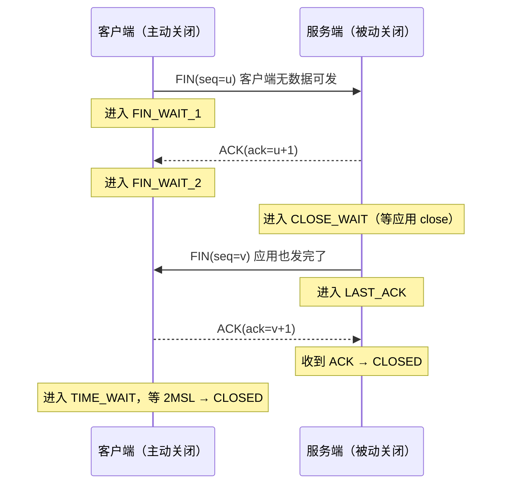

# [[TCP-深入]]

> [!tip] 学习目标
> 深入掌握 TCP 协议的工作机制，包括连接建立与终止、流量控制、拥塞控制、重传机制与性能分析，能够理解 TCP 状态机、窗口行为与抓包分析方法。

---

## 🎯 难度分段学习路径

| 难度 | 目标人群 | 核心关注 | 预估时长 |
|---|---|---|---|
| **入门** | 已知 TCP 基础概念，需系统巩固 | 连接管理、状态迁移、序列号/确认号、滑动窗口基础 | 8h |
| **进阶** | 需深入流量控制与拥塞控制 | 慢启动、拥塞避免、快重传/恢复、窗口交互、TIME_WAIT/CLOSE_WAIT | 10h |
| **高级** | 需研究算法、性能与抓包分析 | Nagle 算法、拥塞算法对比、丢包与重传、性能指标、tcpdump/Wireshark 分析 | 7h |

**总学时**：25h | **适用**：了解 TCP 基础，需深入协议细节与性能分析

---

## 📖 第一章 入门（连接管理与状态机）

### 1.1 TCP 连接管理：三次握手与四次挥手

**知识点详解**

| 过程 | 说明 | 关键标志 |
|---|---|---|
| 三次握手 | 建立连接，双方同意通信 | `SYN` → `SYN-ACK` → `ACK` |
| 四次挥手 | 终止连接，双方独立关闭 | `FIN` → `ACK`, `FIN` → `ACK` |
| 序列号/确认号 | 字节级的顺序与确认 | `Seq`, `Ack` |

**三次握手图示**

```
Client                          Server
   |                               |
   |---------- SYNseq=x ---------->|
   |<--------- SYN-ACKack=x+1 ----|
   |---------- ACKack=y+1 ------->|
   |         ESTABLISHED            |
```

**四次挥手图示**（注意状态归属：==`CLOSE_WAIT` 是被动方的状态，`TIME_WAIT` 是主动方的状态==）



> [!danger] 上一版这张图画错了
> 原图把 `CLOSE_WAIT` 标在「客户端发 FIN」那一行右侧，把 `TIME_WAIT` 标在服务端一侧 —— ==状态归属全反了==。记忆法：**`CLOSE_WAIT` 永远是被动方，`TIME_WAIT` 永远是主动方**。

> [!tip] 关键理解
> TCP 是双全工（full-duplex），连接的关闭可以是半关闭（一侧发送 FIN，另一侧仍可发送数据）。`TIME_WAIT` 与 `CLOSE_WAIT` 是排查连接堆积的常见状态。

**填空题（每章 4 道，答案见本节末尾）**

1. TCP 建立连接需要 ______ 次握手，分别交换 ______ 和 ______。
2. TCP 终止连接需要 ______ 次挥手，因为连接是 ______ 的。
3. `TIME_WAIT` 状态只出现在 ==主动关闭方==，两个作用是：等对方重传的 FIN，以及防止旧报文干扰新连接。
4. `CLOSE_WAIT` 表示 ______ 已收到 FIN 并发 ACK，但 ______ 未发 FIN。

**答案**：
1. 三, SYN, ACK
2. 四, 全双工
3. 主动关闭方, 旧报文干扰（或延迟报文）
4. 被动关闭方, 主动关闭方

---

### 1.2 TCP 状态迁移与序列号/确认号

**知识点详解**

| 状态 | 说明 | 常见原因/出现时机 |
|---|---|---|
| LISTEN | 服务端等待连接 | 服务器启动并监听端口 |
| SYN_SENT | 客户端已发送 SYN，等待 ACK | 主动发起连接 |
| SYN_RECEIVED | 服务端收到 SYN，发送 SYN-ACK | 正在建立连接 |
| ESTABLISHED | 连接已建立，数据传输中 | 正常通信状态 |
| FIN_WAIT_1 | 主动方已发 FIN，等待 ACK 或对方 FIN | 开始关闭连接 |
| FIN_WAIT_2 | 主动方收到 ACK，等待对方 FIN | 对方尚未发 FIN |
| CLOSE_WAIT | 被动方收到 FIN 并发 ACK，等待本地关闭 | 被动方未及时关闭 |
| LAST_ACK | 被动方发 FIN，等待 ACK | 被动方即将关闭 |
| TIME_WAIT | ==主动方收到对方的 FIN、回发 ACK 之后==，等待 2MSL | 防止旧报文干扰新连接；兜住对方重传的 FIN |

> [!warning] 注意
> `CLOSE_WAIT` 堆积通常是应用层问题（未及时关闭套接字/连接），而 `TIME_WAIT` 堆积是正常的高频短连接行为，除非端口耗尽或 MSL 设置不当。

**填空题**

1. 客户端发起连接后，发送 SYN 并等待 ACK 的状态是 ______。
2. 服务器收到 SYN 后，发回 SYN-ACK 进入的状态是 ______。
3. `ESTABLISHED` 状态表示连接已建立，可以进行 ______ 传输。
4. 主动关闭方是 ==收到对方的 FIN 并回发 ACK 之后== 才进入 ______ 状态，等待 2MSL。

**答案**：
1. SYN_SENT
2. SYN_RECEIVED
3. 双全工（双向）
4. TIME_WAIT

---

### 1.3 滑动窗口基础

**知识点详解**

| 概念 | 说明 | 示例 |
|---|---|---|
| 发送窗口 | 发送方可发送但尚未确认的字节范围 | `SND.WND` |
| 接收窗口（rwnd） | 接收方通告能接收的字节数 | `RCV.WND` |
| 窗口大小 | `min(拥塞窗口, 接收窗口)` | 实际发送约束 |
| 窗口滑动 | 确认到达后窗口向右移动 | 发送新数据 |
| 窗口为零 | 接收方暂时无法接收，发送方停止发送 | 零窗口探测 |

> [!tip] 记忆技巧
> 窗口是“允许发送但未确认”的字节范围。窗口大小由接收方能力（rwnd）与网络拥塞程度（cwnd）共同决定。

**填空题**

1. 接收方通过 ______ 告知发送方自己能接收的字节数。
2. 发送窗口大小受 ______ 和 ______ 共同约束。
3. 当接收窗口为 ______ 时，发送方停止发送数据。
4. 窗口“滑动”是指确认到达后，允许发送的新字节范围向 ______ 移动。

**答案**：
1. 窗口通告（接收窗口）
2. 拥塞窗口, 接收窗口
3. 0
4. 右（或前）

---

### 1.4 TCP 报文头与 MSS 协商

**知识点详解**

| 字段 | 长度 | 作用 |
|---|---|---|
| 源/目的端口 | 各 2 字节 | 标识进程（套接字） |
| 序列号 Seq | 4 字节 | ==按字节计数==，不是按报文计数 |
| 确认号 Ack | 4 字节 | 期望收到的下一个字节序号 |
| 头部长度 | 4 bit | 以 32 字节为单位，5 → 20 字节最小头 |
| 标志位 | 1 字节 | `URG ACK PSH RST SYN FIN` + NS |
| 窗口 | 2 字节 | 接收窗口 rwnd（==未启用窗口缩放时最大 65535==） |
| 校验和 | 2 字节 | 覆盖伪首部 + TCP 头 + 数据 |
| 紧急指针 | 2 字节 | 配合 URG 使用（现代应用基本不用） |

> [!tip] 为什么需要 MSS 协商
> IP 分片是糟糕的设计（丢一片全包作废，且中间设备可能禁分片）。所以在**三次握手阶段**双方各自通告 `MSS` 选项，取较小值作为该连接的 MSS，避免 IP 分片。以太网 MTU 1500 时 MSS 通常为 ==1460==（1500 − 20 IP 头 − 20 TCP 头）。

```bash
# 观察 MSS 协商
tcpdump -i any -n 'tcp[tcpflags] & tcp-syn != 0' -vv
```

**填空题**

1. TCP 的序列号是按 ==字节== 计数，而不是按报文计数。
2. 以太网 MTU 1500 时，协商出的 MSS 通常是 ______ 字节。
3. TCP 头最小长度是 ______ 字节。
4. 接收窗口字段在没有窗口缩放选项时最大为 ______。

**答案**：
1. 字节
2. 1460
3. 20
4. 65535

---

### 1.5 第一章综合练习

**填空题（本章共 4 道，答案见下方）**

1. TCP 建立连接需要 ______ 次握手，交换的标志分别是 ______ 和 ______。
2. `CLOSE_WAIT` 状态表示被动方已收到 FIN 并发 ACK，但 ______ 未发 FIN。
3. 发送窗口大小由 ______ 和 ______ 中较小者决定。
4. 客户端发起连接后进入的状态是 ______，服务器收到 SYN 后进入的状态是 ______。

**本章答案**：
1. 三, SYN, ACK
2. 本地应用（或本地套接字）
3. 拥塞窗口, 接收窗口
4. SYN_SENT, SYN_RECEIVED

**综合项目**：使用 `ss -tanp` 或 `netstat -tanp` 查看本机 TCP 连接状态分布，记录各状态的连接数，尝试解释 `ESTABLISHED`、`TIME_WAIT`、`CLOSE_WAIT` 分别代表什么，并思考哪种状态堆积可能指向应用层问题。

---

> [!tip] 常见陷阱
> 1. **混淆 TIME_WAIT 与CLOSE_WAIT**：TIME_WAIT 是主动关闭方正常行为，CLOSE_WAIT 是被动方未关闭连接的信号。
> 2. **认为三次握手是“三次消息”**：握手是三次报文交换，但每一方的状态迁移更关键。
> 3. **忽略序列号的字节语义**：序列号是按字节递增的，不是按报文计数的。
> 4. **零窗口忽略**：零窗口时发送方会发送窗口探测，防止死锁。

> [!note] 本章权威资料（链接于 2026-09-25 核验 200）
> - **RFC 9293**（TCP 规范，取代 RFC 793）：https://www.rfc-editor.org/rfc/rfc9293
> - **Linux `tcp(7)` 手册**（socket 选项与内核参数）：https://man7.org/linux/man-pages/man7/tcp.7.html
>
> > [!warning] 原视频链接已删除
> > 原 `BV1xxfs1xEBlu` 是**编造的 BV 号**（同一假号在多篇笔记里被反复当作不同主题的视频），Coursera / Udemy 路径同样无法确认对应课程。==协议问题请直接查 RFC 9293==。

---

## 📖 第二章 进阶（流量控制与拥塞控制）

### 2.1 流量控制：滑动窗口与接收窗口

**知识点详解**

| 机制 | 说明 |
|---|---|
| 流量控制目标 | 防止发送方超出接收方处理能力 |
| 接收窗口（rwnd） | 接收方根据缓冲区剩余空间通告 |
| 动态调整 | 接收方在 ACK 中通告最新窗口大小 |
| 窗口更新 | 接收方处理数据后，窗口从零/较小恢复 |

**填空题**

1. 流量控制的核心机制是 ______，由 ______ 方控制。
2. 接收方在 ______ 中通告当前可接收的字节数。
3. 当接收方处理完成数据后，通告的窗口会 ______。
4. 流量控制解决的是 ______ 与 ______ 的速度匹配问题。

**答案**：
1. 滑动窗口, 接收
2. ACK（或窗口字段）
3. 增大
4. 发送方, 接收方

---

### 2.2 拥塞控制：慢启动、拥塞避免、快重传/恢复

**知识点详解**

| 机制 | 说明 |
|---|---|
| 拥塞控制目标 | 避免网络过载，维持网络稳定 |
| 拥塞窗口（cwnd） | 发送方自行估计的网络容量 |
| 慢启动 | cwnd 从小值开始，指数增长，探测网络 |
| 拥塞避免 | 达到阈值（ssthresh）后，线性增长 |
| 快重传 | 收到三个重复 ACK 立即重传丢失报文 |
| 快恢复 | 丢包时乘性减小 cwnd，进入拥塞避免 |
| 超时重传 | RTO 超时触发重传，cwnd 拥塞门限 |

**填空题**

1. 拥塞控制是 ______ 方的自我限速，防止 ______。
2. 慢启动阶段，拥塞窗口（cwnd）呈 ______ 增长。
3. 达到阈值（ssthresh）后，cwnd 转为 ______ 增长。
4. 收到三个重复 ACK 时，TCP 触发 ______ 而不是等待超时。

**答案**：
1. 发送, 网络过载
2. 指数
3. 线性
4. 快重传

---

### 2.3 窗口交互与常见状态分析

**知识点详解**

| 现象 | 说明 | 可能原因 |
|---|---|---|
| 零窗口 | 接收方暂时无法接收，发送方停止发送 | 接收方缓冲区满 |
| 窗口探测 | 零窗口时发送方发送小探测报文 | 避免死锁，检查窗口是否恢复 |
| TIME_WAIT 堆积 | 高频短连接导致 TIME_WAIT 过多 | 正常现象，除非端口耗尽 |
| CLOSE_WAIT 堆积 | 被动方未关闭连接 | 应用未关闭套接字/连接泄漏 |

**填空题**

1. 当接收窗口为零时，发送方停止发送并可能发送 ______ 报文。
2. `TIME_WAIT` 堆积在高频短连接场景是 ______ 现象。
3. `CLOSE_WAIT` 堆积通常指向 ______ 问题。
4. 拥塞控制中，cwnd 的增长速度在慢启动阶段比拥塞避免阶段 ______。

**答案**：
1. 窗口探测（零窗口探测）
2. 正常
3. 应用层（连接未关闭/泄漏）
4. 快（指数 > 线性）

---

### 2.4 第二章综合练习

**填空题（本章共 4 道，答案见下方）**

1. 拥塞控制中，cwnd 从小值指数增长的阶段是 ______。
2. 达到阈值后，cwnd 转为 ______ 增长。
3. 收到三个重复 ACK 时触发 ______，立即重传丢失报文。
4. `CLOSE_WAIT` 状态堆积通常指向 ______ 问题。

**本章答案**：
1. 慢启动
2. 线性（拥塞避免）
3. 快重传
4. 应用层（连接未及时关闭）

**综合项目**：使用 Wireshark 或 tcpdump 捕获一次 HTTP 请求，识别：
- TCP 三次握手（SYN/SYN-ACK/ACK）
- 数据传输阶段（ACK、窗口通告）
- 如果有重传，识别是否为超时重传或快速重传
- 连接终止（FIN/ACK）与状态
将捕获到的关键报文截图或记录下来，标注 Seq/Ack 变化。

---

> [!tip] 常见陷阱
> 1. **混淆流量控制与拥塞控制**：流量控制是“接收方告诉发送方别发太快”，拥塞控制是“发送方自我限速以免压垮网络”。
> 2. **快重传误认为“一定重传”**：快重传是基于重复 ACK 的推断，适合丢失单个报文的情况。
> 3. **慢启动理解片面**：慢启动不是“慢速连接”，而是“从小窗口指数增长以探测网络”。
> 4. **状态堆积误判**：TIME_WAIT 堆积不一定是故障，CLOSE_WAIT 堆积往往是应用问题。

> [!note] 本章权威资料（链接于 2026-09-25 核验 200）
> - **RFC 5681**（拥塞控制需求与算法总览）：https://www.rfc-editor.org/rfc/rfc5681
> - **RFC 6298**（RTO 计算，RFC 2988 已废弃）：https://www.rfc-editor.org/rfc/rfc6298
> - **RFC 2018**（SACK 选择确认）：https://www.rfc-editor.org/rfc/rfc2018
> - **Linux `tcp(7)`**：https://man7.org/linux/man-pages/man7/tcp.7.html
>
> > [!warning] 原视频链接已删除（同上，`BV1xxfs1xEBlu` 为编造号）

---

## 📖 第三章 高级（算法与性能分析）

### 3.1 TCP 算法：Nagle 算法与拥塞算法对比

**知识点详解**

| 内容 | 说明 |
|---|---|
| Nagle 算法 | 合并小包减少发送次数，可能增加时延；与 `TCP_NODELAY` 选项相关 |
| 延迟 ACK | 接收方稍微延迟确认，以合并 ACK 与数据发送 |
| 拥塞算法 | 慢启动、拥塞避免、快重传/恢复是基础；不同实现有 Cubic、Reno、BBR 等变体 |
| Cubic | 基于窗口的立方函数增长，适合高带宽长距离网络 |
| BBR | 基于带宽与 RTT 建模的拥塞控制，不依赖 packet loss |

> [!tip] 关键理解
> 算法名称会随内核与实现演进，理解机制比记名字更重要：Nagle 合并小包避免效率损失，Cubic/BBR 是不同的拥塞估计策略。

**填空题**

1. 为了减少小包发送次数，TCP 可能使用 ______ 算法。
2. 与 Nagle 算法相对，禁用延迟合并的选项是 ______。
3. 现代 Linux 常用的拥塞控制算法之一是 ______。
4. BBR 算法的拥塞估计基于 ______ 与 ______，而非丢包。

**答案**：
1. Nagle（Nagle 算法）
2. TCP_NODELAY
3. BBR（或 Cubic/Reno，视环境而定）
4. 带宽, RTT（往返时间）

---

### 3.2 TCP 性能指标与抓包分析

**知识点详解**

| 指标 | 说明 | 如何观察 |
|---|---|---|
| 时延（RTT） | 数据往返时间 | ping、抓包测量 |
| 吞吐量 | 单位时间成功传输的数据量 | 抓包统计、应用测量 |
| 带宽利用率 | 实际使用带宽/可用带宽比例 | 抓包与基准对比 |
| 重传率 | 重传报文占总报文比例 | tcpdump/Wireshark 统计 |
| 窗口变化 | 接收窗口与拥塞窗口变化 | 抓包中窗口字段跟踪 |
| 丢包 | 网络中丢失的报文 | 重传、重复 ACK 等间接指标 |

> [!warning] 注意
> 抓包只能看到看到的流量，加密后应用层内容不可见（除非有密钥/解密配置）。不能代替应用层日志，但能帮助理解传输行为。

**填空题**

1. TCP 性能分析的关键指标包括 ______、______、______。
2. 重传触发方式包括 ______ 重传与基于重复 ACK 的 ______ 重传。
3. 分析 TCP 行为最直接的工具是 ______ 或 ______。
4. 加密通信（如 TLS）中，抓包看到的是 ______ 数据，无法看到应用层内容。

**答案**：
1. 时延（RTT）、吞吐量、重传率（任选三项）
2. 超时, 快速（快重传）
3. tcpdump, Wireshark
4. 加密

---

### 3.3 抓包实战：TCP 流分析

**知识点详解**

| 场景 | 观察重点 | 提示 |
|---|---|---|
| 连接建立 | SYN/SYN-ACK/ACK 顺序、Seq/Ack初始值 | 过滤 `tcp.flags.syn==1` |
| 数据传输 | ACK 确认、窗口通告、Seq 递增 | 关注 `tcp.analysis.bytes_in_flight` |
| 重传 | 重传报文、重复 ACK、窗口变化 | 过滤 `tcp.analysis.retransmission` |
| 连接终止 | FIN/ACK 交换、状态变化 | 关注 `tcp.flags.fin==1` |
| 异常 | RST、零窗口、窗口探测 | 过滤 `tcp.flags.reset==1` |

**填空题**

1. 用 Wireshark 识别 TCP 重传时，可使用预定义分析 ______。
2. 过滤 TCP SYN 报文的 Wireshark 表达式常见形式是 `tcp.flags.syn==______`
3. 抓包中看到大量重复 ACK，可能表示 ______ 发生。
4. 连接异常终止时，TCP 可能发送 ______ 标志报文。

**答案**：
1. 规则（重传分析）
2. 1
3. 丢包（或快速重传触发）
4. RST（复位）

---

### 3.4 现代 TCP 的扩展机制

| 机制 | 解决什么 | RFC | 备注 |
|---|---|---|---|
| **窗口缩放（Window Scale）** | 64KB 窗口在高 BDP 链路上不够 | RFC 7323 | 三次握手协商，左移位数；高带宽×长肥管道必需 |
| **SACK（选择确认）** | 多包丢失时不必全部重传 | RFC 2018 | 发送方能知道**具体丢了哪些块** |
| **ECN** | 拥塞发生在缓冲区溢出前 | RFC 7414 | 路由器打标而非丢包，靠 L4S/DSCP 使用 |
| **校验和可省略** | 减少隧道/硬件卸载场景开销 | RFC 6928 | 仅在确认链路层可靠时允许省略 |
| **Keep-Alive** | 发现死连接 | — | 默认 2 小时太长，实践常调到 30-60s |

> [!tip] 高频面试题：为什么 BDP 大的链路上必须开窗口缩放？
> `BDP = 带宽 × RTT`。10 Gbps × 100ms = 125 MB，==远大于 64KB 的 16 位窗口==，发送方会被窗口卡死。窗口缩放把窗口扩展到 32 位（最大 1 GB）才能跑满链路。

**填空题**

1. 窗口缩放选项由 ______ 规范定义，用于突破 64KB 窗口上限。
2. SACK 让发送方知道具体丢失了哪些 ______。
3. ECN 的作用是让路由器在缓冲区溢出前给报文 ______ 标记。
4. 扩展协商一般在哪个阶段完成？==三次握手==。

**答案**：
1. RFC 7323
2. 块（数据段）
3. 拥塞
4. 三次握手

---

### 3.5 Socket 选项与内核调参

| 选项 | 作用 | 何时用 |
|---|---|---|
| `SO_REUSEADDR` | 允许绑定处于 TIME_WAIT 的端口 | 服务重启必开 |
| `TCP_NODELAY` | 关闭 Nagle，小包立即发 | ==交互式/低延迟场景==（Redis 等默认开） |
| `SO_KEEPALIVE` | 启用 TCP keep-alive | 长连接保活（需配内核间隔，见下） |
| `TCP_USER_TIMEOUT` | 未确认数据的最长存活时间 | 防止半开连接卡死业务 |

```bash
# 系统层看与调（容器内 2GB 机器同样适用）
sysctl net.ipv4.tcp_congestion_control   # 拥塞算法：cubic / bbr
sysctl net.ipv4.tcp_tw_reuse             # 是否允许 TIME_WAIT 端口复用
cat /proc/sys/net/ipv4/ip_local_port_range  # 临时端口范围，影响连接上限
ss -s                                        # 连接状态总览
```

> [!warning] 调参前的三思
> `tcp_fin_timeout` 控制的是 `FIN_WAIT_2` 超时，==**不是** TIME_WAIT==（这是最常见的误解）。缩短 TIME_WAIT 属于违背协议语义的行为，优先从**连接复用**和**减少短连接**入手。

**填空题**

1. 服务重启时绑定报 `Address already in use`，应查 `SO_______`。
2. 关闭 Nagle 算法、改善交互式响应延迟的 socket 选项是 `TCP_______`。
3. 查看系统拥塞控制算法的命令是 `sysctl net.ipv4.tcp_______`。
4. `tcp_fin_timeout` 控制的其实是 `FIN_WAIT_2`，==不是== `TIME_WAIT`。

**答案**：
1. REUSEADDR
2. NODELAY
3. congestion_control
4. 不是 TIME_WAIT

---

### 3.6 第三章综合练习

**填空题（本章共 4 道，答案见下方）**

1. 为了减少小包发送次数可能使用 ______ 算法，禁用该合并的选项是 ______。
2. TCP 性能分析的关键指标包括 ______、______、______。
3. Wireshark 中识别重传时可使用 ______ 分析功能。
4. 拥塞控制中，cwnd 从小值指数增长的阶段是 ______，达到阈值后转为 ______ 增长。

**本章答案**：
1. Nagle, TCP_NODELAY
2. 时延（RTT）、吞吐量、重传率（任选三项）
3. 重传（或重传分析）
4. 慢启动, 线性（拥塞避免）

**综合项目**：完成一次 TCP 性能观察实战：
1. 用 `tcpdump` 或 Wireshark 捕获一次 HTTP/HTTPS 请求；
2. 识别握手阶段 Seq/Ack 初始值与交换；
3. 观察数据传输阶段窗口通告大小与 ACK；
4. 检查是否有重传（超时或快速重传），记录重传率；
5. 观察连接终止阶段 FIN/ACK 交换与状态；
6. 将观察结果写成简要分析：连接建立是否正常、窗口大小是否合理、是否有异常重传、连接终止是否干净。

---

> [!tip] 常见陷阱
> 1. **抓包看不到应用层明文**：HTTPS 下抓包看到的是加密流量，不能直接看到 HTTP 内容，除非配置解密。
> 2. **算法名字混淆**：拥塞算法会随内核演进（Cubic/BBR/Reno 等），应理解机制而非死记当前默认。
> 3. **Nagle 误认为“总是好”**：Nagle 合并小包减少开销，但也可能增加时延；交互式场景常禁用。
> 4. **性能只有带宽一种指标**：还受 RTT、丢包率、窗口大小、算法策略影响。

> [!note] 本章权威资料（链接于 2026-09-25 核验 200）
> - **RFC 7323**（TCP 窗口缩放选项，解决 64KB 窗口上限）：https://www.rfc-editor.org/rfc/rfc7323
> - **RFC 6928**（TCP 校验和可省略的改进）：https://www.rfc-editor.org/rfc/rfc6928
> - **RFC 7414**（ECN 显式拥塞通知）：https://www.rfc-editor.org/rfc/rfc7414
> - **Wireshark 官方文档**：https://www.wireshark.org/docs/wsug_html_chunked/
> - **Linux `tcp(7)`**：`sysctl net.ipv4.tcp_*` 全部参数：https://man7.org/linux/man-pages/man7/tcp.7.html
>
> > [!warning] 原视频链接已删除（同上，`BV1xxfs1xEBlu` 为编造号）

---

## 📚 关联笔记

- `[[计算机网络基础]]` - 网络基础概念（分层、IP/子网、HTTP/TCP/UDP基础、安全初识）
- `[[HTTP-详解]]` - HTTP 协议详解（缓存、状态码、HTTP/2/3、实战）
- `[[TLS-与证书安全]]` - TLS/HTTPS 与证书安全（握手、PFS、证书链、吊销）
- `[[网络诊断与安全]]` - 网络诊断工具与安全（Wireshark/tcpdump、攻击与防御）

## ⚡ 速查表

| 现象 / 场景 | 命令 / 结论 |
|---|---|
| 连接状态分布 | `ss -tan \| awk '{print $1}' \| sort \| uniq -c` |
| 端口占用 | `ss -tunap` |
| 抓握手 | `tcpdump -i any -n 'tcp[tcpflags] & tcp-syn != 0' -vv` |
| 抓指定连接 | `tcpdump -i any -n 'host 1.1.1.1 and port 443' -A` |
| 拥塞算法 | `sysctl net.ipv4.tcp_congestion_control` |
| 临时端口范围 | `cat /proc/sys/net/ipv4/ip_local_port_range` |
| TIME_WAIT 数量 | `ss -tan state time-wait \| wc -l` |
| 强制 TIME_WAIT 复用 | `net.ipv4.tcp_tw_reuse=1`（==仅出站连接，且有前提条件==） |
| MSS 通常值 | 1500 − 20 − 20 = **1460** |
| 头部最小/最大 | 最小 20 字节；最大 60 字节（带选项） |
| TIME_WAIT 归属 | ==主动关闭方==，等 2MSL（Linux 常见 60s） |
| CLOSE_WAIT 归属 | ==被动关闭方==，堆积 = 应用没 close |

## ❓ 常见问题

> [!faq]- Q：TIME_WAIT 太多怎么解决？
> A：顺序是 ① 用**长连接/连接池**减少短连接（根治）→ ② 扩临时端口范围 `ip_local_port_range` → ③ 谨慎评估 `tcp_tw_reuse`。==不要去缩短 `tcp_fin_timeout`，它管的是 FIN_WAIT_2==。

> [!faq]- Q：为什么服务端看到大量 CLOSE_WAIT？
> A：==对端已关闭，本端应用没有 close==。几乎 100% 是应用侧 bug 或卡死：忘记 close、异常路径没走 finally、连接池没归还。

> [!faq]- Q：抓包看到 `Window Full` / `Zero Window` 分别说明什么？
> A：`Window Full` = 发送方把接收窗口用满了（接收方来不及读，应用处理慢）；`Zero Window` = 接收方==应用没及时读取缓冲区==，发送方应停止并做窗口探测。

> [!faq]- Q：为什么高带宽链路上吞吐上不去？
> A：优先查 ==BDP 与窗口==（是否开窗口缩放）、是否有多丢包导致重传、RTT 是否被 bufferbloat 拉高。用 `iperf3` 做基线，别只凭 `curl` 的速度判断。

---

*由 Hermes Agent 创建于 2026-09-17 · 更新于 2026-09-25 · 状态：进行中*