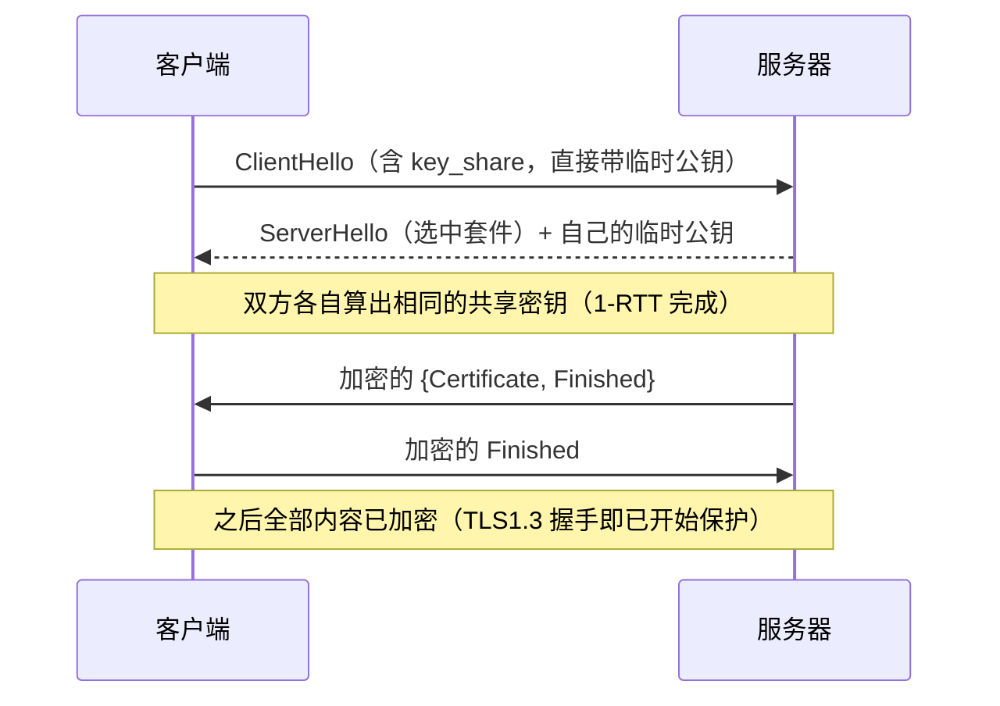

# [[TLS-与证书安全]]

> [!tip] 学习目标
> 深入掌握 TLS/HTTPS 的工作原理，包括对称/非对称加密基础、证书与 CA 体系、TLS 握手流程、TLS 1.2 与 1.3 的差异、前向保密、证书链验证与吊销机制。

---

## 🎯 难度分段学习路径

| 难度 | 目标人群 | 核心关注 | 预估时长 |
|---|---|---|---|
| **入门** | 已知 HTTPS 概念，需系统巩固 | 加密基础、证书/CA 概念、TLS 握手概览、HTTPS 意义 | 8h |
| **进阶** | 需深入握手流程、证书链、PFS | 握手步骤、会话密钥生成、前向保密、证书链验证 | 10h |
| **高级** | 需研究 TLS 1.3、吊销、会话复用 | TLS 1.3 改进、0-RTT/1-RTT、证书吊销（CRL/OCSP）、会话票证、连接迁移与安全权衡 | 7h |

**总学时**：25h | **适用**：了解 HTTPS 概念，需深入 TLS 协议细节与证书安全

---

## 📖 第一章 入门（加密基础与证书概念）

### 1.1 加密基础：对称与非对称

**知识点详解**

| 类型 | 说明 | 典型用途 |
|---|---|---|
| 对称加密 | 加密/解密使用同一密钥，速度快 | 数据传输加密 |
| 非对称加密 | 公钥加密、私钥解密（或私钥签名、公钥验证），速度慢 | 密钥协商、身份认证、签名 |
| 混合加密 | 非对称协商/认证 + 对称传输加密 | TLS 典型模式 |

> [!tip] 记忆技巧
> TLS 中“慢的部分”（非对称）用于建立安全通道，“快的部分”（对称）用于实际数据传输。

**填空题（每章 4 道，答案见本节末尾）**

1. 加密与解密使用同一密钥的加密方式是 ______ 加密。
2. 公钥加密、私钥解密（或反向签名）的加密方式是 ______ 加密。
3. TLS 典型模式是 ______ 加密用于协商/认证，______ 加密用于数据传输。
4. 非对称加密的核心优势是解决了 ______ 问题。

**答案**：
1. 对称
2. 非对称
3. 非对称, 对称
4. 密钥分发（或密钥交换）

---

### 1.2 证书与 CA 体系基础

**知识点详解**

| 概念 | 说明 |
|---|---|
| 证书 | 由 CA 签发，绑定域名与公钥，包含签名、有效期等 |
| CA（证书颁发机构） | 受信任的实体，签发与验证证书 |
| 信任链 | 根 CA → 中间 CA → 站点证书，浏览器预置受信根 |
| 公钥基础设施（PKI） | 证书生命周期管理的体系（签发、验证、吊销等） |
| 证书内容 | subject、issuer、公钥、有效期、签名、扩展字段等 |

**填空题**

1. TLS 中服务器向客户端出示 ______ 以证明身份。
2. 证书由 ______ 签发，受信任的根 CA 通常预置在 ______。
3. 证书绑定的是 ______ 与 ______。
4. 从根 CA 到站点证书的链条称为 ______。

**答案**：
1. 证书
2. CA, 浏览器/客户端
3. 域名, 公钥
4. 信任链（或证书链）

---

### 1.3 TLS 握手目标与概览

**知识点详解**

| 目标 | 说明 |
|---|---|
| 身份认证 | 验证服务器（与可选的客户端）身份 |
| 加密套件协商 | 双方确认使用的算法组合（密钥交换、认证、对称加密、MAC 等） |
| 会话密钥生成 | 双方协商生成用于数据传输的对称密钥 |
| 安全通道建立 | 协商完成后，通信进入加密状态 |

> [!warning] 注意
> TLS 握手不仅是“加密”，还包括身份验证与算法协商；不同版本握手次数与流程有差异。

**填空题**

1. TLS 握手的主要目标之一是为双方协商生成 ______。
2. TLS 中用于数据传输加密的密钥通常是 ______ 加密密钥。
3. TLS 握手过程中，服务器出示 ______ 以证明其身份。
4. TLS 协商的算法组合称为 ______。

**答案**：
1. 会话密钥
2. 对称
3. 证书
4. 加密套件（Cipher Suite）

---

### 1.4 HTTPS 与 TLS 的关系

**知识点详解**

| 内容 | 说明 |
|---|---|
| HTTPS | HTTP + TLS（或 SSL）加密传输 |
| 默认端口 | 443 |
| 保护范围 | 传输中的机密性与完整性，服务器身份验证 |
| 局限 | 不防御钓鱼站点、客户端side漏洞、应用逻辑漏洞 |

**填空题**

1. HTTPS 是在 ______ 协议基础上增加 ______ 加密传输。
2. HTTPS 默认使用端口 ______。
3. HTTPS 保护的是 ______ 中的机密性与完整性。
4. HTTPS 无法防御 ______ 站点或 ______ 漏洞。

**答案**：
1. HTTP, TLS（或 SSL）
2. 443
3. 传输（传输过程）
4. 钓鱼, 客户端（或应用逻辑）

---

### 1.5 第一章综合练习

**填空题（本章共 4 道，答案见下方）**

1. TLS 中用于数据传输加密的密钥通常是 ______ 加密密钥。
2. 证书由 ______ 签发，受信任的根 CA 通常预置在 ______。
3. TLS 握手的主要目标之一是为双方协商生成 ______。
4. HTTPS 是在 ______ 协议基础上增加 ______ 加密传输。

**本章答案**：
1. 对称
2. CA, 浏览器/客户端
3. 会话密钥
4. HTTP, TLS（或 SSL）

**综合项目**：使用浏览器开发者工具（Security 面板）或 `curl -v` 访问一个 HTTPS 网站，记录：
- 证书颁发机构（Issuer）
- 证书有效期（Not Before / Not After）
- 是否使用 TLS（Security 面板或地址栏锁图标）
- 连接协议版本（如 TLS 1.2 或 TLS 1.3，若有显示）
将记录结果整理成一份简要证书与 TLS 分析。

---

> [!tip] 常见陷阱
> 1. **证书有效 ≠ 站点可信**：证书只证明“站点拥有对应私钥”，不保证业务安全或内容真实性。
> 2. **混淆对称与非对称**：对称用于数据传输（速度快），非对称用于协商/认证（解决密钥分发）。
> 3. **HTTPS ≠ 完全安全**：HTTPS 保护传输机密性与完整性，但无法防御钓鱼、客户端被控、应用漏洞。
> 4. **证书过期忽视**：证书有效期是安全控制的一环，过期证书会导致连接失败。

> [!note] 本章权威资料（链接于 2026-09-25 核验 200）
> - **RFC 5280**（证书与路径验证）：https://www.rfc-editor.org/rfc/rfc5280
> - **RFC 8446**（TLS 1.3 规范）：https://www.rfc-editor.org/rfc/rfc8446
> - **OWASP TLS Cheat Sheet**（配置基线最实用）：https://cheatsheetseries.owasp.org/cheatsheets/Transport_Layer_Security_Cheat_Sheet.html
> - **Let's Encrypt 文档**（免费证书与自动续期）：https://letsencrypt.org/docs/
>
> > [!warning] 原视频链接已删除
> > `BV1xxfs1xEBlu` 是编造 BV 号，Coursera / Udemy 路径无法确认课程，==均属凭空生成==。证书问题查 RFC 5280，配置基线查 OWASP。

---

## 📖 第二章 进阶（握手流程、证书链与前向保密）

### 2.1 TLS 握手流程深入（以 TLS 1.2 为例）

**知识点详解**

| 步骤 | 说明 |
|---|---|
| ClientHello | 客户端发送支持的协议版本、加密套件、随机数等 |
| ServerHello | 服务器确认版本、套件，发送随机数 |
| 证书交换 | 服务器发送证书（与可选中间 CA） |
| 密钥交换 | 两种本质不同的方式：<br>① **RSA 密钥传输**：客户端自己生成预主密钥，用服务器证书的**公钥加密**后发出（单向，无 PFS）<br>② **(EC)DHE 协商**：双方各出临时公钥，各自算出同一份共享密钥（==有 PFS==） |
| 会话密钥生成 | 双方基于共享信息生成对称会话密钥 |
| Finished | 握手完成，进入加密通信 |

> [!tip] 关键理解
> TLS 握手 = **协商 + 认证 + 密钥生成**。TLS 1.2 完整握手 ==2-RTT==（会话恢复 1-RTT）。
>
> > [!danger] 上一版这里写错了（已修）
> > 原文把「RSA、DH、ECDH」并列成「双方协商预主密钥」。==RSA 不是协商==：客户端单方面生成预主密钥并用服务器公钥加密，服务器解密即可 —— 由于**没有临时密钥**，一旦服务器私钥泄露，攻击者可以回溯解密所有历史流量，这就是 RSA 密钥交换**不提供前向保密**的根因。TLS 1.3 正是因此**彻底移除了 RSA 密钥传输**。

### 2.1.1 TLS 版本演进与各版本重灾区

| 版本 | 年份 | 状态 | 著名问题 |
|---|---|---|---|
| SSL 2.0 / 3.0 | 1995/1996 | ❌ 已废弃 | DROWN、POODLE |
| TLS 1.0 / 1.1 | 1999/2006 | ❌ 建议禁用 | BEAST，无 AEAD |
| TLS 1.2 | 2008 | ⚠️ 仅保留 ECDHE-AEAD 套件 | 需关掉 RSA 密钥交换与 CBC |
| TLS 1.3 | 2018 | ✅ 推荐 | 1-RTT、强制 PFS、仅 5 种 AEAD 套件 |



**填空题**

1. TLS 握手中，客户端首先发送 ______ 消息。
2. 服务器向客户端发送 ______ 以证明身份。
3. 双方协商生成用于数据传输的密钥称为 ______。
4. TLS 握手完成后，通信进入 ______ 状态。

**答案**：
1. ClientHello
2. 证书
3. 会话密钥
4. 加密（加密通信）

---

### 2.2 证书链验证

**知识点详解**

| 验证内容 | 说明 |
|---|---|
| 签名验证 | 证书签名是否由上级 CA 正确签署 |
| 有效期 | 证书是否在有效期内 |
| 主题与域名 | 证书绑定的域名是否匹配 |
| 信任锚 | 最终是否可溯源到受信根 CA |
| 中间 CA | 站点证书可能由中间 CA 签发，需传递验证 |

**填空题**

1. 验证证书链时，需校验 ______、有效期、域名匹配与签名链。
2. 站点证书可能由 ______ CA 签发，需传递验证至根。
3. 证书链验证的终点是受信 ______。
4. 证书过期或域名不匹配会导致 ______。

**答案**：
1. 签名
2. 中间
3. 根 CA（信任锚）
4. 验证失败（或连接错误）

---

### 2.3 前向保密（PFS）与密钥交换

**知识点详解**

| 概念 | 说明 |
|---|---|
| 前向保密（PFS） | 每次会话使用独立密钥，即使长期私钥泄露也不影响历史会话 |
| 实现方式 | 常通过 Diffie-Hellman（DH/ECDH）密钥交换实现 |
| 安全意义 | 长期密钥泄露后，历史加密流量仍难以解密 |
| TLS 1.3 默认 | 多数情况下默认提供 PFS（取决于套件） |

**填空题**

1. ______ 是指每次会话使用独立密钥，即使长期私钥泄露也不影响历史会话。
2. 前向保密常通过 ______ 密钥交换实现。
3. 长期私钥泄露后，历史会话仍安全的前提是使用了 ______。
4. TLS 1.3 通常默认提供 ______。

**答案**：
1. 前向保密（PFS）
2. Diffie-Hellman（或 DH/ECDH）
3. 前向保密
4. 前向保密（PFS）

---

### 2.4 第二章综合练习

**填空题（本章共 4 道，答案见下方）**

1. TLS 握手中，客户端首先发送 ______ 消息。
2. 验证证书链时，需校验 ______、有效期、域名匹配与签名链。
3. ______ 是指每次会话使用独立密钥，即使长期私钥泄露也不影响历史会话。
4. 长期私钥泄露后，历史会话仍安全的前提是使用了 ______。

**本章答案**：
1. ClientHello
2. 签名
3. 前向保密（PFS）
4. 前向保密（PFS）

**综合项目**：使用浏览器开发者工具（Security 面板）或 `openssl s_client`（若有环境）或在线 TLS 检查工具，观察：
- 连接使用的 TLS 版本（1.2 或 1.3）
- 服务器出示的证书颁发机构（Issuer）
- 证书信任链是否完整（是否有中间 CA）
- 是否支持前向保密（部分工具可显示套件）
将观察结果整理成一份 TLS 连接分析。

---

> [!tip] 常见陷阱
> 1. **握手次数混淆**：TLS 1.2 通常两次往返，TLS 1.3 更少；不要死记“一定两次”。
> 2. **证书链不完整**：缺少中间 CA 可能导致部分客户端验证失败。
> 3. **PFS 误解**：PFS 保护的是“历史会话”，但不防止当前会话密钥泄露。
> 4. **证书与域名不匹配**：证书绑定域名，子域名需要单独证书或通配符证书。

> [!note] 本章权威资料（链接于 2026-09-25 核验 200）
> - **RFC 8446** §4.1.1：为什么 1-RTT 就够（ClientHello 里已带 `key_share`）：https://www.rfc-editor.org/rfc/rfc8446
> - **RFC 5280** §6 证书路径验证：https://www.rfc-editor.org/rfc/rfc5280
> - **OWASP TLS Cheat Sheet**（推荐套件顺序）：https://cheatsheetseries.owasp.org/cheatsheets/Transport_Layer_Security_Cheat_Sheet.html
>
> > [!warning] 原视频链接已删除（同上）

---

## 📖 第三章 高级（TLS 1.3、吊销、会话复用）

### 3.1 TLS 1.3 改进与握手优化

**知识点详解**

| 改进 | 说明 |
|---|---|
| 更少往返 | 握手流程简化，减少延迟 |
| 默认安全 | 移除不安全算法，默认前向保密 |
| 密钥协商 | 更现代的密钥交换机制 |
| 0-RTT/1-RTT | 在某些情况下支持更快的连接建立（0-RTT 有重放风险） |
| 加密范围 | 更多握手内容加密，减少中间可见信息 |

**填空题**

1. TLS 1.3 相比 1.2 通常减少了 ______ 次往返，握手更快。
2. TLS 1.3 默认提供 ______，防止长期密钥泄露后解密历史会话。
3. TLS 1.3 移除了 ______ 的不安全算法。
4. 0-RTT 握手可能带来 ______ 风险，需谨慎使用。

**答案**：
1. 往返（往返次数）
2. 前向保密（PFS）
3. 旧版/不安全算法（如 RSA 密钥交换等）
4. 重放（Replay）

---

### 3.2 证书吊销机制：CRL 与 OCSP

**知识点详解**

| 机制 | 说明 | 特点 |
|---|---|---|
| CRL | 证书吊销列表，定期发布吊销证书清单 | 可能过期、列表较大 |
| OCSP | 在线证书状态协议，实时查询证书状态 | 实时性更好，可能有隐私/性能权衡 |
| OCSP Stapling | 服务器主动提供 OCSP 响应，减少客户端查询 | 改善性能与隐私 |
| 吊销意义 | 证书泄露、滥用、错误签发等情况下停止信任 |

**填空题**

1. 证书吊销列表的英文缩写是 ______。
2. 实时查询证书状态的在线协议是 ______。
3. ______ 是服务器主动提供 OCSP 响应，减少客户端查询。
4. 证书吊销通常用于处理 ______ 或 ______ 等情况。

**答案**：
1. CRL
2. OCSP
3. OCSP Stapling（或OCSP 装订）
4. 证书泄露, 错误签发（或滥用）

---

### 3.3 会话复用与连接优化

**知识点详解**

| 机制 | 说明 |
|---|---|
| 会话 ID | 服务器分配会话标识，客户端可复用会话参数 |
| 会话票证（Session Ticket） | 加密票证存储会话信息，客户端可恢复会话 |
| 复用意义 | 减少重复握手开销，加快连接建立 |
| 安全权衡 | 复用需注意密钥管理、票证保护、重放风险 |

**填空题**

1. TLS 会话复用可减少 ______ 握手开销。
2. 会话复用的一种方式是使用 ______ 存储会话信息。
3. ______ 是服务器主动提供 OCSP 响应，减少客户端查询。
4. 复用需注意 ______ 管理与重放风险。

**答案**：
1. 重复
2. 会话票证（Session Ticket）
3. OCSP Stapling（或OCSP 装订）
4. 密钥（或票证）

---

### 3.4 TLS 与网络安全整体视角

**知识点详解**

| 内容 | 说明 |
|---|---|
| 纵深防御 | TLS 保护传输，但应用层、认证、授权、监控也需到位 |
| 中间人防御 | 严格证书验证、HSTS、避免降级攻击 |
| 降级攻击 | 攻击者试图让通信使用较弱协议/套件 |
| 敏感数据 | TLS 保护传输，但端点安全与密钥管理同样重要 |

**填空题**

1. TLS 保护的是 ______ 中的机密性与完整性。
2. 防止中间人攻击的关键包括 ______ 验证与 ______。
3. 攻击者试图让通信使用较弱协议/套件称为 ______。
4. TLS 是 ______ 防御的一环，还需应用层、认证、监控配合。

**答案**：
1. 传输（传输过程）
2. 证书, HSTS（或严格验证）
3. 降级攻击
4. 纵深（多层）

---

### 3.5 实战：证书检查、nginx 基线配置与排错

**知识点详解：命令行实测**

```bash
# 1) 看证书链、有效期、签名算法
openssl s_client -connect example.com:443 -servername example.com </dev/null 2>/dev/null \
  | openssl x509 -noout -text | head -40

# 2) 关键字段速查
openssl s_client -connect example.com:443 -servername example.com </dev/null 2>/dev/null \
  | openssl x509 -noout -subject -issuer -dates -ext subjectAltName

# 3) 看协商到的版本与套件
openssl s_client -connect example.com:443 -servername example.com </dev/null 2>&1 \
  | grep -E 'Protocol|Cipher|ALPN|Verify return code'

# 4) 只支持 TLS 1.3 测试
openssl s_client -tls1_3 -connect example.com:443 -servername example.com </dev/null

# 5) 证书链是否完整（含中间证书）
openssl s_client -showcerts -connect example.com:443 -servername example.com </dev/null
```

> [!warning] 三个字段必看
> `-servername` 一定要传（SNI），否则测到的是默认站点；`Verify return code: 0 (ok)` 才说明链验证通过；`subjectAltName` 里必须有你的域名（现代浏览器已不再看 CN）。

**nginx TLS 基线配置**

```nginx
server {
    listen 443 ssl;
    server_name example.com;

    ssl_certificate     /etc/letsencrypt/live/example.com/fullchain.pem;
    ssl_certificate_key /etc/letsencrypt/live/example.com/privkey.pem;
    ssl_protocols       TLSv1.2 TLSv1.3;            # 关掉 1.0/1.1
    ssl_prefer_server_ciphers off;                  # TLS1.3 由客户端选更合适
    ssl_session_cache   shared:SSL:10m;
    ssl_session_timeout 1d;
    ssl_stapling on;                                # 减少客户端 OCSP 查询
    add_header Strict-Transport-Security "max-age=31536000; includeSubDomains" always;

    location / { root /var/www/html; index index.html; }
}
```

| 配套机制 | 作用 | 缺了会怎样 |
|---|---|---|
| **HSTS** | 强制后续一律 HTTPS | 用户可被诱导降级到明文 HTTP |
| **证书自动续期** | certbot / ACME 定时续签 | 证书过期 → 全站报错 |
| **mTLS** | 客户端也要证书 | 内部服务间无身份验证 |
| **SNI** | 一个 IP 承载多域名 | 测错站点、反代 502 |
| **ALPN** | 协商 h2 / http/1.1 | 性能白白损失 |
| **混合内容** | HTTPS 页面引用 HTTP 资源 | 浏览器直接拦截并告警 |

```bash
# 自动续期（certbot 装完后）
systemctl list-timers | grep certbot   # 确认定时任务
certbot renew --dry-run                # 手动演练，避免真到期才发现失败
```

**常见报错对照表**

| 现象 | 原因 | 处理 |
|---|---|---|
| `CERTIFICATE_VERIFY_FAILED` | 链不全 / 过期 / 域名不符 | 发 `fullchain.pem`，检查 SAN |
| `ERR_CERT_DATE_INVALID` | 过期或服务器时间错 | 续签；查 `timedatectl` |
| `SSL_ERROR_SYSCALL` / `handshake failure` | 协议版本或套件不兼容 | 检查 `ssl_protocols` |
| 只在旧设备失败 | 设备只支持 TLS 1.0 | 别妥协安全基线，淘汰旧设备 |
| 混合内容警告 | HTTPS 页面引 HTTP 资源 | 全部改 https 或用协议相对路径 |

**填空题**

1. 用 `openssl s_client` 测虚拟主机时必须加 `-______` 才能命中正确站点。
2. 判断证书链验证是否通过，看 `Verify return code: 0 ( ______ )`。
3. `ssl_protocols TLSv1.2 TLSv1.3;` 的作用是 ==禁用== 旧的不安全版本。
4. 浏览器已不再依据证书的 CN 字段匹配域名，而是看 ______。

**答案**：
1. servername
2. ok
3. 禁用
4. subjectAltName（SAN）

---

### 3.6 第三章综合练习

**填空题（本章共 4 道，答案见下方）**

1. TLS 1.3 相比 1.2 通常减少了 ______ 次往返，握手更快。
2. 证书吊销列表的英文缩写是 ______。
3. 实时查询证书状态的在线协议是 ______。
4. ______ 是指每次会话使用独立密钥，即使长期私钥泄露也不影响历史会话。

**本章答案**：
1. 往返（往返次数）
2. CRL
3. OCSP
4. 前向保密（PFS）

**综合项目**：使用浏览器开发者工具、在线 TLS 检查工具或 `openssl s_client`（若有环境），完成一份 TLS 深度分析：
1. 连接使用的 TLS 版本（1.2 或 1.3）
2. 服务器出示的证书颁发机构（Issuer）与证书链是否完整
3. 是否支持前向保密（部分工具可显示套件）
4. 证书有效期（Not Before / Not After）
5. 如果工具支持，记录是否有 OCSP Stapling 或会话复用信息
将观察结果整理成一份 TLS 1.2/1.3 与证书安全分析报告。

---

> [!tip] 常见陷阱
> 1. **TLS 版本混淆**：TLS 1.2 与 1.3 握手、算法默认、PFS 支持都有差异，不要混用描述。
> 2. **吊销状态误判**：CRL 可能过期，OCSP 可能被阻断或延迟，实际信任决策可能受策略影响。
> 3. **0-RTT 风险忽视**：0-RTT 可能带来重放风险，敏感操作不宜依赖 0-RTT。
> 4. **证书 ≠ 安全全部**：TLS 保护传输，但不防御钓鱼、客户端漏洞、应用逻辑漏洞。

> [!note] 本章权威资料（链接于 2026-09-25 核验 200）
> - **RFC 8996**（废弃的 TLS 1.0/1.1 套件清单）：https://www.rfc-editor.org/rfc/rfc8996
> - **RFC 6960**（OCSP）：https://www.rfc-editor.org/rfc/rfc6960
> - **RFC 6962**（证书透明 CT）：https://www.rfc-editor.org/rfc/rfc6962
> - **RFC 6066**（TLS 扩展：SNI / ALPN 等）：https://www.rfc-editor.org/rfc/rfc6066
> - **OWASP TLS Cheat Sheet**：https://cheatsheetseries.owasp.org/cheatsheets/Transport_Layer_Security_Cheat_Sheet.html
>
> > [!warning] 原视频链接已删除（同上）

---

## 📚 关联笔记

- `[[计算机网络基础]]` - 网络基础概念（分层、IP/子网、HTTP/TCP/UDP基础、安全初识）
- `[[TCP-深入]]` - TCP 协议深度解析（连接管理、流量控制、拥塞控制、算法与性能）
- `[[HTTP-详解]]` - HTTP 协议详解（缓存、状态码、HTTP/2/3、实战）
- `[[网络诊断与安全]]` - 网络诊断工具与安全（Wireshark/tcpdump、攻击与防御）

## ⚡ 速查表

| 场景 | 命令 / 首部 |
|---|---|
| 看证书链与有效期 | `openssl s_client -connect host:443 -servername host </dev/null \| openssl x509 -noout -text` |
| 看 SAN（域名） | 同上加 `-ext subjectAltName` |
| 看协商版本与套件 | `openssl s_client -connect host:443 -servername host </dev/null 2>&1 \| grep -E 'Protocol\|Cipher'` |
| 看证书链完整性 | `openssl s_client -showcerts -connect host:443 -servername host` |
| 强制 1.3 测 | `openssl s_client -tls1_3 -connect host:443` |
| 测站点支持套件（在线） | https://www.ssllabs.com/ssltest/ |
| 强制浏览器 HTTPS | `Strict-Transport-Security: max-age=31536000; includeSubDomains` |
| 续期演练 | `certbot renew --dry-run` |
| 推荐协议 | `ssl_protocols TLSv1.2 TLSv1.3;` |
| TLS 1.2 应禁用 | `TLS_RSA_*`（无 PFS）、CBC 套件、RC4/3DES/MD5 |
| 1-RTT 由来 | ClientHello 直接带 `key_share` 临时公钥 |
| 0-RTT 代价 | 无前向保密 + ==可重放== |

## ❓ 常见问题

> [!faq]- Q：有证书就等于安全吗？
> A：证书只证明「这个域名背后的服务端持有对应私钥」。它不保证业务逻辑安全、服务器没有被入侵，也不防钓鱼。

> [!faq]- Q：为什么必须传 `-servername`？
> A：它是 SNI 扩展。同一 IP 承载多个域名时，不传就会拿到默认站点证书，验证结果没意义。

> [!faq]- Q：TLS 1.3 一定更快吗？
> A：握手从 2-RTT 降到 1-RTT（复用 PSK 时可 0-RTT），在**高 RTT**链路上提升最明显；但 TLS 1.2 开启会话复用后也可能 1-RTT，别迷信版本号，要实测。

> [!faq]- Q：0-RTT 有什么风险？
> A：① **不提供前向保密**（密钥来自此前 PSK）；② ==数据可被重放==。所以 0-RTT 只用于幂等的读操作，支付/写入类请求绝不能放。

> [!faq]- Q：吊销检查（OCSP/CRL）为什么常被跳过？
> A：OCSP 查询会拖慢握手（soft-fail 模式下失败就跳过），CRL 文件可能很大。生产常用 **OCSP Stapling**（服务器预取并随握手下发），兼顾性能与隐私。

---

*由 [[Hermes Agent]] 创建于 2026-09-17 · 更新于 2026-09-25 · 状态：进行中*