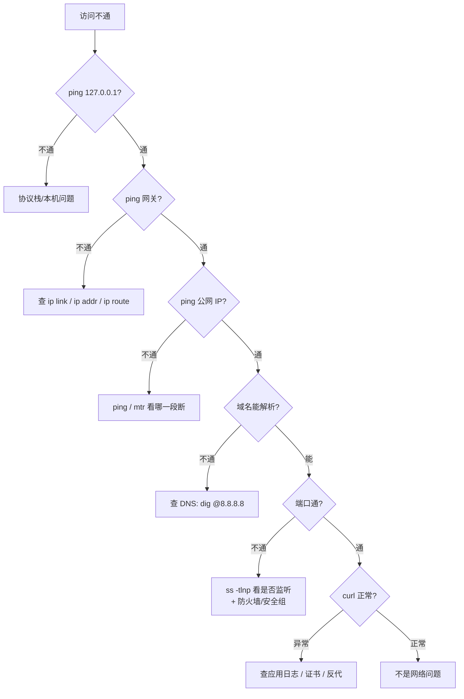

# [[网络诊断与安全]]

> [!tip] 学习目标
> 掌握常用网络诊断工具的使用方法与分析思路，包括 ping、traceroute、nslookup/dig、netstat/ss、tcpdump 与 Wireshark，并理解常见网络攻击类型与防御思路，特别是 DoS/DDoS、MITM、DNS 安全与 TLS 防御。

---

## 🎯 难度分段学习路径

| 难度 | 目标人群 | 核心关注 | 预估时长 |
|---|---|---|---|
| **入门** | 需掌握基础诊断工具使用 | ping、traceroute、nslookup/dig、netstat/ss 基础用法 | 8h |
| **进阶** | 需掌握抓包分析与常见攻击概念 | tcpdump/Wireshark 基本抓包与过滤、DoS/DDoS、MITM、DNS 安全 | 10h |
| **高级** | 需研究防御策略与综合诊断 | 限流/负载均衡/CDN/清洗、TLS 防御、HSTS、纵深防御思路、实战诊断报告 | 7h |

**总学时**：25h | **适用**：了解基础网络，需掌握诊断工具与安全攻击防御知识

---

## 📖 第一章 入门（基础诊断工具）

### 1.1 ping 与可达性测试

**知识点详解**

| 内容 | 说明 | 示例 |
|---|---|---|
| ping | 测试网络可达性与往返时延（RTT） | `ping example.com` |
| ICMP | ping 使用的控制报文协议 | Echo Request / Echo Reply |
| RTT | 数据往返时间 | 响应时间波动提示网络状况 |
| 非严格意义“延时” | ping 测的是 ICMP 往返，不代表应用延迟 | 应用延迟可能更复杂 |

**填空题（每章 4 道，答案见本节末尾）**

1. ping 使用的协议是 ______。
2. ping 测试的是网络 ______ 与往返时延。
3. ping 测量的 RTT 是指从发送 ______ 到收到 ______ 的时间。
4. ping 只能测量 ______ 层的可达性，不代表应用层延迟。

**答案**：
1. ICMP
2. 可达性
3. Echo Request, Echo Reply
4. 网络（或 ICMP/底层）

---

### 1.2 traceroute 与路径观察

**知识点详解**

| 内容 | 说明 | 示例 |
|---|---|---|
| traceroute / tracert | 观察数据经过的路由路径与各 hop 时延 | `traceroute example.com` |
| 工作原理 | 利用 TTL 递增，路由器返回 ICMP 超时/端口不可达 | 各 hop 显示跳数与延迟 |
| 路径变化 | 不同时间/路由策略可能导致路径不同 | 多次测试对比 |
| 局限 | 部分路由器不返回 ICMP，可能显示 `*` | 代表未响应 |

**填空题**

1. traceroute 通过递增 ______ 来发现路径中的各个路由器。
2. traceroute 显示的 `*` 可能表示路由器 ______ ICMP 响应。
3. 不同时间的 traceroute 结果可能 ______，因为路由策略可能变化。
4. traceroute 显示的是从本机到目标之间的 ______ 路径。

**答案**：
1. TTL（生存时间）
2. 未返回（或不响应）
3. 不同（或变化）
4. 路由（路由器）

---

### 1.3 DNS 诊断：先定位到 DNS 协议本身

> [!note] 本节已合并
> DNS 的记录类型、报文格式、递归/迭代、DNSSEC、加密 DNS 等内容集中在 [[DNS-详解]]。诊断篇只保留**排障动作**。

| 动作 | 命令 | 目的 |
|---|---|---|
| 看本机用的解析器 | `cat /etc/resolv.conf` / `resolvectl status` | 排除配置错 |
| 交叉验证 | `dig @8.8.8.8 example.com` 与 `@223.5.5.5` | ==两边结果不一致 → GeoDNS/劫持/污染== |
| 走完整链路 | `dig +trace example.com` | 定位到哪一级出问题 |
| 看截断 | `dig +edns=0 +stats example.com`（看 `udp:` 与 `MSG SIZE`） | 是否需要走 TCP |
| 清本地缓存 | `resolvectl flush-caches` | 改完记录后验证 |

| 现象 | 判断 |
|---|---|
| 只有本机查不到、其他网络正常 | 本机 resolver 配置或缓存 |
| 各解析器结果不同 | GeoDNS、劫持或污染 |
| `SERVFAIL` | 上游失败或 DNSSEC 校验失败 |
| 查询超时 | UDP/53 被网络设备屏蔽 |
| 域名不通但 IP 可直连 | ==就是 DNS 问题==，转 [[DNS-详解#3.3 DNS 排障手册]] |

**填空题**

1. 排除本地 resolver 配置错误，先看 ______ 文件。
2. 用两个不同公共解析器交叉验证，结果不一致说明可能是 ______（GeoDNS/劫持）。
3. 查询超时通常是 UDP 端口 ______ 被拦截。
4. 域名不通但 IP 能直连时，应转 ______ 笔记继续排查。

**答案**：
1. /etc/resolv.conf
2. GeoDNS/劫持
3. 53
4. [[DNS-详解]]
---

### 1.4 连接状态工具：netstat 与 ss

**知识点详解**

| 工具 | 用途 | 示例 |
|---|---|---|
| netstat | 查看网络连接、监听端口、路由等 | `netstat -tunap` |
| ss | 更快速的套接字统计工具（现代 Linux） | `ss -tunap` |
| 状态查看 | ESTABLISHED、TIME_WAIT、CLOSE_WAIT、LISTEN 等 | `ss -tan` |
| 进程关联 | 查看连接对应进程（需权限） | `ss -tunap` |

**填空题**

1. 查看网络连接与监听端口的工具有 ______ 和 ______。
2. `ESTABLISHED` 表示连接已建立，正在 ______。
3. `LISTEN` 表示套接字正在 ______ 连接。
4. 查看连接对应进程需使用 ______ 选项（如 `-p`）。

**答案**：
1. netstat, ss
2. 数据传输（通信）
3. 等待（监听）
4. -p（或需权限）

---

### 1.5 分层排障方法论（比记命令更重要）

> [!tip] 核心原则
> ==自底向上逐层排除，在哪一层断了就停在那查==。下面断了，上面必然全断；下面不通时调应用纯属浪费时间。

| 层 | 判断问题 | 关键命令 | 不通时的结论 |
|---|---|---|---|
| 物理层 | 网线/网卡/交换机口正常吗 | `ip link show`（看 `UP`）、`ethtool eth0` | 网卡 DOWN、速率/双工异常 |
| 链路层 | ARP 学到 MAC 了吗、网卡丢包了吗 | `ip neigh`、`ip -s link` | 邻居表是 `INCOMPLETE` → 二层不通 |
| 网络层 | 网关/路由通吗 | `ping 网关`、`ip route`、`mtr` | 无 `default` 路由 = 外网全挂 |
| 传输层 | 端口通吗、连接建得上吗 | `ss -tlnp`、`nc -zv host port` | 只监听 `127.0.0.1` → 外部访问不到 |
| 应用层 | DNS 解析 + HTTP/TLS 正常吗 | `dig`、`curl -v`、应用日志 | 收到 5xx → ==已经到应用了，别再查网络== |



**分段计时：用 curl 把「慢」拆开**

```bash
curl -o /dev/null -s -w \
"DNS 解析:   %{time_namelookup}s\nTCP 连接:   %{time_connect}s\nTLS 握手:   %{time_appconnect}s\n首字节:     %{time_starttransfer}s\n总耗时:     %{time_total}s\nHTTP 状态:  %{http_code}\n" \
https://example.com
```

| 现象 | 判断 |
|---|---|
| `time_namelookup` 很大 | DNS 慢（本地 resolver 或权威服务器） |
| `time_connect - time_namelookup` 很大 | TCP 握手慢 → 丢包/路径绕路 |
| `time_appconnect - time_connect` 很大 | TLS 握手慢 → 证书链长、没开 1.3/OCSP Stapling |
| `time_starttransfer - time_appconnect` 很大 | ==TTFB 高 → 后端慢，已经不是网络问题== |

**填空题**

1. 分层排障的顺序是自 ______ 向上逐层排除。
2. 监听在 `127.0.0.1:8080` 的服务，==外部==（本机之外）无法访问。
3. `ip neigh` 里状态是 `INCOMPLETE` 说明 ==ARP 邻居解析失败==。
4. `time_starttransfer` 很大（TTFB 高）时，排查重点应该转向 ==后端应用与依赖==。

**答案**：
1. 下（底层）
2. 无法
3. ARP 邻居解析失败
4. 后端应用与依赖

---

### 1.6 第一章综合练习

**填空题（本章共 4 道，答案见下方）**

1. ping 使用的协议是 ______。
2. 查询 IPv4 地址记录的 DNS 类型是 ______。
3. 查看网络连接与监听端口的工具有 ______ 和 ______。
4. traceroute 通过递增 ______ 发现路径中的各个路由器。

**本章答案**：
1. ICMP
2. A
3. netstat, ss
4. TTL（生存时间）

**综合项目**：完成一次基础网络诊断：
1. 用 `ping` 测试一个网站的可达性与 RTT（记录数次结果）
2. 用 `traceroute` 观察到目标的路径（记录前几跳）
3. 用 `dig A` 查询该网站的 IPv4 地址与 TTL
4. 用 `ss -tan` 查看本机 TCP 连接状态分布（记录 ESTABLISHED、TIME_WAIT、CLOSE_WAIT 数量）
将结果整理成一份基础网络诊断报告。

---

> [!tip] 常见陷阱
> 1. **ping 代表应用延迟**：ping 测的是 ICMP 往返，不代表 HTTP/应用延迟。
> 2. **traceroute 的 `*` 误解**：`*` 不一定是网络故障，可能是路由器未返回 ICMP。
> 3. **DNS 缓存干扰**：本地/ISP/浏览器可能缓存记录，排查域名解析时需多级确认。
> 4. **netstat 与 ss 混用**：ss 通常更快更适合现代 Linux，netstat 可能较慢或受限。

> [!note] 本章权威资料（链接于 2026-09-25 核验 200）
> - **man7：tcpdump(8)**（BPF 过滤语法全解）：https://man7.org/linux/man-pages/man8/tcpdump.8.html
> - **Nmap 官方文档 · 网络扫描原理**：https://nmap.org/book/vscan.html
> - **OWASP Cheat Sheet 索引**：https://cheatsheetseries.owasp.org/
>
> > [!warning] 原视频链接已删除
> > `BV1xxfs1xEBlu` 是编造 BV 号，Coursera / Udemy 路径无法确认课程，==均属凭空生成==。命令语法一律查 man7。

---

## 📖 第二章 进阶（抓包分析与常见攻击概念）

### 2.1 tcpdump 与 Wireshark 基础

**知识点详解**

| 工具 | 用途 | 示例 |
|---|---|---|
| tcpdump | 命令行抓包，过滤表达式 | `tcpdump -i any tcp port 80` |
| Wireshark | 可视化抓包分析，流追踪、重传、窗口、状态 | 过滤 `tcp`, `http`, `tls` |
| 过滤器 | 按协议、端口、IP、标志过滤 | `tcp.flags.syn==1`, `tcp.analysis.retransmission` |
| 流追踪 | 追踪一个 TCP 会话的所有报文 | Wireshark 中 Follow TCP Stream |

> [!tip] 使用技巧
> 抓包时先明确目标：是看连接建立？数据交换？重传？还是 TLS 握手？使用过滤器缩小范围，避免信息过载。

**填空题**

1. 命令行抓包分析常用 ______，可通过表达式过滤。
2. Wireshark 中追踪一个 TCP 会话的功能称为 ______。
3. 过滤 TCP SYN 报文的常见表达式是 `tcp.flags.syn==______`
4. 识别 Wireshark 中的 TCP 重传，可使用预定义分析 ______。

**答案**：
1. tcpdump
2. Follow TCP Stream（或 TCP 流追踪）
3. 1
4. 重传（或重传分析）

---

### 2.2 TCP 抓包观察：握手、数据、重传、终止

**知识点详解**

| 场景 | 观察重点 | 提示 |
|---|---|---|
| 连接建立 | SYN/SYN-ACK/ACK 顺序、Seq/Ack初始值 | 过滤 `tcp.flags.syn==1` |
| 数据传输 | ACK 确认、窗口通告、Seq 递增 | 关注 `tcp.analysis.bytes_in_flight` |
| 重传 | 重传报文、重复 ACK、窗口变化 | 过滤 `tcp.analysis.retransmission` |
| 连接终止 | FIN/ACK 交换、状态变化 | 关注 `tcp.flags.fin==1` |
| 异常 | RST、零窗口、窗口探测 | 过滤 `tcp.flags.reset==1` |

**填空题**

1. 用 Wireshark 观察 TCP 重传时，可使用预定义分析 ______。
2. 过滤 TCP SYN 报文的 Wireshark 表达式常见形式是 `tcp.flags.syn==______`
3. 抓包中看到大量重复 ACK，可能表示 ______ 发生。
4. 连接异常终止时，TCP 可能发送 ______ 标志报文。

**答案**：
1. 重传（或重传分析）
2. 1
3. 丢包（或快速重传触发）
4. RST（复位）

---

### 2.3 常见网络攻击类型（DoS/DDoS、MITM、DNS 安全）

**知识点详解**

| 攻击类型 | 说明 | 防御思路 |
|---|---|---|
| DoS/DDoS | 耗尽资源/带宽使服务不可用 | 限流、速率限制、负载均衡、CDN/清洗、扩容、架构冗余 |
| MITM（中间人） | 冒充服务器或客户端，窃听/篡改 | 证书验证、严格的 TLS、HSTS |
| DNS 劫持/欺骗 | DNS 结果被恶意篡改，将用户导向错误 IP | 可信 DNS、DNSSEC（完整性）、HTTPS 检索等扩展 |
| 窃听 | 监听明文流量 | 加密传输（TLS）、避免明文协议 |
| 篡改 | 中间修改数据 | 完整性校验、MAC/签名、TLS |

**填空题**

1. 通过耗尽资源或带宽使服务不可用的攻击是 ______。
2. 中间人攻击（MITM）常利用 ______ 或 ______ 的信任缺陷。
3. 防止通信内容被第三方读取的核心手段是 ______。
4. DNS 结果被恶意篡改，将用户导向错误 IP 的攻击是 ______。

**答案**：
1. DoS/DDoS（拒绝服务）
2. 证书验证缺失, 域名解析不可信
3. 加密（TLS/加密传输）
4. DNS 劫持（或 DNS 欺骗）

---

### 2.4 抓包实战：完整操作流程（原 2.4 与 2.2 内容重复，已重写）

> [!note] 上一版的坑（已修）
> 原 2.4「抓包实战」的知识点表与填空题和 2.2 ==完全相同==，等于没写。以下是真正能动手的流程。

**Step 1｜服务器上抓，别先在本地电脑上抓**

```bash
# tcpdump 需要 root 或 CAP_NET_RAW 权限，这是新手第一个卡点
sudo tcpdump -i any -nn 'host 1.1.1.1 and port 443' -w /tmp/case1.pcap
# -i any  抓所有网卡（含容器 veth）
# -nn     不做名字反解，抓包时能省下可观的 CPU
# -w      存成 pcap，带回本地用 Wireshark 逐字段看
```

**Step 2｜拿 4 条命令定位故障段**

```bash
# ① 三次握手有没有完成（SYN 发出但无 SYN-ACK → 对端未监听/被防火墙丢）
sudo tcpdump -i any -nn 'tcp[tcpflags] & (tcp-syn|tcp-ack) != 0'

# ② 是否有异常 RST（应用崩了 / 端口未开 / 中间设备拦截）
sudo tcpdump -i any -nn 'tcp[tcpflags] & tcp-rst != 0'

# ③ 是否有重传（丢包的直接证据）
sudo tcpdump -i any -nn -S 'tcp[tcpflags] & tcp-push != 0 and tcp[((tcp[12] << 8) + tcp[13]) - ((tcp[16] << 8) + tcp[17])] > 0'

# ④ 连接建立后有没有数据（握手成功但没业务数据 → 应用层问题）
sudo tcpdump -i any -nn 'port 443 and greater 100'
```

**Step 3｜在 Wireshark 里按顺序看**

| 顺序 | 动作 | 目的 |
|---|---|---|
| 1 | `tcp.flags.syn == 1` | 确认握手报文序列 |
| 2 | 选中 SYN 看 `tcp.stream` 编号 | 锁定这条连接的 ID |
| 3 | `tcp.stream eq <编号>` | 只看这一条流 |
| 4 | 菜单 Follow TCP Stream | 看应用层明文（HTTPS 除外） |
| 5 | Statistics → Expert Information | ==一键看重传/零窗口/窗口耗尽== |
| 6 | Statistics → TCP Stream Graphs | 看时序与 RTT 波动 |

**Step 4｜对照结论表下判断**

| 抓包现象 | 结论 | 下一步 |
|---|---|---|
| 只发 SYN 无 SYN-ACK | 对端未监听 / 防火墙 DROP | 查 `ss -tlnp`、安全组、iptables |
| 收到 RST 且立即 | 端口未开放 | 服务没起或绑错地址 |
| 握手成功，几十秒后 RST | 空闲超时（keepalive 未配） | 调大超时或开 keepalive |
| 大量重传 + 重复 ACK | ==丢包== | mtr 看哪一跳，见 3.x |
| 握手成功但无数据 | 应用/服务卡住 | 看应用日志，不在网络层继续找 |
| 看到 `Window Full` | 接收方处理慢 | 查对端应用消费速度 |

**填空题**

1. `tcpdump -w out.pcap` 的作用是 ==把抓包保存成文件==，便于用 Wireshark 逐字段分析。
2. `-nn` 参数的作用是不做 ______ 与端口号的名称反解。
3. Wireshark 中 `tcp.stream eq 3` 表示只看编号为 3 的那条 ______ 流。
4. 抓包只看到 SYN、没有 SYN-ACK，最可能是对端未监听或被防火墙 ______。

**答案**：
1. 把抓包保存成文件
2. IP
3. TCP
4. 丢弃（DROP）

---

### 2.5 第二章综合练习

**填空题（本章共 4 道，答案见下方）**

1. 命令行抓包分析常用 ______，可通过表达式过滤。
2. Wireshark 中追踪一个 TCP 会话的功能称为 ______。
3. 通过耗尽资源或带宽使服务不可用的攻击是 ______。
4. DNS 结果被恶意篡改，将用户导向错误 IP 的攻击是 ______。

**本章答案**：
1. tcpdump
2. Follow TCP Stream（或 TCP 流追踪）
3. DoS/DDoS（拒绝服务）
4. DNS 劫持（或 DNS 欺骗）

**综合项目**：完成一次抓包与安全观察实战：
1. 用 tcpdump 或 Wireshark 捕获一次 HTTP/HTTPS 请求；
2. 识别 TCP 三次握手（SYN/SYN-ACK/ACK）；
3. 观察数据传输阶段窗口通告大小与 ACK；
4. 检查是否有重传（超时或快速重传），记录重传率；
5. 观察连接终止阶段 FIN/ACK 交换与状态；
6. 如果是 HTTP，观察请求/响应首部；如果是 HTTPS，观察 TLS 握手大致流程（ClientHello/ServerHello/证书交换）；
7. 将观察结果写成简要分析：连接建立是否正常、窗口大小是否合理、是否有异常重传、连接终止是否干净、TLS 验证是否正常。

---

> [!tip] 常见陷阱
> 1. **抓包看不到应用层明文**：HTTPS 下抓包看到的是加密流量，不能直接看到 HTTP 内容，除非配置解密。
> 2. **攻击类型混淆**：DoS/DDoS 是资源耗尽，MITM 是中间劫持，DNS 劫持是解析篡改，需区分防御思路。
> 3. **重传≠一定故障**：轻微重传可能是网络波动，大量重传或持续高重传率才值得排查。
> 4. **Wireshark 过滤不熟**：不熟悉过滤语法会导致信息过载，应先明确目标再过滤。

> [!note] 本章权威资料（链接于 2026-09-25 核验 200）
> - **Wireshark 官方用户指南（显示过滤器）**：https://www.wireshark.org/docs/wsug_html_chunked/
> - **man7：tcpdump(8)**：https://man7.org/linux/man-pages/man8/tcpdump.8.html
>
> > [!warning] 原视频链接已删除（同上）

---

## 📖 第三章 高级（防御策略与综合诊断）

### 3.1 DoS/DDoS 防御策略

**知识点详解**

| 策略 | 说明 |
|---|---|
| 限流/速率限制 | 限制单个 IP/用户请求频率，减少恶意请求冲击 |
| 负载均衡 | 分散流量至多台服务器，避免单点过载 |
| CDN / 清洗 | 将流量分流至边缘节点或专用清洗中心，过滤恶意流量 |
| 扩容与冗余 | 增加服务器资源、冗余架构，提高承载能力 |
| 架构防护 | 无状态设计、缓存、异步处理，减少服务端压力 |
| 监控与告警 | 实时监控流量、连接数、异常请求，及时响应 |

**填空题**

1. 限制单个 IP/用户请求频率的防御手段是 ______。
2. 将流量分流至边缘节点或专用清洗中心的防御方式是 ______。
3. 减少服务器单点过载的架构手段是 ______。
4. 实时监控流量与异常请求是 ______ 防御的重要环节。

**答案**：
1. 限流（或速率限制）
2. CDN（或流量清洗）
3. 负载均衡（或扩容/冗余）
4. 监控（或告警）

---

### 3.2 MITM 防御与 TLS 安全

**知识点详解**

| 防御措施 | 说明 |
|---|---|
| 严格证书验证 | 客户端验证证书链、域名、有效期、吊销状态 |
| HSTS | 强制客户端使用 HTTPS，防止降级与窃听 |
| 避免明文协议 | 使用 TLS 加密传输，避免 HTTP 明文 |
| 证书固定（Pinning） | 客户端记住预期证书/公钥，增加额外验证层（慎用） |
| 监控与告警 | 监控异常证书、连接异常，及时响应 |

**填空题**

1. 强制客户端使用 HTTPS 的 HTTP 响应首部是 ______。
2. 防止中间人攻击的关键包括 ______ 验证与 ______。
3. 客户端记住预期证书/公钥，增加额外验证层的做法是 ______。
4. TLS 保护传输安全，但还需 ______、认证、监控配合。

**答案**：
1. Strict-Transport-Security（HSTS）
2. 证书, HSTS（或严格验证）
3. 证书固定（Pinning）
4. 纵深防御（或应用层/授权）

---

### 3.3 DNS 安全与完整性

**知识点详解**

| 内容 | 说明 |
|---|---|
| DNSSEC | 为 DNS 记录提供签名与验证，增加完整性与真实性 |
| 可信 DNS | 使用可信赖的 DNS 服务，减少劫持风险 |
| DoT/DoH | DNS over TLS / DNS over HTTPS，加密 DNS 查询 |
| 缓存污染防御 | 多级缓存与验证，减少恶意篡改影响 |

**填空题**

1. 为 DNS 记录提供签名与验证，增加完整性与真实性的机制是 ______。
2. DNS over TLS / DNS over HTTPS 的作用是 ______ DNS 查询。
3. 使用 ______ 的 DNS 服务可减少劫持风险。
4. DNSSEC 主要解决的是 DNS 的 ______ 问题。

**答案**：
1. DNSSEC
2. 加密（加密传输）
3. 可信
4. 完整性（或真实性/篡改）

---

### 3.4 纵深防御与网络安全整体视角

**知识点详解**

| 层面 | 说明 |
|---|---|
| 传输层 | TLS 加密、证书验证、HSTS |
| 应用层 | 输入验证、输出编码、身份认证、授权、速率限制 |
| 基础设施 | 防火墙、ACL、负载均衡、CDN、监控 |
| 运维与监控 | 日志、告警、入侵检测、事件响应 |
| 安全意识 | 钓鱼防御、密钥保护、配置管理 |

**填空题**

1. TLS 保护的是 ______ 层的安全。
2. 输入验证、输出编码、身份认证属于 ______ 层的安全措施。
3. 防火墙、ACL、负载均衡属于 ______ 层的防护。
4. 网络安全是 ______ 防御的思想，而非单一措施。

**答案**：
1. 传输
2. 应用
3. 基础设施（或网络/基础设施）
4. 纵深（多层）

---

### 3.5 第三章综合练习

**填空题（本章共 4 道，答案见下方）**

1. 限制单个 IP/用户请求频率的防御手段是 ______。
2. 强制客户端使用 HTTPS 的 HTTP 响应首部是 ______。
3. 为 DNS 记录提供签名与验证，增加完整性与真实性的机制是 ______。
4. 网络安全是 ______ 防御的思想，而非单一措施。

**本章答案**：
1. 限流（或速率限制）
2. Strict-Transport-Security（HSTS）
3. DNSSEC
4. 纵深（多层）

**综合项目**：完成一次综合网络诊断与安全观察实战：
1. 用 `ping` / `traceroute` / `dig` 观察目标网站的可达性、路径与解析；
2. 用 `ss` 查看本机连接状态分布（ESTABLISHED/TIME_WAIT/CLOSE_WAIT）；
3. 用 tcpdump 或 Wireshark 捕获一次请求，识别握手、数据传输、重传、连接终止；
4. 如果是 HTTPS，观察 TLS 握手大致流程与证书验证情况；
5. 基于观察结果，评估是否有异常（高重传、异常状态堆积、TLS 故障等），并写出可能的防御或优化建议；
6. 将观察结果与分析写成一份综合报告：包含诊断工具使用、抓包发现、安全观察、建议。

---

> [!tip] 常见陷阱
> 1. **防御单一化**：仅靠 TLS 或仅靠防火墙是不够的，需多层防御。
> 2. **抓包代替应用日志**：抓包只能看到流量，应用行为与日志仍需结合。
> 3. **HSTS 误解**：HSTS 強制 HTTPS，但需正确配置 max-age 与 includeSubDomains，否则效果有限。
> 4. **DNSSEC 部署复杂**：DNSSEC 提供完整性，但部署与验证链配置有门槛，需逐步采用。

> [!note] 本章权威资料（链接于 2026-09-25 核验 200）
> - **RFC 6891**（IANA 对 IPv4 特殊用途地址的分配，含 CGNAT 段）：https://www.rfc-editor.org/rfc/rfc6891
> - **OWASP TLS Cheat Sheet**：https://cheatsheetseries.owasp.org/cheatsheets/Transport_Layer_Security_Cheat_Sheet.html
> - **TLS 与证书安全（本库笔记）**：[[TLS-与证书安全]]
>
> > [!warning] 原视频链接已删除（同上）

---

## 📚 关联笔记

- `[[计算机网络基础]]` - 网络基础概念（分层、IP/子网、HTTP/TCP/UDP基础、安全初识）
- `[[TCP-深入]]` - TCP 协议深度解析（连接管理、流量控制、拥塞控制、算法与性能）
- `[[HTTP-详解]]` - HTTP 协议详解（缓存、状态码、HTTP/2/3、实战）
- [[TLS-与证书安全]] - TLS/HTTPS 与证书安全（握手、PFS、证书链、吊销）
- [[DNS-详解]] - DNS 解析、缓存、DNSSEC、加密 DNS 与 DNS 排障手册

## ⚡ 速查表

| 场景 | 命令 |
|---|---|
| 本机到网关 | `ping -c 4 <网关IP>` |
| 公网可达性 | `ping -c 4 8.8.8.8`（ping 通 ≠ 端口通） |
| 持续丢包与抖动 | `mtr -r -c 50 <host>`（看丢包率与 StDev） |
| 绕路检测 | `traceroute -n <host>`，延迟突然飙升后再也不降 = 那一段绕路 |
| ICMP 被禁时测端口 | `nc -zv <host> 443` |
| 监听端口 | `ss -tlnp` |
| 连接状态统计 | `ss -tan \| awk '{print $1}' \| sort \| uniq -c` |
| DNS 换解析器对比 | `dig @8.8.8.8 example.com` / `dig @223.5.5.5 example.com` |
| 分段耗时 | `curl -o /dev/null -s -w '%{time_*}...' <url>` |
| HTTP 首部 | `curl -I <url>` |
| 链路统计 | `ip -s link`（drop/errs） |
| 邻居表 | `ip neigh` |
| 抓包存文件 | `sudo tcpdump -i any -nn 'port 443' -w /tmp/c.pcap` |
| 看 SYN/SYN-ACK | `sudo tcpdump -i any -nn 'tcp[tcpflags] & (tcp-syn|tcp-ack) != 0'` |
| 看 RST | `sudo tcpdump -i any -nn 'tcp[tcpflags] & tcp-rst != 0'` |
| 证书检查 | `openssl s_client -connect <host>:443 -servername <host>` |

## ❓ 常见问题

> [!faq]- Q：ping 通但就是连不上？
> A：ping 只证明 ICMP 可达。按序查：① `nc -zv host port` 测端口；② `ss -tlnp` 看服务是否监听在 `0.0.0.0`（只听 `127.0.0.1` 外部必然连不上）；③ 防火墙与云安全组；④ 用 `curl -v` 看卡在哪个阶段。

> [!faq]- Q：traceroute 中间某一跳显示 `* * *`，是那里断了吗？
> A：**大概率不是**。很多中间路由器限制 ICMP 响应率。判断标准：==若后续跳和终点正常，说明只是限速==；只有「从某跳起直到终点全超时」才指向该段链路。

> [!faq]- Q：tcpdump 提示 `You don't have permission`？
> A：需要 root 或给二进制加 `CAP_NET_RAW` 能力。`sudo tcpdump ...` 即可。容器里还要注意 host 网络与 `any` 网卡是否可见。

> [!faq]- Q：DDOS 来了我在服务器上能做什么？
> A：==先别在源头上硬扛==。能做的是：开限流、关非必要服务、留证据（抓包/日志）；真正的缓解依赖上游——运营商清洗、CDN、高防 IP。单机不可能扛住带宽型攻击。

> [!faq]- Q：DDOS 和 CC 攻击怎么区分？
> A：看流量特征：==DDOS 通常是大量真实来源 IP、带宽/连接数被打满==；CC 是集中在少数 IP 的高频业务请求。处置方向不同：前者靠清洗，后者靠限流/WAF/验证码。

---

*由 Hermes Agent 创建于 2026-09-17 · 更新于 2026-09-25 · 状态：进行中*