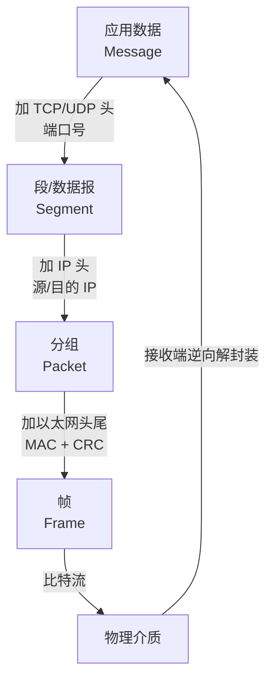

# [[计算机网络基础]]

> [!tip] 学习目标
> 作为有基本概念基础的学习者，系统巩固计算机网络核心概念，理解协议分层模型、IP与子网、TCP/UDP基础、HTTP基础与网络安全初识。

---

## 🎯 难度分段学习路径

| 难度 | 核心关注 | 在哪学 | 预估时长 |
|---|---|---|---|
| **入门** | 协议分层、性能指标、封装/PDU、IP/子网计算、链路层与设备、NAT/DHCP/端口、HTTP/TCP 基础、安全初识 | ==本篇== | 15h |
| **进阶** | TCP 连接与拥塞控制、HTTP 缓存与 HTTP/2、DNS、TLS 握手与证书链 | [[TCP-深入]]、[[HTTP-详解]]、[[TLS-与证书安全]] | 30h |
| **高级** | 抓包分析、协议性能、攻击与防御策略 | [[网络诊断与安全]] | 15h |

> [!tip] 怎么用这套笔记
> 本篇是**地基**：先学完 1.2~1.7（性能、封装、子网、设备、NAT），再按薄弱环节进入子主题。**跳过 1.2 性能指标直接背 TCP 状态机，等于没学网络** —— 时延、带宽、封装是解释一切异常现象的底层模型。

---

## 📖 基础模块（入门）

### 1.1 计算机网络基础概念

**知识点详解**

| 概念 | 说明 | 示例 |
|---|---|---|
| 协议 | 通信双方遵循的规则与约定 | HTTP、TCP、IP、DNS |
| 分层模型 | 将复杂通信功能分解为层次 | OSI 7 层、TCP/IP 4 层 |
| 客户-服务器模型 | 请求方（客户端）与服务方（服务器） | 浏览器请求网页 |
| 端到端原则 | 功能尽量在端系统实现，中间网络尽量简单 | 错误检测、加密由端负责 |

**OSI 与 TCP/IP 对照**

| OSI 层 | TCP/IP 层 | 主要协议/功能 |
|---|---|---|
| 应用层 | 应用层 | HTTP, DNS, SMTP, FTP, SSH |
| 表示层/会话层 | 应用层 | 加密、解密、会话管理（通常由应用处理） |
| 传输层 | 传输层 | TCP, UDP, 套接字, 端口 |
| 网络层 | 网络层 | IP, ICMP, 路由, 子网, ARP |
| 数据链路层 | 链路层 | 以太网帧, MAC, 交换机 |
| 物理层 | 链路层（物理） | 比特传输, 编码, 接口标准 |

> [!tip] 关键理解
> 协议分层的核心思想是：每一层只关心自己的职责，对上提供接口，对下使用服务。TCP 负责可靠传输，IP 负责寻址与路由，HTTP 负责应用语义。

**填空题（每章 4 道，答案见本节末尾）**

1. 计算机网络协议的分层模型中，TCP 属于 ______ 层，IP 属于 ______ 层。
2. 客户-服务器模型中，主动发起请求的一方称为 ______。
3. OSI 7 层模型中，HTTP 协议工作在 ______ 层。
4. 端到端原则意味着复杂功能（如加密/重传）应尽量在 ______ 实现。

**答案**：
1. 传输, 网络
2. 客户端
3. 应用
4. 端系统（端点）

---

### 1.2 性能指标：带宽、吞吐量、时延、时延带宽积

**知识点详解**

| 指标 | 定义 | 常见误解 |
|---|---|---|
| 带宽 | 链路的**理论**最大传输速率（bps） | 🔴 买来的带宽 ≠ 你能用的速度 |
| 吞吐量 | 实际单位时间通过的数据量（bps） | 吞吐量永远 ≤ 带宽，且受最慢链路限制 |
| 时延 | 数据从源到宿所需时间 | 时延高不代表带宽低 |
| RTT | 往返时间，ping 测的就是它 | 跨洋 RTT 常在 150-200ms |
| 时延带宽积 | `带宽 × RTT` | ==决定在途能塞多少数据== |

**时延的四个组成部分**

| 分量 | 含义 | 优化手段 |
|---|---|---|
| 发送时延 | 把包推上链路的时间，`长度/带宽` | 压缩、减小包 |
| 传播时延 | 信号在介质中传播，`距离/传播速度` | ==只能靠物理距离，压缩无效== |
| 排队时延 | 在路由器队列中等待 | 减少流量、扩容队列 |
| 处理时延 | 路由查找、校验等处理 | 更快的硬件/更简单的处理 |

> [!tip] 高频判断题
> 「提高带宽能降低时延吗？」——==不能降低传播时延==，只降低发送时延。「CDN 为什么快？」——不是带宽变大，而是==缩短了物理距离==（降低传播时延）+ 减少排队。

**填空题**

1. 链路的理论最大速率叫 ______，实际测到的叫 ______。
2. RTT 是 ______ 往______ 的时间，ping 命令测的就是它。
3. 时延带宽积决定网络中能够 ==在途== 的数据量。
4. 距离固定时，提高带宽只能降低 ______ 时延，不能降低 ______ 时延。

**答案**：
1. 带宽, 吞吐量
2. 从源到宿, 从宿回源
3. 在途（未确认）
4. 发送, 传播

---

### 1.3 封装、解封装与协议数据单元

**知识点详解**

| 层次 | 数据单元（PDU） | 做的事 |
|---|---|---|
| 应用层 | 消息（Message） | 生成数据 |
| 传输层 | 段 Segment（TCP）/ 数据报 Datagram（UDP） | ==加端口号、拆分成段== |
| 网络层 | 分组 Packet（IP） | ==加 IP 头==，寻址与路由 |
| 链路层 | 帧 Frame（以太网） | ==加 MAC 头尾 + CRC==，同一网段内传输 |
| 物理层 | 比特 Bit | 变成电/光信号 |

> [!tip] 为什么会有 MTU
> 链路层一帧能装的数据量是 MTU（以太网默认 **1500 字节**）。上层包超过 MTU 就得==分片（fragment）==或靠 IP 层协商 MSS 避免分片。分片丢一片 = 整包作废，所以路径上 MTU 变小会引发诡异丢包。

**填空题**

1. 传输层的数据单元叫 ______（TCP）/ ______（UDP）。
2. 链路层的数据单元叫 ______，以太网默认 MTU 是 ______ 字节。
3. 封装发生在发送端，解封装发生在 ______ 端。
4. IP 包超过路径 MTU 时会被 ______。

**答案**：
1. 段 Segment, 数据报 Datagram
2. 帧 Frame, 1500
3. 接收
4. 分片

---

### 1.4 IP 地址与子网划分

**知识点详解**

| 概念 | 说明 | 示例 |
|---|---|---|
| IPv4 地址 | 32 位，点分十进制表示 | `192.168.1.10` |
| IPv6 地址 | 128 位，冒号分十六进制 | `2001:0db8::1` |
| 子网掩码 | 区分网络位与主机位 | `255.255.255.0` / `/24` |
| CIDR 表示 | `网络地址/前缀长度` | `192.168.1.0/24` |
| 默认网关 | 离开本网络的出口路由器 | 路由器接口 IP |
| DNS 基础 | 域名 → IP 的解析服务（详见 [[HTTP-详解#2.4 DNS 基础与网络服务]]） | `dig example.com`（不要背某次查询的具体 IP，CDN 会变） |

**填空题**

1. IPv4 地址由 ______ 位组成，通常以 ______ 表示。
2. 子网掩码 `255.255.255.0` 对应的 CIDR 表示是 ______。
3. CIDR 表示中，`/24` 表示前 ______ 位是网络位。
4. 域名解析服务将域名转换为 ______。

**答案**：
1. 32, 点分十进制
2. /24
3. 24
4. IP 地址

---

### 1.5 子网划分实战

**知识点详解**

| 步骤 | 做法 |
|---|---|
| 1 | IP 转二进制，如 `192.168.1.130` → `11000000.10101000.00000001.10000010` |
| 2 | 掩码转二进制，`/24` → 24 个 1 |
| 3 | ==网络位== = 掩码前 n 位；==主机位== = 剩下的位 |
| 4 | 网络地址 = 主机位全 0；广播地址 = 主机位全 1；==这两个不可分配给主机== |
| 5 | 可用主机数 = `2^主机位 − 2` |

**例题：`192.168.1.130/26`**

| 项 | 值 |
|---|---|
| 网络地址 | `192.168.1.128/26` |
| 广播地址 | `192.168.1.191/26` |
| 可用范围 | `192.168.1.129` ~ `192.168.1.190` |
| 可用主机数 | 2^6 − 2 = **62** |
| 所属网段序列 | .0 / .64 / .128 / .192 |

**填空题**

1. 一个 `/26` 网络的可用主机数是 `2^______ − 2`。
2. `192.168.1.130/26` 的网络地址是 `192.168.1.______`。
3. 可用主机数的公式要减 2，减掉的是网络地址和 ______ 地址。
4. `/24` 的子网掩码是 `255.255.255.______`。

**答案**：
1. 6
2. 128
3. 广播
4. 0

---

### 1.6 链路层与网络设备

**知识点详解**

| 设备 | 工作层 | 依据什么转发 | 会不会隔离广播域 |
|---|---|---|---|
| 集线器 Hub | 物理层 | 不做判断，全部转发 | ❌ 不隔离 |
| 交换机 Switch | 数据链路层 | ==MAC 地址表== | ❌ 默认不隔离（靠 VLAN） |
| 路由器 Router | 网络层 | ==IP 路由表== | ✅ 隔离 |
| 网桥/网段 | 数据链路层 | MAC | ❌ |

| 概念 | 说明 |
|---|---|
| 帧 | 链路层传输单元：`目的 MAC｜源 MAC｜类型｜数据｜FCS(CRC)` |
| MAC 地址 | 48 位，通常本地唯一（可在系统里改） |
| ARP | 把 **IP → MAC** 的映射，问「谁是 192.168.1.1」（RFC 826） |
| VLAN | 在交换机上逻辑划分广播域 |

> [!tip] 记忆锚点
> 「路由器看 IP、交换机看 MAC」；ARP 解决的是 ==同网段内==的 IP→MAC，跨网段时不需要 ARP（交给默认网关）。

**填空题**

1. 交换机依据 ______ 地址表转发，路由器依据 ______ 表转发。
2. ARP 协议解决的是 IP 地址到 ______ 地址的映射。
3. 路由器会隔离 ______ 域，集线器不会。
4. 以太网帧的完整性校验字段叫 ______。

**答案**：
1. MAC, IP 路由
2. MAC
3. 广播
4. FCS / CRC

---

### 1.7 NAT、DHCP 与端口

**知识点详解**

| 协议/概念 | 作用 | 排障关键词 |
|---|---|---|
| **DHCP**（UDP 67/68） | 动态给主机分配 IP、掩码、网关、DNS | `ipconfig` / `nmcli` 看「无租约」 |
| **NAT** | 私网 IP ↔ 公网 IP + 端口转换，一个公网 IP 带全家上网 | 端口耗尽、映射冲突 |
| **端口** | 主机上区分进程的编号，0-65535，知名端口 <1024 | `ss -tunap` 看占用 |
| **套接字五元组** | `源 IP, 源端口, 目的 IP, 目的端口, 协议` | ==一条 TCP 连接的完整身份== |

| 私有地址段（RFC 1918） | 用途 |
|---|---|
| `10.0.0.0/8` | 大型组织 |
| `172.16.0.0/12` | 中型组织 |
| `192.168.0.0/16` | 家庭/小型网络 |

**填空题**

1. DHCP 默认使用的 UDP 端口是 ______ 和 ______。
2. NAT 的作用是让 ______ 地址的主机共用公网 IP 访问互联网。
3. 一条 TCP 连接由五元组唯一标识，它们是源 IP、源端口、目的 IP、目的端口和 ______。
4. RFC 1918 定义的私有地址段是 `10.0.0.0/8`、______ 和 `192.168.0.0/16`。

**答案**：
1. 67, 68
2. 私有（私网）
3. 协议
4. `172.16.0.0/12`

---

### 1.8 应用层概览与 HTTP 基础

**知识点详解**

| 内容 | 说明 | 示例 |
|---|---|---|
| HTTP 请求 | 方法 + URI + 版本 + 头 + 体 | `GET /index.html HTTP/1.1` |
| HTTP 响应 | 版本 + 状态码 + 原因 + 头 + 体 | `HTTP/1.1 200 OK` |
| 常见方法 | GET/POST/PUT/DELETE/HEAD/OPTIONS | 获取、提交、更新、删除、获取首部、询问支持 |
| 状态码分类 | 1xx 信息、2xx 成功、3xx 重定向、4xx 客户端错、5xx 服务器错 | `200 OK`, `404 Not Found`, `500 Internal Server Error` |
| 头字段 | 请求/响应的元信息 | `Host`, `Content-Type`, `User-Agent`, `Accept` |
| HTTPS 概念 | HTTP + 加密传输（TLS） | `https://` 默认 443 端口 |

> [!tip] 记忆技巧
> 状态码可这样记：1xx=续，2xx=成功，3xx=转，4xx=客户端锅，5xx=服务器锅。

**填空题**

1. HTTP 请求的第一行格式为 ______、______、______。
2. 表示“服务器成功处理请求”的状态码类别是 ______。
3. 表示“资源未找到”的常见状态码是 ______。
4. HTTPS 是在 HTTP 基础上增加了 ______ 传输层安全。

**答案**：
1. 方法, URI, 版本
2. 2xx
3. 404
4. TLS（或 SSL）

---

### 1.9 TCP 与 UDP 基础

**知识点详解**

| 特性 | TCP | UDP |
|---|---|---|
| 连接 | 面向连接（握手建立） | 无连接 |
| 可靠性 | 可靠（重传、序号、确认） | 不可靠（尽力而为） |
| 字节流 | 字节流服务 | 报文段服务 |
| 流量/拥塞控制 | 有 | 无 |
| 开销 | 较大（头 20 字节以上） | 较小（头 8 字节） |
| 适用场景 | Web、邮件、文件传输等 | 实时音视频、DNS 查询、简单查询 |

> [!warning] 注意
> TCP 不等于“一定比 UDP 快”——TCP 的可靠性与控制会带来时延，UDP 更适合对实时性敏感且能容忍丢包的场景。

**填空题**

1. TCP 是 ______ 连接的协议，通信前需建立连接。
2. TCP 提供 ______ 服务，数据按字节流传输。
3. UDP 的协议头大小通常为 ______ 字节。
4. TCP 适合 ______ 场景，UDP 适合 ______ 场景。

**答案**：
1. 面向
2. 字节流
3. 8
4. 可靠/有序, 实时/低开销

---

### 1.10 网络安全初识

**知识点详解**

| 概念 | 说明 |
|---|---|
| CIA 三要素 | 机密性（Confidentiality）、完整性（Integrity）、可用性（Availability） |
| 认证 | 确认通信方身份 |
| 授权 | 确认对方有权限访问资源 |
| 常见威胁类型 | 窃听、篡改、冒充、重放、拒绝服务、钓鱼 |
| 加密初识 | 对称加密（共享密钥）、非对称加密（公钥/私钥） |

**填空题**

1. 网络安全的 CIA 三要素中，C 表示 ______。
2. 防止通信内容被他人读取的性质是 ______。
3. 确认通信方“是谁”的过程称为 ______。
4. 对称加密与非对称加密的核心区别在于 ______。

**答案**：
1. 机密性
2. 机密性
3. 认证
4. 密钥数量与分发方式（对称一个共享密钥，非对称一对公/私钥）

---

### 1.11 本章综合练习

**填空题（本章共 4 道，答案见下方）**

1. TCP 属于 ______ 层，IP 属于 ______ 层。
2. CIDR 表示 `10.0.0.0/8` 中，网络位有 ______ 位。
3. HTTP 中“资源未找到”对应的状态码类别是 ______。
4. CIA 三要素中，防止数据被篡改的是 ______。

**本章答案**：
1. 传输, 网络
2. 8
3. 4xx
4. 完整性

**综合项目**：手动构造一个简单的 HTTP 请求（可使用 `curl -v` 或浏览器开发者工具），观察请求行、请求头、响应行、响应头与状态码，并记录你看到的 `Host`、`User-Agent`、`Content-Type` 等字段。

---

> [!tip] 常见陷阱
> 1. **混淆 TCP 与“速度”**：TCP 更可靠，但不一定更快；UDP 低开销但无保障。
> 2. **子网计算混淆**：掩码越长，网络位越多，可用主机位越少；别忘了网络地址与广播地址不可用。
> 3. **HTTPS ≠ 绝对安全**：HTTPS 保护传输机密性与完整性，但不防止钓鱼站点或客户端侧漏洞。
> 4. **状态码记忆片面**：不要只记 200、404、500；3xx 重定向与 4xx/5xx 细分类很重要。

> [!note] 本章权威资料（链接均于 2026-09-25 核验 200）
> - **哈工大《计算机网络》**（国家精品在线开放课程）：https://www.icourse163.org/course/HIT-154005 —— 系统讲解分层、TCP/IP、Socket、安全
> - **南邮《计算机网络》**（国家级精品课）：https://www.icourse163.org/learn/NJUPT-1460769167 —— 偏应用与实践
> - **《计算机网络：自顶向下方法》官方配套**：https://nmap.org/book/ （中译版配套资源所在）
> - **RFC 1122**（IPv4 主机行为要求）：https://www.rfc-editor.org/rfc/rfc1122
> - **RFC 9293**（TCP 规范，取代 RFC 793）：https://www.rfc-editor.org/rfc/rfc9293
> - **RFC 8200**（IPv6 规范）：https://www.rfc-editor.org/rfc/rfc8200
>
> > [!warning] 关于原视频链接
> > 原「B站 计算机网络入门」链接 `BV1qwLBE3Gh4` 经 B站 API 验证返回 **-400（BV 号不存在）**，Coursera / Udemy 路径也无法确认对应课程，==全部为凭空生成==，已删除。RFC 是协议的唯一权威来源。

---

## 📚 关联笔记

> [!tip] 原文的坑（已修）
> 上一版这里写成 `` `[[TCP-深入]]` ``（**用反引号包住 wikilink**），Obsidian 不会把它渲染成链接，只显示成一串字符。库内链接必须**裸写**。

- [[TCP-深入]] - TCP 协议深度解析（连接管理、流量控制、拥塞控制、算法与性能）
- [[HTTP-详解]] - HTTP 协议详解（缓存、状态码、HTTP/2/3、实战）
- [[TLS-与证书安全]] - TLS/HTTPS 与证书安全（握手、PFS、证书链、吊销）
- [[网络诊断与安全]] - 网络诊断工具与安全（Wireshark/tcpdump、攻击与防御）
- [[bash-基础语法]] - 配套：诊断命令的 shell 写法

## ⚡ 速查表

| 场景 | 命令 / 结论 |
|---|---|
| 算子网 | `ipcalc 192.168.1.130/26` 或 https://www.subnet-calculator.com |
| 测可达性与 RTT | `ping -c 4 example.com` |
| 看路径 | `traceroute example.com`（Linux/BSD 同名） |
| 查 DNS | `dig example.com A +short` |
| 看本机端口占用 | `ss -tunap` |
| 看网卡与 IP/掩码 | `ip -br addr` |
| 默认网关 | `ip route` |
| 抓包 | `tcpdump -i any -n 'tcp port 443'` |
| 私有网段 | `10/8`、`172.16/12`、`192.168/16` |
| 端口范围 | 0-1023 知名，1024-49151 注册，49152-65535 动态 |

## ❓ 常见问题

> [!faq]- Q：为什么 ping 不通但浏览器能上网？
> A：ICMP 常被防火墙/云安全组默认拦截；`ping` 不通 ≠ TCP/443 不通。测端口用 `nc -zv host 443` 或 `curl`。

> [!faq]- Q：公网 IP 和内网 IP 的转换是在哪一层做的？
> A：主要在 NAT 网关（边界设备）上，修改 IP 头并维护端口映射表；部分协议会额外做 ALG 协议转换，已被 STUN/TURN 等方案部分取代。

> [!faq]- Q：`127.0.0.1` 和 `0.0.0.0` 有什么区别？
> A：`127.0.0.1` 是回环地址（本机）；`0.0.0.0` 作为 bind 地址表示「监听所有网卡」，不是可 ping 的目标地址。

---

*由 [[Hermes Agent]] 创建于 2026-09-17 · 更新于 2026-09-25 · 状态：进行中*