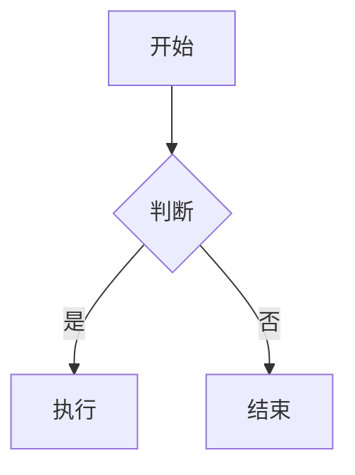

# {{title}} 学习笔记

> [!tip] 学习目标
> 用一句话写清“学完后能独立完成什么”，避免写成“了解 xxx”这种无法验收的表述。

## 📖 难度分段学习路径

| 难度 | 目标 | 核心关注 | 预估时长 |
|---|---|---|---|
| **入门** |  |  | h |
| **进阶** |  |  | h |
| **高级** |  |  | h |

**总学时**：h ｜ **前置知识**：

---

## 📖 第一章 入门（Beginner）

### 1.1 小节标题

**知识点详解**

| 概念 | 说明 | 示例 |
|---|---|---|
|  |  |  |

**填空题**（每章 4 道，答案见章节末尾）

1. 
2. 
3. 
4. 

**答案**：
1. 
2. 
3. 
4. 

### 1.x 本章综合练习

**填空题**
1. 
2. 
3. 
4. 

**本章答案**：
1. 
2. 
3. 
4. 

**综合项目**：写清输入、步骤、产出物、验收标准。

> [!tip] 常见陷阱
> 1. 
> 2. 
> 3. 
> 4. 

> [!note] 本章权威资料
> 只放**实际检索并验证过**的来源（RFC / 官方文档 / 官方仓库）。禁止凭印象写链接。

---

## 📖 第二章 进阶（Intermediate）

> [!warning] 与上一章的衔接
> 写清本章依赖第一章的哪个概念，以及跳过的前置内容会导致哪些误解。

### 2.1 小节标题

（结构同上：知识点详解表 → 填空题 → 本章综合练习 → 常见陷阱 → 权威资料）

---

## 📖 第三章 高级（Advanced）

> [!note] 深度标准
> 高级章节必须包含：机制原理 / 边界条件 / 异常行为 / 可复现的验证命令。

### 3.1 小节标题

（结构同上）

---

## 📚 速查表

| 项 | 值 | 备注 |
|---|---|---|
|  |  |  |

## ❓ 常见问题

> [!faq]- Q：？
> A：

## 🪤 踩坑记录

- [ ] 

## 🔗 关联笔记

- [[]]

---

*由 Hermes Agent 创建于 {{date}} · 状态：进行中*

---
---

# 📘 Obsidian 规范速查（kepano/obsidian-markdown skill）

> [!abstract] 用途
> 本区块是 Obsidian Flavored Markdown 的写作规范与核心语法速查。所有学习笔记必须遵循；复制模板时**不要**把本区块复制进正式笔记。
> 来源 skill：`obsidian-markdown`（工作流：frontmatter → 标准 Markdown 骨架 → wikilinks → embeds → callouts → 阅读视图验证）。

## 1. Properties（frontmatter）

```yaml
---
title: 笔记标题            # 显示名
date: 2026-01-01           # 日期
tags:                     # 检索用标签，优先用嵌套层级
  - learning
  - network/tcp
aliases:                  # 链接建议词，改名不断链
  - TCP
cssclasses:               # 样式钩子
  - learning
status: in-progress       # 自定义字段，按需增删
---
```

规则：`tags` / `aliases` / `cssclasses` 是 Obsidian 识别的默认属性；标签可含字母、数字（不可首位）、下划线、连字符和 `/`，**不支持空格**。

## 2. 内部链接与嵌入

| 语法 | 用途 |
|---|---|
| `[[笔记名]]` | 链接到本库笔记（改文件名会自动跟踪） |
| `[[笔记名\|显示文本]]` | 自定义显示文本 |
| `[[笔记名#标题]]` | 链接到某篇的某个标题 |
| `[[笔记名#^block-id]]` | 链接到块 |
| `![[笔记名]]` | 嵌入整篇内容 |
| `![[笔记名#标题]]` | 嵌入某个章节 |
| `![[图片.png\|300]]` | 嵌入图片并指定宽度 |
| `![[文档.pdf#page=3]]` | 嵌入 PDF 指定页 |

块 ID 写法：段落末尾追加 `^block-id`；列表或引用块则另起一行写 `^block-id`。

> [!tip] 选择规则
> 库内笔记一律用 wikilinks；**站外 URL 一律用标准 Markdown 链接** `[text](url)`。

## 3. Callouts

```markdown
> [!note] 标题
> 正文

> [!tip]
> 正文

> [!warning] 自定义标题
> 正文

> [!faq]- 默认折叠（- 折叠 / + 展开）
> 答案
```

常用类型：`note`、`tip`、`warning`、`info`、`example`、`quote`、`bug`、`danger`、`success`、`failure`、`question`、`abstract`、`todo`。

本仓库约定：`tip` 讲关键理解，`warning` 讲易错点，`note` 放权威资料，`faq` 放折叠问答，`danger` 放安全风险。

## 4. 标签

```markdown
#learning              # 行内标签
#network/tcp           # 嵌套标签，体现层级
```

行内标签与 frontmatter 的 `tags` 可共存，但**同一概念只在一处定义**，避免检索分裂。

## 5. 高亮、注释、脚注

```markdown
==高亮重点==

这是可见 %%隐藏文字%% 的写法。

%%
整块隐藏内容。
%%

带脚注的句子[^1]。

[^1]: 脚注内容。

行内脚注写法^[直接写在这里]。
```

## 6. 公式

```markdown
行内：$O(n \log n)$

块级：
$$
\frac{a}{b} = c
$$
```

## 7. Mermaid 图

````markdown

````

`class X internal-link;` 让节点可点击跳转到库内笔记。协议类笔记优先用 `sequenceDiagram`（握手/时序）和 `graph`（分层/调用关系）。

## 8. 标准 Markdown 骨架

标题层级不跳级（`#` → `##` → `###`）；代码块标语言；表格用于对比型信息；`> [!todo]` 或 `- [ ]` 用于可勾选任务。

---

## ✅ 笔记质量检查清单

写完每篇笔记后逐条核对：

- [ ] frontmatter 完整（title / date / tags / aliases / status）
- [ ] 标签无空格、无中文空格分隔
- [ ] 所有库内关联用 `[[wikilinks]]`，站外用标准 Markdown 链接
- [ ] ==每个 wikilink 都能解析到真实笔记==：Obsidian 大小写敏感，`[[Bash-基础语法]]` 匹配不到 `bash-基础语法.md`；不存在的目标不要留
- [ ] ==页脚/署名不得用 wikilink==：`Hermes Agent` 是产品名不是库内笔记，写纯文本
- [ ] ==同一实体在本篇内表述一致==：同一路径、选项、命令、版本号只允许一种写法（clone 到 A 目录却让配置读 B 目录 = 读者必然踩坑）
- [ ] 关键结论用 `==高亮==` 标出，不靠语气强调
- [ ] 概念关系用 Mermaid 表达（至少 1 张）
- [ ] 每章有「填空题 → 答案」闭环
- [ ] 每章有「常见陷阱」，写**真实易错点**而非套话
- [ ] 资料来源**全部经过检索验证**，禁止凭印象编造链接
- [ ] ==文中每个命令/函数都真实存在==：无法追溯到官方文档的命令名按编造处理；B 站 BV 号用接口核验标题与分P数，课程路径看 HTTP 状态码
- [ ] 无「整节重复」：实战节若与理论表雷同，说明实战从没真写
- [ ] 技术表述可被质疑：时间线、版本、状态机、数值均写明来源 RFC 编号
- [ ] 中英混排统一用简体中文，不出现繁体或无意义英文插词
- [ ] 章节顺序与前置依赖一致，不出现“后文解释前文概念却未声明”
- [ ] 末尾有「速查表 / FAQ / 踩坑 / 关联笔记」
